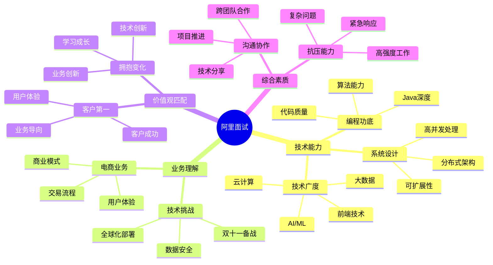

# 阿里巴巴 (Alibaba) 面试题库

## 🏢 公司简介

阿里巴巴集团是中国最大的电商平台，也是全球领先的云计算服务提供商。旗下包括淘宝、天猫、支付宝、阿里云等知名产品。阿里巴巴以其大规模分布式系统、电商技术创新和"客户第一、员工第二、股东第三"的价值观而闻名。

## 📍 面试特点

### 面试流程
1. **简历筛选** - HR初步筛选和背景调查
2. **电话面试** - 技术基础和项目经验
3. **现场面试** - 3-4轮技术面试
4. **交叉面试** - 其他团队技术专家面试
5. **HR面试** - 价值观匹配和综合评估

### 核心价值观 (新六脉神剑)
- **客户第一** - 客户是衣食父母
- **员工第二** - 因为信任，所以简单
- **股东第三** - 唯一不变的是变化
- **拥抱变化** - 迎接变化，勇于创新
- **诚信** - 诚实正直，言行一致
- **激情** - 乐观向上，永不放弃

## 📚 面试题分类

### 核心技术面试题
- [Java开发进阶](./java-advanced.md)
- [分布式系统](./distributed-systems.md)
- [高并发架构](./high-concurrency.md)
- [数据库技术](./database-tech.md)
- [中间件技术](./middleware.md)

### 大数据相关
- [大数据处理](./big-data-processing.md)
- [实时计算](./real-time-computing.md)
- [数据仓库](./data-warehouse.md)
- [搜索推荐](./search-recommendation.md)
- [机器学习](./machine-learning.md)

### 电商业务相关
- [电商系统设计](./ecommerce-systems.md)
- [支付系统](./payment-systems.md)
- [订单系统](./order-systems.md)
- [库存管理](./inventory-management.md)
- [物流系统](./logistics-systems.md)

### 云计算相关
- [云原生架构](./cloud-native.md)
- [容器技术](./container-tech.md)
- [服务网格](./service-mesh.md)
- [监控运维](./monitoring-ops.md)
- [安全技术](./security-tech.md)

### 行为面试题
- [价值观考察](./culture-values.md)
- [团队合作](./teamwork.md)
- [抗压能力](./stress-handling.md)
- [学习能力](./learning-ability.md)
- [创新思维](./innovation.md)

## 💡 面试准备重点

### 技术能力要求
1. **编程基础**：Java深度掌握，了解JVM原理
2. **系统设计**：大规模分布式系统设计经验
3. **中间件**：消息队列、缓存、数据库中间件
4. **大数据**：Hadoop、Spark、Flink等技术栈
5. **云技术**：容器、微服务、云原生技术

### 阿里特色技术
- **分布式架构**：Spring Cloud Alibaba生态
- **中间件体系**：Dubbo、RocketMQ、Nacos等
- **大数据平台**：MaxCompute、DataWorks、Flink
- **云计算服务**：ECS、RDS、OSS等云产品

## 🎯 面试评估维度

## 🔗 相关资源

- [阿里巴巴招聘官网](https://job.alibaba.com/)
- [阿里技术博客](https://developer.aliyun.com/)
- [Spring Cloud Alibaba](https://spring-cloud-alibaba-group.github.io/)
- [阿里开源项目](https://github.com/alibaba)

---
[← 返回公司目录](../README.md) | [← 返回主目录](../../../README.md) 