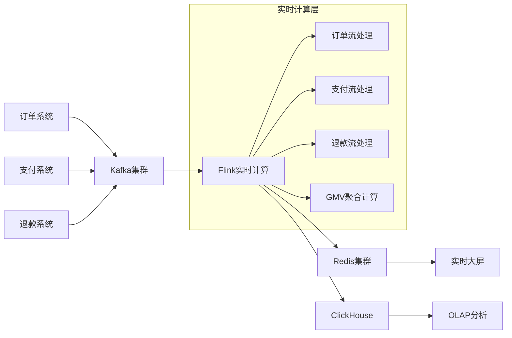
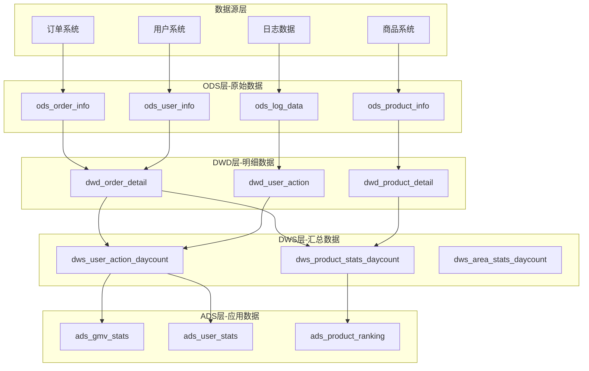

# 阿里巴巴大数据处理面试题

## 📚 题目概览

阿里巴巴大数据处理面试重点考察在大规模数据处理场景下的技术能力，主要涉及Hadoop生态、Spark、Flink实时计算、数据仓库建设等核心技术。

## 🎯 核心技术考察重点

### 分布式计算框架
- **Hadoop生态** - HDFS、MapReduce、YARN资源管理
- **Spark计算** - RDD、DataFrame、Streaming、SQL
- **Flink实时** - 流处理、窗口计算、状态管理
- **数据存储** - HBase、Hive、ClickHouse、MaxCompute

### 实时数据处理
- **流式计算** - 事件时间、水印机制、容错恢复
- **数据同步** - CDC、Binlog解析、实时ETL
- **计算优化** - 反压控制、检查点、状态后端
- **监控运维** - 作业监控、性能调优、故障处理

## 📝 核心面试题目

### 1. 双十一实时数据大屏架构设计

#### 题目1：实时GMV计算系统设计
**问题**：设计双十一实时GMV大屏系统，要求秒级更新，支持多维度统计（地区、品类、店铺）。

**架构设计**：


**核心实现**：
```java
// Flink实时GMV计算
public class RealtimeGMVJob {
    
    public static void main(String[] args) throws Exception {
        StreamExecutionEnvironment env = StreamExecutionEnvironment.getExecutionEnvironment();
        
        // 设置检查点
        env.enableCheckpointing(5000);
        env.getCheckpointConfig().setCheckpointingMode(CheckpointingMode.EXACTLY_ONCE);
        
        // 订单流
        DataStream<OrderEvent> orderStream = env
            .addSource(new FlinkKafkaConsumer<>("order-topic", new OrderEventSchema(), 
                getKafkaProperties()))
            .assignTimestampsAndWatermarks(
                WatermarkStrategy.<OrderEvent>forBoundedOutOfOrderness(Duration.ofSeconds(5))
                    .withTimestampAssigner((event, timestamp) -> event.getEventTime()));
        
        // 支付流
        DataStream<PaymentEvent> paymentStream = env
            .addSource(new FlinkKafkaConsumer<>("payment-topic", new PaymentEventSchema(), 
                getKafkaProperties()))
            .assignTimestampsAndWatermarks(
                WatermarkStrategy.<PaymentEvent>forBoundedOutOfOrderness(Duration.ofSeconds(5))
                    .withTimestampAssigner((event, timestamp) -> event.getEventTime()));
        
        // 计算实时GMV
        DataStream<GMVResult> gmvStream = orderStream
            .connect(paymentStream)
            .process(new GMVCalculationFunction())
            .keyBy(GMVResult::getRegion)
            .window(TumblingEventTimeWindows.of(Time.seconds(10)))
            .aggregate(new GMVAggregateFunction(), new GMVWindowFunction());
        
        // 输出到Redis和ClickHouse
        gmvStream.addSink(new RedisSink<>());
        gmvStream.addSink(new ClickHouseSink<>());
        
        env.execute("Realtime GMV Job");
    }
}

// GMV聚合函数
public class GMVAggregateFunction implements AggregateFunction<GMVResult, GMVAccumulator, GMVResult> {
    
    @Override
    public GMVAccumulator createAccumulator() {
        return new GMVAccumulator();
    }
    
    @Override
    public GMVAccumulator add(GMVResult value, GMVAccumulator accumulator) {
        accumulator.addGMV(value.getAmount());
        accumulator.addOrderCount(value.getOrderCount());
        return accumulator;
    }
    
    @Override
    public GMVResult getResult(GMVAccumulator accumulator) {
        return GMVResult.builder()
            .totalGMV(accumulator.getTotalGMV())
            .orderCount(accumulator.getOrderCount())
            .avgOrderValue(accumulator.getTotalGMV() / accumulator.getOrderCount())
            .build();
    }
    
    @Override
    public GMVAccumulator merge(GMVAccumulator a, GMVAccumulator b) {
        a.merge(b);
        return a;
    }
}
```

### 2. 离线数据仓库建设

#### 题目2：电商数据仓库分层架构
**问题**：设计电商数据仓库的分层架构，包括ODS、DWD、DWS、ADS层的设计原则。

**数据仓库架构**：


### 3. 性能优化案例

#### 题目3：Spark作业性能调优
**问题**：一个Spark作业处理100TB数据耗时8小时，如何优化到2小时内完成？

**优化策略**：
1. **数据倾斜优化**：加盐处理、预聚合
2. **内存管理**：调整executor内存、开启动态分配
3. **序列化优化**：使用Kryo序列化
4. **并行度调整**：增加分区数、合理设置并行度
5. **存储格式**：使用Parquet格式、启用压缩

## 📊 面试评分标准

### 大数据理论基础 (30%)
- **分布式计算原理**：MapReduce、Spark、Flink计算模型
- **数据存储理解**：HDFS、HBase、列式存储原理
- **流计算概念**：事件时间、水印、状态管理
- **数据仓库理论**：维度建模、分层架构、数据治理

### 技术实现能力 (35%)
- **编程能力**：Scala/Java编程、SQL优化
- **框架使用**：Spark/Flink开发经验
- **性能调优**：作业优化、资源调优经验
- **问题排查**：大数据作业问题定位能力

### 架构设计能力 (25%)
- **系统设计**：大数据平台架构设计
- **技术选型**：合适的技术栈选择
- **扩展性考虑**：系统扩展和演进规划
- **成本控制**：资源使用和成本优化

### 业务理解 (10%)
- **电商场景**：对电商大数据场景的理解
- **指标体系**：核心业务指标的理解
- **数据质量**：数据质量保障意识
- **业务价值**：技术方案的业务价值

## 🎯 备考建议

### 技术能力提升
1. **理论学习**：深入学习Hadoop、Spark、Flink核心原理
2. **动手实践**：搭建大数据环境，完成端到端项目
3. **性能调优**：学习各种性能优化技巧和最佳实践
4. **源码阅读**：阅读Spark、Flink等框架源码

### 项目经验积累
1. **实时计算项目**：基于Flink的实时数据处理项目
2. **离线分析项目**：基于Spark的大规模数据分析项目
3. **数据仓库项目**：完整的数据仓库建设项目
4. **优化案例**：大数据作业性能优化实战

### 阿里技术学习
- **MaxCompute**：学习阿里云大数据计算服务
- **DataWorks**：了解阿里数据开发平台
- **实时计算**：学习阿里云Flink服务
- **最佳实践**：学习阿里大数据最佳实践案例

---
[← 返回阿里巴巴面试题库](./README.md) 