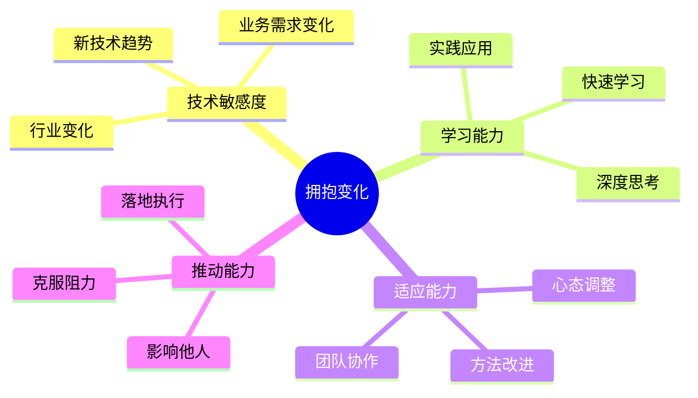

# 阿里巴巴价值观考察面试题

## 📚 题目概览

阿里巴巴价值观面试是所有技术岗位的必考环节，重点考察候选人与阿里"新六脉神剑"价值观的匹配度。面试官会通过STAR方法深入了解候选人的行为模式、思维方式和价值取向。

## 🎯 新六脉神剑核心价值观

### 客户第一
- **内涵**：客户是衣食父母，客户利益至上
- **体现**：以客户价值为导向，持续创造价值
- **技术视角**：用技术解决客户痛点，提升用户体验

### 员工第二  
- **内涵**：因为信任，所以简单
- **体现**：相互信任，开放透明，团队协作
- **技术视角**：技术分享，团队成长，知识传承

### 股东第三
- **内涵**：承担责任，创造价值
- **体现**：对结果负责，追求卓越
- **技术视角**：技术创新驱动业务增长

### 拥抱变化
- **内涵**：唯一不变的是变化
- **体现**：适应变化，拥抱变化，引领变化
- **技术视角**：技术革新，架构演进，持续学习

### 诚信
- **内涵**：诚实正直，言行一致
- **体现**：实事求是，坦诚沟通
- **技术视角**：代码质量，技术诚信，问题透明

### 激情
- **内涵**：乐观向上，永不放弃
- **体现**：积极主动，坚持不懈
- **技术视角**：技术热情，创新动力，持续改进

## 📝 核心面试题目

### 1. 客户第一价值观考察

#### 题目1：为客户解决技术问题的经历
**问题**：请分享一次你为了解决客户/用户问题，主动承担额外工作或克服技术难题的经历。

**STAR回答框架**：
- **Situation（情境）**：描述当时的背景和客户面临的问题
- **Task（任务）**：说明你需要完成的任务和目标
- **Action（行动）**：详细说明你采取的具体行动
- **Result（结果）**：量化说明最终的结果和影响

**优秀回答示例**：
```
Situation: 
在我担任后端开发工程师期间，我们的电商平台在双十一前一周收到大量用户投诉，
反映商品搜索功能响应时间超过5秒，严重影响购物体验。距离大促只有7天时间，
如果不能及时解决，将直接影响用户购买转化率。

Task: 
作为搜索服务的负责人，我需要在极短时间内定位问题根源并给出解决方案，
确保双十一期间搜索服务稳定，响应时间控制在500ms以内。

Action:
1. 问题定位：通过日志分析发现是ES索引设计不合理，单个分片过大导致查询缓慢
2. 技术方案：设计新的索引分片策略，按商品类目和时间进行分片
3. 数据迁移：利用业务低峰期分批迁移数据，确保服务不中断
4. 性能优化：增加查询缓存，优化搜索算法
5. 监控告警：建立实时监控体系，确保问题能够及时发现

这个过程中我连续工作了48小时，主动学习ES集群优化的最佳实践，
还协调了DBA团队和运维团队的资源支持。

Result:
经过努力，搜索响应时间从5秒降低到平均300ms，双十一当天搜索服务
零故障运行，用户搜索转化率相比去年提升了15%，直接为公司创造了
额外2000万元的交易额。这个优化方案后来成为公司的标准实践。
```

**评分要点**：
- **客户导向**：是否真正站在客户角度思考问题
- **主动性**：是否主动承担责任，而非被动应对
- **技术深度**：解决方案的技术含量和创新性
- **结果导向**：是否有明确的量化结果和业务价值

#### 题目2：技术选型中的客户价值考量
**问题**：在技术架构设计或技术选型时，你如何平衡技术先进性和客户体验？请举例说明。

**考察维度**：
- 是否能够从客户价值角度评估技术方案
- 技术决策的出发点是否以客户为中心
- 是否具备将技术优势转化为客户价值的能力

### 2. 拥抱变化价值观考察

#### 题目3：技术变革和学习适应能力
**问题**：请分享一次你面对重大技术变革（如框架升级、架构调整）时的经历，你是如何适应和推进的？

**深度追问**：
1. 当时为什么需要这次技术变革？
2. 你在变革过程中遇到了哪些阻力？
3. 你是如何说服团队接受变革的？
4. 这次变革给你带来了什么启发？

**优秀回答要点**：
- **变革意识**：能够敏锐感知技术趋势和变化必要性
- **学习能力**：快速学习新技术的能力和方法
- **推动能力**：能够影响和带动团队拥抱变化
- **成长思维**：从变革中获得成长和思考



#### 题目4：创新思维和技术突破
**问题**：请描述一次你主动发起技术创新或改进的经历，这个创新解决了什么问题？

**考察要点**：
- **创新意识**：是否具备主动创新的意识和动力
- **问题敏感度**：能否发现现有方案的不足
- **技术深度**：创新方案的技术含量和可行性
- **推广应用**：创新成果的应用和推广情况

### 3. 诚信价值观考察

#### 题目5：技术问题的诚实沟通
**问题**：请分享一次你向上级或客户诚实汇报技术问题或项目风险的经历。

**考察维度**：
- **诚实勇气**：面对困难时是否敢于说真话
- **责任担当**：是否愿意承担责任而非推卸
- **解决方案**：在汇报问题的同时是否提供解决方案
- **沟通技巧**：如何在诚实的基础上有效沟通

**反面案例警示**：
- 隐瞒技术债务和潜在风险
- 夸大技术能力和项目进度
- 推卸责任给其他团队或外部因素
- 不敢承认技术错误和失误

#### 题目6：代码质量和技术诚信
**问题**：在项目紧急情况下，你如何平衡开发速度和代码质量？

**深度探讨**：
- 是否有过为了赶进度而降低代码质量的经历？
- 如何向团队说明技术债务的影响？
- 如何建立可持续的代码质量保障机制？

### 4. 激情价值观考察

#### 题目7：技术热情和持续学习
**问题**：请分享一个你业余时间主动学习新技术或参与开源项目的经历。

**评估标准**：
- **学习主动性**：是否有自驱力进行技术学习
- **技术热情**：对技术的热爱程度和持续性
- **知识分享**：是否愿意分享技术心得和经验
- **社区贡献**：是否有技术社区参与和贡献

**优秀回答特征**：
```
学习动机: 内在驱动，对技术的纯粹热爱
学习方法: 系统性学习，理论结合实践
知识应用: 能够将学习成果应用到工作中
成果分享: 通过博客、演讲等方式分享心得
持续性: 长期坚持，形成学习习惯
```

#### 题目8：面对技术挫折的态度
**问题**：请描述一次你在技术攻关中遇到重大挫折，但最终坚持下来的经历。

**考察重点**：
- **抗压能力**：面对困难时的心理承受能力
- **坚持精神**：是否有不轻易放弃的品质
- **方法调整**：遇到挫折时是否能够调整方法
- **成长收获**：从挫折中获得的成长和启发

### 5. 团队协作价值观考察

#### 题目9：跨团队技术协作经历
**问题**：请分享一次你需要与其他技术团队（如前端、测试、运维）密切协作完成项目的经历。

**STAR分析框架**：
- **沟通协调**：如何与不同背景的团队成员沟通
- **冲突解决**：如何处理技术观点分歧和利益冲突
- **资源整合**：如何整合各方资源实现共同目标
- **团队影响**：如何在非直接管理关系中发挥影响力

#### 题目10：技术知识传承和团队成长
**问题**：请描述你如何帮助团队新人或初级开发者提升技术能力的经历。

**评估维度**：
- **分享意愿**：是否愿意花时间帮助他人成长
- **教学能力**：能否用通俗易懂的方式传授技术知识
- **耐心程度**：面对重复问题时的耐心和态度
- **成长效果**：被帮助者的实际成长情况

## 📊 价值观面试评分标准

### 价值观匹配度 (40%)
- **六脉神剑认知**：对阿里价值观的理解深度
- **行为一致性**：行为表现与价值观的匹配程度
- **内在驱动**：价值观是否是内在信念而非表面迎合
- **文化融入**：是否能够融入阿里的企业文化

### 行为表现 (35%)
- **具体事例**：是否有丰富的具体实例支撑
- **行为模式**：行为是否体现一致的价值观导向
- **主动性**：是否主动践行价值观而非被动应对
- **影响力**：是否能够影响他人践行价值观

### 思维深度 (15%)
- **价值判断**：在复杂情况下的价值观坚持
- **反思能力**：对自己行为的反思和改进
- **成长意识**：从价值观角度的持续成长
- **系统思考**：价值观在工作中的系统性应用

### 表达能力 (10%)
- **逻辑清晰**：回答问题的逻辑性和条理性
- **表达生动**：能否生动具体地描述经历
- **情感真实**：表达的真诚度和感染力
- **互动效果**：与面试官的沟通互动质量

## 🎯 备考建议

### 价值观内化
1. **深度理解**：深入学习阿里价值观的内涵和外延
2. **个人反思**：回顾自己的经历，找出体现价值观的事例
3. **行为对标**：对照价值观要求，调整自己的行为模式
4. **文化认同**：培养对阿里企业文化的认同感

### 事例准备
1. **STAR方法**：用STAR方法整理典型事例
2. **数量充足**：每个价值观准备2-3个不同角度的事例
3. **细节丰富**：事例要有足够的细节支撑
4. **结果量化**：尽量用数据说明事例的结果和影响

### 表达技巧
1. **真诚自然**：避免背书式的回答，要自然真诚
2. **逻辑清晰**：按照时间线或重要性组织回答
3. **重点突出**：突出体现价值观的关键行为
4. **互动沟通**：注意与面试官的眼神交流和互动

### 常见误区
1. **空洞表态**：只有理论表态没有具体事例
2. **价值观错位**：事例体现的价值观与题目要求不符
3. **过度包装**：过分美化自己的行为和动机
4. **细节不足**：事例缺乏足够的细节和说服力

---
[← 返回阿里巴巴面试题库](./README.md) 