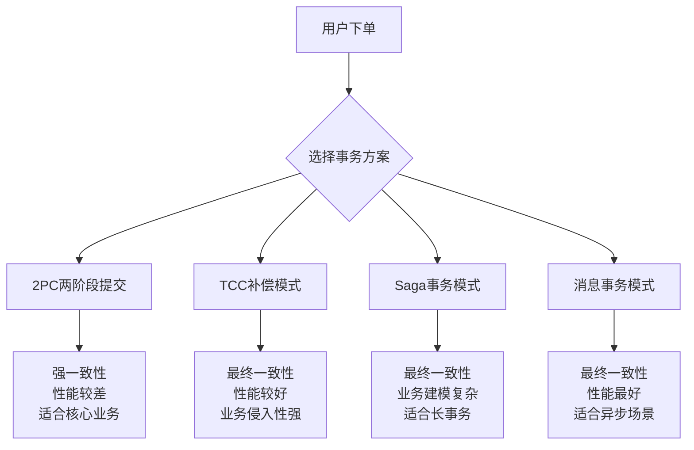
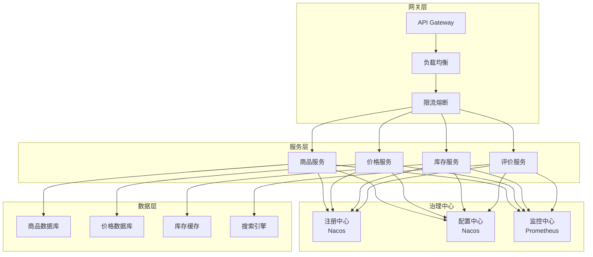

# 阿里巴巴分布式系统面试题

## 📚 题目概览

阿里巴巴分布式系统面试重点考察在大规模、高并发场景下的分布式架构设计能力。面试题目往往结合淘宝、天猫等业务场景，考察分布式一致性、服务治理、分布式事务等核心技术。

## 🎯 核心技术考察重点

### 分布式架构基础
- **服务拆分** - 微服务划分原则和边界设计
- **服务通信** - RPC框架、服务发现、负载均衡
- **数据一致性** - CAP理论、分布式事务、最终一致性
- **分布式存储** - 分库分表、NoSQL、分布式缓存

### 高可用架构
- **容错设计** - 熔断、降级、限流、重试
- **分布式锁** - Redis、ZooKeeper分布式锁实现
- **分布式缓存** - Redis集群、缓存一致性
- **消息队列** - RocketMQ、Kafka可靠性保证

## 📝 核心面试题目

### 1. 分布式事务处理

#### 题目1：电商订单支付的分布式事务
**问题**：设计淘宝下单支付流程，涉及订单服务、库存服务、支付服务、积分服务，如何保证数据一致性？

**分布式事务方案对比**：


**TCC模式实现方案**：
```java
// TCC事务管理器
@Component
public class OrderTccTransactionManager {
    
    private final OrderService orderService;
    private final InventoryService inventoryService;
    private final PaymentService paymentService;
    private final PointsService pointsService;
    
    // 订单支付主流程
    @GlobalTransactional
    public OrderResult processOrder(OrderRequest request) {
        String globalTxId = TccTransactionContext.getGlobalTxId();
        
        try {
            // 1. Try阶段：预留资源
            OrderTryResult orderResult = orderService.tryCreateOrder(request);
            InventoryTryResult inventoryResult = inventoryService.tryReserveStock(
                request.getProductId(), request.getQuantity());
            PaymentTryResult paymentResult = paymentService.tryFreezeFunds(
                request.getUserId(), request.getAmount());
            PointsTryResult pointsResult = pointsService.tryReservePoints(
                request.getUserId(), request.getPointsUsed());
            
            // 2. 验证所有Try操作是否成功
            if (orderResult.isSuccess() && inventoryResult.isSuccess() 
                && paymentResult.isSuccess() && pointsResult.isSuccess()) {
                
                // 记录事务信息
                recordTransactionInfo(globalTxId, request, orderResult, 
                    inventoryResult, paymentResult, pointsResult);
                
                return OrderResult.success(orderResult.getOrderId());
            } else {
                // Try阶段失败，触发Cancel
                throw new TccTransactionException("Try阶段失败");
            }
            
        } catch (Exception e) {
            log.error("订单处理失败，全局事务ID: {}", globalTxId, e);
            throw e;
        }
    }
    
    // Confirm阶段：确认所有操作
    @TccConfirm
    public void confirmOrder(String globalTxId) {
        TransactionInfo txInfo = getTransactionInfo(globalTxId);
        
        try {
            // 并行执行所有Confirm操作
            CompletableFuture<Void> orderConfirm = CompletableFuture.runAsync(() -> 
                orderService.confirmCreateOrder(txInfo.getOrderTryResult()));
            
            CompletableFuture<Void> inventoryConfirm = CompletableFuture.runAsync(() -> 
                inventoryService.confirmReserveStock(txInfo.getInventoryTryResult()));
            
            CompletableFuture<Void> paymentConfirm = CompletableFuture.runAsync(() -> 
                paymentService.confirmFreezeFunds(txInfo.getPaymentTryResult()));
            
            CompletableFuture<Void> pointsConfirm = CompletableFuture.runAsync(() -> 
                pointsService.confirmReservePoints(txInfo.getPointsTryResult()));
            
            // 等待所有Confirm完成
            CompletableFuture.allOf(orderConfirm, inventoryConfirm, 
                paymentConfirm, pointsConfirm).get(10, TimeUnit.SECONDS);
            
            log.info("订单确认成功，全局事务ID: {}", globalTxId);
            
        } catch (Exception e) {
            log.error("订单确认失败，全局事务ID: {}", globalTxId, e);
            // Confirm失败需要人工介入或重试
            scheduleRetryConfirm(globalTxId);
        } finally {
            cleanupTransactionInfo(globalTxId);
        }
    }
    
    // Cancel阶段：回滚所有操作
    @TccCancel
    public void cancelOrder(String globalTxId) {
        TransactionInfo txInfo = getTransactionInfo(globalTxId);
        
        try {
            // 并行执行所有Cancel操作
            CompletableFuture<Void> orderCancel = CompletableFuture.runAsync(() -> 
                orderService.cancelCreateOrder(txInfo.getOrderTryResult()));
            
            CompletableFuture<Void> inventoryCancel = CompletableFuture.runAsync(() -> 
                inventoryService.cancelReserveStock(txInfo.getInventoryTryResult()));
            
            CompletableFuture<Void> paymentCancel = CompletableFuture.runAsync(() -> 
                paymentService.cancelFreezeFunds(txInfo.getPaymentTryResult()));
            
            CompletableFuture<Void> pointsCancel = CompletableFuture.runAsync(() -> 
                pointsService.cancelReservePoints(txInfo.getPointsTryResult()));
            
            // 等待所有Cancel完成（Cancel必须成功）
            CompletableFuture.allOf(orderCancel, inventoryCancel, 
                paymentCancel, pointsCancel).get(10, TimeUnit.SECONDS);
            
            log.info("订单回滚成功，全局事务ID: {}", globalTxId);
            
        } catch (Exception e) {
            log.error("订单回滚失败，全局事务ID: {}", globalTxId, e);
            // Cancel失败需要告警和人工处理
            alertCancelFailure(globalTxId, e);
        } finally {
            cleanupTransactionInfo(globalTxId);
        }
    }
}

// 库存服务TCC实现
@Service
public class InventoryTccService {
    
    private final InventoryRepository inventoryRepository;
    private final RedisTemplate<String, Object> redisTemplate;
    
    // Try：预留库存
    @TccTry
    public InventoryTryResult tryReserveStock(Long productId, Integer quantity) {
        String reserveKey = "inventory:reserve:" + productId + ":" + UUID.randomUUID();
        
        try {
            // 1. 检查库存
            InventoryInfo inventory = inventoryRepository.findByProductId(productId);
            if (inventory.getAvailableStock() < quantity) {
                return InventoryTryResult.failure("库存不足");
            }
            
            // 2. 预留库存（使用乐观锁）
            boolean success = inventoryRepository.tryReserveStock(
                productId, quantity, inventory.getVersion());
            
            if (!success) {
                return InventoryTryResult.failure("库存预留失败，并发冲突");
            }
            
            // 3. 记录预留信息到Redis（设置过期时间）
            ReserveInfo reserveInfo = new ReserveInfo(productId, quantity, 
                System.currentTimeMillis());
            redisTemplate.opsForValue().set(reserveKey, reserveInfo, 
                Duration.ofMinutes(30));
            
            return InventoryTryResult.success(reserveKey);
            
        } catch (Exception e) {
            log.error("库存预留异常", e);
            return InventoryTryResult.failure("系统异常");
        }
    }
    
    // Confirm：确认库存扣减
    @TccConfirm
    public void confirmReserveStock(InventoryTryResult tryResult) {
        String reserveKey = tryResult.getReserveKey();
        
        try {
            // 1. 获取预留信息
            ReserveInfo reserveInfo = (ReserveInfo) redisTemplate.opsForValue().get(reserveKey);
            if (reserveInfo == null) {
                log.warn("预留信息不存在，可能已被处理: {}", reserveKey);
                return;
            }
            
            // 2. 确认扣减库存
            inventoryRepository.confirmReduceStock(
                reserveInfo.getProductId(), reserveInfo.getQuantity());
            
            // 3. 清理预留信息
            redisTemplate.delete(reserveKey);
            
            log.info("库存确认成功: {}", reserveKey);
            
        } catch (Exception e) {
            log.error("库存确认失败: {}", reserveKey, e);
            throw new TccConfirmException("库存确认失败", e);
        }
    }
    
    // Cancel：取消库存预留
    @TccCancel
    public void cancelReserveStock(InventoryTryResult tryResult) {
        String reserveKey = tryResult.getReserveKey();
        
        try {
            // 1. 获取预留信息
            ReserveInfo reserveInfo = (ReserveInfo) redisTemplate.opsForValue().get(reserveKey);
            if (reserveInfo == null) {
                log.warn("预留信息不存在，可能已被处理: {}", reserveKey);
                return;
            }
            
            // 2. 释放预留库存
            inventoryRepository.releaseReservedStock(
                reserveInfo.getProductId(), reserveInfo.getQuantity());
            
            // 3. 清理预留信息
            redisTemplate.delete(reserveKey);
            
            log.info("库存回滚成功: {}", reserveKey);
            
        } catch (Exception e) {
            log.error("库存回滚失败: {}", reserveKey, e);
            // Cancel失败是严重问题，需要告警
            alertCancelFailure(reserveKey, e);
        }
    }
}
```

#### 题目2：基于消息的最终一致性方案
**问题**：如何使用RocketMQ实现分布式事务，确保消息发送和本地事务的一致性？

**消息事务实现**：
```java
// 订单消息事务实现
@Service
public class OrderMessageTransactionService {
    
    private final OrderRepository orderRepository;
    private final RocketMQTemplate rocketMQTemplate;
    
    // 发送事务消息
    public void createOrderWithMessage(OrderCreateRequest request) {
        String transactionId = UUID.randomUUID().toString();
        
        // 构建消息
        OrderCreatedMessage message = OrderCreatedMessage.builder()
            .orderId(request.getOrderId())
            .userId(request.getUserId())
            .productId(request.getProductId())
            .quantity(request.getQuantity())
            .amount(request.getAmount())
            .timestamp(System.currentTimeMillis())
            .build();
        
        // 发送事务消息
        rocketMQTemplate.sendMessageInTransaction(
            "order-topic", 
            MessageBuilder.withPayload(message)
                .setHeader("transactionId", transactionId)
                .setHeader("orderRequest", request)
                .build(),
            request // 传递给本地事务的参数
        );
    }
    
    // 本地事务执行
    @RocketMQTransactionListener
    public class OrderTransactionListener implements RocketMQLocalTransactionListener {
        
        @Override
        public RocketMQLocalTransactionState executeLocalTransaction(
                Message msg, Object arg) {
            
            String transactionId = (String) msg.getHeaders().get("transactionId");
            OrderCreateRequest request = (OrderCreateRequest) arg;
            
            try {
                // 执行本地事务
                Order order = new Order();
                order.setId(request.getOrderId());
                order.setUserId(request.getUserId());
                order.setProductId(request.getProductId());
                order.setQuantity(request.getQuantity());
                order.setAmount(request.getAmount());
                order.setStatus(OrderStatus.CREATED);
                order.setTransactionId(transactionId);
                
                orderRepository.save(order);
                
                // 记录事务状态
                recordTransactionState(transactionId, TransactionState.COMMIT);
                
                log.info("本地事务执行成功，事务ID: {}", transactionId);
                return RocketMQLocalTransactionState.COMMIT;
                
            } catch (Exception e) {
                log.error("本地事务执行失败，事务ID: {}", transactionId, e);
                recordTransactionState(transactionId, TransactionState.ROLLBACK);
                return RocketMQLocalTransactionState.ROLLBACK;
            }
        }
        
        @Override
        public RocketMQLocalTransactionState checkLocalTransaction(Message msg) {
            String transactionId = (String) msg.getHeaders().get("transactionId");
            
            try {
                // 查询本地事务状态
                TransactionState state = getTransactionState(transactionId);
                
                return switch (state) {
                    case COMMIT -> RocketMQLocalTransactionState.COMMIT;
                    case ROLLBACK -> RocketMQLocalTransactionState.ROLLBACK;
                    case UNKNOWN -> RocketMQLocalTransactionState.UNKNOWN;
                };
                
            } catch (Exception e) {
                log.error("检查本地事务状态失败，事务ID: {}", transactionId, e);
                return RocketMQLocalTransactionState.UNKNOWN;
            }
        }
    }
}

// 下游服务消息消费
@Service
@RocketMQMessageListener(topic = "order-topic", consumerGroup = "inventory-consumer")
public class InventoryMessageConsumer implements RocketMQListener<OrderCreatedMessage> {
    
    private final InventoryService inventoryService;
    private final RedisTemplate<String, Object> redisTemplate;
    
    @Override
    public void onMessage(OrderCreatedMessage message) {
        String orderId = message.getOrderId();
        String idempotentKey = "inventory:processed:" + orderId;
        
        try {
            // 1. 幂等性检查
            if (Boolean.TRUE.equals(redisTemplate.hasKey(idempotentKey))) {
                log.info("订单库存已处理，跳过: {}", orderId);
                return;
            }
            
            // 2. 处理库存扣减
            InventoryResult result = inventoryService.reduceStock(
                message.getProductId(), message.getQuantity());
            
            if (result.isSuccess()) {
                // 3. 标记处理完成
                redisTemplate.opsForValue().set(idempotentKey, true, Duration.ofDays(7));
                
                // 4. 发送库存扣减成功消息
                publishInventoryReducedMessage(message, result);
                
                log.info("库存扣减成功，订单: {}", orderId);
            } else {
                // 库存不足，发送失败消息
                publishInventoryInsufficientMessage(message);
                log.warn("库存不足，订单: {}", orderId);
            }
            
        } catch (Exception e) {
            log.error("处理订单库存失败，订单: {}", orderId, e);
            // 抛出异常触发重试
            throw new MessageConsumptionException("库存处理失败", e);
        }
    }
}
```

### 2. 服务治理和微服务架构

#### 题目3：淘宝商品服务的服务治理
**问题**：设计淘宝商品中心的微服务架构，包括服务发现、负载均衡、熔断降级、限流等治理能力。

**服务治理架构**：


**服务治理实现**：
```java
// 商品服务主类
@SpringBootApplication
@EnableDiscoveryClient
@EnableFeignClients
public class ProductServiceApplication {
    
    public static void main(String[] args) {
        SpringApplication.run(ProductServiceApplication.class, args);
    }
    
    // 自定义负载均衡规则
    @Bean
    public IRule loadBalanceRule() {
        return new WeightedResponseTimeRule();
    }
    
    // Sentinel限流规则配置
    @PostConstruct
    public void initSentinelRules() {
        // 限流规则
        List<FlowRule> flowRules = new ArrayList<>();
        FlowRule flowRule = new FlowRule();
        flowRule.setResource("getProductDetail");
        flowRule.setGrade(RuleConstant.FLOW_GRADE_QPS);
        flowRule.setCount(1000); // QPS限制1000
        flowRule.setStrategy(RuleConstant.STRATEGY_DIRECT);
        flowRules.add(flowRule);
        FlowRuleManager.loadRules(flowRules);
        
        // 熔断规则
        List<DegradeRule> degradeRules = new ArrayList<>();
        DegradeRule degradeRule = new DegradeRule();
        degradeRule.setResource("getProductDetail");
        degradeRule.setGrade(RuleConstant.DEGRADE_GRADE_EXCEPTION_RATIO);
        degradeRule.setCount(0.1); // 异常比例10%
        degradeRule.setTimeWindow(10); // 熔断时间10秒
        degradeRules.add(degradeRule);
        DegradeRuleManager.loadRules(degradeRules);
    }
}

// 商品服务核心业务
@RestController
@RequestMapping("/product")
public class ProductController {
    
    private final ProductService productService;
    private final PriceService priceService;
    private final InventoryService inventoryService;
    
    // 商品详情聚合接口
    @GetMapping("/{productId}")
    @SentinelResource(value = "getProductDetail", 
                     blockHandler = "handleFlowLimit",
                     fallback = "getProductDetailFallback")
    public ResponseEntity<ProductDetailVO> getProductDetail(@PathVariable Long productId) {
        
        try {
            // 1. 并行获取商品基础信息、价格、库存
            CompletableFuture<Product> productFuture = CompletableFuture
                .supplyAsync(() -> productService.getProductById(productId));
            
            CompletableFuture<Price> priceFuture = CompletableFuture
                .supplyAsync(() -> priceService.getPrice(productId));
            
            CompletableFuture<Inventory> inventoryFuture = CompletableFuture
                .supplyAsync(() -> inventoryService.getInventory(productId));
            
            // 2. 等待所有异步任务完成
            CompletableFuture.allOf(productFuture, priceFuture, inventoryFuture)
                .get(500, TimeUnit.MILLISECONDS); // 500ms超时
            
            // 3. 聚合结果
            Product product = productFuture.get();
            Price price = priceFuture.get();
            Inventory inventory = inventoryFuture.get();
            
            ProductDetailVO detail = buildProductDetail(product, price, inventory);
            return ResponseEntity.ok(detail);
            
        } catch (TimeoutException e) {
            log.warn("获取商品详情超时: {}", productId);
            return getProductDetailFallback(productId);
        } catch (Exception e) {
            log.error("获取商品详情异常: {}", productId, e);
            throw new ProductServiceException("获取商品详情失败", e);
        }
    }
    
    // 限流处理
    public ResponseEntity<ProductDetailVO> handleFlowLimit(Long productId, 
                                                         BlockException ex) {
        log.warn("商品详情接口被限流: {}", productId);
        return ResponseEntity.status(429).body(
            ProductDetailVO.builder()
                .productId(productId)
                .message("系统繁忙，请稍后重试")
                .build());
    }
    
    // 降级处理
    public ResponseEntity<ProductDetailVO> getProductDetailFallback(Long productId) {
        log.warn("商品详情接口降级: {}", productId);
        
        // 返回基础信息
        Product product = productService.getProductFromCache(productId);
        if (product != null) {
            ProductDetailVO detail = ProductDetailVO.builder()
                .productId(productId)
                .title(product.getTitle())
                .image(product.getMainImage())
                .message("部分信息暂时无法显示")
                .build();
            return ResponseEntity.ok(detail);
        }
        
        return ResponseEntity.status(503).body(
            ProductDetailVO.builder()
                .productId(productId)
                .message("商品信息暂时无法获取")
                .build());
    }
}

// 价格服务Feign客户端
@FeignClient(name = "price-service", 
            fallback = PriceServiceFallback.class,
            configuration = PriceServiceConfiguration.class)
public interface PriceService {
    
    @GetMapping("/price/{productId}")
    Price getPrice(@PathVariable("productId") Long productId);
    
    @GetMapping("/price/batch")
    Map<Long, Price> getBatchPrice(@RequestParam("productIds") List<Long> productIds);
}

// 价格服务降级实现
@Component
public class PriceServiceFallback implements PriceService {
    
    private final RedisTemplate<String, Object> redisTemplate;
    
    @Override
    public Price getPrice(Long productId) {
        // 尝试从缓存获取价格
        Price cachedPrice = (Price) redisTemplate.opsForValue()
            .get("price:cache:" + productId);
        
        if (cachedPrice != null) {
            log.info("从缓存获取商品价格: {}", productId);
            return cachedPrice;
        }
        
        // 返回默认价格
        log.warn("价格服务不可用，返回默认价格: {}", productId);
        return Price.builder()
            .productId(productId)
            .price(BigDecimal.ZERO)
            .available(false)
            .message("价格暂时无法获取")
            .build();
    }
    
    @Override
    public Map<Long, Price> getBatchPrice(List<Long> productIds) {
        return productIds.stream()
            .collect(Collectors.toMap(id -> id, this::getPrice));
    }
}

// Feign客户端配置
@Configuration
public class PriceServiceConfiguration {
    
    // 自定义重试策略
    @Bean
    public Retryer feignRetryer() {
        return new Retryer.Default(100, 1000, 3);
    }
    
    // 超时配置
    @Bean
    public Request.Options feignOptions() {
        return new Request.Options(1000, 3000); // 连接超时1s，读取超时3s
    }
    
    // 自定义错误解码器
    @Bean
    public ErrorDecoder errorDecoder() {
        return new CustomErrorDecoder();
    }
}

// 服务监控和健康检查
@Component
public class ServiceHealthIndicator implements HealthIndicator {
    
    private final PriceService priceService;
    private final InventoryService inventoryService;
    
    @Override
    public Health health() {
        Health.Builder builder = Health.up();
        
        try {
            // 检查依赖服务健康状态
            checkPriceService(builder);
            checkInventoryService(builder);
            
        } catch (Exception e) {
            return Health.down(e).build();
        }
        
        return builder.build();
    }
    
    private void checkPriceService(Health.Builder builder) {
        try {
            // 调用价格服务健康检查接口
            ResponseEntity<String> response = restTemplate.getForEntity(
                "http://price-service/actuator/health", String.class);
            
            if (response.getStatusCode().is2xxSuccessful()) {
                builder.withDetail("price-service", "UP");
            } else {
                builder.withDetail("price-service", "DOWN");
            }
        } catch (Exception e) {
            builder.withDetail("price-service", "DOWN - " + e.getMessage());
        }
    }
}
```

## 📊 面试评分标准

### 分布式理论基础 (35%)
- **CAP理论理解**：一致性、可用性、分区容错性的权衡
- **分布式事务**：2PC、TCC、Saga等方案的适用场景
- **数据一致性**：强一致性vs最终一致性的选择
- **分布式锁**：各种分布式锁实现的优缺点

### 架构设计能力 (30%)
- **微服务拆分**：服务边界划分和依赖关系设计
- **服务治理**：注册发现、负载均衡、熔断降级
- **可扩展性**：水平扩展、弹性伸缩设计
- **高可用设计**：容错、恢复、降级机制

### 技术实现深度 (25%)
- **中间件应用**：消息队列、缓存、注册中心的深度使用
- **性能优化**：分布式系统性能瓶颈识别和优化
- **监控运维**：分布式链路追踪、日志聚合、指标监控
- **问题排查**：分布式系统故障定位和解决

### 业务场景理解 (10%)
- **电商场景**：对阿里电商业务的理解和技术挑战认知
- **大促经验**：双十一等大促场景的技术准备和应对
- **用户体验**：分布式系统对用户体验的影响
- **商业价值**：技术架构对业务发展的支撑作用

## 🎯 备考建议

### 理论基础强化
1. **分布式理论**：深入学习CAP、BASE理论，理解各种一致性模型
2. **分布式算法**：掌握Paxos、Raft等分布式一致性算法
3. **架构模式**：学习微服务、SOA等分布式架构模式
4. **设计原则**：理解高内聚低耦合、单一职责等设计原则

### 实践项目建议
1. **微服务项目**：使用Spring Cloud Alibaba构建完整微服务系统
2. **分布式事务**：实现TCC、Saga等分布式事务方案
3. **服务治理**：搭建完整的服务注册、发现、监控体系
4. **中间件使用**：深度使用RocketMQ、Nacos、Sentinel等阿里中间件

### 阿里技术生态学习
- **Spring Cloud Alibaba**：Nacos、Sentinel、RocketMQ、Dubbo集成
- **阿里开源中间件**：深入了解实现原理和最佳实践
- **分布式数据库**：了解阿里云数据库产品和分库分表方案
- **云原生技术**：容器化、服务网格等现代分布式技术

---
[← 返回阿里巴巴面试题库](./README.md) 