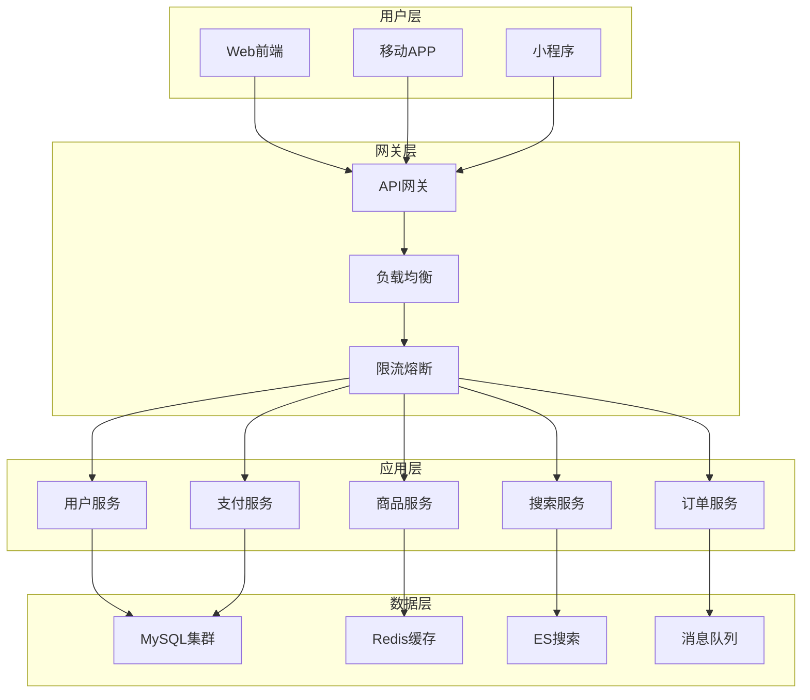
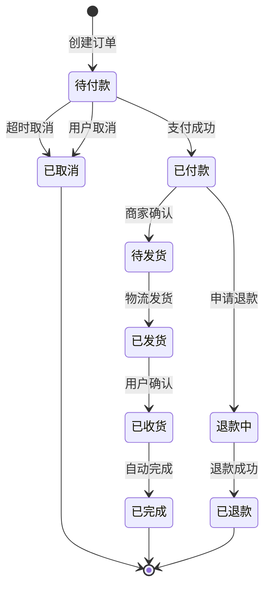

# 阿里巴巴电商系统设计面试题

## 📚 题目概览

电商系统设计是阿里巴巴面试的核心内容，考察候选人对大规模电商平台的架构设计、业务理解和技术实现能力。题目涵盖交易系统、商品系统、用户系统、搜索推荐等核心业务模块。

## 🛒 核心业务模块

### 商品中心系统
- **商品信息管理**：SPU/SKU模型、属性管理
- **商品搜索**：ES搜索引擎、个性化推荐
- **库存管理**：实时库存、预扣库存
- **价格系统**：动态定价、促销活动

### 交易中心系统
- **购物车**：临时购物车、持久化购物车
- **订单系统**：订单生成、状态流转
- **支付系统**：支付网关、风控系统
- **物流系统**：配送路由、物流跟踪

### 用户中心系统
- **用户管理**：注册登录、权限管理
- **会员体系**：等级权益、积分系统
- **个人中心**：订单查询、收货地址
- **客服系统**：在线客服、工单系统

## 📝 核心面试题目

### 1. 整体架构设计

#### 题目1：设计千万用户的电商平台整体架构
**问题**：请设计一个支撑1000万用户的电商平台，要求支持日订单量100万，峰值QPS 10万。

**架构设计要点**：



**技术栈选择**：
```yaml
# 架构技术栈
前端技术:
  - Vue.js/React: 前端框架
  - 微前端架构: qiankun
  - PWA: 渐进式Web应用

后端技术:
  - Java/Spring Boot: 微服务框架
  - Spring Cloud Alibaba: 微服务生态
  - Dubbo: 服务治理
  - Nacos: 配置中心和注册中心

数据存储:
  - MySQL: 主要业务数据
  - Redis: 缓存和会话
  - MongoDB: 日志和非结构化数据
  - Elasticsearch: 搜索引擎

中间件:
  - RocketMQ: 消息队列
  - Canal: 数据同步
  - XXL-Job: 分布式任务调度
  - Sentinel: 流量控制
```

#### 题目2：双十一大促备战架构设计
**问题**：如何设计系统架构支撑双十一大促，预估峰值QPS达到50万，订单量突破1000万？

**关键设计方案**：

1. **弹性扩容策略**
```java
// 自动扩容配置
@Component
@Slf4j
public class AutoScalingManager {
    
    @Autowired
    private MetricsCollector metricsCollector;
    
    @Autowired
    private ContainerOrchestrator orchestrator;
    
    @Scheduled(fixedDelay = 30000)
    public void checkAndScale() {
        // 监控关键指标
        Metrics metrics = metricsCollector.getCurrentMetrics();
        
        // CPU使用率 > 70% 且持续2分钟
        if (metrics.getCpuUsage() > 0.7 && 
            metrics.getCpuHighDuration() > Duration.ofMinutes(2)) {
            
            // 扩容实例
            int currentInstances = orchestrator.getCurrentInstanceCount();
            int targetInstances = Math.min(currentInstances * 2, 200);
            
            orchestrator.scaleOut("order-service", targetInstances);
            log.info("扩容订单服务: {} -> {}", currentInstances, targetInstances);
        }
        
        // QPS > 阈值且响应时间增加
        if (metrics.getQps() > 10000 && metrics.getAvgResponseTime() > 1000) {
            // 启用降级策略
            enableDegradation();
        }
    }
}
```

2. **缓存预热策略**
```java
@Service
public class CacheWarmupService {
    
    @Autowired
    private RedisTemplate<String, Object> redisTemplate;
    
    @Autowired
    private ProductService productService;
    
    // 大促前缓存预热
    @EventListener
    public void onPromotionStart(PromotionStartEvent event) {
        // 预热热门商品
        List<Long> hotProductIds = getHotProductIds();
        hotProductIds.parallelStream().forEach(this::warmupProduct);
        
        // 预热商品分类
        List<Category> categories = categoryService.getAllCategories();
        categories.forEach(category -> {
            String cacheKey = "category:" + category.getId();
            redisTemplate.opsForValue().set(cacheKey, category, 1, TimeUnit.HOURS);
        });
        
        // 预热用户信息
        warmupUserProfiles();
    }
    
    private void warmupProduct(Long productId) {
        try {
            Product product = productService.getProductById(productId);
            String cacheKey = "product:" + productId;
            redisTemplate.opsForValue().set(cacheKey, product, 30, TimeUnit.MINUTES);
        } catch (Exception e) {
            log.error("预热商品失败: productId={}", productId, e);
        }
    }
}
```

### 2. 商品系统设计

#### 题目3：设计电商商品信息管理系统
**问题**：设计支持多商家、多品类的商品信息管理系统，要求支持复杂的商品属性和规格。

**数据模型设计**：
```sql
-- SPU表（标准产品单位）
CREATE TABLE `spu_info` (
  `id` bigint(20) NOT NULL AUTO_INCREMENT,
  `spu_name` varchar(200) NOT NULL COMMENT '商品名称',
  `category_id` bigint(20) NOT NULL COMMENT '分类ID',
  `brand_id` bigint(20) NOT NULL COMMENT '品牌ID',
  `publish_status` tinyint(4) NOT NULL DEFAULT '0' COMMENT '发布状态',
  `create_time` datetime NOT NULL DEFAULT CURRENT_TIMESTAMP,
  PRIMARY KEY (`id`),
  KEY `idx_category_brand` (`category_id`, `brand_id`)
) ENGINE=InnoDB DEFAULT CHARSET=utf8mb4;

-- SKU表（库存量单位）
CREATE TABLE `sku_info` (
  `id` bigint(20) NOT NULL AUTO_INCREMENT,
  `spu_id` bigint(20) NOT NULL COMMENT 'SPU ID',
  `sku_name` varchar(255) NOT NULL COMMENT 'SKU名称',
  `sku_code` varchar(100) NOT NULL COMMENT 'SKU编码',
  `price` decimal(10,2) NOT NULL COMMENT '价格',
  `stock` int(11) NOT NULL DEFAULT '0' COMMENT '库存',
  `sale_count` int(11) NOT NULL DEFAULT '0' COMMENT '销量',
  `sku_default_img` varchar(500) DEFAULT NULL COMMENT '默认图片',
  PRIMARY KEY (`id`),
  UNIQUE KEY `uk_sku_code` (`sku_code`),
  KEY `idx_spu_id` (`spu_id`)
) ENGINE=InnoDB DEFAULT CHARSET=utf8mb4;

-- 商品属性表
CREATE TABLE `product_attr` (
  `id` bigint(20) NOT NULL AUTO_INCREMENT,
  `attr_name` varchar(100) NOT NULL COMMENT '属性名',
  `search_type` tinyint(4) NOT NULL COMMENT '是否检索',
  `value_type` tinyint(4) NOT NULL COMMENT '值类型',
  `category_id` bigint(20) NOT NULL COMMENT '分类ID',
  PRIMARY KEY (`id`),
  KEY `idx_category_id` (`category_id`)
) ENGINE=InnoDB DEFAULT CHARSET=utf8mb4;

-- SKU属性值表
CREATE TABLE `sku_sale_attr_value` (
  `id` bigint(20) NOT NULL AUTO_INCREMENT,
  `sku_id` bigint(20) NOT NULL COMMENT 'SKU ID',
  `attr_id` bigint(20) NOT NULL COMMENT '属性ID',
  `attr_name` varchar(100) NOT NULL COMMENT '属性名',
  `attr_value` varchar(200) NOT NULL COMMENT '属性值',
  PRIMARY KEY (`id`),
  KEY `idx_sku_id` (`sku_id`),
  KEY `idx_attr_id` (`attr_id`)
) ENGINE=InnoDB DEFAULT CHARSET=utf8mb4;
```

**商品服务实现**：
```java
@Service
@Slf4j
public class ProductService {
    
    @Autowired
    private SpuInfoMapper spuMapper;
    
    @Autowired
    private SkuInfoMapper skuMapper;
    
    @Autowired
    private RedisTemplate<String, Object> redisTemplate;
    
    // 商品详情查询（多级缓存）
    public ProductDetailVo getProductDetail(Long skuId) {
        // L1缓存：本地缓存
        ProductDetailVo cachedProduct = localCache.get("product:" + skuId);
        if (cachedProduct != null) {
            return cachedProduct;
        }
        
        // L2缓存：Redis缓存
        String cacheKey = "product:detail:" + skuId;
        ProductDetailVo product = (ProductDetailVo) redisTemplate.opsForValue().get(cacheKey);
        
        if (product == null) {
            // 缓存未命中，查询数据库
            product = buildProductDetail(skuId);
            
            if (product != null) {
                // 设置Redis缓存，过期时间30分钟
                redisTemplate.opsForValue().set(cacheKey, product, 30, TimeUnit.MINUTES);
                
                // 设置本地缓存，过期时间5分钟
                localCache.put("product:" + skuId, product, 5, TimeUnit.MINUTES);
            }
        }
        
        return product;
    }
    
    private ProductDetailVo buildProductDetail(Long skuId) {
        // 查询SKU基本信息
        SkuInfo skuInfo = skuMapper.selectById(skuId);
        if (skuInfo == null) {
            return null;
        }
        
        // 查询SPU信息
        SpuInfo spuInfo = spuMapper.selectById(skuInfo.getSpuId());
        
        // 查询SKU属性
        List<SkuSaleAttrValue> saleAttrs = skuSaleAttrValueMapper.selectBySkuId(skuId);
        
        // 查询同SPU下的其他SKU
        List<SkuInfo> skuList = skuMapper.selectBySpuId(skuInfo.getSpuId());
        
        // 构建返回对象
        ProductDetailVo productDetail = new ProductDetailVo();
        productDetail.setSkuInfo(skuInfo);
        productDetail.setSpuInfo(spuInfo);
        productDetail.setSaleAttrs(saleAttrs);
        productDetail.setSkuList(skuList);
        
        return productDetail;
    }
    
    // 商品上架
    @Transactional
    public void publishProduct(Long spuId) {
        // 1. 更新SPU状态
        SpuInfo spuInfo = new SpuInfo();
        spuInfo.setId(spuId);
        spuInfo.setPublishStatus(ProductConstant.StatusEnum.SPU_UP.getCode());
        spuMapper.updateById(spuInfo);
        
        // 2. 同步到ES搜索引擎
        List<SkuInfo> skuList = skuMapper.selectBySpuId(spuId);
        List<SkuEsModel> skuEsModels = skuList.stream()
            .map(this::convertToEsModel)
            .collect(Collectors.toList());
        
        // 3. 发送上架消息
        ProductUpMessage message = new ProductUpMessage();
        message.setSpuId(spuId);
        message.setSkuList(skuEsModels);
        
        rocketMQTemplate.syncSend("product-up-topic", message);
        
        // 4. 清除相关缓存
        clearProductCache(spuId);
    }
}
```

### 3. 订单系统设计

#### 题目4：设计高并发订单系统
**问题**：设计一个支撑秒杀场景的订单系统，要求处理突发流量，保证数据一致性。

**订单状态机设计**：


**订单创建流程**：
```java
@Service
@Transactional
public class OrderService {
    
    @Autowired
    private OrderMapper orderMapper;
    
    @Autowired
    private ProductService productService;
    
    @Autowired
    private InventoryService inventoryService;
    
    @Autowired
    private DistributedLock distributedLock;
    
    // 创建订单
    public OrderCreateResult createOrder(OrderCreateRequest request) {
        String lockKey = "order:create:" + request.getUserId();
        
        return distributedLock.execute(lockKey, 30, TimeUnit.SECONDS, () -> {
            // 1. 参数校验
            validateOrderRequest(request);
            
            // 2. 检查商品信息和库存
            List<OrderItem> orderItems = validateAndBuildOrderItems(request.getItems());
            
            // 3. 计算订单金额
            BigDecimal totalAmount = calculateTotalAmount(orderItems);
            
            // 4. 预扣库存
            boolean stockReserved = inventoryService.reserveStock(orderItems);
            if (!stockReserved) {
                throw new BusinessException("库存不足");
            }
            
            try {
                // 5. 创建订单
                Order order = buildOrder(request, orderItems, totalAmount);
                orderMapper.insert(order);
                
                // 6. 创建订单明细
                orderItems.forEach(item -> {
                    item.setOrderId(order.getId());
                    orderItemMapper.insert(item);
                });
                
                // 7. 发送订单创建消息
                OrderCreatedEvent event = new OrderCreatedEvent(order);
                eventPublisher.publishEvent(event);
                
                return OrderCreateResult.success(order.getOrderSn());
                
            } catch (Exception e) {
                // 回滚库存预扣
                inventoryService.rollbackStock(orderItems);
                throw e;
            }
        });
    }
    
    // 订单支付回调
    @EventListener
    @Async
    public void onPaymentSuccess(PaymentSuccessEvent event) {
        String orderSn = event.getOrderSn();
        
        // 更新订单状态
        Order order = orderMapper.selectByOrderSn(orderSn);
        if (order != null && order.getStatus() == OrderStatus.PENDING_PAYMENT) {
            order.setStatus(OrderStatus.PAID);
            order.setPayTime(new Date());
            orderMapper.updateById(order);
            
            // 确认扣减库存
            List<OrderItem> orderItems = orderItemMapper.selectByOrderId(order.getId());
            inventoryService.confirmStock(orderItems);
            
            // 发送订单支付成功消息
            OrderPaidEvent paidEvent = new OrderPaidEvent(order);
            eventPublisher.publishEvent(paidEvent);
        }
    }
    
    // 订单超时取消
    @Scheduled(fixedDelay = 60000)
    public void cancelExpiredOrders() {
        // 查询超时未支付订单（30分钟）
        Date expireTime = new Date(System.currentTimeMillis() - 30 * 60 * 1000);
        List<Order> expiredOrders = orderMapper.selectExpiredOrders(expireTime);
        
        for (Order order : expiredOrders) {
            try {
                cancelOrder(order.getId(), "超时自动取消");
            } catch (Exception e) {
                log.error("取消超时订单失败: orderId={}", order.getId(), e);
            }
        }
    }
}
```

### 4. 搜索推荐系统

#### 题目5：设计商品搜索推荐系统
**问题**：设计一个智能的商品搜索推荐系统，支持多维度搜索、个性化推荐。

**搜索架构设计**：
```java
@Service
public class ProductSearchService {
    
    @Autowired
    private ElasticsearchRestTemplate esTemplate;
    
    @Autowired
    private RecommendationEngine recommendationEngine;
    
    // 商品搜索
    public SearchResult<ProductSearchVo> searchProducts(ProductSearchParam param) {
        // 构建查询条件
        BoolQueryBuilder boolQuery = QueryBuilders.boolQuery();
        
        // 关键词搜索
        if (StringUtils.isNotBlank(param.getKeyword())) {
            boolQuery.must(QueryBuilders.multiMatchQuery(param.getKeyword())
                .field("skuTitle", 2.0f)
                .field("spuName", 1.5f)
                .field("brandName", 1.0f)
                .field("categoryName", 1.0f));
        }
        
        // 分类过滤
        if (param.getCategoryId() != null) {
            boolQuery.filter(QueryBuilders.termQuery("categoryId", param.getCategoryId()));
        }
        
        // 品牌过滤
        if (CollectionUtils.isNotEmpty(param.getBrandIds())) {
            boolQuery.filter(QueryBuilders.termsQuery("brandId", param.getBrandIds()));
        }
        
        // 价格区间过滤
        if (param.getMinPrice() != null || param.getMaxPrice() != null) {
            RangeQueryBuilder rangeQuery = QueryBuilders.rangeQuery("price");
            if (param.getMinPrice() != null) {
                rangeQuery.gte(param.getMinPrice());
            }
            if (param.getMaxPrice() != null) {
                rangeQuery.lte(param.getMaxPrice());
            }
            boolQuery.filter(rangeQuery);
        }
        
        // 构建搜索请求
        NativeSearchQueryBuilder queryBuilder = new NativeSearchQueryBuilder()
            .withQuery(boolQuery)
            .withPageable(PageRequest.of(param.getPageNum() - 1, param.getPageSize()));
        
        // 排序处理
        handleSort(queryBuilder, param);
        
        // 聚合处理（品牌、分类、属性聚合）
        handleAggregations(queryBuilder);
        
        // 执行搜索
        SearchHits<ProductSearchVo> searchHits = esTemplate.search(
            queryBuilder.build(), ProductSearchVo.class);
        
        // 个性化推荐
        if (param.getUserId() != null) {
            enhanceWithRecommendations(searchHits, param.getUserId());
        }
        
        return buildSearchResult(searchHits);
    }
    
    // 个性化推荐增强
    private void enhanceWithRecommendations(SearchHits<ProductSearchVo> searchHits, Long userId) {
        List<ProductSearchVo> products = searchHits.getSearchHits().stream()
            .map(SearchHit::getContent)
            .collect(Collectors.toList());
        
        // 获取用户推荐商品
        List<Long> recommendedSkuIds = recommendationEngine.recommend(userId, 10);
        
        // 将推荐商品插入搜索结果
        insertRecommendedProducts(products, recommendedSkuIds);
    }
}

// 推荐引擎
@Component
public class RecommendationEngine {
    
    @Autowired
    private UserBehaviorService userBehaviorService;
    
    @Autowired
    private MLModelService mlModelService;
    
    // 协同过滤推荐
    public List<Long> recommend(Long userId, int size) {
        // 1. 获取用户行为数据
        UserBehavior userBehavior = userBehaviorService.getUserBehavior(userId);
        
        // 2. 计算用户相似度
        List<Long> similarUsers = findSimilarUsers(userId, userBehavior);
        
        // 3. 推荐相似用户喜欢的商品
        List<Long> candidateProducts = getCandidateProducts(similarUsers);
        
        // 4. 使用机器学习模型排序
        List<Long> rankedProducts = mlModelService.rankProducts(userId, candidateProducts);
        
        return rankedProducts.stream().limit(size).collect(Collectors.toList());
    }
    
    // 实时推荐
    public List<Long> realtimeRecommend(Long userId, String scene) {
        // 基于实时行为的推荐
        List<UserAction> recentActions = userBehaviorService.getRecentActions(userId, 100);
        
        // 热点商品推荐
        List<Long> hotProducts = getHotProducts(scene);
        
        // 个性化权重调整
        return adjustWithPersonalization(hotProducts, recentActions);
    }
}
```

## 📊 面试评分标准

### 系统架构设计 (40%)
- **整体架构**：微服务架构、分布式设计合理性
- **技术选型**：技术栈选择和组合的合理性
- **可扩展性**：系统扩展能力和弹性伸缩
- **高可用性**：容错机制和故障恢复能力

### 业务理解深度 (25%)
- **电商业务流程**：对电商核心业务流程的理解
- **用户体验**：从用户角度设计系统功能
- **业务场景**：典型电商场景的技术实现
- **数据模型**：业务数据模型设计合理性

### 性能优化能力 (25%)
- **并发处理**：高并发场景下的性能优化
- **缓存策略**：多级缓存设计和使用
- **数据库优化**：分库分表、读写分离
- **搜索优化**：搜索性能和相关性优化

### 技术实现细节 (10%)
- **代码质量**：代码结构和设计模式应用
- **异常处理**：异常情况的处理和恢复
- **监控运维**：系统监控和运维考虑
- **安全性**：系统安全和数据保护

## 🎯 备考建议

### 业务理解
1. **电商流程**：深入理解电商业务流程和核心环节
2. **用户场景**：分析典型用户使用场景和需求
3. **业务指标**：了解电商核心业务指标和计算方法
4. **行业趋势**：关注电商技术发展趋势和新模式

### 技术实践
1. **项目实战**：完成完整的电商项目开发
2. **架构设计**：练习大型系统架构设计
3. **性能优化**：掌握常见的性能优化技巧
4. **技术调研**：研究业界先进的电商技术方案

### 阿里电商学习
- **淘宝技术架构**：学习淘宝网的技术架构演进
- **双十一技术**：研究双十一技术备战和优化案例
- **中台技术**：了解阿里中台技术和业务中台
- **新零售技术**：学习阿里新零售技术创新

---
[← 返回阿里巴巴面试题库](./README.md) 