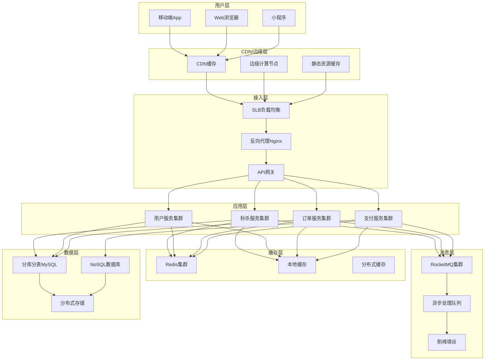

# 阿里巴巴高并发架构面试题

## 📚 题目概览

阿里巴巴高并发架构面试重点考察在极高并发场景下的系统设计和优化能力。面试题目往往以双十一、618等大促场景为背景，考察缓存、限流、降级、分库分表等高并发技术。

## 🎯 核心技术考察重点

### 高并发基础架构
- **缓存架构** - Redis集群、多级缓存、缓存一致性
- **限流降级** - 分布式限流、熔断降级、服务保护
- **负载均衡** - 四层/七层负载均衡、一致性哈希
- **异步处理** - 消息队列、事件驱动、异步编程

### 数据库高并发
- **分库分表** - 水平分片、垂直拆分、分片策略
- **读写分离** - 主从复制、延迟处理、数据一致性
- **连接池** - 连接池调优、连接泄漏、超时处理
- **SQL优化** - 索引优化、查询优化、慢查询分析

## 📝 核心面试题目

### 1. 双十一秒杀系统架构

#### 题目1：百万QPS秒杀系统设计
**问题**：设计双十一0点秒杀系统，支持1000万用户同时抢购10万件商品，QPS峰值达到100万，如何设计？

**高并发秒杀架构**：


**核心架构实现**：
```java
// 秒杀系统核心控制器
@RestController
@RequestMapping("/seckill")
@Slf4j
public class SeckillController {
    
    private final SeckillService seckillService;
    private final RedisTemplate<String, Object> redisTemplate;
    private final RateLimiter globalRateLimiter;
    
    // 分层限流+预检查+异步处理
    @PostMapping("/purchase/{activityId}")
    @RateLimited(permits = 50000, timeWindow = 1) // 接口级限流：5万QPS
    public ResponseEntity<SeckillResponse> purchase(
            @PathVariable Long activityId,
            @RequestParam Long userId,
            @RequestParam Long productId,
            HttpServletRequest request) {
        
        // 1. 全局限流（基于令牌桶算法）
        if (!globalRateLimiter.tryAcquire(1, 100, TimeUnit.MILLISECONDS)) {
            return ResponseEntity.status(429).body(
                SeckillResponse.failure("系统繁忙，请稍后重试"));
        }
        
        // 2. 用户限流（防止单用户重复请求）
        String userKey = "seckill:user:" + userId + ":" + activityId;
        if (!redisTemplate.opsForValue().setIfAbsent(userKey, "1", Duration.ofSeconds(1))) {
            return ResponseEntity.ok(SeckillResponse.failure("请勿重复提交"));
        }
        
        // 3. IP限流（防止恶意IP攻击）
        String clientIP = getClientIP(request);
        String ipKey = "seckill:ip:" + clientIP;
        Long ipCount = redisTemplate.opsForValue().increment(ipKey);
        if (ipCount == 1) {
            redisTemplate.expire(ipKey, Duration.ofSeconds(1));
        }
        if (ipCount > 20) { // IP每秒最多20次请求
            return ResponseEntity.status(429).body(
                SeckillResponse.failure("请求过于频繁"));
        }
        
        // 4. 活动状态预检查（快速失败）
        SeckillActivity activity = getActivityFromCache(activityId);
        if (!isActivityValid(activity)) {
            return ResponseEntity.ok(SeckillResponse.failure("活动已结束或未开始"));
        }
        
        // 5. 库存预检查（本地缓存+Redis双重检查）
        if (!hasStock(activityId, productId)) {
            return ResponseEntity.ok(SeckillResponse.failure("商品已售罄"));
        }
        
        // 6. 提交到异步处理队列
        SeckillRequest seckillRequest = SeckillRequest.builder()
            .activityId(activityId)
            .userId(userId)
            .productId(productId)
            .requestTime(System.currentTimeMillis())
            .requestId(UUID.randomUUID().toString())
            .build();
        
        boolean queued = seckillService.submitToQueue(seckillRequest);
        if (queued) {
            return ResponseEntity.ok(SeckillResponse.queued(
                seckillRequest.getRequestId(), "已进入抢购队列，请等待结果"));
        } else {
            return ResponseEntity.ok(SeckillResponse.failure("队列已满，请稍后重试"));
        }
    }
    
    // 获取秒杀结果
    @GetMapping("/result/{requestId}")
    public ResponseEntity<SeckillResponse> getResult(@PathVariable String requestId) {
        SeckillResult result = seckillService.getResult(requestId);
        return ResponseEntity.ok(SeckillResponse.fromResult(result));
    }
}

// 高性能秒杀服务实现
@Service
@Slf4j
public class SeckillService {
    
    private final RedissonClient redisson;
    private final RocketMQTemplate rocketMQTemplate;
    private final SeckillRepository seckillRepository;
    
    // 基于Disruptor的高性能队列
    private final Disruptor<SeckillEvent> disruptor;
    private final RingBuffer<SeckillEvent> ringBuffer;
    
    @PostConstruct
    public void initDisruptor() {
        // 创建Disruptor，缓冲区大小为2^16=65536
        disruptor = new Disruptor<>(
            SeckillEvent::new,
            65536,
            new ThreadFactoryBuilder()
                .setNameFormat("seckill-processor-%d")
                .setDaemon(true)
                .build()
        );
        
        // 设置事件处理器（多个处理器并行处理）
        disruptor.handleEventsWithWorkerPool(
            new SeckillEventHandler(),
            new SeckillEventHandler(),
            new SeckillEventHandler(),
            new SeckillEventHandler()
        );
        
        disruptor.start();
        ringBuffer = disruptor.getRingBuffer();
    }
    
    // 提交到高性能队列
    public boolean submitToQueue(SeckillRequest request) {
        try {
            long sequence = ringBuffer.tryNext();
            SeckillEvent event = ringBuffer.get(sequence);
            event.setSeckillRequest(request);
            ringBuffer.publish(sequence);
            return true;
        } catch (InsufficientCapacityException e) {
            log.warn("秒杀队列已满，请求被拒绝: {}", request.getRequestId());
            return false;
        }
    }
    
    // 秒杀事件处理器
    public class SeckillEventHandler implements WorkHandler<SeckillEvent> {
        
        @Override
        public void onEvent(SeckillEvent event) throws Exception {
            SeckillRequest request = event.getSeckillRequest();
            String requestId = request.getRequestId();
            
            try {
                // 1. 分布式锁保证原子性
                String lockKey = "seckill:lock:" + request.getActivityId() + ":" + request.getProductId();
                RLock lock = redisson.getLock(lockKey);
                
                if (lock.tryLock(100, 300, TimeUnit.MILLISECONDS)) {
                    try {
                        // 2. 再次检查库存（双重检查）
                        if (!checkAndDecrementStock(request.getActivityId(), request.getProductId())) {
                            recordResult(requestId, SeckillResult.failure("商品已售罄"));
                            return;
                        }
                        
                        // 3. 创建预订单
                        SeckillOrder order = createPreOrder(request);
                        
                        // 4. 异步处理订单
                        processOrderAsync(order);
                        
                        // 5. 记录成功结果
                        recordResult(requestId, SeckillResult.success(order.getOrderId()));
                        
                        log.info("秒杀成功: 用户={}, 商品={}, 订单={}", 
                            request.getUserId(), request.getProductId(), order.getOrderId());
                        
                    } finally {
                        lock.unlock();
                    }
                } else {
                    // 获取锁失败，记录失败结果
                    recordResult(requestId, SeckillResult.failure("系统繁忙，请稍后重试"));
                }
                
            } catch (Exception e) {
                log.error("处理秒杀请求异常: {}", requestId, e);
                recordResult(requestId, SeckillResult.failure("系统异常"));
            }
        }
    }
    
    // 原子性库存检查和扣减
    private boolean checkAndDecrementStock(Long activityId, Long productId) {
        String stockKey = "seckill:stock:" + activityId + ":" + productId;
        
        // 使用Lua脚本保证原子性
        String luaScript = """
            local stock_key = KEYS[1]
            local current = redis.call('get', stock_key)
            if current and tonumber(current) > 0 then
                redis.call('decr', stock_key)
                return 1
            else
                return 0
            end
            """;
        
        DefaultRedisScript<Long> script = new DefaultRedisScript<>(luaScript, Long.class);
        Long result = redisTemplate.execute(script, Collections.singletonList(stockKey));
        
        return result != null && result > 0;
    }
    
    // 异步创建正式订单
    private void processOrderAsync(SeckillOrder preOrder) {
        OrderMessage message = OrderMessage.builder()
            .orderId(preOrder.getOrderId())
            .userId(preOrder.getUserId())
            .productId(preOrder.getProductId())
            .activityId(preOrder.getActivityId())
            .price(preOrder.getPrice())
            .createTime(System.currentTimeMillis())
            .build();
        
        // 发送异步消息
        rocketMQTemplate.asyncSend("order-create-topic", message, new SendCallback() {
            @Override
            public void onSuccess(SendResult sendResult) {
                log.info("订单消息发送成功: {}", preOrder.getOrderId());
            }
            
            @Override
            public void onException(Throwable e) {
                log.error("订单消息发送失败: {}", preOrder.getOrderId(), e);
                // 消息发送失败，回滚库存
                rollbackStock(preOrder.getActivityId(), preOrder.getProductId());
            }
        });
    }
}

// 多级缓存架构
@Component
@Slf4j
public class SeckillCacheManager {
    
    private final RedisTemplate<String, Object> redisTemplate;
    
    // L1缓存：JVM本地缓存（Caffeine）
    private final Cache<String, Object> localCache = Caffeine.newBuilder()
        .maximumSize(10000)
        .expireAfterWrite(5, TimeUnit.SECONDS)
        .build();
    
    // L2缓存：Redis分布式缓存
    // L3缓存：数据库
    
    // 多级缓存获取商品信息
    public SeckillProduct getProduct(Long productId) {
        String cacheKey = "product:" + productId;
        
        // 1. 先查本地缓存
        SeckillProduct product = (SeckillProduct) localCache.getIfPresent(cacheKey);
        if (product != null) {
            return product;
        }
        
        // 2. 查Redis缓存
        product = (SeckillProduct) redisTemplate.opsForValue().get(cacheKey);
        if (product != null) {
            // 写入本地缓存
            localCache.put(cacheKey, product);
            return product;
        }
        
        // 3. 查数据库（加分布式锁防止缓存击穿）
        String lockKey = "lock:" + cacheKey;
        RLock lock = redisson.getLock(lockKey);
        
        try {
            if (lock.tryLock(1, 10, TimeUnit.SECONDS)) {
                // 双重检查
                product = (SeckillProduct) redisTemplate.opsForValue().get(cacheKey);
                if (product != null) {
                    localCache.put(cacheKey, product);
                    return product;
                }
                
                // 查询数据库
                product = seckillRepository.findProductById(productId);
                if (product != null) {
                    // 写入Redis缓存（设置随机过期时间防止雪崩）
                    int expireTime = 300 + new Random().nextInt(60); // 5-6分钟随机过期
                    redisTemplate.opsForValue().set(cacheKey, product, Duration.ofSeconds(expireTime));
                    
                    // 写入本地缓存
                    localCache.put(cacheKey, product);
                } else {
                    // 防止缓存穿透，缓存空值
                    redisTemplate.opsForValue().set(cacheKey, new NullObject(), Duration.ofMinutes(1));
                }
                
                return product;
            }
        } catch (InterruptedException e) {
            Thread.currentThread().interrupt();
        } finally {
            if (lock.isHeldByCurrentThread()) {
                lock.unlock();
            }
        }
        
        return null;
    }
    
    // 缓存预热
    @EventListener
    public void onSeckillStart(SeckillStartEvent event) {
        List<SeckillProduct> products = event.getProducts();
        
        // 并行预热缓存
        products.parallelStream().forEach(product -> {
            String cacheKey = "product:" + product.getId();
            
            // 预热Redis缓存
            redisTemplate.opsForValue().set(cacheKey, product, Duration.ofMinutes(10));
            
            // 预热本地缓存
            localCache.put(cacheKey, product);
            
            // 预热库存缓存
            String stockKey = "seckill:stock:" + product.getActivityId() + ":" + product.getId();
            redisTemplate.opsForValue().set(stockKey, product.getStock());
        });
        
        log.info("秒杀缓存预热完成，商品数量: {}", products.size());
    }
}
```

#### 题目2：分布式限流和熔断降级
**问题**：双十一期间如何实现分布式限流，以及当下游服务异常时如何熔断和降级？

**分布式限流实现**：
```java
// 分布式限流组件
@Component
@Slf4j
public class DistributedRateLimiter {
    
    private final RedisTemplate<String, String> redisTemplate;
    private final RedisScript<List> limitScript;
    
    public DistributedRateLimiter(RedisTemplate<String, String> redisTemplate) {
        this.redisTemplate = redisTemplate;
        this.limitScript = loadLimitScript();
    }
    
    // 滑动窗口限流算法
    public boolean tryAcquire(String key, int limit, int windowSize, TimeUnit timeUnit) {
        long windowSizeInMillis = timeUnit.toMillis(windowSize);
        long currentTime = System.currentTimeMillis();
        long windowStart = currentTime - windowSizeInMillis;
        
        List<String> keys = Arrays.asList(
            key,
            String.valueOf(windowStart),
            String.valueOf(currentTime),
            String.valueOf(limit)
        );
        
        List<Long> results = redisTemplate.execute(limitScript, keys);
        return results != null && !results.isEmpty() && results.get(0) == 1L;
    }
    
    // 令牌桶限流算法
    public boolean tryAcquireTokenBucket(String key, int capacity, int refillRate, int tokens) {
        long currentTime = System.currentTimeMillis();
        
        String luaScript = """
            local key = KEYS[1]
            local capacity = tonumber(ARGV[1])
            local refill_rate = tonumber(ARGV[2])
            local tokens_requested = tonumber(ARGV[3])
            local current_time = tonumber(ARGV[4])
            
            local bucket = redis.call('HMGET', key, 'tokens', 'last_refill')
            local tokens = tonumber(bucket[1]) or capacity
            local last_refill = tonumber(bucket[2]) or current_time
            
            -- 计算应该添加的令牌数
            local time_passed = math.max(0, current_time - last_refill)
            local tokens_to_add = math.floor(time_passed / 1000 * refill_rate)
            tokens = math.min(capacity, tokens + tokens_to_add)
            
            if tokens >= tokens_requested then
                tokens = tokens - tokens_requested
                redis.call('HMSET', key, 'tokens', tokens, 'last_refill', current_time)
                redis.call('EXPIRE', key, 3600)
                return 1
            else
                redis.call('HMSET', key, 'tokens', tokens, 'last_refill', current_time)
                redis.call('EXPIRE', key, 3600)
                return 0
            end
            """;
        
        DefaultRedisScript<Long> script = new DefaultRedisScript<>(luaScript, Long.class);
        Long result = redisTemplate.execute(script, 
            Collections.singletonList(key),
            String.valueOf(capacity),
            String.valueOf(refillRate),
            String.valueOf(tokens),
            String.valueOf(currentTime)
        );
        
        return result != null && result == 1L;
    }
}

// 熔断器实现
@Component
@Slf4j
public class CircuitBreaker {
    
    private final RedisTemplate<String, Object> redisTemplate;
    private volatile CircuitState state = CircuitState.CLOSED;
    private final AtomicLong failureCount = new AtomicLong(0);
    private final AtomicLong successCount = new AtomicLong(0);
    private volatile long lastFailureTime = 0;
    
    private final int failureThreshold;
    private final int successThreshold;
    private final long timeout;
    
    public CircuitBreaker(int failureThreshold, int successThreshold, long timeout) {
        this.failureThreshold = failureThreshold;
        this.successThreshold = successThreshold;
        this.timeout = timeout;
    }
    
    public <T> T execute(String serviceName, Supplier<T> operation, Supplier<T> fallback) {
        if (!canExecute(serviceName)) {
            log.warn("熔断器开启，执行降级逻辑: {}", serviceName);
            return fallback.get();
        }
        
        try {
            T result = operation.get();
            onSuccess(serviceName);
            return result;
        } catch (Exception e) {
            onFailure(serviceName, e);
            return fallback.get();
        }
    }
    
    private boolean canExecute(String serviceName) {
        switch (state) {
            case CLOSED:
                return true;
            case OPEN:
                if (System.currentTimeMillis() - lastFailureTime > timeout) {
                    state = CircuitState.HALF_OPEN;
                    log.info("熔断器进入半开状态: {}", serviceName);
                    return true;
                }
                return false;
            case HALF_OPEN:
                return true;
            default:
                return false;
        }
    }
    
    private void onSuccess(String serviceName) {
        if (state == CircuitState.HALF_OPEN) {
            if (successCount.incrementAndGet() >= successThreshold) {
                state = CircuitState.CLOSED;
                resetCounters();
                log.info("熔断器关闭，服务恢复: {}", serviceName);
            }
        } else {
            resetCounters();
        }
        
        // 记录成功指标
        recordMetric(serviceName, "success");
    }
    
    private void onFailure(String serviceName, Exception e) {
        lastFailureTime = System.currentTimeMillis();
        
        if (state == CircuitState.HALF_OPEN) {
            state = CircuitState.OPEN;
            log.warn("熔断器重新开启: {}", serviceName);
        } else if (failureCount.incrementAndGet() >= failureThreshold) {
            state = CircuitState.OPEN;
            log.warn("熔断器开启，失败次数达到阈值: {} >= {}", 
                failureCount.get(), failureThreshold);
        }
        
        // 记录失败指标
        recordMetric(serviceName, "failure");
        log.error("服务调用失败: {}", serviceName, e);
    }
    
    enum CircuitState {
        CLOSED,   // 关闭状态：正常调用
        OPEN,     // 开启状态：拒绝调用
        HALF_OPEN // 半开状态：尝试调用
    }
}

// 智能降级策略
@Component
@Slf4j
public class DegradationManager {
    
    private final Map<String, DegradationRule> rules = new ConcurrentHashMap<>();
    private final RedisTemplate<String, Object> redisTemplate;
    
    // 注册降级规则
    @PostConstruct
    public void initRules() {
        // 商品详情降级：去掉实时价格和库存
        rules.put("product-detail", DegradationRule.builder()
            .serviceName("product-detail")
            .level(1)
            .strategy(this::degradeProductDetail)
            .condition(this::checkProductDetailCondition)
            .build());
        
        // 推荐服务降级：返回默认推荐
        rules.put("recommendation", DegradationRule.builder()
            .serviceName("recommendation")
            .level(2)
            .strategy(this::degradeRecommendation)
            .condition(this::checkRecommendationCondition)
            .build());
        
        // 评价服务降级：隐藏评价内容
        rules.put("review", DegradationRule.builder()
            .serviceName("review")
            .level(3)
            .strategy(this::degradeReview)
            .condition(this::checkReviewCondition)
            .build());
    }
    
    // 检查是否需要降级
    public boolean shouldDegrade(String serviceName) {
        DegradationRule rule = rules.get(serviceName);
        return rule != null && rule.getCondition().get();
    }
    
    // 执行降级策略
    public <T> T executeWithDegradation(String serviceName, Supplier<T> operation) {
        if (shouldDegrade(serviceName)) {
            DegradationRule rule = rules.get(serviceName);
            log.warn("服务降级执行: {} -> level {}", serviceName, rule.getLevel());
            return (T) rule.getStrategy().get();
        }
        
        return operation.get();
    }
    
    // 商品详情降级策略
    private Object degradeProductDetail() {
        return ProductDetailVO.builder()
            .message("部分信息暂时无法显示")
            .degraded(true)
            .build();
    }
    
    // 推荐服务降级策略
    private Object degradeRecommendation() {
        return RecommendationVO.builder()
            .items(getDefaultRecommendations())
            .message("系统推荐")
            .degraded(true)
            .build();
    }
    
    // 评价服务降级策略
    private Object degradeReview() {
        return ReviewVO.builder()
            .message("评价功能暂时不可用")
            .degraded(true)
            .build();
    }
}
```

### 2. 数据库高并发优化

#### 题目3：分库分表架构设计
**问题**：淘宝订单表数据量达到百亿级，如何设计分库分表策略？如何处理跨库查询和分布式事务？

**分库分表实现**：
```java
// 分片策略配置
@Configuration
public class ShardingConfiguration {
    
    @Bean
    public DataSource shardingDataSource() {
        // 配置数据源
        Map<String, DataSource> dataSourceMap = new HashMap<>();
        for (int i = 0; i < 8; i++) {
            dataSourceMap.put("ds" + i, createDataSource("order_db_" + i));
        }
        
        // 分库策略：按用户ID取模
        StandardShardingStrategyConfiguration databaseStrategy = 
            new StandardShardingStrategyConfiguration("user_id", new DatabaseShardingAlgorithm());
        
        // 分表策略：按订单创建时间分表
        StandardShardingStrategyConfiguration tableStrategy = 
            new StandardShardingStrategyConfiguration("create_time", new TableShardingAlgorithm());
        
        // 构建分片规则
        ShardingRuleConfiguration shardingRule = new ShardingRuleConfiguration();
        shardingRule.getTableRuleConfigs().add(createOrderTableRule());
        shardingRule.getTableRuleConfigs().add(createOrderItemTableRule());
        
        // 创建分片数据源
        return ShardingDataSourceFactory.createDataSource(dataSourceMap, shardingRule, new Properties());
    }
    
    private TableRuleConfiguration createOrderTableRule() {
        TableRuleConfiguration orderTable = new TableRuleConfiguration("t_order");
        orderTable.setActualDataNodes("ds${0..7}.t_order_${2020..2024}_${01..12}");
        orderTable.setDatabaseShardingStrategyConfig(
            new StandardShardingStrategyConfiguration("user_id", new DatabaseShardingAlgorithm()));
        orderTable.setTableShardingStrategyConfig(
            new StandardShardingStrategyConfiguration("create_time", new TableShardingAlgorithm()));
        return orderTable;
    }
}

// 数据库分片算法
public class DatabaseShardingAlgorithm implements PreciseShardingAlgorithm<Long> {
    
    @Override
    public String doSharding(Collection<String> availableTargetNames, 
                           PreciseShardingValue<Long> shardingValue) {
        Long userId = shardingValue.getValue();
        String suffix = String.valueOf(userId % 8);
        
        for (String targetName : availableTargetNames) {
            if (targetName.endsWith(suffix)) {
                return targetName;
            }
        }
        
        throw new IllegalArgumentException("找不到合适的数据源");
    }
}

// 表分片算法（按时间分表）
public class TableShardingAlgorithm implements PreciseShardingAlgorithm<Date> {
    
    @Override
    public String doSharding(Collection<String> availableTargetNames, 
                           PreciseShardingValue<Date> shardingValue) {
        Date createTime = shardingValue.getValue();
        String suffix = DateTimeFormatter.ofPattern("yyyy_MM").format(
            createTime.toInstant().atZone(ZoneId.systemDefault()).toLocalDate());
        
        String targetTable = "t_order_" + suffix;
        
        if (availableTargetNames.contains(targetTable)) {
            return targetTable;
        }
        
        throw new IllegalArgumentException("找不到合适的表: " + targetTable);
    }
}

// 分布式订单服务
@Service
@Slf4j
public class OrderService {
    
    private final OrderRepository orderRepository;
    private final OrderItemRepository orderItemRepository;
    private final DistributedTransactionManager transactionManager;
    
    // 创建订单（跨库事务）
    @GlobalTransactional
    public OrderResult createOrder(CreateOrderRequest request) {
        String globalTxId = UUID.randomUUID().toString();
        
        try {
            // 1. 创建主订单
            Order order = Order.builder()
                .orderId(generateOrderId())
                .userId(request.getUserId())
                .totalAmount(request.getTotalAmount())
                .status(OrderStatus.CREATED)
                .createTime(new Date())
                .build();
            
            orderRepository.save(order);
            
            // 2. 创建订单明细（可能在不同的库中）
            List<OrderItem> orderItems = request.getItems().stream()
                .map(item -> OrderItem.builder()
                    .orderId(order.getOrderId())
                    .productId(item.getProductId())
                    .quantity(item.getQuantity())
                    .price(item.getPrice())
                    .createTime(new Date())
                    .build())
                .collect(Collectors.toList());
            
            orderItemRepository.batchInsert(orderItems);
            
            // 3. 调用库存服务扣减库存
            InventoryResult inventoryResult = inventoryService.reduceStock(
                request.getUserId(), request.getItems());
            
            if (!inventoryResult.isSuccess()) {
                throw new OrderCreateException("库存扣减失败: " + inventoryResult.getMessage());
            }
            
            // 4. 调用支付服务冻结资金
            PaymentResult paymentResult = paymentService.freezeFunds(
                request.getUserId(), request.getTotalAmount());
            
            if (!paymentResult.isSuccess()) {
                throw new OrderCreateException("资金冻结失败: " + paymentResult.getMessage());
            }
            
            log.info("订单创建成功: {}", order.getOrderId());
            return OrderResult.success(order);
            
        } catch (Exception e) {
            log.error("订单创建失败，全局事务ID: {}", globalTxId, e);
            throw e;
        }
    }
    
    // 跨库查询订单
    public PageResult<Order> queryOrders(OrderQueryRequest request) {
        // 1. 确定需要查询的分片
        Set<String> targetShards = determineTargetShards(request);
        
        // 2. 并行查询多个分片
        List<CompletableFuture<List<Order>>> futures = targetShards.stream()
            .map(shard -> CompletableFuture.supplyAsync(() -> 
                queryOrdersFromShard(shard, request)))
            .collect(Collectors.toList());
        
        // 3. 合并结果
        List<Order> allOrders = futures.stream()
            .map(CompletableFuture::join)
            .flatMap(List::stream)
            .collect(Collectors.toList());
        
        // 4. 排序和分页
        allOrders.sort(Comparator.comparing(Order::getCreateTime).reversed());
        
        int start = request.getPageNum() * request.getPageSize();
        int end = Math.min(start + request.getPageSize(), allOrders.size());
        List<Order> pageData = allOrders.subList(start, end);
        
        return PageResult.<Order>builder()
            .data(pageData)
            .total(allOrders.size())
            .pageNum(request.getPageNum())
            .pageSize(request.getPageSize())
            .build();
    }
    
    // 确定目标分片
    private Set<String> determineTargetShards(OrderQueryRequest request) {
        Set<String> shards = new HashSet<>();
        
        if (request.getUserId() != null) {
            // 基于用户ID确定数据库分片
            int dbIndex = (int) (request.getUserId() % 8);
            
            // 基于时间范围确定表分片
            LocalDate startDate = request.getStartDate();
            LocalDate endDate = request.getEndDate();
            
            while (!startDate.isAfter(endDate)) {
                String tableSuffix = startDate.format(DateTimeFormatter.ofPattern("yyyy_MM"));
                shards.add("ds" + dbIndex + ".t_order_" + tableSuffix);
                startDate = startDate.plusMonths(1);
            }
        } else {
            // 没有用户ID，需要查询所有分片（性能较差）
            log.warn("跨库全表扫描，性能较差");
            // 这里可以考虑返回错误或者限制查询范围
        }
        
        return shards;
    }
}

// 读写分离配置
@Configuration
public class ReadWriteSplitConfiguration {
    
    @Primary
    @Bean("masterDataSource")
    public DataSource masterDataSource() {
        return DataSourceBuilder.create()
            .driverClassName("com.mysql.cj.jdbc.Driver")
            .url("jdbc:mysql://master-db:3306/order_db")
            .username("root")
            .password("password")
            .build();
    }
    
    @Bean("slaveDataSource")
    public DataSource slaveDataSource() {
        return DataSourceBuilder.create()
            .driverClassName("com.mysql.cj.jdbc.Driver")
            .url("jdbc:mysql://slave-db:3306/order_db")
            .username("root")
            .password("password")
            .build();
    }
    
    @Bean
    public DataSource routingDataSource(@Qualifier("masterDataSource") DataSource masterDataSource,
                                      @Qualifier("slaveDataSource") DataSource slaveDataSource) {
        Map<Object, Object> targetDataSources = new HashMap<>();
        targetDataSources.put("master", masterDataSource);
        targetDataSources.put("slave", slaveDataSource);
        
        DynamicDataSource routingDataSource = new DynamicDataSource();
        routingDataSource.setTargetDataSources(targetDataSources);
        routingDataSource.setDefaultTargetDataSource(masterDataSource);
        
        return routingDataSource;
    }
}

// 动态数据源切换
public class DynamicDataSource extends AbstractRoutingDataSource {
    
    @Override
    protected Object determineCurrentLookupKey() {
        return DataSourceContext.getDataSourceType();
    }
}

// 数据源上下文
public class DataSourceContext {
    
    private static final ThreadLocal<String> contextHolder = new ThreadLocal<>();
    
    public static void setDataSourceType(String dataSourceType) {
        contextHolder.set(dataSourceType);
    }
    
    public static String getDataSourceType() {
        return contextHolder.get();
    }
    
    public static void clear() {
        contextHolder.remove();
    }
}

// 读写分离注解
@Target({ElementType.METHOD, ElementType.TYPE})
@Retention(RetentionPolicy.RUNTIME)
public @interface ReadOnlyDataSource {
    boolean value() default true;
}

// 读写分离切面
@Aspect
@Component
@Order(1)
public class DataSourceAspect {
    
    @Around("@annotation(readOnlyDataSource)")
    public Object switchDataSource(ProceedingJoinPoint joinPoint, ReadOnlyDataSource readOnlyDataSource) 
            throws Throwable {
        
        try {
            if (readOnlyDataSource.value()) {
                DataSourceContext.setDataSourceType("slave");
            } else {
                DataSourceContext.setDataSourceType("master");
            }
            
            return joinPoint.proceed();
            
        } finally {
            DataSourceContext.clear();
        }
    }
}
```

## 📊 面试评分标准

### 高并发理论基础 (30%)
- **并发模型理解**：线程模型、事件驱动、协程等
- **性能瓶颈识别**：CPU、内存、IO、网络瓶颈分析
- **缓存理论**：缓存穿透、击穿、雪崩的理解和解决方案
- **限流算法**：令牌桶、漏桶、滑动窗口等算法原理

### 架构设计能力 (35%)
- **系统架构**：高并发系统整体架构设计
- **缓存架构**：多级缓存、缓存一致性设计
- **数据库架构**：分库分表、读写分离设计
- **容错设计**：限流、熔断、降级、重试机制

### 技术实现深度 (25%)
- **性能优化**：JVM调优、SQL优化、系统调优
- **监控体系**：性能监控、业务监控、告警机制
- **压测经验**：压力测试、性能分析、瓶颈定位
- **问题排查**：线上问题快速定位和解决能力

### 业务场景理解 (10%)
- **电商特点**：电商系统高并发特点和挑战
- **大促经验**：双十一等大促技术准备和应对
- **用户体验**：高并发下用户体验保障
- **业务价值**：技术方案对业务的支撑价值

## 🎯 备考建议

### 核心技能提升
1. **高并发基础**：深入学习并发编程、网络IO、性能优化
2. **缓存技术**：精通Redis集群、缓存设计模式、一致性方案
3. **数据库优化**：掌握MySQL优化、分库分表、读写分离
4. **系统架构**：学习高并发系统架构设计和最佳实践

### 实战项目建议
1. **秒杀系统**：从零构建完整的高并发秒杀系统
2. **压测实践**：使用JMeter、Gatling等工具进行压力测试
3. **性能调优**：JVM调优、数据库调优、系统调优实践
4. **监控体系**：搭建完整的性能监控和告警体系

### 阿里技术实践学习
- **双十一技术**：学习阿里双十一技术揭秘和最佳实践
- **中间件技术**：深入了解Sentinel、RocketMQ等高并发中间件
- **云原生方案**：了解阿里云高并发解决方案
- **开源项目**：研究阿里开源的高并发项目源码

---
[← 返回阿里巴巴面试题库](./README.md) 