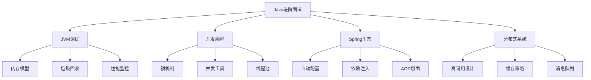

# 阿里巴巴Java开发进阶面试题

## 📚 题目概览

阿里巴巴Java面试以技术深度和实战能力著称，重点考察JVM底层原理、并发编程、Spring生态系统，以及在高并发电商场景下的应用能力。面试题目往往结合双十一、淘宝等真实业务场景。

## 🎯 核心技术考察重点

### JVM深度理解
- **内存模型** - 堆、栈、方法区、直接内存
- **垃圾回收** - G1、ZGC、垃圾回收调优
- **类加载机制** - 双亲委派、热部署、类隔离
- **性能调优** - JVM参数、内存分析、性能监控

### 并发编程精通
- **并发工具类** - CountDownLatch、CyclicBarrier、Semaphore
- **线程池** - 自定义线程池、任务调度、监控
- **锁机制** - ReentrantLock、读写锁、分段锁
- **无锁编程** - CAS、原子类、Disruptor

### Spring生态系统
- **自动配置原理** - Starter机制、条件装配
- **依赖注入** - IOC容器、Bean生命周期
- **AOP实现** - 切面编程、动态代理
- **微服务治理** - Spring Cloud、服务发现

## 📊 知识结构关联图

## 📝 核心面试题目

### 1. JVM内存管理和性能调优 🔥

#### 题目1：双十一流量洪峰JVM调优
**问题背景**：双十一期间淘宝首页QPS达到百万级，系统面临极高并发压力。

**技术挑战**：
- 如何配置JVM参数支持百万QPS
- 如何将GC停顿时间控制在10ms以内
- 如何建立完整的JVM监控和预警机制
- 如何处理内存压力下的应急措施

**考察要点**：
- G1垃圾收集器原理和调优
- 堆内存分配策略
- 直接内存管理
- JVM性能监控指标

**📁 完整解决方案**：[JVM调优完整实现](../../../solutions/alibaba/jvm-optimization.md)

#### 题目2：内存泄漏定位和解决
**问题背景**：生产环境出现内存泄漏，应用运行几天后内存持续增长最终OOM。

**技术挑战**：
- 如何快速定位内存泄漏源头
- 如何分析堆转储文件
- 如何建立内存增长监控机制
- 常见内存泄漏场景的预防措施

**考察要点**：
- MAT工具使用和堆分析
- 内存泄漏常见模式识别
- 运行时内存监控
- ThreadLocal、监听器等泄漏场景

**📁 完整解决方案**：[内存泄漏诊断实现](../../../solutions/alibaba/memory-leak-diagnosis.md)

### 2. 高并发编程实战 ⚡

#### 题目3：秒杀系统的并发控制
**问题背景**：设计双十一秒杀系统，处理百万用户同时抢购1000件商品的极端场景。

**技术挑战**：
- 多级限流策略设计
- 分布式锁保证数据一致性
- Redis原子操作库存扣减
- 异步化提升系统吞吐量

**考察要点**：
- 限流算法和实现
- 分布式锁的选择和优化
- 缓存和数据库一致性
- 高并发下的系统架构设计

**📁 完整解决方案**：[秒杀系统完整实现](../../../solutions/alibaba/seckill-system.md)

#### 题目4：线程池监控和调优
**问题背景**：生产环境线程池出现任务积压，需要优化线程池配置和监控机制。

**技术挑战**：
- 线程池参数如何合理配置
- 如何监控线程池运行状态
- 任务拒绝策略的选择
- 动态调整线程池大小

**考察要点**：
- 线程池核心参数理解
- 监控指标设计
- 性能调优方法
- 故障排查技巧

**📁 完整解决方案**：[线程池优化实现](../../../solutions/alibaba/threadpool-optimization.md)

### 3. Spring生态系统深度应用 🌱

#### 题目5：自定义Spring Boot Starter
**问题背景**：开发一个类似Dubbo的RPC框架，需要提供Spring Boot自动配置能力。

**技术挑战**：
- 条件装配和自动配置原理
- 配置属性绑定机制
- Bean生命周期管理
- 扩展点设计

**考察要点**：
- Spring Boot自动配置原理
- @Conditional注解使用
- ConfigurationProperties设计
- 自定义注解和处理器

**📁 完整解决方案**：[Spring Boot Starter实现](../../../solutions/alibaba/spring-boot-starter.md)

#### 题目6：Spring AOP实现原理
**问题背景**：实现一个通用的性能监控切面，需要深入理解AOP实现机制。

**技术挑战**：
- 动态代理和CGLIB代理选择
- 切点表达式设计
- 环绕通知实现
- 性能监控数据收集

**考察要点**：
- AOP实现原理
- 代理模式理解
- 切面设计模式
- 性能监控最佳实践

**📁 完整解决方案**：[AOP监控实现](../../../solutions/alibaba/aop-monitoring.md)

## 📊 面试评分标准

### Java技术深度 (40%)
- **JVM掌握度**：内存模型、GC原理、性能调优能力
- **并发编程**：多线程、锁机制、并发工具类熟练度
- **Spring生态**：IOC、AOP、自动配置原理理解
- **代码质量**：设计模式、最佳实践、可维护性

### 系统思维 (30%)
- **架构设计**：分布式系统设计能力
- **性能优化**：识别瓶颈和优化方案
- **高可用设计**：容错、恢复、降级机制
- **扩展性考虑**：水平扩展、弹性伸缩

### 业务理解 (20%)
- **电商场景**：对阿里业务场景的理解深度
- **高并发处理**：双十一等大促实战经验
- **用户体验**：性能和稳定性平衡
- **商业价值**：技术方案的业务意义

### 工程实践 (10%)
- **问题排查**：线上问题定位和解决能力
- **监控运维**：系统监控和运维经验
- **团队协作**：代码规范、文档、技术分享
- **持续改进**：技术债务处理、重构、优化

## 🎯 备考建议

### 📚 核心技能提升路径

### 实战项目建议
1. **高并发项目**：构建支持万级QPS的Web应用
2. **中间件开发**：开发RPC框架或消息队列组件
3. **性能调优**：JVM调优、SQL优化、系统性能优化
4. **微服务架构**：Spring Cloud或Dubbo微服务实践

### 阿里技术栈学习重点
- **Spring Cloud Alibaba**：Nacos、Sentinel、RocketMQ深度使用
- **中间件产品**：了解阿里开源中间件设计理念
- **大数据技术**：Hadoop、Spark、Flink生态系统
- **云原生技术**：Docker、Kubernetes、Service Mesh

## 🔗 相关资源链接

### 技术解决方案
- [📁 JVM调优完整实现](../../../solutions/alibaba/jvm-optimization.md)
- [📁 高并发编程解决方案](../../../solutions/alibaba/concurrency-solutions.md)
- [📁 Spring高级应用实现](../../../solutions/alibaba/spring-advanced.md)

### 基础知识回顾
- [Java基础知识](../java-basics.md)
- [并发编程基础](../java-concurrency.md)
- [Spring框架原理](../spring-framework.md)

### 系统设计相关
- [分布式系统设计](../../system-design/distributed-systems.md)
- [高并发架构](../../system-design/high-concurrency.md)
- [缓存系统设计](../../system-design/caching-systems.md)

---

**💡 提示**: 每个代码解决方案都包含详细的实现步骤、关键技术点解析和面试回答要点。建议结合理论学习和代码实践，全面掌握阿里Java面试的核心要求。

[← 返回阿里巴巴面试题库](./README.md) 