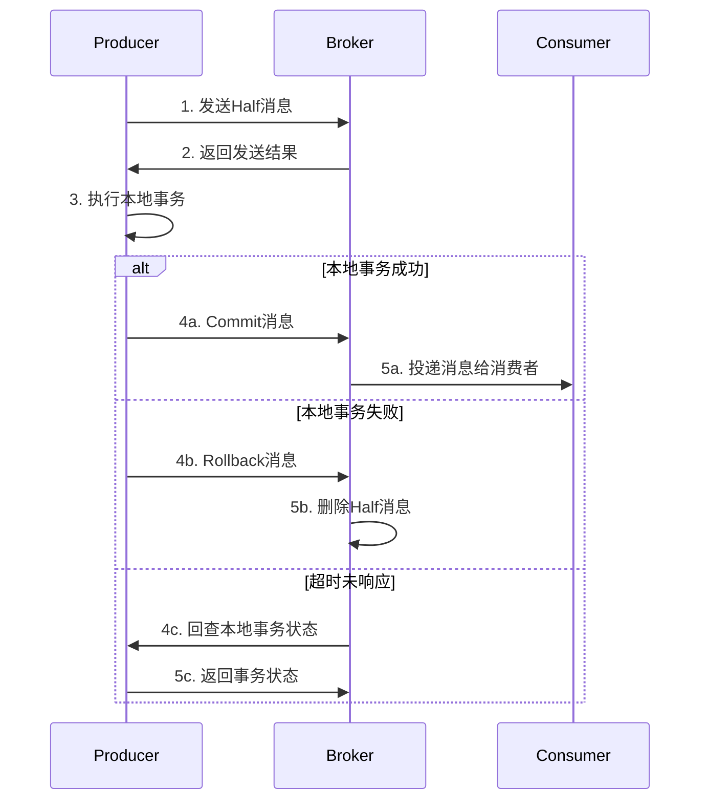
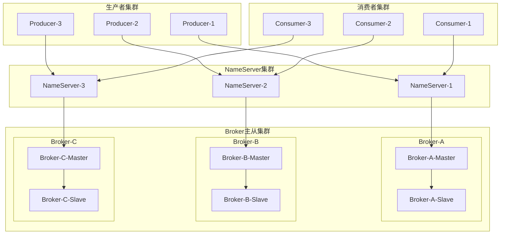

# 阿里巴巴中间件技术面试题

## 📚 题目概览

阿里巴巴中间件面试重点考察对阿里自研中间件生态的深度理解和实践应用。主要包括RocketMQ、Dubbo、Nacos、Sentinel、Seata等核心中间件的原理、最佳实践和生产环境应用经验。

## 🎯 核心中间件考察重点

### 消息中间件 - RocketMQ
- **消息模型** - 发布订阅、点对点、事务消息
- **高可用设计** - 主从复制、故障转移、数据一致性  
- **性能优化** - 批量发送、异步刷盘、零拷贝
- **消费模式** - 推拉模式、集群消费、广播消费

### 服务框架 - Dubbo
- **服务治理** - 注册发现、负载均衡、容错机制
- **通信协议** - Dubbo协议、序列化、网络传输
- **扩展机制** - SPI机制、自定义扩展、插件开发
- **监控运维** - 服务监控、链路追踪、性能分析

### 配置中心 - Nacos
- **配置管理** - 动态配置、配置推送、版本管理
- **服务发现** - 服务注册、健康检查、元数据管理
- **集群部署** - 一致性算法、数据同步、高可用
- **安全机制** - 权限控制、加密传输、审计日志

### 流量控制 - Sentinel
- **限流算法** - 令牌桶、漏桶、滑动窗口
- **熔断降级** - 熔断策略、降级规则、恢复机制
- **系统保护** - 系统负载、RT、线程数、入口QPS
- **控制台管理** - 规则配置、实时监控、集群管理

## 📝 核心面试题目

### 1. RocketMQ深度应用

#### 题目1：RocketMQ事务消息实现原理
**问题**：详细说明RocketMQ事务消息的实现机制，如何确保消息发送和本地事务的一致性？

**事务消息流程图**：


**技术实现详解**：
```java
// RocketMQ事务消息生产者实现
@Component
@Slf4j
public class TransactionalMessageProducer {
    
    private final TransactionMQProducer producer;
    private final OrderService orderService;
    private final RedisTemplate<String, Object> redisTemplate;
    
    @PostConstruct
    public void init() {
        producer = new TransactionMQProducer("order_producer_group");
        producer.setNamesrvAddr("localhost:9876");
        
        // 设置事务监听器
        producer.setTransactionListener(new OrderTransactionListener());
        
        // 设置线程池
        producer.setExecutorService(Executors.newFixedThreadPool(10));
        
        try {
            producer.start();
            log.info("事务消息生产者启动成功");
        } catch (MQClientException e) {
            log.error("事务消息生产者启动失败", e);
        }
    }
    
    // 发送事务消息
    public void sendTransactionalMessage(OrderCreateEvent event) {
        String transactionId = UUID.randomUUID().toString();
        
        Message message = new Message(
            "order-topic",
            "create",
            transactionId,
            JSON.toJSONBytes(event)
        );
        
        // 设置事务消息的业务key
        message.putUserProperty("orderId", event.getOrderId());
        message.putUserProperty("userId", String.valueOf(event.getUserId()));
        
        try {
            // 发送事务消息，会先发送Half消息
            TransactionSendResult result = producer.sendMessageInTransaction(
                message, event);
            
            log.info("事务消息发送结果: {}, 事务ID: {}", 
                result.getSendStatus(), transactionId);
                
        } catch (MQClientException e) {
            log.error("事务消息发送失败，事务ID: {}", transactionId, e);
        }
    }
    
    // 事务监听器实现
    private class OrderTransactionListener implements TransactionListener {
        
        @Override
        public LocalTransactionState executeLocalTransaction(Message msg, Object arg) {
            String transactionId = msg.getTransactionId();
            OrderCreateEvent event = (OrderCreateEvent) arg;
            
            try {
                // 执行本地事务：创建订单
                OrderResult result = orderService.createOrder(event);
                
                if (result.isSuccess()) {
                    // 记录事务状态
                    recordTransactionState(transactionId, TransactionState.COMMIT);
                    log.info("本地事务执行成功，事务ID: {}", transactionId);
                    return LocalTransactionState.COMMIT_MESSAGE;
                } else {
                    recordTransactionState(transactionId, TransactionState.ROLLBACK);
                    log.warn("本地事务执行失败，事务ID: {}", transactionId);
                    return LocalTransactionState.ROLLBACK_MESSAGE;
                }
                
            } catch (Exception e) {
                log.error("本地事务执行异常，事务ID: {}", transactionId, e);
                recordTransactionState(transactionId, TransactionState.UNKNOWN);
                return LocalTransactionState.UNKNOW;
            }
        }
        
        @Override
        public LocalTransactionState checkLocalTransaction(MessageExt msg) {
            String transactionId = msg.getTransactionId();
            
            try {
                // 查询本地事务状态
                TransactionState state = getTransactionState(transactionId);
                
                return switch (state) {
                    case COMMIT -> {
                        log.info("回查确认事务提交，事务ID: {}", transactionId);
                        yield LocalTransactionState.COMMIT_MESSAGE;
                    }
                    case ROLLBACK -> {
                        log.info("回查确认事务回滚，事务ID: {}", transactionId);
                        yield LocalTransactionState.ROLLBACK_MESSAGE;
                    }
                    default -> {
                        log.warn("回查事务状态未知，事务ID: {}", transactionId);
                        yield LocalTransactionState.UNKNOW;
                    }
                };
                
            } catch (Exception e) {
                log.error("回查本地事务状态失败，事务ID: {}", transactionId, e);
                return LocalTransactionState.UNKNOW;
            }
        }
    }
    
    // 记录事务状态到Redis
    private void recordTransactionState(String transactionId, TransactionState state) {
        String key = "transaction:state:" + transactionId;
        redisTemplate.opsForValue().set(key, state.name(), Duration.ofHours(1));
    }
    
    // 查询事务状态
    private TransactionState getTransactionState(String transactionId) {
        String key = "transaction:state:" + transactionId;
        String stateStr = (String) redisTemplate.opsForValue().get(key);
        
        if (stateStr != null) {
            return TransactionState.valueOf(stateStr);
        }
        
        // 如果Redis中没有记录，查询数据库
        return orderService.getTransactionState(transactionId);
    }
}

// RocketMQ高性能消费者实现
@Component
@RocketMQMessageListener(
    topic = "order-topic",
    consumerGroup = "inventory-consumer-group",
    consumeMode = ConsumeMode.CONCURRENTLY,
    messageModel = MessageModel.CLUSTERING,
    consumeThreadMax = 20,
    consumeThreadMin = 5
)
@Slf4j
public class InventoryConsumer implements RocketMQListener<OrderCreateEvent> {
    
    private final InventoryService inventoryService;
    private final RedisTemplate<String, Object> redisTemplate;
    
    @Override
    public void onMessage(OrderCreateEvent event) {
        String orderId = event.getOrderId();
        String idempotentKey = "inventory:processed:" + orderId;
        
        try {
            // 1. 幂等性检查
            if (Boolean.TRUE.equals(redisTemplate.hasKey(idempotentKey))) {
                log.info("订单库存已处理，跳过重复消费: {}", orderId);
                return;
            }
            
            // 2. 处理库存扣减
            List<InventoryItem> items = event.getItems().stream()
                .map(item -> InventoryItem.builder()
                    .productId(item.getProductId())
                    .quantity(item.getQuantity())
                    .build())
                .collect(Collectors.toList());
            
            InventoryResult result = inventoryService.batchReduceStock(items);
            
            if (result.isSuccess()) {
                // 3. 标记处理完成（设置24小时过期）
                redisTemplate.opsForValue().set(idempotentKey, true, Duration.ofDays(1));
                
                // 4. 发送库存扣减成功事件
                publishInventoryReducedEvent(event, result);
                
                log.info("库存扣减成功: 订单={}, 商品数量={}", 
                    orderId, items.size());
            } else {
                log.error("库存扣减失败: 订单={}, 原因={}", 
                    orderId, result.getMessage());
                throw new InventoryException("库存扣减失败: " + result.getMessage());
            }
            
        } catch (Exception e) {
            log.error("处理订单库存消息异常: {}", orderId, e);
            // 抛出异常会触发消息重试
            throw new RuntimeException("库存处理失败", e);
        }
    }
}
```

#### 题目2：RocketMQ高可用架构设计
**问题**：设计一个支持百万QPS的RocketMQ集群架构，如何保证高可用和数据一致性？

**集群架构设计**：


**高可用配置实现**：
```java
// Broker高可用配置
@Configuration
public class RocketMQBrokerConfig {
    
    // Master Broker配置
    public Properties getMasterConfig() {
        Properties properties = new Properties();
        
        // 基础配置
        properties.setProperty("brokerClusterName", "DefaultCluster");
        properties.setProperty("brokerName", "broker-a");
        properties.setProperty("brokerId", "0"); // 0表示Master
        properties.setProperty("namesrvAddr", "ns1:9876;ns2:9876;ns3:9876");
        
        // 高可用配置
        properties.setProperty("autoCreateTopicEnable", "false");
        properties.setProperty("defaultTopicQueueNums", "8");
        properties.setProperty("enablePropertyFilter", "true");
        
        // 性能配置
        properties.setProperty("sendMessageThreadPoolNums", "128");
        properties.setProperty("pullMessageThreadPoolNums", "128");
        properties.setProperty("queryMessageThreadPoolNums", "32");
        
        // 存储配置
        properties.setProperty("storePathRootDir", "/app/rocketmq/store");
        properties.setProperty("storePathCommitLog", "/app/rocketmq/store/commitlog");
        properties.setProperty("mapedFileSizeCommitLog", "1073741824"); // 1GB
        properties.setProperty("mapedFileSizeConsumeQueue", "6000000");
        
        // 刷盘策略（异步刷盘，性能更好）
        properties.setProperty("flushDiskType", "ASYNC_FLUSH");
        properties.setProperty("flushIntervalCommitLog", "1000");
        properties.setProperty("flushCommitLogTimed", "true");
        
        // 主从同步（同步双写，可靠性更高）
        properties.setProperty("brokerRole", "SYNC_MASTER");
        properties.setProperty("slaveReadEnable", "true");
        
        // 消息过期时间
        properties.setProperty("fileReservedTime", "72"); // 72小时
        
        return properties;
    }
    
    // Slave Broker配置
    public Properties getSlaveConfig() {
        Properties properties = getMasterConfig();
        
        // Slave特有配置
        properties.setProperty("brokerId", "1"); // 非0表示Slave
        properties.setProperty("brokerRole", "SLAVE");
        
        return properties;
    }
}

// 生产者高可用实现
@Component
@Slf4j
public class HighAvailabilityProducer {
    
    private final DefaultMQProducer producer;
    private final List<String> nameServerList;
    
    public HighAvailabilityProducer() {
        this.nameServerList = Arrays.asList(
            "ns1:9876", "ns2:9876", "ns3:9876"
        );
        this.producer = createProducer();
    }
    
    private DefaultMQProducer createProducer() {
        DefaultMQProducer producer = new DefaultMQProducer("high-availability-producer");
        
        // NameServer集群配置
        producer.setNamesrvAddr(String.join(";", nameServerList));
        
        // 性能配置
        producer.setSendMsgTimeout(10000); // 发送超时10秒
        producer.setRetryTimesWhenSendFailed(3); // 同步发送失败重试3次
        producer.setRetryTimesWhenSendAsyncFailed(3); // 异步发送失败重试3次
        producer.setMaxMessageSize(4 * 1024 * 1024); // 最大消息4MB
        
        // 压缩配置
        producer.setCompressMsgBodyOverHowmuch(4096); // 超过4KB压缩
        
        try {
            producer.start();
            log.info("高可用生产者启动成功");
        } catch (MQClientException e) {
            log.error("高可用生产者启动失败", e);
            throw new RuntimeException("生产者启动失败", e);
        }
        
        return producer;
    }
    
    // 高可用发送（同步+重试+监控）
    public SendResult sendWithHighAvailability(String topic, String tag, Object payload) {
        Message message = new Message(topic, tag, JSON.toJSONBytes(payload));
        
        int maxRetries = 3;
        Exception lastException = null;
        
        for (int retry = 0; retry < maxRetries; retry++) {
            try {
                // 选择不同的NameServer（负载均衡）
                if (retry > 0) {
                    refreshNameServer();
                }
                
                SendResult result = producer.send(message, 10000); // 10秒超时
                
                if (result.getSendStatus() == SendStatus.SEND_OK) {
                    log.info("消息发送成功: topic={}, msgId={}, queueId={}", 
                        topic, result.getMsgId(), result.getMessageQueue().getQueueId());
                    return result;
                } else {
                    log.warn("消息发送状态异常: {}, 重试次数: {}", 
                        result.getSendStatus(), retry + 1);
                }
                
            } catch (Exception e) {
                lastException = e;
                log.warn("消息发送失败，重试次数: {}, 异常: {}", 
                    retry + 1, e.getMessage());
                
                // 重试前等待一段时间
                try {
                    Thread.sleep(1000 * (retry + 1));
                } catch (InterruptedException ie) {
                    Thread.currentThread().interrupt();
                    break;
                }
            }
        }
        
        throw new MessageSendException("消息发送失败，已重试" + maxRetries + "次", lastException);
    }
    
    // 批量发送优化
    public List<SendResult> batchSend(String topic, List<Object> payloads) {
        if (payloads.size() <= 1000) {
            // 小批量：一次性发送
            return sendBatchMessages(topic, payloads);
        } else {
            // 大批量：分批发送
            List<SendResult> results = new ArrayList<>();
            List<List<Object>> batches = partition(payloads, 1000);
            
            for (List<Object> batch : batches) {
                results.addAll(sendBatchMessages(topic, batch));
            }
            
            return results;
        }
    }
    
    private List<SendResult> sendBatchMessages(String topic, List<Object> payloads) {
        List<Message> messages = payloads.stream()
            .map(payload -> new Message(topic, JSON.toJSONBytes(payload)))
            .collect(Collectors.toList());
        
        try {
            SendResult result = producer.send(messages);
            return Collections.singletonList(result);
        } catch (Exception e) {
            log.error("批量消息发送失败", e);
            throw new MessageSendException("批量消息发送失败", e);
        }
    }
}
```

### 2. Dubbo服务治理

#### 题目3：Dubbo SPI机制和扩展开发
**问题**：详细说明Dubbo的SPI机制原理，如何开发自定义的负载均衡算法？

**SPI机制原理**：
```java
// 自定义负载均衡算法
@Activate
public class ConsistentHashLoadBalance extends AbstractLoadBalance {
    
    public static final String NAME = "consistent_hash";
    
    // 一致性哈希环缓存
    private final ConcurrentMap<String, ConsistentHashSelector<?>> selectors = 
        new ConcurrentHashMap<>();
    
    @Override
    protected <T> Invoker<T> doSelect(List<Invoker<T>> invokers, URL url, Invocation invocation) {
        String methodName = RpcUtils.getMethodName(invocation);
        String key = invokers.get(0).getUrl().getServiceKey() + "." + methodName;
        
        // 检查invokers是否发生变化
        int identityHashCode = System.identityHashCode(invokers);
        ConsistentHashSelector<T> selector = (ConsistentHashSelector<T>) selectors.get(key);
        
        if (selector == null || selector.identityHashCode != identityHashCode) {
            selectors.put(key, new ConsistentHashSelector<>(invokers, methodName, identityHashCode));
            selector = (ConsistentHashSelector<T>) selectors.get(key);
        }
        
        return selector.select(invocation);
    }
    
    // 一致性哈希选择器
    private static final class ConsistentHashSelector<T> {
        
        private final TreeMap<Long, Invoker<T>> virtualInvokers;
        private final int replicaNumber;
        private final int identityHashCode;
        private final int[] argumentIndex;
        
        ConsistentHashSelector(List<Invoker<T>> invokers, String methodName, int identityHashCode) {
            this.virtualInvokers = new TreeMap<>();
            this.identityHashCode = identityHashCode;
            
            URL url = invokers.get(0).getUrl();
            this.replicaNumber = url.getMethodParameter(methodName, "hash.nodes", 160);
            String[] index = COMMA_SPLIT_PATTERN.split(
                url.getMethodParameter(methodName, "hash.arguments", "0"));
            argumentIndex = new int[index.length];
            for (int i = 0; i < index.length; i++) {
                argumentIndex[i] = Integer.parseInt(index[i]);
            }
            
            // 构建虚拟节点环
            for (Invoker<T> invoker : invokers) {
                String address = invoker.getUrl().getAddress();
                for (int i = 0; i < replicaNumber / 4; i++) {
                    byte[] digest = md5(address + i);
                    for (int h = 0; h < 4; h++) {
                        long m = hash(digest, h);
                        virtualInvokers.put(m, invoker);
                    }
                }
            }
        }
        
        public Invoker<T> select(Invocation invocation) {
            String key = toKey(invocation.getArguments());
            byte[] digest = md5(key);
            return selectForKey(hash(digest, 0));
        }
        
        private String toKey(Object[] args) {
            StringBuilder buf = new StringBuilder();
            for (int i : argumentIndex) {
                if (i >= 0 && i < args.length) {
                    buf.append(args[i]);
                }
            }
            return buf.toString();
        }
        
        private Invoker<T> selectForKey(long hash) {
            Map.Entry<Long, Invoker<T>> entry = virtualInvokers.ceilingEntry(hash);
            if (entry == null) {
                entry = virtualInvokers.firstEntry();
            }
            return entry.getValue();
        }
        
        private long hash(byte[] digest, int number) {
            return (((long) (digest[3 + number * 4] & 0xFF) << 24)
                    | ((long) (digest[2 + number * 4] & 0xFF) << 16)
                    | ((long) (digest[1 + number * 4] & 0xFF) << 8)
                    | (digest[number * 4] & 0xFF))
                    & 0xFFFFFFFFL;
        }
        
        private byte[] md5(String value) {
            MessageDigest md5;
            try {
                md5 = MessageDigest.getInstance("MD5");
            } catch (NoSuchAlgorithmException e) {
                throw new IllegalStateException(e.getMessage(), e);
            }
            md5.reset();
            byte[] bytes = value.getBytes(StandardCharsets.UTF_8);
            md5.update(bytes);
            return md5.digest();
        }
    }
}

// SPI配置文件：META-INF/dubbo/org.apache.dubbo.rpc.cluster.LoadBalance
// consistent_hash=com.example.ConsistentHashLoadBalance

// 自定义协议扩展
public class CustomProtocol extends AbstractProtocol {
    
    public static final String NAME = "custom";
    public static final int DEFAULT_PORT = 20880;
    
    private final Map<String, Exporter<?>> exporterMap = new ConcurrentHashMap<>();
    
    @Override
    public int getDefaultPort() {
        return DEFAULT_PORT;
    }
    
    @Override
    public <T> Exporter<T> export(Invoker<T> invoker) throws RpcException {
        URL url = invoker.getUrl();
        String key = serviceKey(url);
        
        CustomExporter<T> exporter = new CustomExporter<>(invoker, key, exporterMap);
        exporterMap.put(key, exporter);
        
        // 启动服务器
        openServer(url);
        
        return exporter;
    }
    
    @Override
    public <T> Invoker<T> refer(Class<T> type, URL url) throws RpcException {
        return new CustomInvoker<>(type, url, getClients(url), this);
    }
    
    private void openServer(URL url) {
        String key = url.getAddress();
        Server server = serverMap.get(key);
        
        if (server == null) {
            synchronized (this) {
                server = serverMap.get(key);
                if (server == null) {
                    server = Transporters.bind(url, new CustomChannelHandler());
                    serverMap.put(key, server);
                }
            }
        }
    }
    
    // 自定义通道处理器
    private class CustomChannelHandler implements ChannelHandler {
        @Override
        public void received(Channel channel, Object message) throws RemotingException {
            if (message instanceof Request) {
                Request request = (Request) message;
                Response response = new Response(request.getId());
                
                try {
                    // 查找对应的Invoker
                    Invoker<?> invoker = getInvoker(channel, request);
                    if (invoker != null) {
                        RpcContext.getContext().setRemoteAddress(channel.getRemoteAddress());
                        Result result = invoker.invoke(new RpcInvocation(request));
                        response.setStatus(Response.OK);
                        response.setResult(result.getValue());
                    } else {
                        response.setStatus(Response.SERVICE_NOT_FOUND);
                        response.setErrorMessage("Service not found");
                    }
                } catch (Throwable t) {
                    response.setStatus(Response.SERVICE_ERROR);
                    response.setErrorMessage(t.getMessage());
                }
                
                channel.send(response);
            }
        }
    }
}

// Dubbo Filter扩展
@Activate(group = {CONSUMER, PROVIDER})
public class PerformanceMonitorFilter implements Filter {
    
    private final MeterRegistry meterRegistry;
    
    @Override
    public Result invoke(Invoker<?> invoker, Invocation invocation) throws RpcException {
        String serviceName = invoker.getInterface().getSimpleName();
        String methodName = invocation.getMethodName();
        
        Timer.Sample sample = Timer.start(meterRegistry);
        Counter.Builder counterBuilder = Counter.builder("dubbo.requests")
            .tag("service", serviceName)
            .tag("method", methodName);
        
        try {
            Result result = invoker.invoke(invocation);
            
            if (result.hasException()) {
                counterBuilder.tag("status", "error").register(meterRegistry).increment();
            } else {
                counterBuilder.tag("status", "success").register(meterRegistry).increment();
            }
            
            return result;
            
        } catch (RpcException e) {
            counterBuilder.tag("status", "error").register(meterRegistry).increment();
            throw e;
        } finally {
            sample.stop(Timer.builder("dubbo.requests.duration")
                .tag("service", serviceName)
                .tag("method", methodName)
                .register(meterRegistry));
        }
    }
}
```

### 3. Nacos配置中心和服务发现

#### 题目4：Nacos集群部署和一致性保证
**问题**：如何部署Nacos集群确保高可用？Nacos如何保证配置和服务数据的一致性？

**Nacos集群架构实现**：
```java
// Nacos集群配置
@Configuration
public class NacosClusterConfig {
    
    @Bean
    public ConfigService configService() throws Exception {
        Properties properties = new Properties();
        
        // 集群地址配置
        properties.setProperty("serverAddr", "nacos1:8848,nacos2:8848,nacos3:8848");
        properties.setProperty("namespace", "production");
        properties.setProperty("username", "nacos");
        properties.setProperty("password", "nacos123");
        
        // 连接配置
        properties.setProperty("configLongPollTimeout", "30000");
        properties.setProperty("configRetryTime", "2000");
        properties.setProperty("maxRetry", "3");
        properties.setProperty("enableRemoteSyncConfig", "true");
        
        return ConfigFactory.createConfigService(properties);
    }
    
    @Bean
    public NamingService namingService() throws Exception {
        Properties properties = new Properties();
        properties.setProperty("serverAddr", "nacos1:8848,nacos2:8848,nacos3:8848");
        properties.setProperty("namespace", "production");
        
        return NamingFactory.createNamingService(properties);
    }
}

// 动态配置管理器
@Component
@Slf4j
public class DynamicConfigManager {
    
    private final ConfigService configService;
    private final Map<String, Listener> listenerMap = new ConcurrentHashMap<>();
    
    // 获取配置并监听变化
    public <T> T getConfigWithListener(String dataId, String group, 
                                      Class<T> clazz, ConfigChangeCallback<T> callback) {
        try {
            // 获取当前配置
            String content = configService.getConfig(dataId, group, 5000);
            T config = parseConfig(content, clazz);
            
            // 添加监听器
            Listener listener = new Listener() {
                @Override
                public Executor getExecutor() {
                    return Executors.newSingleThreadExecutor(r -> {
                        Thread thread = new Thread(r, "nacos-config-" + dataId);
                        thread.setDaemon(true);
                        return thread;
                    });
                }
                
                @Override
                public void receiveConfigInfo(String configInfo) {
                    try {
                        T newConfig = parseConfig(configInfo, clazz);
                        callback.onChange(config, newConfig);
                        log.info("配置更新成功: dataId={}, group={}", dataId, group);
                    } catch (Exception e) {
                        log.error("配置更新失败: dataId={}, group={}", dataId, group, e);
                    }
                }
            };
            
            configService.addListener(dataId, group, listener);
            listenerMap.put(dataId + ":" + group, listener);
            
            return config;
            
        } catch (Exception e) {
            log.error("获取配置失败: dataId={}, group={}", dataId, group, e);
            throw new ConfigException("获取配置失败", e);
        }
    }
    
    // 发布配置
    public boolean publishConfig(String dataId, String group, String content) {
        try {
            boolean result = configService.publishConfig(dataId, group, content);
            if (result) {
                log.info("配置发布成功: dataId={}, group={}", dataId, group);
            } else {
                log.warn("配置发布失败: dataId={}, group={}", dataId, group);
            }
            return result;
        } catch (Exception e) {
            log.error("配置发布异常: dataId={}, group={}", dataId, group, e);
            return false;
        }
    }
    
    // 服务注册和健康检查
    @Component
    public static class ServiceRegistry {
        
        private final NamingService namingService;
        private final ScheduledExecutorService healthCheckExecutor;
        
        public ServiceRegistry(NamingService namingService) {
            this.namingService = namingService;
            this.healthCheckExecutor = Executors.newScheduledThreadPool(2);
        }
        
        @PostConstruct
        public void registerService() {
            try {
                Instance instance = new Instance();
                instance.setIp(getLocalIP());
                instance.setPort(getServerPort());
                instance.setWeight(1.0);
                instance.setHealthy(true);
                instance.setEnabled(true);
                instance.setEphemeral(true);
                
                // 设置元数据
                Map<String, String> metadata = new HashMap<>();
                metadata.put("version", "1.0.0");
                metadata.put("region", "cn-hangzhou");
                metadata.put("zone", "zone-a");
                instance.setMetadata(metadata);
                
                namingService.registerInstance("user-service", "DEFAULT_GROUP", instance);
                
                // 启动健康检查
                startHealthCheck();
                
                log.info("服务注册成功: service=user-service, ip={}, port={}", 
                    instance.getIp(), instance.getPort());
                
            } catch (Exception e) {
                log.error("服务注册失败", e);
            }
        }
        
        private void startHealthCheck() {
            healthCheckExecutor.scheduleWithFixedDelay(() -> {
                try {
                    // 检查服务健康状态
                    boolean healthy = checkServiceHealth();
                    
                    if (!healthy) {
                        // 服务不健康，注销实例
                        namingService.deregisterInstance("user-service", "DEFAULT_GROUP", 
                            getLocalIP(), getServerPort());
                        log.warn("服务健康检查失败，已注销实例");
                    }
                    
                } catch (Exception e) {
                    log.error("健康检查异常", e);
                }
            }, 5, 5, TimeUnit.SECONDS);
        }
        
        private boolean checkServiceHealth() {
            // 检查数据库连接
            if (!checkDatabaseConnection()) {
                return false;
            }
            
            // 检查Redis连接
            if (!checkRedisConnection()) {
                return false;
            }
            
            // 检查内存使用率
            if (getMemoryUsage() > 0.9) {
                return false;
            }
            
            return true;
        }
    }
}
```

## 📊 面试评分标准

### 中间件理论基础 (35%)
- **架构理解**：对中间件架构设计的深度理解
- **原理掌握**：核心算法和实现原理的掌握程度
- **技术对比**：不同中间件方案的优缺点分析
- **最佳实践**：中间件使用的最佳实践和经验

### 实际应用经验 (30%)
- **生产环境使用**：在生产环境中的实际使用经验
- **性能调优**：中间件性能优化和调优经验
- **问题排查**：线上问题定位和解决能力
- **监控运维**：中间件监控和运维经验

### 扩展开发能力 (25%)
- **SPI机制理解**：对扩展机制的理解和应用
- **自定义开发**：自定义扩展和插件开发经验
- **源码阅读**：中间件源码阅读和理解能力
- **创新思维**：对中间件改进和创新的思考

### 系统设计能力 (10%)
- **架构设计**：基于中间件的系统架构设计
- **技术选型**：合适的中间件选型和组合
- **集成能力**：多个中间件的集成和协调
- **演进规划**：中间件架构的演进和升级规划

## 🎯 备考建议

### 理论学习
1. **官方文档**：深入学习RocketMQ、Dubbo、Nacos等官方文档
2. **架构设计**：理解中间件的架构设计和核心原理
3. **源码研究**：阅读关键中间件的核心源码
4. **技术对比**：了解不同中间件的优缺点和适用场景

### 实践项目
1. **集群搭建**：搭建完整的中间件集群环境
2. **性能测试**：进行中间件性能测试和调优
3. **扩展开发**：开发自定义的中间件扩展
4. **故障演练**：模拟中间件故障和恢复场景

### 阿里生态学习
- **Spring Cloud Alibaba**：学习阿里中间件与Spring的集成
- **最佳实践**：学习阿里在双十一等场景的中间件实践
- **开源贡献**：参与阿里开源中间件的社区贡献
- **技术分享**：关注阿里技术团队的中间件技术分享

---
[← 返回阿里巴巴面试题库](./README.md) 