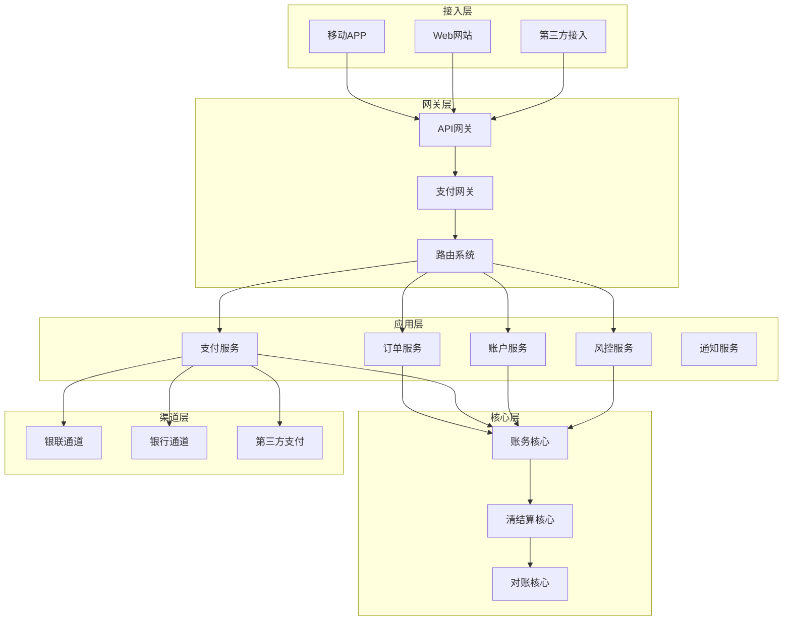
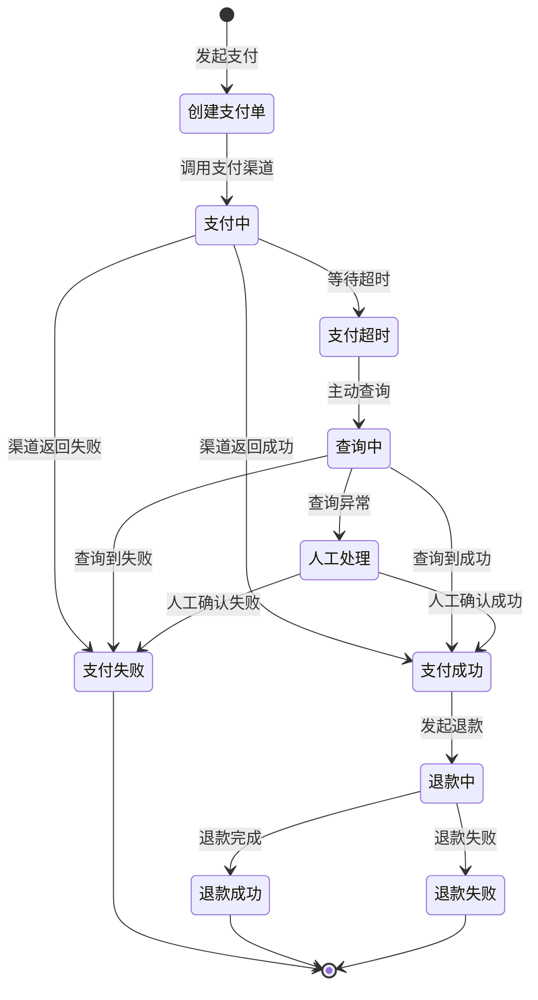

# 阿里巴巴支付系统设计面试题

## 📚 题目概览

支付系统是阿里巴巴生态的核心组成部分，面试重点考察候选人对支付业务流程、安全风控、分布式事务、对账清结算等核心能力。作为蚂蚁金服和支付宝的技术底层，支付系统要求极高的可靠性、一致性和安全性。

## 💰 核心业务模块

### 支付网关系统
- **渠道路由**：多支付渠道统一接入和路由
- **协议适配**：不同支付机构协议转换
- **限流熔断**：高并发场景下的流量控制
- **安全防护**：防重复提交、防篡改、加密解密

### 账户系统
- **账户模型**：用户账户、商户账户、平台账户
- **余额管理**：实时余额、冻结金额、可用余额
- **记账系统**：复式记账、会计分录、账务核对
- **资金安全**：密码验证、限额控制、风险识别

### 风控系统
- **实时风控**：交易实时监控和拦截
- **规则引擎**：可配置的风控规则和策略
- **机器学习**：异常检测和反欺诈模型
- **人工审核**：可疑交易人工复核流程

### 清结算系统
- **对账处理**：与银行和第三方支付对账
- **清算处理**：资金清算和分润计算
- **结算处理**：商户资金结算和提现
- **财务报表**：各维度财务数据统计

## 📝 核心面试题目

### 1. 支付系统整体架构

#### 题目1：设计高可用的支付系统架构
**问题**：设计一个支撑日交易量1亿笔的支付系统，要求99.999%可用性，支持多种支付方式。

**架构设计**：



**核心设计原则**：
```yaml
# 支付系统设计原则
可靠性:
  - 数据一致性: 强一致性保证
  - 幂等性: 重复请求相同结果
  - 事务性: ACID特性保障
  - 容错性: 故障自动恢复

安全性:
  - 加密传输: HTTPS + 报文加密
  - 身份认证: 多因子身份验证
  - 权限控制: 最小权限原则
  - 审计日志: 完整操作轨迹

性能:
  - 高并发: 支持万级TPS
  - 低延迟: 秒级响应时间
  - 高可用: 99.999%可用性
  - 弹性扩容: 自动伸缩能力

合规性:
  - 监管要求: 央行支付规范
  - 风控规则: 反洗钱规则
  - 数据保护: 个人信息保护
  - 审计要求: 完整审计轨迹
```

#### 题目2：支付流程状态机设计
**问题**：设计支付订单的状态流转机制，要求支持各种异常场景和补偿逻辑。

**状态机设计**：


**状态机实现**：
```java
@Component
@Slf4j
public class PaymentStateMachine {
    
    @Autowired
    private PaymentOrderMapper paymentOrderMapper;
    
    @Autowired
    private PaymentChannelService channelService;
    
    // 状态转换处理
    public PaymentStateResult processStateTransition(Long paymentId, 
                                                   PaymentEvent event, 
                                                   Map<String, Object> context) {
        
        PaymentOrder order = paymentOrderMapper.selectById(paymentId);
        PaymentStatus fromStatus = order.getStatus();
        PaymentStatus toStatus = getNextStatus(fromStatus, event);
        
        // 状态转换前置检查
        if (!isValidTransition(fromStatus, toStatus)) {
            return PaymentStateResult.failure("无效的状态转换");
        }
        
        try {
            // 执行状态转换
            return executeTransition(order, fromStatus, toStatus, event, context);
            
        } catch (Exception e) {
            log.error("支付状态转换失败: paymentId={}, from={}, to={}", 
                paymentId, fromStatus, toStatus, e);
            return PaymentStateResult.failure("状态转换异常");
        }
    }
    
    private PaymentStateResult executeTransition(PaymentOrder order,
                                               PaymentStatus fromStatus,
                                               PaymentStatus toStatus,
                                               PaymentEvent event,
                                               Map<String, Object> context) {
        
        switch (toStatus) {
            case PAYING:
                return handlePaying(order, context);
                
            case SUCCESS:
                return handleSuccess(order, context);
                
            case FAILED:
                return handleFailed(order, context);
                
            case TIMEOUT:
                return handleTimeout(order, context);
                
            case QUERYING:
                return handleQuerying(order, context);
                
            case MANUAL_PROCESSING:
                return handleManualProcessing(order, context);
                
            default:
                return PaymentStateResult.failure("未知状态");
        }
    }
    
    // 处理支付中状态
    private PaymentStateResult handlePaying(PaymentOrder order, Map<String, Object> context) {
        // 调用支付渠道
        PaymentRequest request = buildPaymentRequest(order);
        PaymentResponse response = channelService.pay(request);
        
        // 更新订单状态
        order.setStatus(PaymentStatus.PAYING);
        order.setChannelOrderId(response.getChannelOrderId());
        order.setUpdateTime(new Date());
        paymentOrderMapper.updateById(order);
        
        // 启动状态查询任务
        scheduleStatusQuery(order.getId());
        
        return PaymentStateResult.success();
    }
    
    // 处理支付成功状态
    private PaymentStateResult handleSuccess(PaymentOrder order, Map<String, Object> context) {
        // 更新订单状态
        order.setStatus(PaymentStatus.SUCCESS);
        order.setFinishTime(new Date());
        paymentOrderMapper.updateById(order);
        
        // 记录账务流水
        accountingService.recordTransaction(order);
        
        // 发送成功通知
        notificationService.sendPaymentSuccess(order);
        
        // 回调业务系统
        callbackService.notifyBusiness(order);
        
        return PaymentStateResult.success();
    }
}
```

### 2. 账户和资金管理

#### 题目3：设计多账户资金管理系统
**问题**：设计支持用户、商户、平台的多账户体系，要求资金安全、账务清晰。

**账户模型设计**：
```sql
-- 账户主表
CREATE TABLE `account_info` (
  `id` bigint(20) NOT NULL AUTO_INCREMENT,
  `account_no` varchar(32) NOT NULL COMMENT '账户号',
  `user_id` bigint(20) NOT NULL COMMENT '用户ID',
  `account_type` tinyint(4) NOT NULL COMMENT '账户类型',
  `currency` varchar(3) NOT NULL DEFAULT 'CNY' COMMENT '币种',
  `status` tinyint(4) NOT NULL DEFAULT '1' COMMENT '账户状态',
  `create_time` datetime NOT NULL DEFAULT CURRENT_TIMESTAMP,
  PRIMARY KEY (`id`),
  UNIQUE KEY `uk_account_no` (`account_no`),
  KEY `idx_user_id` (`user_id`)
) ENGINE=InnoDB DEFAULT CHARSET=utf8mb4;

-- 账户余额表
CREATE TABLE `account_balance` (
  `id` bigint(20) NOT NULL AUTO_INCREMENT,
  `account_no` varchar(32) NOT NULL COMMENT '账户号',
  `balance` decimal(20,2) NOT NULL DEFAULT '0.00' COMMENT '可用余额',
  `frozen_amount` decimal(20,2) NOT NULL DEFAULT '0.00' COMMENT '冻结金额',
  `total_amount` decimal(20,2) NOT NULL DEFAULT '0.00' COMMENT '总金额',
  `version` int(11) NOT NULL DEFAULT '0' COMMENT '版本号',
  `update_time` datetime NOT NULL DEFAULT CURRENT_TIMESTAMP ON UPDATE CURRENT_TIMESTAMP,
  PRIMARY KEY (`id`),
  UNIQUE KEY `uk_account_no` (`account_no`)
) ENGINE=InnoDB DEFAULT CHARSET=utf8mb4;

-- 账务流水表
CREATE TABLE `accounting_entry` (
  `id` bigint(20) NOT NULL AUTO_INCREMENT,
  `entry_id` varchar(32) NOT NULL COMMENT '分录ID',
  `business_id` varchar(32) NOT NULL COMMENT '业务单号',
  `account_no` varchar(32) NOT NULL COMMENT '账户号',
  `direction` tinyint(4) NOT NULL COMMENT '借贷方向',
  `amount` decimal(20,2) NOT NULL COMMENT '金额',
  `currency` varchar(3) NOT NULL DEFAULT 'CNY',
  `subject_code` varchar(16) NOT NULL COMMENT '科目代码',
  `business_type` varchar(16) NOT NULL COMMENT '业务类型',
  `remark` varchar(200) DEFAULT NULL COMMENT '备注',
  `create_time` datetime NOT NULL DEFAULT CURRENT_TIMESTAMP,
  PRIMARY KEY (`id`),
  UNIQUE KEY `uk_entry_id` (`entry_id`),
  KEY `idx_business_id` (`business_id`),
  KEY `idx_account_no` (`account_no`)
) ENGINE=InnoDB DEFAULT CHARSET=utf8mb4;
```

**资金操作服务**：
```java
@Service
@Transactional
public class AccountService {
    
    @Autowired
    private AccountBalanceMapper balanceMapper;
    
    @Autowired
    private AccountingEntryMapper entryMapper;
    
    @Autowired
    private DistributedLock distributedLock;
    
    // 余额变动（带锁的原子操作）
    public BalanceChangeResult changeBalance(BalanceChangeRequest request) {
        String lockKey = "account:balance:" + request.getAccountNo();
        
        return distributedLock.execute(lockKey, 10, TimeUnit.SECONDS, () -> {
            // 1. 查询当前余额
            AccountBalance balance = balanceMapper.selectByAccountNo(request.getAccountNo());
            if (balance == null) {
                throw new BusinessException("账户不存在");
            }
            
            // 2. 计算变动后余额
            BigDecimal newBalance = balance.getBalance().add(request.getAmount());
            BigDecimal newFrozen = balance.getFrozenAmount();
            
            if (request.getChangeType() == ChangeType.FREEZE) {
                // 冻结操作
                if (newBalance.compareTo(request.getAmount()) < 0) {
                    throw new BusinessException("余额不足");
                }
                newBalance = balance.getBalance().subtract(request.getAmount());
                newFrozen = balance.getFrozenAmount().add(request.getAmount());
                
            } else if (request.getChangeType() == ChangeType.UNFREEZE) {
                // 解冻操作
                if (balance.getFrozenAmount().compareTo(request.getAmount()) < 0) {
                    throw new BusinessException("冻结金额不足");
                }
                newBalance = balance.getBalance().add(request.getAmount());
                newFrozen = balance.getFrozenAmount().subtract(request.getAmount());
            }
            
            // 3. 更新余额（乐观锁）
            AccountBalance updateBalance = new AccountBalance();
            updateBalance.setId(balance.getId());
            updateBalance.setBalance(newBalance);
            updateBalance.setFrozenAmount(newFrozen);
            updateBalance.setTotalAmount(newBalance.add(newFrozen));
            updateBalance.setVersion(balance.getVersion() + 1);
            
            int updateRows = balanceMapper.updateByVersion(updateBalance, balance.getVersion());
            if (updateRows == 0) {
                throw new ConcurrentModificationException("余额并发修改冲突");
            }
            
            // 4. 记录账务流水
            recordAccountingEntry(request, balance, updateBalance);
            
            return BalanceChangeResult.success(newBalance);
        });
    }
    
    // 复式记账
    private void recordAccountingEntry(BalanceChangeRequest request, 
                                     AccountBalance oldBalance, 
                                     AccountBalance newBalance) {
        
        String entryId = generateEntryId();
        
        // 借方分录
        AccountingEntry debitEntry = new AccountingEntry();
        debitEntry.setEntryId(entryId + "_DR");
        debitEntry.setBusinessId(request.getBusinessId());
        debitEntry.setAccountNo(request.getAccountNo());
        debitEntry.setDirection(Direction.DEBIT);
        debitEntry.setAmount(request.getAmount().abs());
        debitEntry.setSubjectCode(getSubjectCode(request.getChangeType(), Direction.DEBIT));
        debitEntry.setBusinessType(request.getBusinessType());
        debitEntry.setRemark(request.getRemark());
        
        // 贷方分录
        AccountingEntry creditEntry = new AccountingEntry();
        creditEntry.setEntryId(entryId + "_CR");
        creditEntry.setBusinessId(request.getBusinessId());
        creditEntry.setAccountNo(request.getAccountNo());
        creditEntry.setDirection(Direction.CREDIT);
        creditEntry.setAmount(request.getAmount().abs());
        creditEntry.setSubjectCode(getSubjectCode(request.getChangeType(), Direction.CREDIT));
        creditEntry.setBusinessType(request.getBusinessType());
        creditEntry.setRemark(request.getRemark());
        
        // 插入分录
        entryMapper.insert(debitEntry);
        entryMapper.insert(creditEntry);
    }
}
```

### 3. 支付安全与风控

#### 题目4：设计实时风控系统
**问题**：设计一个实时支付风控系统，要求毫秒级响应，支持复杂规则和机器学习模型。

**风控架构设计**：
```java
@Service
@Slf4j
public class RiskControlService {
    
    @Autowired
    private RuleEngine ruleEngine;
    
    @Autowired
    private MLModelService mlModelService;
    
    @Autowired
    private RiskProfileService profileService;
    
    // 实时风控检查
    public RiskCheckResult checkRisk(PaymentRequest request) {
        try {
            // 1. 构建风控上下文
            RiskContext context = buildRiskContext(request);
            
            // 2. 规则引擎检查
            RuleCheckResult ruleResult = ruleEngine.evaluate(context);
            if (ruleResult.isBlocked()) {
                return RiskCheckResult.blocked(ruleResult.getReason());
            }
            
            // 3. 机器学习模型评分
            MLModelResult modelResult = mlModelService.predict(context);
            if (modelResult.getRiskScore() > RISK_THRESHOLD) {
                return RiskCheckResult.review(modelResult.getReason());
            }
            
            // 4. 实时特征更新
            updateRealTimeFeatures(context);
            
            return RiskCheckResult.pass();
            
        } catch (Exception e) {
            log.error("风控检查异常: request={}", request, e);
            // 风控异常时的降级策略
            return RiskCheckResult.review("风控服务异常");
        }
    }
    
    private RiskContext buildRiskContext(PaymentRequest request) {
        RiskContext context = new RiskContext();
        
        // 基础信息
        context.setUserId(request.getUserId());
        context.setAmount(request.getAmount());
        context.setPaymentMethod(request.getPaymentMethod());
        context.setMerchantId(request.getMerchantId());
        
        // 设备信息
        DeviceInfo deviceInfo = deviceService.getDeviceInfo(request.getDeviceId());
        context.setDeviceInfo(deviceInfo);
        
        // 用户画像
        UserRiskProfile userProfile = profileService.getUserProfile(request.getUserId());
        context.setUserProfile(userProfile);
        
        // 实时特征
        RealTimeFeatures rtFeatures = featureService.getRealTimeFeatures(request.getUserId());
        context.setRealTimeFeatures(rtFeatures);
        
        return context;
    }
}

// 规则引擎
@Component
public class RuleEngine {
    
    @Autowired
    private RuleRepository ruleRepository;
    
    private final DroolsContainer droolsContainer = new DroolsContainer();
    
    public RuleCheckResult evaluate(RiskContext context) {
        // 获取适用规则
        List<RiskRule> rules = ruleRepository.getActiveRules(context.getBusinessType());
        
        // 执行规则
        for (RiskRule rule : rules) {
            RuleResult result = executeRule(rule, context);
            if (result.isTriggered()) {
                return RuleCheckResult.blocked(rule.getRuleName(), result.getReason());
            }
        }
        
        return RuleCheckResult.pass();
    }
    
    private RuleResult executeRule(RiskRule rule, RiskContext context) {
        switch (rule.getRuleType()) {
            case AMOUNT_LIMIT:
                return checkAmountLimit(rule, context);
                
            case FREQUENCY_LIMIT:
                return checkFrequencyLimit(rule, context);
                
            case DEVICE_ANOMALY:
                return checkDeviceAnomaly(rule, context);
                
            case BEHAVIOR_PATTERN:
                return checkBehaviorPattern(rule, context);
                
            default:
                return RuleResult.pass();
        }
    }
    
    // 金额限制检查
    private RuleResult checkAmountLimit(RiskRule rule, RiskContext context) {
        BigDecimal maxAmount = new BigDecimal(rule.getThreshold());
        
        if (context.getAmount().compareTo(maxAmount) > 0) {
            return RuleResult.blocked("单笔金额超限: " + context.getAmount());
        }
        
        // 检查日累计金额
        BigDecimal dailyAmount = getDailyAmount(context.getUserId());
        if (dailyAmount.add(context.getAmount()).compareTo(maxAmount.multiply(new BigDecimal("10"))) > 0) {
            return RuleResult.blocked("日累计金额超限");
        }
        
        return RuleResult.pass();
    }
    
    // 频次限制检查
    private RuleResult checkFrequencyLimit(RiskRule rule, RiskContext context) {
        int maxCount = Integer.parseInt(rule.getThreshold());
        int recentCount = getRecentPaymentCount(context.getUserId(), 1); // 1小时内
        
        if (recentCount >= maxCount) {
            return RuleResult.blocked("支付频次过高: " + recentCount);
        }
        
        return RuleResult.pass();
    }
}
```

### 4. 对账与清结算

#### 题目5：设计自动化对账系统
**问题**：设计一个与银行、第三方支付机构的自动化对账系统，要求准确性100%。

**对账系统架构**：
```java
@Service
@Slf4j
public class ReconciliationService {
    
    @Autowired
    private PaymentOrderMapper orderMapper;
    
    @Autowired
    private ReconciliationRecordMapper reconciliationMapper;
    
    @Autowired
    private ChannelFileService fileService;
    
    // 执行对账
    @Scheduled(cron = "0 30 2 * * ?") // 每日2:30执行
    public void executeReconciliation() {
        String date = DateUtils.format(DateUtils.addDays(new Date(), -1), "yyyyMMdd");
        
        // 获取所有渠道
        List<PaymentChannel> channels = channelService.getAllChannels();
        
        for (PaymentChannel channel : channels) {
            try {
                executeChannelReconciliation(channel, date);
            } catch (Exception e) {
                log.error("渠道对账失败: channel={}, date={}", channel.getChannelCode(), date, e);
                // 发送告警
                alertService.sendAlert("对账失败", channel.getChannelCode(), date);
            }
        }
    }
    
    private void executeChannelReconciliation(PaymentChannel channel, String date) {
        // 1. 下载渠道对账文件
        ReconciliationFile channelFile = fileService.downloadFile(channel, date);
        if (channelFile == null) {
            log.warn("渠道对账文件不存在: channel={}, date={}", channel.getChannelCode(), date);
            return;
        }
        
        // 2. 解析渠道数据
        List<ChannelRecord> channelRecords = parseChannelFile(channelFile);
        
        // 3. 查询系统内部数据
        List<PaymentOrder> systemOrders = orderMapper.selectByChannelAndDate(
            channel.getChannelCode(), date);
        
        // 4. 执行对账逻辑
        ReconciliationResult result = doReconciliation(channelRecords, systemOrders);
        
        // 5. 保存对账结果
        saveReconciliationResult(channel, date, result);
        
        // 6. 处理差异订单
        handleDiscrepancies(result.getDiscrepancies());
    }
    
    private ReconciliationResult doReconciliation(List<ChannelRecord> channelRecords,
                                                List<PaymentOrder> systemOrders) {
        
        ReconciliationResult result = new ReconciliationResult();
        
        // 转换为Map便于查找
        Map<String, ChannelRecord> channelMap = channelRecords.stream()
            .collect(Collectors.toMap(ChannelRecord::getOrderId, r -> r));
        
        Map<String, PaymentOrder> systemMap = systemOrders.stream()
            .collect(Collectors.toMap(PaymentOrder::getChannelOrderId, o -> o));
        
        // 查找匹配、差异订单
        Set<String> allOrderIds = new HashSet<>();
        allOrderIds.addAll(channelMap.keySet());
        allOrderIds.addAll(systemMap.keySet());
        
        for (String orderId : allOrderIds) {
            ChannelRecord channelRecord = channelMap.get(orderId);
            PaymentOrder systemOrder = systemMap.get(orderId);
            
            if (channelRecord != null && systemOrder != null) {
                // 双边都有，检查一致性
                if (isMatched(channelRecord, systemOrder)) {
                    result.addMatched(orderId);
                } else {
                    result.addDiscrepancy(orderId, "金额或状态不一致", channelRecord, systemOrder);
                }
            } else if (channelRecord != null) {
                // 渠道有，系统无
                result.addDiscrepancy(orderId, "系统缺失订单", channelRecord, null);
            } else {
                // 系统有，渠道无
                result.addDiscrepancy(orderId, "渠道缺失订单", null, systemOrder);
            }
        }
        
        return result;
    }
    
    private boolean isMatched(ChannelRecord channelRecord, PaymentOrder systemOrder) {
        // 检查金额
        if (channelRecord.getAmount().compareTo(systemOrder.getAmount()) != 0) {
            return false;
        }
        
        // 检查状态
        if (!channelRecord.getStatus().equals(systemOrder.getChannelStatus())) {
            return false;
        }
        
        // 检查时间（允许一定误差）
        long timeDiff = Math.abs(channelRecord.getPayTime().getTime() - 
                                systemOrder.getFinishTime().getTime());
        if (timeDiff > 60 * 1000) { // 1分钟误差
            return false;
        }
        
        return true;
    }
    
    // 处理差异订单
    private void handleDiscrepancies(List<ReconciliationDiscrepancy> discrepancies) {
        for (ReconciliationDiscrepancy discrepancy : discrepancies) {
            switch (discrepancy.getType()) {
                case SYSTEM_MISSING:
                    handleSystemMissing(discrepancy);
                    break;
                    
                case CHANNEL_MISSING:
                    handleChannelMissing(discrepancy);
                    break;
                    
                case AMOUNT_MISMATCH:
                    handleAmountMismatch(discrepancy);
                    break;
                    
                case STATUS_MISMATCH:
                    handleStatusMismatch(discrepancy);
                    break;
            }
        }
    }
}
```

## 📊 面试评分标准

### 支付业务理解 (30%)
- **业务流程**：对支付完整业务流程的理解
- **法规合规**：支付行业法规和合规要求
- **风险识别**：支付风险点识别和防控
- **用户体验**：支付体验优化和异常处理

### 系统架构设计 (35%)
- **高可用架构**：支付系统的高可用设计
- **数据一致性**：分布式事务和数据一致性
- **性能优化**：高并发场景下的性能优化
- **安全设计**：支付安全和风控体系设计

### 技术实现能力 (25%)
- **编程能力**：代码质量和设计模式应用
- **数据库设计**：账务模型和数据库设计
- **中间件使用**：消息队列、缓存等中间件
- **监控运维**：系统监控和故障处理

### 创新思维 (10%)
- **技术创新**：新技术在支付场景的应用
- **业务创新**：支付产品和模式创新
- **问题解决**：复杂问题的分析和解决
- **持续改进**：系统优化和改进思路

## 🎯 备考建议

### 业务知识
1. **支付基础**：学习支付行业基础知识和术语
2. **监管法规**：了解央行支付业务规范和要求
3. **风控知识**：学习反欺诈和风险控制理论
4. **会计基础**：掌握基本的会计和财务知识

### 技术实践
1. **支付项目**：完成端到端的支付系统开发
2. **分布式事务**：深入理解分布式事务实现
3. **安全技术**：掌握加密、签名、防篡改技术
4. **性能优化**：支付场景下的性能优化实践

### 阿里支付学习
- **支付宝架构**：学习支付宝技术架构演进
- **蚂蚁金服技术**：了解蚂蚁金服技术创新
- **移动支付**：学习移动支付技术和安全
- **国际化支付**：了解跨境支付技术挑战

---
[← 返回阿里巴巴面试题库](./README.md) 