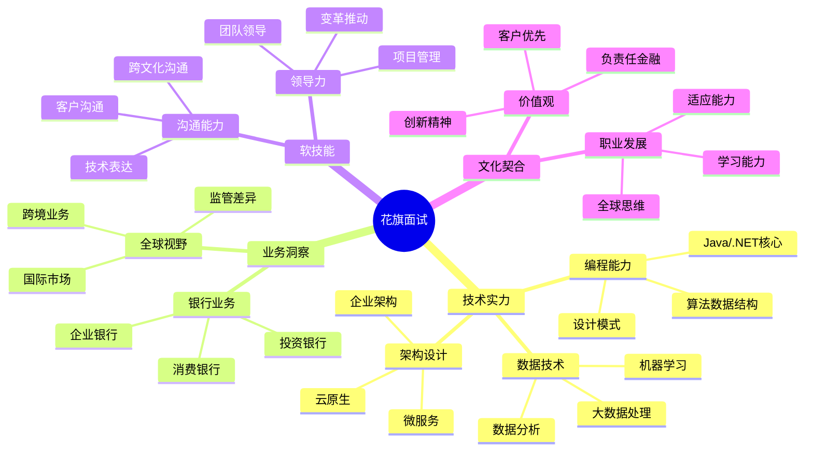

# 花旗银行 (Citibank) 面试题库

## 🏦 公司简介

花旗银行是美国最大的银行之一，也是全球领先的金融服务机构。作为一家拥有200多年历史的国际银行，花旗银行在投资银行、消费银行、企业银行等领域都有强大的业务影响力。花旗注重数字化创新和全球化人才培养。

## 📍 面试特点

### 面试流程
1. **在线申请** - 简历筛选和初步评估
2. **在线测评** - 逻辑推理和技术基础测试
3. **电话/视频面试** - HR和技术初面
4. **现场面试** - 多轮技术和行为面试
5. **高管面试** - 最终文化契合度评估

### 核心价值观
- **负责任的金融** (Responsible Finance)
- **客户优先** (Client Focus) 
- **创新思维** (Innovation)
- **领导力** (Leadership)

## 📚 面试题分类

### 技术面试题
- [Java开发岗位](./java-developer.md)
- [.NET开发岗位](./dotnet-developer.md)
- [数据库设计](./database-design.md)
- [微服务架构](./microservices.md)
- [云计算平台](./cloud-platform.md)

### 量化分析相关
- [风险分析模型](./risk-analysis.md)
- [交易系统设计](./trading-systems.md)
- [数据科学应用](./data-science.md)
- [算法交易](./algorithmic-trading.md)

### 行为面试题
- [行为面试题库](./behavioral-interview.md)
- [领导力案例](./leadership-cases.md)
- [团队协作](./teamwork.md)
- [客户服务](./customer-service.md)
- [变革管理](./change-management.md)

### 业务知识题
- [投资银行业务](./investment-banking.md)
- [消费银行业务](./consumer-banking.md)
- [风险管理](./risk-management.md)
- [合规监管](./compliance.md)

## 💡 面试准备重点

### 技术能力要求
1. **编程基础**：Java/.NET/Python 深度掌握
2. **架构设计**：企业级应用架构经验
3. **数据处理**：大数据技术和分析能力
4. **云技术**：AWS/Azure 云平台经验
5. **安全意识**：金融级安全要求理解

### 业务理解要求
- **全球银行业务**：了解国际银行运营模式
- **监管环境**：熟悉各国金融监管要求
- **数字化转型**：理解银行数字化发展趋势
- **客户体验**：关注用户体验和客户需求

## 🎯 面试评估维度

## 🌟 面试成功策略

### 技术面试准备
1. **企业级经验**：准备大型系统开发经验
2. **架构思维**：展示系统架构设计能力
3. **安全意识**：体现对金融安全的重视
4. **性能优化**：展示系统性能调优经验

### 行为面试准备
1. **全球化视野**：准备国际化项目经验
2. **客户导向**：强调以客户为中心的思维
3. **变革领导**：展示推动业务变革的能力
4. **团队合作**：体现跨部门协作经验

## 📊 技术栈重点

### 核心技术栈
- **后端**：Java 8+, .NET Core, Spring Boot
- **数据库**：Oracle, SQL Server, MongoDB
- **中间件**：IBM MQ, Apache Kafka, Redis
- **云平台**：AWS, Azure, Private Cloud
- **监控**：Splunk, Dynatrace, ELK Stack

### 金融技术特色
- **核心银行系统**：Account Management, Transaction Processing
- **风控系统**：Real-time Risk Engine, Fraud Detection
- **报送系统**：Regulatory Reporting, Compliance Check
- **客户系统**：CRM, Customer Analytics, Personalization

## 🔍 面试难点和重点

### 技术挑战
- **高并发处理**：银行交易系统的并发设计
- **数据一致性**：分布式事务和数据一致性
- **安全防护**：金融级安全架构设计
- **合规要求**：技术方案的合规性考虑

### 业务理解
- **全球业务**：跨国银行的业务模式理解
- **监管合规**：各国监管要求的技术实现
- **客户需求**：不同客户群体的技术需求
- **创新应用**：金融科技创新的技术实现

## 💼 职业发展路径

### 技术专家路线
- **Developer** → **Senior Developer** → **Tech Lead** → **Principal Engineer**
- 专注于技术深度和架构设计

### 技术管理路线
- **Developer** → **Team Lead** → **Engineering Manager** → **Director**
- 技术与管理并重的发展路径

### 业务技术路线
- **BA** → **Senior BA** → **Product Manager** → **Head of Product**
- 技术与业务结合的发展方向

## 🎓 学习建议

### 技术提升重点
1. **企业级Java**：Spring生态系统深度掌握
2. **云原生技术**：容器、微服务、服务网格
3. **大数据技术**：Hadoop、Spark、实时计算
4. **安全技术**：金融安全、加密技术、身份认证

### 业务知识储备
1. **银行业务**：了解银行各条线业务流程
2. **金融产品**：掌握各类金融产品特点
3. **监管环境**：学习国际金融监管要求
4. **行业趋势**：关注金融科技发展动态

## 🔗 相关资源

- [花旗官网招聘页面](https://www.citigroup.com/citi/careers/)
- [花旗企业文化](https://www.citigroup.com/citi/about/our-culture/)
- [金融监管指南](../../../docs/financial-regulations.md)
- [企业架构设计](../../../docs/enterprise-architecture.md)

---
[← 返回公司目录](../README.md) | [← 返回主目录](../../../README.md) 