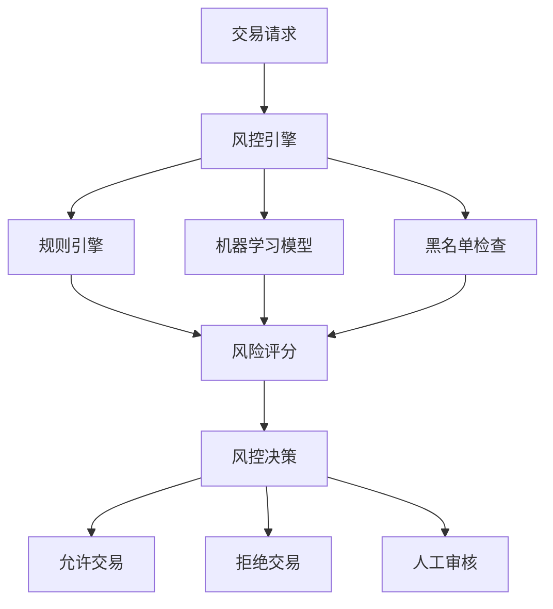

# 花旗银行 Java开发岗位面试题

## 📚 题目概览

花旗银行Java开发面试注重候选人的企业级开发经验、金融业务理解和系统架构能力。面试题目覆盖Java核心技术、分布式系统、数据库设计和金融业务场景。

## 🎯 核心技术考察重点

### Java基础与进阶
- JVM内存模型和垃圾回收
- 并发编程和线程安全
- Spring生态系统深度应用
- 设计模式在金融系统中的应用

### 企业级开发
- 微服务架构设计
- 分布式事务处理
- 缓存策略和数据一致性
- API设计和版本管理

## 📝 面试题目

### 1. Java核心技术

#### 题目1：并发编程实战
**问题**：在银行交易系统中，如何设计一个线程安全的账户余额管理器，支持并发的存取款操作？

**考察点**：
- 线程安全设计
- 锁机制选择
- 性能优化
- 数据一致性

**参考答案**：
```java
public class AccountManager {
    private final ConcurrentHashMap<String, Account> accounts = new ConcurrentHashMap<>();
    private final StampedLock lock = new StampedLock();
    
    public class Account {
        private volatile BigDecimal balance;
        private final ReentrantReadWriteLock accountLock = new ReentrantReadWriteLock();
        
        public boolean withdraw(BigDecimal amount) {
            accountLock.writeLock().lock();
            try {
                if (balance.compareTo(amount) >= 0) {
                    balance = balance.subtract(amount);
                    return true;
                }
                return false;
            } finally {
                accountLock.writeLock().unlock();
            }
        }
        
        public void deposit(BigDecimal amount) {
            accountLock.writeLock().lock();
            try {
                balance = balance.add(amount);
            } finally {
                accountLock.writeLock().unlock();
            }
        }
        
        public BigDecimal getBalance() {
            accountLock.readLock().lock();
            try {
                return balance;
            } finally {
                accountLock.readLock().unlock();
            }
        }
    }
    
    public boolean transfer(String fromAccount, String toAccount, BigDecimal amount) {
        // 按账户ID排序加锁，避免死锁
        String firstLock = fromAccount.compareTo(toAccount) < 0 ? fromAccount : toAccount;
        String secondLock = fromAccount.compareTo(toAccount) < 0 ? toAccount : fromAccount;
        
        Account first = accounts.get(firstLock);
        Account second = accounts.get(secondLock);
        
        synchronized(first) {
            synchronized(second) {
                Account from = accounts.get(fromAccount);
                Account to = accounts.get(toAccount);
                
                if (from.withdraw(amount)) {
                    to.deposit(amount);
                    return true;
                }
                return false;
            }
        }
    }
}
```

#### 题目2：JVM性能调优
**问题**：银行核心系统在高峰期出现频繁的Full GC，导致系统响应缓慢。请分析可能的原因并提供优化方案。

**分析思路**：
1. **内存泄漏排查**：检查对象引用关系
2. **堆内存配置**：调整新生代和老年代比例
3. **GC算法选择**：选择适合的垃圾收集器
4. **代码优化**：减少对象创建和大对象分配

**优化方案**：
```bash
# JVM参数优化示例
-Xms8g -Xmx8g
-XX:NewRatio=3
-XX:+UseG1GC
-XX:MaxGCPauseMillis=200
-XX:+PrintGCDetails
-XX:+PrintGCTimeStamps
-XX:+HeapDumpOnOutOfMemoryError
```

### 2. 框架和中间件

#### 题目3：Spring Boot微服务设计
**问题**：设计一个银行账户服务的微服务架构，包括账户管理、交易记录和风险控制功能。

**系统架构**：
```java
// 账户服务接口
@RestController
@RequestMapping("/api/accounts")
public class AccountController {
    
    @Autowired
    private AccountService accountService;
    
    @Autowired
    private RiskService riskService;
    
    @PostMapping("/transfer")
    @Transactional
    public ResponseEntity<TransferResponse> transfer(@RequestBody @Valid TransferRequest request) {
        // 风险检查
        RiskAssessment risk = riskService.assessTransfer(request);
        if (risk.isHighRisk()) {
            return ResponseEntity.status(HttpStatus.FORBIDDEN)
                .body(new TransferResponse("RISK_REJECTED", risk.getReason()));
        }
        
        // 执行转账
        TransferResult result = accountService.transfer(
            request.getFromAccount(),
            request.getToAccount(),
            request.getAmount()
        );
        
        if (result.isSuccess()) {
            // 异步记录交易
            eventPublisher.publishEvent(new TransferCompletedEvent(result));
            return ResponseEntity.ok(new TransferResponse("SUCCESS", result.getTransactionId()));
        } else {
            return ResponseEntity.badRequest()
                .body(new TransferResponse("FAILED", result.getErrorMessage()));
        }
    }
}

// 服务实现
@Service
public class AccountServiceImpl implements AccountService {
    
    @Autowired
    private AccountRepository accountRepository;
    
    @Autowired
    private TransactionRepository transactionRepository;
    
    @Override
    @Transactional
    public TransferResult transfer(String fromAccountId, String toAccountId, BigDecimal amount) {
        Account fromAccount = accountRepository.findByIdForUpdate(fromAccountId);
        Account toAccount = accountRepository.findByIdForUpdate(toAccountId);
        
        if (fromAccount.getBalance().compareTo(amount) < 0) {
            return TransferResult.failed("INSUFFICIENT_FUNDS");
        }
        
        // 更新账户余额
        fromAccount.setBalance(fromAccount.getBalance().subtract(amount));
        toAccount.setBalance(toAccount.getBalance().add(amount));
        
        accountRepository.save(fromAccount);
        accountRepository.save(toAccount);
        
        // 记录交易
        Transaction transaction = new Transaction();
        transaction.setFromAccount(fromAccountId);
        transaction.setToAccount(toAccountId);
        transaction.setAmount(amount);
        transaction.setTimestamp(Instant.now());
        transaction.setStatus(TransactionStatus.COMPLETED);
        
        Transaction saved = transactionRepository.save(transaction);
        
        return TransferResult.success(saved.getId());
    }
}
```

#### 题目4：分布式事务处理
**问题**：在跨多个微服务的银行转账场景中，如何保证数据一致性？

**解决方案对比**：

1. **Saga模式**：
```java
@Component
public class TransferSaga {
    
    @SagaOrchestrationStart
    public void startTransfer(TransferCommand command) {
        // 步骤1：冻结源账户资金
        sagaManager.choreography()
            .step("freezeFunds")
            .invokeParticipant("account-service")
            .withCompensation("unfreezeFunds")
            
            // 步骤2：检查目标账户
            .step("validateTargetAccount")
            .invokeParticipant("account-service")
            
            // 步骤3：执行转账
            .step("executeTransfer")
            .invokeParticipant("transfer-service")
            .withCompensation("reverseTransfer")
            
            // 步骤4：记录交易
            .step("recordTransaction")
            .invokeParticipant("transaction-service")
            
            .execute();
    }
}
```

2. **TCC模式**：
```java
@TccTransaction
public interface AccountService {
    
    @Compensable(confirmMethod = "confirmWithdraw", cancelMethod = "cancelWithdraw")
    boolean tryWithdraw(String accountId, BigDecimal amount);
    
    boolean confirmWithdraw(String accountId, BigDecimal amount);
    
    boolean cancelWithdraw(String accountId, BigDecimal amount);
}
```

### 3. 数据库相关

#### 题目5：数据库设计和优化
**问题**：设计银行交易记录表，要求支持每秒10万笔交易的写入，同时满足实时查询需求。

**表结构设计**：
```sql
-- 交易主表（按时间分区）
CREATE TABLE transactions (
    transaction_id BIGINT PRIMARY KEY,
    from_account_id VARCHAR(32) NOT NULL,
    to_account_id VARCHAR(32) NOT NULL,
    amount DECIMAL(18,2) NOT NULL,
    currency_code CHAR(3) NOT NULL,
    transaction_type TINYINT NOT NULL,
    status TINYINT NOT NULL,
    created_at TIMESTAMP DEFAULT CURRENT_TIMESTAMP,
    updated_at TIMESTAMP DEFAULT CURRENT_TIMESTAMP ON UPDATE CURRENT_TIMESTAMP,
    
    INDEX idx_from_account_time (from_account_id, created_at),
    INDEX idx_to_account_time (to_account_id, created_at),
    INDEX idx_status_time (status, created_at)
) PARTITION BY RANGE (UNIX_TIMESTAMP(created_at)) (
    PARTITION p202401 VALUES LESS THAN (UNIX_TIMESTAMP('2024-02-01')),
    PARTITION p202402 VALUES LESS THAN (UNIX_TIMESTAMP('2024-03-01')),
    -- 按月分区...
);

-- 账户余额快照表
CREATE TABLE account_balances (
    account_id VARCHAR(32) PRIMARY KEY,
    balance DECIMAL(18,2) NOT NULL,
    frozen_amount DECIMAL(18,2) DEFAULT 0,
    last_transaction_id BIGINT,
    updated_at TIMESTAMP DEFAULT CURRENT_TIMESTAMP ON UPDATE CURRENT_TIMESTAMP,
    version INT DEFAULT 1,
    
    INDEX idx_updated_at (updated_at)
);
```

**性能优化策略**：
```java
@Repository
public class TransactionRepositoryImpl implements TransactionRepository {
    
    @Autowired
    private JdbcTemplate jdbcTemplate;
    
    // 批量插入优化
    public void batchInsertTransactions(List<Transaction> transactions) {
        String sql = """
            INSERT INTO transactions 
            (transaction_id, from_account_id, to_account_id, amount, currency_code, 
             transaction_type, status, created_at) 
            VALUES (?, ?, ?, ?, ?, ?, ?, ?)
            """;
            
        List<Object[]> batchArgs = transactions.stream()
            .map(t -> new Object[]{
                t.getTransactionId(),
                t.getFromAccountId(),
                t.getToAccountId(),
                t.getAmount(),
                t.getCurrencyCode(),
                t.getTransactionType().ordinal(),
                t.getStatus().ordinal(),
                t.getCreatedAt()
            })
            .collect(Collectors.toList());
            
        jdbcTemplate.batchUpdate(sql, batchArgs);
    }
    
    // 分页查询优化
    public Page<Transaction> findTransactionsByAccount(
            String accountId, LocalDateTime startTime, LocalDateTime endTime, 
            Pageable pageable) {
        
        // 使用覆盖索引优化查询
        String countSql = """
            SELECT COUNT(*) FROM transactions 
            WHERE (from_account_id = ? OR to_account_id = ?) 
            AND created_at BETWEEN ? AND ?
            """;
            
        String dataSql = """
            SELECT transaction_id, from_account_id, to_account_id, amount, 
                   currency_code, transaction_type, status, created_at
            FROM transactions 
            WHERE (from_account_id = ? OR to_account_id = ?) 
            AND created_at BETWEEN ? AND ?
            ORDER BY created_at DESC
            LIMIT ? OFFSET ?
            """;
            
        Long total = jdbcTemplate.queryForObject(countSql, Long.class, 
            accountId, accountId, startTime, endTime);
            
        List<Transaction> transactions = jdbcTemplate.query(dataSql,
            new TransactionRowMapper(),
            accountId, accountId, startTime, endTime,
            pageable.getPageSize(), pageable.getOffset());
            
        return new PageImpl<>(transactions, pageable, total);
    }
}
```

### 4. 系统设计题

#### 题目6：实时风控系统设计
**问题**：设计一个实时交易风控系统，要求在100ms内完成风险评估。

**系统架构**：


**核心实现**：
```java
@Service
public class RealTimeRiskEngine {
    
    @Autowired
    private RuleEngine ruleEngine;
    
    @Autowired
    private MLModelService mlModelService;
    
    @Autowired
    private BlacklistService blacklistService;
    
    public RiskAssessment assessTransaction(TransactionRequest request) {
        CompletableFuture<RuleResult> rulesFuture = 
            CompletableFuture.supplyAsync(() -> ruleEngine.evaluate(request));
            
        CompletableFuture<MLScore> mlFuture = 
            CompletableFuture.supplyAsync(() -> mlModelService.score(request));
            
        CompletableFuture<BlacklistResult> blacklistFuture = 
            CompletableFuture.supplyAsync(() -> blacklistService.check(request));
        
        try {
            // 并行执行，100ms超时
            CompletableFuture<Void> allTasks = CompletableFuture.allOf(
                rulesFuture, mlFuture, blacklistFuture);
            allTasks.get(100, TimeUnit.MILLISECONDS);
            
            RuleResult rules = rulesFuture.get();
            MLScore mlScore = mlFuture.get();
            BlacklistResult blacklist = blacklistFuture.get();
            
            return calculateRisk(rules, mlScore, blacklist);
            
        } catch (TimeoutException e) {
            // 超时降级处理
            return RiskAssessment.defaultPolicy(request);
        }
    }
    
    private RiskAssessment calculateRisk(RuleResult rules, MLScore mlScore, BlacklistResult blacklist) {
        if (blacklist.isBlacklisted()) {
            return RiskAssessment.reject("BLACKLISTED");
        }
        
        double finalScore = 0.4 * rules.getScore() + 0.6 * mlScore.getScore();
        
        if (finalScore > 0.8) {
            return RiskAssessment.reject("HIGH_RISK");
        } else if (finalScore > 0.6) {
            return RiskAssessment.review("MEDIUM_RISK");
        } else {
            return RiskAssessment.approve("LOW_RISK");
        }
    }
}
```

## 📊 面试评分标准

### 技术能力 (40%)
- Java基础知识掌握程度
- 框架使用经验和深度理解
- 数据库设计和优化能力
- 系统架构和设计思维

### 金融业务理解 (30%)
- 银行业务流程理解
- 金融风险意识
- 合规和安全考虑
- 业务场景分析能力

### 问题解决能力 (20%)
- 复杂问题分析能力
- 解决方案设计思路
- 技术选型合理性
- 性能和扩展性考虑

### 沟通表达 (10%)
- 技术表达清晰度
- 思路逻辑性
- 团队协作意识
- 学习能力展现

## 🎯 备考建议

### 重点准备方向
1. **Java深度**：深入理解JVM、并发、框架原理
2. **分布式系统**：掌握微服务、分布式事务、缓存
3. **数据库技术**：SQL优化、分库分表、事务处理
4. **金融知识**：了解银行业务、风险管理、合规要求

### 实践项目建议
1. 开发一个简单的银行转账系统
2. 实现分布式事务处理方案
3. 设计高并发的交易处理系统
4. 学习金融风控相关技术

---
[← 返回花旗银行面试题库](./README.md) 