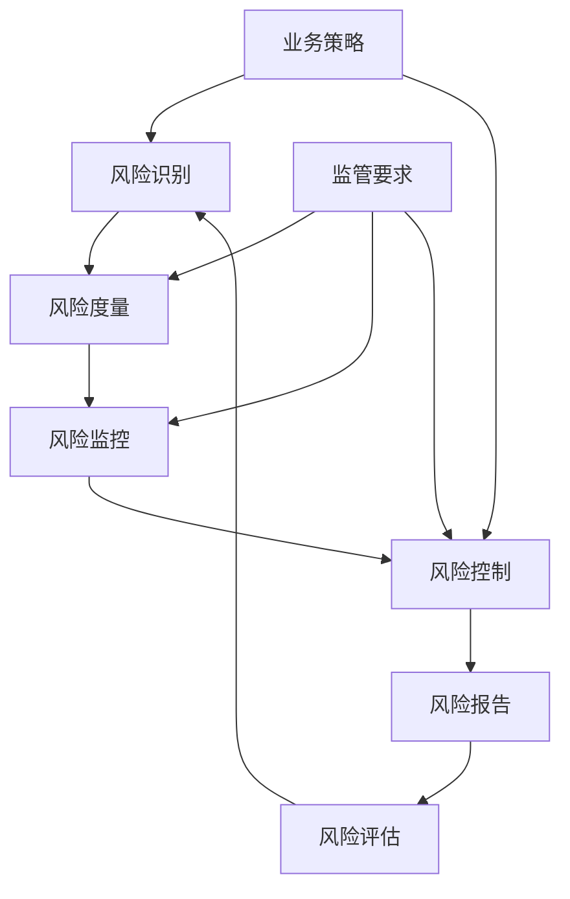

# 花旗银行风险管理面试题

## 📚 题目概览

花旗银行作为全球领先的金融机构，对风险管理有着严格的要求。技术人员需要深入理解各类金融风险，并能够设计和实现相应的风险管理系统。

## 🎯 风险管理框架

### 主要风险类型
- **市场风险** - 利率、汇率、股价、商品价格波动风险
- **信用风险** - 交易对手违约和信用质量下降风险
- **操作风险** - 人员、流程、系统和外部事件导致的风险
- **流动性风险** - 资金流动性和市场流动性不足风险
- **模型风险** - 模型设计缺陷或使用不当导致的风险

### 风险管理流程


## 📝 核心面试题目

### 1. 市场风险管理

#### 题目1：VaR计算引擎设计
**问题**：设计一个支持多种方法的VaR（Value at Risk）计算系统，包括历史模拟法、蒙特卡罗法和参数法。

**技术要求**：
- 支持日VaR、周VaR、月VaR计算
- 不同置信度水平（95%、99%、99.9%）
- 实时计算和批量计算
- 组合层面和单一资产层面VaR

**核心实现**：
```java
@Service
public class VaRCalculationEngine {
    
    public enum VaRMethod {
        HISTORICAL_SIMULATION,
        MONTE_CARLO,
        PARAMETRIC
    }
    
    public VaRResult calculateVaR(Portfolio portfolio, VaRParameters params) {
        switch (params.getMethod()) {
            case HISTORICAL_SIMULATION:
                return calculateHistoricalVaR(portfolio, params);
            case MONTE_CARLO:
                return calculateMonteCarloVaR(portfolio, params);
            case PARAMETRIC:
                return calculateParametricVaR(portfolio, params);
            default:
                throw new IllegalArgumentException("不支持的VaR计算方法");
        }
    }
    
    private VaRResult calculateHistoricalVaR(Portfolio portfolio, VaRParameters params) {
        // 获取历史价格数据
        List<PriceVector> historicalPrices = dataService.getHistoricalPrices(
            portfolio.getAssets(), params.getHistoryPeriod());
        
        // 计算历史收益率
        List<Double> historicalReturns = calculatePortfolioReturns(portfolio, historicalPrices);
        
        // 排序收益率
        Collections.sort(historicalReturns);
        
        // 计算VaR
        int varIndex = (int) Math.ceil((1 - params.getConfidenceLevel()) * historicalReturns.size()) - 1;
        double varValue = -historicalReturns.get(varIndex) * portfolio.getValue();
        
        // 计算Expected Shortfall
        double expectedShortfall = calculateExpectedShortfall(historicalReturns, varIndex, portfolio.getValue());
        
        return VaRResult.builder()
            .method(VaRMethod.HISTORICAL_SIMULATION)
            .var(varValue)
            .expectedShortfall(expectedShortfall)
            .confidenceLevel(params.getConfidenceLevel())
            .holdingPeriod(params.getHoldingPeriod())
            .asOfDate(LocalDate.now())
            .build();
    }
    
    private VaRResult calculateMonteCarloVaR(Portfolio portfolio, VaRParameters params) {
        // 1. 构建风险因子相关矩阵
        CovarianceMatrix covMatrix = calculateCovarianceMatrix(portfolio.getRiskFactors());
        
        // 2. Cholesky分解
        CholeskyDecomposition cholesky = new CholeskyDecomposition(covMatrix.getMatrix());
        
        // 3. 蒙特卡罗模拟
        List<Double> simulatedReturns = new ArrayList<>();
        Random random = new Random();
        
        for (int i = 0; i < params.getSimulationCount(); i++) {
            // 生成独立正态随机数
            double[] independentShocks = generateIndependentShocks(portfolio.getRiskFactors().size(), random);
            
            // 通过Cholesky分解得到相关的随机冲击
            double[] correlatedShocks = cholesky.getL().operate(independentShocks);
            
            // 计算组合收益率
            double portfolioReturn = calculatePortfolioReturn(portfolio, correlatedShocks);
            simulatedReturns.add(portfolioReturn);
        }
        
        // 4. 计算VaR和ES
        Collections.sort(simulatedReturns);
        int varIndex = (int) Math.ceil((1 - params.getConfidenceLevel()) * simulatedReturns.size()) - 1;
        double varValue = -simulatedReturns.get(varIndex) * portfolio.getValue();
        double expectedShortfall = calculateExpectedShortfall(simulatedReturns, varIndex, portfolio.getValue());
        
        return VaRResult.builder()
            .method(VaRMethod.MONTE_CARLO)
            .var(varValue)
            .expectedShortfall(expectedShortfall)
            .confidenceLevel(params.getConfidenceLevel())
            .simulationCount(params.getSimulationCount())
            .build();
    }
    
    private VaRResult calculateParametricVaR(Portfolio portfolio, VaRParameters params) {
        // 1. 计算组合收益率的均值和标准差
        PortfolioStatistics stats = calculatePortfolioStatistics(portfolio, params.getHistoryPeriod());
        
        // 2. 正态分布假设下的VaR计算
        double zScore = calculateZScore(params.getConfidenceLevel());
        double varValue = portfolio.getValue() * (stats.getMean() + zScore * stats.getStandardDeviation());
        
        // 3. 参数法Expected Shortfall
        double expectedShortfall = portfolio.getValue() * 
            (stats.getMean() + stats.getStandardDeviation() * 
             calculateExpectedShortfallMultiplier(params.getConfidenceLevel()));
        
        return VaRResult.builder()
            .method(VaRMethod.PARAMETRIC)
            .var(Math.abs(varValue))
            .expectedShortfall(Math.abs(expectedShortfall))
            .confidenceLevel(params.getConfidenceLevel())
            .portfolioVolatility(stats.getStandardDeviation())
            .build();
    }
}
```

#### 题目2：实时风险监控系统
**问题**：设计一个实时风险监控系统，要求在市场数据更新后100ms内完成风险计算。

**系统架构**：
```java
@Component
public class RealTimeRiskMonitor {
    
    @EventListener
    @Async
    public void onMarketDataUpdate(MarketDataEvent event) {
        List<Portfolio> affectedPortfolios = findAffectedPortfolios(event.getRiskFactors());
        
        // 并行处理多个组合的风险计算
        List<CompletableFuture<RiskMetrics>> futures = affectedPortfolios.stream()
            .map(portfolio -> CompletableFuture.supplyAsync(() -> 
                calculateRiskMetrics(portfolio, event.getMarketData())))
            .collect(Collectors.toList());
        
        // 100ms超时限制
        try {
            List<RiskMetrics> results = futures.stream()
                .map(future -> future.get(100, TimeUnit.MILLISECONDS))
                .collect(Collectors.toList());
            
            // 检查风险限额
            checkRiskLimits(results);
            
        } catch (TimeoutException e) {
            // 超时处理：使用缓存值或降级策略
            handleCalculationTimeout(affectedPortfolios);
        }
    }
    
    private RiskMetrics calculateRiskMetrics(Portfolio portfolio, MarketData marketData) {
        // 增量计算优化
        RiskMetrics cachedMetrics = riskCache.get(portfolio.getId());
        
        if (cachedMetrics != null && !hasSignificantChange(portfolio, marketData)) {
            // 市场变化不大，使用缓存结果
            return adjustForMinorChanges(cachedMetrics, marketData);
        }
        
        // 重新计算风险指标
        double var = varCalculator.calculateVaR(portfolio, marketData);
        double stress = stressCalculator.calculateStress(portfolio, marketData);
        
        RiskMetrics metrics = RiskMetrics.builder()
            .portfolioId(portfolio.getId())
            .var(var)
            .stressLoss(stress)
            .timestamp(Instant.now())
            .build();
        
        // 更新缓存
        riskCache.put(portfolio.getId(), metrics);
        
        return metrics;
    }
}

### 2. 信用风险管理

#### 题目3：信用评分模型系统
**问题**：设计一个机器学习驱动的信用评分系统，支持模型训练、部署和监控。

**模型要求**：
- 支持多种机器学习算法（逻辑回归、随机森林、XGBoost等）
- 模型训练、验证和部署流程
- 模型性能监控和漂移检测
- 可解释性和公平性分析

**核心架构**：
```java
@Service
public class CreditScoringEngine {
    
    public CreditScore calculateCreditScore(Customer customer, ScoringModel model) {
        // 特征工程
        FeatureVector features = featureService.extractFeatures(customer);
        
        // 数据预处理
        FeatureVector preprocessedFeatures = preprocessFeatures(features, model.getPreprocessor());
        
        // 模型预测
        ModelPrediction prediction = model.predict(preprocessedFeatures);
        
        // 分数映射
        int creditScore = mapToScoreRange(prediction.getProbability());
        
        // 风险等级确定
        RiskGrade riskGrade = determineRiskGrade(creditScore);
        
        // 生成解释
        List<FeatureImportance> explanations = generateExplanations(
            preprocessedFeatures, prediction, model);
        
        return CreditScore.builder()
            .customerId(customer.getId())
            .score(creditScore)
            .riskGrade(riskGrade)
            .defaultProbability(prediction.getProbability())
            .modelVersion(model.getVersion())
            .scoreDate(LocalDate.now())
            .explanations(explanations)
            .build();
    }
    
    @Scheduled(cron = "0 0 2 * * ?") // 每天凌晨2点执行
    public void monitorModelPerformance() {
        List<ScoringModel> models = modelRepository.findActiveModels();
        
        for (ScoringModel model : models) {
            // 检查模型性能
            ModelPerformance performance = evaluateModelPerformance(model);
            
            if (performance.needsRetraining()) {
                // 重新训练模型
                trainingService.scheduleRetraining(model);
            }
        }
    }
}
```

#### 题目4：信用集中度风险管理
**问题**：设计一个信用集中度风险监控系统，支持多维度的集中度分析。

**集中度维度**：
- 单一客户集中度
- 行业集中度  
- 地理区域集中度
- 产品类型集中度
- 担保品类型集中度

**监控系统实现**：
```java
@Component
public class CreditConcentrationMonitor {
    
    public ConcentrationRiskReport generateConcentrationReport(Portfolio creditPortfolio) {
        // 并行计算各维度集中度
        CompletableFuture<SingleNameConcentration> singleNameFuture = 
            CompletableFuture.supplyAsync(() -> calculateSingleNameConcentration(creditPortfolio));
            
        CompletableFuture<IndustryConcentration> industryFuture = 
            CompletableFuture.supplyAsync(() -> calculateIndustryConcentration(creditPortfolio));
            
        CompletableFuture<GeographicConcentration> geoFuture = 
            CompletableFuture.supplyAsync(() -> calculateGeographicConcentration(creditPortfolio));
            
        CompletableFuture<ProductConcentration> productFuture = 
            CompletableFuture.supplyAsync(() -> calculateProductConcentration(creditPortfolio));
        
        try {
            // 等待所有计算完成
            CompletableFuture.allOf(singleNameFuture, industryFuture, geoFuture, productFuture).get();
            
            SingleNameConcentration singleName = singleNameFuture.get();
            IndustryConcentration industry = industryFuture.get();
            GeographicConcentration geographic = geoFuture.get();
            ProductConcentration product = productFuture.get();
            
            // 计算综合集中度风险
            double overallConcentrationRisk = calculateOverallRisk(singleName, industry, geographic, product);
            
            // 检查限额违反
            List<LimitBreach> breaches = checkConcentrationLimits(singleName, industry, geographic, product);
            
            return ConcentrationRiskReport.builder()
                .singleNameConcentration(singleName)
                .industryConcentration(industry)
                .geographicConcentration(geographic)
                .productConcentration(product)
                .overallRisk(overallConcentrationRisk)
                .limitBreaches(breaches)
                .reportDate(LocalDate.now())
                .build();
                
        } catch (Exception e) {
            throw new RiskCalculationException("集中度风险计算失败", e);
        }
    }
    
    private SingleNameConcentration calculateSingleNameConcentration(Portfolio portfolio) {
        // 1. 按客户分组计算敞口
        Map<Customer, Double> customerExposures = portfolio.getPositions().stream()
            .collect(Collectors.groupingBy(
                Position::getCustomer,
                Collectors.summingDouble(Position::getExposure)
            ));
        
        // 2. 计算集中度指标
        double totalExposure = portfolio.getTotalExposure();
        double maxSingleExposure = customerExposures.values().stream()
            .max(Double::compare).orElse(0.0);
        double top10Concentration = customerExposures.values().stream()
            .sorted(Collections.reverseOrder())
            .limit(10)
            .mapToDouble(Double::doubleValue)
            .sum() / totalExposure;
        
        // 3. 计算HHI指数（Herfindahl-Hirschman Index）
        double hhi = customerExposures.values().stream()
            .mapToDouble(exposure -> Math.pow(exposure / totalExposure, 2))
            .sum();
        
        return SingleNameConcentration.builder()
            .maxSingleConcentration(maxSingleExposure / totalExposure)
            .top10Concentration(top10Concentration)
            .hhiIndex(hhi)
            .numberOfCustomers(customerExposures.size())
            .build();
    }
    
    private List<LimitBreach> checkConcentrationLimits(
            SingleNameConcentration singleName, IndustryConcentration industry,
            GeographicConcentration geographic, ProductConcentration product) {
        
        List<LimitBreach> breaches = new ArrayList<>();
        
        // 检查单一客户限额
        if (singleName.getMaxSingleConcentration() > SINGLE_NAME_LIMIT) {
            breaches.add(LimitBreach.builder()
                .limitType("SINGLE_NAME")
                .currentValue(singleName.getMaxSingleConcentration())
                .limitValue(SINGLE_NAME_LIMIT)
                .severity(calculateSeverity(singleName.getMaxSingleConcentration(), SINGLE_NAME_LIMIT))
                .build());
        }
        
        // 检查行业集中度限额
        for (IndustryExposure industryExp : industry.getTop10Industries()) {
            double industryLimit = getIndustryLimit(industryExp.getIndustry());
            if (industryExp.getConcentration() > industryLimit) {
                breaches.add(LimitBreach.builder()
                    .limitType("INDUSTRY")
                    .description(industryExp.getIndustry().getName())
                    .currentValue(industryExp.getConcentration())
                    .limitValue(industryLimit)
                    .severity(calculateSeverity(industryExp.getConcentration(), industryLimit))
                    .build());
            }
        }
        
        return breaches;
    }
}

### 3. 操作风险管理

#### 题目5：异常交易检测系统
**问题**：设计一个基于机器学习的异常交易检测系统，能够实时识别可疑交易行为。

**检测维度**：
- 交易金额异常
- 交易频率异常
- 交易时间异常
- 交易对手异常
- 地理位置异常

**检测系统架构**：
```java
@Component
public class AnomalyDetectionEngine {
    
    @StreamListener("transactions")
    public void processTransaction(Transaction transaction) {
        // 并行执行规则检测和ML检测
        CompletableFuture<RuleBasedResult> ruleFuture = 
            CompletableFuture.supplyAsync(() -> ruleDetector.detect(transaction));
            
        CompletableFuture<MLDetectionResult> mlFuture = 
            CompletableFuture.supplyAsync(() -> mlService.detectAnomaly(transaction));
        
        try {
            RuleBasedResult ruleResult = ruleFuture.get(100, TimeUnit.MILLISECONDS);
            MLDetectionResult mlResult = mlFuture.get(500, TimeUnit.MILLISECONDS);
            
            // 融合检测结果
            AnomalyScore finalScore = fuseResults(ruleResult, mlResult);
            
            if (finalScore.getScore() > ANOMALY_THRESHOLD) {
                handleAnomalousTransaction(transaction, finalScore);
            }
            
        } catch (TimeoutException e) {
            // 检测超时，使用默认策略
            handleDetectionTimeout(transaction);
        }
    }
    
    private void handleAnomalousTransaction(Transaction transaction, AnomalyScore score) {
        // 记录异常交易
        AnomalousTransaction anomaly = AnomalousTransaction.builder()
            .transactionId(transaction.getId())
            .detectionTime(Instant.now())
            .anomalyScore(score.getScore())
            .triggers(score.getTriggers())
            .status(AnomalyStatus.DETECTED)
            .build();
        anomalyRepository.save(anomaly);
        
        // 根据分数确定处理策略
        if (score.getScore() > CRITICAL_THRESHOLD) {
            // 高风险：立即阻止交易
            transactionService.blockTransaction(transaction.getId());
            alertService.sendCriticalAlert(anomaly);
        } else if (score.getScore() > WARNING_THRESHOLD) {
            // 中风险：标记为待审核
            transactionService.flagForReview(transaction.getId());
            alertService.sendWarningAlert(anomaly);
        }
    }
}

### 4. 流动性风险管理

#### 题目6：流动性压力测试
**问题**：设计一个流动性压力测试系统，评估银行在极端市场条件下的流动性状况。

**压力测试实现**：
```java
@Service
public class LiquidityStressTestEngine {
    
    public LiquidityStressResult performStressTest(LiquidityPosition position, StressScenario scenario) {
        // 1. 计算现金流出
        CashOutflow stressedOutflow = calculateStressedOutflow(position, scenario);
        
        // 2. 计算现金流入
        CashInflow stressedInflow = calculateStressedInflow(position, scenario);
        
        // 3. 计算可变现资产
        LiquidAssets availableAssets = calculateAvailableAssets(position, scenario);
        
        // 4. 流动性缺口分析
        LiquidityGap gap = calculateLiquidityGap(stressedOutflow, stressedInflow, availableAssets);
        
        // 5. 生存期分析
        int survivalPeriod = calculateSurvivalPeriod(gap);
        
        return LiquidityStressResult.builder()
            .scenario(scenario.getName())
            .cashOutflow(stressedOutflow)
            .cashInflow(stressedInflow)
            .availableAssets(availableAssets)
            .liquidityGap(gap)
            .survivalPeriod(survivalPeriod)
            .lcr(calculateLCR(stressedInflow, stressedOutflow, availableAssets))
            .nsfr(calculateNSFR(position, scenario))
            .build();
    }
    
    private CashOutflow calculateStressedOutflow(LiquidityPosition position, StressScenario scenario) {
        // 零售存款流出
        double retailOutflow = position.getRetailDeposits() * scenario.getRetailRunoffRate();
        
        // 批发资金流出
        double wholesaleOutflow = position.getWholesaleFunding() * scenario.getWholesaleRunoffRate();
        
        // 承诺信贷额度使用
        double commitmentDrawdown = position.getUnusedCommitments() * scenario.getCommitmentDrawdownRate();
        
        // 衍生品保证金要求
        double derivativeMargin = position.getDerivativeExposure() * scenario.getMarginCallRate();
        
        return CashOutflow.builder()
            .retailOutflow(retailOutflow)
            .wholesaleOutflow(wholesaleOutflow)
            .commitmentDrawdown(commitmentDrawdown)
            .derivativeMargin(derivativeMargin)
            .totalOutflow(retailOutflow + wholesaleOutflow + commitmentDrawdown + derivativeMargin)
            .build();
    }
}

## 📊 技术评估重点

### 风险建模能力 (40%)
- VaR、ES等风险度量方法
- 信用风险建模（PD、LGD、EAD）
- 压力测试和情景分析
- 机器学习在风险管理中的应用

### 系统设计能力 (30%)
- 实时风险计算系统架构
- 大数据处理和存储
- 高可用性和容错设计
- 性能优化和扩展性

### 业务理解 (20%)
- 银行业务流程理解
- 监管要求和合规标准
- 风险管理最佳实践
- 金融市场知识

### 技术实现 (10%)
- 编程能力和代码质量
- 数据库设计和优化
- API设计和集成
- 测试和部署策略

## 🎯 备考建议

### 理论知识准备
1. **风险管理理论**：现代投资组合理论、CAPM、套利定价理论
2. **统计学基础**：概率分布、假设检验、回归分析
3. **金融数学**：期权定价、利率模型、信用风险模型
4. **监管框架**：巴塞尔协议III、CCAR、CECL

### 技术技能提升
1. **编程语言**：Java、Python、R、SQL
2. **大数据技术**：Spark、Hadoop、Kafka
3. **机器学习**：scikit-learn、TensorFlow、XGBoost
4. **数据库技术**：时间序列数据库、分布式数据库

### 实践项目
1. 实现VaR计算器
2. 开发信用评分模型
3. 构建异常检测系统
4. 设计压力测试框架

---
[← 返回花旗银行面试题库](./README.md) 