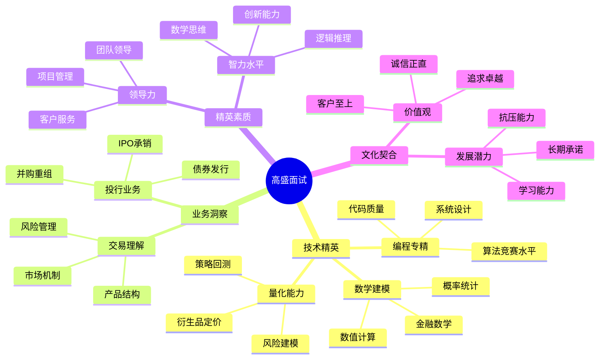

# 高盛 (Goldman Sachs) 面试题库

## 🏦 公司简介

高盛集团是全球顶级投资银行之一，在投资银行、证券交易、投资管理和消费银行等领域处于世界领先地位。高盛以其严格的招聘标准、精英文化和创新的金融技术而闻名，特别在量化交易和金融工程方面具有重要影响力。

## 📍 面试特点

### 面试流程
1. **在线申请** - 严格的简历筛选
2. **HackerRank测试** - 高难度编程测试
3. **电话技术面试** - 算法和系统设计
4. **Super Day** - 全天现场面试
5. **Managing Director面试** - 最终决策面试

### 核心价值观
- **客户至上** (Client Service)
- **诚信为本** (Integrity)
- **追求卓越** (Excellence)
- **团队精神** (Partnership)

## 📚 面试题分类

### 技术面试题
- [核心Java开发](./core-java.md)
- [C++量化开发](./cpp-quant.md)
- [Python算法交易](./python-trading.md)
- [系统架构设计](./system-architecture.md)
- [数据库优化](./database-optimization.md)

### 量化金融相关
- [衍生品定价](./derivatives-pricing.md)
- [风险管理模型](./risk-models.md)
- [高频交易系统](./hft-systems.md)
- [机器学习交易](./ml-trading.md)
- [数学建模](./mathematical-modeling.md)

### 算法面试题
- [高级算法题](./advanced-algorithms.md)
- [数据结构设计](./data-structures.md)
- [概率与统计](./probability-statistics.md)
- [数学智力题](./math-puzzles.md)

### 行为面试题
- [领导力案例](./leadership-scenarios.md)
- [团队协作](./teamwork-examples.md)
- [压力处理](./stress-management.md)
- [客户服务](./client-service.md)
- [道德判断](./ethical-dilemmas.md)

### 业务知识题
- [投资银行业务](./investment-banking.md)
- [资产管理](./asset-management.md)
- [市场交易](./market-trading.md)
- [风险控制](./risk-control.md)

## 💡 面试准备重点

### 技术能力要求
1. **编程精通**：Java/C++/Python 专家级水平
2. **算法能力**：ACM级别算法和数据结构
3. **系统设计**：大规模低延迟系统架构
4. **数学基础**：概率论、统计学、数值分析
5. **金融建模**：衍生品定价、风险建模

### 量化技能要求
- **数学建模**：偏微分方程、随机过程
- **金融工程**：Black-Scholes模型、Monte Carlo方法
- **统计分析**：时间序列分析、回归分析
- **机器学习**：深度学习在金融中的应用

## 🎯 面试评估维度



## 🌟 面试成功策略

### 技术面试准备
1. **算法竞赛训练**：达到ACM区域赛水平
2. **系统设计精通**：低延迟交易系统设计
3. **数学基础扎实**：微积分、线性代数、概率论
4. **金融知识深入**：期权定价、风险管理理论

### 行为面试准备
1. **精英经历**：展示顶尖的学术或职业成就
2. **领导力证明**：具体的团队领导经验
3. **客户导向**：体现为客户创造价值的思维
4. **高标准要求**：展示对卓越的不懈追求

## 📊 技术栈重点

### 量化开发技术栈
```cpp
// C++ 高频交易示例
#include <chrono>
#include <memory>
#include <atomic>

class HighFrequencyTradingEngine {
private:
    std::atomic<uint64_t> latency_ns_{0};
    
public:
    // 超低延迟订单处理
    void processOrder(const Order& order) {
        auto start = std::chrono::high_resolution_clock::now();
        
        // 风险检查 - 硬件加速
        if (!validateRiskLimits(order)) {
            return;
        }
        
        // 发送到交易所 - 内核旁路网络
        sendToExchange(order);
        
        auto end = std::chrono::high_resolution_clock::now();
        auto latency = std::chrono::duration_cast<std::chrono::nanoseconds>(end - start);
        latency_ns_.store(latency.count());
    }
    
    // 实时P&L计算
    double calculatePnL(const Position& position, double currentPrice) {
        return position.quantity * (currentPrice - position.avgPrice);
    }
};
```

### Python量化分析
```python
import numpy as np
import pandas as pd
from scipy import optimize
import matplotlib.pyplot as plt

class BlackScholesModel:
    """Black-Scholes期权定价模型"""
    
    @staticmethod
    def call_option_price(S, K, T, r, sigma):
        """欧式看涨期权定价"""
        from scipy.stats import norm
        
        d1 = (np.log(S/K) + (r + 0.5*sigma**2)*T) / (sigma*np.sqrt(T))
        d2 = d1 - sigma*np.sqrt(T)
        
        call_price = S*norm.cdf(d1) - K*np.exp(-r*T)*norm.cdf(d2)
        return call_price
    
    @staticmethod
    def delta(S, K, T, r, sigma):
        """期权Delta计算"""
        from scipy.stats import norm
        d1 = (np.log(S/K) + (r + 0.5*sigma**2)*T) / (sigma*np.sqrt(T))
        return norm.cdf(d1)

# 风险管理 - VaR计算
def calculate_var(returns, confidence_level=0.05):
    """历史模拟法计算VaR"""
    sorted_returns = np.sort(returns)
    index = int(confidence_level * len(sorted_returns))
    return sorted_returns[index]
```

## 🔍 面试难点和重点

### 算法题特色
- **极高难度**：通常为LeetCode Hard+级别
- **数学背景**：结合概率、统计、数值计算
- **优化要求**：时间复杂度和空间复杂度要求极严
- **实际应用**：与交易、风控业务场景结合

### 系统设计重点
- **低延迟系统**：微秒级响应时间要求
- **高可靠性**：金融级系统可靠性设计
- **实时风控**：毫秒级风险检查和限制
- **合规审计**：完整的交易审计轨迹

### 量化面试重点
- **数学建模**：随机过程、偏微分方程
- **金融理论**：CAPM、APT、期权定价理论
- **编程实现**：数值方法的高效实现
- **回测框架**：策略回测和风险分析

## 💼 职业发展路径

### 技术路线
- **Analyst** → **Associate** → **VP** → **MD**
- 从初级开发到技术架构师

### 量化路线
- **Quant Analyst** → **Senior Quant** → **Quant VP** → **Head of Quant**
- 专注于量化模型和策略开发

### 管理路线
- **Team Lead** → **Director** → **Managing Director**
- 技术管理和业务管理结合

## 🎓 学习建议

### 技术能力提升
1. **算法竞赛**：参加ACM、TopCoder等高水平竞赛
2. **数学基础**：深入学习数学分析、概率论
3. **系统架构**：研究高频交易系统架构
4. **金融理论**：学习量化金融和衍生品理论

### 实践项目建议
1. **量化策略**：开发并回测交易策略
2. **风险模型**：实现VaR、CVaR等风险度量
3. **期权定价**：实现各种期权定价模型
4. **高性能计算**：优化计算密集型金融算法

## 🏆 成功案例分析

### 技术面试成功要素
- **算法能力**：能够快速解决复杂算法问题
- **代码质量**：清晰、高效、可维护的代码
- **系统思维**：从业务需求到技术实现的全局思考
- **数学素养**：扎实的数学基础和建模能力

### 行为面试关键点
- **卓越追求**：展示超越平均水平的成就
- **团队协作**：在高压环境下的协作能力
- **客户导向**：理解并满足内外部客户需求
- **持续学习**：快速学习新技术和业务知识

## 🔗 相关资源

- [高盛官网招聘](https://www.goldmansachs.com/careers/)
- [量化金融学习资源](../../../docs/quantitative-finance.md)
- [算法竞赛训练](../../../docs/algorithm-contests.md)
- [系统设计指南](../../../docs/system-design-advanced.md)

---
[← 返回公司目录](../README.md) | [← 返回主目录](../../../README.md) 