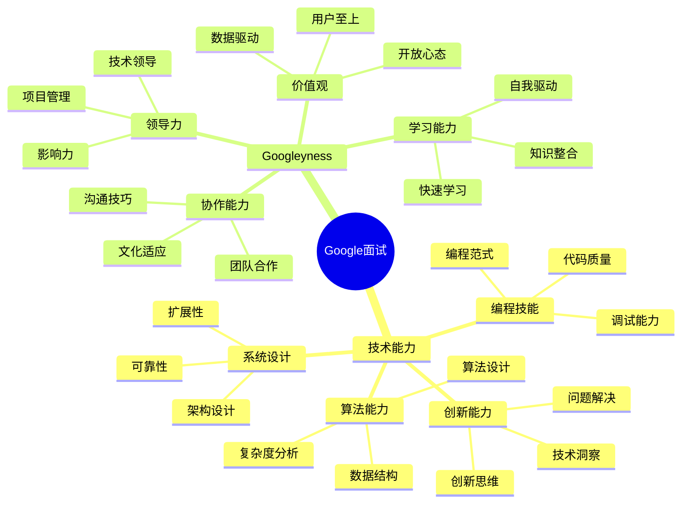

# 谷歌 (Google) 面试题库

## 🏢 公司简介

谷歌是全球最大的搜索引擎公司，也是技术创新的领导者。在搜索、广告、云计算、人工智能、移动操作系统等领域都有重要影响力。谷歌以其开放的企业文化、技术导向的工作环境和严格的技术面试标准而闻名。

## 📍 面试特点

### 面试流程
1. **简历筛选** - 教育背景和项目经验评估
2. **电话技术面试** - 算法和编程能力测试
3. **现场面试** - 4-5轮技术和行为面试
4. **团队匹配** - 与具体团队的匹配评估
5. **委员会评审** - 最终录用决定

### 核心价值观
- **以用户为本** (Focus on the user)
- **追求完美** (It's best to do one thing really well)
- **快速迭代** (Fast is better than slow)
- **开放透明** (Democracy on the web works)

## 📚 面试题分类

### 核心算法题
- [经典算法题库](./classic-algorithms.md)
- [数据结构设计](./data-structure-design.md)
- [动态规划](./dynamic-programming.md)
- [图论算法](./graph-algorithms.md)
- [字符串处理](./string-algorithms.md)

### 系统设计题
- [大规模系统设计](./large-scale-systems.md)
- [分布式系统](./distributed-systems.md)
- [搜索引擎设计](./search-engine.md)
- [推荐系统](./recommendation-system.md)
- [缓存系统](./caching-systems.md)

### 机器学习相关
- [ML算法实现](./ml-algorithms.md)
- [深度学习应用](./deep-learning.md)
- [推荐算法](./recommendation-algorithms.md)
- [自然语言处理](./nlp-questions.md)
- [计算机视觉](./computer-vision.md)

### 行为面试题
- [Googleyness评估](./googleyness.md)
- [领导力案例](./leadership-examples.md)
- [创新思维](./innovation-mindset.md)
- [团队合作](./collaboration.md)
- [学习能力](./learning-agility.md)

### 产品相关题
- [产品设计](./product-design.md)
- [用户体验](./user-experience.md)
- [A/B测试](./ab-testing.md)
- [数据分析](./data-analysis.md)

## 💡 面试准备重点

### 技术能力要求
1. **算法基础**：扎实的数据结构和算法知识
2. **编程能力**：熟练掌握至少一门编程语言
3. **系统设计**：大规模分布式系统设计经验
4. **问题解决**：分析和解决复杂技术问题的能力
5. **代码质量**：编写清晰、高效、可维护的代码

### Googleyness特质
- **智力能力**：快速学习和适应新技术
- **领导力**：在技术和项目中展现领导才能
- **谦逊态度**：承认错误并从中学习
- **协作精神**：与不同背景的团队成员有效协作
- **舒适度**：在模糊和变化的环境中保持高效

## 🎯 面试评估维度



## 🌟 面试成功策略

### 算法面试准备
1. **刷题策略**：系统性地练习LeetCode题目
2. **白板编程**：练习在纸上或白板上编程
3. **时间管理**：在限定时间内完成问题求解
4. **沟通技巧**：边思考边与面试官交流

### 系统设计准备
1. **基础知识**：掌握分布式系统核心概念
2. **实际案例**：研究Google产品的系统架构
3. **权衡思考**：理解不同设计选择的利弊
4. **扩展性思维**：考虑系统在大规模下的行为

## 📊 技术栈重点

### 核心技术栈
```python
# Python算法示例 - 搜索相关
class TrieNode:
    def __init__(self):
        self.children = {}
        self.is_end = False
        self.suggestions = []

class AutoComplete:
    def __init__(self):
        self.root = TrieNode()
    
    def insert(self, word, frequency):
        node = self.root
        for char in word:
            if char not in node.children:
                node.children[char] = TrieNode()
            node = node.children[char]
            # 维护热门建议列表
            node.suggestions.append((word, frequency))
            node.suggestions.sort(key=lambda x: -x[1])
            node.suggestions = node.suggestions[:10]  # 保留前10个
        node.is_end = True
    
    def search_suggestions(self, prefix):
        node = self.root
        for char in prefix:
            if char not in node.children:
                return []
            node = node.children[char]
        return [word for word, _ in node.suggestions]
```

### 系统设计示例
```java
// Java系统设计示例 - 分布式缓存
public class DistributedCache {
    private final ConsistentHash<CacheNode> hashRing;
    private final int replicationFactor;
    
    public DistributedCache(List<CacheNode> nodes, int replicationFactor) {
        this.hashRing = new ConsistentHash<>(nodes);
        this.replicationFactor = replicationFactor;
    }
    
    public void put(String key, Object value) {
        List<CacheNode> nodes = hashRing.getNodes(key, replicationFactor);
        
        // 异步写入多个副本
        CompletableFuture[] futures = nodes.stream()
            .map(node -> CompletableFuture.runAsync(() -> node.put(key, value)))
            .toArray(CompletableFuture[]::new);
            
        // 等待至少一个写入成功
        CompletableFuture.anyOf(futures).join();
    }
    
    public Object get(String key) {
        List<CacheNode> nodes = hashRing.getNodes(key, replicationFactor);
        
        // 并行查询多个副本
        return nodes.parallelStream()
            .map(node -> node.get(key))
            .filter(Objects::nonNull)
            .findFirst()
            .orElse(null);
    }
}
```

## 🔍 经典面试题示例

### 算法题
**问题**：设计一个数据结构，支持在O(1)时间内插入、删除和获取随机元素。

**考察点**：
- 数组和哈希表的结合使用
- 时间复杂度分析
- 边界条件处理

### 系统设计题
**问题**：设计一个类似Google搜索的系统，支持数十亿网页的索引和查询。

**考察点**：
- 分布式索引设计
- 查询处理优化
- 排序算法
- 系统扩展性

### 机器学习题
**问题**：设计一个推荐系统，为YouTube用户推荐视频。

**考察点**：
- 推荐算法选择
- 冷启动问题
- 实时性要求
- A/B测试设计

## 💼 职业发展路径

### 软件工程师路线
- **L3** → **L4** → **L5** → **L6** → **L7+**
- 从初级工程师到资深技术专家

### 技术管理路线
- **Individual Contributor** → **Tech Lead** → **Engineering Manager** → **Director**
- 技术与管理并重的发展路径

### 产品技术路线
- **APM** → **PM** → **Senior PM** → **Group PM** → **Director of Product**
- 产品和技术结合的职业发展

## 🎓 学习建议

### 算法能力提升
1. **系统刷题**：按专题系统性练习算法题
2. **理论学习**：深入理解算法的数学原理
3. **实际应用**：将算法应用到实际项目中
4. **竞赛参与**：参加编程竞赛提升实战能力

### 系统设计能力
1. **基础知识**：学习分布式系统理论
2. **实践经验**：参与大规模系统的开发
3. **案例研究**：分析知名系统的架构设计
4. **技术趋势**：关注最新的系统架构趋势

### Googleyness培养
1. **开放心态**：保持对新技术和想法的开放态度
2. **用户思维**：始终以用户需求为出发点
3. **数据驱动**：用数据支撑决策和判断
4. **持续学习**：保持对知识的渴望和学习能力

## 🏆 面试技巧

### 技术面试技巧
- **思路清晰**：先分析问题再开始编码
- **代码整洁**：编写可读性好的代码
- **测试意识**：考虑边界条件和异常情况
- **优化思维**：讨论时间和空间复杂度的优化

### 行为面试技巧
- **STAR方法**：用情境、任务、行动、结果的结构回答
- **具体实例**：用具体的项目经历支撑观点
- **反思总结**：展示从经历中学到的东西
- **价值对齐**：体现与Google价值观的契合

## 🔗 相关资源

- [Google招聘官网](https://careers.google.com/)
- [Google工程师文化](https://www.google.com/about/careers/applications/how-we-hire/)
- [算法学习资源](../../../docs/algorithm-learning.md)
- [系统设计案例](../../../docs/system-design-cases.md)

---
[← 返回公司目录](../README.md) | [← 返回主目录](../../../README.md) 