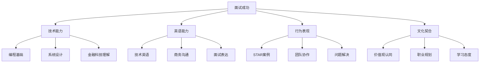

# 汇丰银行 (HSBC) 面试题库

## 🏦 公司简介

汇丰银行是全球最大的银行及金融服务机构之一，在亚太、欧洲、美洲、中东及非洲76个国家和地区拥有约4,000个办事处。作为一家国际性银行，汇丰注重多元化、创新思维和风险管理能力。

## 📍 面试特点

### 面试流程
1. **在线申请** - 简历筛选
2. **在线测评** - 逻辑推理、数值分析
3. **视频面试** - HR初面
4. **Assessment Center** - 群面 + 个面
5. **Manager面试** - 最终面试

### 评估维度
- **商业洞察力** (Commercial Acumen)
- **协作能力** (Collaboration)
- **勇于承担** (Courageous)
- **值得信赖** (Dependable)

## 📚 面试题分类

### 技术面试题
- [Java开发岗位](./java-developer.md)
- [Python开发岗位](./python-developer.md)
- [数据库相关](./database-questions.md)
- [系统设计](./system-design.md)

### 行为面试题
- [STAR格式案例题](./behavioral-star.md)
- [领导力题目](./leadership-questions.md)
- [团队协作](./teamwork-questions.md)
- [压力应对](./stress-management.md)

### 业务案例题
- [风险管理案例](./risk-management.md)
- [客户服务场景](./customer-service.md)
- [数据分析题](./data-analysis.md)
- [合规相关](./compliance-questions.md)

### 英语面试题
- [自我介绍模板](./self-introduction.md)
- [常用金融词汇](./financial-vocabulary.md)
- [英文技术问答](./technical-english.md)

## 💡 面试准备建议

### 重点准备方向
1. **金融基础知识**：了解银行业务基础、风险管理概念
2. **英语能力**：准备英文自我介绍和技术表达
3. **STAR案例**：准备至少5个不同类型的STAR格式案例
4. **企业文化**：了解汇丰的价值观和文化特点
5. **行业动态**：关注金融科技发展和监管变化

### 常见考察重点
- **风险意识**：如何识别和管控技术风险
- **合规思维**：对金融监管的理解和遵循
- **创新能力**：在严谨环境下的创新思维
- **全球视野**：跨文化合作和沟通能力

## 🎯 面试技巧

### 技术面试技巧
- 强调代码的安全性和可维护性
- 展示对金融业务场景的理解
- 体现对数据隐私保护的重视
- 说明系统的高可用性设计

### 行为面试技巧
- 使用STAR模型回答问题
- 强调团队合作和客户导向
- 展现学习能力和适应性
- 体现诚信和责任感

## 📊 面试成功要素

## 🔗 相关资源

- [汇丰官网招聘页面](https://www.hsbc.com/careers)
- [金融科技趋势](../../../docs/fintech-trends.md)
- [英语面试指南](../../../docs/english-interview.md)

---
[← 返回公司目录](../README.md) | [← 返回主目录](../../../README.md) 