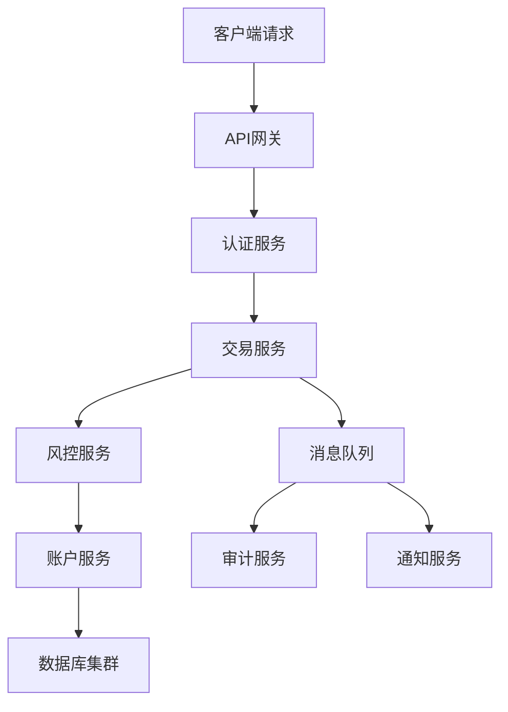

# 汇丰银行 Java 开发岗位面试题

## 难度级别
- 初级 / 中级 / 高级

## 标签
- Java, Spring, 微服务, 金融科技, 并发编程, 数据库

## 基础技术题

### 1. Java 基础概念
**题目**：解释 Java 中的 immutable 对象的重要性，特别是在金融系统中的应用。

**考察点**：
- 不可变对象的概念和实现
- 线程安全性
- 金融数据的安全性考虑

**参考答案要点**：
- 不可变对象天然线程安全
- 防止意外修改关键金融数据
- 便于缓存和共享
- 示例：String, BigDecimal, LocalDateTime

### 2. 并发编程
**题目**：设计一个线程安全的银行账户类，支持存款、取款和查询余额操作。

**要求**：
- 使用适当的同步机制
- 考虑性能和安全性
- 处理并发访问场景

**关键考虑点**：
```java
public class BankAccount {
    private final ReadWriteLock lock = new ReentrantReadWriteLock();
    private volatile BigDecimal balance;
    
    public void deposit(BigDecimal amount) {
        lock.writeLock().lock();
        try {
            // 验证金额有效性
            if (amount.compareTo(BigDecimal.ZERO) <= 0) {
                throw new IllegalArgumentException("存款金额必须大于0");
            }
            balance = balance.add(amount);
        } finally {
            lock.writeLock().unlock();
        }
    }
    
    public boolean withdraw(BigDecimal amount) {
        lock.writeLock().lock();
        try {
            if (amount.compareTo(BigDecimal.ZERO) <= 0) {
                throw new IllegalArgumentException("取款金额必须大于0");
            }
            if (balance.compareTo(amount) >= 0) {
                balance = balance.subtract(amount);
                return true;
            }
            return false;
        } finally {
            lock.writeLock().unlock();
        }
    }
    
    public BigDecimal getBalance() {
        lock.readLock().lock();
        try {
            return balance;
        } finally {
            lock.readLock().unlock();
        }
    }
}
```

### 3. Spring Framework
**题目**：在汇丰的微服务架构中，如何使用 Spring Boot 实现服务间的安全通信？

**考察点**：
- Spring Security 配置
- OAuth2 认证
- JWT token 处理
- 服务间调用安全

**参考实现**：
```java
@Configuration
@EnableWebSecurity
public class SecurityConfig extends WebSecurityConfigurerAdapter {
    
    @Override
    protected void configure(HttpSecurity http) throws Exception {
        http
            .oauth2ResourceServer()
            .jwt()
            .jwtDecoder(jwtDecoder())
            .and()
            .authorizeRequests()
            .antMatchers("/actuator/health").permitAll()
            .antMatchers("/api/v1/accounts/**").hasRole("ACCOUNT_READ")
            .anyRequest().authenticated();
    }
    
    @Bean
    public JwtDecoder jwtDecoder() {
        return NimbusJwtDecoder.withJwkSetUri("https://auth.hsbc.com/.well-known/jwks.json").build();
    }
}
```

## 系统设计题

### 4. 交易系统设计
**题目**：设计一个高并发的金融交易处理系统，需要处理每秒万级别的交易请求。

**要求**：
- 确保数据一致性
- 支持事务回滚
- 实现审计追踪
- 考虑系统可用性

**设计要点**：


**技术选型考虑**：
- 数据库：读写分离，主从复制
- 缓存：Redis 集群
- 消息队列：Kafka 或 RabbitMQ
- 负载均衡：Nginx + Spring Cloud Gateway
- 监控：Prometheus + Grafana

### 5. 数据库设计
**题目**：设计一个客户账户管理系统的数据库表结构。

**要求**：
- 支持多种账户类型
- 记录所有交易历史
- 支持多币种
- 考虑数据归档策略

**表结构设计**：
```sql
-- 客户信息表
CREATE TABLE customers (
    customer_id BIGINT PRIMARY KEY,
    customer_number VARCHAR(20) UNIQUE NOT NULL,
    first_name VARCHAR(100) NOT NULL,
    last_name VARCHAR(100) NOT NULL,
    email VARCHAR(255) UNIQUE,
    phone VARCHAR(20),
    created_at TIMESTAMP DEFAULT CURRENT_TIMESTAMP,
    updated_at TIMESTAMP DEFAULT CURRENT_TIMESTAMP ON UPDATE CURRENT_TIMESTAMP,
    status ENUM('ACTIVE', 'INACTIVE', 'SUSPENDED') DEFAULT 'ACTIVE'
);

-- 账户表
CREATE TABLE accounts (
    account_id BIGINT PRIMARY KEY,
    account_number VARCHAR(20) UNIQUE NOT NULL,
    customer_id BIGINT NOT NULL,
    account_type ENUM('SAVINGS', 'CURRENT', 'CREDIT', 'INVESTMENT'),
    currency_code VARCHAR(3) NOT NULL,
    balance DECIMAL(15,2) DEFAULT 0.00,
    status ENUM('ACTIVE', 'INACTIVE', 'FROZEN') DEFAULT 'ACTIVE',
    created_at TIMESTAMP DEFAULT CURRENT_TIMESTAMP,
    updated_at TIMESTAMP DEFAULT CURRENT_TIMESTAMP ON UPDATE CURRENT_TIMESTAMP,
    FOREIGN KEY (customer_id) REFERENCES customers(customer_id),
    INDEX idx_customer_id (customer_id),
    INDEX idx_account_number (account_number)
);

-- 交易记录表
CREATE TABLE transactions (
    transaction_id BIGINT PRIMARY KEY,
    account_id BIGINT NOT NULL,
    transaction_type ENUM('DEPOSIT', 'WITHDRAWAL', 'TRANSFER', 'PAYMENT'),
    amount DECIMAL(15,2) NOT NULL,
    currency_code VARCHAR(3) NOT NULL,
    balance_after DECIMAL(15,2) NOT NULL,
    description TEXT,
    reference_number VARCHAR(50),
    transaction_date TIMESTAMP DEFAULT CURRENT_TIMESTAMP,
    status ENUM('PENDING', 'COMPLETED', 'FAILED', 'CANCELLED') DEFAULT 'PENDING',
    FOREIGN KEY (account_id) REFERENCES accounts(account_id),
    INDEX idx_account_id (account_id),
    INDEX idx_transaction_date (transaction_date),
    INDEX idx_reference_number (reference_number)
);
```

## 实际场景题

### 6. 异常处理和监控
**题目**：在生产环境中，如何处理数据库连接异常并实现有效的监控报警？

**考察点**：
- 异常处理策略
- 连接池管理
- 监控指标设计
- 报警机制

**解决方案**：
```java
@Component
public class DatabaseHealthIndicator implements HealthIndicator {
    
    @Autowired
    private DataSource dataSource;
    
    @Override
    public Health health() {
        try (Connection connection = dataSource.getConnection()) {
            if (connection.isValid(1)) {
                return Health.up()
                    .withDetail("database", "Available")
                    .withDetail("connection-pool", getConnectionPoolInfo())
                    .build();
            }
        } catch (SQLException e) {
            return Health.down()
                .withDetail("database", "Unavailable")
                .withException(e)
                .build();
        }
        return Health.down().withDetail("database", "Connection validation failed").build();
    }
    
    private Map<String, Object> getConnectionPoolInfo() {
        // 返回连接池状态信息
        Map<String, Object> info = new HashMap<>();
        info.put("active-connections", getActiveConnections());
        info.put("max-connections", getMaxConnections());
        return info;
    }
}
```

## 面试技巧

### 回答要点
1. **安全性优先**：始终考虑数据安全和系统安全
2. **性能考虑**：讨论大数据量和高并发场景
3. **合规性**：提及金融监管要求和审计需求
4. **可维护性**：强调代码质量和可测试性
5. **国际化**：考虑多语言和多时区支持

### 常见追问
- "如何处理分布式事务？"
- "怎样确保数据的最终一致性？"
- "如何进行性能调优？"
- "怎样实现零停机部署？"

## 补充准备

### 金融领域知识
- 了解银行核心业务流程
- 熟悉支付系统原理
- 掌握风险控制基本概念
- 理解合规和审计要求

### 技术栈重点
- Spring Boot / Spring Cloud
- 微服务架构模式
- 分布式系统设计
- 数据库设计和优化
- 消息队列应用
- 监控和日志系统

---
[← 返回汇丰面试题目录](./README.md) 