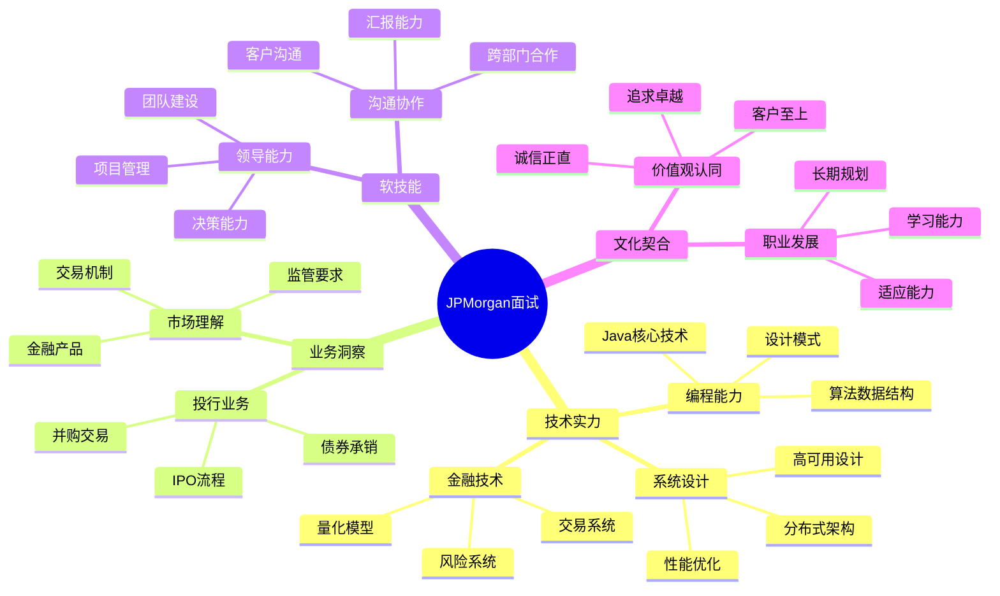

# 摩根大通 (JPMorgan Chase) 面试题库

## 🏦 公司简介

摩根大通是美国最大的银行之一，也是全球领先的金融服务公司。在投资银行、商业银行、资产管理和私人银行等领域都居于行业领先地位。作为华尔街顶级投行，摩根大通在技术创新、量化交易、风险管理等方面有着极高的技术要求。

## 📍 面试特点

### 面试流程
1. **在线申请** - 简历筛选和背景调查
2. **在线编程测试** - HackerRank技术评估
3. **电话技术面试** - 算法和系统设计
4. **现场/视频面试** - 多轮技术+行为面试
5. **Super Day** - 最终面试日

### 核心价值观
- **卓越追求** (Exceptional)
- **诚信为本** (Integrity) 
- **领导力** (Leadership)
- **团队合作** (Teamwork)

## 📚 面试题分类

### 技术面试题
- [Java开发岗位](./java-developer.md) ✅
- [算法交易系统](./algorithmic-trading.md)
- [风险管理系统](./risk-management.md)
- [数据库优化](./database-optimization.md)
- [系统架构设计](./system-architecture.md)

### 量化开发相关
- [量化策略实现](./quantitative-strategies.md)
- [高频交易系统](./high-frequency-trading.md)
- [衍生品定价](./derivatives-pricing.md)
- [机器学习应用](./machine-learning.md)

### 行为面试题
- [行为面试题库](./behavioral-interview.md) ✅
- [领导力案例](./leadership-examples.md)
- [团队协作](./teamwork-scenarios.md)
- [压力管理](./stress-handling.md)
- [创新思维](./innovation-mindset.md)

### 业务知识题
- [投资银行业务](./investment-banking.md)
- [资产管理](./asset-management.md)
- [风险控制](./risk-control.md)
- [监管合规](./regulatory-compliance.md)

## 💡 面试准备重点

### 技术能力要求
1. **编程基础**：Java/C++ 深度掌握
2. **算法能力**：数据结构、算法设计、复杂度分析
3. **系统设计**：大规模分布式系统架构
4. **数据库**：SQL优化、NoSQL、时序数据库
5. **金融知识**：投资理论、衍生品、风险管理

### 业务理解要求
- **投行业务**：IPO、并购、债券发行等核心业务
- **交易系统**：现货、期货、期权等交易机制
- **风险管理**：市场风险、信用风险、操作风险
- **监管环境**：巴塞尔协议、多德-弗兰克法案等

## 🎯 面试评估维度

## 🌟 面试成功策略

### 技术面试准备
1. **算法刷题**：LeetCode Hard级别，重点关注图论、动态规划
2. **系统设计**：准备大规模交易系统、实时风控系统设计
3. **Java深度**：JVM调优、并发编程、性能优化
4. **项目经验**：准备金融相关的项目案例

### 行为面试准备
1. **STAR方法**：准备结构化的行为案例
2. **领导力体现**：展示项目管理和团队领导经验
3. **业务理解**：了解摩根大通的核心业务和市场地位
4. **职业规划**：展示对投行职业发展的理解

### 特色面试场景

#### 技术深度面试
**时长**：90-120分钟
**内容**：
- 白板编程（45分钟）
- 系统设计（45分钟）
- 技术深度问答（30分钟）

#### Super Day面试
**时长**：全天
**内容**：
- 多位面试官轮流面试
- 技术、行为、业务全方位考察
- 团队fit和文化契合度评估

## 📊 技术栈重点

### 核心技术栈
- **后端**：Java 11+, Spring Boot, Microservices
- **数据库**：Oracle, PostgreSQL, MongoDB, TimesTen
- **消息队列**：Apache Kafka, IBM MQ, Solace
- **缓存**：Redis, Hazelcast, Coherence
- **监控**：Splunk, AppDynamics, Prometheus

### 交易系统技术
- **实时处理**：Apache Storm, Flink, Akka
- **低延迟**：Chronicle Map, Disruptor, Custom TCP
- **风控引擎**：Rule Engine, Complex Event Processing
- **数据分析**：Spark, Hadoop, TensorFlow

## 🔍 面试难点和重点

### 算法题特点
- **难度高**：多为Hard级别，考察思维深度
- **金融背景**：结合交易、定价等业务场景
- **性能要求**：时间复杂度和空间复杂度要求严格
- **代码质量**：注重代码的可读性和健壮性

### 系统设计重点
- **交易系统**：订单管理、撮合引擎、清算系统
- **风控系统**：实时监控、异常检测、风险计算
- **数据平台**：实时数据处理、历史数据存储、分析平台
- **监管报送**：合规检查、报告生成、数据质量

### 业务知识考察
- **产品理解**：股票、债券、衍生品等金融产品
- **市场机制**：交易所运作、做市商制度、清算机制
- **风险管理**：VaR计算、压力测试、风险限额
- **监管要求**：资本充足率、流动性管理、交易报告

## 💼 职业发展路径

### 技术专家路线
- **Associate** → **VP** → **Executive Director** → **Managing Director**
- 专注于技术架构和创新

### 业务技术路线
- **Analyst** → **Associate** → **VP** → **Director**
- 技术与业务结合的发展路径

### 量化研究路线
- **Quant Analyst** → **Senior Quant** → **Quant VP** → **Head of Quant**
- 专注于量化模型和策略开发

## 🎓 学习建议

### 技术提升
1. **深入Java**：并发编程、JVM原理、性能调优
2. **分布式系统**：CAP理论、一致性算法、微服务架构
3. **金融工程**：期权定价、风险管理、量化策略
4. **大数据技术**：实时计算、流处理、机器学习

### 业务知识
1. **金融市场**：了解各类金融产品和交易机制
2. **投行业务**：IPO、并购、债券承销等核心业务
3. **监管环境**：熟悉主要金融监管法规
4. **行业动态**：关注金融科技发展趋势

## 🔗 学习资源

### 官方资源
- [摩根大通技术博客](https://www.jpmorgan.com/technology)
- [Code for Good项目](https://careers.jpmorgan.com/careers/US/en/students/programs/code-for-good)
- [技术职位介绍](https://careers.jpmorgan.com/careers/US/en/students/programs/technology-analyst)

### 技术学习
- [Java并发编程实战](https://www.oracle.com/java/technologies/javase/concurrency.html)
- [系统设计面试指南](https://github.com/donnemartin/system-design-primer)
- [金融工程入门](https://www.quantstart.com/)

### 业务学习
- [投资银行学](https://www.investopedia.com/investment-banking-4689166)
- [衍生品定价理论](https://www.math.nyu.edu/faculty/goodman/teaching/DerivSec/)
- [风险管理基础](https://www.garp.org/#!/home)

---
[← 返回公司目录](../README.md) | [← 返回主目录](../../../README.md) 