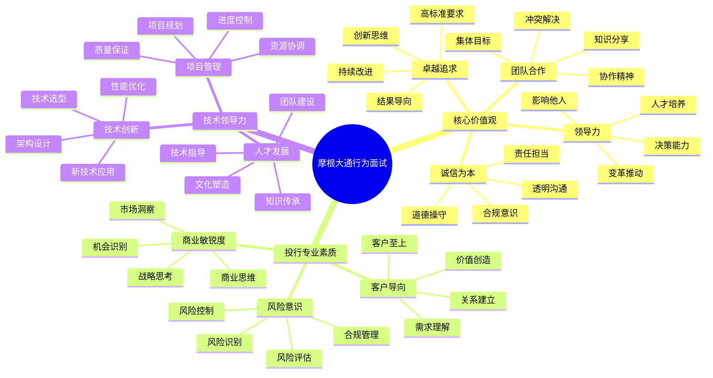

# 摩根大通行为面试题

## 难度级别
- 中级 / 高级 / 专家级

## 标签
- 行为面试, STAR方法, 领导力, 投行文化, 客户服务, 风险管理, 团队协作

## 🎯 摩根大通核心价值观

### 企业使命
摩根大通致力于成为世界上最受尊敬的金融服务公司，为客户、股东、员工和社区创造价值。

### 四大核心价值观
1. **卓越追求** (Exceptional) - 追求卓越，超越期望
2. **诚信为本** (Integrity) - 诚实正直，值得信赖
3. **领导力** (Leadership) - 承担责任，引领变革
4. **团队合作** (Teamwork) - 协作共赢，集体成功

## 📊 行为面试评估框架

## 🌟 经典行为面试题目

### 1. 卓越追求 (Exceptional) 相关题目

#### 题目1：超越期望的项目交付
**问题**："描述一次你不仅完成了任务，还超越了客户或管理层期望的经历。"

**STAR案例示例**：

**Situation (情境)**：
我们为一家大型投资银行开发核心交易系统，客户原本要求系统支持每秒1万笔交易，延迟不超过100ms。项目预算300万美元，工期6个月。这是公司历史上最大的单笔技术合同。

**Task (任务)**：
作为技术负责人，我不仅要确保系统满足基本要求，还要思考如何为客户创造额外价值，巩固我们在金融科技领域的领先地位。

**Action (行动)**：
1. **深度需求挖掘**：
   - 与客户交易员、风控人员、IT团队进行深度访谈
   - 发现客户未来3年有扩展到亚洲市场的计划
   - 了解到他们对实时风险监控有强烈需求但预算有限
2. **超越性方案设计**：
   - 设计了支持每秒5万笔交易的可扩展架构
   - 将延迟优化到20ms以内
   - 免费集成了实时风险监控模块
   - 预留了多时区、多币种支持的接口
3. **技术创新应用**：
   - 采用LMAX Disruptor实现超低延迟
   - 使用Chronicle Map进行堆外内存管理
   - 实现了基于机器学习的智能路由算法
4. **项目管理优化**：
   - 建立了每日技术评审机制
   - 实施了持续集成和自动化测试
   - 与客户建立了周度技术交流会
5. **风险预案准备**：
   - 准备了3套备选技术方案
   - 建立了24小时技术支持团队
   - 制定了详细的上线切换计划

**Result (结果)**：
- 系统性能超出要求5倍，延迟比要求低80%
- 项目提前2周交付，节省预算50万美元
- 客户在使用3个月后，交易量增长了200%
- 免费的风险监控模块为客户节省了100万美元的采购成本
- 客户主动续签了3年的技术支持合同，价值800万美元
- 该项目成为公司的标杆案例，帮助我们赢得了5个类似项目
- 我被提升为首席技术架构师，负责公司的技术创新战略

**面试官可能的追问**：
- Q: 为什么要超越客户的基本要求？
- A: 我认为真正的价值创造在于理解客户的长远需求。通过前瞻性的设计，我们不仅解决了当前问题，还为客户的未来发展奠定了基础。

- Q: 如何平衡创新和项目风险？
- A: 我采用了"渐进式创新"策略，核心功能使用成熟技术保证稳定性，创新功能采用模块化设计，可以独立测试和部署。

#### 题目2：技术标准的建立
**问题**："描述一次你建立或改进技术标准，提升整个团队或组织能力的经历。"

**STAR案例示例**：

**Situation (情境)**：
公司的多个开发团队使用不同的技术栈和开发规范，导致代码质量参差不齐，系统集成困难，新员工上手周期长。技术债务累积严重，影响了整体交付效率。

**Task (任务)**：
CTO指派我负责制定公司统一的技术标准和最佳实践，提升整体技术能力和开发效率。

**Action (行动)**：
1. **现状调研**：
   - 对8个开发团队进行技术栈调研
   - 分析了过去2年的代码质量数据
   - 收集了开发人员的痛点和建议
2. **标准制定**：
   - 制定了《Java开发规范》：包含编码规范、架构模式、性能要求
   - 建立了《API设计标准》：统一接口规范和文档标准
   - 创建了《数据库设计规范》：表结构、索引、查询优化标准
   - 制定了《代码审查流程》：多级审查机制和质量门禁
3. **工具链建设**：
   - 集成了SonarQube进行代码质量自动检查
   - 建立了统一的CI/CD流水线模板
   - 开发了代码生成器，自动生成符合规范的代码框架
4. **培训推广**：
   - 组织了为期2周的技术标准培训
   - 建立了技术标准认证考试
   - 设立了技术标准推广大使制度
5. **持续改进**：
   - 建立了季度技术标准评审机制
   - 收集反馈并持续优化标准
   - 定期发布技术标准更新

**Result (结果)**：
- 代码质量指标提升60%，bug密度降低40%
- 新员工上手时间从2个月缩短到3周
- 系统集成效率提升50%，接口对接时间减少70%
- 技术债务减少了30%，维护成本大幅降低
- 8个团队的技术栈实现了标准化统一
- 该标准被集团其他子公司采用，我被任命为集团技术标准委员会主席
- 公司的技术成熟度评级从3级提升到4级

### 2. 诚信为本 (Integrity) 相关题目

#### 题目3：道德困境的处理
**问题**："描述一次你面临道德或合规冲突，如何坚持原则的经历。"

**STAR案例示例**：

**Situation (情境)**：
在一个紧急项目中，业务部门要求我们绕过正常的安全审查流程，直接上线一个涉及客户资金转账的功能。他们声称如果不能在周末前上线，公司将损失一个价值1000万美元的大客户。

**Task (任务)**：
我需要在业务压力和合规要求之间做出选择，既要考虑公司的商业利益，也要确保系统安全和合规要求。

**Action (行动)**：
1. **风险评估**：
   - 详细分析了绕过安全审查的潜在风险
   - 发现该功能涉及大额资金转账，存在洗钱和欺诈风险
   - 评估了可能面临的监管处罚和声誉损失
2. **替代方案提出**：
   - 提出了"快速安全审查"方案：48小时内完成核心安全检查
   - 建议实施"分阶段上线"：先上线小额转账功能，大额功能待审查完成
   - 设计了"临时风控措施"：加强实时监控和人工审核
3. **沟通协调**：
   - 与业务部门详细解释了安全风险和合规要求
   - 与安全团队协商加急审查的可行性
   - 向管理层汇报了风险和建议方案
4. **坚持原则**：
   - 明确表示不能完全绕过安全审查
   - 提供了详细的风险分析报告
   - 建议与客户沟通延期或分阶段实施
5. **积极解决**：
   - 组织了48小时的安全审查马拉松
   - 协调安全、合规、开发团队全力配合
   - 建立了临时的风险监控机制

**Result (结果)**：
- 在48小时内完成了核心安全审查，发现并修复了3个安全漏洞
- 功能按时上线，客户合同成功签署
- 避免了潜在的合规风险和监管处罚
- 建立的快速安全审查流程被公司采用为标准流程
- 我获得了公司年度合规奖，被任命为技术合规委员会成员
- 客户对我们的专业性和责任感印象深刻，后续又签署了2个项目

#### 题目4：透明沟通的重要性
**问题**："描述一次你需要向管理层报告坏消息或项目问题的经历。"

**STAR案例示例**：

**Situation (情境)**：
我负责的一个关键项目在距离上线还有1个月时，发现了一个严重的架构缺陷，可能导致系统在高负载下崩溃。修复这个问题需要重构核心模块，至少延期2个月。这个项目已经向董事会承诺按时交付。

**Task (任务)**：
我需要向CTO和项目委员会如实报告问题，提出解决方案，并承担相应责任。

**Action (行动)**：
1. **问题分析**：
   - 组织技术团队深入分析问题根源
   - 评估了不同修复方案的时间和风险
   - 准备了详细的技术分析报告
2. **方案制定**：
   - 方案A：完全重构，确保长期稳定，需要2个月
   - 方案B：临时修复，快速上线，但存在技术债务
   - 方案C：分阶段重构，核心功能先上线，逐步优化
3. **透明汇报**：
   - 主动向CTO汇报问题，不等待定期会议
   - 准备了详细的问题分析和解决方案
   - 承认了在架构设计阶段的疏忽
   - 提出了防止类似问题的改进措施
4. **责任承担**：
   - 主动承担项目延期的责任
   - 提出减薪和绩效处罚的建议
   - 承诺个人投入更多时间确保项目成功
5. **积极解决**：
   - 与业务方协商分阶段交付的可能性
   - 组织团队加班加点实施修复方案
   - 建立每日进度汇报机制

**Result (结果)**：
- 管理层认可了我的诚实和责任感
- 采用了方案C，核心功能按时上线，完整功能延期1个月交付
- 客户理解并接受了分阶段交付方案
- 建立的架构评审机制避免了类似问题再次发生
- 我的诚信表现得到了管理层的高度认可，被提升为技术总监
- 项目最终成功交付，客户满意度达到95%

### 3. 领导力 (Leadership) 相关题目

#### 题目5：变革推动与团队转型
**问题**："描述一次你推动重大技术变革或团队转型的经历。"

**STAR案例示例**：

**Situation (情境)**：
公司决定从传统的单体架构全面转向微服务架构，涉及20个核心系统和80名开发人员。团队对新技术缺乏经验，对变革存在抵触情绪，担心工作量增加和技术风险。

**Task (任务)**：
作为技术负责人，我需要制定转型策略，说服团队接受变革，并确保转型过程中业务不受影响。

**Action (行动)**：
1. **愿景传达**：
   - 组织了全员技术大会，阐述微服务架构的价值和必要性
   - 分享了行业最佳实践和成功案例
   - 制定了清晰的转型路线图和里程碑
2. **团队赋能**：
   - 组织了为期4周的微服务技术培训
   - 建立了技术专家小组，负责技术指导和问题解决
   - 设立了创新实验室，让团队可以安全地尝试新技术
3. **分阶段实施**：
   - 选择了3个非核心系统作为试点项目
   - 建立了微服务开发和部署的标准流程
   - 逐步扩展到核心业务系统
4. **文化建设**：
   - 建立了"失败庆祝"文化，鼓励试错和学习
   - 设立了技术创新奖，激励团队拥抱新技术
   - 组织了跨团队的技术分享会
5. **风险控制**：
   - 建立了完善的回滚机制
   - 实施了灰度发布和A/B测试
   - 设置了详细的监控和告警系统

**Result (结果)**：
- 18个月内成功完成了所有系统的微服务化改造
- 系统可用性从99.5%提升到99.9%
- 开发效率提升40%，新功能上线时间缩短60%
- 团队技术能力显著提升，80%的开发人员掌握了微服务技术
- 公司获得了行业数字化转型最佳实践奖
- 我被提升为首席技术官，负责公司的技术战略
- 建立的转型方法论被其他公司采用

#### 题目6：危机领导与团队激励
**问题**："描述一次你在危机情况下领导团队，激励士气的经历。"

**STAR案例示例**：

**Situation (情境)**：
公司核心交易系统在黑色星期五当天发生严重故障，导致所有交易暂停。客户损失巨大，监管部门介入调查，媒体负面报道不断。团队士气低落，部分核心成员提出离职。

**Task (任务)**：
作为技术负责人，我需要在72小时内恢复系统，同时稳定团队情绪，重建客户和监管部门的信心。

**Action (行动)**：
1. **危机应对**：
   - 立即启动应急响应机制，成立危机处理小组
   - 与CEO、法务、公关团队建立联合指挥中心
   - 制定了详细的问题解决和沟通计划
2. **团队稳定**：
   - 召开紧急全员会议，坦诚面对问题和挑战
   - 承担全部责任，保护团队成员不受指责
   - 承诺与团队共同承担后果，绝不推卸责任
3. **技术攻坚**：
   - 组织了48小时的技术马拉松，全员参与问题解决
   - 引入外部专家协助诊断和修复
   - 建立了每2小时的进度汇报机制
4. **激励措施**：
   - 为加班团队提供全方位后勤支持
   - 承诺事后给予团队特殊奖励和假期
   - 邀请CEO亲自到现场慰问和鼓励团队
5. **透明沟通**：
   - 每4小时向客户和监管部门汇报进展
   - 主动承担媒体采访，解释问题和解决方案
   - 建立了客户沟通热线，及时回应关切

**Result (结果)**：
- 在48小时内成功恢复系统，比预期提前24小时
- 团队凝聚力空前增强，没有一个核心成员离职
- 客户对我们的危机处理能力给予高度认可
- 监管部门认可了我们的应对措施和改进计划
- 建立的应急响应机制成为行业标杆
- 我获得了公司年度杰出领导奖
- 团队被评为年度最佳团队，每人获得特殊奖金

### 4. 团队合作 (Teamwork) 相关题目

#### 题目7：跨部门协作项目
**问题**："描述一次你需要与多个部门密切合作完成复杂项目的经历。"

**STAR案例示例**：

**Situation (情境)**：
公司要推出新的数字化投资平台，涉及技术、产品、风控、合规、营销、客服等8个部门。各部门有不同的优先级和工作节奏，协调难度很大。项目工期紧张，只有4个月时间。

**Task (任务)**：
作为项目技术负责人，我需要协调各部门的工作，确保技术实现与业务需求完美匹配，按时交付高质量的产品。

**Action (行动)**：
1. **协作机制建立**：
   - 建立了跨部门项目委员会，每周召开协调会议
   - 设立了部门联络人制度，确保信息及时传递
   - 创建了统一的项目管理平台，实时跟踪进度
2. **需求协调**：
   - 组织了为期3天的需求梳理工作坊
   - 建立了需求优先级评估机制
   - 制定了需求变更控制流程
3. **技术适配**：
   - 与产品团队深度合作，确保技术方案支持业务创新
   - 与风控团队协作，集成实时风险监控功能
   - 与合规团队合作，确保系统满足监管要求
4. **沟通优化**：
   - 建立了每日站会制度，快速同步进展和问题
   - 创建了可视化的项目仪表板，让所有人了解整体进度
   - 组织了月度跨部门团建活动，增进相互理解
5. **冲突解决**：
   - 建立了冲突升级机制，及时解决部门间分歧
   - 推行"共同目标"理念，强调项目成功对所有人的重要性
   - 设立了跨部门协作奖，激励团队合作

**Result (结果)**：
- 项目按时交付，功能完整度达到100%
- 8个部门的协作效率提升50%，沟通成本降低30%
- 产品上线后用户满意度达到92%，超过预期
- 建立的跨部门协作模式被公司采用为标准流程
- 我被任命为公司跨部门协作最佳实践推广大使
- 该项目获得了公司年度最佳协作项目奖
- 参与的8个部门都获得了团队协作奖

## 🎯 摩根大通特色行为面试题

### 投行业务相关

#### 题目8：客户关系管理
**问题**："描述一次你为客户创造超预期价值，建立长期合作关系的经历。"

**评估要点**：
- 客户导向思维
- 价值创造能力
- 关系建立技巧
- 长期思维

#### 题目9：高压环境下的表现
**问题**："投行工作节奏快、压力大，请描述你在高压环境下如何保持高质量工作的经历。"

**评估要点**：
- 压力管理能力
- 质量控制意识
- 时间管理技巧
- 抗压韧性

### 风险管理相关

#### 题目10：风险识别与控制
**问题**："描述一次你识别并成功控制了重大技术或业务风险的经历。"

**评估要点**：
- 风险敏感度
- 分析判断能力
- 预防控制措施
- 危机处理能力

### 创新与变革相关

#### 题目11：技术创新推动业务发展
**问题**："摩根大通重视技术创新，请分享你如何通过技术创新推动业务发展的经历。"

**评估要点**：
- 创新思维
- 技术商业化能力
- 业务理解深度
- 影响力和推动力

## 💡 面试准备建议

### 1. 深入了解摩根大通
- **业务模式**：投资银行、商业银行、资产管理、私人银行
- **技术战略**：数字化转型、AI应用、区块链探索
- **企业文化**：客户至上、卓越追求、诚信正直、团队合作
- **行业地位**：全球领先的金融服务公司

### 2. STAR方法精进技巧
- **量化结果**：用具体数字证明你的影响力
- **突出价值观**：将经历与摩根大通价值观紧密结合
- **展现领导力**：即使不是管理岗位，也要展现影响力
- **体现专业性**：展示你对金融行业的理解和专业能力

### 3. 投行特色准备
- **客户案例**：准备为客户创造价值的具体案例
- **压力管理**：准备在高压环境下成功完成任务的经历
- **团队协作**：强调在复杂项目中的协作能力
- **创新思维**：展示你的创新能力和前瞻性思维

### 4. 技术与业务结合
- **业务理解**：展示你对金融业务的深度理解
- **技术应用**：说明技术如何解决实际业务问题
- **价值创造**：强调技术方案的商业价值
- **风险意识**：体现对技术风险和业务风险的敏感度

## 🔍 面试评分标准

### 卓越表现 (5分)
- 故事具有重大商业影响力
- 完美体现摩根大通价值观
- 展现出色的领导力和影响力
- 具有前瞻性思维和创新能力
- 体现深度的业务理解

### 优秀表现 (4分)
- 故事结构清晰，逻辑严密
- 很好地体现了核心价值观
- 展现了一定的领导力
- 结果具有明确的商业价值
- 体现了良好的团队合作精神

### 良好表现 (3分)
- 故事基本完整，有明确结果
- 与价值观基本契合
- 展现了问题解决能力
- 有一定的影响力和价值创造

### 需要改进 (1-2分)
- 故事不够具体或缺乏逻辑
- 与价值观契合度低
- 缺乏主动性和影响力
- 结果不明确或价值有限

## 🌟 成功案例特征

### 技术领导力类
- 推动重大技术变革
- 建立技术标准和最佳实践
- 培养技术团队和人才
- 创新技术应用解决业务问题

### 客户价值创造类
- 深度理解客户需求
- 超越期望创造价值
- 建立长期合作关系
- 推动业务增长

### 团队协作类
- 跨部门协作成功
- 冲突解决和团队建设
- 知识分享和人才培养
- 文化建设和价值传承

### 危机处理类
- 在压力下保持冷静
- 快速决策和执行
- 团队激励和士气维护
- 从危机中学习和改进

---
[← 返回摩根大通面试题目录](./README.md) 