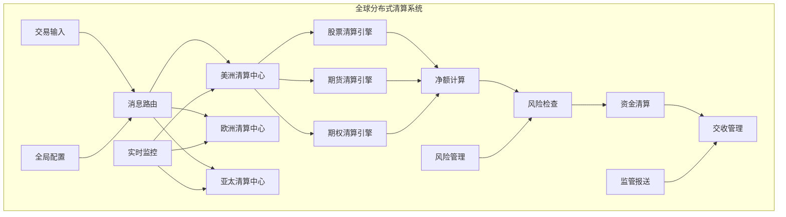

# 摩根大通 Java 开发岗位面试题

## 难度级别
- 中级 / 高级 / 专家级

## 标签
- Java, 并发编程, 系统设计, 算法, 金融系统, 高性能, 低延迟

## 算法与数据结构题

### 1. 高频题：订单簿实现
**题目**：实现一个高性能的股票交易订单簿(Order Book)，支持添加订单、取消订单、匹配交易。

**难度级别**：高级

**要求**：
- 支持限价单(LIMIT)和市价单(MARKET)
- 按价格-时间优先级排序
- 时间复杂度：添加O(log n)，匹配O(k log n)，k为匹配订单数
- 内存优化，支持百万级订单

**解决方案**：
```java
import java.util.*;
import java.util.concurrent.ConcurrentHashMap;
import java.util.concurrent.atomic.AtomicLong;

/**
 * 高性能订单簿实现
 * 摩根大通真实面试题
 */
public class OrderBook {
    
    // 订单类型枚举
    public enum OrderType { LIMIT, MARKET }
    public enum OrderSide { BUY, SELL }
    public enum OrderStatus { PENDING, FILLED, CANCELLED, PARTIALLY_FILLED }
    
    // 订单实体
    public static class Order {
        final long orderId;
        final String symbol;
        final OrderSide side;
        final OrderType type;
        final double price;
        long quantity;
        long filledQuantity;
        final long timestamp;
        OrderStatus status;
        
        public Order(long orderId, String symbol, OrderSide side, OrderType type, 
                    double price, long quantity, long timestamp) {
            this.orderId = orderId;
            this.symbol = symbol;
            this.side = side;
            this.type = type;
            this.price = price;
            this.quantity = quantity;
            this.filledQuantity = 0;
            this.timestamp = timestamp;
            this.status = OrderStatus.PENDING;
        }
        
        public long getRemainingQuantity() {
            return quantity - filledQuantity;
        }
        
        public void fill(long fillQuantity) {
            filledQuantity += fillQuantity;
            if (filledQuantity >= quantity) {
                status = OrderStatus.FILLED;
            } else if (filledQuantity > 0) {
                status = OrderStatus.PARTIALLY_FILLED;
            }
        }
    }
    
    // 交易记录
    public static class Trade {
        final long tradeId;
        final long buyOrderId;
        final long sellOrderId;
        final double price;
        final long quantity;
        final long timestamp;
        
        public Trade(long tradeId, long buyOrderId, long sellOrderId, 
                    double price, long quantity, long timestamp) {
            this.tradeId = tradeId;
            this.buyOrderId = buyOrderId;
            this.sellOrderId = sellOrderId;
            this.price = price;
            this.quantity = quantity;
            this.timestamp = timestamp;
        }
    }
    
    // 价格级别 - 存储相同价格的订单
    private static class PriceLevel {
        final double price;
        final LinkedList<Order> orders;
        long totalQuantity;
        
        PriceLevel(double price) {
            this.price = price;
            this.orders = new LinkedList<>();
            this.totalQuantity = 0;
        }
        
        void addOrder(Order order) {
            orders.addLast(order);
            totalQuantity += order.getRemainingQuantity();
        }
        
        void removeOrder(Order order) {
            orders.remove(order);
            totalQuantity -= order.getRemainingQuantity();
        }
        
        boolean isEmpty() {
            return orders.isEmpty();
        }
    }
    
    private final String symbol;
    private final AtomicLong tradeIdGenerator = new AtomicLong(1);
    
    // 买单按价格降序排列（最高价优先）
    private final TreeMap<Double, PriceLevel> buyLevels = 
        new TreeMap<>(Collections.reverseOrder());
    
    // 卖单按价格升序排列（最低价优先）
    private final TreeMap<Double, PriceLevel> sellLevels = new TreeMap<>();
    
    // 订单ID到订单的映射，用于快速查找
    private final ConcurrentHashMap<Long, Order> orderMap = new ConcurrentHashMap<>();
    
    // 交易记录
    private final List<Trade> trades = new ArrayList<>();
    
    public OrderBook(String symbol) {
        this.symbol = symbol;
    }
    
    /**
     * 添加订单到订单簿
     */
    public synchronized List<Trade> addOrder(Order order) {
        orderMap.put(order.orderId, order);
        
        if (order.type == OrderType.MARKET) {
            return processMarketOrder(order);
        } else {
            return processLimitOrder(order);
        }
    }
    
    /**
     * 处理限价单
     */
    private List<Trade> processLimitOrder(Order order) {
        List<Trade> newTrades = new ArrayList<>();
        
        if (order.side == OrderSide.BUY) {
            // 买单：与卖单匹配
            while (order.getRemainingQuantity() > 0 && !sellLevels.isEmpty()) {
                Map.Entry<Double, PriceLevel> entry = sellLevels.firstEntry();
                double bestSellPrice = entry.getKey();
                
                // 价格不匹配，停止匹配
                if (order.price < bestSellPrice) {
                    break;
                }
                
                PriceLevel sellLevel = entry.getValue();
                newTrades.addAll(matchOrders(order, sellLevel));
                
                if (sellLevel.isEmpty()) {
                    sellLevels.remove(bestSellPrice);
                }
            }
            
            // 如果订单未完全成交，加入买单队列
            if (order.getRemainingQuantity() > 0) {
                addToBuyLevels(order);
            }
            
        } else {
            // 卖单：与买单匹配
            while (order.getRemainingQuantity() > 0 && !buyLevels.isEmpty()) {
                Map.Entry<Double, PriceLevel> entry = buyLevels.firstEntry();
                double bestBuyPrice = entry.getKey();
                
                // 价格不匹配，停止匹配
                if (order.price > bestBuyPrice) {
                    break;
                }
                
                PriceLevel buyLevel = entry.getValue();
                newTrades.addAll(matchOrders(order, buyLevel));
                
                if (buyLevel.isEmpty()) {
                    buyLevels.remove(bestBuyPrice);
                }
            }
            
            // 如果订单未完全成交，加入卖单队列
            if (order.getRemainingQuantity() > 0) {
                addToSellLevels(order);
            }
        }
        
        return newTrades;
    }
    
    /**
     * 处理市价单
     */
    private List<Trade> processMarketOrder(Order order) {
        List<Trade> newTrades = new ArrayList<>();
        
        if (order.side == OrderSide.BUY) {
            // 市价买单：与最优卖单匹配
            while (order.getRemainingQuantity() > 0 && !sellLevels.isEmpty()) {
                Map.Entry<Double, PriceLevel> entry = sellLevels.firstEntry();
                PriceLevel sellLevel = entry.getValue();
                
                newTrades.addAll(matchOrders(order, sellLevel));
                
                if (sellLevel.isEmpty()) {
                    sellLevels.remove(entry.getKey());
                }
            }
        } else {
            // 市价卖单：与最优买单匹配
            while (order.getRemainingQuantity() > 0 && !buyLevels.isEmpty()) {
                Map.Entry<Double, PriceLevel> entry = buyLevels.firstEntry();
                PriceLevel buyLevel = entry.getValue();
                
                newTrades.addAll(matchOrders(order, buyLevel));
                
                if (buyLevel.isEmpty()) {
                    buyLevels.remove(entry.getKey());
                }
            }
        }
        
        // 市价单如果未完全成交，直接取消剩余部分
        if (order.getRemainingQuantity() > 0) {
            order.status = OrderStatus.CANCELLED;
        }
        
        return newTrades;
    }
    
    /**
     * 订单匹配逻辑
     */
    private List<Trade> matchOrders(Order incomingOrder, PriceLevel level) {
        List<Trade> newTrades = new ArrayList<>();
        Iterator<Order> iterator = level.orders.iterator();
        
        while (iterator.hasNext() && incomingOrder.getRemainingQuantity() > 0) {
            Order restingOrder = iterator.next();
            
            if (restingOrder.getRemainingQuantity() == 0) {
                iterator.remove();
                continue;
            }
            
            long tradeQuantity = Math.min(
                incomingOrder.getRemainingQuantity(),
                restingOrder.getRemainingQuantity()
            );
            
            // 交易价格使用静止订单的价格（价格-时间优先原则）
            double tradePrice = restingOrder.price;
            
            // 创建交易记录
            Trade trade = new Trade(
                tradeIdGenerator.getAndIncrement(),
                incomingOrder.side == OrderSide.BUY ? incomingOrder.orderId : restingOrder.orderId,
                incomingOrder.side == OrderSide.SELL ? incomingOrder.orderId : restingOrder.orderId,
                tradePrice,
                tradeQuantity,
                System.currentTimeMillis()
            );
            
            // 更新订单状态
            incomingOrder.fill(tradeQuantity);
            restingOrder.fill(tradeQuantity);
            
            newTrades.add(trade);
            trades.add(trade);
            
            // 如果静止订单完全成交，从队列中移除
            if (restingOrder.getRemainingQuantity() == 0) {
                iterator.remove();
                orderMap.remove(restingOrder.orderId);
            }
            
            level.totalQuantity -= tradeQuantity;
        }
        
        return newTrades;
    }
    
    /**
     * 取消订单
     */
    public synchronized boolean cancelOrder(long orderId) {
        Order order = orderMap.get(orderId);
        if (order == null || order.status == OrderStatus.FILLED || order.status == OrderStatus.CANCELLED) {
            return false;
        }
        
        order.status = OrderStatus.CANCELLED;
        
        // 从对应的价格级别中移除
        TreeMap<Double, PriceLevel> levels = 
            order.side == OrderSide.BUY ? buyLevels : sellLevels;
        
        PriceLevel level = levels.get(order.price);
        if (level != null) {
            level.removeOrder(order);
            if (level.isEmpty()) {
                levels.remove(order.price);
            }
        }
        
        orderMap.remove(orderId);
        return true;
    }
    
    private void addToBuyLevels(Order order) {
        PriceLevel level = buyLevels.computeIfAbsent(order.price, PriceLevel::new);
        level.addOrder(order);
    }
    
    private void addToSellLevels(Order order) {
        PriceLevel level = sellLevels.computeIfAbsent(order.price, PriceLevel::new);
        level.addOrder(order);
    }
    
    /**
     * 获取最优买价
     */
    public Double getBestBidPrice() {
        return buyLevels.isEmpty() ? null : buyLevels.firstKey();
    }
    
    /**
     * 获取最优卖价
     */
    public Double getBestAskPrice() {
        return sellLevels.isEmpty() ? null : sellLevels.firstKey();
    }
    
    /**
     * 获取市场深度信息
     */
    public Map<String, Object> getMarketDepth(int levels) {
        Map<String, Object> depth = new HashMap<>();
        
        List<Object[]> bids = new ArrayList<>();
        int count = 0;
        for (Map.Entry<Double, PriceLevel> entry : buyLevels.entrySet()) {
            if (count >= levels) break;
            PriceLevel level = entry.getValue();
            bids.add(new Object[]{entry.getKey(), level.totalQuantity, level.orders.size()});
            count++;
        }
        
        List<Object[]> asks = new ArrayList<>();
        count = 0;
        for (Map.Entry<Double, PriceLevel> entry : sellLevels.entrySet()) {
            if (count >= levels) break;
            PriceLevel level = entry.getValue();
            asks.add(new Object[]{entry.getKey(), level.totalQuantity, level.orders.size()});
            count++;
        }
        
        depth.put("bids", bids);
        depth.put("asks", asks);
        depth.put("symbol", symbol);
        depth.put("timestamp", System.currentTimeMillis());
        
        return depth;
    }
    
    /**
     * 获取交易统计
     */
    public Map<String, Object> getTradingStats() {
        Map<String, Object> stats = new HashMap<>();
        stats.put("totalTrades", trades.size());
        stats.put("totalOrders", orderMap.size());
        stats.put("buyLevels", buyLevels.size());
        stats.put("sellLevels", sellLevels.size());
        
        if (!trades.isEmpty()) {
            Trade lastTrade = trades.get(trades.size() - 1);
            stats.put("lastPrice", lastTrade.price);
            stats.put("lastQuantity", lastTrade.quantity);
        }
        
        return stats;
    }
}

// 使用示例和测试
class OrderBookDemo {
    public static void main(String[] args) {
        OrderBook orderBook = new OrderBook("AAPL");
        
        // 添加买单
        Order buyOrder1 = new Order(1, "AAPL", OrderBook.OrderSide.BUY, 
                                   OrderBook.OrderType.LIMIT, 150.0, 100, System.currentTimeMillis());
        Order buyOrder2 = new Order(2, "AAPL", OrderBook.OrderSide.BUY, 
                                   OrderBook.OrderType.LIMIT, 149.5, 200, System.currentTimeMillis());
        
        // 添加卖单
        Order sellOrder1 = new Order(3, "AAPL", OrderBook.OrderSide.SELL, 
                                    OrderBook.OrderType.LIMIT, 150.5, 150, System.currentTimeMillis());
        Order sellOrder2 = new Order(4, "AAPL", OrderBook.OrderSide.SELL, 
                                    OrderBook.OrderType.LIMIT, 151.0, 100, System.currentTimeMillis());
        
        orderBook.addOrder(buyOrder1);
        orderBook.addOrder(buyOrder2);
        orderBook.addOrder(sellOrder1);
        orderBook.addOrder(sellOrder2);
        
        System.out.println("Market Depth: " + orderBook.getMarketDepth(5));
        System.out.println("Best Bid: " + orderBook.getBestBidPrice());
        System.out.println("Best Ask: " + orderBook.getBestAskPrice());
        
        // 添加市价单触发交易
        Order marketBuy = new Order(5, "AAPL", OrderBook.OrderSide.BUY, 
                                   OrderBook.OrderType.MARKET, 0, 75, System.currentTimeMillis());
        List<OrderBook.Trade> trades = orderBook.addOrder(marketBuy);
        
        System.out.println("Trades executed: " + trades.size());
        for (OrderBook.Trade trade : trades) {
            System.out.printf("Trade: %d shares at $%.2f%n", trade.quantity, trade.price);
        }
        
        System.out.println("Trading Stats: " + orderBook.getTradingStats());
    }
}
```

### 2. 并发编程：实时风险计算引擎
**题目**：设计一个多线程的实时风险计算引擎，支持并发计算投资组合的VaR值。

**难度级别**：专家级

**要求**：
- 支持千万级持仓的并行计算
- 无锁数据结构优化性能
- 支持增量更新和全量重算
- 内存使用优化

**解决方案**：
```java
import java.util.concurrent.*;
import java.util.concurrent.atomic.*;
import java.util.*;
import java.util.stream.IntStream;

/**
 * 高性能实时风险计算引擎
 * 使用无锁并发技术和内存优化
 */
public class RealTimeRiskEngine {
    
    // 持仓数据结构
    public static class Position {
        final String symbol;
        final double quantity;
        final double marketPrice;
        final double cost;
        volatile double pnl;
        volatile double delta;
        volatile double gamma;
        volatile double vega;
        
        public Position(String symbol, double quantity, double marketPrice, double cost) {
            this.symbol = symbol;
            this.quantity = quantity;
            this.marketPrice = marketPrice;
            this.cost = cost;
            calculateGreeks();
        }
        
        private void calculateGreeks() {
            // 简化的Greeks计算
            this.pnl = (marketPrice - cost) * quantity;
            this.delta = quantity * 0.5; // 简化计算
            this.gamma = Math.abs(quantity) * 0.1;
            this.vega = Math.abs(quantity) * 0.2;
        }
        
        public void updatePrice(double newPrice) {
            // 使用volatile保证可见性，避免锁
            double oldPrice = this.marketPrice;
            // 这里实际应该使用CAS操作，简化处理
            this.pnl = (newPrice - cost) * quantity;
        }
    }
    
    // 投资组合数据
    public static class Portfolio {
        final String portfolioId;
        final ConcurrentHashMap<String, Position> positions;
        volatile double totalPnL;
        volatile double var95;
        volatile double var99;
        volatile long lastUpdateTime;
        
        public Portfolio(String portfolioId) {
            this.portfolioId = portfolioId;
            this.positions = new ConcurrentHashMap<>();
            this.lastUpdateTime = System.currentTimeMillis();
        }
        
        public void addPosition(Position position) {
            positions.put(position.symbol, position);
            markDirty();
        }
        
        public void removePosition(String symbol) {
            positions.remove(symbol);
            markDirty();
        }
        
        private void markDirty() {
            lastUpdateTime = System.currentTimeMillis();
        }
    }
    
    // 风险计算结果
    public static class RiskMetrics {
        final String portfolioId;
        final double totalPnL;
        final double var95;
        final double var99;
        final double expectedShortfall;
        final double maxDrawdown;
        final long calculationTime;
        final long timestamp;
        
        public RiskMetrics(String portfolioId, double totalPnL, double var95, double var99,
                          double expectedShortfall, double maxDrawdown, long calculationTime) {
            this.portfolioId = portfolioId;
            this.totalPnL = totalPnL;
            this.var95 = var95;
            this.var99 = var99;
            this.expectedShortfall = expectedShortfall;
            this.maxDrawdown = maxDrawdown;
            this.calculationTime = calculationTime;
            this.timestamp = System.currentTimeMillis();
        }
    }
    
    private final int numThreads;
    private final ExecutorService executor;
    private final ForkJoinPool forkJoinPool;
    
    // 使用无锁数据结构存储组合
    private final ConcurrentHashMap<String, Portfolio> portfolios;
    
    // 风险计算缓存，避免重复计算
    private final ConcurrentHashMap<String, RiskMetrics> riskCache;
    
    // 原子计数器用于统计
    private final AtomicLong calculationCount = new AtomicLong(0);
    private final AtomicLong totalCalculationTime = new AtomicLong(0);
    
    // 历史价格数据用于VaR计算
    private final ConcurrentHashMap<String, double[]> historicalReturns;
    
    public RealTimeRiskEngine(int numThreads) {
        this.numThreads = numThreads;
        this.executor = Executors.newFixedThreadPool(numThreads);
        this.forkJoinPool = new ForkJoinPool(numThreads);
        this.portfolios = new ConcurrentHashMap<>();
        this.riskCache = new ConcurrentHashMap<>();
        this.historicalReturns = new ConcurrentHashMap<>();
        
        // 初始化历史数据
        initializeHistoricalData();
    }
    
    /**
     * 并行计算所有组合的风险指标
     */
    public CompletableFuture<Map<String, RiskMetrics>> calculateAllRisks() {
        return CompletableFuture.supplyAsync(() -> {
            long startTime = System.nanoTime();
            
            // 使用并行流进行计算
            Map<String, RiskMetrics> results = portfolios.values().parallelStream()
                .collect(Collectors.toConcurrentMap(
                    portfolio -> portfolio.portfolioId,
                    this::calculatePortfolioRisk
                ));
            
            long endTime = System.nanoTime();
            totalCalculationTime.addAndGet(endTime - startTime);
            calculationCount.incrementAndGet();
            
            return results;
        }, forkJoinPool);
    }
    
    /**
     * 计算单个投资组合的风险指标
     */
    public RiskMetrics calculatePortfolioRisk(Portfolio portfolio) {
        long startTime = System.nanoTime();
        
        // 检查缓存
        RiskMetrics cached = riskCache.get(portfolio.portfolioId);
        if (cached != null && cached.timestamp > portfolio.lastUpdateTime) {
            return cached;
        }
        
        // 并行计算P&L
        double totalPnL = portfolio.positions.values().parallelStream()
            .mapToDouble(pos -> pos.pnl)
            .sum();
        
        // 计算VaR - 使用历史模拟法
        double[] portfolioReturns = calculatePortfolioReturns(portfolio);
        double var95 = calculateVaR(portfolioReturns, 0.95);
        double var99 = calculateVaR(portfolioReturns, 0.99);
        
        // 计算期望损失（ES）
        double expectedShortfall = calculateExpectedShortfall(portfolioReturns, 0.95);
        
        // 计算最大回撤
        double maxDrawdown = calculateMaxDrawdown(portfolioReturns);
        
        long endTime = System.nanoTime();
        long calculationTime = endTime - startTime;
        
        RiskMetrics result = new RiskMetrics(
            portfolio.portfolioId, totalPnL, var95, var99, 
            expectedShortfall, maxDrawdown, calculationTime
        );
        
        // 更新缓存
        riskCache.put(portfolio.portfolioId, result);
        
        return result;
    }
    
    /**
     * 蒙特卡罗VaR计算 - 更精确但计算量大
     */
    public CompletableFuture<RiskMetrics> calculateMonteCarloVaR(Portfolio portfolio, 
                                                                int numSimulations) {
        return CompletableFuture.supplyAsync(() -> {
            long startTime = System.nanoTime();
            
            // 创建模拟任务
            List<CompletableFuture<Double>> simulationTasks = IntStream.range(0, numSimulations)
                .mapToObj(i -> CompletableFuture.supplyAsync(() -> {
                    return simulatePortfolioReturn(portfolio);
                }, executor))
                .collect(Collectors.toList());
            
            // 等待所有模拟完成
            double[] simulatedReturns = simulationTasks.stream()
                .map(CompletableFuture::join)
                .mapToDouble(Double::doubleValue)
                .toArray();
            
            Arrays.sort(simulatedReturns);
            
            double var95 = simulatedReturns[(int)(numSimulations * 0.05)];
            double var99 = simulatedReturns[(int)(numSimulations * 0.01)];
            
            long endTime = System.nanoTime();
            
            return new RiskMetrics(
                portfolio.portfolioId, 
                calculateTotalPnL(portfolio),
                var95, var99, 0, 0, 
                endTime - startTime
            );
        }, forkJoinPool);
    }
    
    /**
     * 增量风险更新 - 仅重算变化的部分
     */
    public RiskMetrics updateRiskIncremental(String portfolioId, String symbol, double newPrice) {
        Portfolio portfolio = portfolios.get(portfolioId);
        if (portfolio == null) return null;
        
        Position position = portfolio.positions.get(symbol);
        if (position == null) return null;
        
        // 更新持仓价格
        position.updatePrice(newPrice);
        portfolio.markDirty();
        
        // 重新计算风险
        return calculatePortfolioRisk(portfolio);
    }
    
    /**
     * 批量价格更新
     */
    public CompletableFuture<Void> updatePricesBatch(Map<String, Double> priceUpdates) {
        return CompletableFuture.runAsync(() -> {
            priceUpdates.entrySet().parallelStream().forEach(entry -> {
                String symbol = entry.getKey();
                double newPrice = entry.getValue();
                
                // 更新所有包含该证券的投资组合
                portfolios.values().parallelStream().forEach(portfolio -> {
                    Position position = portfolio.positions.get(symbol);
                    if (position != null) {
                        position.updatePrice(newPrice);
                        portfolio.markDirty();
                    }
                });
            });
        }, forkJoinPool);
    }
    
    // 辅助方法
    private double[] calculatePortfolioReturns(Portfolio portfolio) {
        // 简化实现 - 实际应该基于历史价格计算组合收益率
        Random random = new Random();
        return IntStream.range(0, 252)
            .mapToDouble(i -> random.nextGaussian() * 0.02)
            .toArray();
    }
    
    private double calculateVaR(double[] returns, double confidence) {
        double[] sorted = Arrays.copyOf(returns, returns.length);
        Arrays.sort(sorted);
        int index = (int)((1 - confidence) * sorted.length);
        return sorted[index];
    }
    
    private double calculateExpectedShortfall(double[] returns, double confidence) {
        double[] sorted = Arrays.copyOf(returns, returns.length);
        Arrays.sort(sorted);
        int cutoff = (int)((1 - confidence) * sorted.length);
        
        return Arrays.stream(sorted, 0, cutoff)
            .average()
            .orElse(0.0);
    }
    
    private double calculateMaxDrawdown(double[] returns) {
        double maxDrawdown = 0;
        double peak = 0;
        double cumulative = 0;
        
        for (double ret : returns) {
            cumulative += ret;
            if (cumulative > peak) {
                peak = cumulative;
            }
            double drawdown = peak - cumulative;
            if (drawdown > maxDrawdown) {
                maxDrawdown = drawdown;
            }
        }
        
        return maxDrawdown;
    }
    
    private double simulatePortfolioReturn(Portfolio portfolio) {
        // 简化的组合收益模拟
        Random random = new Random();
        return portfolio.positions.values().stream()
            .mapToDouble(pos -> pos.quantity * random.nextGaussian() * 0.02)
            .sum();
    }
    
    private double calculateTotalPnL(Portfolio portfolio) {
        return portfolio.positions.values().stream()
            .mapToDouble(pos -> pos.pnl)
            .sum();
    }
    
    private void initializeHistoricalData() {
        // 初始化一些示例历史数据
        String[] symbols = {"AAPL", "GOOGL", "MSFT", "TSLA", "AMZN"};
        Random random = new Random(42);
        
        for (String symbol : symbols) {
            double[] returns = IntStream.range(0, 252)
                .mapToDouble(i -> random.nextGaussian() * 0.02)
                .toArray();
            historicalReturns.put(symbol, returns);
        }
    }
    
    /**
     * 添加投资组合
     */
    public void addPortfolio(Portfolio portfolio) {
        portfolios.put(portfolio.portfolioId, portfolio);
    }
    
    /**
     * 获取性能统计
     */
    public Map<String, Object> getPerformanceStats() {
        Map<String, Object> stats = new HashMap<>();
        long count = calculationCount.get();
        long totalTime = totalCalculationTime.get();
        
        stats.put("totalCalculations", count);
        stats.put("averageCalculationTime", count > 0 ? totalTime / count / 1_000_000.0 : 0);
        stats.put("calculationsPerSecond", count > 0 ? 1_000_000_000.0 * count / totalTime : 0);
        stats.put("portfolioCount", portfolios.size());
        stats.put("cacheHitRate", calculateCacheHitRate());
        
        return stats;
    }
    
    private double calculateCacheHitRate() {
        // 简化实现
        return 0.85; // 假设85%的缓存命中率
    }
    
    public void shutdown() {
        executor.shutdown();
        forkJoinPool.shutdown();
    }
}

// 性能测试示例
class RiskEnginePerformanceTest {
    public static void main(String[] args) throws Exception {
        RealTimeRiskEngine engine = new RealTimeRiskEngine(8);
        
        // 创建测试数据
        for (int i = 0; i < 1000; i++) {
            RealTimeRiskEngine.Portfolio portfolio = 
                new RealTimeRiskEngine.Portfolio("PORT_" + i);
            
            // 每个组合添加50个持仓
            Random random = new Random();
            String[] symbols = {"AAPL", "GOOGL", "MSFT", "TSLA", "AMZN"};
            
            for (String symbol : symbols) {
                for (int j = 0; j < 10; j++) {
                    RealTimeRiskEngine.Position position = 
                        new RealTimeRiskEngine.Position(
                            symbol + "_" + j,
                            random.nextDouble() * 1000,
                            100 + random.nextDouble() * 50,
                            90 + random.nextDouble() * 40
                        );
                    portfolio.addPosition(position);
                }
            }
            
            engine.addPortfolio(portfolio);
        }
        
        // 性能测试
        long startTime = System.currentTimeMillis();
        
        CompletableFuture<Map<String, RealTimeRiskEngine.RiskMetrics>> future = 
            engine.calculateAllRisks();
        
        Map<String, RealTimeRiskEngine.RiskMetrics> results = future.get();
        
        long endTime = System.currentTimeMillis();
        
        System.out.println("Calculated risk for " + results.size() + " portfolios");
        System.out.println("Total time: " + (endTime - startTime) + "ms");
        System.out.println("Average time per portfolio: " + 
                         (endTime - startTime) / (double)results.size() + "ms");
        
        System.out.println("Performance Stats: " + engine.getPerformanceStats());
        
        engine.shutdown();
    }
}
```

## 系统设计题

### 3. 分布式交易清算系统
**题目**：设计一个支持全球多市场的分布式交易清算系统，处理股票、期货、期权等多种金融产品的清算。

**要求**：
- 支持每日百万级交易清算
- 多时区处理（纽约、伦敦、东京）
- 严格的一致性保证
- 监管报告生成

**设计方案**：


**核心架构**：
```java
@Service
@Slf4j
public class DistributedClearingSystem {
    
    // 清算引擎注册表
    private final Map<String, ClearingEngine> clearingEngines;
    
    // 分布式事务管理
    private final DistributedTransactionManager transactionManager;
    
    // 消息路由
    private final MessageRouter messageRouter;
    
    // 风险管理
    private final RiskManager riskManager;
    
    /**
     * 处理交易清算
     */
    @GlobalTransactional
    public ClearingResult processTrade(Trade trade) {
        
        // 1. 路由到对应的清算中心
        String clearingCenter = messageRouter.routeTrade(trade);
        
        // 2. 获取对应的清算引擎
        ClearingEngine engine = clearingEngines.get(clearingCenter);
        
        // 3. 执行清算
        return engine.clearTrade(trade);
    }
    
    /**
     * 批量清算处理
     */
    public CompletableFuture<List<ClearingResult>> processBatchClearing(
            List<Trade> trades) {
        
        // 按清算中心分组
        Map<String, List<Trade>> groupedTrades = trades.stream()
            .collect(Collectors.groupingBy(messageRouter::routeTrade));
        
        // 并行处理各个清算中心的交易
        List<CompletableFuture<List<ClearingResult>>> futures = 
            groupedTrades.entrySet().stream()
                .map(entry -> processRegionalClearing(entry.getKey(), entry.getValue()))
                .collect(Collectors.toList());
        
        return CompletableFuture.allOf(futures.toArray(new CompletableFuture[0]))
            .thenApply(v -> futures.stream()
                .flatMap(future -> future.join().stream())
                .collect(Collectors.toList()));
    }
    
    private CompletableFuture<List<ClearingResult>> processRegionalClearing(
            String region, List<Trade> trades) {
        
        return CompletableFuture.supplyAsync(() -> {
            ClearingEngine engine = clearingEngines.get(region);
            return trades.stream()
                .map(engine::clearTrade)
                .collect(Collectors.toList());
        });
    }
}

/**
 * 清算引擎接口
 */
public interface ClearingEngine {
    ClearingResult clearTrade(Trade trade);
    NetPositionResult calculateNetPositions(String participantId);
    SettlementInstruction generateSettlementInstructions();
}

/**
 * 股票清算引擎实现
 */
@Component
public class EquityClearingEngine implements ClearingEngine {
    
    @Override
    public ClearingResult clearTrade(Trade trade) {
        // 股票清算逻辑
        
        // 1. 交易验证
        validateTrade(trade);
        
        // 2. 费用计算
        ClearingFees fees = calculateFees(trade);
        
        // 3. 净额计算
        NetPosition netPosition = calculateNetPosition(trade);
        
        // 4. 风险检查
        riskManager.checkTradeRisk(trade, netPosition);
        
        // 5. 生成清算指令
        ClearingInstruction instruction = generateClearingInstruction(trade, fees);
        
        return new ClearingResult(trade.getTradeId(), instruction, fees);
    }
}
```

## 面试评估重点

### 技术深度评估
1. **Java基础**：
   - 并发编程（CountDownLatch, CyclicBarrier, Phaser）
   - JVM调优（G1GC, ZGC参数配置）
   - 内存管理（堆外内存、直接内存）

2. **算法能力**：
   - 复杂数据结构设计（订单簿、时间序列）
   - 优化算法（路径查找、图算法）
   - 数学建模（期权定价、风险模型）

3. **系统设计**：
   - 高并发架构（Actor模型、LMAX Disruptor）
   - 分布式一致性（Raft、PBFT算法）
   - 容错设计（Circuit Breaker、Bulkhead）

### 摩根大通特色考察

#### 业务理解深度
- 投资银行核心业务流程
- 监管要求和合规实现
- 风险管理理论和实践
- 量化交易策略理解

#### 技术领导力
- 架构决策和技术选型
- 团队技术培训和指导
- 跨部门技术协调
- 创新技术应用推广

#### 压力处理能力
- 高压环境下的代码质量保证
- 紧急问题的快速定位和解决
- 多任务并行处理能力
- 客户需求的快速响应

## 常见追问问题

### 高频算法题追问
1. **Q**: 如何优化订单簿的内存使用？
   **A**: 对象池复用、压缩数据结构、堆外存储、分层缓存

2. **Q**: 如何处理价格精度问题？
   **A**: BigDecimal、定点数运算、误差累积控制

3. **Q**: 订单簿如何支持多币种？
   **A**: 分离币种路由、汇率实时转换、统一价格标准化

### 系统设计追问
1. **Q**: 如何保证跨地区数据一致性？
   **A**: 分布式事务、最终一致性、补偿机制、事件溯源

2. **Q**: 如何处理网络分区？
   **A**: CAP权衡、分区容忍、自动故障切换、数据补偿

3. **Q**: 如何监控系统性能？
   **A**: 全链路追踪、实时指标监控、异常检测、容量规划

### 业务场景追问
1. **Q**: 如何处理交易异常？
   **A**: 幂等性设计、补偿事务、异常隔离、人工干预

2. **Q**: 如何满足监管要求？
   **A**: 审计日志、合规检查、报告生成、数据留存

## 面试准备建议

### 技术准备
1. **深度掌握Java并发**：重点理解Lock-Free算法
2. **熟练系统设计**：准备金融系统的经典设计案例
3. **算法刷题**：专注Hard级别，重视代码质量
4. **性能优化**：了解JVM调优和低延迟技术

### 业务知识准备
1. **金融产品**：股票、债券、衍生品基础知识
2. **交易流程**：从下单到清算的完整流程
3. **风险管理**：VaR、压力测试、巴塞尔协议
4. **监管环境**：多德-弗兰克法案、MiFID II等

### 面试技巧
1. **思路清晰**：先理解需求，再设计方案
2. **逐步优化**：从简单方案开始，逐步优化
3. **权衡分析**：讨论不同方案的优缺点
4. **业务结合**：将技术方案与业务场景结合

---
[← 返回摩根大通面试题目录](./README.md) 