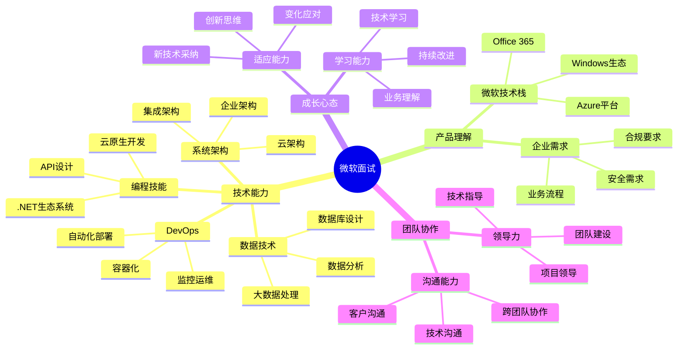

# 微软 (Microsoft) 面试题库

## 🏢 公司简介

微软是全球最大的软件公司之一，在操作系统、办公软件、云计算、游戏等领域都有重要地位。Azure云平台、Office 365、Windows等产品影响着全球数十亿用户。微软注重技术创新、包容性文化和持续学习的工作环境。

## 📍 面试特点

### 面试流程
1. **简历筛选** - 技术背景和项目经验评估
2. **电话筛选** - 技术基础和沟通能力测试
3. **现场/远程面试** - 4-5轮技术和行为面试
4. **团队面试** - 与hiring manager和团队成员面试
5. **最终评审** - HR和高级经理的综合评估

### 核心价值观
- **尊重包容** (Respect and Inclusion)
- **成长心态** (Growth Mindset)
- **赋能他人** (Empower Others)
- **客户成功** (Customer Success)

## 📚 面试题分类

### 技术面试题
- [.NET开发](./dotnet-development.md)
- [云计算架构](./cloud-architecture.md)
- [数据结构算法](./algorithms-data-structures.md)
- [系统设计](./system-design.md)
- [数据库技术](./database-technologies.md)

### 云平台相关
- [Azure服务](./azure-services.md)
- [容器技术](./container-technologies.md)
- [微服务架构](./microservices.md)
- [DevOps实践](./devops-practices.md)
- [监控运维](./monitoring-operations.md)

### 产品技术题
- [Office 365开发](./office365-development.md)
- [Teams应用开发](./teams-development.md)
- [Power Platform](./power-platform.md)
- [SharePoint开发](./sharepoint-development.md)

### 行为面试题
- [成长心态](./growth-mindset.md)
- [领导力案例](./leadership-examples.md)
- [团队协作](./collaboration.md)
- [客户导向](./customer-focus.md)
- [创新思维](./innovation.md)

### AI/ML相关题
- [Azure AI服务](./azure-ai.md)
- [机器学习](./machine-learning.md)
- [自然语言处理](./nlp.md)
- [计算机视觉](./computer-vision.md)

## 💡 面试准备重点

### 技术能力要求
1. **编程基础**：C#/.NET、Python、JavaScript等
2. **云计算**：Azure平台服务和架构
3. **企业应用**：大规模企业级应用开发经验
4. **数据技术**：SQL、NoSQL、数据分析
5. **DevOps**：CI/CD、容器化、自动化运维

### 微软特色技能
- **企业集成**：企业系统间的集成和互操作
- **安全合规**：企业级安全和合规要求
- **可扩展性**：支持大规模用户的系统设计
- **用户体验**：面向企业用户的UX设计

## 🎯 面试评估维度



## 🌟 面试成功策略

### 技术面试准备
1. **微软技术栈**：深入了解.NET、Azure等核心技术
2. **企业场景**：准备企业级应用开发经验
3. **系统设计**：重点关注可扩展性和可靠性
4. **最佳实践**：了解微软推荐的开发最佳实践

### 行为面试准备
1. **成长心态**：展示持续学习和改进的态度
2. **客户导向**：强调为客户创造价值的思维
3. **团队合作**：体现在多元化团队中的协作能力
4. **领导力**：展示技术领导和项目管理经验

## 📊 技术栈重点

### .NET开发示例
```csharp
// C# Azure Function示例
using Microsoft.Azure.Functions.Worker;
using Microsoft.Extensions.Logging;
using Microsoft.Azure.Functions.Worker.Http;

public class OrderProcessingFunction
{
    private readonly ILogger _logger;
    private readonly IOrderService _orderService;
    
    public OrderProcessingFunction(ILoggerFactory loggerFactory, IOrderService orderService)
    {
        _logger = loggerFactory.CreateLogger<OrderProcessingFunction>();
        _orderService = orderService;
    }
    
    [Function("ProcessOrder")]
    public async Task<HttpResponseData> Run(
        [HttpTrigger(AuthorizationLevel.Function, "post")] HttpRequestData req)
    {
        _logger.LogInformation("Processing order request");
        
        try
        {
            var orderRequest = await req.ReadFromJsonAsync<OrderRequest>();
            
            // 业务逻辑处理
            var result = await _orderService.ProcessOrderAsync(orderRequest);
            
            // 返回响应
            var response = req.CreateResponse(HttpStatusCode.OK);
            await response.WriteAsJsonAsync(new { OrderId = result.OrderId, Status = "Processed" });
            
            return response;
        }
        catch (Exception ex)
        {
            _logger.LogError(ex, "Error processing order");
            var errorResponse = req.CreateResponse(HttpStatusCode.InternalServerError);
            await errorResponse.WriteStringAsync("Internal server error");
            return errorResponse;
        }
    }
}
```

### Azure架构示例
```yaml
# Azure ARM Template示例
apiVersion: "2019-04-01"
kind: Template
metadata:
  name: "enterprise-webapp"
parameters:
  webAppName:
    type: string
    defaultValue: "enterprise-app"
  
variables:
  appServicePlanName: "[concat(parameters('webAppName'), '-plan')]"
  
resources:
  - type: "Microsoft.Web/serverfarms"
    apiVersion: "2020-06-01"
    name: "[variables('appServicePlanName')]"
    location: "[resourceGroup().location]"
    sku:
      name: "P1v2"
      tier: "PremiumV2"
    properties:
      reserved: false
      
  - type: "Microsoft.Web/sites"
    apiVersion: "2020-06-01"
    name: "[parameters('webAppName')]"
    location: "[resourceGroup().location]"
    dependsOn:
      - "[resourceId('Microsoft.Web/serverfarms', variables('appServicePlanName'))]"
    properties:
      serverFarmId: "[resourceId('Microsoft.Web/serverfarms', variables('appServicePlanName'))]"
      siteConfig:
        appSettings:
          - name: "APPINSIGHTS_INSTRUMENTATIONKEY"
            value: "[reference(resourceId('Microsoft.Insights/components', parameters('webAppName'))).InstrumentationKey]"
```

## 🔍 经典面试题示例

### 算法题
**问题**：实现一个LRU缓存，支持get和put操作，要求O(1)时间复杂度。

**考察点**：
- 数据结构设计（哈希表+双向链表）
- 时间复杂度优化
- 边界条件处理

### 系统设计题
**问题**：设计一个类似Office 365的文档协作系统。

**考察点**：
- 实时协作机制
- 版本控制
- 权限管理
- 可扩展性设计

### 云架构题
**问题**：设计一个支持全球用户的电商平台，使用Azure服务。

**考察点**：
- 全球部署策略
- CDN和缓存设计
- 数据库分片
- 安全和合规

## 💼 职业发展路径

### 软件工程师路线
- **SDE I** → **SDE II** → **Senior SDE** → **Principal SDE** → **Partner SDE**
- 技术深度和广度并重的发展路径

### 工程管理路线
- **SDE** → **Senior SDE** → **Engineering Manager** → **Director** → **CVP**
- 技术管理和团队领导的发展方向

### 产品技术路线
- **PM** → **Senior PM** → **Principal PM** → **Group PM** → **CVP**
- 产品和技术结合的职业发展

## 🎓 学习建议

### 技术能力提升
1. **.NET精通**：深入学习.NET生态系统和最新特性
2. **Azure专精**：获得Azure认证，掌握云原生开发
3. **企业架构**：学习企业级应用架构设计
4. **DevOps实践**：掌握现代化开发运维流程

### 软技能发展
1. **成长心态**：培养持续学习和改进的心态
2. **客户思维**：理解企业客户的需求和痛点
3. **沟通技巧**：提升技术沟通和演讲能力
4. **团队领导**：发展项目管理和团队协作技能

### Microsoft认证建议
1. **Azure认证**：AZ-104, AZ-204, AZ-303/304
2. **.NET认证**：Microsoft Certified: Azure Developer Associate
3. **DevOps认证**：AZ-400 Azure DevOps Engineer
4. **数据认证**：DP-100, DP-203, DP-300

## 🏆 面试成功要素

### 技术面试关键点
- **代码质量**：编写清晰、可维护的代码
- **最佳实践**：遵循微软推荐的开发规范
- **企业思维**：考虑企业级应用的特殊需求
- **创新意识**：展示对新技术的学习和应用

### 行为面试关键点
- **成长案例**：分享个人和团队成长的具体例子
- **客户成功**：展示为客户创造价值的经历
- **包容性**：体现在多元化环境中的协作能力
- **领导力**：展示技术领导和影响力

## 🔗 相关资源

- [Microsoft招聘官网](https://careers.microsoft.com/)
- [Microsoft Learn学习平台](https://docs.microsoft.com/learn/)
- [Azure架构中心](https://docs.microsoft.com/azure/architecture/)
- [.NET开发指南](https://docs.microsoft.com/dotnet/)

---
[← 返回公司目录](../README.md) | [← 返回主目录](../../../README.md) 