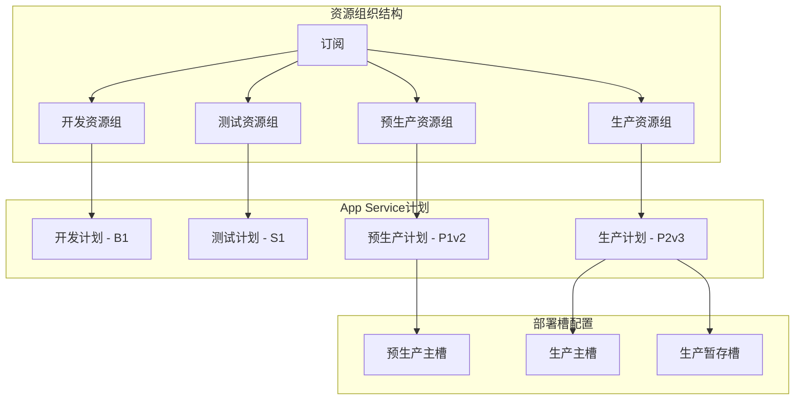
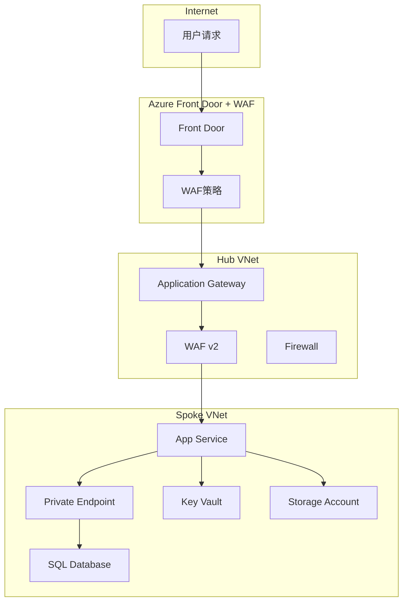

# 微软Azure服务面试题

## 📚 题目概览

Azure服务面试重点考察候选人对Microsoft Azure云平台各项服务的深度理解和实际应用能力。面试题目涵盖计算、存储、数据库、网络、安全、监控等核心服务领域，以及服务间的集成和架构设计能力。

## 🎯 核心服务考察重点

### 计算服务
- **App Service** - Web应用托管和扩展
- **Azure Functions** - 无服务器计算
- **Container Services** - 容器化应用部署
- **Virtual Machines** - 基础设施即服务

### 数据和存储
- **Azure SQL Database** - 托管关系数据库
- **Cosmos DB** - NoSQL全球分布式数据库
- **Storage Account** - Blob、Table、Queue存储
- **Redis Cache** - 内存缓存服务

### 网络和安全
- **Virtual Network** - 虚拟网络和子网
- **Application Gateway** - 应用层负载均衡
- **Key Vault** - 密钥和证书管理
- **Azure AD** - 身份认证和授权

## 📝 核心面试题目

### 1. 计算服务深度应用

#### 题目1：App Service高级配置
**问题**：设计一个支持多环境部署的Web应用架构，包括开发、测试、预生产和生产环境，要求实现蓝绿部署和自动扩展。

**架构设计方案**：


**实现配置**：
```bicep
// Bicep模板示例
param environment string = 'prod'
param location string = resourceGroup().location
param appName string = 'mywebapp'

// App Service计划配置
resource appServicePlan 'Microsoft.Web/serverfarms@2021-02-01' = {
  name: '${appName}-plan-${environment}'
  location: location
  sku: {
    name: environment == 'prod' ? 'P2v3' : (environment == 'staging' ? 'P1v2' : 'S1')
    tier: environment == 'prod' ? 'PremiumV3' : (environment == 'staging' ? 'PremiumV2' : 'Standard')
    capacity: environment == 'prod' ? 3 : 1
  }
  properties: {
    reserved: false
  }
}

// Web应用配置
resource webApp 'Microsoft.Web/sites@2021-02-01' = {
  name: '${appName}-${environment}'
  location: location
  properties: {
    serverFarmId: appServicePlan.id
    siteConfig: {
      netFrameworkVersion: 'v6.0'
      alwaysOn: environment == 'prod' ? true : false
      minTlsVersion: '1.2'
      appSettings: [
        {
          name: 'ENVIRONMENT'
          value: environment
        }
        {
          name: 'APPINSIGHTS_INSTRUMENTATIONKEY'
          value: appInsights.properties.InstrumentationKey
        }
        {
          name: 'ConnectionStrings__DefaultConnection'
          value: '@Microsoft.KeyVault(VaultName=${keyVault.name};SecretName=ConnectionString)'
        }
      ]
    }
  }
}

// 生产环境暂存槽配置
resource stagingSlot 'Microsoft.Web/sites/slots@2021-02-01' = if (environment == 'prod') {
  parent: webApp
  name: 'staging'
  location: location
  properties: {
    siteConfig: {
      appSettings: [
        {
          name: 'ENVIRONMENT'
          value: 'staging'
        }
        {
          name: 'APPINSIGHTS_INSTRUMENTATIONKEY'
          value: appInsights.properties.InstrumentationKey
        }
      ]
    }
  }
}

// 自动扩展配置
resource autoScaleSettings 'Microsoft.Insights/autoscalesettings@2021-05-01-preview' = if (environment == 'prod') {
  name: '${appName}-autoscale-${environment}'
  location: location
  properties: {
    profiles: [
      {
        name: 'Default'
        capacity: {
          minimum: '2'
          maximum: '10'
          default: '3'
        }
        rules: [
          {
            metricTrigger: {
              metricName: 'CpuPercentage'
              metricResourceUri: appServicePlan.id
              timeGrain: 'PT1M'
              statistic: 'Average'
              timeWindow: 'PT5M'
              timeAggregation: 'Average'
              operator: 'GreaterThan'
              threshold: 70
            }
            scaleAction: {
              direction: 'Increase'
              type: 'ChangeCount'
              value: '1'
              cooldown: 'PT5M'
            }
          }
          {
            metricTrigger: {
              metricName: 'CpuPercentage'
              metricResourceUri: appServicePlan.id
              timeGrain: 'PT1M'
              statistic: 'Average'
              timeWindow: 'PT5M'
              timeAggregation: 'Average'
              operator: 'LessThan'
              threshold: 30
            }
            scaleAction: {
              direction: 'Decrease'
              type: 'ChangeCount'
              value: '1'
              cooldown: 'PT10M'
            }
          }
        ]
      }
    ]
    targetResourceUri: appServicePlan.id
    enabled: true
  }
}
```

**蓝绿部署实现**：
```yaml
# Azure DevOps Pipeline
trigger:
- main

variables:
  azureSubscription: 'azure-service-connection'
  resourceGroupName: 'myapp-prod-rg'
  webAppName: 'mywebapp-prod'

stages:
- stage: Build
  jobs:
  - job: BuildApp
    steps:
    - task: DotNetCoreCLI@2
      inputs:
        command: 'build'
        projects: '**/*.csproj'
        arguments: '--configuration Release'
    
    - task: DotNetCoreCLI@2
      inputs:
        command: 'publish'
        projects: '**/*.csproj'
        arguments: '--configuration Release --output $(Build.ArtifactStagingDirectory)'
    
    - task: PublishBuildArtifacts@1
      inputs:
        pathToPublish: '$(Build.ArtifactStagingDirectory)'
        artifactName: 'drop'

- stage: DeployToStaging
  dependsOn: Build
  jobs:
  - deployment: DeployStaging
    environment: 'staging'
    strategy:
      runOnce:
        deploy:
          steps:
          - task: AzureWebApp@1
            inputs:
              azureSubscription: $(azureSubscription)
              appType: 'webApp'
              appName: $(webAppName)
              slotName: 'staging'
              package: '$(Pipeline.Workspace)/drop/**/*.zip'

- stage: RunTests
  dependsOn: DeployToStaging
  jobs:
  - job: IntegrationTests
    steps:
    - task: DotNetCoreCLI@2
      inputs:
        command: 'test'
        projects: '**/IntegrationTests.csproj'
        arguments: '--configuration Release --logger trx --collect "Code coverage"'
    
    - task: PublishTestResults@2
      inputs:
        testResultsFormat: 'VSTest'
        testResultsFiles: '**/*.trx'

- stage: SwapSlots
  dependsOn: RunTests
  condition: succeeded()
  jobs:
  - deployment: SwapToProduction
    environment: 'production'
    strategy:
      runOnce:
        deploy:
          steps:
          - task: AzureAppServiceManage@0
            inputs:
              azureSubscription: $(azureSubscription)
              action: 'Swap Slots'
              webAppName: $(webAppName)
              resourceGroupName: $(resourceGroupName)
              sourceSlot: 'staging'
              targetSlot: 'production'
```

#### 题目2：Azure Functions复杂事件处理
**问题**：设计一个订单处理系统，使用Azure Functions处理订单创建、库存检查、支付处理和通知发送的完整流程。

**函数应用架构**：
```csharp
// 订单处理主函数
public static class OrderProcessingFunctions
{
    [FunctionName("ProcessOrderCreated")]
    public static async Task ProcessOrderCreated(
        [ServiceBusTrigger("order-created", Connection = "ServiceBusConnection")] 
        OrderCreatedEvent orderEvent,
        [ServiceBus("inventory-check", Connection = "ServiceBusConnection")] 
        IAsyncCollector<InventoryCheckRequest> inventoryQueue,
        [CosmosDB("OrdersDB", "Orders", Connection = "CosmosDBConnection")] 
        IAsyncCollector<Order> ordersOut,
        ILogger log)
    {
        log.LogInformation($"Processing order created: {orderEvent.OrderId}");
        
        try
        {
            // 1. 保存订单到数据库
            var order = new Order
            {
                Id = orderEvent.OrderId,
                CustomerId = orderEvent.CustomerId,
                Items = orderEvent.Items,
                Status = OrderStatus.Pending,
                CreatedAt = DateTime.UtcNow,
                TotalAmount = orderEvent.TotalAmount
            };
            
            await ordersOut.AddAsync(order);
            
            // 2. 触发库存检查
            var inventoryRequest = new InventoryCheckRequest
            {
                OrderId = orderEvent.OrderId,
                Items = orderEvent.Items.Select(i => new InventoryItem
                {
                    ProductId = i.ProductId,
                    Quantity = i.Quantity
                }).ToList()
            };
            
            await inventoryQueue.AddAsync(inventoryRequest);
            
            log.LogInformation($"Order {orderEvent.OrderId} saved and inventory check initiated");
        }
        catch (Exception ex)
        {
            log.LogError(ex, $"Failed to process order created event for order {orderEvent.OrderId}");
            throw; // 触发重试机制
        }
    }
    
    [FunctionName("ProcessInventoryCheck")]
    public static async Task ProcessInventoryCheck(
        [ServiceBusTrigger("inventory-check", Connection = "ServiceBusConnection")] 
        InventoryCheckRequest request,
        [CosmosDB("OrdersDB", "Orders", Connection = "CosmosDBConnection", Id = "{OrderId}", PartitionKey = "{OrderId}")] 
        Order order,
        [CosmosDB("OrdersDB", "Orders", Connection = "CosmosDBConnection")] 
        IAsyncCollector<Order> ordersOut,
        [ServiceBus("payment-process", Connection = "ServiceBusConnection")] 
        IAsyncCollector<PaymentRequest> paymentQueue,
        [ServiceBus("order-cancelled", Connection = "ServiceBusConnection")] 
        IAsyncCollector<OrderCancelledEvent> cancelQueue,
        ILogger log)
    {
        log.LogInformation($"Checking inventory for order: {request.OrderId}");
        
        try
        {
            // 调用库存服务检查库存
            var inventoryService = new InventoryService();
            var inventoryResult = await inventoryService.CheckInventoryAsync(request.Items);
            
            if (inventoryResult.IsAvailable)
            {
                // 库存充足，更新订单状态并触发支付
                order.Status = OrderStatus.InventoryConfirmed;
                order.UpdatedAt = DateTime.UtcNow;
                await ordersOut.AddAsync(order);
                
                var paymentRequest = new PaymentRequest
                {
                    OrderId = request.OrderId,
                    CustomerId = order.CustomerId,
                    Amount = order.TotalAmount,
                    Currency = "USD"
                };
                
                await paymentQueue.AddAsync(paymentRequest);
                
                log.LogInformation($"Inventory confirmed for order {request.OrderId}, payment initiated");
            }
            else
            {
                // 库存不足，取消订单
                order.Status = OrderStatus.Cancelled;
                order.CancelReason = "Insufficient inventory";
                order.UpdatedAt = DateTime.UtcNow;
                await ordersOut.AddAsync(order);
                
                var cancelEvent = new OrderCancelledEvent
                {
                    OrderId = request.OrderId,
                    CustomerId = order.CustomerId,
                    Reason = "Insufficient inventory",
                    Items = inventoryResult.UnavailableItems
                };
                
                await cancelQueue.AddAsync(cancelEvent);
                
                log.LogWarning($"Order {request.OrderId} cancelled due to insufficient inventory");
            }
        }
        catch (Exception ex)
        {
            log.LogError(ex, $"Failed to process inventory check for order {request.OrderId}");
            throw;
        }
    }
    
    [FunctionName("ProcessPayment")]
    public static async Task ProcessPayment(
        [ServiceBusTrigger("payment-process", Connection = "ServiceBusConnection")] 
        PaymentRequest paymentRequest,
        [CosmosDB("OrdersDB", "Orders", Connection = "CosmosDBConnection", Id = "{OrderId}", PartitionKey = "{OrderId}")] 
        Order order,
        [CosmosDB("OrdersDB", "Orders", Connection = "CosmosDBConnection")] 
        IAsyncCollector<Order> ordersOut,
        [ServiceBus("order-completed", Connection = "ServiceBusConnection")] 
        IAsyncCollector<OrderCompletedEvent> completedQueue,
        [ServiceBus("payment-failed", Connection = "ServiceBusConnection")] 
        IAsyncCollector<PaymentFailedEvent> failedQueue,
        ILogger log)
    {
        log.LogInformation($"Processing payment for order: {paymentRequest.OrderId}");
        
        try
        {
            // 调用支付服务处理支付
            var paymentService = new PaymentService();
            var paymentResult = await paymentService.ProcessPaymentAsync(paymentRequest);
            
            if (paymentResult.IsSuccessful)
            {
                // 支付成功，完成订单
                order.Status = OrderStatus.Completed;
                order.PaymentId = paymentResult.PaymentId;
                order.PaidAt = DateTime.UtcNow;
                order.UpdatedAt = DateTime.UtcNow;
                await ordersOut.AddAsync(order);
                
                var completedEvent = new OrderCompletedEvent
                {
                    OrderId = paymentRequest.OrderId,
                    CustomerId = paymentRequest.CustomerId,
                    PaymentId = paymentResult.PaymentId,
                    Amount = paymentRequest.Amount,
                    CompletedAt = DateTime.UtcNow
                };
                
                await completedQueue.AddAsync(completedEvent);
                
                log.LogInformation($"Order {paymentRequest.OrderId} completed successfully");
            }
            else
            {
                // 支付失败，更新订单状态
                order.Status = OrderStatus.PaymentFailed;
                order.PaymentFailureReason = paymentResult.FailureReason;
                order.UpdatedAt = DateTime.UtcNow;
                await ordersOut.AddAsync(order);
                
                var failedEvent = new PaymentFailedEvent
                {
                    OrderId = paymentRequest.OrderId,
                    CustomerId = paymentRequest.CustomerId,
                    Reason = paymentResult.FailureReason,
                    Amount = paymentRequest.Amount
                };
                
                await failedQueue.AddAsync(failedEvent);
                
                log.LogWarning($"Payment failed for order {paymentRequest.OrderId}: {paymentResult.FailureReason}");
            }
        }
        catch (Exception ex)
        {
            log.LogError(ex, $"Failed to process payment for order {paymentRequest.OrderId}");
            throw;
        }
    }
    
    [FunctionName("SendNotifications")]
    public static async Task SendNotifications(
        [ServiceBusTrigger("order-completed", Connection = "ServiceBusConnection")] 
        OrderCompletedEvent completedEvent,
        [SendGrid(ApiKey = "SendGridApiKey")] IAsyncCollector<SendGridMessage> messages,
        [CosmosDB("OrdersDB", "Customers", Connection = "CosmosDBConnection", Id = "{CustomerId}", PartitionKey = "{CustomerId}")] 
        Customer customer,
        ILogger log)
    {
        log.LogInformation($"Sending notifications for completed order: {completedEvent.OrderId}");
        
        try
        {
            // 发送邮件通知
            var emailMessage = new SendGridMessage
            {
                From = new EmailAddress("noreply@company.com", "Order System"),
                Subject = $"Order {completedEvent.OrderId} Confirmed",
                TemplateId = "order-confirmation-template"
            };
            
            emailMessage.AddTo(new EmailAddress(customer.Email, customer.Name));
            emailMessage.SetTemplateData(new
            {
                CustomerName = customer.Name,
                OrderId = completedEvent.OrderId,
                Amount = completedEvent.Amount,
                CompletedAt = completedEvent.CompletedAt.ToString("yyyy-MM-dd HH:mm:ss")
            });
            
            await messages.AddAsync(emailMessage);
            
            // 发送SMS通知（如果客户有手机号）
            if (!string.IsNullOrEmpty(customer.PhoneNumber))
            {
                var smsService = new SmsService();
                await smsService.SendSmsAsync(customer.PhoneNumber, 
                    $"Your order {completedEvent.OrderId} has been confirmed. Amount: ${completedEvent.Amount}");
            }
            
            log.LogInformation($"Notifications sent for order {completedEvent.OrderId}");
        }
        catch (Exception ex)
        {
            log.LogError(ex, $"Failed to send notifications for order {completedEvent.OrderId}");
            // 通知失败不应该影响订单处理，所以不重新抛出异常
        }
    }
}

// 数据模型
public class Order
{
    public string Id { get; set; }
    public string CustomerId { get; set; }
    public List<OrderItem> Items { get; set; }
    public OrderStatus Status { get; set; }
    public decimal TotalAmount { get; set; }
    public string PaymentId { get; set; }
    public string PaymentFailureReason { get; set; }
    public string CancelReason { get; set; }
    public DateTime CreatedAt { get; set; }
    public DateTime UpdatedAt { get; set; }
    public DateTime? PaidAt { get; set; }
}

public enum OrderStatus
{
    Pending,
    InventoryConfirmed,
    PaymentFailed,
    Cancelled,
    Completed
}

public class OrderItem
{
    public string ProductId { get; set; }
    public string ProductName { get; set; }
    public int Quantity { get; set; }
    public decimal Price { get; set; }
}
```

### 2. 数据服务高级应用

#### 题目3：Cosmos DB全球分布策略
**问题**：设计一个全球化电商平台的数据架构，要求支持多区域读写，实现数据一致性和性能优化。

**Cosmos DB配置策略**：
```bicep
// Cosmos DB账户配置
resource cosmosAccount 'Microsoft.DocumentDB/databaseAccounts@2021-10-15' = {
  name: 'global-ecommerce-cosmos'
  location: primaryLocation
  properties: {
    databaseAccountOfferType: 'Standard'
    consistencyPolicy: {
      defaultConsistencyLevel: 'Session'
      maxIntervalInSeconds: 300
      maxStalenessPrefix: 100000
    }
    locations: [
      {
        locationName: 'East US'
        failoverPriority: 0
        isZoneRedundant: true
      }
      {
        locationName: 'West Europe'
        failoverPriority: 1
        isZoneRedundant: true
      }
      {
        locationName: 'Southeast Asia'
        failoverPriority: 2
        isZoneRedundant: true
      }
    ]
    capabilities: [
      {
        name: 'EnableServerless'
      }
      {
        name: 'EnableAnalyticalStorage'
      }
    ]
    enableMultipleWriteLocations: true
    enableAutomaticFailover: true
    backupPolicy: {
      type: 'Periodic'
      periodicModeProperties: {
        backupIntervalInMinutes: 240
        backupRetentionIntervalInHours: 720
        backupStorageRedundancy: 'Geo'
      }
    }
  }
}

// 数据库配置
resource ecommerceDatabase 'Microsoft.DocumentDB/databaseAccounts/sqlDatabases@2021-10-15' = {
  parent: cosmosAccount
  name: 'ECommerceDB'
  properties: {
    resource: {
      id: 'ECommerceDB'
    }
    options: {
      throughput: 400
    }
  }
}

// 产品容器配置（全球复制）
resource productsContainer 'Microsoft.DocumentDB/databaseAccounts/sqlDatabases/containers@2021-10-15' = {
  parent: ecommerceDatabase
  name: 'Products'
  properties: {
    resource: {
      id: 'Products'
      partitionKey: {
        paths: ['/categoryId']
        kind: 'Hash'
      }
      indexingPolicy: {
        indexingMode: 'Consistent'
        includedPaths: [
          {
            path: '/*'
          }
        ]
        excludedPaths: [
          {
            path: '/description/*'
          }
          {
            path: '/images/*'
          }
        ]
        compositeIndexes: [
          [
            {
              path: '/categoryId'
              order: 'ascending'
            }
            {
              path: '/price'
              order: 'ascending'
            }
          ]
          [
            {
              path: '/categoryId'
              order: 'ascending'
            }
            {
              path: '/rating'
              order: 'descending'
            }
          ]
        ]
      }
      analyticalStorageTtl: 2592000 // 30 days
    }
    options: {
      throughput: 1000
    }
  }
}

// 订单容器配置（按客户分区）
resource ordersContainer 'Microsoft.DocumentDB/databaseAccounts/sqlDatabases/containers@2021-10-15' = {
  parent: ecommerceDatabase
  name: 'Orders'
  properties: {
    resource: {
      id: 'Orders'
      partitionKey: {
        paths: ['/customerId']
        kind: 'Hash'
      }
      defaultTtl: -1 // 永久保存
      conflictResolutionPolicy: {
        mode: 'LastWriterWins'
        conflictResolutionPath: '/_ts'
      }
    }
    options: {
      throughput: 2000
    }
  }
}
```

**数据访问模式优化**：
```csharp
public class CosmosDbService
{
    private readonly CosmosClient _cosmosClient;
    private readonly Database _database;
    private readonly ILogger<CosmosDbService> _logger;
    
    public CosmosDbService(CosmosClient cosmosClient, ILogger<CosmosDbService> logger)
    {
        _cosmosClient = cosmosClient;
        _database = _cosmosClient.GetDatabase("ECommerceDB");
        _logger = logger;
    }
    
    // 产品查询优化（利用复合索引）
    public async Task<IEnumerable<Product>> GetProductsByCategoryAsync(
        string categoryId, 
        decimal? minPrice = null, 
        decimal? maxPrice = null,
        string region = "East US")
    {
        var container = _database.GetContainer("Products");
        
        // 使用地理就近访问
        var requestOptions = new QueryRequestOptions
        {
            ConsistencyLevel = ConsistencyLevel.Session,
            MaxItemCount = 50,
            // 指定首选区域
            SessionToken = await GetSessionTokenForRegion(region)
        };
        
        var queryDefinition = new QueryDefinition(
            "SELECT * FROM c WHERE c.categoryId = @categoryId " +
            (minPrice.HasValue ? "AND c.price >= @minPrice " : "") +
            (maxPrice.HasValue ? "AND c.price <= @maxPrice " : "") +
            "ORDER BY c.price ASC")
            .WithParameter("@categoryId", categoryId);
        
        if (minPrice.HasValue)
            queryDefinition.WithParameter("@minPrice", minPrice.Value);
        if (maxPrice.HasValue)
            queryDefinition.WithParameter("@maxPrice", maxPrice.Value);
        
        var iterator = container.GetItemQueryIterator<Product>(queryDefinition, requestOptions: requestOptions);
        var results = new List<Product>();
        
        while (iterator.HasMoreResults)
        {
            var response = await iterator.ReadNextAsync();
            results.AddRange(response);
            
            // 记录RU消耗
            _logger.LogInformation($"Query consumed {response.RequestCharge} RU");
        }
        
        return results;
    }
    
    // 订单数据的区域写入优化
    public async Task<Order> CreateOrderAsync(Order order, string preferredRegion)
    {
        var container = _database.GetContainer("Orders");
        
        // 冲突解决策略
        var itemRequestOptions = new ItemRequestOptions
        {
            ConsistencyLevel = ConsistencyLevel.Session,
            // 启用写入时的冲突检测
            IfMatchEtag = order.ETag
        };
        
        try
        {
            var response = await container.CreateItemAsync(order, 
                new PartitionKey(order.CustomerId), 
                itemRequestOptions);
            
            _logger.LogInformation($"Order {order.Id} created in region {preferredRegion}, RU consumed: {response.RequestCharge}");
            
            return response.Resource;
        }
        catch (CosmosException ex) when (ex.StatusCode == HttpStatusCode.Conflict)
        {
            _logger.LogWarning($"Order creation conflict for {order.Id}, attempting resolution");
            
            // 实现自定义冲突解决逻辑
            return await ResolveOrderConflictAsync(order, container);
        }
    }
    
    // 多区域数据同步监控
    public async Task<RegionSyncStatus> GetRegionSyncStatusAsync()
    {
        var accountInfo = await _cosmosClient.ReadAccountAsync();
        var syncStatus = new RegionSyncStatus
        {
            Regions = new List<RegionInfo>()
        };
        
        foreach (var location in accountInfo.ReadableLocations)
        {
            var regionInfo = new RegionInfo
            {
                Name = location.Name,
                Endpoint = location.Endpoint,
                IsOnline = true, // 需要通过健康检查确定
                LastSyncTime = DateTime.UtcNow // 需要从监控指标获取
            };
            
            // 检查区域延迟
            var latency = await MeasureRegionLatency(location.Endpoint);
            regionInfo.Latency = latency;
            
            syncStatus.Regions.Add(regionInfo);
        }
        
        return syncStatus;
    }
    
    // 数据一致性验证
    public async Task<ConsistencyValidationResult> ValidateDataConsistencyAsync(
        string documentId, 
        string partitionKey)
    {
        var container = _database.GetContainer("Orders");
        var validationResult = new ConsistencyValidationResult
        {
            DocumentId = documentId,
            ValidationTime = DateTime.UtcNow,
            RegionResults = new List<RegionValidationResult>()
        };
        
        // 从所有区域读取同一文档
        var accountInfo = await _cosmosClient.ReadAccountAsync();
        
        foreach (var location in accountInfo.ReadableLocations)
        {
            try
            {
                var requestOptions = new ItemRequestOptions
                {
                    ConsistencyLevel = ConsistencyLevel.Strong
                };
                
                var response = await container.ReadItemAsync<Order>(
                    documentId, 
                    new PartitionKey(partitionKey), 
                    requestOptions);
                
                validationResult.RegionResults.Add(new RegionValidationResult
                {
                    Region = location.Name,
                    Success = true,
                    ETag = response.ETag,
                    LastModified = response.Resource.UpdatedAt,
                    RequestCharge = response.RequestCharge
                });
            }
            catch (CosmosException ex)
            {
                validationResult.RegionResults.Add(new RegionValidationResult
                {
                    Region = location.Name,
                    Success = false,
                    Error = ex.Message,
                    StatusCode = (int)ex.StatusCode
                });
            }
        }
        
        // 检查数据一致性
        var etags = validationResult.RegionResults
            .Where(r => r.Success)
            .Select(r => r.ETag)
            .Distinct()
            .ToList();
        
        validationResult.IsConsistent = etags.Count <= 1;
        
        return validationResult;
    }
}

// 数据模型
public class Product
{
    public string Id { get; set; }
    public string CategoryId { get; set; }
    public string Name { get; set; }
    public string Description { get; set; }
    public decimal Price { get; set; }
    public double Rating { get; set; }
    public List<string> Images { get; set; }
    public int StockQuantity { get; set; }
    public string ETag { get; set; }
}

public class RegionSyncStatus
{
    public List<RegionInfo> Regions { get; set; }
    public DateTime CheckTime { get; set; }
}

public class RegionInfo
{
    public string Name { get; set; }
    public string Endpoint { get; set; }
    public bool IsOnline { get; set; }
    public DateTime LastSyncTime { get; set; }
    public TimeSpan Latency { get; set; }
}
```

### 3. 网络和安全服务

#### 题目4：企业级网络安全架构
**问题**：设计一个企业级Web应用的网络安全架构，包括WAF、私有端点、网络安全组和Key Vault集成。

**网络安全架构**：


**Bicep安全配置**：
```bicep
// 虚拟网络配置
resource hubVnet 'Microsoft.Network/virtualNetworks@2021-05-01' = {
  name: 'hub-vnet'
  location: location
  properties: {
    addressSpace: {
      addressPrefixes: [
        '10.0.0.0/16'
      ]
    }
    subnets: [
      {
        name: 'GatewaySubnet'
        properties: {
          addressPrefix: '10.0.1.0/24'
        }
      }
      {
        name: 'AzureFirewallSubnet'
        properties: {
          addressPrefix: '10.0.2.0/24'
        }
      }
      {
        name: 'ApplicationGatewaySubnet'
        properties: {
          addressPrefix: '10.0.3.0/24'
        }
      }
    ]
  }
}

resource spokeVnet 'Microsoft.Network/virtualNetworks@2021-05-01' = {
  name: 'spoke-vnet'
  location: location
  properties: {
    addressSpace: {
      addressPrefixes: [
        '10.1.0.0/16'
      ]
    }
    subnets: [
      {
        name: 'app-subnet'
        properties: {
          addressPrefix: '10.1.1.0/24'
          privateEndpointNetworkPolicies: 'Disabled'
          privateLinkServiceNetworkPolicies: 'Disabled'
          delegations: [
            {
              name: 'webapp-delegation'
              properties: {
                serviceName: 'Microsoft.Web/serverFarms'
              }
            }
          ]
        }
      }
      {
        name: 'data-subnet'
        properties: {
          addressPrefix: '10.1.2.0/24'
          privateEndpointNetworkPolicies: 'Disabled'
        }
      }
    ]
  }
}

// VNet对等连接
resource vnetPeering 'Microsoft.Network/virtualNetworks/virtualNetworkPeerings@2021-05-01' = {
  parent: hubVnet
  name: 'hub-to-spoke'
  properties: {
    remoteVirtualNetwork: {
      id: spokeVnet.id
    }
    allowForwardedTraffic: true
    allowGatewayTransit: true
    useRemoteGateways: false
  }
}

// Application Gateway with WAF v2
resource applicationGateway 'Microsoft.Network/applicationGateways@2021-05-01' = {
  name: 'app-gateway'
  location: location
  properties: {
    sku: {
      name: 'WAF_v2'
      tier: 'WAF_v2'
      capacity: 2
    }
    webApplicationFirewallConfiguration: {
      enabled: true
      firewallMode: 'Prevention'
      ruleSetType: 'OWASP'
      ruleSetVersion: '3.2'
      disabledRuleGroups: []
      requestBodyCheck: true
      maxRequestBodySizeInKb: 128
      fileUploadLimitInMb: 100
    }
    gatewayIPConfigurations: [
      {
        name: 'appGatewayIpConfig'
        properties: {
          subnet: {
            id: '${hubVnet.id}/subnets/ApplicationGatewaySubnet'
          }
        }
      }
    ]
    frontendIPConfigurations: [
      {
        name: 'appGatewayFrontendIP'
        properties: {
          publicIPAddress: {
            id: publicIP.id
          }
        }
      }
    ]
    frontendPorts: [
      {
        name: 'port_80'
        properties: {
          port: 80
        }
      }
      {
        name: 'port_443'
        properties: {
          port: 443
        }
      }
    ]
    backendAddressPools: [
      {
        name: 'appServiceBackendPool'
        properties: {
          backendAddresses: [
            {
              fqdn: '${webApp.name}.azurewebsites.net'
            }
          ]
        }
      }
    ]
    httpListeners: [
      {
        name: 'appGatewayHttpListener'
        properties: {
          frontendIPConfiguration: {
            id: resourceId('Microsoft.Network/applicationGateways/frontendIPConfigurations', 'app-gateway', 'appGatewayFrontendIP')
          }
          frontendPort: {
            id: resourceId('Microsoft.Network/applicationGateways/frontendPorts', 'app-gateway', 'port_443')
          }
          protocol: 'Https'
          sslCertificate: {
            id: resourceId('Microsoft.Network/applicationGateways/sslCertificates', 'app-gateway', 'appGatewaySslCert')
          }
        }
      }
    ]
    requestRoutingRules: [
      {
        name: 'rule1'
        properties: {
          ruleType: 'Basic'
          httpListener: {
            id: resourceId('Microsoft.Network/applicationGateways/httpListeners', 'app-gateway', 'appGatewayHttpListener')
          }
          backendAddressPool: {
            id: resourceId('Microsoft.Network/applicationGateways/backendAddressPools', 'app-gateway', 'appServiceBackendPool')
          }
          backendHttpSettings: {
            id: resourceId('Microsoft.Network/applicationGateways/backendHttpSettingsCollection', 'app-gateway', 'appGatewayBackendHttpSettings')
          }
        }
      }
    ]
  }
}

// Key Vault配置
resource keyVault 'Microsoft.KeyVault/vaults@2021-10-01' = {
  name: 'enterprise-keyvault'
  location: location
  properties: {
    sku: {
      family: 'A'
      name: 'premium'
    }
    tenantId: subscription().tenantId
    enableSoftDelete: true
    softDeleteRetentionInDays: 90
    enablePurgeProtection: true
    enableRbacAuthorization: true
    enabledForDeployment: false
    enabledForDiskEncryption: false
    enabledForTemplateDeployment: true
    networkAcls: {
      bypass: 'AzureServices'
      defaultAction: 'Deny'
      virtualNetworkRules: [
        {
          id: '${spokeVnet.id}/subnets/app-subnet'
          ignoreMissingVnetServiceEndpoint: false
        }
      ]
    }
  }
}

// Private Endpoint for Key Vault
resource keyVaultPrivateEndpoint 'Microsoft.Network/privateEndpoints@2021-05-01' = {
  name: 'keyvault-private-endpoint'
  location: location
  properties: {
    subnet: {
      id: '${spokeVnet.id}/subnets/data-subnet'
    }
    privateLinkServiceConnections: [
      {
        name: 'keyvault-connection'
        properties: {
          privateLinkServiceId: keyVault.id
          groupIds: [
            'vault'
          ]
        }
      }
    ]
  }
}

// Private DNS Zone
resource privateDnsZone 'Microsoft.Network/privateDnsZones@2020-06-01' = {
  name: 'privatelink.vaultcore.azure.net'
  location: 'global'
}

resource privateDnsZoneLink 'Microsoft.Network/privateDnsZones/virtualNetworkLinks@2020-06-01' = {
  parent: privateDnsZone
  name: 'keyvault-dns-link'
  location: 'global'
  properties: {
    virtualNetwork: {
      id: spokeVnet.id
    }
    registrationEnabled: false
  }
}

// Network Security Group
resource appSubnetNsg 'Microsoft.Network/networkSecurityGroups@2021-05-01' = {
  name: 'app-subnet-nsg'
  location: location
  properties: {
    securityRules: [
      {
        name: 'AllowHTTPS'
        properties: {
          protocol: 'Tcp'
          sourcePortRange: '*'
          destinationPortRange: '443'
          sourceAddressPrefix: '10.0.0.0/8'
          destinationAddressPrefix: '*'
          access: 'Allow'
          priority: 100
          direction: 'Inbound'
        }
      }
      {
        name: 'AllowKeyVaultAccess'
        properties: {
          protocol: 'Tcp'
          sourcePortRange: '*'
          destinationPortRange: '443'
          sourceAddressPrefix: 'VirtualNetwork'
          destinationAddressPrefix: 'AzureKeyVault'
          access: 'Allow'
          priority: 110
          direction: 'Outbound'
        }
      }
      {
        name: 'DenyAllInbound'
        properties: {
          protocol: '*'
          sourcePortRange: '*'
          destinationPortRange: '*'
          sourceAddressPrefix: '*'
          destinationAddressPrefix: '*'
          access: 'Deny'
          priority: 4000
          direction: 'Inbound'
        }
      }
    ]
  }
}
```

## 📊 面试评分标准

### Azure服务深度 (35%)
- **服务熟练度**：对核心Azure服务的深入理解
- **最佳实践**：遵循Azure架构和安全最佳实践
- **性能优化**：合理配置服务以获得最佳性能
- **成本控制**：考虑成本效益的资源配置

### 架构设计能力 (30%)
- **整体架构**：设计合理的端到端解决方案
- **服务集成**：有效整合多个Azure服务
- **可扩展性**：支持业务增长的架构设计
- **可靠性**：高可用和容错架构设计

### 安全和合规 (25%)
- **安全意识**：深入理解云安全模型
- **网络安全**：正确配置网络安全控制
- **身份管理**：有效的身份认证和授权设计
- **数据保护**：数据加密和隐私保护措施

### 实践经验 (10%)
- **故障排除**：解决实际问题的能力
- **监控运维**：建立有效的监控和告警
- **自动化**：使用Infrastructure as Code
- **持续改进**：基于监控数据优化架构

## 🎯 备考建议

### 核心技能提升
1. **动手实践**：在Azure门户中实际操作各项服务
2. **架构设计**：学习Azure Well-Architected Framework
3. **最佳实践**：了解各服务的配置最佳实践
4. **故障排除**：积累解决实际问题的经验

### 学习资源推荐
1. **Microsoft Learn**：官方学习平台和实验室
2. **Azure Architecture Center**：架构模式和最佳实践
3. **Azure Documentation**：详细的服务文档
4. **Azure Friday**：技术视频和案例分享

### 认证建议
- **AZ-900**: Azure Fundamentals（基础）
- **AZ-104**: Azure Administrator Associate（管理）
- **AZ-204**: Azure Developer Associate（开发）
- **AZ-305**: Azure Solutions Architect Expert（架构）

---
[← 返回微软面试题库](./README.md) 