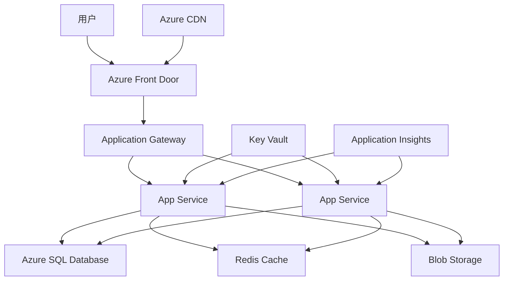

# 微软云计算架构面试题

## 📚 题目概览

微软云计算架构面试重点考察候选人对Azure云平台的深度理解、云原生应用设计能力，以及企业级云解决方案的架构设计经验。面试题目涵盖Azure服务、微服务架构、容器化、DevOps等关键技术领域。

## 🎯 核心技术考察重点

### Azure核心服务
- **计算服务** - App Service、Azure Functions、Container Instances
- **存储服务** - Blob Storage、Table Storage、Queue Storage
- **数据库服务** - SQL Database、Cosmos DB、Redis Cache
- **网络服务** - Virtual Network、Load Balancer、Application Gateway

### 云原生架构
- **微服务设计** - 服务拆分、通信模式、数据一致性
- **容器化** - Docker、Kubernetes、Azure Container Apps
- **无服务器架构** - Azure Functions、Logic Apps、Event Grid
- **API管理** - API Gateway、版本控制、安全认证

## 📝 核心面试题目

### 1. Azure云服务架构

#### 题目1：设计高可用的Web应用架构
**问题**：设计一个支持全球用户的电商Web应用，要求高可用、高性能和可扩展性。

**架构设计思路**：


**实现方案**：
```yaml
# Azure Resource Manager Template
{
  "$schema": "https://schema.management.azure.com/schemas/2019-04-01/deploymentTemplate.json#",
  "contentVersion": "1.0.0.0",
  "parameters": {
    "appName": {
      "type": "string",
      "defaultValue": "ecommerce-app"
    },
    "location": {
      "type": "string",
      "defaultValue": "[resourceGroup().location]"
    }
  },
  "resources": [
    {
      "type": "Microsoft.Web/serverfarms",
      "apiVersion": "2021-02-01",
      "name": "[concat(parameters('appName'), '-plan')]",
      "location": "[parameters('location')]",
      "sku": {
        "name": "P1v3",
        "tier": "PremiumV3",
        "capacity": 2
      },
      "properties": {
        "reserved": false
      }
    },
    {
      "type": "Microsoft.Web/sites",
      "apiVersion": "2021-02-01",
      "name": "[parameters('appName')]",
      "location": "[parameters('location')]",
      "dependsOn": [
        "[resourceId('Microsoft.Web/serverfarms', concat(parameters('appName'), '-plan'))]"
      ],
      "properties": {
        "serverFarmId": "[resourceId('Microsoft.Web/serverfarms', concat(parameters('appName'), '-plan'))]",
        "siteConfig": {
          "netFrameworkVersion": "v6.0",
          "appSettings": [
            {
              "name": "APPINSIGHTS_INSTRUMENTATIONKEY",
              "value": "[reference(resourceId('Microsoft.Insights/components', parameters('appName'))).InstrumentationKey]"
            }
          ]
        }
      }
    }
  ]
}
```

**关键架构决策**：
- **全球分发**：使用Azure Front Door实现全球负载均衡
- **自动扩展**：App Service配置自动扩展规则
- **数据层**：SQL Database主备架构 + Redis缓存
- **CDN加速**：静态资源通过Azure CDN分发
- **监控告警**：Application Insights全面监控

#### 题目2：微服务架构设计
**问题**：设计一个订单管理系统的微服务架构，包括用户服务、订单服务、支付服务和库存服务。

**微服务架构实现**：
```csharp
// 订单服务示例
[ApiController]
[Route("api/[controller]")]
public class OrdersController : ControllerBase
{
    private readonly IOrderService _orderService;
    private readonly IServiceBusClient _serviceBus;
    private readonly ILogger<OrdersController> _logger;
    
    public OrdersController(
        IOrderService orderService,
        IServiceBusClient serviceBus,
        ILogger<OrdersController> logger)
    {
        _orderService = orderService;
        _serviceBus = serviceBus;
        _logger = logger;
    }
    
    [HttpPost]
    public async Task<ActionResult<CreateOrderResponse>> CreateOrder(
        [FromBody] CreateOrderRequest request)
    {
        try
        {
            // 1. 创建订单（待确认状态）
            var order = await _orderService.CreatePendingOrderAsync(request);
            
            // 2. 发布订单创建事件
            var orderCreatedEvent = new OrderCreatedEvent
            {
                OrderId = order.Id,
                CustomerId = request.CustomerId,
                Items = request.Items,
                TotalAmount = order.TotalAmount,
                CreatedAt = DateTime.UtcNow
            };
            
            await _serviceBus.PublishAsync("order-created", orderCreatedEvent);
            
            // 3. 返回订单信息
            return Ok(new CreateOrderResponse
            {
                OrderId = order.Id,
                Status = "Pending",
                Message = "Order created successfully"
            });
        }
        catch (Exception ex)
        {
            _logger.LogError(ex, "Failed to create order");
            return StatusCode(500, "Internal server error");
        }
    }
}

// 服务间通信处理
public class OrderEventHandler : IHostedService
{
    private readonly IServiceBusProcessor _processor;
    private readonly IOrderService _orderService;
    private readonly ILogger<OrderEventHandler> _logger;
    
    public async Task StartAsync(CancellationToken cancellationToken)
    {
        // 监听库存确认事件
        await _processor.StartProcessingAsync(cancellationToken);
    }
    
    [ServiceBusMessageHandler("inventory-confirmed")]
    public async Task HandleInventoryConfirmed(InventoryConfirmedEvent eventData)
    {
        try
        {
            await _orderService.ConfirmInventoryAsync(eventData.OrderId);
            
            // 触发支付流程
            var paymentRequest = new PaymentRequestEvent
            {
                OrderId = eventData.OrderId,
                Amount = eventData.TotalAmount,
                CustomerId = eventData.CustomerId
            };
            
            await _serviceBus.PublishAsync("payment-requested", paymentRequest);
        }
        catch (Exception ex)
        {
            _logger.LogError(ex, "Failed to handle inventory confirmed event");
            // 实现重试逻辑或死信队列处理
        }
    }
}
```

**服务配置（Program.cs）**：
```csharp
var builder = WebApplication.CreateBuilder(args);

// Azure服务注册
builder.Services.AddAzureClients(clientBuilder =>
{
    // Service Bus
    clientBuilder.AddServiceBusClient(builder.Configuration.GetConnectionString("ServiceBus"));
    
    // Cosmos DB
    clientBuilder.AddCosmosClient(builder.Configuration.GetConnectionString("CosmosDb"));
    
    // Key Vault
    clientBuilder.AddSecretClient(new Uri(builder.Configuration["KeyVault:VaultUrl"]));
});

// 应用服务注册
builder.Services.AddScoped<IOrderService, OrderService>();
builder.Services.AddScoped<IPaymentService, PaymentService>();
builder.Services.AddHostedService<OrderEventHandler>();

// 健康检查
builder.Services.AddHealthChecks()
    .AddAzureServiceBusTopic(
        builder.Configuration.GetConnectionString("ServiceBus"),
        "order-events")
    .AddCosmosDb(
        builder.Configuration.GetConnectionString("CosmosDb"),
        "OrdersDb");

// API网关配置
builder.Services.AddReverseProxy()
    .LoadFromConfig(builder.Configuration.GetSection("ReverseProxy"));

var app = builder.Build();

// 中间件配置
app.UseHealthChecks("/health");
app.UseAuthentication();
app.UseAuthorization();
app.MapReverseProxy();
app.MapControllers();

app.Run();
```

### 2. Azure Functions无服务器架构

#### 题目3：事件驱动的无服务器解决方案
**问题**：设计一个图片处理系统，用户上传图片后自动生成缩略图并提取元数据。

**Azure Functions实现**：
```csharp
public class ImageProcessingFunctions
{
    private readonly ILogger<ImageProcessingFunctions> _logger;
    private readonly BlobServiceClient _blobServiceClient;
    private readonly CosmosClient _cosmosClient;
    
    public ImageProcessingFunctions(
        ILogger<ImageProcessingFunctions> logger,
        BlobServiceClient blobServiceClient,
        CosmosClient cosmosClient)
    {
        _logger = logger;
        _blobServiceClient = blobServiceClient;
        _cosmosClient = cosmosClient;
    }
    
    [FunctionName("ProcessUploadedImage")]
    public async Task ProcessUploadedImage(
        [BlobTrigger("uploads/{name}", Connection = "AzureWebJobsStorage")] Stream imageStream,
        string name,
        [Blob("thumbnails/{name}", FileAccess.Write, Connection = "AzureWebJobsStorage")] Stream thumbnailStream,
        ILogger log)
    {
        log.LogInformation($"Processing image: {name}");
        
        try
        {
            // 1. 生成缩略图
            await GenerateThumbnailAsync(imageStream, thumbnailStream);
            
            // 2. 提取元数据
            var metadata = await ExtractImageMetadataAsync(imageStream, name);
            
            // 3. 保存元数据到Cosmos DB
            await SaveImageMetadataAsync(metadata);
            
            // 4. 发送处理完成通知
            await SendProcessingNotificationAsync(name, metadata);
            
            log.LogInformation($"Successfully processed image: {name}");
        }
        catch (Exception ex)
        {
            log.LogError(ex, $"Failed to process image: {name}");
            
            // 发送到死信队列进行错误处理
            await HandleProcessingErrorAsync(name, ex.Message);
            throw;
        }
    }
    
    [FunctionName("GenerateThumbnail")]
    public static async Task GenerateThumbnailAsync(Stream input, Stream output)
    {
        using var image = Image.Load(input);
        
        // 计算缩略图尺寸（保持宽高比）
        var targetSize = 150;
        var scaleFactor = Math.Min(
            (double)targetSize / image.Width,
            (double)targetSize / image.Height);
        
        var newWidth = (int)(image.Width * scaleFactor);
        var newHeight = (int)(image.Height * scaleFactor);
        
        // 生成缩略图
        image.Mutate(x => x.Resize(newWidth, newHeight));
        
        // 保存为JPEG格式
        await image.SaveAsJpegAsync(output);
    }
    
    private async Task<ImageMetadata> ExtractImageMetadataAsync(Stream imageStream, string fileName)
    {
        imageStream.Position = 0;
        
        using var image = Image.Load(imageStream);
        
        var metadata = new ImageMetadata
        {
            Id = Guid.NewGuid().ToString(),
            FileName = fileName,
            Width = image.Width,
            Height = image.Height,
            FileSize = imageStream.Length,
            Format = image.Metadata.DecodedImageFormat?.Name,
            CreatedAt = DateTime.UtcNow
        };
        
        // 提取EXIF数据
        if (image.Metadata.ExifProfile != null)
        {
            metadata.CameraModel = image.Metadata.ExifProfile.GetValue(ExifTag.Model)?.Value;
            metadata.DateTaken = image.Metadata.ExifProfile.GetValue(ExifTag.DateTime)?.Value;
            
            // GPS信息提取
            var gpsLatitude = image.Metadata.ExifProfile.GetValue(ExifTag.GPSLatitude);
            var gpsLongitude = image.Metadata.ExifProfile.GetValue(ExifTag.GPSLongitude);
            
            if (gpsLatitude != null && gpsLongitude != null)
            {
                metadata.Location = new GeoLocation
                {
                    Latitude = ConvertDMSToDD(gpsLatitude.Value),
                    Longitude = ConvertDMSToDD(gpsLongitude.Value)
                };
            }
        }
        
        return metadata;
    }
    
    [FunctionName("CleanupOldImages")]
    public async Task CleanupOldImages(
        [TimerTrigger("0 0 2 * * *")] TimerInfo timer, // 每天凌晨2点执行
        ILogger log)
    {
        log.LogInformation("Starting cleanup of old images");
        
        var cutoffDate = DateTime.UtcNow.AddDays(-90); // 删除90天前的图片
        
        try
        {
            // 查询需要删除的图片
            var container = _cosmosClient.GetContainer("ImageDb", "Images");
            var query = container.GetItemQueryIterator<ImageMetadata>(
                $"SELECT * FROM c WHERE c.createdAt < '{cutoffDate:yyyy-MM-dd}'");
            
            var imagesToDelete = new List<ImageMetadata>();
            while (query.HasMoreResults)
            {
                var response = await query.ReadNextAsync();
                imagesToDelete.AddRange(response);
            }
            
            // 删除Blob存储中的文件
            var uploadContainer = _blobServiceClient.GetBlobContainerClient("uploads");
            var thumbnailContainer = _blobServiceClient.GetBlobContainerClient("thumbnails");
            
            foreach (var image in imagesToDelete)
            {
                // 删除原图和缩略图
                await uploadContainer.DeleteBlobIfExistsAsync(image.FileName);
                await thumbnailContainer.DeleteBlobIfExistsAsync(image.FileName);
                
                // 删除元数据记录
                await container.DeleteItemAsync<ImageMetadata>(image.Id, new PartitionKey(image.Id));
            }
            
            log.LogInformation($"Cleanup completed. Deleted {imagesToDelete.Count} images.");
        }
        catch (Exception ex)
        {
            log.LogError(ex, "Failed to cleanup old images");
            throw;
        }
    }
}

// 数据模型
public class ImageMetadata
{
    public string Id { get; set; }
    public string FileName { get; set; }
    public int Width { get; set; }
    public int Height { get; set; }
    public long FileSize { get; set; }
    public string Format { get; set; }
    public string CameraModel { get; set; }
    public DateTime? DateTaken { get; set; }
    public GeoLocation Location { get; set; }
    public DateTime CreatedAt { get; set; }
}

public class GeoLocation
{
    public double Latitude { get; set; }
    public double Longitude { get; set; }
}
```

### 3. 容器化和Kubernetes

#### 题目4：Azure Kubernetes Service部署
**问题**：将微服务应用部署到AKS集群，实现自动扩展和滚动更新。

**Kubernetes配置文件**：
```yaml
# order-service-deployment.yaml
apiVersion: apps/v1
kind: Deployment
metadata:
  name: order-service
  labels:
    app: order-service
spec:
  replicas: 3
  selector:
    matchLabels:
      app: order-service
  template:
    metadata:
      labels:
        app: order-service
    spec:
      containers:
      - name: order-service
        image: myregistry.azurecr.io/order-service:latest
        ports:
        - containerPort: 80
        env:
        - name: ConnectionStrings__DefaultConnection
          valueFrom:
            secretKeyRef:
              name: db-secret
              key: connection-string
        - name: ServiceBus__ConnectionString
          valueFrom:
            secretKeyRef:
              name: servicebus-secret
              key: connection-string
        resources:
          requests:
            memory: "256Mi"
            cpu: "250m"
          limits:
            memory: "512Mi"
            cpu: "500m"
        readinessProbe:
          httpGet:
            path: /health/ready
            port: 80
          initialDelaySeconds: 30
          periodSeconds: 10
        livenessProbe:
          httpGet:
            path: /health/live
            port: 80
          initialDelaySeconds: 30
          periodSeconds: 30

---
apiVersion: v1
kind: Service
metadata:
  name: order-service
spec:
  selector:
    app: order-service
  ports:
  - protocol: TCP
    port: 80
    targetPort: 80
  type: ClusterIP

---
apiVersion: autoscaling/v2
kind: HorizontalPodAutoscaler
metadata:
  name: order-service-hpa
spec:
  scaleTargetRef:
    apiVersion: apps/v1
    kind: Deployment
    name: order-service
  minReplicas: 3
  maxReplicas: 10
  metrics:
  - type: Resource
    resource:
      name: cpu
      target:
        type: Utilization
        averageUtilization: 70
  - type: Resource
    resource:
      name: memory
      target:
        type: Utilization
        averageUtilization: 80

---
apiVersion: networking.k8s.io/v1
kind: Ingress
metadata:
  name: order-service-ingress
  annotations:
    kubernetes.io/ingress.class: azure/application-gateway
    appgw.ingress.kubernetes.io/ssl-redirect: "true"
spec:
  tls:
  - hosts:
    - api.company.com
    secretName: tls-secret
  rules:
  - host: api.company.com
    http:
      paths:
      - path: /api/orders
        pathType: Prefix
        backend:
          service:
            name: order-service
            port:
              number: 80
```

**Azure DevOps Pipeline配置**：
```yaml
# azure-pipelines.yml
trigger:
- main

variables:
  dockerRegistryServiceConnection: 'myregistry-connection'
  imageRepository: 'order-service'
  containerRegistry: 'myregistry.azurecr.io'
  dockerfilePath: '**/Dockerfile'
  tag: '$(Build.BuildId)'
  kubernetesServiceConnection: 'aks-connection'

stages:
- stage: Build
  displayName: Build and push image
  jobs:
  - job: Build
    displayName: Build
    pool:
      vmImage: ubuntu-latest
    steps:
    - task: Docker@2
      displayName: Build and push image
      inputs:
        command: buildAndPush
        repository: $(imageRepository)
        dockerfile: $(dockerfilePath)
        containerRegistry: $(dockerRegistryServiceConnection)
        tags: |
          $(tag)
          latest

- stage: Deploy
  displayName: Deploy to AKS
  dependsOn: Build
  jobs:
  - deployment: Deploy
    displayName: Deploy
    pool:
      vmImage: ubuntu-latest
    environment: 'production'
    strategy:
      runOnce:
        deploy:
          steps:
          - task: KubernetesManifest@0
            displayName: Deploy to Kubernetes cluster
            inputs:
              action: deploy
              kubernetesServiceConnection: $(kubernetesServiceConnection)
              manifests: |
                $(Pipeline.Workspace)/manifests/order-service-deployment.yaml
              containers: |
                $(containerRegistry)/$(imageRepository):$(tag)
```

## 📊 面试评分标准

### 云架构设计能力 (35%)
- Azure服务选型和配置合理性
- 高可用和可扩展性设计
- 成本优化和性能考虑
- 安全和合规架构设计

### 微服务和容器化 (30%)
- 微服务拆分和设计原则
- 服务间通信和数据一致性
- 容器化和Kubernetes应用
- DevOps和CI/CD实践

### 技术实现能力 (25%)
- Azure服务API使用熟练度
- 代码质量和最佳实践
- 监控和故障排除能力
- 自动化和基础设施即代码

### 业务理解和创新 (10%)
- 业务需求到技术方案的转化
- 技术选型的商业考虑
- 新技术的学习和应用
- 团队协作和知识分享

## 🎯 备考建议

### 核心技能提升
1. **Azure服务精通**：深入学习Azure核心服务的特性和使用场景
2. **云原生架构**：掌握微服务、容器化、无服务器等现代架构模式
3. **DevOps实践**：熟练使用Azure DevOps、GitHub Actions等CI/CD工具
4. **监控运维**：了解Application Insights、Log Analytics等监控工具

### 实践项目建议
1. **构建完整的云原生应用**：从前端到后端的全栈云应用
2. **实现微服务架构**：包括服务发现、配置管理、链路追踪
3. **容器化部署**：使用Docker和Kubernetes进行应用部署
4. **基础设施即代码**：使用ARM Template或Terraform管理资源

### Azure认证准备
- **AZ-104**: Azure Administrator Associate
- **AZ-204**: Azure Developer Associate  
- **AZ-303/304**: Azure Solutions Architect Expert
- **AZ-400**: Azure DevOps Engineer Expert

---
[← 返回微软面试题库](./README.md) 