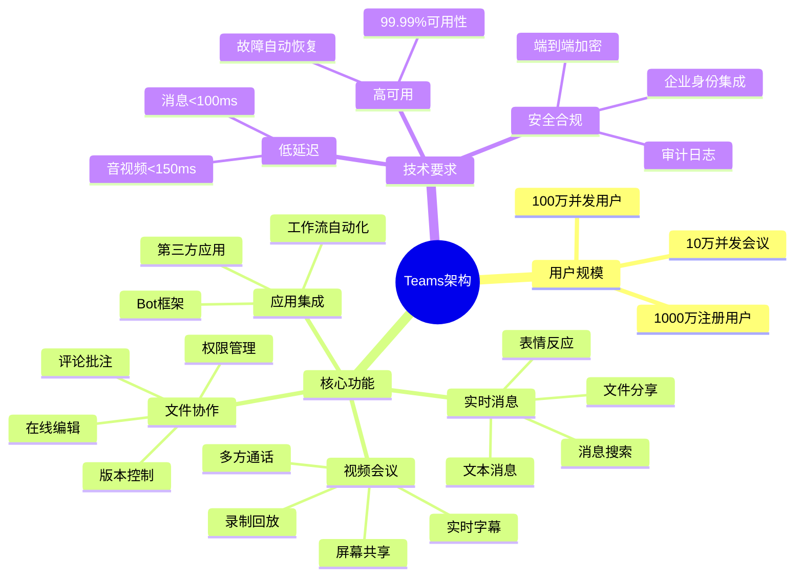
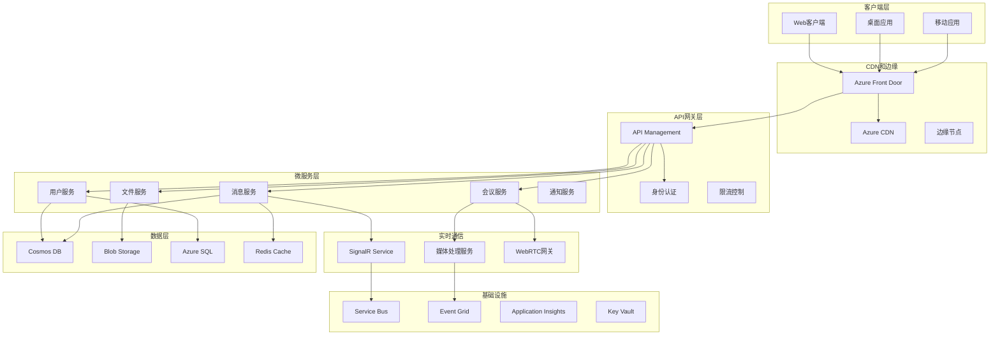
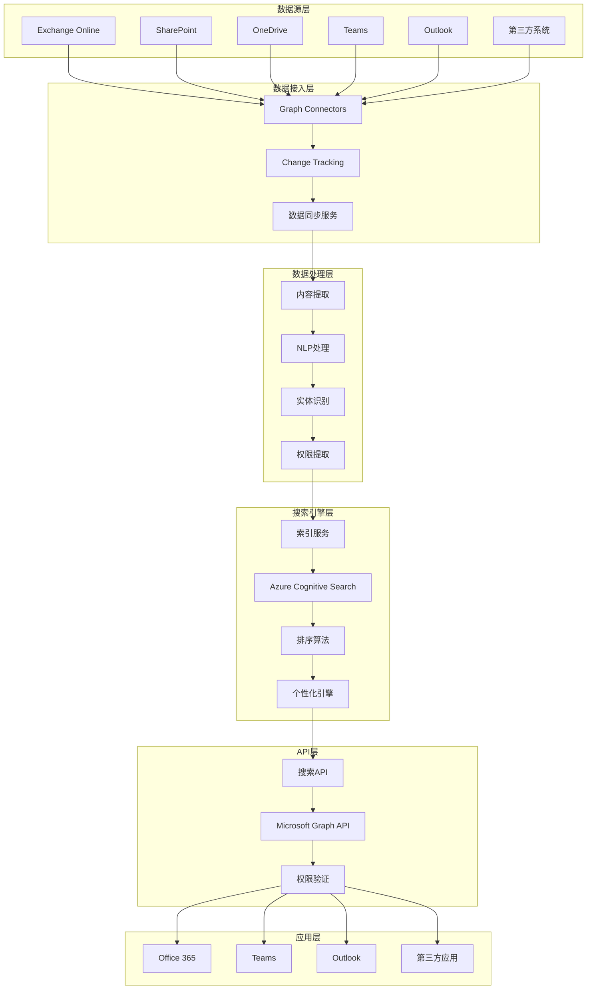
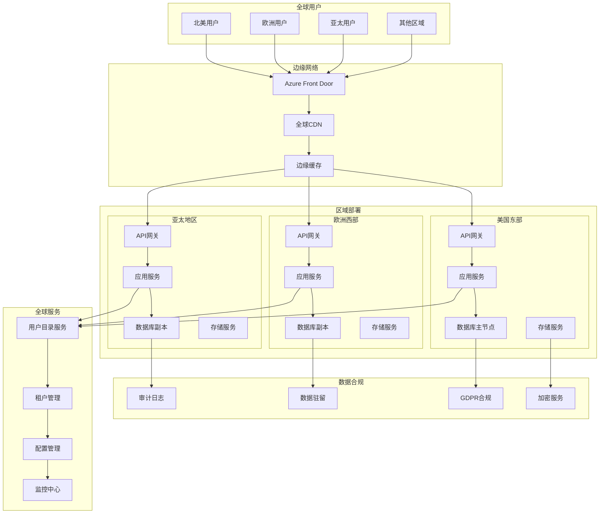

# 微软系统设计面试题

## 📚 题目概览

微软系统设计面试重点考察候选人设计大规模、高可用、可扩展系统的能力。题目通常涉及企业级应用场景，如Office 365、Teams、Azure服务等真实业务系统的架构设计挑战。

## 🎯 设计原则和考察重点

### 核心设计原则
- **可扩展性** - 支持百万到亿级用户规模
- **高可用性** - 99.9%以上的服务可用性
- **一致性** - 数据一致性和业务逻辑一致性
- **性能优化** - 低延迟和高吞吐量
- **安全性** - 企业级安全和合规要求

### 微软技术栈重点
- **Azure云服务** - 充分利用Azure平台能力
- **混合云架构** - 云端和本地的无缝集成
- **企业集成** - 与现有企业系统的互操作
- **全球化支持** - 多区域部署和本地化

## 📝 核心设计题目

### 1. 大规模协作平台设计

#### 题目1：设计类似Microsoft Teams的企业协作平台
**问题**：设计一个支持1000万用户的企业协作平台，包括实时消息、视频会议、文件共享和应用集成功能。

**需求分析**：


**架构设计方案**：


**核心服务设计**：

1. **消息服务架构**：
```csharp
// 消息服务核心实现
public class MessageService
{
    private readonly ICosmosRepository<Message> _messageRepository;
    private readonly ICacheService _cacheService;
    private readonly IEventBus _eventBus;
    private readonly ISignalRService _signalRService;
    
    public async Task<MessageResponse> SendMessageAsync(SendMessageRequest request)
    {
        // 1. 消息验证和预处理
        var message = new Message
        {
            Id = Guid.NewGuid().ToString(),
            ConversationId = request.ConversationId,
            SenderId = request.SenderId,
            Content = await ProcessMessageContent(request.Content),
            MessageType = request.MessageType,
            Timestamp = DateTime.UtcNow,
            Status = MessageStatus.Sent
        };
        
        // 2. 消息持久化（分片策略）
        await _messageRepository.CreateAsync(message, message.ConversationId);
        
        // 3. 缓存最新消息
        await _cacheService.AddToSortedSetAsync(
            $"conversation:{request.ConversationId}:messages",
            message,
            message.Timestamp.Ticks);
        
        // 4. 实时推送
        await _signalRService.SendToGroupAsync(
            request.ConversationId,
            "MessageReceived",
            message);
        
        // 5. 异步事件处理
        await _eventBus.PublishAsync(new MessageSentEvent
        {
            MessageId = message.Id,
            ConversationId = request.ConversationId,
            SenderId = request.SenderId,
            Recipients = request.Recipients,
            Timestamp = message.Timestamp
        });
        
        return new MessageResponse
        {
            MessageId = message.Id,
            Success = true,
            Timestamp = message.Timestamp
        };
    }
    
    public async Task<ConversationHistory> GetConversationHistoryAsync(
        string conversationId,
        string continuationToken = null,
        int pageSize = 50)
    {
        // 1. 尝试从缓存获取
        var cachedMessages = await _cacheService.GetSortedSetRangeAsync<Message>(
            $"conversation:{conversationId}:messages",
            0, pageSize - 1);
        
        if (cachedMessages.Any())
        {
            return new ConversationHistory
            {
                Messages = cachedMessages,
                HasMore = cachedMessages.Count == pageSize
            };
        }
        
        // 2. 从数据库查询
        var query = _messageRepository.Query()
            .Where(m => m.ConversationId == conversationId)
            .OrderByDescending(m => m.Timestamp);
        
        var result = await _messageRepository.GetPagedResultAsync(
            query, continuationToken, pageSize);
        
        // 3. 预加载到缓存
        if (string.IsNullOrEmpty(continuationToken))
        {
            await PreloadMessagesToCache(conversationId, result.Items);
        }
        
        return new ConversationHistory
        {
            Messages = result.Items,
            ContinuationToken = result.ContinuationToken,
            HasMore = !string.IsNullOrEmpty(result.ContinuationToken)
        };
    }
}
```

2. **视频会议服务设计**：
```csharp
public class MeetingService
{
    private readonly IMediaServerPool _mediaServerPool;
    private readonly IMeetingRepository _meetingRepository;
    private readonly ISignalRService _signalRService;
    private readonly IRecordingService _recordingService;
    
    public async Task<JoinMeetingResponse> JoinMeetingAsync(JoinMeetingRequest request)
    {
        // 1. 验证会议权限
        var meeting = await _meetingRepository.GetAsync(request.MeetingId);
        if (meeting == null || !await CanJoinMeeting(request.UserId, meeting))
        {
            throw new UnauthorizedAccessException("Cannot join meeting");
        }
        
        // 2. 选择最优媒体服务器
        var mediaServer = await _mediaServerPool.GetOptimalServerAsync(
            request.UserLocation, meeting.Participants.Count);
        
        // 3. 创建媒体连接
        var mediaConnection = await mediaServer.CreateConnectionAsync(new MediaConnectionRequest
        {
            MeetingId = request.MeetingId,
            UserId = request.UserId,
            AudioEnabled = request.AudioEnabled,
            VideoEnabled = request.VideoEnabled,
            ScreenShareEnabled = false
        });
        
        // 4. 更新会议状态
        meeting.Participants.Add(new MeetingParticipant
        {
            UserId = request.UserId,
            JoinedAt = DateTime.UtcNow,
            MediaServerId = mediaServer.Id,
            ConnectionId = mediaConnection.Id
        });
        
        await _meetingRepository.UpdateAsync(meeting);
        
        // 5. 通知其他参与者
        await _signalRService.SendToGroupAsync(
            request.MeetingId,
            "ParticipantJoined",
            new ParticipantJoinedEvent
            {
                UserId = request.UserId,
                JoinedAt = DateTime.UtcNow
            });
        
        // 6. 启动录制（如果需要）
        if (meeting.RecordingEnabled && meeting.Participants.Count == 1)
        {
            await _recordingService.StartRecordingAsync(request.MeetingId);
        }
        
        return new JoinMeetingResponse
        {
            MediaServerEndpoint = mediaServer.Endpoint,
            ConnectionToken = mediaConnection.Token,
            IceServers = mediaServer.IceServers,
            MeetingInfo = MapToMeetingInfo(meeting)
        };
    }
    
    public async Task HandleMediaServerScaling()
    {
        var serverMetrics = await _mediaServerPool.GetAllServerMetricsAsync();
        
        foreach (var server in serverMetrics)
        {
            // CPU使用率超过80%时扩容
            if (server.CpuUtilization > 0.8)
            {
                await _mediaServerPool.ScaleUpAsync(server.Id);
                
                // 迁移部分会议到新服务器
                var meetingsToMigrate = await GetMeetingsForMigration(server.Id);
                foreach (var meeting in meetingsToMigrate)
                {
                    await MigrateMeetingToNewServer(meeting);
                }
            }
            
            // CPU使用率低于20%时缩容
            if (server.CpuUtilization < 0.2 && server.ActiveMeetings == 0)
            {
                await _mediaServerPool.ScaleDownAsync(server.Id);
            }
        }
    }
}
```

3. **文件协作服务**：
```csharp
public class FileCollaborationService
{
    private readonly IBlobStorageService _blobStorage;
    private readonly IDocumentRepository _documentRepository;
    private readonly ISignalRService _signalRService;
    private readonly IVersionControlService _versionControl;
    
    public async Task<DocumentSession> StartEditSessionAsync(StartEditRequest request)
    {
        // 1. 获取文档元数据
        var document = await _documentRepository.GetAsync(request.DocumentId);
        if (document == null)
        {
            throw new DocumentNotFoundException(request.DocumentId);
        }
        
        // 2. 检查编辑权限
        if (!await HasEditPermission(request.UserId, document))
        {
            throw new InsufficientPermissionsException();
        }
        
        // 3. 创建协作会话
        var session = new DocumentSession
        {
            Id = Guid.NewGuid().ToString(),
            DocumentId = request.DocumentId,
            UserId = request.UserId,
            StartTime = DateTime.UtcNow,
            LockToken = Guid.NewGuid().ToString()
        };
        
        // 4. 应用分布式锁
        var lockAcquired = await _versionControl.TryAcquireLockAsync(
            request.DocumentId, session.LockToken, TimeSpan.FromMinutes(30));
        
        if (!lockAcquired)
        {
            throw new DocumentLockedException("Document is being edited by another user");
        }
        
        // 5. 获取最新文档内容
        var content = await _blobStorage.GetDocumentContentAsync(
            document.BlobPath, document.Version);
        
        // 6. 通知其他协作者
        await _signalRService.SendToGroupAsync(
            $"document:{request.DocumentId}",
            "EditSessionStarted",
            new EditSessionStartedEvent
            {
                SessionId = session.Id,
                UserId = request.UserId,
                UserName = request.UserName,
                StartTime = session.StartTime
            });
        
        return new DocumentSession
        {
            SessionId = session.Id,
            Content = content,
            Version = document.Version,
            LockToken = session.LockToken,
            CollaborativeEditingEndpoint = GetCollaborativeEditingEndpoint(session.Id)
        };
    }
    
    public async Task<SaveResult> SaveDocumentAsync(SaveDocumentRequest request)
    {
        // 1. 验证会话和锁
        var isValidSession = await _versionControl.ValidateLockAsync(
            request.DocumentId, request.LockToken);
        
        if (!isValidSession)
        {
            throw new InvalidSessionException("Invalid session or lock expired");
        }
        
        // 2. 创建新版本
        var newVersion = await _versionControl.CreateVersionAsync(new CreateVersionRequest
        {
            DocumentId = request.DocumentId,
            Content = request.Content,
            UserId = request.UserId,
            ChangeDescription = request.ChangeDescription,
            PreviousVersion = request.BaseVersion
        });
        
        // 3. 保存到Blob存储
        var blobPath = $"documents/{request.DocumentId}/versions/{newVersion.Id}";
        await _blobStorage.SaveDocumentAsync(blobPath, request.Content);
        
        // 4. 更新文档元数据
        var document = await _documentRepository.GetAsync(request.DocumentId);
        document.Version = newVersion.Id;
        document.LastModifiedBy = request.UserId;
        document.LastModifiedAt = DateTime.UtcNow;
        document.BlobPath = blobPath;
        
        await _documentRepository.UpdateAsync(document);
        
        // 5. 释放锁
        await _versionControl.ReleaseLockAsync(request.DocumentId, request.LockToken);
        
        // 6. 通知协作者
        await _signalRService.SendToGroupAsync(
            $"document:{request.DocumentId}",
            "DocumentSaved",
            new DocumentSavedEvent
            {
                DocumentId = request.DocumentId,
                NewVersion = newVersion.Id,
                SavedBy = request.UserId,
                SavedAt = DateTime.UtcNow
            });
        
        return new SaveResult
        {
            Success = true,
            NewVersion = newVersion.Id,
            SavedAt = DateTime.UtcNow
        };
    }
}
```

### 2. 企业级搜索平台设计

#### 题目2：设计类似Microsoft Graph的企业数据搜索平台
**问题**：设计一个能够搜索企业内所有数据源（邮件、文档、日历、Teams消息等）的统一搜索平台，支持智能搜索和个性化结果。

**系统架构设计**：


**核心搜索服务实现**：
```csharp
public class EnterpriseSearchService
{
    private readonly ISearchIndexClient _searchClient;
    private readonly IPermissionService _permissionService;
    private readonly IPersonalizationEngine _personalizationEngine;
    private readonly ICacheService _cacheService;
    
    public async Task<SearchResults> SearchAsync(SearchRequest request)
    {
        // 1. 查询预处理和意图识别
        var processedQuery = await PreprocessQuery(request.Query, request.UserId);
        
        // 2. 构建搜索过滤器（基于权限）
        var permissionFilter = await BuildPermissionFilter(request.UserId);
        
        // 3. 个性化搜索参数
        var personalizationParams = await _personalizationEngine.GetUserPreferencesAsync(request.UserId);
        
        // 4. 执行搜索
        var searchOptions = new SearchOptions
        {
            Filter = permissionFilter,
            OrderBy = BuildSortCriteria(personalizationParams),
            SearchFields = GetSearchFields(processedQuery.EntityTypes),
            IncludeTotalCount = true,
            Skip = request.Skip,
            Size = Math.Min(request.Size, 100) // 限制最大返回数量
        };
        
        // 添加智能搜索增强
        if (processedQuery.HasDateFilter)
        {
            searchOptions.Filter += $" and lastModified ge {processedQuery.DateFilter:yyyy-MM-ddTHH:mm:ssZ}";
        }
        
        if (processedQuery.HasFileTypeFilter)
        {
            searchOptions.Filter += $" and fileType eq '{processedQuery.FileType}'";
        }
        
        var searchResponse = await _searchClient.SearchAsync<SearchDocument>(
            processedQuery.EnhancedQuery, searchOptions);
        
        // 5. 结果后处理和个性化排序
        var results = await ProcessSearchResults(searchResponse.Value, request.UserId, personalizationParams);
        
        // 6. 记录搜索行为用于学习
        await RecordSearchBehavior(request, results);
        
        return new SearchResults
        {
            Items = results,
            TotalCount = searchResponse.Value.TotalCount,
            QueryId = Guid.NewGuid().ToString(),
            ProcessingTime = searchResponse.Value.SearchTime,
            Suggestions = await GenerateSearchSuggestions(request.Query, request.UserId)
        };
    }
    
    private async Task<ProcessedQuery> PreprocessQuery(string query, string userId)
    {
        var processed = new ProcessedQuery { OriginalQuery = query };
        
        // 1. 自然语言处理
        var nlpResult = await _nlpService.AnalyzeQueryAsync(query);
        processed.Intent = nlpResult.Intent;
        processed.Entities = nlpResult.Entities;
        
        // 2. 查询扩展
        var expandedTerms = await _queryExpansionService.ExpandQueryAsync(query, userId);
        processed.EnhancedQuery = BuildEnhancedQuery(query, expandedTerms);
        
        // 3. 拼写检查和纠正
        var spellCheck = await _spellCheckService.CheckSpellingAsync(query);
        if (spellCheck.HasCorrections)
        {
            processed.SuggestedCorrection = spellCheck.CorrectedQuery;
        }
        
        // 4. 实体识别和类型推断
        processed.EntityTypes = InferEntityTypes(nlpResult.Entities);
        
        return processed;
    }
    
    private async Task<string> BuildPermissionFilter(string userId)
    {
        // 1. 获取用户权限上下文
        var userContext = await _permissionService.GetUserContextAsync(userId);
        
        var filterParts = new List<string>();
        
        // 2. 添加组织权限过滤
        if (userContext.Organizations.Any())
        {
            var orgFilter = string.Join(" or ", 
                userContext.Organizations.Select(org => $"organization eq '{org}'"));
            filterParts.Add($"({orgFilter})");
        }
        
        // 3. 添加部门权限过滤
        if (userContext.Departments.Any())
        {
            var deptFilter = string.Join(" or ",
                userContext.Departments.Select(dept => $"department eq '{dept}'"));
            filterParts.Add($"({deptFilter})");
        }
        
        // 4. 添加个人访问权限
        filterParts.Add($"(owner eq '{userId}' or sharedWith/any(user: user eq '{userId}'))");
        
        // 5. 添加公开内容过滤
        filterParts.Add("isPublic eq true");
        
        return string.Join(" or ", filterParts);
    }
    
    private async Task<List<SearchResult>> ProcessSearchResults(
        SearchResults<SearchDocument> rawResults,
        string userId,
        PersonalizationParams personalizationParams)
    {
        var results = new List<SearchResult>();
        
        foreach (var doc in rawResults.GetResults())
        {
            // 1. 权限二次验证
            if (!await _permissionService.CanAccessDocumentAsync(userId, doc.Document["id"].ToString()))
            {
                continue; // 跳过无权限访问的文档
            }
            
            // 2. 内容摘要生成
            var summary = await GenerateContentSummary(doc.Document, personalizationParams.PreferredSummaryLength);
            
            // 3. 相关性得分调整
            var adjustedScore = AdjustRelevanceScore(doc.Score.Value, doc.Document, personalizationParams);
            
            // 4. 构建搜索结果
            var result = new SearchResult
            {
                Id = doc.Document["id"].ToString(),
                Title = doc.Document["title"]?.ToString(),
                Summary = summary,
                Url = doc.Document["url"]?.ToString(),
                Source = doc.Document["source"]?.ToString(),
                LastModified = DateTime.Parse(doc.Document["lastModified"].ToString()),
                Author = doc.Document["author"]?.ToString(),
                RelevanceScore = adjustedScore,
                Highlights = ExtractHighlights(doc.Highlights)
            };
            
            results.Add(result);
        }
        
        // 5. 基于用户偏好重新排序
        return results.OrderByDescending(r => r.RelevanceScore).ToList();
    }
}
```

### 3. 全球化内容分发平台

#### 题目3：设计类似Office 365的全球化SaaS平台
**问题**：设计一个支持全球用户的SaaS平台，要求支持多租户、多区域部署、数据本地化和合规性要求。

**全球化架构设计**：


**多租户数据架构**：
```csharp
public class MultiTenantDataService
{
    private readonly ITenantResolver _tenantResolver;
    private readonly IDataPartitioningService _partitioningService;
    private readonly IDataResidencyService _dataResidencyService;
    
    public async Task<T> GetTenantDataAsync<T>(string tenantId, string dataId) where T : class
    {
        // 1. 解析租户信息
        var tenant = await _tenantResolver.ResolveTenantAsync(tenantId);
        
        // 2. 确定数据存储位置
        var dataLocation = await _dataResidencyService.GetDataLocationAsync(tenant);
        
        // 3. 获取分片信息
        var partition = await _partitioningService.GetPartitionAsync(tenantId, dataId);
        
        // 4. 连接到正确的数据库
        var connectionString = GetConnectionString(dataLocation.Region, partition.DatabaseId);
        var context = CreateDbContext(connectionString);
        
        // 5. 应用租户过滤
        var query = context.Set<T>()
            .Where(e => EF.Property<string>(e, "TenantId") == tenantId)
            .Where(e => EF.Property<string>(e, "Id") == dataId);
        
        return await query.FirstOrDefaultAsync();
    }
    
    public async Task SaveTenantDataAsync<T>(T entity, string tenantId) where T : class
    {
        // 1. 验证数据合规性
        await ValidateDataComplianceAsync(entity, tenantId);
        
        // 2. 解析租户配置
        var tenant = await _tenantResolver.ResolveTenantAsync(tenantId);
        
        // 3. 应用数据驻留策略
        var dataLocation = await _dataResidencyService.EnsureDataResidencyAsync(tenant, entity);
        
        // 4. 确定数据分片
        var partition = await _partitioningService.ResolvePartitionAsync(tenantId, entity);
        
        // 5. 数据加密处理
        var encryptedEntity = await EncryptSensitiveDataAsync(entity, tenant.EncryptionKey);
        
        // 6. 保存到对应分片
        var connectionString = GetConnectionString(dataLocation.Region, partition.DatabaseId);
        var context = CreateDbContext(connectionString);
        
        // 设置租户标识
        context.Entry(encryptedEntity).Property("TenantId").CurrentValue = tenantId;
        context.Entry(encryptedEntity).Property("CreatedAt").CurrentValue = DateTime.UtcNow;
        
        context.Set<T>().Add(encryptedEntity);
        await context.SaveChangesAsync();
        
        // 7. 审计日志记录
        await RecordAuditLogAsync(tenantId, "DataSaved", typeof(T).Name, entity);
        
        // 8. 数据同步到其他区域（如果需要）
        if (tenant.RequiresGlobalReplication)
        {
            await ReplicateToOtherRegionsAsync(encryptedEntity, tenantId);
        }
    }
}

// 数据合规服务
public class DataComplianceService
{
    private readonly IGdprService _gdprService;
    private readonly IDataClassificationService _classificationService;
    
    public async Task<ComplianceResult> ValidateDataComplianceAsync<T>(T entity, string tenantId)
    {
        var result = new ComplianceResult { IsCompliant = true };
        
        // 1. 数据分类
        var classification = await _classificationService.ClassifyDataAsync(entity);
        
        // 2. GDPR合规检查
        if (classification.ContainsPersonalData)
        {
            var gdprResult = await _gdprService.ValidateGdprComplianceAsync(entity, tenantId);
            result.GdprCompliant = gdprResult.IsCompliant;
            result.RequiredActions.AddRange(gdprResult.RequiredActions);
        }
        
        // 3. 数据驻留检查
        var tenant = await GetTenantAsync(tenantId);
        if (tenant.DataResidencyRequirements.Any())
        {
            var residencyResult = await ValidateDataResidencyAsync(entity, tenant);
            result.ResidencyCompliant = residencyResult.IsCompliant;
            result.RequiredActions.AddRange(residencyResult.RequiredActions);
        }
        
        // 4. 行业特定合规检查（如HIPAA、SOX等）
        if (tenant.IndustryCompliance.Any())
        {
            foreach (var compliance in tenant.IndustryCompliance)
            {
                var industryResult = await ValidateIndustryComplianceAsync(entity, compliance);
                result.IndustryCompliance[compliance] = industryResult;
            }
        }
        
        result.IsCompliant = result.GdprCompliant && result.ResidencyCompliant && 
                           result.IndustryCompliance.Values.All(r => r.IsCompliant);
        
        return result;
    }
}
```

## 📊 面试评分标准

### 系统设计思维 (40%)
- **需求分析**：准确理解和分解业务需求
- **架构设计**：设计合理的整体架构
- **技术选型**：选择适合的技术栈和服务
- **扩展性考虑**：设计可扩展的系统架构

### 技术深度 (30%)
- **微软技术栈**：充分利用Azure和.NET生态
- **企业级特性**：考虑安全、合规、多租户等企业需求
- **性能优化**：识别性能瓶颈并提出优化方案
- **故障处理**：设计容错和恢复机制

### 实践经验 (20%)
- **现实考虑**：考虑实际实施中的挑战
- **运维考虑**：监控、日志、部署等运维问题
- **成本考虑**：在性能和成本间平衡
- **迭代思维**：MVP到完整系统的演进路径

### 沟通表达 (10%)
- **清晰表达**：能够清楚地表达设计思路
- **互动讨论**：主动询问需求细节和约束条件
- **权衡说明**：能够解释设计决策的权衡考虑
- **图表辅助**：使用图表等工具辅助说明

## 🎯 备考建议

### 系统设计准备
1. **学习微软产品架构**：深入了解Office 365、Teams、Azure等产品架构
2. **掌握Azure服务**：熟悉各种Azure服务的特性和使用场景
3. **企业级考虑**：重点关注安全、合规、多租户等企业特性
4. **实际项目经验**：积累大规模系统设计和实施经验

### 面试技巧
1. **需求澄清**：主动询问系统规模、性能要求、约束条件
2. **分步设计**：从高层架构开始，逐步细化各个组件
3. **权衡分析**：对重要的设计决策进行权衡分析
4. **演进思维**：展示系统从MVP到完整方案的演进过程

### 重点关注领域
- **微服务架构**和分布式系统设计
- **云原生**应用架构模式
- **数据一致性**和分布式事务处理
- **全球化部署**和多区域架构
- **企业安全**和合规要求

---
[← 返回微软面试题库](./README.md) 