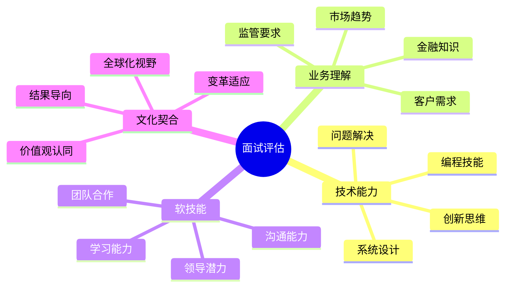

# 渣打银行 (Standard Chartered) 面试题库

## 🏦 公司简介

渣打银行是一家总部位于伦敦的跨国银行集团，专注于亚洲、非洲和中东市场。渣打银行以数字化转型和创新金融服务著称，在技术人才招聘方面注重候选人的创新思维和全球化视野。

## 📍 面试特点

### 面试流程
1. **在线申请** - 简历初筛
2. **线上笔试** - 技术基础测试
3. **电话/视频面试** - 技术 + HR面试
4. **现场面试** - 技术深度面试
5. **高管面试** - 文化契合度评估

### 核心价值观
- **敢于突破** (Here for good)
- **永不放弃** (Never settle)
- **善用优势** (Better together)

## 📚 面试题分类

### 技术面试题
- [Java开发岗位](./java-developer.md)
- [Python开发岗位](./python-developer.md)
- [React前端开发](./react-developer.md)
- [云计算架构](./cloud-architecture.md)
- [API设计](./api-design.md)
- [DevOps实践](./devops-questions.md)

### 数据科学相关
- [机器学习应用](./machine-learning.md)
- [数据分析题](./data-analysis.md)
- [算法实现](./algorithms.md)
- [统计学概念](./statistics.md)

### 行为面试题
- [行为面试题库](./behavioral-interview.md) ✅
- [创新思维](./innovation-mindset.md)
- [跨文化沟通](./cross-cultural.md)
- [客户导向](./customer-focus.md)
- [变革管理](./change-management.md)

### 金融科技题
- [区块链应用](./blockchain.md)
- [数字支付](./digital-payments.md)
- [风险建模](./risk-modeling.md)
- [监管科技](./regtech.md)

## 💡 面试准备重点

### 技术能力要求
1. **编程基础**：Python/Java 熟练掌握
2. **云技术**：AWS/Azure 云服务经验
3. **数据技能**：SQL, 数据分析, 机器学习
4. **前端技术**：React/Angular, 现代前端开发
5. **DevOps**：CI/CD, 容器技术, 监控

### 业务理解
- **数字银行**：了解数字化转型趋势
- **监管环境**：熟悉金融监管要求
- **客户体验**：理解用户体验设计原则
- **金融创新**：关注金融科技发展

## 🎯 面试评估维度



## 🌟 面试成功策略

### 技术面试准备
1. **实际项目经验**：准备详细的项目案例
2. **代码质量**：展示清晰、可维护的代码
3. **系统思维**：体现对整体架构的理解
4. **创新应用**：展示新技术在金融领域的应用

### 行为面试准备
1. **STAR方法**：结构化回答行为问题
2. **国际化经验**：突出跨文化合作经历
3. **变革领导**：展示推动变革的能力
4. **客户导向**：强调以客户为中心的思维

### 常见面试场景

#### 技术深度面试
**时长**：60-90分钟
**内容**：
- 算法和数据结构（30分钟）
- 系统设计（30分钟）
- 项目经验深入讨论（30分钟）

#### 业务案例面试
**时长**：45-60分钟
**内容**：
- 金融业务场景分析
- 技术解决方案设计
- 风险识别和控制

## 📊 技术栈重点

### 后端开发
```python
# Python 微服务示例
from fastapi import FastAPI, HTTPException
from pydantic import BaseModel
import logging

app = FastAPI(title="SC Banking API")

class TransactionRequest(BaseModel):
    from_account: str
    to_account: str
    amount: float
    currency: str

@app.post("/api/v1/transfer")
async def create_transfer(request: TransactionRequest):
    # 风险检查
    if not validate_transaction(request):
        raise HTTPException(status_code=400, detail="Transaction validation failed")
    
    # 执行转账
    result = await process_transaction(request)
    
    # 审计日志
    logging.info(f"Transfer completed: {request.dict()}")
    
    return {"transaction_id": result.id, "status": "completed"}
```

### 前端开发
```jsx
// React 组件示例
import React, { useState, useEffect } from 'react';
import { useTranslation } from 'react-i18next';

const AccountDashboard = () => {
    const { t } = useTranslation();
    const [accounts, setAccounts] = useState([]);
    
    useEffect(() => {
        fetchAccounts();
    }, []);
    
    const fetchAccounts = async () => {
        try {
            const response = await fetch('/api/v1/accounts');
            const data = await response.json();
            setAccounts(data);
        } catch (error) {
            console.error('Failed to fetch accounts:', error);
        }
    };
    
    return (
        <div className="dashboard">
            <h1>{t('account.dashboard.title')}</h1>
            {accounts.map(account => (
                <AccountCard key={account.id} account={account} />
            ))}
        </div>
    );
};
```

## 🔍 常见面试题示例

### 算法题
**问题**：实现一个银行账户交易验证系统，检测异常交易模式。

**考察点**：
- 数据结构选择
- 算法效率
- 异常检测逻辑

### 系统设计题
**问题**：设计一个支持全球多时区的移动银行系统。

**考察点**：
- 分布式系统设计
- 数据一致性
- 国际化支持
- 安全性设计

### 数据科学题
**问题**：如何使用机器学习检测信用卡欺诈？

**考察点**：
- 特征工程
- 模型选择
- 不平衡数据处理
- 模型解释性

## 🌐 全球化考虑

### 多语言支持
- 前端国际化实现
- 数据本地化处理
- 时区转换逻辑

### 跨区域合规
- 不同地区监管要求
- 数据隐私保护
- 反洗钱合规

### 文化适应
- 用户界面设计差异
- 支付习惯不同
- 节假日处理

## 🚀 职业发展路径

### 技术专家路线
- Senior Developer → Tech Lead → Principal Engineer
- 专注技术深度和创新

### 管理路线
- Team Lead → Engineering Manager → Director
- 关注团队建设和业务价值

### 产品路线
- Product Owner → Product Manager → Head of Product
- 结合技术和商业视角

## 🔗 学习资源

### 官方资源
- [渣打银行技术博客](https://www.sc.com/en/banking/technology/)
- [开发者文档](https://developer.sc.com/)
- [职业发展指南](https://www.sc.com/careers/)

### 技术学习
- [AWS 认证培训](https://aws.amazon.com/training/)
- [Python 金融编程](https://www.python.org/about/apps/#business-and-finance)
- [React 官方文档](https://reactjs.org/docs/)

---
[← 返回公司目录](../README.md) | [← 返回主目录](../../../README.md) 