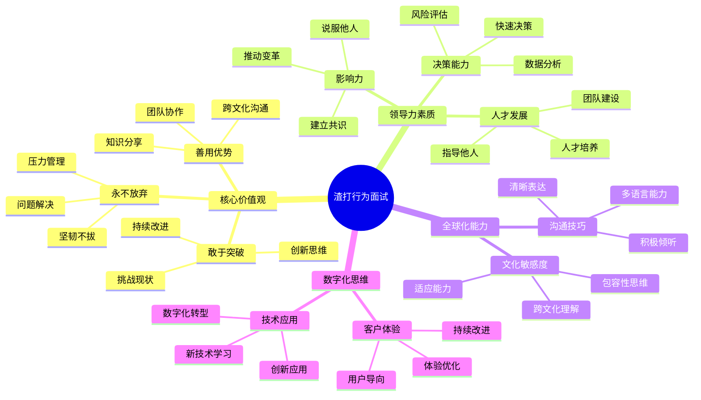

# 渣打银行行为面试题

## 难度级别
- 中级 / 高级

## 标签
- 行为面试, STAR方法, 领导力, 团队合作, 创新思维, 全球化视野

## 🎯 渣打银行核心价值观

### Here for good - 成就美好
渣打银行致力于推动商业繁荣，创造就业机会，促进经济增长，为社区发展贡献力量。

### 核心行为准则
1. **敢于突破** (Never Settle) - 持续创新，追求卓越
2. **永不放弃** (Never Give Up) - 坚韧不拔，迎接挑战  
3. **善用优势** (Better Together) - 团队协作，发挥集体智慧

## 📊 行为面试评估框架

## 🌟 经典行为面试题目

### 1. 敢于突破 (Never Settle) 相关题目

#### 题目1：技术创新突破
**问题**："请描述一次你主动提出技术创新方案，并成功实施的经历。"

**STAR案例示例**：

**Situation (情境)**：
在我担任高级Java开发工程师期间，我们的交易系统在高峰期经常出现延迟问题。传统的数据库查询方式已经无法满足毫秒级响应的业务需求，客户投诉增加，业务部门压力很大。

**Task (任务)**：
我的任务是找到一个创新的解决方案，将交易查询响应时间从平均200ms降低到50ms以下，同时确保系统稳定性和数据一致性。

**Action (行动)**：
1. **深入分析**：我花了一周时间分析系统瓶颈，发现主要问题在于复杂的多表关联查询
2. **技术调研**：研究了Redis Cluster、Hazelcast、Apache Ignite等内存数据网格技术
3. **创新方案**：提出了"分层缓存+事件驱动更新"的架构：
   - L1缓存：本地Caffeine缓存热点数据
   - L2缓存：Redis集群缓存常用查询结果
   - L3缓存：数据库查询结果缓存
4. **原型验证**：用2周时间开发了POC，证明可以将响应时间降低到30ms
5. **团队说服**：制作了详细的技术方案和ROI分析，说服了架构委员会
6. **分阶段实施**：
   - 第一阶段：实施本地缓存，降低50%延迟
   - 第二阶段：引入Redis集群，实现分布式缓存
   - 第三阶段：优化缓存策略，实现智能预加载

**Result (结果)**：
- 交易查询响应时间从200ms降低到25ms，超额完成目标
- 系统吞吐量提升300%，支持了业务快速增长
- 客户满意度从75%提升到95%
- 该方案被推广到其他业务系统，节省了公司200万美元的硬件投资
- 我因此获得了年度技术创新奖，并被提升为技术专家

**面试官可能的追问**：
- Q: 为什么选择这个技术方案而不是其他方案？
- A: 我对比了多种方案的成本、复杂度、维护性。这个方案在保证性能的同时，技术风险可控，团队学习成本较低。

- Q: 实施过程中遇到了什么挑战？
- A: 最大的挑战是缓存一致性问题。我们设计了基于事件驱动的缓存失效机制，确保数据一致性。

#### 题目2：流程改进创新
**问题**："描述一次你发现现有流程存在问题，并主动改进的经历。"

**STAR案例示例**：

**Situation (情境)**：
在我们的敏捷开发团队中，代码review流程效率很低。每个PR平均需要3-5天才能完成review，严重影响了交付速度。开发人员经常抱怨review反馈不及时，而reviewer也抱怨review任务太多。

**Task (任务)**：
作为团队的技术负责人，我需要优化代码review流程，将review周期缩短到1天以内，同时保证代码质量不下降。

**Action (行动)**：
1. **问题分析**：通过数据分析发现主要问题：
   - Review分配不均衡，某些专家被过度依赖
   - 缺乏review优先级机制
   - Review标准不统一，经常出现反复修改
2. **创新解决方案**：
   - 引入"Review轮换制"：每个开发者都要承担review任务
   - 建立"Review优先级系统"：紧急修复 > 新功能 > 重构
   - 制定"代码review检查清单"：统一review标准
   - 实施"结对review"：复杂代码由两人共同review
3. **工具优化**：
   - 配置GitLab自动分配reviewer
   - 集成SonarQube自动代码质量检查
   - 建立review时间监控dashboard
4. **团队培训**：组织了3次代码review最佳实践培训

**Result (结果)**：
- Review平均时间从4.2天缩短到0.8天
- 代码质量指标（bug密度）提升了40%
- 团队成员的review技能普遍提升
- 开发效率提升25%，按时交付率从70%提升到95%
- 该流程被其他团队采用，成为公司标准实践

### 2. 永不放弃 (Never Give Up) 相关题目

#### 题目3：压力下的坚持
**问题**："描述一次在巨大压力下，你如何坚持完成一个看似不可能的任务。"

**STAR案例示例**：

**Situation (情境)**：
我们正在为一个重要客户开发新的支付系统，距离上线只有2周时间。突然发现系统在高并发测试中出现严重的数据不一致问题，可能导致资金损失。客户威胁如果不能按时上线就取消合同，这个项目价值500万美元。

**Task (任务)**：
我被指派为技术负责人，需要在2周内解决数据一致性问题，确保系统能够安全上线，同时不能影响其他功能的开发进度。

**Action (行动)**：
1. **快速诊断**：
   - 组织了48小时的问题诊断马拉松
   - 发现问题根源：分布式事务在网络分区时的处理逻辑有缺陷
2. **制定作战计划**：
   - 将团队分为3组：问题修复组、测试验证组、风险控制组
   - 建立每日3次的进度同步会议
   - 设立24小时轮班制，确保持续推进
3. **技术攻坚**：
   - 重新设计了基于Saga模式的分布式事务处理
   - 引入了补偿机制和幂等性保证
   - 实施了全链路的事务状态监控
4. **风险管控**：
   - 建立了灰度发布机制
   - 准备了快速回滚方案
   - 设计了实时监控和告警系统
5. **团队激励**：
   - 每天为加班团队提供餐食和交通补贴
   - 及时庆祝每个小的里程碑
   - 与团队成员一对一沟通，了解困难并提供支持

**Result (结果)**：
- 在最后期限前3天成功解决了所有技术问题
- 系统顺利上线，运行稳定，零资金损失事故
- 客户非常满意，追加了300万美元的后续项目
- 团队凝聚力大大增强，没有一个人在项目期间离职
- 我获得了公司年度最佳项目经理奖
- 建立的分布式事务处理框架被公司其他项目复用

#### 题目4：失败后的重新开始
**问题**："讲述一次你的项目失败了，但你从中学习并最终成功的经历。"

**STAR案例示例**：

**Situation (情境)**：
我负责开发一个AI驱动的风险评估系统，投入了6个月时间和100万美元预算。但在最终测试中发现，模型的准确率只有60%，远低于业务要求的85%，项目被迫暂停。

**Task (任务)**：
我需要分析失败原因，重新设计方案，并在有限的追加预算下（50万美元）重新启动项目，在3个月内达到业务要求。

**Action (行动)**：
1. **深度复盘**：
   - 组织了为期一周的项目复盘会议
   - 发现主要问题：训练数据质量差、特征工程不充分、模型选择不当
2. **重新规划**：
   - 与业务专家深度合作，重新定义问题域
   - 引入外部数据源，丰富训练数据
   - 采用集成学习方法，提升模型稳定性
3. **敏捷执行**：
   - 采用MVP方法，先实现核心功能
   - 建立每周模型性能评估机制
   - 与业务团队建立快速反馈循环
4. **团队重建**：
   - 坦诚地与团队分享失败教训
   - 重新分配角色，发挥每个人的优势
   - 引入外部机器学习专家作为顾问
5. **风险控制**：
   - 建立多个备选方案
   - 设置关键里程碑检查点
   - 与业务方保持透明沟通

**Result (结果)**：
- 新模型准确率达到92%，超过业务要求
- 项目在2.5个月内成功交付，节省了预算
- 系统上线后为公司节省了每年300万美元的风险损失
- 团队成员都获得了宝贵的机器学习项目经验
- 我被提升为AI技术负责人，负责公司的AI战略
- 建立的机器学习开发流程成为公司标准

### 3. 善用优势 (Better Together) 相关题目

#### 题目5：跨文化团队协作
**问题**："描述一次你在多元文化团队中工作，如何克服文化差异实现目标的经历。"

**STAR案例示例**：

**Situation (情境)**：
我被派到新加坡参与一个全球支付平台项目，团队成员来自8个不同国家：中国、印度、新加坡、英国、美国、德国、日本和澳大利亚。由于文化差异和时区问题，项目初期沟通效率很低，进度严重滞后。

**Task (任务)**：
作为技术架构师，我需要协调这个24人的多元化团队，确保项目在6个月内按时交付，同时建立有效的跨文化协作机制。

**Action (行动)**：
1. **文化理解**：
   - 花时间了解每个国家的工作文化和沟通习惯
   - 发现问题：德国同事喜欢详细计划，印度同事倾向于口头确认，日本同事不愿意直接表达异议
2. **沟通机制优化**：
   - 建立"三时区轮转会议"：确保每个时区的人都能参加核心会议
   - 引入"文化大使"制度：每个国家指定一名文化大使协助沟通
   - 制定"多语言文档标准"：重要文档提供英文和本地语言版本
3. **协作工具创新**：
   - 使用Slack建立不同主题的频道，支持异步沟通
   - 引入Miro进行可视化协作，减少语言障碍
   - 建立共享的知识库，记录所有决策和讨论
4. **团队建设**：
   - 组织"文化分享周"：每个国家介绍自己的工作文化
   - 建立"虚拟咖啡时间"：非正式的跨文化交流
   - 创建"成功庆祝仪式"：结合各国文化特色庆祝里程碑
5. **冲突解决**：
   - 建立"文化调解机制"：当出现文化冲突时，由文化大使协助解决
   - 推行"积极倾听"原则：确保每个人的观点都被听到和理解

**Result (结果)**：
- 项目按时交付，质量超过预期
- 团队效率提升了40%，沟通满意度从3.2分提升到4.6分（5分制）
- 建立的跨文化协作模式被公司采用为全球标准
- 团队成员的跨文化能力都得到显著提升
- 我被任命为公司全球协作最佳实践推广大使
- 该项目获得了公司年度最佳国际合作项目奖

#### 题目6：知识分享与团队发展
**问题**："描述一次你主动分享知识，帮助团队成员成长的经历。"

**STAR案例示例**：

**Situation (情境)**：
我们团队新招了5名应届毕业生，他们虽然基础知识扎实，但缺乏实际项目经验，特别是在微服务架构和云原生技术方面。团队的高级开发任务积压严重，而初级开发者无法独立承担复杂任务。

**Task (任务)**：
作为技术专家，我需要快速提升新人的技术能力，让他们能够在3个月内独立承担中等复杂度的开发任务，同时不影响现有项目的进度。

**Action (行动)**：
1. **能力评估**：
   - 为每个新人制定了技能评估测试
   - 识别了他们的强项和薄弱环节
   - 制定了个性化的学习计划
2. **知识分享体系**：
   - 建立"每周技术分享"：每周五下午分享一个技术主题
   - 创建"代码审查学院"：通过代码review进行实时指导
   - 设立"技术导师制"：每个新人配一个高级开发者作为导师
3. **实践项目设计**：
   - 设计了"微服务实战项目"：从简单的单体应用逐步拆分为微服务
   - 建立"沙盒环境"：让新人可以安全地进行实验和学习
   - 创建"错误案例库"：收集常见错误和解决方案
4. **学习资源整理**：
   - 整理了"技术学习路径图"：清晰的学习顺序和里程碑
   - 建立"内部技术博客"：记录最佳实践和经验教训
   - 创建"技术问答社区"：鼓励提问和知识分享
5. **激励机制**：
   - 设立"学习进步奖"：表彰学习积极性高的新人
   - 建立"技术分享积分制"：分享知识可以获得积分和奖励
   - 组织"技术挑战赛"：通过竞赛激发学习热情

**Result (结果)**：
- 5名新人在2.5个月内都能独立完成中等复杂度任务
- 团队整体开发效率提升了30%
- 新人的技术成长速度比其他团队快50%
- 建立的培训体系被推广到整个技术部门
- 我获得了公司年度最佳导师奖
- 3名新人在一年内被提升为中级开发者
- 团队的知识分享文化得到了显著改善

## 🎯 渣打银行特色行为面试题

### 数字化转型相关

#### 题目7：推动数字化创新
**问题**："渣打银行正在进行数字化转型，请描述你如何推动一个传统流程的数字化改造。"

**评估要点**：
- 数字化思维和创新能力
- 变革管理和推动能力
- 客户体验导向
- 技术应用的商业价值

### 全球化视野相关

#### 题目8：跨地区业务协调
**问题**："描述一次你需要协调不同地区的业务需求，如何平衡各方利益的经历。"

**评估要点**：
- 全球化思维
- 利益相关者管理
- 文化敏感度
- 协调沟通能力

### 可持续发展相关

#### 题目9：ESG项目参与
**问题**："渣打银行致力于可持续发展，请分享你参与过的任何与环境、社会责任相关的项目。"

**评估要点**：
- 社会责任意识
- 可持续发展理念
- 项目影响力
- 价值观契合度

## 💡 面试准备建议

### 1. 深入了解渣打银行
- **业务模式**：专注亚洲、非洲、中东市场的国际银行
- **数字化战略**：SC Ventures、数字银行、API开放平台
- **可持续发展**：2030年净零排放承诺、绿色金融
- **企业文化**：多元包容、创新驱动、客户至上

### 2. STAR方法应用技巧
- **具体化**：用具体的数字和事实支撑你的故事
- **结果导向**：强调你的行动带来的积极结果
- **学习反思**：展示你从经历中学到的东西
- **价值观契合**：将你的经历与渣打的价值观联系起来

### 3. 常见追问问题准备
- "如果重新来一次，你会怎么做？"
- "你从这个经历中学到了什么？"
- "这个经历如何影响了你后续的工作方式？"
- "你如何将这个经验应用到渣打银行的工作中？"

### 4. 文化适应性展示
- **国际化经验**：展示你的跨文化工作能力
- **创新思维**：分享你的创新项目和改进建议
- **团队协作**：强调你在多元化团队中的协作经验
- **持续学习**：展示你的学习能力和适应性

## 🔍 面试评分标准

### 优秀表现 (4-5分)
- 故事结构清晰，STAR方法运用熟练
- 展现出强烈的主人翁意识和领导力
- 体现了渣打银行的核心价值观
- 结果具有显著的商业影响力
- 展现出优秀的跨文化能力

### 良好表现 (3分)
- 故事基本完整，逻辑清晰
- 展现了一定的问题解决能力
- 与渣打价值观基本契合
- 有明确的结果和学习收获

### 需要改进 (1-2分)
- 故事不够具体或逻辑混乱
- 缺乏主动性和影响力
- 与渣打价值观契合度低
- 结果不明确或影响力有限

## 🌟 成功案例特征

### 技术创新类
- 主动发现问题并提出解决方案
- 运用新技术解决业务挑战
- 关注用户体验和商业价值
- 具有可推广性和持续影响

### 团队协作类
- 展现跨文化沟通能力
- 体现包容性和多元化思维
- 通过协作实现共同目标
- 促进团队成长和发展

### 领导力类
- 在困难情况下展现坚韧不拔
- 能够影响和激励他人
- 做出艰难决策并承担责任
- 推动组织变革和改进

---
[← 返回渣打银行面试题目录](./README.md) 