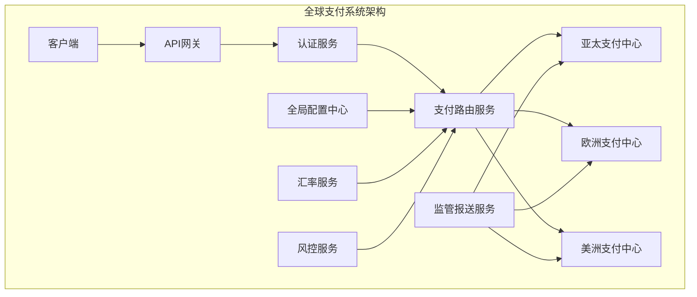

# 渣打银行 Java 开发岗位面试题

## 难度级别
- 初级 / 中级 / 高级

## 标签
- Java, Spring Boot, 微服务, 云原生, 分布式系统, 金融科技

## 基础技术题

### 1. Java 核心概念
**题目**：解释Java中的垃圾回收机制，特别是在高并发金融交易系统中如何优化GC性能？

**考察点**：
- GC算法理解（G1、CMS、ZGC等）
- 内存管理和调优
- 高频交易场景的性能优化

**参考答案要点**：
```java
// GC调优示例配置
public class GCOptimizationExample {
    /*
     * 高频交易系统GC优化建议：
     * 
     * JVM参数配置:
     * -XX:+UseG1GC                    # 使用G1垃圾回收器
     * -XX:MaxGCPauseMillis=10         # 最大暂停时间10ms
     * -XX:G1HeapRegionSize=16m        # 设置G1区域大小
     * -XX:+UnlockExperimentalVMOptions
     * -XX:+UseZGC                     # 或者使用ZGC实现超低延迟
     */
    
    // 1. 对象池模式减少GC压力
    private static final Queue<TradeOrder> ORDER_POOL = new ConcurrentLinkedQueue<>();
    
    public static TradeOrder borrowOrder() {
        TradeOrder order = ORDER_POOL.poll();
        return order != null ? order : new TradeOrder();
    }
    
    public static void returnOrder(TradeOrder order) {
        order.reset();
        ORDER_POOL.offer(order);
    }
    
    // 2. 使用原始类型集合避免装箱
    private final TIntDoubleHashMap priceCache = new TIntDoubleHashMap();
    
    // 3. 预分配集合大小
    private final List<Trade> trades = new ArrayList<>(10000);
}
```

### 2. 分布式系统设计
**题目**：设计一个分布式的外汇交易订单匹配系统，支持多币种、高并发，并保证数据一致性。

**要求**：
- 处理每秒10万+订单
- 支持50+货币对
- 保证订单匹配的公平性
- 系统高可用性设计

**设计方案**：
```java
@Configuration
@EnableEurekaClient
@EnableCircuitBreaker
public class FXTradingSystemConfig {
    
    @Component
    public class OrderRoutingStrategy {
        
        public String getPartition(String currencyPair) {
            int hash = currencyPair.hashCode();
            int index = Math.abs(hash) % 5;
            return "trading-engine-" + index;
        }
        
        @EventListener
        public void handleOrderEvent(OrderEvent event) {
            String partition = getPartition(event.getCurrencyPair());
            kafkaTemplate.send(partition, event);
        }
    }
    
    @Service
    public class DistributedOrderService {
        
        @Transactional
        @DistributedLock(key = "'order:' + #order.currencyPair")
        public OrderResult processOrder(TradeOrder order) {
            // 预检查账户余额
            if (!checkAccountBalance(order)) {
                return OrderResult.insufficientFunds();
            }
            
            // 发送到匹配引擎
            MatchResult matchResult = sendToMatchingEngine(order);
            
            // 更新账户状态
            updateAccountBalance(order, matchResult);
            
            // 发送确认消息
            publishTradeConfirmation(matchResult);
            
            return OrderResult.success(matchResult);
        }
    }
}
```

### 3. 微服务架构实现
**题目**：实现一个基于Spring Cloud的银行账户管理微服务，包括服务发现、配置管理、熔断保护等。

**实现方案**：
```java
@SpringBootApplication
@EnableEurekaClient
@EnableCircuitBreaker
@EnableJpaRepositories
public class AccountServiceApplication {
    
    public static void main(String[] args) {
        SpringApplication.run(AccountServiceApplication.class, args);
    }
    
    @Bean
    @LoadBalanced
    public RestTemplate restTemplate() {
        return new RestTemplate();
    }
}

@RestController
@RequestMapping("/api/v1/accounts")
@Validated
@Slf4j
public class AccountController {
    
    @PostMapping("/{accountId}/transfer")
    @HystrixCommand(
        fallbackMethod = "transferFallback",
        commandProperties = {
            @HystrixProperty(name = "execution.isolation.thread.timeoutInMilliseconds", value = "5000")
        }
    )
    public ResponseEntity<TransferResult> transfer(
            @PathVariable String accountId,
            @Valid @RequestBody TransferRequest request) {
        
        TransferResult result = accountService.transfer(accountId, request);
        return ResponseEntity.ok(result);
    }
    
    public ResponseEntity<TransferResult> transferFallback(
            String accountId, TransferRequest request, Throwable ex) {
        
        TransferResult fallbackResult = TransferResult.builder()
            .status(TransferStatus.PENDING)
            .message("Transfer is being processed, please check later")
            .build();
            
        return ResponseEntity.accepted().body(fallbackResult);
    }
}
```

## 系统设计题

### 4. 全球实时支付系统
**题目**：设计一个支持全球实时支付的系统，需要处理不同时区、多种货币、各国监管要求。

**设计要点**：


### 5. 多租户架构设计
**题目**：设计一个支持多租户的银行核心系统，不同银行客户使用同一套系统但数据完全隔离。

**解决方案**：
```java
@Configuration
public class MultiTenantConfiguration {
    
    @Bean
    @Primary
    public DataSource dataSource() {
        return new TenantRoutingDataSource();
    }
}

public class TenantRoutingDataSource extends AbstractRoutingDataSource {
    
    @Override
    protected Object determineCurrentLookupKey() {
        return TenantContext.getCurrentTenant();
    }
    
    @PostConstruct
    public void init() {
        Map<Object, Object> dataSources = new HashMap<>();
        
        for (TenantConfig config : tenantConfigService.getAllTenants()) {
            HikariDataSource dataSource = createDataSource(config);
            dataSources.put(config.getTenantId(), dataSource);
        }
        
        setTargetDataSources(dataSources);
    }
}

public class TenantContext {
    private static final ThreadLocal<String> TENANT_ID = new ThreadLocal<>();
    
    public static void setCurrentTenant(String tenantId) {
        TENANT_ID.set(tenantId);
    }
    
    public static String getCurrentTenant() {
        return TENANT_ID.get();
    }
    
    public static void clear() {
        TENANT_ID.remove();
    }
}
```

## 面试评估要点

### 技术能力评估
1. **Java基础掌握度**：
   - JVM理解和调优经验
   - 并发编程和锁机制
   - 垃圾回收器选择和优化

2. **Spring生态系统**：
   - Spring Boot微服务开发
   - Spring Cloud组件使用
   - Spring Security安全配置

3. **分布式系统设计**：
   - 服务拆分和治理
   - 数据一致性保证
   - 分布式事务处理

### 渣打银行特色考察

#### 创新思维
- 如何运用新技术解决传统金融问题
- 对金融科技趋势的理解和应用
- 系统架构的前瞻性设计

#### 全球化视野
- 多时区系统设计经验
- 跨地区数据同步方案
- 国际化和本地化实现

#### 数字化转型理解
- 云原生架构设计
- DevOps实践经验
- 微服务治理能力

## 常见追问问题

### 性能相关
1. **问**：如何处理每秒10万笔交易？
   **答**：分片策略 + 异步处理 + 内存计算 + 批处理优化

2. **问**：数据库成为瓶颈怎么办？
   **答**：读写分离 + 分库分表 + 缓存策略 + CQRS模式

### 稳定性相关
1. **问**：如何保证系统高可用？
   **答**：冗余设计 + 熔断机制 + 限流策略 + 自动故障转移

2. **问**：分布式事务如何处理？
   **答**：Saga模式 + 事件溯源 + 最终一致性 + 补偿机制

### 安全性相关
1. **问**：如何保证数据安全？
   **答**：加密传输 + 敏感数据脱敏 + 访问控制 + 审计日志

2. **问**：如何防止SQL注入？
   **答**：参数化查询 + 输入验证 + ORM框架 + 代码扫描

---
[← 返回渣打面试题目录](./README.md) 