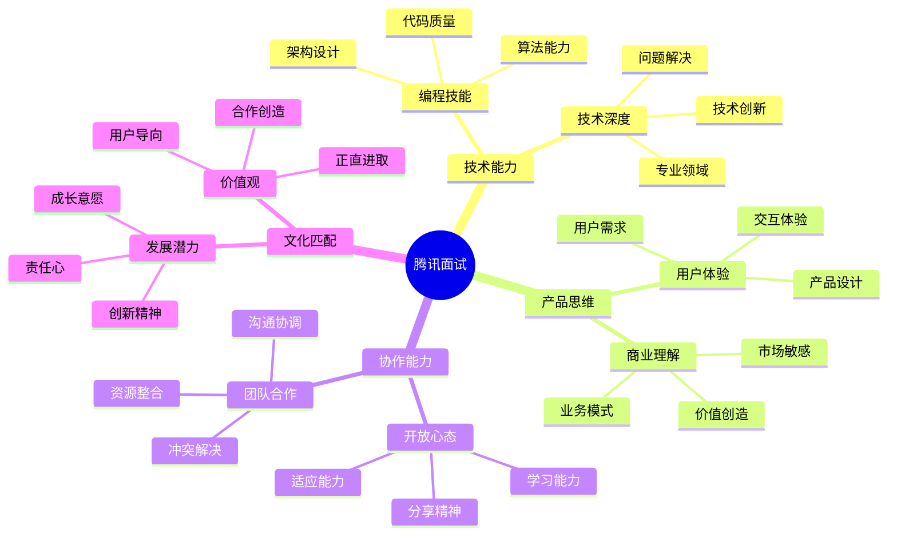

# 腾讯 (Tencent) 面试题库

## 🏢 公司简介

腾讯是中国领先的互联网公司，以社交网络、游戏、数字内容和金融科技服务闻名。旗下拥有微信、QQ、王者荣耀、腾讯云等知名产品。腾讯注重技术创新、用户体验和开放合作的企业文化。

## 📍 面试特点

### 面试流程
1. **简历筛选** - HR和技术初筛
2. **笔试** - 编程能力和基础知识测试
3. **技术面试** - 2-3轮技术面试
4. **综合面试** - 项目经验和综合能力
5. **HR面试** - 文化匹配和薪资谈判

### 核心价值观
- **正直** - 诚实守信，光明磊落
- **进取** - 勇于创新，追求卓越
- **合作** - 开放协作，共创共赢
- **创造** - 用户导向，持续创新

## 📚 面试题分类

### 核心技术面试题
- [后端开发](./backend-development.md)
- [前端开发](./frontend-development.md)
- [移动开发](./mobile-development.md)
- [系统架构](./system-architecture.md)
- [算法数据结构](./algorithms.md)

### 游戏技术相关
- [游戏服务器](./game-server.md)
- [游戏引擎](./game-engine.md)
- [实时通信](./realtime-communication.md)
- [性能优化](./performance-optimization.md)

### 社交产品相关
- [即时通讯](./instant-messaging.md)
- [社交网络](./social-network.md)
- [内容推荐](./content-recommendation.md)
- [用户画像](./user-profiling.md)

### 云计算和大数据
- [腾讯云服务](./tencent-cloud.md)
- [大数据处理](./big-data.md)
- [机器学习](./machine-learning.md)
- [音视频技术](./audio-video.md)

### 行为面试题
- [团队协作](./teamwork.md)
- [用户思维](./user-centric.md)
- [创新能力](./innovation.md)
- [学习成长](./learning-growth.md)

## 💡 面试准备重点

### 技术能力要求
1. **编程基础**：熟练掌握主流编程语言
2. **系统设计**：大规模高并发系统设计
3. **产品思维**：理解用户需求和产品逻辑
4. **技术深度**：在某个技术领域有深入理解
5. **创新意识**：关注新技术和行业趋势

### 腾讯特色技术
- **社交技术**：即时通讯、社交网络架构
- **游戏技术**：游戏服务器、实时同步技术
- **音视频**：WebRTC、直播技术、编解码
- **AI技术**：推荐算法、自然语言处理

## 🎯 面试评估维度

## 🔗 相关资源

- [腾讯招聘官网](https://careers.tencent.com/)
- [腾讯技术博客](https://cloud.tencent.com/developer)
- [腾讯开源项目](https://github.com/Tencent)
- [腾讯学院](https://academy.tencent.com/)

---
[← 返回公司目录](../README.md) | [← 返回主目录](../../../README.md) 