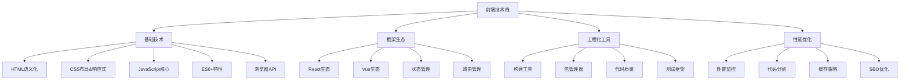
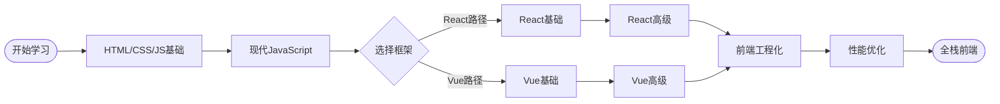

# 前端面试题库

## 📚 概述

前端面试题库涵盖了现代前端开发的核心技术栈，从基础的HTML/CSS/JavaScript到流行的框架React和Vue，以及前端工程化和性能优化等高级话题。

## 🎯 核心知识点体系

### 📊 前端技术栈关联图

### 🗂️ 学习路径图

## 📁 题库分类

### 🔰 基础技术
- [HTML语义化与可访问性](./html-semantics.md)
- [CSS布局与响应式设计](./css-layout.md) 
- [JavaScript核心概念](./javascript-core.md)
- [ES6+现代特性](./javascript-es6.md)
- [浏览器原理与Web API](./browser-apis.md)

### ⚛️ React生态
- [React基础概念](./react-basics.md)
- [React Hooks详解](./react-hooks.md)
- [React状态管理](./react-state-management.md)
- [React性能优化](./react-performance.md)

### 🟢 Vue生态  
- [Vue基础概念](./vue-basics.md)
- [Vue组合式API](./vue-composition-api.md)
- [Vue状态管理](./vue-state-management.md)
- [Vue性能优化](./vue-performance.md)

### 🛠️ 工程化与工具
- [构建工具与模块化](./build-tools.md)
- [代码质量与测试](./code-quality.md)
- [版本控制与协作](./version-control.md)

### 🚀 性能优化
- [性能监控与分析](./performance-monitoring.md)
- [代码分割与懒加载](./code-splitting.md)
- [缓存策略与CDN](./caching-strategies.md)
- [SEO与渲染优化](./seo-optimization.md)

### 🏢 企业级应用
- [微前端架构](./micro-frontends.md)
- [TypeScript实践](./typescript-practices.md)
- [安全防护](./security-practices.md)
- [国际化处理](./internationalization.md)

## 📈 难度分级

- 🟢 **初级（1-2年经验）**: 基础语法、常用API、简单交互
- 🟡 **中级（2-4年经验）**: 框架原理、状态管理、性能优化
- 🔴 **高级（4+年经验）**: 架构设计、复杂场景、团队协作

## 💡 面试技巧

### 答题思路
1. **先整体再细节**: 先说整体思路，再深入具体实现
2. **理论结合实践**: 结合实际项目经验阐述
3. **对比分析**: 比较不同方案的优缺点
4. **性能考虑**: 提及性能影响和优化方案

### 常见误区
- ❌ 只背概念，不理解原理
- ❌ 不结合实际场景
- ❌ 忽视浏览器兼容性
- ❌ 不考虑用户体验

## 🔗 相关链接

- [← 返回主目录](../../README.md)
- [后端面试题库](../backend/README.md)
- [算法面试题库](../algorithms/README.md)
- [系统设计题库](../system-design/README.md)

---

*持续更新中，欢迎贡献优质面试题！* 