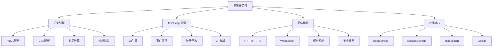
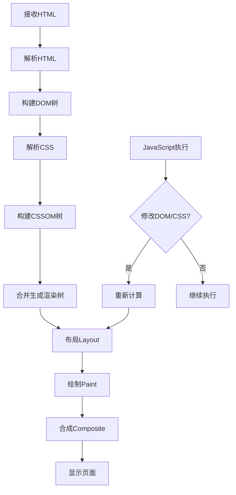

# 浏览器原理与Web API面试题

## 🎯 核心知识点

- 浏览器渲染原理
- DOM操作与事件机制
- Web API应用
- 存储机制
- 网络请求
- 性能监控API

## 📊 浏览器架构图



## 💡 面试题目

### 🟢 初级题目

#### 1. **[初级]** 浏览器渲染流程和关键路径

**标签**: 渲染流程, 关键渲染路径, 重排重绘

**题目描述**:
请详细说明浏览器从接收HTML到页面渲染完成的整个流程。

**核心答案**:

**浏览器渲染流程**:



**详细步骤解析**:

```javascript
// 1. HTML解析和DOM构建
// 浏览器接收HTML字节流，转换为字符，然后解析为tokens
const htmlParsingProcess = {
    bytes: 'HTML字节流',
    characters: '字符转换',
    tokens: 'HTML标记',
    nodes: 'DOM节点',
    dom: 'DOM树'
};

// 2. CSS解析和CSSOM构建
const cssParsingProcess = {
    cssBytes: 'CSS字节流',
    tokens: 'CSS标记',
    nodes: 'CSS节点',
    cssom: 'CSSOM树'
};

// 3. 渲染树构建
function buildRenderTree(domTree, cssomTree) {
    const renderTree = [];
    
    // 遍历DOM树的每个节点
    domTree.forEach(node => {
        // 跳过不可见元素
        if (node.style.display === 'none') return;
        if (node.tagName === 'script' || node.tagName === 'meta') return;
        
        // 计算节点的最终样式
        const computedStyle = computeStyle(node, cssomTree);
        
        renderTree.push({
            node,
            style: computedStyle
        });
    });
    
    return renderTree;
}

// 4. 布局计算（Layout/Reflow）
function calculateLayout(renderTree, viewport) {
    renderTree.forEach(renderObject => {
        // 计算元素的几何信息
        const geometry = {
            x: 0,
            y: 0,
            width: 0,
            height: 0
        };
        
        // 根据CSS规则计算位置和尺寸
        geometry.width = calculateWidth(renderObject.style, viewport.width);
        geometry.height = calculateHeight(renderObject.style);
        geometry.x = calculateX(renderObject.style);
        geometry.y = calculateY(renderObject.style);
        
        renderObject.geometry = geometry;
    });
}

// 5. 绘制（Paint）
function paintElements(renderTree) {
    const paintInstructions = [];
    
    renderTree.forEach(renderObject => {
        // 生成绘制指令
        paintInstructions.push({
            type: 'fillRect',
            x: renderObject.geometry.x,
            y: renderObject.geometry.y,
            width: renderObject.geometry.width,
            height: renderObject.geometry.height,
            color: renderObject.style.backgroundColor
        });
        
        if (renderObject.style.color) {
            paintInstructions.push({
                type: 'fillText',
                text: renderObject.node.textContent,
                x: renderObject.geometry.x,
                y: renderObject.geometry.y,
                color: renderObject.style.color
            });
        }
    });
    
    return paintInstructions;
}
```

**重排和重绘**:

```javascript
// 触发重排（Reflow）的操作
const reflowTriggers = [
    'width', 'height', 'padding', 'margin', 'border',
    'position', 'top', 'left', 'right', 'bottom',
    'font-size', 'line-height', 'text-align',
    'display', 'float', 'clear'
];

// 触发重绘（Repaint）的操作
const repaintTriggers = [
    'color', 'background-color', 'background-image',
    'border-color', 'border-style', 'border-radius',
    'box-shadow', 'outline', 'visibility'
];

// 优化示例：批量DOM操作
function optimizedDOMUpdate() {
    const container = document.getElementById('container');
    
    // ❌ 错误：每次操作都触发重排
    for (let i = 0; i < 1000; i++) {
        const div = document.createElement('div');
        div.textContent = `Item ${i}`;
        container.appendChild(div); // 每次都重排
    }
    
    // ✅ 正确：使用DocumentFragment批量操作
    const fragment = document.createDocumentFragment();
    for (let i = 0; i < 1000; i++) {
        const div = document.createElement('div');
        div.textContent = `Item ${i}`;
        fragment.appendChild(div);
    }
    container.appendChild(fragment); // 只重排一次
}

// 使用CSS Transform避免重排
function animateWithTransform() {
    const element = document.querySelector('.animate');
    
    // ❌ 触发重排
    element.style.left = '100px';
    element.style.top = '100px';
    
    // ✅ 只触发合成
    element.style.transform = 'translate(100px, 100px)';
}

// 读写分离避免强制同步布局
function avoidForcedSyncLayout() {
    const elements = document.querySelectorAll('.item');
    
    // ❌ 读写混合，触发强制同步布局
    elements.forEach(el => {
        el.style.left = el.offsetLeft + 10 + 'px';
    });
    
    // ✅ 读写分离
    const positions = [];
    elements.forEach(el => {
        positions.push(el.offsetLeft); // 批量读取
    });
    
    elements.forEach((el, index) => {
        el.style.left = positions[index] + 10 + 'px'; // 批量写入
    });
}
```

---

#### 2. **[初级]** DOM操作和事件机制

**标签**: DOM API, 事件冒泡, 事件委托

**题目描述**:
请详细说明DOM操作的常用方法，以及事件机制的工作原理。

**核心答案**:

**DOM操作API**:

```javascript
// 1. 元素选择
const elementSelectors = {
    // 基础选择器
    getElementById: document.getElementById('myId'),
    getElementsByClassName: document.getElementsByClassName('myClass'),
    getElementsByTagName: document.getElementsByTagName('div'),
    
    // 现代选择器
    querySelector: document.querySelector('.class #id'),
    querySelectorAll: document.querySelectorAll('div.item'),
    
    // 关系选择
    parentElement: element.parentElement,
    children: element.children,
    firstElementChild: element.firstElementChild,
    lastElementChild: element.lastElementChild,
    nextElementSibling: element.nextElementSibling,
    previousElementSibling: element.previousElementSibling
};

// 2. 元素创建和修改
function domManipulation() {
    // 创建元素
    const div = document.createElement('div');
    const textNode = document.createTextNode('Hello World');
    const fragment = document.createDocumentFragment();
    
    // 设置属性
    div.id = 'myDiv';
    div.className = 'container';
    div.setAttribute('data-value', '123');
    div.dataset.userId = '456'; // data-user-id
    
    // 设置内容
    div.textContent = 'Pure text';
    div.innerHTML = '<span>HTML content</span>';
    div.innerText = 'Visible text only';
    
    // 样式操作
    div.style.color = 'red';
    div.style.backgroundColor = 'blue';
    div.style.cssText = 'color: red; background: blue;';
    
    // 类名操作
    div.classList.add('active');
    div.classList.remove('inactive');
    div.classList.toggle('visible');
    div.classList.contains('active'); // true
    
    // 插入元素
    const parent = document.getElementById('parent');
    parent.appendChild(div);
    parent.insertBefore(div, parent.firstChild);
    parent.insertAdjacentElement('beforebegin', div);
    parent.insertAdjacentHTML('afterend', '<p>New paragraph</p>');
    
    // 删除元素
    parent.removeChild(div);
    div.remove(); // 现代方法
    
    return div;
}

// 3. 高级DOM操作
class DOMHelper {
    // 批量操作优化
    static batchUpdate(callback) {
        requestAnimationFrame(() => {
            callback();
        });
    }
    
    // 安全的innerHTML替代
    static setHTML(element, html) {
        // 清空现有内容
        while (element.firstChild) {
            element.removeChild(element.firstChild);
        }
        
        // 创建临时容器
        const temp = document.createElement('div');
        temp.innerHTML = html;
        
        // 移动节点
        while (temp.firstChild) {
            element.appendChild(temp.firstChild);
        }
    }
    
    // 元素可见性检测
    static isElementVisible(element) {
        const rect = element.getBoundingClientRect();
        const viewport = {
            width: window.innerWidth,
            height: window.innerHeight
        };
        
        return (
            rect.top >= 0 &&
            rect.left >= 0 &&
            rect.bottom <= viewport.height &&
            rect.right <= viewport.width
        );
    }
    
    // 平滑滚动到元素
    static scrollToElement(element, options = {}) {
        const defaultOptions = {
            behavior: 'smooth',
            block: 'start',
            inline: 'nearest'
        };
        
        element.scrollIntoView({ ...defaultOptions, ...options });
    }
}
```

**事件机制详解**:

```javascript
// 事件流的三个阶段
const eventPhases = {
    CAPTURING_PHASE: 1,  // 捕获阶段
    AT_TARGET: 2,        // 目标阶段
    BUBBLING_PHASE: 3    // 冒泡阶段
};

// 事件监听器
function eventListenerExamples() {
    const button = document.getElementById('myButton');
    
    // 基础事件监听
    button.addEventListener('click', function(event) {
        console.log('Button clicked');
        console.log('Event phase:', event.eventPhase);
        console.log('Target:', event.target);
        console.log('Current target:', event.currentTarget);
    });
    
    // 捕获阶段监听
    document.addEventListener('click', function(event) {
        console.log('Document click (capturing)');
    }, true); // 第三个参数为true表示捕获阶段
    
    // 冒泡阶段监听（默认）
    document.addEventListener('click', function(event) {
        console.log('Document click (bubbling)');
    }, false);
    
    // 事件选项
    button.addEventListener('click', function(event) {
        console.log('Once listener');
    }, {
        once: true,      // 只执行一次
        passive: true,   // 被动监听器，不会调用preventDefault
        capture: false   // 冒泡阶段
    });
}

// 事件委托
class EventDelegation {
    constructor(container) {
        this.container = container;
        this.setupDelegation();
    }
    
    setupDelegation() {
        this.container.addEventListener('click', (event) => {
            const target = event.target;
            
            // 按钮点击
            if (target.matches('button.action-btn')) {
                this.handleButtonClick(event);
            }
            
            // 链接点击
            if (target.matches('a.nav-link')) {
                this.handleLinkClick(event);
            }
            
            // 列表项点击
            if (target.closest('.list-item')) {
                this.handleListItemClick(event);
            }
        });
    }
    
    handleButtonClick(event) {
        const button = event.target;
        const action = button.dataset.action;
        
        switch (action) {
            case 'delete':
                this.deleteItem(button.closest('.item'));
                break;
            case 'edit':
                this.editItem(button.closest('.item'));
                break;
        }
    }
    
    handleLinkClick(event) {
        event.preventDefault();
        const href = event.target.getAttribute('href');
        this.navigate(href);
    }
    
    handleListItemClick(event) {
        const item = event.target.closest('.list-item');
        item.classList.toggle('selected');
    }
    
    deleteItem(item) {
        item.remove();
    }
    
    editItem(item) {
        const input = item.querySelector('input');
        input.focus();
        input.select();
    }
    
    navigate(href) {
        // 路由导航逻辑
        console.log('Navigating to:', href);
    }
}

// 自定义事件
class CustomEventManager {
    constructor() {
        this.eventTarget = new EventTarget();
    }
    
    // 触发自定义事件
    emit(eventName, data) {
        const customEvent = new CustomEvent(eventName, {
            detail: data,
            bubbles: true,
            cancelable: true
        });
        
        this.eventTarget.dispatchEvent(customEvent);
    }
    
    // 监听自定义事件
    on(eventName, callback) {
        this.eventTarget.addEventListener(eventName, callback);
    }
    
    // 移除事件监听
    off(eventName, callback) {
        this.eventTarget.removeEventListener(eventName, callback);
    }
    
    // 一次性监听
    once(eventName, callback) {
        this.eventTarget.addEventListener(eventName, callback, { once: true });
    }
}

// 使用示例
const eventManager = new CustomEventManager();

eventManager.on('userLogin', (event) => {
    console.log('User logged in:', event.detail);
});

eventManager.emit('userLogin', {
    userId: '123',
    username: 'alice',
    timestamp: new Date()
});

// 事件性能优化
class EventOptimization {
    // 防抖
    static debounce(func, wait) {
        let timeout;
        return function executedFunction(...args) {
            const later = () => {
                clearTimeout(timeout);
                func(...args);
            };
            clearTimeout(timeout);
            timeout = setTimeout(later, wait);
        };
    }
    
    // 节流
    static throttle(func, limit) {
        let inThrottle;
        return function(...args) {
            if (!inThrottle) {
                func.apply(this, args);
                inThrottle = true;
                setTimeout(() => inThrottle = false, limit);
            }
        };
    }
    
    // 被动事件监听器
    static setupPassiveListeners() {
        // 对于滚动和触摸事件使用被动监听器
        document.addEventListener('scroll', this.throttle(() => {
            console.log('Scroll event');
        }, 16), { passive: true });
        
        document.addEventListener('touchstart', (event) => {
            // 不调用preventDefault，提高性能
            console.log('Touch start');
        }, { passive: true });
    }
}

// 事件监听器清理
class ComponentWithEvents {
    constructor(element) {
        this.element = element;
        this.boundHandlers = new Map();
        this.setupEvents();
    }
    
    setupEvents() {
        // 绑定this上下文
        const clickHandler = this.handleClick.bind(this);
        const resizeHandler = this.handleResize.bind(this);
        
        // 保存引用以便清理
        this.boundHandlers.set('click', clickHandler);
        this.boundHandlers.set('resize', resizeHandler);
        
        // 添加事件监听器
        this.element.addEventListener('click', clickHandler);
        window.addEventListener('resize', resizeHandler);
    }
    
    handleClick(event) {
        console.log('Element clicked');
    }
    
    handleResize(event) {
        console.log('Window resized');
    }
    
    destroy() {
        // 清理所有事件监听器
        this.boundHandlers.forEach((handler, eventType) => {
            if (eventType === 'resize') {
                window.removeEventListener(eventType, handler);
            } else {
                this.element.removeEventListener(eventType, handler);
            }
        });
        
        this.boundHandlers.clear();
    }
}
```

---

### 🟡 中级题目

#### 3. **[中级]** Web Storage和现代存储API

**标签**: localStorage, sessionStorage, IndexedDB, Cookie

**题目描述**:
请详细说明浏览器的各种存储机制，以及它们的使用场景和限制。

**核心答案**:

**存储机制对比**:

```javascript
// 存储方案对比表
const storageComparison = {
    cookie: {
        capacity: '4KB',
        persistence: '可设置过期时间',
        scope: '同域名下所有页面',
        httpTransfer: '自动发送到服务器',
        api: '字符串操作',
        useCase: '身份认证、用户偏好'
    },
    localStorage: {
        capacity: '5-10MB',
        persistence: '永久存储（除非手动清除）',
        scope: '同源策略',
        httpTransfer: '不发送',
        api: '简单键值对',
        useCase: '用户设置、离线数据'
    },
    sessionStorage: {
        capacity: '5-10MB',
        persistence: '会话期间',
        scope: '单个标签页',
        httpTransfer: '不发送',
        api: '简单键值对',
        useCase: '表单数据、临时状态'
    },
    indexedDB: {
        capacity: '浏览器可用空间的50%',
        persistence: '永久存储',
        scope: '同源策略',
        httpTransfer: '不发送',
        api: '异步事务API',
        useCase: '大量结构化数据、离线应用'
    }
};
```

**Cookie操作封装**:

```javascript
class CookieManager {
    // 设置Cookie
    static set(name, value, options = {}) {
        const defaults = {
            path: '/',
            secure: location.protocol === 'https:',
            sameSite: 'Lax'
        };
        
        const config = { ...defaults, ...options };
        let cookieString = `${encodeURIComponent(name)}=${encodeURIComponent(value)}`;
        
        if (config.expires) {
            if (config.expires instanceof Date) {
                cookieString += `; expires=${config.expires.toUTCString()}`;
            } else {
                // 天数
                const date = new Date();
                date.setTime(date.getTime() + (config.expires * 24 * 60 * 60 * 1000));
                cookieString += `; expires=${date.toUTCString()}`;
            }
        }
        
        if (config.maxAge) {
            cookieString += `; max-age=${config.maxAge}`;
        }
        
        if (config.path) {
            cookieString += `; path=${config.path}`;
        }
        
        if (config.domain) {
            cookieString += `; domain=${config.domain}`;
        }
        
        if (config.secure) {
            cookieString += '; secure';
        }
        
        if (config.httpOnly) {
            cookieString += '; httponly';
        }
        
        if (config.sameSite) {
            cookieString += `; samesite=${config.sameSite}`;
        }
        
        document.cookie = cookieString;
    }
    
    // 获取Cookie
    static get(name) {
        const nameEQ = encodeURIComponent(name) + '=';
        const cookies = document.cookie.split(';');
        
        for (let cookie of cookies) {
            cookie = cookie.trim();
            if (cookie.indexOf(nameEQ) === 0) {
                return decodeURIComponent(cookie.substring(nameEQ.length));
            }
        }
        return null;
    }
    
    // 删除Cookie
    static remove(name, options = {}) {
        this.set(name, '', {
            ...options,
            expires: new Date(0)
        });
    }
    
    // 获取所有Cookie
    static getAll() {
        const cookies = {};
        document.cookie.split(';').forEach(cookie => {
            const [name, value] = cookie.trim().split('=');
            if (name) {
                cookies[decodeURIComponent(name)] = decodeURIComponent(value || '');
            }
        });
        return cookies;
    }
}

// 使用示例
CookieManager.set('user_token', 'abc123', {
    expires: 7, // 7天后过期
    secure: true,
    sameSite: 'Strict'
});

const token = CookieManager.get('user_token');
```

**Web Storage封装**:

```javascript
class StorageManager {
    constructor(storage = localStorage) {
        this.storage = storage;
    }
    
    // 设置数据（自动序列化）
    set(key, value, expiry = null) {
        try {
            const item = {
                value,
                timestamp: Date.now(),
                expiry: expiry ? Date.now() + expiry : null
            };
            this.storage.setItem(key, JSON.stringify(item));
            return true;
        } catch (error) {
            console.error('Storage set error:', error);
            return false;
        }
    }
    
    // 获取数据（自动反序列化）
    get(key) {
        try {
            const itemStr = this.storage.getItem(key);
            if (!itemStr) return null;
            
            const item = JSON.parse(itemStr);
            
            // 检查是否过期
            if (item.expiry && Date.now() > item.expiry) {
                this.remove(key);
                return null;
            }
            
            return item.value;
        } catch (error) {
            console.error('Storage get error:', error);
            return null;
        }
    }
    
    // 删除数据
    remove(key) {
        try {
            this.storage.removeItem(key);
            return true;
        } catch (error) {
            console.error('Storage remove error:', error);
            return false;
        }
    }
    
    // 清空存储
    clear() {
        try {
            this.storage.clear();
            return true;
        } catch (error) {
            console.error('Storage clear error:', error);
            return false;
        }
    }
    
    // 获取所有键
    keys() {
        const keys = [];
        for (let i = 0; i < this.storage.length; i++) {
            keys.push(this.storage.key(i));
        }
        return keys;
    }
    
    // 获取存储大小
    getSize() {
        let total = 0;
        for (let key in this.storage) {
            if (this.storage.hasOwnProperty(key)) {
                total += this.storage[key].length + key.length;
            }
        }
        return total;
    }
    
    // 检查存储可用性
    static isAvailable(storageType = 'localStorage') {
        try {
            const storage = window[storageType];
            const testKey = '__storage_test__';
            storage.setItem(testKey, 'test');
            storage.removeItem(testKey);
            return true;
        } catch (error) {
            return false;
        }
    }
}

// 创建实例
const localStorage = new StorageManager(window.localStorage);
const sessionStorage = new StorageManager(window.sessionStorage);

// 使用示例
localStorage.set('user_preferences', {
    theme: 'dark',
    language: 'zh-CN'
}, 30 * 24 * 60 * 60 * 1000); // 30天过期

const preferences = localStorage.get('user_preferences');
```

**IndexedDB封装**:

```javascript
class IndexedDBManager {
    constructor(dbName, version = 1) {
        this.dbName = dbName;
        this.version = version;
        this.db = null;
    }
    
    // 初始化数据库
    async init(stores = []) {
        return new Promise((resolve, reject) => {
            const request = indexedDB.open(this.dbName, this.version);
            
            request.onerror = () => reject(request.error);
            request.onsuccess = () => {
                this.db = request.result;
                resolve(this.db);
            };
            
            request.onupgradeneeded = (event) => {
                const db = event.target.result;
                
                stores.forEach(store => {
                    if (!db.objectStoreNames.contains(store.name)) {
                        const objectStore = db.createObjectStore(store.name, {
                            keyPath: store.keyPath || 'id',
                            autoIncrement: store.autoIncrement || true
                        });
                        
                        // 创建索引
                        if (store.indexes) {
                            store.indexes.forEach(index => {
                                objectStore.createIndex(
                                    index.name,
                                    index.keyPath,
                                    { unique: index.unique || false }
                                );
                            });
                        }
                    }
                });
            };
        });
    }
    
    // 添加数据
    async add(storeName, data) {
        return new Promise((resolve, reject) => {
            const transaction = this.db.transaction([storeName], 'readwrite');
            const store = transaction.objectStore(storeName);
            const request = store.add(data);
            
            request.onsuccess = () => resolve(request.result);
            request.onerror = () => reject(request.error);
        });
    }
    
    // 获取数据
    async get(storeName, key) {
        return new Promise((resolve, reject) => {
            const transaction = this.db.transaction([storeName], 'readonly');
            const store = transaction.objectStore(storeName);
            const request = store.get(key);
            
            request.onsuccess = () => resolve(request.result);
            request.onerror = () => reject(request.error);
        });
    }
    
    // 获取所有数据
    async getAll(storeName) {
        return new Promise((resolve, reject) => {
            const transaction = this.db.transaction([storeName], 'readonly');
            const store = transaction.objectStore(storeName);
            const request = store.getAll();
            
            request.onsuccess = () => resolve(request.result);
            request.onerror = () => reject(request.error);
        });
    }
    
    // 更新数据
    async update(storeName, data) {
        return new Promise((resolve, reject) => {
            const transaction = this.db.transaction([storeName], 'readwrite');
            const store = transaction.objectStore(storeName);
            const request = store.put(data);
            
            request.onsuccess = () => resolve(request.result);
            request.onerror = () => reject(request.error);
        });
    }
    
    // 删除数据
    async delete(storeName, key) {
        return new Promise((resolve, reject) => {
            const transaction = this.db.transaction([storeName], 'readwrite');
            const store = transaction.objectStore(storeName);
            const request = store.delete(key);
            
            request.onsuccess = () => resolve(request.result);
            request.onerror = () => reject(request.error);
        });
    }
    
    // 查询数据
    async query(storeName, indexName, value) {
        return new Promise((resolve, reject) => {
            const transaction = this.db.transaction([storeName], 'readonly');
            const store = transaction.objectStore(storeName);
            const index = store.index(indexName);
            const request = index.getAll(value);
            
            request.onsuccess = () => resolve(request.result);
            request.onerror = () => reject(request.error);
        });
    }
    
    // 游标遍历
    async cursor(storeName, callback) {
        return new Promise((resolve, reject) => {
            const transaction = this.db.transaction([storeName], 'readonly');
            const store = transaction.objectStore(storeName);
            const request = store.openCursor();
            
            request.onsuccess = (event) => {
                const cursor = event.target.result;
                if (cursor) {
                    callback(cursor.value, cursor.key);
                    cursor.continue();
                } else {
                    resolve();
                }
            };
            
            request.onerror = () => reject(request.error);
        });
    }
}

// 使用示例
const dbManager = new IndexedDBManager('MyApp', 1);

// 初始化数据库
await dbManager.init([
    {
        name: 'users',
        keyPath: 'id',
        autoIncrement: true,
        indexes: [
            { name: 'email', keyPath: 'email', unique: true },
            { name: 'name', keyPath: 'name', unique: false }
        ]
    },
    {
        name: 'posts',
        keyPath: 'id',
        autoIncrement: true,
        indexes: [
            { name: 'userId', keyPath: 'userId', unique: false },
            { name: 'createdAt', keyPath: 'createdAt', unique: false }
        ]
    }
]);

// 添加用户
const userId = await dbManager.add('users', {
    name: 'Alice',
    email: 'alice@example.com',
    createdAt: new Date()
});

// 查询用户
const user = await dbManager.get('users', userId);
const usersByEmail = await dbManager.query('users', 'email', 'alice@example.com');
```

**存储最佳实践**:

```javascript
class StorageBestPractices {
    // 存储配额检查
    static async checkStorageQuota() {
        if ('storage' in navigator && 'estimate' in navigator.storage) {
            const estimate = await navigator.storage.estimate();
            const usage = estimate.usage;
            const quota = estimate.quota;
            const percentage = (usage / quota * 100).toFixed(2);
            
            console.log(`Storage used: ${usage} bytes (${percentage}%)`);
            console.log(`Storage quota: ${quota} bytes`);
            
            return { usage, quota, percentage };
        }
        return null;
    }
    
    // 存储清理策略
    static cleanupExpiredData() {
        const keys = Object.keys(localStorage);
        keys.forEach(key => {
            try {
                const item = JSON.parse(localStorage.getItem(key));
                if (item.expiry && Date.now() > item.expiry) {
                    localStorage.removeItem(key);
                }
            } catch (error) {
                // 忽略解析错误
            }
        });
    }
    
    // 存储压缩
    static compressData(data) {
        // 简单的JSON压缩（实际项目中可使用LZ-string等库）
        return JSON.stringify(data).replace(/\s+/g, '');
    }
    
    // 存储加密
    static encryptData(data, key) {
        // 简单的XOR加密（实际项目中应使用更安全的加密算法）
        const encrypted = btoa(JSON.stringify(data))
            .split('')
            .map((char, index) => 
                String.fromCharCode(char.charCodeAt(0) ^ key.charCodeAt(index % key.length))
            )
            .join('');
        
        return btoa(encrypted);
    }
    
    static decryptData(encryptedData, key) {
        try {
            const decrypted = atob(encryptedData)
                .split('')
                .map((char, index) => 
                    String.fromCharCode(char.charCodeAt(0) ^ key.charCodeAt(index % key.length))
                )
                .join('');
            
            return JSON.parse(atob(decrypted));
        } catch (error) {
            return null;
        }
    }
}

// 定期清理过期数据
setInterval(() => {
    StorageBestPractices.cleanupExpiredData();
}, 60 * 60 * 1000); // 每小时清理一次
```

---

## 🔗 相关链接

- [← 返回前端题库](./README.md)
- [JavaScript核心概念](./javascript-core.md)
- [性能优化](./performance-optimization.md)
- [安全防护](./security-practices.md)

---

*浏览器API是前端开发的基础，理解其工作原理对构建高质量Web应用至关重要* 