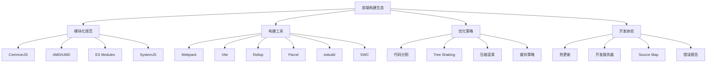
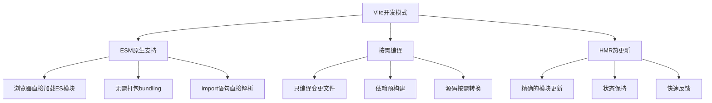

# 构建工具与模块化面试题

## 🎯 核心知识点

- Webpack配置与优化
- Vite现代构建工具
- Rollup库打包
- 模块化规范演进
- 代码分割策略
- 性能优化技巧

## 📊 前端构建生态图



## 💡 面试题目

### 🟢 初级题目

#### 1. **[初级]** 模块化规范的发展历程和特点

**标签**: 模块化, CommonJS, ES Modules, AMD

**题目描述**:
请详细说明前端模块化规范的发展历程，以及各种规范的特点和适用场景。

**核心答案**:

**模块化发展历程**:

```javascript
// 1. 无模块化时代 - 全局变量污染
// math.js
var PI = 3.14159;
function add(a, b) {
    return a + b;
}

// app.js
var result = add(1, 2);
console.log(PI * result);

// 问题：全局变量污染、命名冲突、依赖管理困难
```

```javascript
// 2. IIFE模式 - 立即执行函数
// math.js
var MathModule = (function() {
    var PI = 3.14159;
    
    function add(a, b) {
        return a + b;
    }
    
    function multiply(a, b) {
        return a * b;
    }
    
    // 暴露公共接口
    return {
        PI: PI,
        add: add,
        multiply: multiply
    };
})();

// app.js
var result = MathModule.add(1, 2);
console.log(MathModule.PI * result);

// 优点：避免全局污染
// 缺点：依赖关系不明确、加载顺序重要
```

```javascript
// 3. CommonJS (Node.js)
// math.js
const PI = 3.14159;

function add(a, b) {
    return a + b;
}

function multiply(a, b) {
    return a * b;
}

// 导出方式1
exports.PI = PI;
exports.add = add;
exports.multiply = multiply;

// 导出方式2
module.exports = {
    PI,
    add,
    multiply
};

// app.js
const { PI, add, multiply } = require('./math');
const result = add(1, 2);
console.log(PI * result);

// 特点：
// - 同步加载，适合服务端
// - 运行时加载，动态解析
// - 值的拷贝，不是引用
```

```javascript
// 4. AMD (Asynchronous Module Definition)
// math.js
define(function() {
    const PI = 3.14159;
    
    function add(a, b) {
        return a + b;
    }
    
    function multiply(a, b) {
        return a * b;
    }
    
    return {
        PI,
        add,
        multiply
    };
});

// app.js
require(['./math'], function(math) {
    const result = math.add(1, 2);
    console.log(math.PI * result);
});

// 带依赖的模块
define(['jquery', './utils'], function($, utils) {
    return {
        init: function() {
            utils.log('App initialized');
        }
    };
});

// 特点：
// - 异步加载，适合浏览器
// - 依赖前置，提前声明
// - 支持动态加载
```

```javascript
// 5. UMD (Universal Module Definition)
// math.js - 兼容多种模块规范
(function (root, factory) {
    if (typeof define === 'function' && define.amd) {
        // AMD
        define([], factory);
    } else if (typeof module === 'object' && module.exports) {
        // CommonJS
        module.exports = factory();
    } else {
        // 全局变量
        root.MathModule = factory();
    }
}(typeof self !== 'undefined' ? self : this, function () {
    const PI = 3.14159;
    
    function add(a, b) {
        return a + b;
    }
    
    function multiply(a, b) {
        return a * b;
    }
    
    return {
        PI,
        add,
        multiply
    };
}));

// 特点：
// - 同时支持AMD、CommonJS、全局变量
// - 适合库开发
// - 代码较复杂
```

```javascript
// 6. ES Modules (ES6+)
// math.js
export const PI = 3.14159;

export function add(a, b) {
    return a + b;
}

export function multiply(a, b) {
    return a * b;
}

// 默认导出
export default class Calculator {
    static add = add;
    static multiply = multiply;
}

// app.js
import Calculator, { PI, add, multiply } from './math.js';
import * as math from './math.js';

const result = add(1, 2);
console.log(PI * result);

// 动态导入
async function loadMath() {
    const { add, multiply } = await import('./math.js');
    return { add, multiply };
}

// 特点：
// - 编译时静态分析
// - 支持tree shaking
// - 引用的绑定，不是值的拷贝
// - 原生浏览器支持
```

**各规范对比**:

```javascript
// CommonJS vs ES Modules
// CommonJS - 运行时加载
const fs = require('fs');
const moduleName = 'path';
const pathModule = require(moduleName); // 动态加载

// ES Modules - 编译时静态分析
import fs from 'fs';
// import pathModule from moduleName; // ❌ 错误，必须是字符串字面量

// 动态导入
const pathModule = await import('path');

// 值拷贝 vs 引用绑定
// counter.js (CommonJS)
let count = 0;
function increment() {
    count++;
}
module.exports = { count, increment };

// main.js
const { count, increment } = require('./counter');
console.log(count); // 0
increment();
console.log(count); // 仍然是 0（值的拷贝）

// counter.js (ES Modules)
export let count = 0;
export function increment() {
    count++;
}

// main.js
import { count, increment } from './counter.js';
console.log(count); // 0
increment();
console.log(count); // 1（引用的绑定）
```

**现代模块化实践**:

```javascript
// 1. 条件导入
// feature-flags.js
export const ENABLE_NEW_FEATURE = process.env.NODE_ENV === 'development';

// app.js
import { ENABLE_NEW_FEATURE } from './feature-flags.js';

if (ENABLE_NEW_FEATURE) {
    // 只在开发环境加载
    import('./dev-tools.js').then(devTools => {
        devTools.init();
    });
}

// 2. 模块联邦（Webpack 5）
// webpack.config.js
const ModuleFederationPlugin = require('@module-federation/webpack');

module.exports = {
    plugins: [
        new ModuleFederationPlugin({
            name: 'shell',
            remotes: {
                mfe1: 'mfe1@http://localhost:3001/remoteEntry.js',
                mfe2: 'mfe2@http://localhost:3002/remoteEntry.js',
            },
        }),
    ],
};

// 使用远程模块
const RemoteComponent = React.lazy(() => import('mfe1/Component'));

// 3. Web Workers模块化
// worker.js
import { processData } from './data-processor.js';

self.onmessage = function(e) {
    const result = processData(e.data);
    self.postMessage(result);
};

// main.js
const worker = new Worker('./worker.js', { type: 'module' });
worker.postMessage(data);
```

**模块化最佳实践**:

```javascript
// 1. 目录结构
/*
src/
├── components/
│   ├── index.js          // 统一导出
│   ├── Button/
│   │   ├── index.js
│   │   ├── Button.js
│   │   └── Button.css
│   └── Modal/
│       ├── index.js
│       ├── Modal.js
│       └── Modal.css
├── utils/
│   ├── index.js
│   ├── string.js
│   ├── date.js
│   └── validation.js
└── services/
    ├── index.js
    ├── api.js
    └── auth.js
*/

// components/index.js - 桶文件(Barrel)
export { default as Button } from './Button';
export { default as Modal } from './Modal';

// utils/index.js
export * from './string';
export * from './date';
export * from './validation';

// 2. 命名约定
// 默认导出 - 组件、类、主要功能
export default class ApiClient { }
export default function HomePage() { }

// 命名导出 - 工具函数、常量、配置
export const API_BASE_URL = '/api';
export function formatDate(date) { }
export const validationRules = { };

// 3. 循环依赖处理
// user.js
import { createPost } from './post.js';

export class User {
    createPost(title) {
        return createPost(title, this);
    }
}

// post.js  
// 避免直接导入User类，而是接收参数
export function createPost(title, author) {
    return {
        title,
        author,
        createdAt: new Date()
    };
}

// 4. 代码分割与懒加载
// 路由级别分割
const HomePage = React.lazy(() => import('./pages/Home'));
const AboutPage = React.lazy(() => import('./pages/About'));

// 功能级别分割
const loadChartLibrary = () => import('./libs/chart');

// 5. 类型导出（TypeScript）
// types.ts
export interface User {
    id: number;
    name: string;
    email: string;
}

export type ApiResponse<T> = {
    data: T;
    status: 'success' | 'error';
    message?: string;
};

// 重新导出类型
export type { User as UserType } from './types';
```

**工具链支持**:

```json
// package.json
{
  "type": "module",
  "main": "./dist/index.cjs",
  "module": "./dist/index.js",
  "exports": {
    ".": {
      "import": "./dist/index.js",
      "require": "./dist/index.cjs"
    },
    "./utils": {
      "import": "./dist/utils.js",
      "require": "./dist/utils.cjs"
    }
  }
}
```

```javascript
// 构建配置支持多种格式
// rollup.config.js
export default {
    input: 'src/index.js',
    output: [
        {
            file: 'dist/index.cjs',
            format: 'cjs'
        },
        {
            file: 'dist/index.js',
            format: 'es'
        },
        {
            file: 'dist/index.umd.js',
            format: 'umd',
            name: 'MyLibrary'
        }
    ]
};
```

---

#### 2. **[初级]** Webpack基础配置和常用功能

**标签**: Webpack, 配置, loader, plugin

**题目描述**:
请详细说明Webpack的基本配置，包括entry、output、loader、plugin等核心概念。

**核心答案**:

**Webpack基础配置**:

```javascript
// webpack.config.js
const path = require('path');
const HtmlWebpackPlugin = require('html-webpack-plugin');
const MiniCssExtractPlugin = require('mini-css-extract-plugin');

module.exports = {
    // 入口配置
    entry: {
        main: './src/index.js',
        vendor: './src/vendor.js'
    },
    
    // 输出配置
    output: {
        path: path.resolve(__dirname, 'dist'),
        filename: '[name].[contenthash].js',
        chunkFilename: '[name].[contenthash].chunk.js',
        clean: true, // 清理输出目录
        publicPath: '/'
    },
    
    // 模式
    mode: process.env.NODE_ENV || 'development',
    
    // 模块解析
    resolve: {
        extensions: ['.js', '.jsx', '.ts', '.tsx', '.json'],
        alias: {
            '@': path.resolve(__dirname, 'src'),
            'components': path.resolve(__dirname, 'src/components'),
            'utils': path.resolve(__dirname, 'src/utils')
        },
        modules: ['node_modules', 'src']
    },
    
    // 模块规则
    module: {
        rules: [
            // JavaScript/TypeScript
            {
                test: /\.(js|jsx|ts|tsx)$/,
                exclude: /node_modules/,
                use: {
                    loader: 'babel-loader',
                    options: {
                        presets: [
                            ['@babel/preset-env', {
                                targets: '> 0.25%, not dead',
                                useBuiltIns: 'usage',
                                corejs: 3
                            }],
                            '@babel/preset-react',
                            '@babel/preset-typescript'
                        ],
                        plugins: [
                            '@babel/plugin-proposal-class-properties',
                            '@babel/plugin-syntax-dynamic-import'
                        ]
                    }
                }
            },
            
            // CSS/SCSS
            {
                test: /\.css$/,
                use: [
                    process.env.NODE_ENV === 'production' 
                        ? MiniCssExtractPlugin.loader 
                        : 'style-loader',
                    {
                        loader: 'css-loader',
                        options: {
                            modules: {
                                auto: true,
                                localIdentName: '[name]__[local]--[hash:base64:5]'
                            }
                        }
                    },
                    'postcss-loader'
                ]
            },
            
            {
                test: /\.s[ac]ss$/,
                use: [
                    process.env.NODE_ENV === 'production' 
                        ? MiniCssExtractPlugin.loader 
                        : 'style-loader',
                    'css-loader',
                    'postcss-loader',
                    'sass-loader'
                ]
            },
            
            // 图片资源
            {
                test: /\.(png|jpg|jpeg|gif|svg)$/,
                type: 'asset',
                parser: {
                    dataUrlCondition: {
                        maxSize: 8 * 1024 // 8KB以下转为base64
                    }
                },
                generator: {
                    filename: 'images/[name].[hash][ext]'
                }
            },
            
            // 字体文件
            {
                test: /\.(woff|woff2|eot|ttf|otf)$/,
                type: 'asset/resource',
                generator: {
                    filename: 'fonts/[name].[hash][ext]'
                }
            }
        ]
    },
    
    // 插件
    plugins: [
        new HtmlWebpackPlugin({
            template: './public/index.html',
            filename: 'index.html',
            inject: true,
            minify: process.env.NODE_ENV === 'production'
        }),
        
        new MiniCssExtractPlugin({
            filename: 'css/[name].[contenthash].css',
            chunkFilename: 'css/[name].[contenthash].chunk.css'
        })
    ],
    
    // 优化配置
    optimization: {
        splitChunks: {
            chunks: 'all',
            cacheGroups: {
                vendor: {
                    test: /[\\/]node_modules[\\/]/,
                    name: 'vendors',
                    chunks: 'all',
                    priority: 10
                },
                common: {
                    name: 'common',
                    minChunks: 2,
                    chunks: 'all',
                    priority: 5
                }
            }
        },
        runtimeChunk: 'single'
    },
    
    // 开发服务器
    devServer: {
        static: {
            directory: path.join(__dirname, 'public')
        },
        port: 3000,
        hot: true,
        open: true,
        historyApiFallback: true,
        proxy: {
            '/api': {
                target: 'http://localhost:8080',
                changeOrigin: true,
                pathRewrite: {
                    '^/api': ''
                }
            }
        }
    },
    
    // Source Map
    devtool: process.env.NODE_ENV === 'production' 
        ? 'source-map' 
        : 'eval-source-map'
};
```

**自定义Loader开发**:

```javascript
// loaders/banner-loader.js
module.exports = function(source) {
    const options = this.getOptions();
    const banner = options.banner || '/* Generated by webpack */';
    
    // 添加banner注释
    return `${banner}\n${source}`;
};

// 使用自定义loader
// webpack.config.js
module.exports = {
    module: {
        rules: [
            {
                test: /\.js$/,
                use: {
                    loader: path.resolve('./loaders/banner-loader.js'),
                    options: {
                        banner: '/* Copyright 2023 My Company */'
                    }
                }
            }
        ]
    }
};

// 更复杂的loader示例
// loaders/svg-sprite-loader.js
const path = require('path');

module.exports = function(source) {
    const callback = this.async();
    const options = this.getOptions() || {};
    
    // 解析SVG内容
    const svgContent = source.toString();
    const symbolId = path.basename(this.resourcePath, '.svg');
    
    // 生成sprite symbol
    const symbol = svgContent
        .replace('<svg', `<symbol id="${symbolId}"`)
        .replace('</svg>', '</symbol>');
    
    // 返回使用代码
    const result = `
        export default {
            id: '${symbolId}',
            viewBox: '0 0 24 24',
            content: '${symbol}'
        };
    `;
    
    callback(null, result);
};
```

**自定义Plugin开发**:

```javascript
// plugins/FileListPlugin.js
class FileListPlugin {
    constructor(options) {
        this.options = options || {};
    }
    
    apply(compiler) {
        compiler.hooks.emit.tapAsync('FileListPlugin', (compilation, callback) => {
            // 获取所有输出文件
            const fileList = Object.keys(compilation.assets).map(filename => {
                const asset = compilation.assets[filename];
                return {
                    name: filename,
                    size: asset.size(),
                    hash: compilation.getStats().toJson().assetsByChunkName
                };
            });
            
            // 生成文件列表
            const fileListJson = JSON.stringify(fileList, null, 2);
            
            // 添加到输出资源
            compilation.assets['file-list.json'] = {
                source: () => fileListJson,
                size: () => fileListJson.length
            };
            
            callback();
        });
    }
}

module.exports = FileListPlugin;

// 使用自定义plugin
// webpack.config.js
const FileListPlugin = require('./plugins/FileListPlugin');

module.exports = {
    plugins: [
        new FileListPlugin({
            outputFile: 'assets-manifest.json'
        })
    ]
};
```

**多环境配置**:

```javascript
// webpack.common.js
const path = require('path');
const HtmlWebpackPlugin = require('html-webpack-plugin');

module.exports = {
    entry: './src/index.js',
    
    output: {
        path: path.resolve(__dirname, 'dist'),
        clean: true
    },
    
    module: {
        rules: [
            {
                test: /\.js$/,
                exclude: /node_modules/,
                use: 'babel-loader'
            }
        ]
    },
    
    plugins: [
        new HtmlWebpackPlugin({
            template: './public/index.html'
        })
    ]
};

// webpack.dev.js
const { merge } = require('webpack-merge');
const common = require('./webpack.common.js');

module.exports = merge(common, {
    mode: 'development',
    devtool: 'eval-source-map',
    
    output: {
        filename: '[name].js'
    },
    
    module: {
        rules: [
            {
                test: /\.css$/,
                use: ['style-loader', 'css-loader']
            }
        ]
    },
    
    devServer: {
        static: './dist',
        hot: true,
        port: 3000
    }
});

// webpack.prod.js
const { merge } = require('webpack-merge');
const MiniCssExtractPlugin = require('mini-css-extract-plugin');
const CssMinimizerPlugin = require('css-minimizer-webpack-plugin');
const TerserPlugin = require('terser-webpack-plugin');
const common = require('./webpack.common.js');

module.exports = merge(common, {
    mode: 'production',
    devtool: 'source-map',
    
    output: {
        filename: '[name].[contenthash].js',
        chunkFilename: '[name].[contenthash].chunk.js'
    },
    
    module: {
        rules: [
            {
                test: /\.css$/,
                use: [MiniCssExtractPlugin.loader, 'css-loader']
            }
        ]
    },
    
    plugins: [
        new MiniCssExtractPlugin({
            filename: '[name].[contenthash].css'
        })
    ],
    
    optimization: {
        minimizer: [
            new TerserPlugin({
                terserOptions: {
                    compress: {
                        drop_console: true
                    }
                }
            }),
            new CssMinimizerPlugin()
        ],
        
        splitChunks: {
            chunks: 'all',
            cacheGroups: {
                vendor: {
                    test: /[\\/]node_modules[\\/]/,
                    name: 'vendors',
                    chunks: 'all'
                }
            }
        }
    }
});

// package.json scripts
{
    "scripts": {
        "start": "webpack serve --config webpack.dev.js",
        "build": "webpack --config webpack.prod.js",
        "analyze": "webpack-bundle-analyzer dist"
    }
}
```

**性能优化配置**:

```javascript
// webpack.config.js
const BundleAnalyzerPlugin = require('webpack-bundle-analyzer').BundleAnalyzerPlugin;

module.exports = {
    // 缓存配置
    cache: {
        type: 'filesystem',
        buildDependencies: {
            config: [__filename]
        }
    },
    
    // 外部依赖
    externals: {
        'react': 'React',
        'react-dom': 'ReactDOM',
        'lodash': '_'
    },
    
    // 优化配置
    optimization: {
        // Tree Shaking
        usedExports: true,
        sideEffects: false,
        
        // 代码分割
        splitChunks: {
            chunks: 'all',
            minSize: 20000,
            maxSize: 244000,
            cacheGroups: {
                default: {
                    minChunks: 2,
                    priority: -20,
                    reuseExistingChunk: true
                },
                vendor: {
                    test: /[\\/]node_modules[\\/]/,
                    name: 'vendors',
                    priority: -10,
                    chunks: 'all'
                },
                react: {
                    test: /[\\/]node_modules[\\/](react|react-dom)[\\/]/,
                    name: 'react',
                    chunks: 'all',
                    priority: 20
                }
            }
        },
        
        // 运行时优化
        runtimeChunk: {
            name: 'runtime'
        }
    },
    
    // 插件优化
    plugins: [
        // 分析包大小
        process.env.ANALYZE && new BundleAnalyzerPlugin(),
        
        // 忽略moment.js的locale文件
        new webpack.IgnorePlugin({
            resourceRegExp: /^\.\/locale$/,
            contextRegExp: /moment$/
        })
    ].filter(Boolean)
};
```

**Webpack核心概念总结**:
- ✅ **Entry**: 构建入口，可以是单个或多个文件
- ✅ **Output**: 输出配置，定义打包后文件的名称和路径
- ✅ **Loader**: 文件转换器，处理非JavaScript文件
- ✅ **Plugin**: 功能扩展，执行更复杂的任务
- ✅ **Mode**: 模式配置，自动启用相应的优化
- ✅ **Resolve**: 模块解析配置
- ✅ **Optimization**: 优化配置，包括代码分割、压缩等

---

### 🟡 中级题目

#### 3. **[中级]** Vite与传统构建工具的对比和优势

**标签**: Vite, ESM, 热更新, 开发体验

**题目描述**:
请详细说明Vite的工作原理、与Webpack等传统构建工具的区别，以及在实际项目中的应用。

**核心答案**:

**Vite工作原理**:



**Vite基础配置**:

```javascript
// vite.config.js
import { defineConfig } from 'vite';
import react from '@vitejs/plugin-react';
import { resolve } from 'path';

export default defineConfig({
    // 插件配置
    plugins: [
        react({
            // React插件选项
            jsxImportSource: '@emotion/react',
            babel: {
                plugins: ['@emotion/babel-plugin']
            }
        })
    ],
    
    // 开发服务器配置
    server: {
        port: 3000,
        open: true,
        cors: true,
        proxy: {
            '/api': {
                target: 'http://localhost:8080',
                changeOrigin: true,
                rewrite: (path) => path.replace(/^\/api/, '')
            }
        }
    },
    
    // 构建配置
    build: {
        outDir: 'dist',
        assetsDir: 'assets',
        sourcemap: true,
        minify: 'terser',
        terserOptions: {
            compress: {
                drop_console: true,
                drop_debugger: true
            }
        },
        rollupOptions: {
            input: {
                main: resolve(__dirname, 'index.html'),
                admin: resolve(__dirname, 'admin.html')
            },
            output: {
                chunkFileNames: 'js/[name]-[hash].js',
                entryFileNames: 'js/[name]-[hash].js',
                assetFileNames: 'assets/[name]-[hash].[ext]'
            }
        }
    },
    
    // 路径解析
    resolve: {
        alias: {
            '@': resolve(__dirname, 'src'),
            'components': resolve(__dirname, 'src/components'),
            'utils': resolve(__dirname, 'src/utils')
        },
        extensions: ['.js', '.ts', '.jsx', '.tsx', '.json']
    },
    
    // CSS配置
    css: {
        modules: {
            localsConvention: 'camelCase'
        },
        preprocessorOptions: {
            scss: {
                additionalData: `@import "@/styles/variables.scss";`
            }
        }
    },
    
    // 环境变量
    define: {
        __APP_VERSION__: JSON.stringify(process.env.npm_package_version),
        __BUILD_TIME__: JSON.stringify(new Date().toISOString())
    },
    
    // 依赖优化
    optimizeDeps: {
        include: ['react', 'react-dom'],
        exclude: ['some-large-dependency']
    }
});
```

**Vite插件开发**:

```javascript
// plugins/auto-import.js
function autoImportPlugin(options = {}) {
    return {
        name: 'auto-import',
        configResolved(config) {
            this.isProduction = config.command === 'build';
        },
        transformIndexHtml(html) {
            // 自动注入脚本
            return html.replace(
                '<head>',
                `<head>\n  <script>window.__DEV__ = ${!this.isProduction}</script>`
            );
        },
        transform(code, id) {
            // 自动导入常用库
            if (id.endsWith('.jsx') || id.endsWith('.tsx')) {
                if (!code.includes('import React')) {
                    code = `import React from 'react';\n${code}`;
                }
            }
            return code;
        }
    };
}

export default autoImportPlugin;

// 使用插件
// vite.config.js
import autoImport from './plugins/auto-import';

export default defineConfig({
    plugins: [
        react(),
        autoImport({
            imports: ['react', 'react-router-dom']
        })
    ]
});
```

**Vite vs Webpack对比**:

```javascript
// 开发启动时间对比
// Webpack (传统方式)
// 1. 分析依赖图
// 2. 打包所有模块
// 3. 启动开发服务器
// 启动时间: 10-30秒（大型项目）

// Vite
// 1. 启动开发服务器
// 2. 预构建依赖
// 3. 按需编译
// 启动时间: 1-3秒

// 热更新速度对比
// Webpack HMR
function webpackHMR() {
    // 检测文件变化
    // 重新编译相关模块
    // 打包更新的chunk
    // 推送给浏览器
    // 更新时间: 1-5秒
}

// Vite HMR
function viteHMR() {
    // 检测文件变化
    // 直接转换单个文件
    // 推送给浏览器
    // 更新时间: 100-500ms
}
```

**迁移指南 - Webpack到Vite**:

```javascript
// 1. 依赖迁移
// package.json (before)
{
    "devDependencies": {
        "webpack": "^5.0.0",
        "webpack-cli": "^4.0.0",
        "webpack-dev-server": "^4.0.0",
        "babel-loader": "^8.0.0",
        "css-loader": "^6.0.0",
        "style-loader": "^3.0.0",
        "html-webpack-plugin": "^5.0.0"
    }
}

// package.json (after)
{
    "devDependencies": {
        "vite": "^4.0.0",
        "@vitejs/plugin-react": "^3.0.0"
    }
}

// 2. 配置迁移
// webpack.config.js → vite.config.js
// 入口文件配置
// Webpack
module.exports = {
    entry: './src/main.js'
};

// Vite (无需配置，自动检测index.html)
// index.html
// <script type="module" src="/src/main.js"></script>

// 3. 静态资源处理
// Webpack
import logo from './assets/logo.png';
// 需要配置file-loader或url-loader

// Vite
import logo from './assets/logo.png'; // 自动处理
import logoUrl from './assets/logo.png?url'; // 获取URL
import logoInline from './assets/logo.png?inline'; // 内联base64

// 4. 环境变量
// Webpack
process.env.NODE_ENV
process.env.REACT_APP_API_URL

// Vite
import.meta.env.MODE
import.meta.env.VITE_API_URL // 必须VITE_前缀

// 5. 动态导入
// Webpack
import('./module').then(module => {
    // ...
});

// Vite (相同语法，但更快)
import('./module').then(module => {
    // ...
});

// Glob导入（Vite特有）
const modules = import.meta.glob('./modules/*.js');
const eagerModules = import.meta.globEager('./modules/*.js');
```

**Vite高级功能**:

```javascript
// 1. 条件编译
// vite.config.js
export default defineConfig(({ command, mode }) => {
    const config = {
        plugins: [react()]
    };
    
    if (command === 'serve') {
        // 开发环境特定配置
        config.define = {
            __DEV__: true
        };
    } else {
        // 生产环境特定配置
        config.define = {
            __DEV__: false
        };
    }
    
    return config;
});

// 2. 多页面应用
// vite.config.js
export default defineConfig({
    build: {
        rollupOptions: {
            input: {
                main: resolve(__dirname, 'index.html'),
                admin: resolve(__dirname, 'admin.html'),
                mobile: resolve(__dirname, 'mobile.html')
            }
        }
    }
});

// 3. 库模式构建
// vite.config.js
export default defineConfig({
    build: {
        lib: {
            entry: resolve(__dirname, 'src/index.js'),
            name: 'MyLib',
            formats: ['es', 'cjs', 'umd'],
            fileName: (format) => `my-lib.${format}.js`
        },
        rollupOptions: {
            external: ['react', 'react-dom'],
            output: {
                globals: {
                    'react': 'React',
                    'react-dom': 'ReactDOM'
                }
            }
        }
    }
});

// 4. Worker支持
// main.js
import MyWorker from './worker.js?worker';

const worker = new MyWorker();
worker.postMessage('hello');

// 内联worker
import InlineWorker from './worker.js?worker&inline';

// 5. WebAssembly支持
// main.js
import wasmModule from './module.wasm?init';

wasmModule().then(wasm => {
    const result = wasm.exports.calculate(10, 20);
    console.log(result);
});
```

**性能优化实践**:

```javascript
// 1. 依赖预构建优化
// vite.config.js
export default defineConfig({
    optimizeDeps: {
        // 明确包含需要预构建的依赖
        include: [
            'react',
            'react-dom',
            'lodash-es',
            'date-fns'
        ],
        // 排除不需要预构建的依赖
        exclude: [
            'some-esm-package'
        ],
        // 强制重新构建
        force: true
    }
});

// 2. 代码分割策略
// vite.config.js
export default defineConfig({
    build: {
        rollupOptions: {
            output: {
                manualChunks: {
                    vendor: ['react', 'react-dom'],
                    utils: ['lodash-es', 'date-fns'],
                    ui: ['antd', '@ant-design/icons']
                }
            }
        }
    }
});

// 3. 资源优化
// vite.config.js
export default defineConfig({
    build: {
        assetsInlineLimit: 4096, // 4kb以下内联
        chunkSizeWarningLimit: 500, // chunk大小警告阈值
        rollupOptions: {
            output: {
                // 静态资源分类
                assetFileNames: (assetInfo) => {
                    const info = assetInfo.name.split('.');
                    const ext = info[info.length - 1];
                    if (/\.(mp4|webm|ogg|mp3|wav|flac|aac)$/.test(assetInfo.name)) {
                        return `media/[name]-[hash].${ext}`;
                    }
                    if (/\.(png|jpe?g|gif|svg)$/.test(assetInfo.name)) {
                        return `images/[name]-[hash].${ext}`;
                    }
                    if (/\.(woff2?|eot|ttf|otf)$/.test(assetInfo.name)) {
                        return `fonts/[name]-[hash].${ext}`;
                    }
                    return `assets/[name]-[hash].${ext}`;
                }
            }
        }
    }
});
```

**Vite生态系统**:

```javascript
// 常用插件
import { defineConfig } from 'vite';
import react from '@vitejs/plugin-react';
import { resolve } from 'path';

// 自动导入
import AutoImport from 'unplugin-auto-import/vite';
// PWA支持
import { VitePWA } from 'vite-plugin-pwa';
// 类型检查
import checker from 'vite-plugin-checker';
// 包分析
import { visualizer } from 'rollup-plugin-visualizer';

export default defineConfig({
    plugins: [
        react(),
        
        // 自动导入React Hooks
        AutoImport({
            imports: ['react'],
            dts: true
        }),
        
        // TypeScript类型检查
        checker({
            typescript: true,
            eslint: {
                lintCommand: 'eslint "./src/**/*.{ts,tsx}"'
            }
        }),
        
        // PWA配置
        VitePWA({
            registerType: 'autoUpdate',
            workbox: {
                globPatterns: ['**/*.{js,css,html,ico,png,svg}']
            }
        }),
        
        // 包大小分析
        visualizer({
            filename: 'dist/stats.html',
            open: true,
            gzipSize: true
        })
    ]
});
```

**Vite优势总结**:
- ✅ **极快的启动速度**: 利用ESM避免打包
- ✅ **快速的热更新**: 精确的模块级更新
- ✅ **开箱即用**: 合理的默认配置
- ✅ **丰富的插件生态**: 基于Rollup插件
- ✅ **现代化**: 面向现代浏览器和构建工具链
- ✅ **生产优化**: 基于Rollup的优化构建

---

## 🔗 相关链接

- [← 返回前端题库](./README.md)
- [JavaScript核心概念](./javascript-core.md)
- [ES6+现代特性](./javascript-es6.md)
- [性能优化](./performance-optimization.md)

---

*现代前端构建工具是提高开发效率和应用性能的关键，掌握这些工具的配置和优化技巧非常重要* 