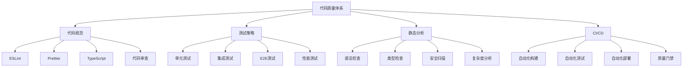

# 代码质量与测试面试题

## 🎯 核心知识点

- 代码质量标准
- 测试策略与方法
- 静态代码分析
- 代码规范与风格
- 持续集成与部署
- 性能测试

## 📊 代码质量体系图



## 💡 面试题目

### 🟢 初级题目

#### 1. **[初级]** 前端测试基础和Jest使用

**标签**: 单元测试, Jest, 测试驱动开发, 断言

**题目描述**:
请详细说明前端测试的基本概念，以及如何使用Jest进行单元测试。

**核心答案**:

**Jest基础测试**:

```javascript
// math.js - 被测试的模块
export function add(a, b) {
    return a + b;
}

export function subtract(a, b) {
    return a - b;
}

export function multiply(a, b) {
    return a * b;
}

export function divide(a, b) {
    if (b === 0) {
        throw new Error('Division by zero');
    }
    return a / b;
}

export function factorial(n) {
    if (n < 0) {
        throw new Error('Factorial of negative number');
    }
    if (n === 0 || n === 1) {
        return 1;
    }
    return n * factorial(n - 1);
}

// math.test.js - 测试文件
import { add, subtract, multiply, divide, factorial } from './math.js';

describe('Math functions', () => {
    // 基础测试
    test('adds 1 + 2 to equal 3', () => {
        expect(add(1, 2)).toBe(3);
    });
    
    test('subtracts 5 - 3 to equal 2', () => {
        expect(subtract(5, 3)).toBe(2);
    });
    
    test('multiplies 3 * 4 to equal 12', () => {
        expect(multiply(3, 4)).toBe(12);
    });
    
    // 异常测试
    test('throws error when dividing by zero', () => {
        expect(() => {
            divide(10, 0);
        }).toThrow('Division by zero');
    });
    
    test('throws error for negative factorial', () => {
        expect(() => {
            factorial(-1);
        }).toThrow('Factorial of negative number');
    });
    
    // 参数化测试
    test.each([
        [1, 2, 3],
        [0, 5, 5],
        [-1, 1, 0],
        [0.1, 0.2, 0.3]
    ])('add(%i, %i) = %i', (a, b, expected) => {
        expect(add(a, b)).toBeCloseTo(expected);
    });
    
    // 异步测试
    test('async addition', async () => {
        const asyncAdd = (a, b) => Promise.resolve(a + b);
        await expect(asyncAdd(2, 3)).resolves.toBe(5);
    });
});

// 钩子函数使用
describe('Calculator with setup and teardown', () => {
    let calculator;
    
    beforeAll(() => {
        console.log('Setting up test suite');
    });
    
    afterAll(() => {
        console.log('Cleaning up test suite');
    });
    
    beforeEach(() => {
        calculator = {
            result: 0,
            add(value) {
                this.result += value;
                return this;
            },
            subtract(value) {
                this.result -= value;
                return this;
            },
            getResult() {
                return this.result;
            }
        };
    });
    
    afterEach(() => {
        calculator = null;
    });
    
    test('calculator chain operations', () => {
        const result = calculator
            .add(10)
            .subtract(3)
            .add(5)
            .getResult();
        
        expect(result).toBe(12);
    });
});
```

**React组件测试**:

```javascript
// Button.jsx - React组件
import React from 'react';
import PropTypes from 'prop-types';

const Button = ({ 
    children, 
    onClick, 
    disabled = false, 
    variant = 'primary',
    size = 'medium'
}) => {
    const handleClick = (event) => {
        if (!disabled && onClick) {
            onClick(event);
        }
    };
    
    const className = `btn btn-${variant} btn-${size} ${disabled ? 'disabled' : ''}`;
    
    return (
        <button 
            className={className}
            onClick={handleClick}
            disabled={disabled}
            data-testid="button"
        >
            {children}
        </button>
    );
};

Button.propTypes = {
    children: PropTypes.node.isRequired,
    onClick: PropTypes.func,
    disabled: PropTypes.bool,
    variant: PropTypes.oneOf(['primary', 'secondary', 'danger']),
    size: PropTypes.oneOf(['small', 'medium', 'large'])
};

export default Button;

// Button.test.jsx - 组件测试
import React from 'react';
import { render, screen, fireEvent } from '@testing-library/react';
import '@testing-library/jest-dom';
import Button from './Button';

describe('Button Component', () => {
    test('renders button with text', () => {
        render(<Button>Click me</Button>);
        const button = screen.getByRole('button', { name: /click me/i });
        expect(button).toBeInTheDocument();
    });
    
    test('calls onClick when clicked', () => {
        const handleClick = jest.fn();
        render(<Button onClick={handleClick}>Click me</Button>);
        
        const button = screen.getByRole('button');
        fireEvent.click(button);
        
        expect(handleClick).toHaveBeenCalledTimes(1);
    });
    
    test('does not call onClick when disabled', () => {
        const handleClick = jest.fn();
        render(
            <Button onClick={handleClick} disabled>
                Click me
            </Button>
        );
        
        const button = screen.getByRole('button');
        fireEvent.click(button);
        
        expect(handleClick).not.toHaveBeenCalled();
        expect(button).toBeDisabled();
    });
    
    test('applies correct CSS classes', () => {
        render(
            <Button variant="danger" size="large">
                Delete
            </Button>
        );
        
        const button = screen.getByRole('button');
        expect(button).toHaveClass('btn', 'btn-danger', 'btn-large');
    });
    
    test('renders with custom test id', () => {
        render(<Button>Test Button</Button>);
        const button = screen.getByTestId('button');
        expect(button).toBeInTheDocument();
    });
});

// 快照测试
describe('Button Snapshots', () => {
    test('matches snapshot for primary button', () => {
        const { container } = render(
            <Button variant="primary" size="medium">
                Primary Button
            </Button>
        );
        expect(container.firstChild).toMatchSnapshot();
    });
});
```

**异步操作测试**:

```javascript
// api.js - API模块
export class ApiService {
    constructor(baseURL = '/api') {
        this.baseURL = baseURL;
    }
    
    async fetchUser(id) {
        const response = await fetch(`${this.baseURL}/users/${id}`);
        if (!response.ok) {
            throw new Error(`Failed to fetch user: ${response.status}`);
        }
        return response.json();
    }
    
    async createUser(userData) {
        const response = await fetch(`${this.baseURL}/users`, {
            method: 'POST',
            headers: {
                'Content-Type': 'application/json'
            },
            body: JSON.stringify(userData)
        });
        
        if (!response.ok) {
            throw new Error(`Failed to create user: ${response.status}`);
        }
        
        return response.json();
    }
    
    async updateUser(id, userData) {
        const response = await fetch(`${this.baseURL}/users/${id}`, {
            method: 'PUT',
            headers: {
                'Content-Type': 'application/json'
            },
            body: JSON.stringify(userData)
        });
        
        if (!response.ok) {
            throw new Error(`Failed to update user: ${response.status}`);
        }
        
        return response.json();
    }
}

// api.test.js - API测试
import { ApiService } from './api.js';

// Mock fetch
global.fetch = jest.fn();

describe('ApiService', () => {
    let apiService;
    
    beforeEach(() => {
        apiService = new ApiService();
        fetch.mockClear();
    });
    
    describe('fetchUser', () => {
        test('fetches user successfully', async () => {
            const mockUser = { id: 1, name: 'John Doe', email: 'john@example.com' };
            
            fetch.mockResolvedValueOnce({
                ok: true,
                json: async () => mockUser
            });
            
            const user = await apiService.fetchUser(1);
            
            expect(fetch).toHaveBeenCalledWith('/api/users/1');
            expect(user).toEqual(mockUser);
        });
        
        test('throws error when fetch fails', async () => {
            fetch.mockResolvedValueOnce({
                ok: false,
                status: 404
            });
            
            await expect(apiService.fetchUser(999))
                .rejects
                .toThrow('Failed to fetch user: 404');
        });
        
        test('handles network error', async () => {
            fetch.mockRejectedValueOnce(new Error('Network error'));
            
            await expect(apiService.fetchUser(1))
                .rejects
                .toThrow('Network error');
        });
    });
    
    describe('createUser', () => {
        test('creates user successfully', async () => {
            const userData = { name: 'Jane Doe', email: 'jane@example.com' };
            const createdUser = { id: 2, ...userData };
            
            fetch.mockResolvedValueOnce({
                ok: true,
                json: async () => createdUser
            });
            
            const result = await apiService.createUser(userData);
            
            expect(fetch).toHaveBeenCalledWith('/api/users', {
                method: 'POST',
                headers: {
                    'Content-Type': 'application/json'
                },
                body: JSON.stringify(userData)
            });
            expect(result).toEqual(createdUser);
        });
    });
});

// 使用MSW (Mock Service Worker) 进行更真实的API测试
import { rest } from 'msw';
import { setupServer } from 'msw/node';

const server = setupServer(
    rest.get('/api/users/:id', (req, res, ctx) => {
        const { id } = req.params;
        
        if (id === '1') {
            return res(
                ctx.json({
                    id: 1,
                    name: 'John Doe',
                    email: 'john@example.com'
                })
            );
        }
        
        return res(ctx.status(404));
    }),
    
    rest.post('/api/users', async (req, res, ctx) => {
        const userData = await req.json();
        
        return res(
            ctx.json({
                id: Date.now(),
                ...userData
            })
        );
    })
);

beforeAll(() => server.listen());
afterEach(() => server.resetHandlers());
afterAll(() => server.close());

describe('ApiService with MSW', () => {
    test('fetches user with real HTTP', async () => {
        const apiService = new ApiService();
        const user = await apiService.fetchUser(1);
        
        expect(user).toEqual({
            id: 1,
            name: 'John Doe',
            email: 'john@example.com'
        });
    });
});
```

---

#### 2. **[初级]** ESLint和Prettier代码规范

**标签**: ESLint, Prettier, 代码规范, 静态分析

**题目描述**:
请详细说明如何使用ESLint和Prettier来维护代码质量和统一代码风格。

**核心答案**:

**ESLint配置**:

```javascript
// .eslintrc.js
module.exports = {
    env: {
        browser: true,
        es2021: true,
        node: true,
        jest: true
    },
    extends: [
        'eslint:recommended',
        '@typescript-eslint/recommended',
        'plugin:react/recommended',
        'plugin:react-hooks/recommended',
        'plugin:jsx-a11y/recommended',
        'plugin:import/recommended',
        'plugin:import/typescript',
        'prettier' // 必须放在最后
    ],
    parser: '@typescript-eslint/parser',
    parserOptions: {
        ecmaFeatures: {
            jsx: true
        },
        ecmaVersion: 12,
        sourceType: 'module',
        project: './tsconfig.json'
    },
    plugins: [
        'react',
        'react-hooks',
        '@typescript-eslint',
        'jsx-a11y',
        'import',
        'unused-imports'
    ],
    rules: {
        // JavaScript/TypeScript规则
        'no-console': 'warn',
        'no-debugger': 'error',
        'no-unused-vars': 'off', // 关闭，使用TypeScript版本
        '@typescript-eslint/no-unused-vars': 'error',
        '@typescript-eslint/no-explicit-any': 'warn',
        '@typescript-eslint/explicit-function-return-type': 'off',
        '@typescript-eslint/explicit-module-boundary-types': 'off',
        '@typescript-eslint/no-non-null-assertion': 'warn',
        
        // React规则
        'react/react-in-jsx-scope': 'off', // React 17+不需要
        'react/prop-types': 'off', // 使用TypeScript
        'react/jsx-uses-react': 'off',
        'react/jsx-uses-vars': 'error',
        'react/jsx-key': 'error',
        'react/jsx-no-duplicate-props': 'error',
        'react/jsx-no-undef': 'error',
        'react/no-children-prop': 'error',
        'react/no-danger-with-children': 'error',
        'react/no-deprecated': 'warn',
        'react/no-direct-mutation-state': 'error',
        'react/no-find-dom-node': 'error',
        'react/no-is-mounted': 'error',
        'react/no-render-return-value': 'error',
        'react/no-string-refs': 'error',
        'react/no-unescaped-entities': 'error',
        'react/no-unknown-property': 'error',
        'react/require-render-return': 'error',
        'react/self-closing-comp': 'error',
        
        // React Hooks规则
        'react-hooks/rules-of-hooks': 'error',
        'react-hooks/exhaustive-deps': 'warn',
        
        // 可访问性规则
        'jsx-a11y/alt-text': 'error',
        'jsx-a11y/anchor-has-content': 'error',
        'jsx-a11y/anchor-is-valid': 'error',
        'jsx-a11y/aria-activedescendant-has-tabindex': 'error',
        'jsx-a11y/aria-props': 'error',
        'jsx-a11y/aria-proptypes': 'error',
        'jsx-a11y/aria-role': 'error',
        'jsx-a11y/aria-unsupported-elements': 'error',
        'jsx-a11y/click-events-have-key-events': 'warn',
        'jsx-a11y/heading-has-content': 'error',
        'jsx-a11y/html-has-lang': 'error',
        'jsx-a11y/img-redundant-alt': 'error',
        'jsx-a11y/interactive-supports-focus': 'error',
        'jsx-a11y/label-has-associated-control': 'error',
        'jsx-a11y/mouse-events-have-key-events': 'warn',
        'jsx-a11y/no-access-key': 'error',
        'jsx-a11y/no-autofocus': 'warn',
        'jsx-a11y/no-distracting-elements': 'error',
        'jsx-a11y/no-redundant-roles': 'error',
        'jsx-a11y/role-has-required-aria-props': 'error',
        'jsx-a11y/role-supports-aria-props': 'error',
        'jsx-a11y/scope': 'error',
        'jsx-a11y/tabindex-no-positive': 'error',
        
        // Import规则
        'import/order': [
            'error',
            {
                groups: [
                    'builtin',
                    'external',
                    'internal',
                    'parent',
                    'sibling',
                    'index'
                ],
                'newlines-between': 'always',
                alphabetize: {
                    order: 'asc',
                    caseInsensitive: true
                }
            }
        ],
        'import/no-unresolved': 'error',
        'import/no-cycle': 'error',
        'import/no-self-import': 'error',
        'import/no-duplicate-imports': 'error',
        
        // 未使用导入清理
        'unused-imports/no-unused-imports': 'error',
        'unused-imports/no-unused-vars': [
            'warn',
            {
                vars: 'all',
                varsIgnorePattern: '^_',
                args: 'after-used',
                argsIgnorePattern: '^_'
            }
        ]
    },
    settings: {
        react: {
            version: 'detect'
        },
        'import/resolver': {
            typescript: {
                alwaysTryTypes: true,
                project: './tsconfig.json'
            }
        }
    },
    overrides: [
        {
            files: ['**/*.test.{js,jsx,ts,tsx}', '**/__tests__/**/*'],
            env: {
                jest: true
            },
            rules: {
                '@typescript-eslint/no-explicit-any': 'off',
                'no-console': 'off'
            }
        }
    ]
};

// package.json scripts
{
    "scripts": {
        "lint": "eslint src --ext .js,.jsx,.ts,.tsx",
        "lint:fix": "eslint src --ext .js,.jsx,.ts,.tsx --fix",
        "lint:staged": "lint-staged"
    },
    "lint-staged": {
        "src/**/*.{js,jsx,ts,tsx}": [
            "eslint --fix",
            "prettier --write"
        ]
    }
}
```

**Prettier配置**:

```javascript
// .prettierrc.js
module.exports = {
    // 基础格式化选项
    printWidth: 80,           // 每行最大字符数
    tabWidth: 2,              // 缩进空格数
    useTabs: false,           // 使用空格而不是tab
    semi: true,               // 语句末尾添加分号
    singleQuote: true,        // 使用单引号
    quoteProps: 'as-needed',  // 对象属性引号策略
    
    // JSX选项
    jsxSingleQuote: true,     // JSX中使用单引号
    jsxBracketSameLine: false, // JSX标签的>换行
    
    // 数组和对象
    trailingComma: 'es5',     // 尾随逗号
    bracketSpacing: true,     // 对象字面量的括号间空格
    bracketSameLine: false,   // 对象括号换行
    
    // 箭头函数
    arrowParens: 'avoid',     // 箭头函数参数括号
    
    // 其他选项
    endOfLine: 'lf',          // 换行符
    embeddedLanguageFormatting: 'auto', // 嵌入式语言格式化
    
    // 文件覆盖
    overrides: [
        {
            files: '*.json',
            options: {
                printWidth: 120
            }
        },
        {
            files: '*.md',
            options: {
                printWidth: 100,
                proseWrap: 'always'
            }
        }
    ]
};

// .prettierignore
build/
dist/
node_modules/
coverage/
*.min.js
*.min.css
package-lock.json
yarn.lock
```

**自定义ESLint规则**:

```javascript
// eslint-rules/no-console-log.js
module.exports = {
    meta: {
        type: 'problem',
        docs: {
            description: 'Disallow console.log statements',
            category: 'Best Practices',
            recommended: false
        },
        fixable: 'code',
        schema: []
    },
    
    create(context) {
        return {
            CallExpression(node) {
                if (
                    node.callee.type === 'MemberExpression' &&
                    node.callee.object.name === 'console' &&
                    node.callee.property.name === 'log'
                ) {
                    context.report({
                        node,
                        message: 'console.log statements are not allowed',
                        fix(fixer) {
                            return fixer.remove(node.parent);
                        }
                    });
                }
            }
        };
    }
};

// 在.eslintrc.js中使用自定义规则
module.exports = {
    plugins: ['./eslint-rules'],
    rules: {
        './eslint-rules/no-console-log': 'error'
    }
};
```

**代码质量检查工具集成**:

```javascript
// husky + lint-staged 配置
// package.json
{
    "husky": {
        "hooks": {
            "pre-commit": "lint-staged",
            "commit-msg": "commitlint -E HUSKY_GIT_PARAMS"
        }
    },
    "lint-staged": {
        "src/**/*.{js,jsx,ts,tsx}": [
            "eslint --fix",
            "prettier --write",
            "git add"
        ],
        "src/**/*.{css,scss,less}": [
            "stylelint --fix",
            "prettier --write",
            "git add"
        ],
        "**/*.{json,md}": [
            "prettier --write",
            "git add"
        ]
    }
}

// commitlint.config.js
module.exports = {
    extends: ['@commitlint/config-conventional'],
    rules: {
        'type-enum': [
            2,
            'always',
            [
                'feat',     // 新功能
                'fix',      // 修复bug
                'docs',     // 文档更新
                'style',    // 代码格式化
                'refactor', // 重构
                'perf',     // 性能优化
                'test',     // 测试
                'chore',    // 构建过程或辅助工具的变动
                'revert'    // 回滚
            ]
        ],
        'subject-max-length': [2, 'always', 50],
        'body-max-line-length': [2, 'always', 72]
    }
};

// GitHub Actions工作流
// .github/workflows/ci.yml
name: CI

on:
  push:
    branches: [main, develop]
  pull_request:
    branches: [main]

jobs:
  lint-and-test:
    runs-on: ubuntu-latest
    
    steps:
      - uses: actions/checkout@v3
      
      - name: Setup Node.js
        uses: actions/setup-node@v3
        with:
          node-version: '18'
          cache: 'npm'
      
      - name: Install dependencies
        run: npm ci
      
      - name: Run ESLint
        run: npm run lint
      
      - name: Run Prettier check
        run: npm run format:check
      
      - name: Run tests
        run: npm run test:coverage
      
      - name: Upload coverage to Codecov
        uses: codecov/codecov-action@v3
        with:
          file: ./coverage/lcov.info
      
      - name: Build project
        run: npm run build
```

**代码质量度量**:

```javascript
// 代码复杂度分析
// complexity-analysis.js
const fs = require('fs');
const path = require('path');
const { ESLint } = require('eslint');

class ComplexityAnalyzer {
    constructor() {
        this.eslint = new ESLint({
            baseConfig: {
                rules: {
                    'complexity': ['error', { max: 10 }],
                    'max-depth': ['error', { max: 4 }],
                    'max-lines': ['error', { max: 300 }],
                    'max-lines-per-function': ['error', { max: 50 }],
                    'max-params': ['error', { max: 3 }]
                }
            }
        });
    }
    
    async analyzeFile(filePath) {
        const results = await this.eslint.lintFiles([filePath]);
        const result = results[0];
        
        const complexityIssues = result.messages.filter(
            message => message.ruleId && message.ruleId.includes('complexity')
        );
        
        return {
            filePath,
            errorCount: result.errorCount,
            warningCount: result.warningCount,
            complexityIssues,
            score: this.calculateScore(result)
        };
    }
    
    calculateScore(result) {
        const maxScore = 100;
        const errorPenalty = 10;
        const warningPenalty = 5;
        
        const penalty = (result.errorCount * errorPenalty) + 
                       (result.warningCount * warningPenalty);
        
        return Math.max(0, maxScore - penalty);
    }
    
    async analyzeProject(srcDir) {
        const files = this.getJSFiles(srcDir);
        const results = [];
        
        for (const file of files) {
            const analysis = await this.analyzeFile(file);
            results.push(analysis);
        }
        
        return this.generateReport(results);
    }
    
    getJSFiles(dir) {
        const files = [];
        const items = fs.readdirSync(dir);
        
        for (const item of items) {
            const fullPath = path.join(dir, item);
            const stat = fs.statSync(fullPath);
            
            if (stat.isDirectory() && !item.startsWith('.')) {
                files.push(...this.getJSFiles(fullPath));
            } else if (item.match(/\.(js|jsx|ts|tsx)$/)) {
                files.push(fullPath);
            }
        }
        
        return files;
    }
    
    generateReport(results) {
        const totalFiles = results.length;
        const totalErrors = results.reduce((sum, r) => sum + r.errorCount, 0);
        const totalWarnings = results.reduce((sum, r) => sum + r.warningCount, 0);
        const averageScore = results.reduce((sum, r) => sum + r.score, 0) / totalFiles;
        
        const worstFiles = results
            .sort((a, b) => a.score - b.score)
            .slice(0, 5);
        
        return {
            summary: {
                totalFiles,
                totalErrors,
                totalWarnings,
                averageScore: Math.round(averageScore)
            },
            worstFiles,
            recommendations: this.generateRecommendations(results)
        };
    }
    
    generateRecommendations(results) {
        const recommendations = [];
        
        const highComplexityFiles = results.filter(r => 
            r.complexityIssues.length > 0
        );
        
        if (highComplexityFiles.length > 0) {
            recommendations.push({
                type: 'complexity',
                message: `${highComplexityFiles.length} files have high complexity`,
                action: 'Consider refactoring complex functions'
            });
        }
        
        const errorFiles = results.filter(r => r.errorCount > 0);
        if (errorFiles.length > 0) {
            recommendations.push({
                type: 'errors',
                message: `${errorFiles.length} files have ESLint errors`,
                action: 'Fix ESLint errors to improve code quality'
            });
        }
        
        return recommendations;
    }
}

// 使用示例
async function runAnalysis() {
    const analyzer = new ComplexityAnalyzer();
    const report = await analyzer.analyzeProject('./src');
    
    console.log('Code Quality Report:');
    console.log(JSON.stringify(report, null, 2));
}

runAnalysis().catch(console.error);
```

---

## 🔗 相关链接

- [← 返回前端题库](./README.md)
- [版本控制与协作](./version-control.md)
- [构建工具与模块化](./build-tools.md)
- [性能监控](./performance-monitoring.md)

---

*代码质量是软件开发的基石，通过自动化工具和规范流程确保代码的可维护性和可靠性* 