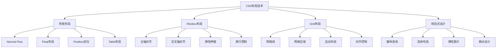
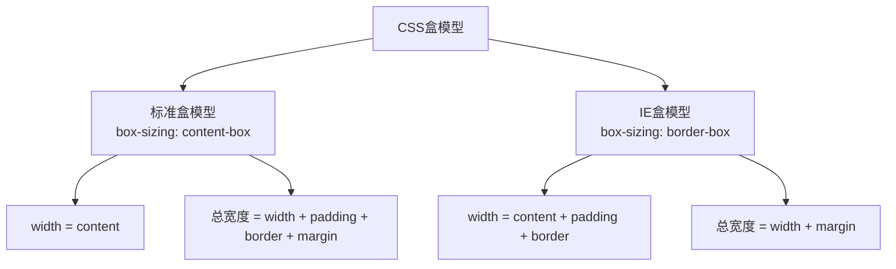
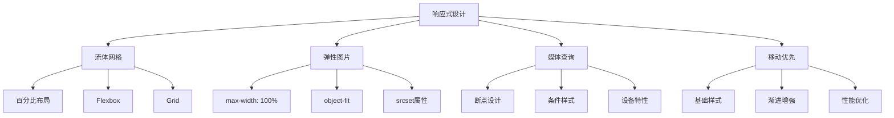

# CSS布局与响应式设计面试题

## 🎯 核心知识点

- Flexbox布局系统
- Grid网格布局
- 响应式设计原理
- CSS盒模型
- 定位机制
- 媒体查询

## 📊 CSS布局技术关联图



## 💡 面试题目

### 🟢 初级题目

#### 1. **[初级]** 解释CSS盒模型及其两种模式

**标签**: 盒模型, box-sizing, 布局基础

**题目描述**:
请详细说明CSS盒模型的组成部分，以及标准盒模型和IE盒模型的区别。

**核心答案**:

**CSS盒模型组成**:
```css
/* 盒模型组成：从内到外 */
.box {
    content: "内容区";
    padding: 20px;    /* 内边距 */
    border: 2px solid #000;  /* 边框 */
    margin: 10px;     /* 外边距 */
}
```

**两种盒模型对比**:



**实际示例**:
```css
.standard-box {
    box-sizing: content-box; /* 默认值 */
    width: 200px;
    padding: 20px;
    border: 2px solid #333;
    margin: 10px;
    
    /* 实际占用宽度: 200 + 40 + 4 + 20 = 264px */
}

.border-box {
    box-sizing: border-box;
    width: 200px;
    padding: 20px;
    border: 2px solid #333;
    margin: 10px;
    
    /* 实际占用宽度: 200 + 20 = 220px */
    /* 内容区宽度: 200 - 40 - 4 = 156px */
}
```

**最佳实践**:
```css
/* 全局设置为border-box，更直观 */
*, *::before, *::after {
    box-sizing: border-box;
}
```

**应用场景**:
- `content-box`: 需要精确控制内容区大小
- `border-box`: 响应式设计，更直观的尺寸控制

---

#### 2. **[初级]** Flexbox的基本概念和常用属性

**标签**: Flexbox, 弹性布局, 对齐

**题目描述**:
请说明Flexbox的基本概念，并介绍主要的属性及其作用。

**核心答案**:

**Flexbox基本概念**:
```css
.container {
    display: flex; /* 或 inline-flex */
    
    /* 建立主轴和交叉轴 */
    /* 主轴：flex-direction指定的方向 */
    /* 交叉轴：垂直于主轴的方向 */
}
```

**容器属性（flex container）**:

1. **flex-direction - 主轴方向**:
```css
.container {
    flex-direction: row;         /* 默认：水平，左到右 */
    flex-direction: row-reverse; /* 水平，右到左 */
    flex-direction: column;      /* 垂直，上到下 */
    flex-direction: column-reverse; /* 垂直，下到上 */
}
```

2. **justify-content - 主轴对齐**:
```css
.container {
    justify-content: flex-start;    /* 起点对齐 */
    justify-content: flex-end;      /* 终点对齐 */
    justify-content: center;        /* 居中对齐 */
    justify-content: space-between; /* 两端对齐 */
    justify-content: space-around;  /* 环绕对齐 */
    justify-content: space-evenly;  /* 均匀分布 */
}
```

3. **align-items - 交叉轴对齐**:
```css
.container {
    align-items: stretch;    /* 默认：拉伸填满 */
    align-items: flex-start; /* 起点对齐 */
    align-items: flex-end;   /* 终点对齐 */
    align-items: center;     /* 居中对齐 */
    align-items: baseline;   /* 基线对齐 */
}
```

**项目属性（flex items）**:

1. **flex-grow - 放大比例**:
```css
.item {
    flex-grow: 0; /* 默认：不放大 */
    flex-grow: 1; /* 等比例放大 */
    flex-grow: 2; /* 放大比例为2 */
}
```

2. **flex-shrink - 缩小比例**:
```css
.item {
    flex-shrink: 1; /* 默认：等比例缩小 */
    flex-shrink: 0; /* 不缩小 */
}
```

3. **flex-basis - 基准大小**:
```css
.item {
    flex-basis: auto;  /* 默认：项目本来大小 */
    flex-basis: 200px; /* 固定基准大小 */
    flex-basis: 30%;   /* 百分比基准大小 */
}
```

**实用布局示例**:

```css
/* 水平居中 */
.horizontal-center {
    display: flex;
    justify-content: center;
}

/* 垂直居中 */
.vertical-center {
    display: flex;
    align-items: center;
}

/* 完全居中 */
.center {
    display: flex;
    justify-content: center;
    align-items: center;
}

/* 两端对齐导航 */
.navbar {
    display: flex;
    justify-content: space-between;
    align-items: center;
}

/* 等高列布局 */
.equal-height {
    display: flex;
    /* align-items默认为stretch */
}

/* 底部对齐 */
.bottom-align {
    display: flex;
    align-items: flex-end;
}
```

---

### 🟡 中级题目

#### 3. **[中级]** Grid布局系统详解

**标签**: Grid, 二维布局, 网格系统

**题目描述**:
请详细说明CSS Grid的特点、基本概念和实际应用场景。

**核心答案**:

**Grid vs Flexbox**:

| 特性 | Grid | Flexbox |
|------|------|---------|
| 维度 | 二维（行+列） | 一维（行或列） |
| 适用场景 | 整体布局 | 组件内部布局 |
| 对齐控制 | 更精确 | 相对简单 |
| 浏览器支持 | 较新 | 更广泛 |

**Grid基本概念**:

```css
.container {
    display: grid;
    
    /* 定义网格轨道 */
    grid-template-columns: repeat(3, 1fr); /* 3列等宽 */
    grid-template-rows: 100px auto 100px;  /* 3行 */
    
    /* 网格间距 */
    gap: 20px; /* 行列间距都是20px */
    grid-row-gap: 10px;    /* 行间距 */
    grid-column-gap: 15px; /* 列间距 */
}
```

**网格线命名和引用**:
```css
.container {
    display: grid;
    grid-template-columns: [sidebar-start] 250px [sidebar-end main-start] 1fr [main-end];
    grid-template-rows: [header-start] 80px [header-end content-start] 1fr [content-end footer-start] 60px [footer-end];
}

.sidebar {
    grid-column: sidebar-start / sidebar-end;
    grid-row: content-start / content-end;
}

.main {
    grid-column: main-start / main-end;
    grid-row: content-start / content-end;
}
```

**网格区域模板**:
```css
.container {
    display: grid;
    grid-template-columns: 250px 1fr;
    grid-template-rows: 80px 1fr 60px;
    grid-template-areas: 
        "sidebar header"
        "sidebar main"
        "sidebar footer";
}

.sidebar { grid-area: sidebar; }
.header  { grid-area: header; }
.main    { grid-area: main; }
.footer  { grid-area: footer; }
```

**响应式Grid布局**:
```css
.responsive-grid {
    display: grid;
    grid-template-columns: repeat(auto-fit, minmax(300px, 1fr));
    gap: 20px;
}

/* 复杂响应式布局 */
.complex-layout {
    display: grid;
    grid-template-columns: repeat(12, 1fr);
    gap: 20px;
}

.item-1 { grid-column: 1 / 5; }   /* 占4列 */
.item-2 { grid-column: 5 / 9; }   /* 占4列 */  
.item-3 { grid-column: 9 / 13; }  /* 占4列 */

@media (max-width: 768px) {
    .item-1, .item-2, .item-3 {
        grid-column: 1 / 13; /* 全宽 */
    }
}
```

**Grid实用功能**:

1. **自动填充网格**:
```css
.auto-grid {
    display: grid;
    grid-template-columns: repeat(auto-fill, minmax(200px, 1fr));
    grid-auto-rows: 200px;
}
```

2. **网格对齐**:
```css
.aligned-grid {
    display: grid;
    
    /* 网格容器内对齐 */
    justify-content: center;  /* 水平对齐网格 */
    align-content: center;    /* 垂直对齐网格 */
    
    /* 网格项目内对齐 */
    justify-items: center;    /* 项目水平对齐 */
    align-items: center;      /* 项目垂直对齐 */
}

.item {
    /* 单独项目对齐 */
    justify-self: end;
    align-self: start;
}
```

---

#### 4. **[中级]** 响应式设计最佳实践

**标签**: 响应式设计, 媒体查询, 移动优先

**题目描述**:
请说明响应式设计的核心原理和实现方法，包括断点设计和最佳实践。

**核心答案**:

**响应式设计核心原理**:



**断点设计策略**:

```css
/* 移动优先的断点设计 */
:root {
    --breakpoint-sm: 576px;   /* 小型设备 */
    --breakpoint-md: 768px;   /* 平板设备 */
    --breakpoint-lg: 992px;   /* 桌面设备 */
    --breakpoint-xl: 1200px;  /* 大屏设备 */
    --breakpoint-xxl: 1400px; /* 超大屏 */
}

/* 基础样式 - 移动设备 */
.container {
    width: 100%;
    padding: 0 16px;
}

.grid {
    display: grid;
    grid-template-columns: 1fr;
    gap: 16px;
}

/* 小型设备及以上 */
@media (min-width: 576px) {
    .container {
        max-width: 540px;
        margin: 0 auto;
    }
}

/* 平板设备及以上 */
@media (min-width: 768px) {
    .container {
        max-width: 720px;
        padding: 0 24px;
    }
    
    .grid {
        grid-template-columns: repeat(2, 1fr);
        gap: 24px;
    }
}

/* 桌面设备及以上 */
@media (min-width: 992px) {
    .container {
        max-width: 960px;
    }
    
    .grid {
        grid-template-columns: repeat(3, 1fr);
        gap: 32px;
    }
}

/* 大屏设备及以上 */
@media (min-width: 1200px) {
    .container {
        max-width: 1140px;
    }
    
    .grid {
        grid-template-columns: repeat(4, 1fr);
    }
}
```

**弹性图片和媒体**:

```css
/* 基础响应式图片 */
img {
    max-width: 100%;
    height: auto;
    display: block;
}

/* 使用object-fit控制图片显示 */
.image-container {
    width: 100%;
    height: 200px;
    overflow: hidden;
}

.image-container img {
    width: 100%;
    height: 100%;
    object-fit: cover;     /* 保持比例，裁剪超出部分 */
    object-fit: contain;   /* 保持比例，完整显示 */
    object-fit: fill;      /* 拉伸填满容器 */
    object-position: center; /* 定位焦点 */
}

/* 响应式视频 */
.video-container {
    position: relative;
    width: 100%;
    padding-bottom: 56.25%; /* 16:9比例 */
    height: 0;
}

.video-container iframe {
    position: absolute;
    top: 0;
    left: 0;
    width: 100%;
    height: 100%;
}
```

**高级媒体查询技巧**:

```css
/* 设备方向 */
@media (orientation: landscape) {
    .landscape-only { display: block; }
}

@media (orientation: portrait) {
    .portrait-only { display: block; }
}

/* 设备像素密度 */
@media (-webkit-min-device-pixel-ratio: 2), (min-resolution: 192dpi) {
    .high-dpi-image {
        background-image: url('image@2x.png');
        background-size: 100% 100%;
    }
}

/* 用户偏好 */
@media (prefers-color-scheme: dark) {
    :root {
        --bg-color: #1a1a1a;
        --text-color: #ffffff;
    }
}

@media (prefers-reduced-motion: reduce) {
    * {
        animation-duration: 0.01ms !important;
        animation-iteration-count: 1 !important;
        transition-duration: 0.01ms !important;
    }
}

/* 悬停支持检测 */
@media (hover: hover) {
    .hover-effect:hover {
        transform: scale(1.05);
    }
}

@media (hover: none) {
    .touch-alternative {
        display: block;
    }
}
```

**容器查询（Container Queries）**:

```css
/* 现代CSS的容器查询 */
.card-container {
    container-type: inline-size;
    container-name: card;
}

@container card (min-width: 300px) {
    .card {
        display: flex;
        flex-direction: row;
    }
}

@container card (min-width: 500px) {
    .card {
        padding: 2rem;
    }
    
    .card-image {
        flex: 1;
    }
    
    .card-content {
        flex: 2;
    }
}
```

**响应式字体**:

```css
/* 流体字体大小 */
h1 {
    font-size: clamp(1.5rem, 4vw, 3rem);
    /* 最小1.5rem，最大3rem，中间根据视口宽度调整 */
}

/* 基于容器的字体缩放 */
.text-content {
    font-size: calc(1rem + 0.5vw);
    line-height: calc(1.4 + 0.2vw);
}

/* 响应式字体系统 */
:root {
    --font-size-sm: clamp(0.875rem, 0.8rem + 0.375vw, 1rem);
    --font-size-base: clamp(1rem, 0.9rem + 0.5vw, 1.25rem);
    --font-size-lg: clamp(1.25rem, 1.1rem + 0.75vw, 1.75rem);
    --font-size-xl: clamp(1.75rem, 1.5rem + 1.25vw, 2.5rem);
}
```

**性能优化**:

```css
/* 关键CSS内联 */
/* 首屏关键样式应该内联在HTML中 */

/* 非关键CSS异步加载 */
/* <link rel="preload" href="styles.css" as="style" onload="this.onload=null;this.rel='stylesheet'"> */

/* 条件加载样式 */
@media (min-width: 992px) {
    @import url('desktop-only.css');
}

/* 减少重绘和回流 */
.optimized-animation {
    will-change: transform;
    transform: translateZ(0); /* 触发硬件加速 */
}
```

**最佳实践总结**:
- ✅ 移动优先设计
- ✅ 渐进增强而非优雅降级
- ✅ 使用相对单位（rem, em, vw, vh）
- ✅ 测试真实设备而非仅仅浏览器开发工具
- ✅ 考虑性能，避免过度复杂的响应式逻辑
- ✅ 关注可访问性和用户体验

---

## 🔗 相关链接

- [← 返回前端题库](./README.md)
- [JavaScript核心概念](./javascript-core.md)
- [React基础概念](./react-basics.md)
- [性能优化指南](./performance-optimization.md)

---

*现代CSS布局功能强大，建议在实际项目中多加练习以熟练掌握* 