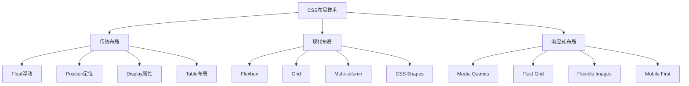

# CSS布局与响应式设计面试题

## 🎯 核心知识点

- CSS盒模型与布局原理
- Flexbox弹性布局
- Grid网格布局
- 响应式设计策略
- CSS预处理器
- 现代CSS特性

## 📊 CSS布局技术演进图



## 💡 面试题目

### 🟢 初级题目

#### 1. **[初级]** CSS盒模型和布局基础

**标签**: 盒模型, 标准流, 浮动, 定位

**题目描述**:
请详细说明CSS盒模型的组成，以及不同布局方式的特点和使用场景。

**核心答案**:

**CSS盒模型详解**:

```css
/* 标准盒模型 vs IE盒模型 */
.standard-box {
    box-sizing: content-box; /* 默认值 */
    width: 200px;
    padding: 20px;
    border: 5px solid #ccc;
    margin: 10px;
    /* 实际宽度 = 200 + 20*2 + 5*2 = 250px */
}

.border-box {
    box-sizing: border-box;
    width: 200px;
    padding: 20px;
    border: 5px solid #ccc;
    margin: 10px;
    /* 实际宽度 = 200px (包含padding和border) */
    /* 内容宽度 = 200 - 20*2 - 5*2 = 150px */
}

/* 全局设置border-box */
*, *::before, *::after {
    box-sizing: border-box;
}
```

**布局方式对比**:

```css
/* 1. 标准文档流 */
.normal-flow {
    /* 块级元素：独占一行，可设置宽高 */
    display: block;
    width: 100%;
    height: 50px;
    margin: 10px 0;
}

.inline-element {
    /* 行内元素：不换行，不可设置宽高 */
    display: inline;
    /* width和height无效 */
    padding: 5px 10px; /* 水平padding有效，垂直padding不影响布局 */
    margin: 0 5px; /* 水平margin有效，垂直margin无效 */
}

.inline-block {
    /* 行内块元素：不换行，可设置宽高 */
    display: inline-block;
    width: 100px;
    height: 50px;
    margin: 5px;
    vertical-align: top; /* 控制垂直对齐 */
}

/* 2. 浮动布局 */
.float-container {
    /* 清除浮动的几种方法 */
}

.float-container::after {
    /* 方法1：伪元素清除浮动 */
    content: "";
    display: table;
    clear: both;
}

.clearfix {
    /* 方法2：overflow清除浮动 */
    overflow: hidden;
    zoom: 1; /* IE6/7兼容 */
}

.float-left {
    float: left;
    width: 30%;
    margin-right: 5%;
}

.float-right {
    float: right;
    width: 65%;
}

/* 3. 定位布局 */
.relative-container {
    position: relative;
    width: 300px;
    height: 200px;
    border: 1px solid #ccc;
}

.absolute-child {
    position: absolute;
    top: 50%;
    left: 50%;
    transform: translate(-50%, -50%); /* 居中技巧 */
    width: 100px;
    height: 50px;
    background: #f0f0f0;
}

.fixed-header {
    position: fixed;
    top: 0;
    left: 0;
    right: 0;
    height: 60px;
    background: #333;
    z-index: 1000;
}

.sticky-nav {
    position: sticky;
    top: 60px; /* 距离顶部60px时开始粘性定位 */
    background: #fff;
    border-bottom: 1px solid #eee;
}
```

**经典布局实现**:

```css
/* 圣杯布局 */
.holy-grail {
    min-height: 100vh;
    display: flex;
    flex-direction: column;
}

.holy-grail-header,
.holy-grail-footer {
    flex: none;
    height: 60px;
    background: #333;
    color: white;
}

.holy-grail-body {
    flex: 1;
    display: flex;
}

.holy-grail-content {
    flex: 1;
    padding: 20px;
    order: 2; /* 内容区域在中间 */
}

.holy-grail-nav {
    flex: 0 0 200px;
    background: #f0f0f0;
    order: 1; /* 导航在左侧 */
}

.holy-grail-ads {
    flex: 0 0 150px;
    background: #e0e0e0;
    order: 3; /* 广告在右侧 */
}

/* 双飞翼布局 */
.double-wing {
    width: 100%;
    float: left;
}

.double-wing-content {
    margin: 0 200px 0 150px; /* 为左右侧栏留出空间 */
    padding: 20px;
}

.double-wing-left {
    width: 150px;
    float: left;
    margin-left: -100%; /* 移动到最左侧 */
    background: #f0f0f0;
}

.double-wing-right {
    width: 200px;
    float: left;
    margin-left: -200px; /* 移动到右侧 */
    background: #e0e0e0;
}

/* 等高列布局 */
.equal-height-container {
    display: table;
    width: 100%;
    table-layout: fixed;
}

.equal-height-column {
    display: table-cell;
    vertical-align: top;
    padding: 20px;
}

.equal-height-column:nth-child(1) {
    width: 200px;
    background: #f0f0f0;
}

.equal-height-column:nth-child(2) {
    background: #fff;
}

.equal-height-column:nth-child(3) {
    width: 150px;
    background: #e0e0e0;
}
```

---

#### 2. **[初级]** Flexbox弹性布局基础

**标签**: Flexbox, 弹性容器, 弹性项目, 对齐方式

**题目描述**:
请详细说明Flexbox的工作原理，以及常用属性的作用和使用场景。

**核心答案**:

**Flexbox基础概念**:

```css
/* Flexbox容器属性 */
.flex-container {
    display: flex; /* 或 inline-flex */
    
    /* 主轴方向 */
    flex-direction: row; /* row | row-reverse | column | column-reverse */
    
    /* 换行方式 */
    flex-wrap: nowrap; /* nowrap | wrap | wrap-reverse */
    
    /* 简写：flex-direction + flex-wrap */
    flex-flow: row wrap;
    
    /* 主轴对齐方式 */
    justify-content: flex-start; /* flex-start | flex-end | center | space-between | space-around | space-evenly */
    
    /* 交叉轴对齐方式 */
    align-items: stretch; /* stretch | flex-start | flex-end | center | baseline */
    
    /* 多行交叉轴对齐 */
    align-content: stretch; /* stretch | flex-start | flex-end | center | space-between | space-around */
    
    /* 间距 */
    gap: 10px; /* 或 row-gap: 10px; column-gap: 15px; */
}

/* Flexbox项目属性 */
.flex-item {
    /* 扩展比例 */
    flex-grow: 0; /* 默认值，不扩展 */
    
    /* 收缩比例 */
    flex-shrink: 1; /* 默认值，等比收缩 */
    
    /* 基础尺寸 */
    flex-basis: auto; /* auto | 具体值 */
    
    /* 简写：flex-grow + flex-shrink + flex-basis */
    flex: 0 1 auto; /* 默认值 */
    flex: 1; /* 等同于 flex: 1 1 0% */
    flex: auto; /* 等同于 flex: 1 1 auto */
    flex: none; /* 等同于 flex: 0 0 auto */
    
    /* 单独对齐 */
    align-self: auto; /* auto | flex-start | flex-end | center | baseline | stretch */
    
    /* 排序 */
    order: 0; /* 默认值，数值越小越靠前 */
}
```

**Flexbox实用布局**:

```css
/* 1. 水平垂直居中 */
.center-container {
    display: flex;
    justify-content: center;
    align-items: center;
    min-height: 100vh;
}

.center-item {
    width: 200px;
    height: 100px;
    background: #f0f0f0;
}

/* 2. 导航栏布局 */
.navbar {
    display: flex;
    align-items: center;
    padding: 0 20px;
    background: #333;
    color: white;
}

.navbar-brand {
    font-size: 1.5em;
    font-weight: bold;
}

.navbar-nav {
    display: flex;
    list-style: none;
    margin: 0 0 0 auto; /* 推到右侧 */
    padding: 0;
    gap: 20px;
}

.navbar-nav a {
    color: white;
    text-decoration: none;
    padding: 10px 15px;
    border-radius: 4px;
    transition: background-color 0.3s;
}

.navbar-nav a:hover {
    background-color: rgba(255, 255, 255, 0.1);
}

/* 3. 卡片布局 */
.card-container {
    display: flex;
    flex-wrap: wrap;
    gap: 20px;
    padding: 20px;
}

.card {
    flex: 1 1 300px; /* 最小宽度300px，可扩展 */
    max-width: 400px; /* 最大宽度限制 */
    background: white;
    border-radius: 8px;
    box-shadow: 0 2px 10px rgba(0, 0, 0, 0.1);
    overflow: hidden;
}

.card-image {
    width: 100%;
    height: 200px;
    object-fit: cover;
}

.card-content {
    padding: 20px;
}

.card-title {
    margin: 0 0 10px 0;
    font-size: 1.2em;
    font-weight: bold;
}

.card-description {
    margin: 0 0 15px 0;
    color: #666;
    line-height: 1.5;
}

.card-actions {
    display: flex;
    justify-content: space-between;
    align-items: center;
}

/* 4. 侧边栏布局 */
.sidebar-layout {
    display: flex;
    min-height: 100vh;
}

.sidebar {
    flex: 0 0 250px;
    background: #f8f9fa;
    padding: 20px;
    border-right: 1px solid #dee2e6;
}

.main-content {
    flex: 1;
    padding: 20px;
    overflow-y: auto;
}

/* 5. 底部固定布局 */
.sticky-footer-layout {
    display: flex;
    flex-direction: column;
    min-height: 100vh;
}

.main-content {
    flex: 1;
    padding: 20px;
}

.footer {
    flex: none;
    background: #333;
    color: white;
    padding: 20px;
    text-align: center;
}

/* 6. 表单布局 */
.form-row {
    display: flex;
    gap: 15px;
    margin-bottom: 15px;
}

.form-group {
    flex: 1;
    display: flex;
    flex-direction: column;
}

.form-group.half {
    flex: 0 0 calc(50% - 7.5px);
}

.form-group.third {
    flex: 0 0 calc(33.333% - 10px);
}

.form-label {
    margin-bottom: 5px;
    font-weight: bold;
    color: #333;
}

.form-input {
    padding: 10px;
    border: 1px solid #ddd;
    border-radius: 4px;
    font-size: 14px;
}

.form-input:focus {
    outline: none;
    border-color: #007bff;
    box-shadow: 0 0 0 2px rgba(0, 123, 255, 0.25);
}

/* 7. 媒体对象布局 */
.media {
    display: flex;
    gap: 15px;
    padding: 15px;
    border-bottom: 1px solid #eee;
}

.media-object {
    flex: none;
    width: 60px;
    height: 60px;
    border-radius: 50%;
    object-fit: cover;
}

.media-body {
    flex: 1;
}

.media-heading {
    margin: 0 0 5px 0;
    font-size: 1.1em;
    font-weight: bold;
}

.media-text {
    margin: 0;
    color: #666;
    line-height: 1.4;
}

.media-meta {
    margin-top: 5px;
    font-size: 0.9em;
    color: #999;
}
```

**Flexbox响应式设计**:

```css
/* 响应式Flexbox布局 */
.responsive-container {
    display: flex;
    flex-wrap: wrap;
    gap: 20px;
    padding: 20px;
}

.responsive-item {
    flex: 1 1 300px; /* 基础宽度300px */
    min-width: 0; /* 防止内容溢出 */
    background: white;
    padding: 20px;
    border-radius: 8px;
    box-shadow: 0 2px 4px rgba(0, 0, 0, 0.1);
}

/* 移动端优化 */
@media (max-width: 768px) {
    .responsive-container {
        flex-direction: column;
        gap: 15px;
        padding: 15px;
    }
    
    .responsive-item {
        flex: none;
    }
    
    .navbar {
        flex-direction: column;
        align-items: stretch;
        gap: 10px;
    }
    
    .navbar-nav {
        margin: 0;
        flex-direction: column;
        gap: 0;
    }
    
    .form-row {
        flex-direction: column;
        gap: 10px;
    }
    
    .form-group.half,
    .form-group.third {
        flex: none;
    }
    
    .sidebar-layout {
        flex-direction: column;
    }
    
    .sidebar {
        flex: none;
        order: 2;
    }
    
    .main-content {
        order: 1;
    }
}

/* 平板端适配 */
@media (min-width: 769px) and (max-width: 1024px) {
    .responsive-item {
        flex: 1 1 calc(50% - 10px);
    }
    
    .card {
        flex: 1 1 calc(50% - 10px);
    }
}

/* 桌面端适配 */
@media (min-width: 1025px) {
    .responsive-item {
        flex: 1 1 calc(33.333% - 14px);
    }
    
    .card {
        flex: 1 1 calc(33.333% - 14px);
    }
}
```

---

### 🟡 中级题目

#### 3. **[中级]** CSS Grid网格布局系统

**标签**: Grid Layout, 网格容器, 网格项目, 区域命名

**题目描述**:
请详细说明CSS Grid的工作原理，以及如何使用Grid实现复杂的二维布局。

**核心答案**:

**Grid基础概念**:

```css
/* Grid容器属性 */
.grid-container {
    display: grid; /* 或 inline-grid */
    
    /* 定义网格轨道 */
    grid-template-columns: 200px 1fr 100px; /* 固定 自适应 固定 */
    grid-template-rows: auto 1fr auto; /* 自动 填充 自动 */
    
    /* 使用repeat函数 */
    grid-template-columns: repeat(3, 1fr); /* 三等分 */
    grid-template-columns: repeat(auto-fit, minmax(250px, 1fr)); /* 响应式 */
    grid-template-columns: repeat(auto-fill, 200px); /* 自动填充 */
    
    /* 网格间距 */
    gap: 20px; /* 或 row-gap: 15px; column-gap: 20px; */
    
    /* 对齐方式 */
    justify-items: stretch; /* start | end | center | stretch */
    align-items: stretch; /* start | end | center | stretch */
    justify-content: start; /* start | end | center | stretch | space-around | space-between | space-evenly */
    align-content: start; /* start | end | center | stretch | space-around | space-between | space-evenly */
    
    /* 简写 */
    place-items: center; /* align-items + justify-items */
    place-content: center; /* align-content + justify-content */
}

/* 区域命名 */
.grid-with-areas {
    display: grid;
    grid-template-columns: 200px 1fr 150px;
    grid-template-rows: 60px 1fr 40px;
    grid-template-areas: 
        "header header header"
        "sidebar main aside"
        "footer footer footer";
    gap: 10px;
    min-height: 100vh;
}

/* Grid项目属性 */
.grid-item {
    /* 基于线的定位 */
    grid-column-start: 1;
    grid-column-end: 3;
    grid-row-start: 2;
    grid-row-end: 4;
    
    /* 简写 */
    grid-column: 1 / 3; /* 或 1 / span 2 */
    grid-row: 2 / 4; /* 或 2 / span 2 */
    grid-area: 2 / 1 / 4 / 3; /* row-start / col-start / row-end / col-end */
    
    /* 区域命名 */
    grid-area: header; /* 使用命名区域 */
    
    /* 单独对齐 */
    justify-self: center; /* start | end | center | stretch */
    align-self: center; /* start | end | center | stretch */
    place-self: center; /* align-self + justify-self */
}
```

**Grid实用布局**:

```css
/* 1. 经典网站布局 */
.website-layout {
    display: grid;
    grid-template-columns: 200px 1fr 150px;
    grid-template-rows: 60px 1fr 40px;
    grid-template-areas: 
        "header header header"
        "nav main aside"
        "footer footer footer";
    gap: 10px;
    min-height: 100vh;
    max-width: 1200px;
    margin: 0 auto;
}

.header {
    grid-area: header;
    background: #333;
    color: white;
    display: flex;
    align-items: center;
    padding: 0 20px;
}

.nav {
    grid-area: nav;
    background: #f8f9fa;
    padding: 20px;
}

.main {
    grid-area: main;
    padding: 20px;
    overflow-y: auto;
}

.aside {
    grid-area: aside;
    background: #e9ecef;
    padding: 20px;
}

.footer {
    grid-area: footer;
    background: #6c757d;
    color: white;
    display: flex;
    align-items: center;
    justify-content: center;
}

/* 2. 响应式卡片网格 */
.card-grid {
    display: grid;
    grid-template-columns: repeat(auto-fit, minmax(300px, 1fr));
    gap: 20px;
    padding: 20px;
}

.card-item {
    background: white;
    border-radius: 8px;
    box-shadow: 0 2px 10px rgba(0, 0, 0, 0.1);
    overflow: hidden;
    transition: transform 0.3s ease;
}

.card-item:hover {
    transform: translateY(-5px);
}

/* 3. 瀑布流布局 */
.masonry-grid {
    display: grid;
    grid-template-columns: repeat(auto-fill, minmax(250px, 1fr));
    gap: 20px;
    padding: 20px;
}

.masonry-item {
    background: white;
    border-radius: 8px;
    padding: 20px;
    box-shadow: 0 2px 8px rgba(0, 0, 0, 0.1);
}

.masonry-item:nth-child(3n+1) {
    grid-row: span 2;
}

.masonry-item:nth-child(4n+2) {
    grid-row: span 3;
}

/* 4. 复杂表单布局 */
.form-grid {
    display: grid;
    grid-template-columns: repeat(12, 1fr);
    gap: 15px;
    max-width: 800px;
    margin: 0 auto;
    padding: 20px;
}

.form-title {
    grid-column: 1 / -1;
    text-align: center;
    margin-bottom: 20px;
}

.form-group-full {
    grid-column: 1 / -1;
}

.form-group-half {
    grid-column: span 6;
}

.form-group-third {
    grid-column: span 4;
}

.form-group-quarter {
    grid-column: span 3;
}

.form-actions {
    grid-column: 1 / -1;
    display: flex;
    justify-content: center;
    gap: 15px;
    margin-top: 20px;
}

/* 5. 图片画廊 */
.gallery-grid {
    display: grid;
    grid-template-columns: repeat(auto-fit, minmax(200px, 1fr));
    grid-auto-rows: 200px;
    gap: 10px;
    padding: 20px;
}

.gallery-item {
    position: relative;
    overflow: hidden;
    border-radius: 8px;
    cursor: pointer;
}

.gallery-item img {
    width: 100%;
    height: 100%;
    object-fit: cover;
    transition: transform 0.3s ease;
}

.gallery-item:hover img {
    transform: scale(1.1);
}

/* 特殊尺寸项目 */
.gallery-item.large {
    grid-column: span 2;
    grid-row: span 2;
}

.gallery-item.wide {
    grid-column: span 2;
}

.gallery-item.tall {
    grid-row: span 2;
}

/* 6. 仪表板布局 */
.dashboard {
    display: grid;
    grid-template-columns: repeat(12, 1fr);
    grid-template-rows: repeat(8, 1fr);
    gap: 15px;
    height: 100vh;
    padding: 15px;
}

.widget {
    background: white;
    border-radius: 8px;
    padding: 20px;
    box-shadow: 0 2px 10px rgba(0, 0, 0, 0.1);
    display: flex;
    flex-direction: column;
}

.widget-header {
    display: flex;
    justify-content: space-between;
    align-items: center;
    margin-bottom: 15px;
    padding-bottom: 10px;
    border-bottom: 1px solid #eee;
}

.widget-title {
    font-size: 1.1em;
    font-weight: bold;
    margin: 0;
}

.widget-content {
    flex: 1;
    display: flex;
    align-items: center;
    justify-content: center;
}

/* 不同尺寸的小部件 */
.widget-small {
    grid-column: span 3;
    grid-row: span 2;
}

.widget-medium {
    grid-column: span 4;
    grid-row: span 3;
}

.widget-large {
    grid-column: span 6;
    grid-row: span 4;
}

.widget-wide {
    grid-column: span 8;
    grid-row: span 2;
}

.widget-tall {
    grid-column: span 3;
    grid-row: span 6;
}
```

**Grid响应式设计**:

```css
/* 响应式Grid布局 */
.responsive-grid {
    display: grid;
    grid-template-columns: repeat(auto-fit, minmax(250px, 1fr));
    gap: 20px;
    padding: 20px;
}

/* 移动端适配 */
@media (max-width: 768px) {
    .website-layout {
        grid-template-columns: 1fr;
        grid-template-areas: 
            "header"
            "main"
            "nav"
            "aside"
            "footer";
    }
    
    .form-grid {
        grid-template-columns: 1fr;
        gap: 10px;
        padding: 15px;
    }
    
    .form-group-half,
    .form-group-third,
    .form-group-quarter {
        grid-column: 1 / -1;
    }
    
    .dashboard {
        grid-template-columns: 1fr;
        grid-template-rows: auto;
        height: auto;
    }
    
    .widget-small,
    .widget-medium,
    .widget-large,
    .widget-wide,
    .widget-tall {
        grid-column: 1 / -1;
        grid-row: auto;
    }
    
    .gallery-grid {
        grid-template-columns: repeat(auto-fit, minmax(150px, 1fr));
        grid-auto-rows: 150px;
        gap: 5px;
    }
    
    .gallery-item.large,
    .gallery-item.wide,
    .gallery-item.tall {
        grid-column: span 1;
        grid-row: span 1;
    }
}

/* 平板端适配 */
@media (min-width: 769px) and (max-width: 1024px) {
    .website-layout {
        grid-template-columns: 150px 1fr;
        grid-template-areas: 
            "header header"
            "nav main"
            "footer footer";
    }
    
    .aside {
        display: none;
    }
    
    .dashboard {
        grid-template-columns: repeat(8, 1fr);
        grid-template-rows: repeat(6, 1fr);
    }
    
    .widget-large {
        grid-column: span 4;
        grid-row: span 3;
    }
    
    .widget-wide {
        grid-column: span 6;
        grid-row: span 2;
    }
}

/* 大屏幕适配 */
@media (min-width: 1400px) {
    .responsive-grid {
        grid-template-columns: repeat(auto-fit, minmax(300px, 1fr));
    }
    
    .card-grid {
        grid-template-columns: repeat(auto-fit, minmax(350px, 1fr));
    }
    
    .website-layout {
        grid-template-columns: 250px 1fr 200px;
    }
}
```

**Grid高级技巧**:

```javascript
// Grid动态布局控制
class GridLayoutManager {
    constructor(container) {
        this.container = container;
        this.items = [...container.children];
        this.setupResponsiveGrid();
        this.setupResizeObserver();
    }
    
    setupResponsiveGrid() {
        const updateGrid = () => {
            const containerWidth = this.container.offsetWidth;
            const itemMinWidth = 250;
            const gap = 20;
            
            // 计算列数
            const columns = Math.floor((containerWidth + gap) / (itemMinWidth + gap));
            
            // 更新CSS自定义属性
            this.container.style.setProperty('--grid-columns', columns);
            this.container.style.setProperty('--grid-gap', `${gap}px`);
        };
        
        updateGrid();
        window.addEventListener('resize', updateGrid);
    }
    
    setupResizeObserver() {
        if ('ResizeObserver' in window) {
            const resizeObserver = new ResizeObserver(entries => {
                for (let entry of entries) {
                    this.updateItemLayout(entry.target);
                }
            });
            
            this.items.forEach(item => {
                resizeObserver.observe(item);
            });
        }
    }
    
    updateItemLayout(item) {
        const height = item.scrollHeight;
        const baseRowHeight = 200;
        const gap = 20;
        const rowSpan = Math.ceil((height + gap) / (baseRowHeight + gap));
        
        item.style.gridRowEnd = `span ${rowSpan}`;
    }
    
    addItem(element) {
        this.container.appendChild(element);
        this.items.push(element);
        this.updateItemLayout(element);
    }
    
    removeItem(element) {
        const index = this.items.indexOf(element);
        if (index > -1) {
            this.items.splice(index, 1);
            element.remove();
        }
    }
}

// 使用示例
const gridManager = new GridLayoutManager(document.querySelector('.dynamic-grid'));
```

---

## 🔗 相关链接

- [← 返回前端题库](./README.md)
- [HTML语义化](./html-semantics.md)
- [JavaScript核心概念](./javascript-core.md)
- [响应式设计](./responsive-design.md)

---

*CSS布局是前端开发的核心技能，掌握现代布局技术能够高效实现各种复杂的页面结构* 