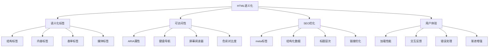
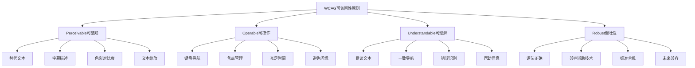

# HTML语义化与可访问性面试题

## 🎯 核心知识点

- HTML5语义化标签
- 可访问性基础概念
- ARIA属性应用
- SEO优化实践
- 表单可访问性
- 键盘导航支持

## 📊 HTML语义化体系图



## 💡 面试题目

### 🟢 初级题目

#### 1. **[初级]** 什么是HTML语义化？为什么要使用语义化标签？

**标签**: HTML5, 语义化, 最佳实践

**题目描述**:
请解释HTML语义化的概念，并说明使用语义化标签的好处。

**核心答案**:

**HTML语义化定义**: 使用恰当的HTML标签来描述内容的含义和结构，而不仅仅是外观。

**语义化标签对比**:

```html
<!-- ❌ 非语义化写法 -->
<div class="header">
    <div class="nav">
        <div class="nav-item">首页</div>
        <div class="nav-item">关于</div>
    </div>
</div>

<div class="main">
    <div class="article">
        <div class="title">文章标题</div>
        <div class="content">文章内容...</div>
    </div>
    <div class="sidebar">侧边栏内容</div>
</div>

<div class="footer">页脚信息</div>

<!-- ✅ 语义化写法 -->
<header>
    <nav>
        <a href="/">首页</a>
        <a href="/about">关于</a>
    </nav>
</header>

<main>
    <article>
        <h1>文章标题</h1>
        <section>
            <p>文章内容...</p>
        </section>
    </article>
    <aside>侧边栏内容</aside>
</main>

<footer>页脚信息</footer>
```

**常用HTML5语义化标签**:

```html
<!-- 页面结构标签 -->
<header>    <!-- 页眉 -->
<nav>       <!-- 导航 -->
<main>      <!-- 主要内容 -->
<aside>     <!-- 侧边栏 -->
<footer>    <!-- 页脚 -->
<section>   <!-- 内容区块 -->
<article>   <!-- 独立文章 -->

<!-- 内容标签 -->
<figure>    <!-- 图表容器 -->
    
    <figcaption>2023年销售数据</figcaption>
</figure>

<details>   <!-- 可折叠详情 -->
    <summary>点击查看详情</summary>
    <p>详细内容...</p>
</details>

<mark>      <!-- 高亮文本 -->
<time>      <!-- 时间日期 -->
<progress>  <!-- 进度条 -->
<meter>     <!-- 度量值 -->

<!-- 表单标签 -->
<fieldset>  <!-- 表单分组 -->
    <legend>个人信息</legend>
    <label for="name">姓名:</label>
    <input type="text" id="name" name="name">
</fieldset>
```

**语义化的好处**:

1. **可访问性提升**:
```html
<!-- 屏幕阅读器可以正确理解内容结构 -->
<nav aria-label="主导航">
    <ul>
        <li><a href="/" aria-current="page">首页</a></li>
        <li><a href="/products">产品</a></li>
        <li><a href="/contact">联系我们</a></li>
    </ul>
</nav>
```

2. **SEO优化**:
```html
<!-- 搜索引擎更好理解页面结构 -->
<article>
    <header>
        <h1>如何提高网站性能</h1>
        <time datetime="2023-12-01">2023年12月1日</time>
        <address>作者: <a href="/author/john">John Doe</a></address>
    </header>
    
    <section>
        <h2>前端优化技巧</h2>
        <p>内容...</p>
    </section>
</article>
```

3. **代码可维护性**:
```html
<!-- 语义化标签使代码更易理解 -->
<main>
    <section class="hero">
        <h1>欢迎来到我们的网站</h1>
        <p>提供最优质的服务</p>
    </section>
    
    <section class="features">
        <h2>我们的特色</h2>
        <article class="feature">
            <h3>快速</h3>
            <p>极速响应</p>
        </article>
    </section>
</main>
```

---

#### 2. **[初级]** 什么是Web可访问性？如何提高网站的可访问性？

**标签**: 可访问性, WCAG, 无障碍设计

**题目描述**:
请解释Web可访问性的重要性，并介绍提高网站可访问性的具体方法。

**核心答案**:

**Web可访问性定义**: 确保残障人士和其他用户能够平等地访问和使用网站的能力。

**WCAG四大原则**:



**具体实现方法**:

**1. 图片和媒体可访问性**:
```html
<!-- 有意义的图片 -->


<!-- 装饰性图片 -->


<!-- 复杂图表 -->
<figure>
    
    <figcaption>
        详细数据: Q1: 100万, Q2: 150万, Q3: 200万, Q4: 250万
    </figcaption>
</figure>

<!-- 视频字幕 -->
<video controls>
    <source src="video.mp4" type="video/mp4">
    <track kind="captions" src="captions.vtt" srclang="zh" label="中文字幕">
    <track kind="descriptions" src="descriptions.vtt" srclang="zh" label="音频描述">
</video>
```

**2. 键盘导航支持**:
```html
<!-- 可聚焦元素 -->
<button type="button" onclick="handleClick()">点击按钮</button>

<!-- 自定义可聚焦元素 -->
<div tabindex="0" role="button" onclick="handleClick()" onkeydown="handleKeydown(event)">
    自定义按钮
</div>

<!-- 跳过链接 -->
<a href="#main-content" class="skip-link">跳过导航</a>

<nav>导航内容...</nav>

<main id="main-content">
    主要内容...
</main>
```

```css
/* 跳过链接样式 */
.skip-link {
    position: absolute;
    top: -40px;
    left: 6px;
    background: #000;
    color: #fff;
    padding: 8px;
    text-decoration: none;
    z-index: 9999;
}

.skip-link:focus {
    top: 6px;
}

/* 焦点指示器 */
:focus {
    outline: 2px solid #0066cc;
    outline-offset: 2px;
}

/* 高对比度模式支持 */
@media (prefers-contrast: high) {
    .button {
        border: 2px solid;
    }
}
```

**3. ARIA属性应用**:
```html
<!-- 标签和描述 -->
<label for="email">邮箱地址</label>
<input type="email" id="email" aria-describedby="email-help" required>
<div id="email-help">请输入有效的邮箱地址</div>

<!-- 状态指示 -->
<button aria-pressed="false" onclick="toggleButton(this)">
    切换按钮
</button>

<!-- 展开/折叠 -->
<button aria-expanded="false" aria-controls="menu" onclick="toggleMenu()">
    菜单
</button>
<ul id="menu" hidden>
    <li><a href="/">首页</a></li>
    <li><a href="/about">关于</a></li>
</ul>

<!-- 进度指示 -->
<div role="progressbar" aria-valuenow="70" aria-valuemin="0" aria-valuemax="100">
    <div style="width: 70%">70%</div>
</div>

<!-- 实时区域 -->
<div aria-live="polite" id="status"></div>
<div aria-live="assertive" id="alert"></div>
```

**4. 表单可访问性**:
```html
<form>
    <fieldset>
        <legend>个人信息</legend>
        
        <!-- 必填字段 -->
        <label for="name">
            姓名 <span aria-label="必填">*</span>
        </label>
        <input type="text" id="name" name="name" required aria-invalid="false">
        
        <!-- 错误提示 -->
        <label for="phone">电话号码</label>
        <input type="tel" id="phone" name="phone" aria-describedby="phone-error" aria-invalid="true">
        <div id="phone-error" role="alert">请输入有效的电话号码</div>
        
        <!-- 单选按钮组 -->
        <fieldset>
            <legend>性别</legend>
            <input type="radio" id="male" name="gender" value="male">
            <label for="male">男</label>
            <input type="radio" id="female" name="gender" value="female">
            <label for="female">女</label>
        </fieldset>
    </fieldset>
    
    <button type="submit">提交</button>
</form>
```

**5. 色彩和对比度**:
```css
/* 确保足够的对比度 */
.text-normal {
    color: #333333;        /* 对比度 12.6:1 */
    background: #ffffff;
}

.text-large {
    color: #666666;        /* 大文本可以使用较低对比度 3:1 */
    background: #ffffff;
    font-size: 18px;
    font-weight: bold;
}

/* 不仅依赖颜色传达信息 */
.error {
    color: #d32f2f;
    border-left: 4px solid #d32f2f; /* 额外的视觉提示 */
}

.error::before {
    content: "⚠ ";         /* 图标提示 */
}

/* 用户偏好设置支持 */
@media (prefers-reduced-motion: reduce) {
    * {
        animation-duration: 0.01ms !important;
        animation-iteration-count: 1 !important;
        transition-duration: 0.01ms !important;
    }
}

@media (prefers-color-scheme: dark) {
    :root {
        --bg-color: #121212;
        --text-color: #ffffff;
    }
}
```

**JavaScript可访问性支持**:
```javascript
// 焦点管理
function trapFocus(element) {
    const focusableElements = element.querySelectorAll(
        'button, [href], input, select, textarea, [tabindex]:not([tabindex="-1"])'
    );
    const firstElement = focusableElements[0];
    const lastElement = focusableElements[focusableElements.length - 1];
    
    element.addEventListener('keydown', (e) => {
        if (e.key === 'Tab') {
            if (e.shiftKey) {
                if (document.activeElement === firstElement) {
                    lastElement.focus();
                    e.preventDefault();
                }
            } else {
                if (document.activeElement === lastElement) {
                    firstElement.focus();
                    e.preventDefault();
                }
            }
        }
    });
}

// 屏幕阅读器通知
function announceToScreenReader(message) {
    const announcement = document.createElement('div');
    announcement.setAttribute('aria-live', 'assertive');
    announcement.setAttribute('aria-atomic', 'true');
    announcement.style.position = 'absolute';
    announcement.style.left = '-10000px';
    announcement.textContent = message;
    
    document.body.appendChild(announcement);
    
    setTimeout(() => {
        document.body.removeChild(announcement);
    }, 1000);
}

// 键盘事件处理
function handleKeyboardNavigation(event) {
    switch(event.key) {
        case 'Enter':
        case ' ':
            // 空格键和回车键激活
            event.target.click();
            event.preventDefault();
            break;
        case 'Escape':
            // ESC键关闭弹窗
            closeModal();
            break;
        case 'ArrowUp':
        case 'ArrowDown':
            // 方向键导航
            navigateMenu(event.key);
            event.preventDefault();
            break;
    }
}
```

**可访问性检测工具**:
```javascript
// 自动化检测（使用axe-core）
async function checkAccessibility() {
    const results = await axe.run();
    
    if (results.violations.length > 0) {
        console.group('可访问性问题:');
        results.violations.forEach(violation => {
            console.error(violation.description);
            violation.nodes.forEach(node => {
                console.log('元素:', node.target);
                console.log('修复建议:', node.failureSummary);
            });
        });
        console.groupEnd();
    }
}
```

**最佳实践总结**:
- ✅ 使用语义化HTML标签
- ✅ 提供有意义的替代文本
- ✅ 确保键盘可访问性
- ✅ 维护足够的色彩对比度
- ✅ 使用ARIA属性补充语义
- ✅ 提供清晰的错误信息
- ✅ 测试屏幕阅读器兼容性

---

### 🟡 中级题目

#### 3. **[中级]** 如何实现一个可访问的模态框组件？

**标签**: 模态框, 焦点管理, ARIA, 键盘导航

**题目描述**:
请实现一个完全可访问的模态框组件，包括焦点管理、键盘导航和屏幕阅读器支持。

**核心答案**:

```html
<!-- 模态框HTML结构 -->
<button id="open-modal" onclick="openModal()">打开模态框</button>

<div id="modal" class="modal" role="dialog" aria-labelledby="modal-title" aria-describedby="modal-description" aria-hidden="true">
    <div class="modal-overlay" onclick="closeModal()"></div>
    <div class="modal-content">
        <header class="modal-header">
            <h2 id="modal-title">模态框标题</h2>
            <button class="modal-close" onclick="closeModal()" aria-label="关闭模态框">
                <span aria-hidden="true">&times;</span>
            </button>
        </header>
        
        <div class="modal-body">
            <p id="modal-description">这里是模态框的描述内容。</p>
            
            <form>
                <label for="modal-input">输入内容:</label>
                <input type="text" id="modal-input" name="input">
                
                <button type="submit">确认</button>
                <button type="button" onclick="closeModal()">取消</button>
            </form>
        </div>
    </div>
</div>
```

```css
/* 模态框样式 */
.modal {
    position: fixed;
    top: 0;
    left: 0;
    width: 100%;
    height: 100%;
    z-index: 1000;
    display: none;
}

.modal[aria-hidden="false"] {
    display: flex;
    align-items: center;
    justify-content: center;
}

.modal-overlay {
    position: absolute;
    top: 0;
    left: 0;
    width: 100%;
    height: 100%;
    background: rgba(0, 0, 0, 0.5);
}

.modal-content {
    position: relative;
    background: white;
    border-radius: 8px;
    box-shadow: 0 4px 20px rgba(0, 0, 0, 0.3);
    max-width: 500px;
    max-height: 90vh;
    overflow-y: auto;
    margin: 20px;
}

.modal-header {
    display: flex;
    justify-content: space-between;
    align-items: center;
    padding: 20px;
    border-bottom: 1px solid #eee;
}

.modal-close {
    background: none;
    border: none;
    font-size: 24px;
    cursor: pointer;
    padding: 4px;
    border-radius: 4px;
}

.modal-close:hover,
.modal-close:focus {
    background: #f5f5f5;
    outline: 2px solid #0066cc;
}

.modal-body {
    padding: 20px;
}

/* 焦点指示器 */
.modal :focus {
    outline: 2px solid #0066cc;
    outline-offset: 2px;
}

/* 减少动效（用户偏好） */
@media (prefers-reduced-motion: reduce) {
    .modal {
        transition: none;
    }
}
```

```javascript
class AccessibleModal {
    constructor(modalId) {
        this.modal = document.getElementById(modalId);
        this.focusedElementBeforeModal = null;
        this.focusableElements = [];
        this.firstFocusableElement = null;
        this.lastFocusableElement = null;
        
        this.init();
    }
    
    init() {
        // 绑定事件监听器
        this.bindEvents();
        
        // 初始化可聚焦元素
        this.updateFocusableElements();
    }
    
    bindEvents() {
        // ESC键关闭
        document.addEventListener('keydown', (e) => {
            if (e.key === 'Escape' && this.isOpen()) {
                this.close();
            }
        });
        
        // Tab键焦点循环
        this.modal.addEventListener('keydown', (e) => {
            if (e.key === 'Tab') {
                this.handleTabKey(e);
            }
        });
        
        // 点击遮罩关闭
        this.modal.querySelector('.modal-overlay').addEventListener('click', () => {
            this.close();
        });
        
        // 阻止内容区域点击事件冒泡
        this.modal.querySelector('.modal-content').addEventListener('click', (e) => {
            e.stopPropagation();
        });
    }
    
    open() {
        // 保存当前焦点元素
        this.focusedElementBeforeModal = document.activeElement;
        
        // 显示模态框
        this.modal.style.display = 'flex';
        this.modal.setAttribute('aria-hidden', 'false');
        
        // 更新可聚焦元素列表
        this.updateFocusableElements();
        
        // 设置初始焦点
        if (this.firstFocusableElement) {
            this.firstFocusableElement.focus();
        }
        
        // 禁用背景页面滚动
        document.body.style.overflow = 'hidden';
        
        // 通知屏幕阅读器
        this.announceToScreenReader('模态框已打开');
        
        // 添加到可访问性树
        this.modal.setAttribute('role', 'dialog');
        
        // 触发自定义事件
        this.modal.dispatchEvent(new CustomEvent('modal:opened'));
    }
    
    close() {
        // 隐藏模态框
        this.modal.style.display = 'none';
        this.modal.setAttribute('aria-hidden', 'true');
        
        // 恢复背景页面滚动
        document.body.style.overflow = '';
        
        // 恢复焦点
        if (this.focusedElementBeforeModal) {
            this.focusedElementBeforeModal.focus();
        }
        
        // 通知屏幕阅读器
        this.announceToScreenReader('模态框已关闭');
        
        // 触发自定义事件
        this.modal.dispatchEvent(new CustomEvent('modal:closed'));
    }
    
    isOpen() {
        return this.modal.getAttribute('aria-hidden') === 'false';
    }
    
    updateFocusableElements() {
        const focusableSelectors = [
            'button:not([disabled])',
            '[href]',
            'input:not([disabled])',
            'select:not([disabled])',
            'textarea:not([disabled])',
            '[tabindex]:not([tabindex="-1"]):not([disabled])',
            '[contenteditable="true"]'
        ].join(', ');
        
        this.focusableElements = Array.from(
            this.modal.querySelectorAll(focusableSelectors)
        ).filter(element => {
            return element.offsetWidth > 0 && element.offsetHeight > 0;
        });
        
        this.firstFocusableElement = this.focusableElements[0];
        this.lastFocusableElement = this.focusableElements[this.focusableElements.length - 1];
    }
    
    handleTabKey(e) {
        if (this.focusableElements.length === 0) return;
        
        if (e.shiftKey) {
            // Shift + Tab: 向前导航
            if (document.activeElement === this.firstFocusableElement) {
                this.lastFocusableElement.focus();
                e.preventDefault();
            }
        } else {
            // Tab: 向后导航
            if (document.activeElement === this.lastFocusableElement) {
                this.firstFocusableElement.focus();
                e.preventDefault();
            }
        }
    }
    
    announceToScreenReader(message) {
        const announcement = document.createElement('div');
        announcement.setAttribute('aria-live', 'assertive');
        announcement.setAttribute('aria-atomic', 'true');
        announcement.className = 'sr-only';
        announcement.textContent = message;
        
        document.body.appendChild(announcement);
        
        setTimeout(() => {
            if (document.body.contains(announcement)) {
                document.body.removeChild(announcement);
            }
        }, 1000);
    }
    
    // 动态设置标题和内容
    setTitle(title) {
        const titleElement = this.modal.querySelector('#modal-title');
        if (titleElement) {
            titleElement.textContent = title;
        }
    }
    
    setContent(content) {
        const contentElement = this.modal.querySelector('.modal-body');
        if (contentElement) {
            if (typeof content === 'string') {
                contentElement.innerHTML = content;
            } else {
                contentElement.innerHTML = '';
                contentElement.appendChild(content);
            }
            // 内容更新后重新获取可聚焦元素
            this.updateFocusableElements();
        }
    }
}

// 使用示例
const modal = new AccessibleModal('modal');

function openModal() {
    modal.open();
}

function closeModal() {
    modal.close();
}

// 监听模态框事件
modal.modal.addEventListener('modal:opened', () => {
    console.log('模态框已打开');
});

modal.modal.addEventListener('modal:closed', () => {
    console.log('模态框已关闭');
});
```

```css
/* 屏幕阅读器专用样式 */
.sr-only {
    position: absolute !important;
    width: 1px !important;
    height: 1px !important;
    padding: 0 !important;
    margin: -1px !important;
    overflow: hidden !important;
    clip: rect(0, 0, 0, 0) !important;
    white-space: nowrap !important;
    border: 0 !important;
}
```

**高级功能扩展**:

```javascript
// 支持多个模态框堆叠
class ModalStack {
    constructor() {
        this.stack = [];
        this.baseZIndex = 1000;
    }
    
    push(modal) {
        this.stack.push(modal);
        modal.modal.style.zIndex = this.baseZIndex + this.stack.length;
    }
    
    pop() {
        return this.stack.pop();
    }
    
    getCurrent() {
        return this.stack[this.stack.length - 1];
    }
    
    isEmpty() {
        return this.stack.length === 0;
    }
}

// 响应式模态框
class ResponsiveModal extends AccessibleModal {
    constructor(modalId) {
        super(modalId);
        this.setupResponsive();
    }
    
    setupResponsive() {
        // 监听窗口大小变化
        window.addEventListener('resize', () => {
            if (this.isOpen()) {
                this.adjustModalSize();
            }
        });
        
        // 监听屏幕方向变化
        window.addEventListener('orientationchange', () => {
            setTimeout(() => {
                if (this.isOpen()) {
                    this.adjustModalSize();
                }
            }, 100);
        });
    }
    
    adjustModalSize() {
        const content = this.modal.querySelector('.modal-content');
        const windowHeight = window.innerHeight;
        const maxHeight = windowHeight * 0.9;
        
        content.style.maxHeight = `${maxHeight}px`;
    }
    
    open() {
        super.open();
        this.adjustModalSize();
    }
}
```

**可访问性检查清单**:
- ✅ 正确的ARIA属性（role、aria-labelledby、aria-describedby）
- ✅ 焦点管理（保存/恢复焦点、焦点循环）
- ✅ 键盘导航（ESC关闭、Tab循环）
- ✅ 屏幕阅读器支持（live regions、语义标签）
- ✅ 色彩对比度满足WCAG要求
- ✅ 支持用户偏好设置（减少动效）
- ✅ 背景滚动控制
- ✅ 点击遮罩关闭功能

---

## 🔗 相关链接

- [← 返回前端题库](./README.md)
- [CSS布局与响应式设计](./css-layout.md)
- [JavaScript核心概念](./javascript-core.md)
- [React基础概念](./react-basics.md)

---

*Web可访问性是每个前端开发者的责任，让我们共同创造更包容的Web环境* 