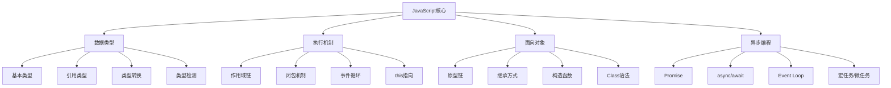
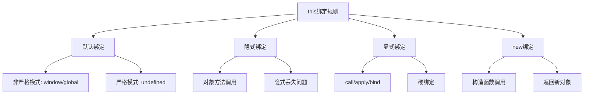
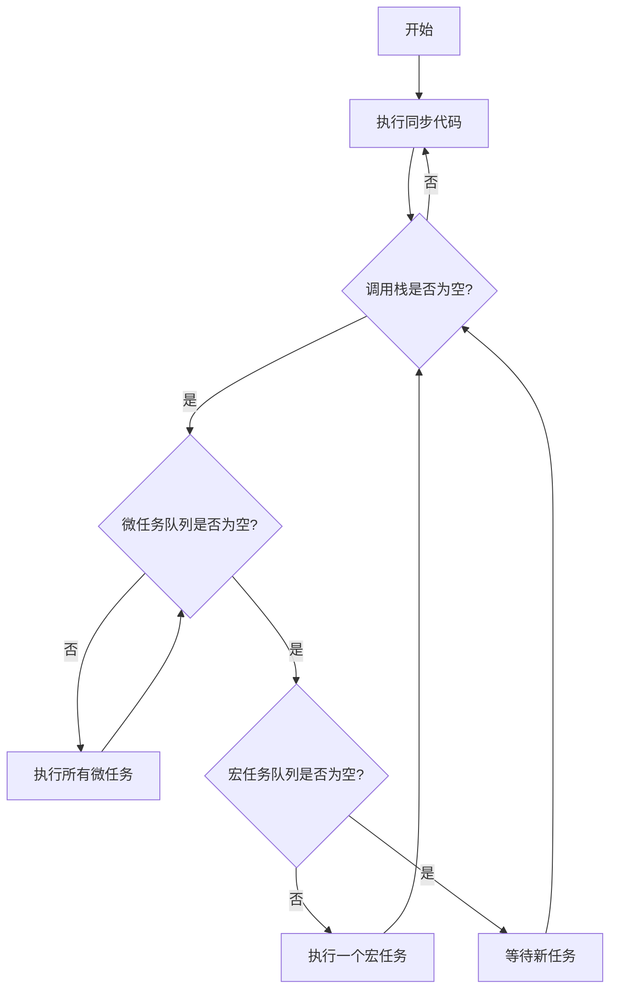

# JavaScript核心概念面试题

## 🎯 核心知识点

- 数据类型与类型转换
- 作用域与闭包
- 原型链与继承
- 异步编程
- 事件循环机制
- this指向问题

## 📊 JavaScript核心概念关联图



## 💡 面试题目

### 🟢 初级题目

#### 1. **[初级]** JavaScript有哪些数据类型？如何判断数据类型？

**标签**: 数据类型, 类型检测

**题目描述**:
请详细说明JavaScript中的数据类型，并介绍各种类型检测的方法及其适用场景。

**核心答案**:
- **基本类型(7种)**: `number`, `string`, `boolean`, `undefined`, `null`, `symbol`, `bigint`
- **引用类型**: `object`（包括Array、Function、Date等）

**类型检测方法**:
```javascript
// 1. typeof - 适用于基本类型
typeof 42          // "number"
typeof "hello"      // "string"
typeof true         // "boolean"
typeof undefined    // "undefined"
typeof null         // "object" (历史遗留问题)
typeof {}           // "object"
typeof []           // "object"
typeof function(){} // "function"

// 2. instanceof - 检测引用类型
[] instanceof Array        // true
{} instanceof Object       // true
new Date() instanceof Date // true

// 3. Object.prototype.toString.call() - 最准确
Object.prototype.toString.call([])        // "[object Array]"
Object.prototype.toString.call({})        // "[object Object]"
Object.prototype.toString.call(null)      // "[object Null]"
Object.prototype.toString.call(undefined) // "[object Undefined]"

// 4. Array.isArray() - 专门检测数组
Array.isArray([])  // true
Array.isArray({})  // false
```

**扩展思考**:
- 为什么`typeof null`返回"object"？
- 什么时候使用不同的类型检测方法？

---

#### 2. **[初级]** 解释变量提升(Hoisting)机制

**标签**: 作用域, 变量提升, 执行上下文

**题目描述**:
什么是变量提升？var、let、const在提升行为上有什么区别？

**核心答案**:

```javascript
// var的提升行为
console.log(a); // undefined (不是报错)
var a = 1;

// 等价于
var a;
console.log(a); // undefined
a = 1;

// let/const的提升行为
console.log(b); // ReferenceError: Cannot access 'b' before initialization
let b = 2;

console.log(c); // ReferenceError: Cannot access 'c' before initialization  
const c = 3;
```

**提升机制对比**:
- **var**: 声明提升，初始化为undefined
- **let/const**: 声明提升，但存在暂时性死区(TDZ)
- **function**: 整个函数体都会提升

**函数提升示例**:
```javascript
// 函数声明提升
foo(); // "Hello" - 正常执行

function foo() {
    console.log("Hello");
}

// 函数表达式不提升
bar(); // TypeError: bar is not a function
var bar = function() {
    console.log("World");
};
```

---

#### 3. **[初级]** 什么是闭包？闭包的应用场景有哪些？

**标签**: 闭包, 作用域, 内存管理

**题目描述**:
请解释闭包的概念，并给出实际应用场景和注意事项。

**核心答案**:

**闭包定义**: 函数和其词法环境的组合，使得函数可以访问其外部作用域的变量。

```javascript
function outerFunction(x) {
    // 外部函数的变量
    let outerVariable = x;
    
    // 内部函数
    function innerFunction(y) {
        console.log(outerVariable + y); // 访问外部变量
    }
    
    return innerFunction;
}

const closure = outerFunction(10);
closure(5); // 输出: 15
```

**闭包的应用场景**:

1. **模块化模式**:
```javascript
const module = (function() {
    let privateVariable = 0;
    
    return {
        increment: function() {
            privateVariable++;
        },
        getCount: function() {
            return privateVariable;
        }
    };
})();

module.increment();
console.log(module.getCount()); // 1
```

2. **函数柯里化**:
```javascript
function curry(fn) {
    return function curried(...args) {
        if (args.length >= fn.length) {
            return fn.apply(this, args);
        }
        return function(...nextArgs) {
            return curried.apply(this, args.concat(nextArgs));
        };
    };
}

const add = (a, b, c) => a + b + c;
const curriedAdd = curry(add);
console.log(curriedAdd(1)(2)(3)); // 6
```

3. **防抖和节流**:
```javascript
function debounce(func, delay) {
    let timeoutId;
    return function(...args) {
        clearTimeout(timeoutId);
        timeoutId = setTimeout(() => func.apply(this, args), delay);
    };
}
```

**注意事项**:
- 闭包会保持对外部变量的引用，可能导致内存泄漏
- 在循环中创建闭包需要特别注意变量捕获问题

---

### 🟡 中级题目

#### 4. **[中级]** 深入理解this指向问题

**标签**: this指向, 执行上下文, 绑定规则

**题目描述**:
请详细说明JavaScript中this的绑定规则，并给出各种情况下的示例。

**核心答案**:

**this绑定的四种规则**:



1. **默认绑定**:
```javascript
function foo() {
    console.log(this); // 非严格模式: window, 严格模式: undefined
}

foo(); // 独立函数调用
```

2. **隐式绑定**:
```javascript
const obj = {
    name: 'Alice',
    sayName: function() {
        console.log(this.name);
    }
};

obj.sayName(); // "Alice" - this指向obj

// 隐式丢失
const fn = obj.sayName;
fn(); // undefined - this指向window/undefined
```

3. **显式绑定**:
```javascript
const obj1 = { name: 'Alice' };
const obj2 = { name: 'Bob' };

function sayName() {
    console.log(this.name);
}

sayName.call(obj1);  // "Alice"
sayName.apply(obj2); // "Bob"

const boundFn = sayName.bind(obj1);
boundFn(); // "Alice"
```

4. **new绑定**:
```javascript
function Person(name) {
    this.name = name;
    this.sayName = function() {
        console.log(this.name);
    };
}

const person = new Person('Alice');
person.sayName(); // "Alice"
```

**箭头函数的this**:
```javascript
const obj = {
    name: 'Alice',
    regularFunction: function() {
        console.log(this.name); // "Alice"
        
        const arrowFunction = () => {
            console.log(this.name); // "Alice" - 继承外层this
        };
        arrowFunction();
    },
    arrowFunction: () => {
        console.log(this.name); // undefined - 继承全局this
    }
};
```

**优先级**: new绑定 > 显式绑定 > 隐式绑定 > 默认绑定

---

#### 5. **[中级]** 详解事件循环机制

**标签**: 事件循环, 宏任务, 微任务, 异步机制

**题目描述**:
请解释JavaScript的事件循环机制，包括宏任务和微任务的执行顺序。

**核心答案**:

**事件循环执行流程**:



**任务分类**:
- **宏任务**: setTimeout, setInterval, setImmediate, I/O, UI渲染
- **微任务**: Promise.then, queueMicrotask, MutationObserver

**经典示例**:
```javascript
console.log('1'); // 同步任务

setTimeout(() => {
    console.log('2'); // 宏任务
}, 0);

Promise.resolve().then(() => {
    console.log('3'); // 微任务
});

console.log('4'); // 同步任务

// 输出顺序: 1, 4, 3, 2
```

**复杂示例**:
```javascript
console.log('start');

setTimeout(() => {
    console.log('timer1');
    Promise.resolve().then(() => {
        console.log('promise1');
    });
}, 0);

setTimeout(() => {
    console.log('timer2');
    Promise.resolve().then(() => {
        console.log('promise2');
    });
}, 0);

Promise.resolve().then(() => {
    console.log('promise3');
    setTimeout(() => {
        console.log('timer3');
    }, 0);
});

console.log('end');

// 输出: start, end, promise3, timer1, promise1, timer2, promise2, timer3
```

**关键点**:
1. 同步代码优先执行
2. 每轮事件循环先清空所有微任务
3. 然后执行一个宏任务
4. 重复以上过程

---

### 🔴 高级题目

#### 6. **[高级]** 实现一个完整的Promise

**标签**: Promise, 异步编程, 状态机

**题目描述**:
请手动实现一个符合Promise/A+规范的Promise类，包括then、catch、finally等方法。

**核心答案**:

```javascript
class MyPromise {
    constructor(executor) {
        this.state = 'pending';
        this.value = undefined;
        this.reason = undefined;
        this.onFulfilledCallbacks = [];
        this.onRejectedCallbacks = [];

        const resolve = (value) => {
            if (this.state === 'pending') {
                this.state = 'fulfilled';
                this.value = value;
                this.onFulfilledCallbacks.forEach(fn => fn());
            }
        };

        const reject = (reason) => {
            if (this.state === 'pending') {
                this.state = 'rejected';
                this.reason = reason;
                this.onRejectedCallbacks.forEach(fn => fn());
            }
        };

        try {
            executor(resolve, reject);
        } catch (error) {
            reject(error);
        }
    }

    then(onFulfilled, onRejected) {
        // 参数默认值
        onFulfilled = typeof onFulfilled === 'function' ? onFulfilled : value => value;
        onRejected = typeof onRejected === 'function' ? onRejected : reason => { throw reason; };

        // 返回新的Promise实现链式调用
        const promise2 = new MyPromise((resolve, reject) => {
            if (this.state === 'fulfilled') {
                setTimeout(() => {
                    try {
                        const x = onFulfilled(this.value);
                        this.resolvePromise(promise2, x, resolve, reject);
                    } catch (error) {
                        reject(error);
                    }
                }, 0);
            } else if (this.state === 'rejected') {
                setTimeout(() => {
                    try {
                        const x = onRejected(this.reason);
                        this.resolvePromise(promise2, x, resolve, reject);
                    } catch (error) {
                        reject(error);
                    }
                }, 0);
            } else if (this.state === 'pending') {
                this.onFulfilledCallbacks.push(() => {
                    setTimeout(() => {
                        try {
                            const x = onFulfilled(this.value);
                            this.resolvePromise(promise2, x, resolve, reject);
                        } catch (error) {
                            reject(error);
                        }
                    }, 0);
                });

                this.onRejectedCallbacks.push(() => {
                    setTimeout(() => {
                        try {
                            const x = onRejected(this.reason);
                            this.resolvePromise(promise2, x, resolve, reject);
                        } catch (error) {
                            reject(error);
                        }
                    }, 0);
                });
            }
        });

        return promise2;
    }

    resolvePromise(promise2, x, resolve, reject) {
        // 避免循环引用
        if (promise2 === x) {
            return reject(new TypeError('Chaining cycle detected for promise'));
        }

        if (x instanceof MyPromise) {
            x.then(resolve, reject);
        } else {
            resolve(x);
        }
    }

    catch(onRejected) {
        return this.then(null, onRejected);
    }

    finally(callback) {
        return this.then(
            value => MyPromise.resolve(callback()).then(() => value),
            reason => MyPromise.resolve(callback()).then(() => { throw reason; })
        );
    }

    static resolve(value) {
        if (value instanceof MyPromise) {
            return value;
        }
        return new MyPromise(resolve => resolve(value));
    }

    static reject(reason) {
        return new MyPromise((resolve, reject) => reject(reason));
    }

    static all(promises) {
        return new MyPromise((resolve, reject) => {
            const results = [];
            let count = 0;

            if (promises.length === 0) {
                resolve(results);
                return;
            }

            promises.forEach((promise, index) => {
                MyPromise.resolve(promise).then(
                    value => {
                        results[index] = value;
                        count++;
                        if (count === promises.length) {
                            resolve(results);
                        }
                    },
                    reject
                );
            });
        });
    }

    static race(promises) {
        return new MyPromise((resolve, reject) => {
            promises.forEach(promise => {
                MyPromise.resolve(promise).then(resolve, reject);
            });
        });
    }
}
```

**使用示例**:
```javascript
// 基本使用
const promise = new MyPromise((resolve, reject) => {
    setTimeout(() => {
        resolve('success');
    }, 1000);
});

promise
    .then(value => {
        console.log(value); // "success"
        return 'next';
    })
    .then(value => {
        console.log(value); // "next"
    })
    .catch(error => {
        console.error(error);
    });
```

**关键特性**:
- 状态不可逆（pending → fulfilled/rejected）
- 支持链式调用
- 异步执行回调
- 错误传播机制

---

## 📚 扩展阅读

### 性能优化相关
- 内存泄漏的常见场景和避免方法
- JavaScript引擎的优化机制
- V8垃圾回收机制

### 现代JavaScript特性
- Generator函数和Iterator
- Proxy和Reflect API
- WebWorker和SharedArrayBuffer

## 🔗 相关链接

- [← 返回前端题库](./README.md)
- [ES6+现代特性](./javascript-es6.md)
- [浏览器原理与Web API](./browser-apis.md)
- [React基础概念](./react-basics.md)

---

*建议结合实际项目经验来理解这些概念，多做练习加深理解* 