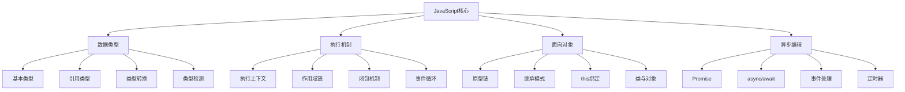

# JavaScript核心概念面试题

## 🎯 核心知识点

- 数据类型与类型转换
- 作用域与闭包
- 原型链与继承
- 异步编程模式
- 事件循环机制
- 函数式编程

## 📊 JavaScript核心概念图



## 💡 面试题目

### 🟢 初级题目

#### 1. **[初级]** JavaScript数据类型和类型转换

**标签**: 数据类型, 类型转换, typeof, instanceof

**题目描述**:
请详细说明JavaScript的数据类型，以及类型转换的规则和机制。

**核心答案**:

**JavaScript数据类型**:

```javascript
// 基本数据类型（原始类型）
const primitiveTypes = {
    // 1. Number - 数字类型
    integer: 42,
    float: 3.14,
    scientific: 1e5,
    infinity: Infinity,
    negativeInfinity: -Infinity,
    notANumber: NaN,
    
    // 2. String - 字符串类型
    singleQuote: 'Hello',
    doubleQuote: "World",
    templateLiteral: `Hello ${name}`,
    
    // 3. Boolean - 布尔类型
    trueValue: true,
    falseValue: false,
    
    // 4. Undefined - 未定义
    undefinedValue: undefined,
    
    // 5. Null - 空值
    nullValue: null,
    
    // 6. Symbol - 符号类型（ES6+）
    symbolValue: Symbol('description'),
    
    // 7. BigInt - 大整数类型（ES2020+）
    bigIntValue: 123n
};

// 引用数据类型（对象类型）
const referenceTypes = {
    // 1. Object - 对象
    plainObject: { name: 'Alice', age: 25 },
    
    // 2. Array - 数组
    arrayObject: [1, 2, 3, 'hello'],
    
    // 3. Function - 函数
    functionObject: function() { return 'Hello'; },
    arrowFunction: () => 'World',
    
    // 4. Date - 日期
    dateObject: new Date(),
    
    // 5. RegExp - 正则表达式
    regexObject: /pattern/gi,
    
    // 6. Map - 映射
    mapObject: new Map([['key', 'value']]),
    
    // 7. Set - 集合
    setObject: new Set([1, 2, 3]),
    
    // 8. Promise - 承诺
    promiseObject: Promise.resolve('data')
};

// 类型检测方法
function typeDetection() {
    const value = 'test';
    
    // 1. typeof 操作符
    console.log(typeof 42);          // "number"
    console.log(typeof 'hello');     // "string"
    console.log(typeof true);        // "boolean"
    console.log(typeof undefined);   // "undefined"
    console.log(typeof null);        // "object" (历史遗留问题)
    console.log(typeof Symbol());    // "symbol"
    console.log(typeof 123n);        // "bigint"
    console.log(typeof {});          // "object"
    console.log(typeof []);          // "object"
    console.log(typeof function(){}); // "function"
    
    // 2. instanceof 操作符
    console.log([] instanceof Array);        // true
    console.log({} instanceof Object);       // true
    console.log(new Date() instanceof Date); // true
    
    // 3. Object.prototype.toString.call()
    const getType = (value) => Object.prototype.toString.call(value);
    
    console.log(getType(42));           // "[object Number]"
    console.log(getType('hello'));      // "[object String]"
    console.log(getType(true));         // "[object Boolean]"
    console.log(getType(undefined));    // "[object Undefined]"
    console.log(getType(null));         // "[object Null]"
    console.log(getType([]));           // "[object Array]"
    console.log(getType({}));           // "[object Object]"
    console.log(getType(new Date()));   // "[object Date]"
    console.log(getType(/regex/));      // "[object RegExp]"
    
    // 4. 精确类型检测函数
    function getExactType(value) {
        return Object.prototype.toString.call(value).slice(8, -1).toLowerCase();
    }
    
    console.log(getExactType([]));      // "array"
    console.log(getExactType({}));      // "object"
    console.log(getExactType(null));    // "null"
}
```

**类型转换机制**:

```javascript
// 显式类型转换
function explicitConversion() {
    // 转换为数字
    console.log(Number('123'));      // 123
    console.log(Number('123.45'));   // 123.45
    console.log(Number('123abc'));   // NaN
    console.log(Number(''));         // 0
    console.log(Number(' '));        // 0
    console.log(Number(true));       // 1
    console.log(Number(false));      // 0
    console.log(Number(null));       // 0
    console.log(Number(undefined));  // NaN
    
    console.log(parseInt('123.45'));    // 123
    console.log(parseInt('123abc'));    // 123
    console.log(parseFloat('123.45'));  // 123.45
    
    // 转换为字符串
    console.log(String(123));        // "123"
    console.log(String(true));       // "true"
    console.log(String(null));       // "null"
    console.log(String(undefined));  // "undefined"
    console.log(String({}));         // "[object Object]"
    console.log(String([]));         // ""
    console.log(String([1,2,3]));    // "1,2,3"
    
    console.log((123).toString());   // "123"
    console.log((123).toString(2));  // "1111011" (二进制)
    console.log((123).toString(16)); // "7b" (十六进制)
    
    // 转换为布尔值
    console.log(Boolean(0));         // false
    console.log(Boolean(''));        // false
    console.log(Boolean(null));      // false
    console.log(Boolean(undefined)); // false
    console.log(Boolean(NaN));       // false
    console.log(Boolean(false));     // false
    
    console.log(Boolean(1));         // true
    console.log(Boolean('hello'));   // true
    console.log(Boolean({}));        // true
    console.log(Boolean([]));        // true
    console.log(Boolean(function(){})); // true
}

// 隐式类型转换
function implicitConversion() {
    // 算术运算符
    console.log('5' - 3);        // 2 (字符串转数字)
    console.log('5' + 3);        // "53" (数字转字符串)
    console.log('5' * '2');      // 10 (都转数字)
    console.log('5' / '2');      // 2.5 (都转数字)
    console.log('5' % '2');      // 1 (都转数字)
    
    console.log(true + 1);       // 2 (true转为1)
    console.log(false + 1);      // 1 (false转为0)
    console.log(null + 1);       // 1 (null转为0)
    console.log(undefined + 1);  // NaN (undefined转为NaN)
    
    // 比较运算符
    console.log('5' == 5);       // true (类型转换后比较)
    console.log('5' === 5);      // false (严格比较，不转换)
    console.log(null == undefined); // true (特殊规则)
    console.log(null === undefined); // false
    
    console.log('2' > '10');     // true (字符串比较)
    console.log('2' > 10);       // false (转数字比较)
    console.log(2 > '10');       // false (转数字比较)
    
    // 逻辑运算符
    console.log('' || 'default');     // "default"
    console.log('value' || 'default'); // "value"
    console.log(0 && 'value');        // 0
    console.log(1 && 'value');        // "value"
    
    // 条件语句中的转换
    if ('') {
        console.log('不会执行');
    }
    
    if ('hello') {
        console.log('会执行'); // 会执行
    }
}

// 特殊转换情况
function specialConversions() {
    // 对象到原始值的转换
    const obj = {
        valueOf() {
            console.log('valueOf called');
            return 42;
        },
        toString() {
            console.log('toString called');
            return 'object';
        }
    };
    
    console.log(obj + 1);    // valueOf called, 43
    console.log(obj + '');   // valueOf called, "42"
    console.log(String(obj)); // toString called, "object"
    
    // Symbol.toPrimitive
    const objWithToPrimitive = {
        [Symbol.toPrimitive](hint) {
            console.log('toPrimitive called with hint:', hint);
            if (hint === 'number') return 42;
            if (hint === 'string') return 'hello';
            return 'default';
        }
    };
    
    console.log(+objWithToPrimitive);      // number hint, 42
    console.log(String(objWithToPrimitive)); // string hint, "hello"
    console.log(objWithToPrimitive + '');   // default hint, "default"
    
    // 数组的特殊转换
    console.log([1, 2, 3] + [4, 5, 6]); // "1,2,34,5,6"
    console.log([] + []);                // ""
    console.log([] + {});                // "[object Object]"
    console.log({} + []);                // "[object Object]"
    
    // 日期对象的转换
    const date = new Date('2023-01-01');
    console.log(date + 1);               // 字符串拼接
    console.log(+date);                  // 时间戳数字
    console.log(date - 0);               // 时间戳数字
}

// 类型转换最佳实践
class TypeConversionUtils {
    // 安全的数字转换
    static toNumber(value) {
        if (value === null || value === undefined) return 0;
        if (typeof value === 'boolean') return value ? 1 : 0;
        if (typeof value === 'string') {
            const trimmed = value.trim();
            if (trimmed === '') return 0;
            const num = Number(trimmed);
            return isNaN(num) ? 0 : num;
        }
        return Number(value);
    }
    
    // 安全的字符串转换
    static toString(value) {
        if (value === null) return 'null';
        if (value === undefined) return 'undefined';
        if (typeof value === 'object') {
            try {
                return JSON.stringify(value);
            } catch {
                return Object.prototype.toString.call(value);
            }
        }
        return String(value);
    }
    
    // 安全的布尔转换
    static toBoolean(value) {
        if (value === null || value === undefined) return false;
        if (typeof value === 'number') return value !== 0 && !isNaN(value);
        if (typeof value === 'string') return value.length > 0;
        return Boolean(value);
    }
    
    // 类型检查工具
    static isType(value, type) {
        const actualType = Object.prototype.toString.call(value).slice(8, -1).toLowerCase();
        return actualType === type.toLowerCase();
    }
    
    // 深度类型检查
    static getDetailedType(value) {
        if (value === null) return 'null';
        if (value === undefined) return 'undefined';
        
        const type = typeof value;
        if (type !== 'object') return type;
        
        const objectType = Object.prototype.toString.call(value).slice(8, -1);
        return objectType.toLowerCase();
    }
}

// 使用示例
console.log(TypeConversionUtils.toNumber('123'));     // 123
console.log(TypeConversionUtils.toNumber(''));        // 0
console.log(TypeConversionUtils.toNumber('abc'));     // 0
console.log(TypeConversionUtils.toString(null));      // "null"
console.log(TypeConversionUtils.toBoolean(''));       // false
console.log(TypeConversionUtils.isType([], 'array')); // true
console.log(TypeConversionUtils.getDetailedType(new Date())); // "date"
```

---

#### 2. **[初级]** 作用域和闭包机制

**标签**: 作用域, 闭包, 变量提升, 块级作用域

**题目描述**:
请详细说明JavaScript的作用域机制，以及闭包的概念和应用场景。

**核心答案**:

**作用域机制**:

```javascript
// 全局作用域
var globalVar = 'global';
let globalLet = 'global let';
const globalConst = 'global const';

function demonstrateScope() {
    // 函数作用域
    var functionVar = 'function';
    let functionLet = 'function let';
    const functionConst = 'function const';
    
    console.log(globalVar);    // 可访问全局变量
    console.log(functionVar);  // 可访问函数变量
    
    if (true) {
        // 块级作用域
        var blockVar = 'block var';      // 函数作用域
        let blockLet = 'block let';      // 块级作用域
        const blockConst = 'block const'; // 块级作用域
        
        console.log(blockVar);    // 'block var'
        console.log(blockLet);    // 'block let'
        console.log(blockConst);  // 'block const'
    }
    
    console.log(blockVar);    // 'block var' (var没有块级作用域)
    // console.log(blockLet);    // ReferenceError
    // console.log(blockConst);  // ReferenceError
}

// 变量提升（Hoisting）
function hoistingDemo() {
    console.log('Before declaration:');
    console.log(typeof hoistedVar);    // "undefined"
    console.log(typeof hoistedFunc);   // "function"
    // console.log(hoistedLet);        // ReferenceError: 暂时性死区
    // console.log(hoistedConst);      // ReferenceError: 暂时性死区
    
    var hoistedVar = 'I am hoisted';
    let hoistedLet = 'I am not hoisted';
    const hoistedConst = 'I am not hoisted';
    
    function hoistedFunc() {
        return 'Function is hoisted';
    }
    
    // 函数表达式不会提升
    var funcExpression = function() {
        return 'Function expression';
    };
    
    console.log('After declaration:');
    console.log(hoistedVar);     // "I am hoisted"
    console.log(hoistedFunc());  // "Function is hoisted"
    console.log(funcExpression()); // "Function expression"
}

// 作用域链
function scopeChainDemo() {
    const outerVar = 'outer';
    
    function middle() {
        const middleVar = 'middle';
        
        function inner() {
            const innerVar = 'inner';
            
            // 内部函数可以访问外部所有变量
            console.log(innerVar);  // 'inner'
            console.log(middleVar); // 'middle'
            console.log(outerVar);  // 'outer'
            console.log(globalVar); // 'global'
        }
        
        inner();
        // console.log(innerVar); // ReferenceError
    }
    
    middle();
    // console.log(middleVar); // ReferenceError
}
```

**闭包机制**:

```javascript
// 基础闭包概念
function createClosure() {
    const outerVariable = 'I am from outer scope';
    
    return function innerFunction() {
        console.log(outerVariable); // 访问外部变量
    };
}

const closure = createClosure();
closure(); // "I am from outer scope"

// 闭包保持变量状态
function createCounter() {
    let count = 0;
    
    return {
        increment() {
            count++;
            return count;
        },
        decrement() {
            count--;
            return count;
        },
        getCount() {
            return count;
        }
    };
}

const counter1 = createCounter();
const counter2 = createCounter();

console.log(counter1.increment()); // 1
console.log(counter1.increment()); // 2
console.log(counter2.increment()); // 1 (独立的闭包)
console.log(counter1.getCount());  // 2

// 闭包在循环中的经典问题
function closureInLoop() {
    console.log('使用var的问题:');
    for (var i = 0; i < 3; i++) {
        setTimeout(function() {
            console.log('var i:', i); // 都输出3
        }, 100);
    }
    
    console.log('使用let的解决方案:');
    for (let j = 0; j < 3; j++) {
        setTimeout(function() {
            console.log('let j:', j); // 输出0, 1, 2
        }, 200);
    }
    
    console.log('使用闭包的解决方案:');
    for (var k = 0; k < 3; k++) {
        (function(index) {
            setTimeout(function() {
                console.log('closure k:', index); // 输出0, 1, 2
            }, 300);
        })(k);
    }
    
    console.log('使用bind的解决方案:');
    for (var m = 0; m < 3; m++) {
        setTimeout(function(index) {
            console.log('bind m:', index); // 输出0, 1, 2
        }.bind(null, m), 400);
    }
}

// 闭包实际应用场景
class ClosureApplications {
    // 1. 模块模式
    static createModule() {
        return (function() {
            let privateVariable = 'private';
            const privateMethod = function() {
                return 'private method called';
            };
            
            return {
                publicMethod() {
                    return privateMethod();
                },
                getPrivateVariable() {
                    return privateVariable;
                },
                setPrivateVariable(value) {
                    privateVariable = value;
                }
            };
        })();
    }
    
    // 2. 函数工厂
    static createMultiplier(multiplier) {
        return function(number) {
            return number * multiplier;
        };
    }
    
    // 3. 缓存函数
    static memoize(fn) {
        const cache = new Map();
        
        return function(...args) {
            const key = JSON.stringify(args);
            
            if (cache.has(key)) {
                console.log('从缓存获取结果');
                return cache.get(key);
            }
            
            const result = fn.apply(this, args);
            cache.set(key, result);
            console.log('计算并缓存结果');
            return result;
        };
    }
    
    // 4. 防抖函数
    static debounce(func, delay) {
        let timeoutId;
        
        return function(...args) {
            clearTimeout(timeoutId);
            timeoutId = setTimeout(() => {
                func.apply(this, args);
            }, delay);
        };
    }
    
    // 5. 节流函数
    static throttle(func, limit) {
        let inThrottle;
        
        return function(...args) {
            if (!inThrottle) {
                func.apply(this, args);
                inThrottle = true;
                setTimeout(() => inThrottle = false, limit);
            }
        };
    }
    
    // 6. 单例模式
    static createSingleton(constructor) {
        let instance;
        
        return function(...args) {
            if (!instance) {
                instance = new constructor(...args);
            }
            return instance;
        };
    }
}

// 使用示例
const module = ClosureApplications.createModule();
console.log(module.publicMethod()); // "private method called"
console.log(module.getPrivateVariable()); // "private"

const double = ClosureApplications.createMultiplier(2);
const triple = ClosureApplications.createMultiplier(3);
console.log(double(5)); // 10
console.log(triple(5)); // 15

const memoizedAdd = ClosureApplications.memoize((a, b) => {
    console.log('计算中...');
    return a + b;
});
console.log(memoizedAdd(1, 2)); // 计算并缓存结果, 3
console.log(memoizedAdd(1, 2)); // 从缓存获取结果, 3

// 闭包内存管理
function memoryManagement() {
    // 避免内存泄漏
    function createHandler() {
        const largeData = new Array(1000000).fill('data');
        
        return function handler() {
            // 如果不使用largeData，它仍然会被保留在内存中
            console.log('Handler called');
        };
    }
    
    // 正确的做法：只保留需要的数据
    function createOptimizedHandler() {
        const largeData = new Array(1000000).fill('data');
        const neededData = largeData.slice(0, 10); // 只保留需要的部分
        
        return function handler() {
            console.log('Handler called with:', neededData.length);
        };
    }
    
    // 手动清理闭包引用
    function createCleanableHandler() {
        let data = 'some data';
        
        const handler = function() {
            console.log(data);
        };
        
        handler.cleanup = function() {
            data = null; // 清理引用
        };
        
        return handler;
    }
    
    const handler = createCleanableHandler();
    handler(); // 使用
    handler.cleanup(); // 清理
}

// 闭包性能考虑
function performanceConsiderations() {
    // 避免在循环中创建闭包
    function inefficient() {
        const handlers = [];
        
        for (let i = 0; i < 1000; i++) {
            handlers.push(function() {
                console.log(i); // 每个函数都创建了闭包
            });
        }
        
        return handlers;
    }
    
    // 更好的方式
    function efficient() {
        const handlers = [];
        
        function createHandler(index) {
            return function() {
                console.log(index);
            };
        }
        
        for (let i = 0; i < 1000; i++) {
            handlers.push(createHandler(i));
        }
        
        return handlers;
    }
    
    // 或者使用bind
    function efficientWithBind() {
        const handlers = [];
        
        function handler(index) {
            console.log(index);
        }
        
        for (let i = 0; i < 1000; i++) {
            handlers.push(handler.bind(null, i));
        }
        
        return handlers;
    }
}
```

---

### 🟡 中级题目

#### 3. **[中级]** 原型链和继承机制

**标签**: 原型链, 继承, prototype, __proto__, class

**题目描述**:
请详细说明JavaScript的原型链机制，以及各种继承模式的实现和特点。

**核心答案**:

**原型链基础**:

```javascript
// 原型链基本概念
function Person(name) {
    this.name = name;
}

Person.prototype.sayHello = function() {
    return `Hello, I'm ${this.name}`;
};

const alice = new Person('Alice');

console.log(alice.name);        // "Alice"
console.log(alice.sayHello());  // "Hello, I'm Alice"

// 原型链关系
console.log(alice.__proto__ === Person.prototype);           // true
console.log(Person.prototype.__proto__ === Object.prototype); // true
console.log(Object.prototype.__proto__ === null);            // true

// 原型链查找过程
console.log(alice.toString()); // 从Object.prototype继承的方法

// 原型链图示
/*
alice
  ↓ __proto__
Person.prototype
  ↓ __proto__
Object.prototype
  ↓ __proto__
null
*/

// 检查原型关系
console.log(alice instanceof Person);  // true
console.log(alice instanceof Object);  // true
console.log(Person.prototype.isPrototypeOf(alice)); // true
console.log(Object.prototype.isPrototypeOf(alice)); // true

// 原型属性和实例属性
function demonstrateProperties() {
    function Animal(species) {
        this.species = species; // 实例属性
    }
    
    Animal.prototype.kingdom = 'Animalia'; // 原型属性
    Animal.prototype.getInfo = function() {
        return `${this.species} belongs to ${this.kingdom}`;
    };
    
    const dog = new Animal('Canis');
    const cat = new Animal('Felis');
    
    console.log(dog.species);    // "Canis" (实例属性)
    console.log(dog.kingdom);    // "Animalia" (原型属性)
    console.log(dog.getInfo());  // "Canis belongs to Animalia"
    
    // 实例属性会遮蔽原型属性
    dog.kingdom = 'Custom Kingdom';
    console.log(dog.kingdom);    // "Custom Kingdom"
    console.log(cat.kingdom);    // "Animalia" (不受影响)
    
    // 删除实例属性后，原型属性重新可见
    delete dog.kingdom;
    console.log(dog.kingdom);    // "Animalia"
    
    // 检查属性来源
    console.log(dog.hasOwnProperty('species')); // true
    console.log(dog.hasOwnProperty('kingdom')); // false
    console.log('kingdom' in dog);              // true
}
```

**继承模式实现**:

```javascript
// 1. 原型链继承
function PrototypeInheritance() {
    function Animal(name) {
        this.name = name;
        this.colors = ['red', 'blue'];
    }
    
    Animal.prototype.getName = function() {
        return this.name;
    };
    
    function Dog(name, breed) {
        this.breed = breed;
    }
    
    // 设置原型链
    Dog.prototype = new Animal();
    Dog.prototype.constructor = Dog;
    
    Dog.prototype.getBreed = function() {
        return this.breed;
    };
    
    const dog1 = new Dog('Buddy', 'Golden Retriever');
    const dog2 = new Dog('Max', 'Labrador');
    
    console.log(dog1.getName()); // undefined (name没有传递)
    
    // 问题：引用类型属性被共享
    dog1.colors.push('green');
    console.log(dog2.colors); // ['red', 'blue', 'green']
}

// 2. 构造函数继承（借用构造函数）
function ConstructorInheritance() {
    function Animal(name) {
        this.name = name;
        this.colors = ['red', 'blue'];
    }
    
    Animal.prototype.getName = function() {
        return this.name;
    };
    
    function Dog(name, breed) {
        Animal.call(this, name); // 借用构造函数
        this.breed = breed;
    }
    
    const dog1 = new Dog('Buddy', 'Golden Retriever');
    const dog2 = new Dog('Max', 'Labrador');
    
    console.log(dog1.name); // "Buddy"
    
    // 解决了引用类型共享问题
    dog1.colors.push('green');
    console.log(dog1.colors); // ['red', 'blue', 'green']
    console.log(dog2.colors); // ['red', 'blue']
    
    // 问题：无法继承原型方法
    // console.log(dog1.getName()); // TypeError
}

// 3. 组合继承（最常用）
function CombinationInheritance() {
    function Animal(name) {
        this.name = name;
        this.colors = ['red', 'blue'];
    }
    
    Animal.prototype.getName = function() {
        return this.name;
    };
    
    function Dog(name, breed) {
        Animal.call(this, name); // 继承实例属性
        this.breed = breed;
    }
    
    Dog.prototype = new Animal(); // 继承原型方法
    Dog.prototype.constructor = Dog;
    
    Dog.prototype.getBreed = function() {
        return this.breed;
    };
    
    const dog1 = new Dog('Buddy', 'Golden Retriever');
    const dog2 = new Dog('Max', 'Labrador');
    
    console.log(dog1.getName()); // "Buddy"
    console.log(dog1.getBreed()); // "Golden Retriever"
    
    dog1.colors.push('green');
    console.log(dog1.colors); // ['red', 'blue', 'green']
    console.log(dog2.colors); // ['red', 'blue']
    
    // 问题：调用了两次父构造函数
}

// 4. 原型式继承
function PrototypalInheritance() {
    function object(o) {
        function F() {}
        F.prototype = o;
        return new F();
    }
    
    const person = {
        name: 'Person',
        friends: ['Alice', 'Bob']
    };
    
    const person1 = object(person);
    const person2 = object(person);
    
    person1.name = 'Person1';
    person1.friends.push('Charlie');
    
    console.log(person1.name); // "Person1"
    console.log(person2.name); // "Person"
    console.log(person2.friends); // ['Alice', 'Bob', 'Charlie'] (共享引用)
    
    // ES5的Object.create()实现了相同功能
    const person3 = Object.create(person);
    console.log(person3.name); // "Person"
}

// 5. 寄生式继承
function ParasiticInheritance() {
    function object(o) {
        function F() {}
        F.prototype = o;
        return new F();
    }
    
    function createAnother(original) {
        const clone = object(original);
        clone.sayHi = function() {
            return 'Hi';
        };
        return clone;
    }
    
    const person = {
        name: 'Person',
        friends: ['Alice', 'Bob']
    };
    
    const anotherPerson = createAnother(person);
    console.log(anotherPerson.sayHi()); // "Hi"
}

// 6. 寄生组合式继承（最理想）
function ParasiticCombinationInheritance() {
    function inheritPrototype(subType, superType) {
        const prototype = Object.create(superType.prototype);
        prototype.constructor = subType;
        subType.prototype = prototype;
    }
    
    function Animal(name) {
        this.name = name;
        this.colors = ['red', 'blue'];
    }
    
    Animal.prototype.getName = function() {
        return this.name;
    };
    
    function Dog(name, breed) {
        Animal.call(this, name);
        this.breed = breed;
    }
    
    inheritPrototype(Dog, Animal);
    
    Dog.prototype.getBreed = function() {
        return this.breed;
    };
    
    const dog = new Dog('Buddy', 'Golden Retriever');
    console.log(dog.getName()); // "Buddy"
    console.log(dog.getBreed()); // "Golden Retriever"
    
    // 只调用一次父构造函数，效率最高
}
```

**ES6 Class继承**:

```javascript
// ES6 Class语法
class Animal {
    constructor(name) {
        this.name = name;
        this.colors = ['red', 'blue'];
    }
    
    getName() {
        return this.name;
    }
    
    static getKingdom() {
        return 'Animalia';
    }
}

class Dog extends Animal {
    constructor(name, breed) {
        super(name); // 调用父类构造函数
        this.breed = breed;
    }
    
    getBreed() {
        return this.breed;
    }
    
    getName() {
        return `Dog: ${super.getName()}`; // 调用父类方法
    }
    
    static getSpecies() {
        return 'Canis lupus';
    }
}

const dog = new Dog('Buddy', 'Golden Retriever');
console.log(dog.getName());    // "Dog: Buddy"
console.log(dog.getBreed());   // "Golden Retriever"
console.log(Dog.getKingdom()); // "Animalia"
console.log(Dog.getSpecies()); // "Canis lupus"

// Class的本质仍然是原型链
console.log(typeof Dog);                    // "function"
console.log(Dog.prototype.constructor === Dog); // true
console.log(dog instanceof Dog);           // true
console.log(dog instanceof Animal);        // true

// 私有字段和方法（ES2022）
class ModernClass {
    #privateField = 'private';
    
    constructor(public) {
        this.publicField = public;
    }
    
    #privateMethod() {
        return 'private method';
    }
    
    publicMethod() {
        return this.#privateMethod();
    }
    
    getPrivateField() {
        return this.#privateField;
    }
}

const instance = new ModernClass('public');
console.log(instance.publicField);     // "public"
console.log(instance.getPrivateField()); // "private"
console.log(instance.publicMethod());  // "private method"
// console.log(instance.#privateField); // SyntaxError
```

**原型链高级应用**:

```javascript
// 原型链工具函数
class PrototypeUtils {
    // 检查继承关系
    static isInstanceOf(obj, constructor) {
        let prototype = Object.getPrototypeOf(obj);
        
        while (prototype !== null) {
            if (prototype === constructor.prototype) {
                return true;
            }
            prototype = Object.getPrototypeOf(prototype);
        }
        
        return false;
    }
    
    // 获取原型链
    static getPrototypeChain(obj) {
        const chain = [];
        let current = obj;
        
        while (current !== null) {
            chain.push(current);
            current = Object.getPrototypeOf(current);
        }
        
        return chain;
    }
    
    // 深度克隆（考虑原型链）
    static deepCloneWithPrototype(obj) {
        if (obj === null || typeof obj !== 'object') {
            return obj;
        }
        
        if (obj instanceof Date) {
            return new Date(obj.getTime());
        }
        
        if (obj instanceof Array) {
            return obj.map(item => this.deepCloneWithPrototype(item));
        }
        
        // 保持原型链
        const cloned = Object.create(Object.getPrototypeOf(obj));
        
        for (let key in obj) {
            if (obj.hasOwnProperty(key)) {
                cloned[key] = this.deepCloneWithPrototype(obj[key]);
            }
        }
        
        return cloned;
    }
    
    // Mixin模式实现
    static mixin(target, ...sources) {
        sources.forEach(source => {
            Object.getOwnPropertyNames(source.prototype).forEach(name => {
                if (name !== 'constructor') {
                    target.prototype[name] = source.prototype[name];
                }
            });
        });
        
        return target;
    }
}

// Mixin示例
class Flyable {
    fly() {
        return `${this.name} is flying`;
    }
}

class Swimmable {
    swim() {
        return `${this.name} is swimming`;
    }
}

class Duck {
    constructor(name) {
        this.name = name;
    }
}

// 混入多个能力
PrototypeUtils.mixin(Duck, Flyable, Swimmable);

const duck = new Duck('Donald');
console.log(duck.fly());  // "Donald is flying"
console.log(duck.swim()); // "Donald is swimming"

// 使用示例
const chain = PrototypeUtils.getPrototypeChain(duck);
console.log('原型链长度:', chain.length);

console.log('是否是Duck实例:', PrototypeUtils.isInstanceOf(duck, Duck));
console.log('是否是Object实例:', PrototypeUtils.isInstanceOf(duck, Object));
```

---

## 🔗 相关链接

- [← 返回前端题库](./README.md)
- [ES6+现代特性](./javascript-es6.md)
- [异步编程](./async-programming.md)
- [浏览器原理](./browser-apis.md)

---

*JavaScript核心概念是前端开发的基石，深入理解这些机制对编写高质量代码至关重要* 