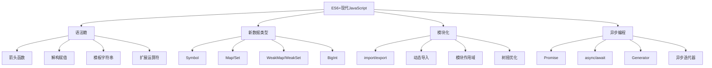

# ES6+现代特性面试题

## 🎯 核心知识点

- 箭头函数与普通函数
- 解构赋值与扩展运算符
- 模板字符串与标签模板
- 类与继承机制
- 模块化系统
- 异步编程进化

## 📊 ES6+特性发展图



## 💡 面试题目

### 🟢 初级题目

#### 1. **[初级]** 箭头函数与普通函数有什么区别？

**标签**: 箭头函数, this绑定, 函数声明

**题目描述**:
请详细说明箭头函数与普通函数的区别，包括语法、this指向、使用场景等。

**核心答案**:

**语法对比**:

```javascript
// 普通函数
function normalFunction(a, b) {
    return a + b;
}

// 函数表达式
const normalFunction2 = function(a, b) {
    return a + b;
};

// 箭头函数
const arrowFunction = (a, b) => a + b;

// 复杂箭头函数
const complexArrowFunction = (a, b) => {
    const result = a + b;
    return result * 2;
};

// 单参数可省略括号
const singleParam = name => `Hello, ${name}!`;

// 无参数
const noParams = () => Math.random();

// 返回对象需要包裹在括号中
const returnObject = () => ({ name: 'Alice', age: 25 });
```

**this指向差异**:

```javascript
const obj = {
    name: 'Alice',
    
    // 普通函数 - this指向调用者
    normalMethod: function() {
        console.log(this.name); // 'Alice'
        
        setTimeout(function() {
            console.log(this.name); // undefined (this指向window/global)
        }, 1000);
    },
    
    // 箭头函数 - this继承外层作用域
    arrowMethod: () => {
        console.log(this.name); // undefined (this指向全局)
    },
    
    // 混合使用
    mixedMethod: function() {
        console.log(this.name); // 'Alice'
        
        // 箭头函数继承外层this
        setTimeout(() => {
            console.log(this.name); // 'Alice'
        }, 1000);
        
        // 使用箭头函数处理数组
        const numbers = [1, 2, 3];
        const doubled = numbers.map(n => n * 2); // this在这里不重要
        
        return doubled;
    }
};
```

**构造函数差异**:

```javascript
// 普通函数可以作为构造函数
function Person(name) {
    this.name = name;
}

const person1 = new Person('Alice'); // ✅ 正常工作

// 箭头函数不能作为构造函数
const PersonArrow = (name) => {
    this.name = name;
};

// const person2 = new PersonArrow('Bob'); // ❌ TypeError: PersonArrow is not a constructor

// 普通函数有prototype属性
console.log(Person.prototype); // {constructor: ƒ}
console.log(PersonArrow.prototype); // undefined
```

**arguments对象**:

```javascript
// 普通函数有arguments对象
function normalFunc() {
    console.log(arguments); // Arguments对象
    console.log(Array.from(arguments)); // 转换为真正的数组
}

// 箭头函数没有arguments
const arrowFunc = () => {
    // console.log(arguments); // ❌ ReferenceError
    
    // 使用剩余参数替代
    return Array.from(arguments); // 仍然会报错
};

// 正确的箭头函数写法
const arrowFuncWithRest = (...args) => {
    console.log(args); // 真正的数组
    return args.reduce((sum, num) => sum + num, 0);
};

normalFunc(1, 2, 3); // [1, 2, 3]
arrowFuncWithRest(1, 2, 3); // [1, 2, 3]
```

**变量提升行为**:

```javascript
// 函数声明会被提升
console.log(hoistedFunction()); // "Hello" - 正常工作

function hoistedFunction() {
    return "Hello";
}

// 箭头函数不会被提升
// console.log(notHoisted()); // ❌ ReferenceError

const notHoisted = () => "Hello";
```

**使用场景对比**:

```javascript
// ✅ 箭头函数适用场景
const users = [
    { name: 'Alice', age: 25 },
    { name: 'Bob', age: 30 },
    { name: 'Charlie', age: 35 }
];

// 数组方法
const names = users.map(user => user.name);
const adults = users.filter(user => user.age >= 18);
const totalAge = users.reduce((sum, user) => sum + user.age, 0);

// 事件处理（需要保持this）
class Component {
    constructor() {
        this.count = 0;
    }
    
    setupEventListener() {
        // 箭头函数保持this指向
        document.addEventListener('click', () => {
            this.count++;
            console.log(this.count);
        });
    }
}

// ❌ 箭头函数不适用场景
const calculator = {
    value: 0,
    
    // 需要this指向对象本身
    add: function(num) { // 不要用箭头函数
        this.value += num;
        return this;
    },
    
    multiply: function(num) {
        this.value *= num;
        return this;
    }
};

calculator.add(5).multiply(2); // this链式调用
```

---

#### 2. **[初级]** 解构赋值的各种用法和实际应用

**标签**: 解构赋值, 扩展运算符, 参数传递

**题目描述**:
请详细说明ES6解构赋值的语法和使用场景，包括数组解构、对象解构等。

**核心答案**:

**数组解构**:

```javascript
// 基本数组解构
const numbers = [1, 2, 3, 4, 5];
const [first, second, third] = numbers;
console.log(first, second, third); // 1, 2, 3

// 跳过元素
const [a, , c] = numbers; // 跳过第二个元素
console.log(a, c); // 1, 3

// 剩余元素
const [head, ...tail] = numbers;
console.log(head); // 1
console.log(tail); // [2, 3, 4, 5]

// 默认值
const [x, y, z = 10] = [1, 2];
console.log(x, y, z); // 1, 2, 10

// 交换变量
let m = 1, n = 2;
[m, n] = [n, m];
console.log(m, n); // 2, 1

// 嵌套解构
const nested = [1, [2, 3], 4];
const [num1, [num2, num3], num4] = nested;
console.log(num1, num2, num3, num4); // 1, 2, 3, 4
```

**对象解构**:

```javascript
// 基本对象解构
const person = {
    name: 'Alice',
    age: 25,
    city: 'Beijing',
    email: 'alice@example.com'
};

const { name, age } = person;
console.log(name, age); // 'Alice', 25

// 重命名变量
const { name: userName, age: userAge } = person;
console.log(userName, userAge); // 'Alice', 25

// 默认值
const { country = 'China', profession = 'Developer' } = person;
console.log(country, profession); // 'China', 'Developer'

// 剩余属性
const { name: personName, ...otherInfo } = person;
console.log(personName); // 'Alice'
console.log(otherInfo); // { age: 25, city: 'Beijing', email: 'alice@example.com' }

// 嵌套对象解构
const user = {
    id: 1,
    profile: {
        name: 'Bob',
        settings: {
            theme: 'dark',
            language: 'zh'
        }
    }
};

const {
    profile: {
        name: profileName,
        settings: { theme, language }
    }
} = user;

console.log(profileName, theme, language); // 'Bob', 'dark', 'zh'

// 也可以分步解构
const { profile } = user;
const { settings } = profile;
const { theme: userTheme } = settings;
```

**函数参数解构**:

```javascript
// 对象参数解构
function createUser({ name, age, email, role = 'user' }) {
    return {
        id: Date.now(),
        name,
        age,
        email,
        role,
        createdAt: new Date()
    };
}

const newUser = createUser({
    name: 'Charlie',
    age: 30,
    email: 'charlie@example.com'
});

// 数组参数解构
function calculateDistance([x1, y1], [x2, y2]) {
    return Math.sqrt((x2 - x1) ** 2 + (y2 - y1) ** 2);
}

const distance = calculateDistance([0, 0], [3, 4]); // 5

// 混合解构
function processApiResponse({ data, status, error = null }, [callback]) {
    if (status === 'success') {
        callback(null, data);
    } else {
        callback(error || new Error('Unknown error'));
    }
}
```

**实际应用场景**:

```javascript
// 1. API数据处理
async function fetchUserData(userId) {
    const response = await fetch(`/api/users/${userId}`);
    const { data: userData, status, message } = await response.json();
    
    if (status === 'success') {
        const { name, avatar, preferences: { theme, language } } = userData;
        return { name, avatar, theme, language };
    }
    
    throw new Error(message);
}

// 2. React组件props解构
function UserCard({ user: { name, avatar, email }, onEdit, onDelete }) {
    return (
        <div className="user-card">
            
            <h3>{name}</h3>
            <p>{email}</p>
            <button onClick={() => onEdit(user)}>编辑</button>
            <button onClick={() => onDelete(user.id)}>删除</button>
        </div>
    );
}

// 3. 模块导入
import { useState, useEffect, useCallback } from 'react';
import { debounce, throttle } from 'lodash';

// 4. 配置对象处理
function initializeApp(config = {}) {
    const {
        apiUrl = '/api',
        timeout = 5000,
        retries = 3,
        headers = {},
        features: {
            analytics = true,
            debugging = false
        } = {}
    } = config;
    
    return {
        api: createApiClient({ apiUrl, timeout, retries, headers }),
        analytics: analytics ? initAnalytics() : null,
        debug: debugging ? initDebugger() : null
    };
}

// 5. 数组操作
function processData(rawData) {
    // 分离头部和数据
    const [header, ...rows] = rawData;
    
    // 处理每一行
    return rows.map(row => {
        const [id, name, email, ...extraFields] = row;
        return {
            id: parseInt(id),
            name,
            email,
            metadata: extraFields
        };
    });
}

// 6. 错误处理
function handleApiError(error) {
    const {
        response: {
            status,
            data: { message, code } = {}
        } = {},
        request,
        message: networkMessage
    } = error;
    
    if (status) {
        console.error(`HTTP Error ${status}: ${message}`);
        return { type: 'http', status, message, code };
    } else if (request) {
        console.error('Network Error:', networkMessage);
        return { type: 'network', message: networkMessage };
    } else {
        console.error('Unknown Error:', error.message);
        return { type: 'unknown', message: error.message };
    }
}
```

**扩展运算符相关**:

```javascript
// 数组扩展
const arr1 = [1, 2, 3];
const arr2 = [4, 5, 6];
const combined = [...arr1, ...arr2]; // [1, 2, 3, 4, 5, 6]

// 复制数组（浅拷贝）
const originalArray = [1, 2, { a: 3 }];
const copiedArray = [...originalArray];

// 对象扩展
const baseConfig = {
    url: '/api',
    method: 'GET',
    timeout: 5000
};

const requestConfig = {
    ...baseConfig,
    method: 'POST', // 覆盖原有属性
    data: { name: 'test' }
};

// 函数参数展开
function sum(a, b, c) {
    return a + b + c;
}

const numbers = [1, 2, 3];
console.log(sum(...numbers)); // 6

// 字符串展开
const str = 'hello';
const chars = [...str]; // ['h', 'e', 'l', 'l', 'o']
```

**高级技巧**:

```javascript
// 动态属性解构
function getPropertyValue(obj, path) {
    return path.split('.').reduce((current, prop) => current?.[prop], obj);
}

// 或使用可选链
const getValue = (obj, path) => {
    const keys = path.split('.');
    let result = obj;
    for (const key of keys) {
        result = result?.[key];
        if (result === undefined) break;
    }
    return result;
};

// 条件解构
function processUser(user, includePrivate = false) {
    const publicFields = { name, email, avatar } = user;
    
    if (includePrivate) {
        const { phone, address, ...privateData } = user;
        return { ...publicFields, phone, address };
    }
    
    return publicFields;
}

// 数组和对象的综合解构
const apiResponse = {
    users: [
        { id: 1, name: 'Alice', roles: ['admin', 'user'] },
        { id: 2, name: 'Bob', roles: ['user'] }
    ],
    total: 2
};

const {
    users: [
        { name: firstUserName, roles: [firstRole] },
        ...otherUsers
    ],
    total
} = apiResponse;
```

**最佳实践**:
- ✅ 使用解构简化变量赋值
- ✅ 为解构参数提供默认值
- ✅ 合理使用重命名避免命名冲突
- ✅ 在函数参数中使用解构提高可读性
- ✅ 结合扩展运算符进行对象/数组操作

---

### 🟡 中级题目

#### 3. **[中级]** 深入理解ES6模块系统

**标签**: 模块化, import/export, 循环依赖

**题目描述**:
请详细说明ES6模块系统的特点、导入导出语法、与CommonJS的区别，以及如何处理循环依赖。

**核心答案**:

**ES6模块基本语法**:

```javascript
// math.js - 导出模块
// 命名导出
export const PI = 3.14159;
export const E = 2.71828;

export function add(a, b) {
    return a + b;
}

export function multiply(a, b) {
    return a * b;
}

// 批量导出
const subtract = (a, b) => a - b;
const divide = (a, b) => a / b;

export { subtract, divide };

// 重命名导出
export { subtract as minus, divide as div };

// 默认导出
export default class Calculator {
    constructor() {
        this.result = 0;
    }
    
    add(num) {
        this.result += num;
        return this;
    }
    
    multiply(num) {
        this.result *= num;
        return this;
    }
    
    getResult() {
        return this.result;
    }
}

// 混合导出
export const version = '1.0.0';
```

```javascript
// main.js - 导入模块
// 命名导入
import { PI, E, add, multiply } from './math.js';

// 重命名导入
import { subtract as minus, divide as div } from './math.js';

// 默认导入
import Calculator from './math.js';

// 混合导入
import Calculator, { PI, add, version } from './math.js';

// 导入所有
import * as math from './math.js';
console.log(math.PI, math.add(1, 2), math.default); // Calculator类

// 使用
const calc = new Calculator();
const result = calc.add(5).multiply(2).getResult(); // 10

console.log(add(PI, E));
console.log(minus(10, 3));
```

**动态导入**:

```javascript
// 条件导入
async function loadFeature(featureName) {
    try {
        if (featureName === 'chart') {
            const { Chart } = await import('./chart-library.js');
            return new Chart();
        } else if (featureName === 'map') {
            const { Map } = await import('./map-library.js');
            return new Map();
        }
    } catch (error) {
        console.error('Failed to load feature:', error);
        return null;
    }
}

// 懒加载
class ComponentLoader {
    constructor() {
        this.cache = new Map();
    }
    
    async loadComponent(name) {
        if (this.cache.has(name)) {
            return this.cache.get(name);
        }
        
        try {
            const module = await import(`./components/${name}.js`);
            const Component = module.default || module[name];
            this.cache.set(name, Component);
            return Component;
        } catch (error) {
            console.error(`Failed to load component ${name}:`, error);
            throw error;
        }
    }
}

// 基于条件的代码分割
async function initializeApp() {
    const isProduction = process.env.NODE_ENV === 'production';
    
    if (!isProduction) {
        // 开发环境才加载调试工具
        const { DevTools } = await import('./dev-tools.js');
        window.devTools = new DevTools();
    }
    
    // 根据用户权限加载模块
    const userRole = getCurrentUserRole();
    if (userRole === 'admin') {
        const { AdminPanel } = await import('./admin-panel.js');
        return new AdminPanel();
    }
}
```

**ES6 vs CommonJS对比**:

```javascript
// CommonJS (Node.js)
// exports.js
const PI = 3.14159;

function add(a, b) {
    return a + b;
}

// 方式1: exports对象
exports.PI = PI;
exports.add = add;

// 方式2: module.exports
module.exports = {
    PI,
    add,
    Calculator: class Calculator {
        // ...
    }
};

// 方式3: 直接替换
module.exports = class Calculator {
    // ...
};

// main.js
const { PI, add } = require('./exports.js');
const Calculator = require('./calculator.js');

// 运行时加载
const moduleName = 'fs';
const fs = require(moduleName);
```

```javascript
// ES6 Modules
// 静态结构，编译时确定依赖
import { PI, add } from './math.js';
import Calculator from './calculator.js';

// 不能动态require（需要用import()）
// const moduleName = 'math';
// import { PI } from moduleName; // ❌ 语法错误

// 必须用动态导入
const loadMath = async () => {
    const { PI } = await import('./math.js');
    return PI;
};
```

**模块作用域和特性**:

```javascript
// module-scope.js
// 模块顶层的this是undefined（严格模式）
console.log(this); // undefined

// 模块变量不会污染全局
let privateVar = 'private';
var anotherVar = 'also private';

// 模块只会执行一次
console.log('Module loaded'); // 无论被导入多少次，只执行一次

let counter = 0;
export function increment() {
    return ++counter;
}

export function getCounter() {
    return counter;
}

// 导出的是绑定，不是值的拷贝
let mutableValue = 1;
export { mutableValue };

export function changeMutableValue(newValue) {
    mutableValue = newValue;
}
```

```javascript
// 使用模块
import { increment, getCounter, mutableValue, changeMutableValue } from './module-scope.js';

console.log(getCounter()); // 0
increment();
console.log(getCounter()); // 1

console.log(mutableValue); // 1
changeMutableValue(42);
console.log(mutableValue); // 42 - 导入的绑定会更新
```

**处理循环依赖**:

```javascript
// a.js
import { b } from './b.js';

export const a = 'a';

export function callB() {
    return b();
}

console.log('a.js loaded');
```

```javascript
// b.js
import { a } from './a.js';

export function b() {
    return `b called, a is: ${a}`;
}

console.log('b.js loaded');
```

```javascript
// main.js
import { callB } from './a.js';
import { b } from './b.js';

console.log(callB()); // "b called, a is: a"
console.log(b()); // "b called, a is: a"
```

**复杂循环依赖处理**:

```javascript
// user.js
import { createPost } from './post.js';

export class User {
    constructor(name) {
        this.name = name;
        this.posts = [];
    }
    
    createPost(title, content) {
        const post = createPost(title, content, this);
        this.posts.push(post);
        return post;
    }
}
```

```javascript
// post.js
import { User } from './user.js';

export class Post {
    constructor(title, content, author) {
        this.title = title;
        this.content = content;
        this.author = author; // User实例
        this.createdAt = new Date();
    }
    
    getAuthorName() {
        return this.author instanceof User ? this.author.name : 'Unknown';
    }
}

export function createPost(title, content, author) {
    return new Post(title, content, author);
}
```

**模块设计模式**:

```javascript
// config.js - 配置模块
const config = {
    api: {
        baseUrl: process.env.API_URL || '/api',
        timeout: 5000
    },
    features: {
        analytics: true,
        debugging: process.env.NODE_ENV === 'development'
    }
};

export default config;
export const { api, features } = config;
```

```javascript
// api.js - API模块
import config from './config.js';

class ApiClient {
    constructor(baseUrl, options = {}) {
        this.baseUrl = baseUrl;
        this.timeout = options.timeout || 5000;
        this.headers = options.headers || {};
    }
    
    async request(endpoint, options = {}) {
        const url = `${this.baseUrl}${endpoint}`;
        const response = await fetch(url, {
            timeout: this.timeout,
            headers: this.headers,
            ...options
        });
        
        if (!response.ok) {
            throw new Error(`HTTP ${response.status}: ${response.statusText}`);
        }
        
        return response.json();
    }
    
    get(endpoint) {
        return this.request(endpoint, { method: 'GET' });
    }
    
    post(endpoint, data) {
        return this.request(endpoint, {
            method: 'POST',
            headers: { 'Content-Type': 'application/json' },
            body: JSON.stringify(data)
        });
    }
}

// 导出单例
export default new ApiClient(config.api.baseUrl, {
    timeout: config.api.timeout
});

// 也导出类，允许创建多个实例
export { ApiClient };
```

```javascript
// 使用API模块
import api, { ApiClient } from './api.js';

// 使用默认实例
const users = await api.get('/users');

// 创建自定义实例
const customApi = new ApiClient('https://custom-api.com', {
    timeout: 10000,
    headers: { 'Authorization': 'Bearer token' }
});
```

**最佳实践**:

```javascript
// 1. 模块文件结构
// utils/
//   ├── index.js (主导出文件)
//   ├── string-utils.js
//   ├── date-utils.js
//   └── validation.js

// utils/index.js - 统一导出入口
export { default as stringUtils } from './string-utils.js';
export { default as dateUtils } from './date-utils.js';
export * from './validation.js';

// 2. 避免默认导出的滥用
// ❌ 过度使用默认导出
export default function() { /* ... */ }

// ✅ 使用命名导出提高可读性
export function processData() { /* ... */ }
export function validateInput() { /* ... */ }

// 3. 模块副作用管理
// side-effects.js
console.log('Module side effect'); // 应该避免

// 更好的方式
export function initialize() {
    console.log('Explicit initialization');
}

// 4. 类型导出（TypeScript）
export type User = {
    id: number;
    name: string;
    email: string;
};

export interface ApiResponse<T> {
    data: T;
    status: string;
    message?: string;
}
```

**模块化的优势**:
- ✅ 静态分析和tree shaking
- ✅ 更好的IDE支持
- ✅ 编译时错误检查
- ✅ 原生浏览器支持
- ✅ 循环依赖处理更可靠

---

### 🔴 高级题目

#### 4. **[高级]** Generator函数与异步迭代器的应用

**标签**: Generator, 异步迭代器, 协程, 状态机

**题目描述**:
请详细说明Generator函数的工作原理，以及在异步编程、状态机、惰性求值等场景中的应用。

**核心答案**:

**Generator基础概念**:

```javascript
// 基本Generator函数
function* simpleGenerator() {
    console.log('Start');
    yield 1;
    console.log('Middle');
    yield 2;
    console.log('End');
    return 3;
}

const gen = simpleGenerator();
console.log(gen.next()); // { value: 1, done: false }
console.log(gen.next()); // { value: 2, done: false }
console.log(gen.next()); // { value: 3, done: true }

// Generator是可迭代的
function* numberGenerator() {
    yield 1;
    yield 2;
    yield 3;
}

for (const num of numberGenerator()) {
    console.log(num); // 1, 2, 3
}

// 展开运算符
const numbers = [...numberGenerator()]; // [1, 2, 3]
```

**双向通信**:

```javascript
function* communicatingGenerator() {
    const a = yield 'First yield';
    console.log('Received:', a);
    
    const b = yield 'Second yield';
    console.log('Received:', b);
    
    return a + b;
}

const gen = communicatingGenerator();
console.log(gen.next());         // { value: 'First yield', done: false }
console.log(gen.next(10));       // { value: 'Second yield', done: false }
console.log(gen.next(20));       // { value: 30, done: true }
```

**无限序列和惰性求值**:

```javascript
// 斐波那契数列
function* fibonacci() {
    let a = 0, b = 1;
    while (true) {
        yield a;
        [a, b] = [b, a + b];
    }
}

// 惰性求值 - 只计算需要的值
function* take(iterable, count) {
    let taken = 0;
    for (const item of iterable) {
        if (taken >= count) break;
        yield item;
        taken++;
    }
}

const firstTenFib = [...take(fibonacci(), 10)];
console.log(firstTenFib); // [0, 1, 1, 2, 3, 5, 8, 13, 21, 34]

// 质数生成器
function* primes() {
    const primeCache = [];
    let candidate = 2;
    
    while (true) {
        const isPrime = primeCache.every(prime => {
            if (prime * prime > candidate) return true;
            return candidate % prime !== 0;
        });
        
        if (isPrime) {
            primeCache.push(candidate);
            yield candidate;
        }
        candidate++;
    }
}

const firstTenPrimes = [...take(primes(), 10)];
console.log(firstTenPrimes); // [2, 3, 5, 7, 11, 13, 17, 19, 23, 29]
```

**Generator在异步编程中的应用**:

```javascript
// 模拟async/await的实现
function run(generatorFunc) {
    const generator = generatorFunc();
    
    function handle(result) {
        if (result.done) return result.value;
        
        return Promise.resolve(result.value)
            .then(res => handle(generator.next(res)))
            .catch(err => handle(generator.throw(err)));
    }
    
    try {
        return handle(generator.next());
    } catch (error) {
        return Promise.reject(error);
    }
}

// 使用Generator进行异步流程控制
function* fetchUserData(userId) {
    try {
        const user = yield fetch(`/api/users/${userId}`).then(r => r.json());
        console.log('User:', user);
        
        const posts = yield fetch(`/api/users/${userId}/posts`).then(r => r.json());
        console.log('Posts:', posts);
        
        const friends = yield fetch(`/api/users/${userId}/friends`).then(r => r.json());
        console.log('Friends:', friends);
        
        return { user, posts, friends };
    } catch (error) {
        console.error('Error fetching data:', error);
        throw error;
    }
}

// 使用
run(function* () {
    const userData = yield* fetchUserData(123);
    console.log('All data loaded:', userData);
});
```

**异步Generator和异步迭代器**:

```javascript
// 异步Generator
async function* asyncNumberGenerator() {
    for (let i = 1; i <= 5; i++) {
        await new Promise(resolve => setTimeout(resolve, 1000));
        yield i;
    }
}

// 异步迭代
async function consumeAsyncGenerator() {
    for await (const num of asyncNumberGenerator()) {
        console.log(num); // 每秒输出一个数字
    }
}

// 实际应用：分页数据获取
async function* fetchPages(endpoint, pageSize = 10) {
    let page = 1;
    let hasMore = true;
    
    while (hasMore) {
        try {
            const response = await fetch(`${endpoint}?page=${page}&size=${pageSize}`);
            const data = await response.json();
            
            if (data.items && data.items.length > 0) {
                yield data.items;
                hasMore = data.hasMore;
                page++;
            } else {
                hasMore = false;
            }
        } catch (error) {
            console.error('Error fetching page:', error);
            throw error;
        }
    }
}

// 使用分页生成器
async function processAllData() {
    try {
        for await (const pageData of fetchPages('/api/items')) {
            console.log(`Processing ${pageData.length} items`);
            // 处理当前页数据
            await processPageData(pageData);
        }
    } catch (error) {
        console.error('Error processing data:', error);
    }
}
```

**状态机实现**:

```javascript
// 使用Generator实现状态机
function* trafficLightStateMachine() {
    while (true) {
        console.log('🔴 Red light - Stop');
        yield 'red';
        
        console.log('🟡 Yellow light - Prepare');
        yield 'yellow';
        
        console.log('🟢 Green light - Go');
        yield 'green';
    }
}

class TrafficLight {
    constructor() {
        this.stateMachine = trafficLightStateMachine();
        this.currentState = 'red';
    }
    
    next() {
        const result = this.stateMachine.next();
        this.currentState = result.value;
        return this.currentState;
    }
    
    getCurrentState() {
        return this.currentState;
    }
}

// 复杂状态机：订单状态管理
function* orderStateMachine(initialState = 'pending') {
    let state = initialState;
    let action;
    
    while (true) {
        switch (state) {
            case 'pending':
                action = yield state;
                if (action === 'confirm') {
                    state = 'confirmed';
                } else if (action === 'cancel') {
                    state = 'cancelled';
                }
                break;
                
            case 'confirmed':
                action = yield state;
                if (action === 'ship') {
                    state = 'shipped';
                } else if (action === 'cancel') {
                    state = 'cancelled';
                }
                break;
                
            case 'shipped':
                action = yield state;
                if (action === 'deliver') {
                    state = 'delivered';
                } else if (action === 'return') {
                    state = 'returned';
                }
                break;
                
            case 'delivered':
            case 'cancelled':
            case 'returned':
                yield state; // 终态
                break;
        }
    }
}

class Order {
    constructor(id) {
        this.id = id;
        this.stateMachine = orderStateMachine();
        this.currentState = this.stateMachine.next().value;
    }
    
    transition(action) {
        const result = this.stateMachine.next(action);
        this.currentState = result.value;
        console.log(`Order ${this.id}: ${this.currentState}`);
        return this.currentState;
    }
}

// 使用
const order = new Order('ORD-001');
order.transition('confirm');  // confirmed
order.transition('ship');     // shipped
order.transition('deliver');  // delivered
```

**可观察数据流**:

```javascript
// 使用Generator创建可观察的数据流
function* createObservable(initialValue) {
    let value = initialValue;
    const listeners = new Set();
    
    while (true) {
        const action = yield {
            value,
            subscribe: (callback) => {
                listeners.add(callback);
                return () => listeners.delete(callback);
            },
            emit: (newValue) => {
                value = newValue;
                listeners.forEach(callback => callback(value));
            }
        };
        
        if (action) {
            value = action;
            listeners.forEach(callback => callback(value));
        }
    }
}

// 使用可观察对象
const observable = createObservable(0);
const { subscribe, emit } = observable.next().value;

const unsubscribe = subscribe(value => {
    console.log('Observer 1:', value);
});

subscribe(value => {
    console.log('Observer 2:', value);
});

// 触发更新
emit(10); // Observer 1: 10, Observer 2: 10
emit(20); // Observer 1: 20, Observer 2: 20

unsubscribe(); // 取消订阅
emit(30); // Observer 2: 30
```

**Generator工具函数**:

```javascript
// 组合多个Generator
function* chain(...generators) {
    for (const generator of generators) {
        yield* generator;
    }
}

function* range(start, end, step = 1) {
    for (let i = start; i < end; i += step) {
        yield i;
    }
}

function* repeat(value, times) {
    for (let i = 0; i < times; i++) {
        yield value;
    }
}

// 使用
const combined = chain(
    range(1, 4),        // 1, 2, 3
    repeat('x', 2),     // 'x', 'x'
    range(10, 13)       // 10, 11, 12
);

console.log([...combined]); // [1, 2, 3, 'x', 'x', 10, 11, 12]

// 过滤Generator
function* filter(iterable, predicate) {
    for (const item of iterable) {
        if (predicate(item)) {
            yield item;
        }
    }
}

// 映射Generator
function* map(iterable, transformer) {
    for (const item of iterable) {
        yield transformer(item);
    }
}

// 使用
const evenNumbers = filter(range(1, 10), x => x % 2 === 0);
const doubled = map(evenNumbers, x => x * 2);
console.log([...doubled]); // [4, 8, 12, 16]
```

**错误处理和资源清理**:

```javascript
function* resourceManager() {
    const resource = acquireResource();
    
    try {
        yield resource;
        console.log('Resource used successfully');
    } catch (error) {
        console.error('Error using resource:', error);
        throw error;
    } finally {
        releaseResource(resource);
        console.log('Resource cleaned up');
    }
}

function acquireResource() {
    console.log('Resource acquired');
    return { id: Date.now() };
}

function releaseResource(resource) {
    console.log('Resource released:', resource.id);
}

// 使用
function* main() {
    const gen = resourceManager();
    try {
        const { value: resource } = gen.next();
        console.log('Using resource:', resource);
        
        // 模拟错误
        gen.throw(new Error('Something went wrong'));
    } catch (error) {
        console.log('Caught error:', error.message);
    }
}

const mainGen = main();
mainGen.next();
```

**Generator优势和应用场景**:
- ✅ 惰性求值，节省内存
- ✅ 暂停和恢复执行
- ✅ 双向通信能力
- ✅ 自然的迭代器实现
- ✅ 状态机的优雅实现
- ✅ 异步流程控制
- ✅ 数据流处理

---

## 🔗 相关链接

- [← 返回前端题库](./README.md)
- [JavaScript核心概念](./javascript-core.md)
- [React基础概念](./react-basics.md)
- [构建工具与模块化](./build-tools.md)

---

*ES6+特性是现代JavaScript开发的基础，掌握这些特性能显著提高开发效率和代码质量* 