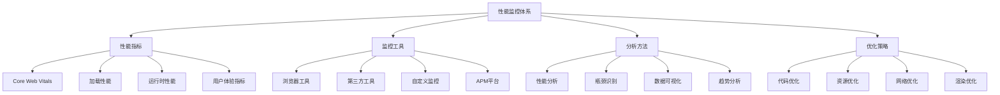

# 性能监控与分析面试题

## 🎯 核心知识点

- Web性能指标
- 性能监控工具
- 性能分析方法
- 性能优化策略
- 用户体验监控
- 实时性能追踪

## 📊 性能监控体系图



## 💡 面试题目

### 🟢 初级题目

#### 1. **[初级]** Web性能指标和Core Web Vitals

**标签**: 性能指标, Core Web Vitals, FCP, LCP, CLS, FID

**题目描述**:
请详细说明Web性能的核心指标，特别是Google的Core Web Vitals。

**核心答案**:

**Core Web Vitals详解**:

```javascript
// 1. Largest Contentful Paint (LCP) - 最大内容绘制
class LCPMonitor {
    constructor() {
        this.lcpValue = 0;
        this.observer = null;
        this.init();
    }
    
    init() {
        // 使用PerformanceObserver监控LCP
        this.observer = new PerformanceObserver((list) => {
            const entries = list.getEntries();
            const lastEntry = entries[entries.length - 1];
            
            this.lcpValue = lastEntry.startTime;
            this.reportLCP(this.lcpValue);
        });
        
        this.observer.observe({ entryTypes: ['largest-contentful-paint'] });
    }
    
    reportLCP(value) {
        console.log('LCP:', value);
        
        // LCP评分标准
        if (value <= 2500) {
            console.log('LCP评分: 良好 (≤2.5s)');
        } else if (value <= 4000) {
            console.log('LCP评分: 需要改进 (2.5s-4s)');
        } else {
            console.log('LCP评分: 差 (>4s)');
        }
        
        // 发送到分析服务
        this.sendToAnalytics('lcp', value);
    }
    
    sendToAnalytics(metric, value) {
        // 发送到Google Analytics或其他分析服务
        if (typeof gtag !== 'undefined') {
            gtag('event', 'web_vitals', {
                event_category: 'performance',
                event_label: metric,
                value: Math.round(value)
            });
        }
    }
    
    disconnect() {
        if (this.observer) {
            this.observer.disconnect();
        }
    }
}

// 2. First Input Delay (FID) - 首次输入延迟
class FIDMonitor {
    constructor() {
        this.init();
    }
    
    init() {
        const observer = new PerformanceObserver((list) => {
            const entries = list.getEntries();
            
            entries.forEach(entry => {
                const fid = entry.processingStart - entry.startTime;
                this.reportFID(fid);
            });
        });
        
        observer.observe({ entryTypes: ['first-input'] });
    }
    
    reportFID(value) {
        console.log('FID:', value);
        
        // FID评分标准
        if (value <= 100) {
            console.log('FID评分: 良好 (≤100ms)');
        } else if (value <= 300) {
            console.log('FID评分: 需要改进 (100ms-300ms)');
        } else {
            console.log('FID评分: 差 (>300ms)');
        }
        
        this.sendToAnalytics('fid', value);
    }
    
    sendToAnalytics(metric, value) {
        if (typeof gtag !== 'undefined') {
            gtag('event', 'web_vitals', {
                event_category: 'performance',
                event_label: metric,
                value: Math.round(value)
            });
        }
    }
}

// 3. Cumulative Layout Shift (CLS) - 累积布局偏移
class CLSMonitor {
    constructor() {
        this.clsValue = 0;
        this.sessionValue = 0;
        this.sessionEntries = [];
        this.init();
    }
    
    init() {
        const observer = new PerformanceObserver((list) => {
            const entries = list.getEntries();
            
            entries.forEach(entry => {
                // 只计算非用户输入导致的布局偏移
                if (!entry.hadRecentInput) {
                    this.sessionValue += entry.value;
                    this.sessionEntries.push(entry);
                    
                    this.updateCLS();
                }
            });
        });
        
        observer.observe({ entryTypes: ['layout-shift'] });
    }
    
    updateCLS() {
        // 计算会话窗口中的最大CLS值
        this.clsValue = Math.max(this.sessionValue, this.clsValue);
        this.reportCLS(this.clsValue);
    }
    
    reportCLS(value) {
        console.log('CLS:', value);
        
        // CLS评分标准
        if (value <= 0.1) {
            console.log('CLS评分: 良好 (≤0.1)');
        } else if (value <= 0.25) {
            console.log('CLS评分: 需要改进 (0.1-0.25)');
        } else {
            console.log('CLS评分: 差 (>0.25)');
        }
        
        this.sendToAnalytics('cls', value);
    }
    
    sendToAnalytics(metric, value) {
        if (typeof gtag !== 'undefined') {
            gtag('event', 'web_vitals', {
                event_category: 'performance',
                event_label: metric,
                value: Math.round(value * 1000) / 1000
            });
        }
    }
}

// 4. 其他重要性能指标
class AdditionalMetrics {
    constructor() {
        this.init();
    }
    
    init() {
        // First Contentful Paint (FCP)
        this.measureFCP();
        
        // Time to Interactive (TTI)
        this.measureTTI();
        
        // Total Blocking Time (TBT)
        this.measureTBT();
    }
    
    measureFCP() {
        const observer = new PerformanceObserver((list) => {
            const entries = list.getEntries();
            const fcpEntry = entries.find(entry => entry.name === 'first-contentful-paint');
            
            if (fcpEntry) {
                const fcp = fcpEntry.startTime;
                console.log('FCP:', fcp);
                
                if (fcp <= 1800) {
                    console.log('FCP评分: 良好 (≤1.8s)');
                } else if (fcp <= 3000) {
                    console.log('FCP评分: 需要改进 (1.8s-3s)');
                } else {
                    console.log('FCP评分: 差 (>3s)');
                }
                
                observer.disconnect();
            }
        });
        
        observer.observe({ entryTypes: ['paint'] });
    }
    
    measureTTI() {
        // TTI需要复杂的计算，通常使用第三方库
        // 这里提供简化版本
        window.addEventListener('load', () => {
            setTimeout(() => {
                const tti = performance.now();
                console.log('TTI (估算):', tti);
                
                if (tti <= 3800) {
                    console.log('TTI评分: 良好 (≤3.8s)');
                } else if (tti <= 7300) {
                    console.log('TTI评分: 需要改进 (3.8s-7.3s)');
                } else {
                    console.log('TTI评分: 差 (>7.3s)');
                }
            }, 0);
        });
    }
    
    measureTBT() {
        let totalBlockingTime = 0;
        
        const observer = new PerformanceObserver((list) => {
            const entries = list.getEntries();
            
            entries.forEach(entry => {
                // 计算超过50ms的任务阻塞时间
                if (entry.duration > 50) {
                    totalBlockingTime += entry.duration - 50;
                }
            });
            
            console.log('TBT:', totalBlockingTime);
            
            if (totalBlockingTime <= 200) {
                console.log('TBT评分: 良好 (≤200ms)');
            } else if (totalBlockingTime <= 600) {
                console.log('TBT评分: 需要改进 (200ms-600ms)');
            } else {
                console.log('TBT评分: 差 (>600ms)');
            }
        });
        
        observer.observe({ entryTypes: ['longtask'] });
    }
}

// 5. 综合性能监控器
class WebVitalsMonitor {
    constructor(options = {}) {
        this.options = {
            reportInterval: 5000,
            enableConsoleLog: true,
            enableAnalytics: true,
            ...options
        };
        
        this.metrics = {
            lcp: null,
            fid: null,
            cls: null,
            fcp: null,
            ttfb: null
        };
        
        this.init();
    }
    
    init() {
        this.lcpMonitor = new LCPMonitor();
        this.fidMonitor = new FIDMonitor();
        this.clsMonitor = new CLSMonitor();
        this.additionalMetrics = new AdditionalMetrics();
        
        // 测量TTFB (Time to First Byte)
        this.measureTTFB();
        
        // 定期报告
        this.startReporting();
    }
    
    measureTTFB() {
        const navigationEntry = performance.getEntriesByType('navigation')[0];
        if (navigationEntry) {
            const ttfb = navigationEntry.responseStart - navigationEntry.requestStart;
            this.metrics.ttfb = ttfb;
            
            console.log('TTFB:', ttfb);
            
            if (ttfb <= 800) {
                console.log('TTFB评分: 良好 (≤800ms)');
            } else if (ttfb <= 1800) {
                console.log('TTFB评分: 需要改进 (800ms-1.8s)');
            } else {
                console.log('TTFB评分: 差 (>1.8s)');
            }
        }
    }
    
    startReporting() {
        setInterval(() => {
            this.generateReport();
        }, this.options.reportInterval);
    }
    
    generateReport() {
        const report = {
            timestamp: new Date().toISOString(),
            url: window.location.href,
            userAgent: navigator.userAgent,
            metrics: { ...this.metrics },
            performance: {
                memory: performance.memory ? {
                    usedJSHeapSize: performance.memory.usedJSHeapSize,
                    totalJSHeapSize: performance.memory.totalJSHeapSize,
                    jsHeapSizeLimit: performance.memory.jsHeapSizeLimit
                } : null,
                timing: performance.timing,
                navigation: performance.navigation
            }
        };
        
        if (this.options.enableConsoleLog) {
            console.log('Performance Report:', report);
        }
        
        if (this.options.enableAnalytics) {
            this.sendReport(report);
        }
        
        return report;
    }
    
    sendReport(report) {
        // 发送到性能监控服务
        fetch('/api/performance', {
            method: 'POST',
            headers: {
                'Content-Type': 'application/json'
            },
            body: JSON.stringify(report)
        }).catch(error => {
            console.error('Failed to send performance report:', error);
        });
    }
    
    destroy() {
        if (this.lcpMonitor) this.lcpMonitor.disconnect();
        // 清理其他监控器
    }
}

// 使用示例
const performanceMonitor = new WebVitalsMonitor({
    reportInterval: 10000,
    enableConsoleLog: true,
    enableAnalytics: true
});

// 页面卸载时发送最终报告
window.addEventListener('beforeunload', () => {
    const finalReport = performanceMonitor.generateReport();
    
    // 使用sendBeacon确保数据发送
    if (navigator.sendBeacon) {
        navigator.sendBeacon('/api/performance/final', JSON.stringify(finalReport));
    }
});
```

---

#### 2. **[初级]** 浏览器性能分析工具

**标签**: DevTools, Lighthouse, Performance API, 性能分析

**题目描述**:
请详细说明浏览器提供的性能分析工具和使用方法。

**核心答案**:

**浏览器DevTools性能分析**:

```javascript
// 1. Performance API使用
class PerformanceAnalyzer {
    constructor() {
        this.marks = new Map();
        this.measures = new Map();
    }
    
    // 标记性能时间点
    mark(name) {
        performance.mark(name);
        this.marks.set(name, performance.now());
        console.log(`Mark: ${name} at ${this.marks.get(name)}ms`);
    }
    
    // 测量两个时间点之间的性能
    measure(name, startMark, endMark) {
        performance.measure(name, startMark, endMark);
        
        const measure = performance.getEntriesByName(name, 'measure')[0];
        this.measures.set(name, measure.duration);
        
        console.log(`Measure: ${name} took ${measure.duration}ms`);
        return measure.duration;
    }
    
    // 分析资源加载性能
    analyzeResourceLoading() {
        const resources = performance.getEntriesByType('resource');
        
        const analysis = {
            totalResources: resources.length,
            totalSize: 0,
            totalTime: 0,
            slowestResources: [],
            resourceTypes: {}
        };
        
        resources.forEach(resource => {
            const duration = resource.responseEnd - resource.startTime;
            analysis.totalTime += duration;
            
            // 按资源类型分类
            const type = this.getResourceType(resource.name);
            if (!analysis.resourceTypes[type]) {
                analysis.resourceTypes[type] = {
                    count: 0,
                    totalTime: 0,
                    avgTime: 0
                };
            }
            
            analysis.resourceTypes[type].count++;
            analysis.resourceTypes[type].totalTime += duration;
            
            // 记录最慢的资源
            if (duration > 1000) { // 超过1秒的资源
                analysis.slowestResources.push({
                    name: resource.name,
                    duration: duration,
                    size: resource.transferSize || 0,
                    type: type
                });
            }
        });
        
        // 计算平均时间
        Object.keys(analysis.resourceTypes).forEach(type => {
            const typeData = analysis.resourceTypes[type];
            typeData.avgTime = typeData.totalTime / typeData.count;
        });
        
        // 按加载时间排序
        analysis.slowestResources.sort((a, b) => b.duration - a.duration);
        
        console.log('Resource Loading Analysis:', analysis);
        return analysis;
    }
    
    getResourceType(url) {
        if (url.match(/\.(js)$/)) return 'javascript';
        if (url.match(/\.(css)$/)) return 'stylesheet';
        if (url.match(/\.(png|jpg|jpeg|gif|svg|webp)$/)) return 'image';
        if (url.match(/\.(woff|woff2|ttf|eot)$/)) return 'font';
        if (url.includes('api/') || url.includes('.json')) return 'api';
        return 'other';
    }
    
    // 分析长任务
    analyzeLongTasks() {
        const longTasks = performance.getEntriesByType('longtask');
        
        const analysis = {
            totalLongTasks: longTasks.length,
            totalBlockingTime: 0,
            longestTask: null,
            tasksByDuration: []
        };
        
        longTasks.forEach(task => {
            const blockingTime = task.duration - 50; // 超过50ms的部分
            if (blockingTime > 0) {
                analysis.totalBlockingTime += blockingTime;
            }
            
            analysis.tasksByDuration.push({
                startTime: task.startTime,
                duration: task.duration,
                blockingTime: Math.max(0, blockingTime)
            });
            
            if (!analysis.longestTask || task.duration > analysis.longestTask.duration) {
                analysis.longestTask = task;
            }
        });
        
        analysis.tasksByDuration.sort((a, b) => b.duration - a.duration);
        
        console.log('Long Tasks Analysis:', analysis);
        return analysis;
    }
    
    // 内存使用分析
    analyzeMemoryUsage() {
        if (!performance.memory) {
            console.warn('Memory API not available');
            return null;
        }
        
        const memory = performance.memory;
        const analysis = {
            usedJSHeapSize: memory.usedJSHeapSize,
            totalJSHeapSize: memory.totalJSHeapSize,
            jsHeapSizeLimit: memory.jsHeapSizeLimit,
            usagePercentage: (memory.usedJSHeapSize / memory.jsHeapSizeLimit) * 100,
            availableMemory: memory.jsHeapSizeLimit - memory.usedJSHeapSize
        };
        
        console.log('Memory Usage Analysis:', analysis);
        
        if (analysis.usagePercentage > 80) {
            console.warn('High memory usage detected!');
        }
        
        return analysis;
    }
    
    // 生成综合性能报告
    generatePerformanceReport() {
        const report = {
            timestamp: new Date().toISOString(),
            navigation: this.analyzeNavigation(),
            resources: this.analyzeResourceLoading(),
            longTasks: this.analyzeLongTasks(),
            memory: this.analyzeMemoryUsage(),
            marks: Object.fromEntries(this.marks),
            measures: Object.fromEntries(this.measures)
        };
        
        console.log('Complete Performance Report:', report);
        return report;
    }
    
    analyzeNavigation() {
        const navigation = performance.getEntriesByType('navigation')[0];
        if (!navigation) return null;
        
        return {
            domContentLoaded: navigation.domContentLoadedEventEnd - navigation.domContentLoadedEventStart,
            loadComplete: navigation.loadEventEnd - navigation.loadEventStart,
            domInteractive: navigation.domInteractive - navigation.navigationStart,
            firstPaint: this.getFirstPaint(),
            firstContentfulPaint: this.getFirstContentfulPaint()
        };
    }
    
    getFirstPaint() {
        const paintEntries = performance.getEntriesByType('paint');
        const fpEntry = paintEntries.find(entry => entry.name === 'first-paint');
        return fpEntry ? fpEntry.startTime : null;
    }
    
    getFirstContentfulPaint() {
        const paintEntries = performance.getEntriesByType('paint');
        const fcpEntry = paintEntries.find(entry => entry.name === 'first-contentful-paint');
        return fcpEntry ? fcpEntry.startTime : null;
    }
}

// 2. 自动化性能监控
class AutoPerformanceMonitor {
    constructor(options = {}) {
        this.options = {
            interval: 30000, // 30秒
            thresholds: {
                lcp: 2500,
                fid: 100,
                cls: 0.1,
                memoryUsage: 80
            },
            ...options
        };
        
        this.analyzer = new PerformanceAnalyzer();
        this.alerts = [];
        this.isMonitoring = false;
    }
    
    start() {
        if (this.isMonitoring) return;
        
        this.isMonitoring = true;
        console.log('Performance monitoring started');
        
        // 立即执行一次分析
        this.performAnalysis();
        
        // 定期分析
        this.intervalId = setInterval(() => {
            this.performAnalysis();
        }, this.options.interval);
        
        // 监听页面可见性变化
        document.addEventListener('visibilitychange', () => {
            if (document.visibilityState === 'visible') {
                this.performAnalysis();
            }
        });
    }
    
    stop() {
        if (!this.isMonitoring) return;
        
        this.isMonitoring = false;
        clearInterval(this.intervalId);
        console.log('Performance monitoring stopped');
    }
    
    performAnalysis() {
        const report = this.analyzer.generatePerformanceReport();
        this.checkThresholds(report);
        this.sendReport(report);
    }
    
    checkThresholds(report) {
        const alerts = [];
        
        // 检查内存使用
        if (report.memory && report.memory.usagePercentage > this.options.thresholds.memoryUsage) {
            alerts.push({
                type: 'memory',
                message: `High memory usage: ${report.memory.usagePercentage.toFixed(2)}%`,
                severity: 'warning'
            });
        }
        
        // 检查长任务
        if (report.longTasks.totalBlockingTime > 300) {
            alerts.push({
                type: 'blocking',
                message: `High total blocking time: ${report.longTasks.totalBlockingTime}ms`,
                severity: 'warning'
            });
        }
        
        // 检查资源加载
        const slowResources = report.resources.slowestResources.filter(r => r.duration > 3000);
        if (slowResources.length > 0) {
            alerts.push({
                type: 'resources',
                message: `${slowResources.length} slow resources detected`,
                severity: 'info',
                details: slowResources
            });
        }
        
        if (alerts.length > 0) {
            this.handleAlerts(alerts);
        }
    }
    
    handleAlerts(alerts) {
        this.alerts.push(...alerts);
        
        alerts.forEach(alert => {
            console.warn(`Performance Alert [${alert.type}]:`, alert.message);
            
            if (alert.severity === 'critical') {
                // 发送紧急通知
                this.sendCriticalAlert(alert);
            }
        });
    }
    
    sendCriticalAlert(alert) {
        // 发送到监控系统
        fetch('/api/alerts/critical', {
            method: 'POST',
            headers: { 'Content-Type': 'application/json' },
            body: JSON.stringify({
                alert,
                timestamp: new Date().toISOString(),
                url: window.location.href,
                userAgent: navigator.userAgent
            })
        }).catch(console.error);
    }
    
    sendReport(report) {
        // 发送到分析服务
        if (navigator.sendBeacon) {
            navigator.sendBeacon('/api/performance/report', JSON.stringify(report));
        } else {
            fetch('/api/performance/report', {
                method: 'POST',
                headers: { 'Content-Type': 'application/json' },
                body: JSON.stringify(report)
            }).catch(console.error);
        }
    }
    
    getAlerts() {
        return this.alerts;
    }
    
    clearAlerts() {
        this.alerts = [];
    }
}

// 3. 性能优化建议生成器
class PerformanceOptimizer {
    static analyzeAndSuggest(report) {
        const suggestions = [];
        
        // 资源优化建议
        if (report.resources) {
            const { resourceTypes, slowestResources } = report.resources;
            
            // JavaScript优化
            if (resourceTypes.javascript && resourceTypes.javascript.avgTime > 1000) {
                suggestions.push({
                    category: 'JavaScript',
                    priority: 'high',
                    suggestion: 'Consider code splitting and lazy loading for JavaScript bundles',
                    impact: 'Reduce initial bundle size and improve load time'
                });
            }
            
            // 图片优化
            if (resourceTypes.image && resourceTypes.image.count > 10) {
                suggestions.push({
                    category: 'Images',
                    priority: 'medium',
                    suggestion: 'Implement image lazy loading and use modern formats (WebP, AVIF)',
                    impact: 'Reduce bandwidth usage and improve perceived performance'
                });
            }
            
            // 慢资源优化
            if (slowestResources.length > 0) {
                suggestions.push({
                    category: 'Resources',
                    priority: 'high',
                    suggestion: `Optimize ${slowestResources.length} slow-loading resources`,
                    impact: 'Significantly improve page load time',
                    details: slowestResources.slice(0, 5)
                });
            }
        }
        
        // 长任务优化
        if (report.longTasks && report.longTasks.totalBlockingTime > 200) {
            suggestions.push({
                category: 'JavaScript Execution',
                priority: 'high',
                suggestion: 'Break up long-running tasks using setTimeout or requestIdleCallback',
                impact: 'Improve page responsiveness and reduce input delay'
            });
        }
        
        // 内存优化
        if (report.memory && report.memory.usagePercentage > 70) {
            suggestions.push({
                category: 'Memory',
                priority: 'medium',
                suggestion: 'Review memory usage and implement proper cleanup',
                impact: 'Prevent memory leaks and improve stability'
            });
        }
        
        return suggestions;
    }
    
    static generateOptimizationPlan(suggestions) {
        const plan = {
            immediate: suggestions.filter(s => s.priority === 'high'),
            shortTerm: suggestions.filter(s => s.priority === 'medium'),
            longTerm: suggestions.filter(s => s.priority === 'low'),
            estimatedImpact: this.calculateImpact(suggestions)
        };
        
        return plan;
    }
    
    static calculateImpact(suggestions) {
        const impactScores = {
            high: 3,
            medium: 2,
            low: 1
        };
        
        const totalScore = suggestions.reduce((sum, suggestion) => {
            return sum + impactScores[suggestion.priority];
        }, 0);
        
        return {
            totalScore,
            potentialImprovement: `${Math.min(totalScore * 10, 50)}%`,
            recommendations: suggestions.length
        };
    }
}

// 使用示例
const monitor = new AutoPerformanceMonitor({
    interval: 60000, // 1分钟
    thresholds: {
        memoryUsage: 75,
        blockingTime: 250
    }
});

monitor.start();

// 生成优化建议
setTimeout(() => {
    const analyzer = new PerformanceAnalyzer();
    const report = analyzer.generatePerformanceReport();
    const suggestions = PerformanceOptimizer.analyzeAndSuggest(report);
    const plan = PerformanceOptimizer.generateOptimizationPlan(suggestions);
    
    console.log('Optimization Plan:', plan);
}, 5000);
```

---

## 🔗 相关链接

- [← 返回前端题库](./README.md)
- [代码分割与懒加载](./code-splitting.md)
- [缓存策略](./caching-strategies.md)
- [SEO优化](./seo-optimization.md)

---

*性能监控是现代Web应用的重要组成部分，持续的性能监控和优化能显著提升用户体验* 