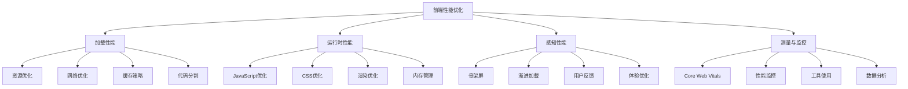
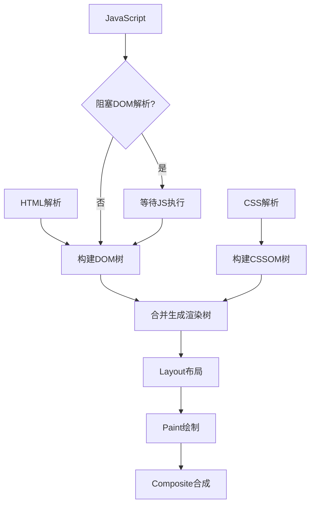
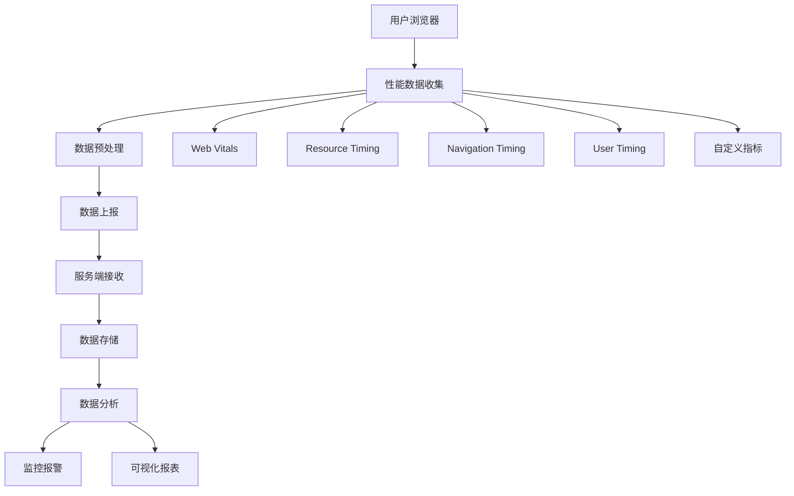

# 前端性能优化面试题

## 🎯 核心知识点

- 页面加载性能优化
- 运行时性能优化
- 网络性能优化
- 渲染性能优化
- 缓存策略
- 代码分割与懒加载

## 📊 前端性能优化体系图



## 💡 面试题目

### 🟢 初级题目

#### 1. **[初级]** 常见的前端性能优化方法有哪些？

**标签**: 性能优化, 最佳实践, 基础概念

**题目描述**:
请列举常见的前端性能优化方法，并说明其原理和适用场景。

**核心答案**:

**1. 资源优化**:

```javascript
// 图片优化
// - 选择合适的图片格式（WebP, AVIF优于JPEG）
// - 响应式图片


// - 图片压缩和优化
// - 使用CSS Sprites减少HTTP请求
// - SVG图标替代位图图标
```

**2. 代码优化**:

```javascript
// JavaScript优化
// - 减少和压缩JavaScript
// - 移除未使用的代码（Tree Shaking）
// - 使用模块化开发

// CSS优化
/* - 减少CSS文件大小 */
/* - 移除未使用的CSS */
/* - 使用CSS预处理器 */
/* - 关键CSS内联 */

// HTML优化
// - 减少DOM节点数量
// - 语义化HTML
// - 预加载关键资源
<link rel="preload" href="critical.css" as="style">
<link rel="preload" href="hero-image.jpg" as="image">
```

**3. 网络优化**:

```javascript
// HTTP请求优化
// - 减少HTTP请求数量
// - 使用HTTP/2多路复用
// - 启用Gzip/Brotli压缩

// 缓存策略
// - 浏览器缓存
// - CDN缓存
// - Service Worker缓存

// 预加载策略
<link rel="prefetch" href="next-page.js">     // 预取
<link rel="preconnect" href="https://api.example.com">  // 预连接
<link rel="dns-prefetch" href="https://cdn.example.com"> // DNS预解析
```

**4. 渲染优化**:

```css
/* 减少重绘和回流 */
.optimized {
    /* 使用transform替代改变position */
    transform: translateX(100px);
    
    /* 使用opacity替代visibility */
    opacity: 0;
    
    /* 启用硬件加速 */
    will-change: transform;
    transform: translateZ(0);
}

/* CSS动画优化 */
@keyframes slide {
    from { transform: translateX(-100%); }
    to { transform: translateX(0); }
}
```

**常见优化效果对比**:

| 优化方法 | 性能提升 | 实现难度 | 适用场景 |
|----------|----------|----------|----------|
| 图片压缩 | 高 | 低 | 所有项目 |
| 代码分割 | 高 | 中 | 大型应用 |
| CDN加速 | 高 | 低 | 全球化应用 |
| 缓存策略 | 中 | 中 | 重复访问多 |
| 懒加载 | 中 | 低 | 内容丰富页面 |

---

#### 2. **[初级]** 什么是关键渲染路径？如何优化？

**标签**: 关键渲染路径, 渲染机制, 优化策略

**题目描述**:
请解释浏览器的关键渲染路径，并说明如何进行优化。

**核心答案**:

**关键渲染路径流程**:



**关键渲染路径的组成**:

1. **HTML解析 → DOM树**:
```html
<!DOCTYPE html>
<html>
<head>
    <!-- 关键CSS应该内联或尽早加载 -->
    <style>
        /* 关键CSS - 首屏样式 */
        .header { background: #333; }
        .hero { height: 100vh; }
    </style>
    
    <!-- 非关键CSS延迟加载 -->
    <link rel="preload" href="non-critical.css" as="style" onload="this.onload=null;this.rel='stylesheet'">
</head>
<body>
    <!-- 内容 -->
</body>
</html>
```

2. **CSS解析 → CSSOM树**:
```css
/* 优化CSS选择器 - 避免复杂嵌套 */
/* ❌ 复杂选择器 */
.header .nav ul li a:hover { color: red; }

/* ✅ 简化选择器 */
.nav-link:hover { color: red; }

/* 减少CSS文件大小 */
/* 使用CSS变量减少重复 */
:root {
    --primary-color: #007bff;
    --font-size-base: 1rem;
}
```

**优化策略**:

**1. 优化关键资源**:
```html
<!-- 关键CSS内联 -->
<style>
    /* 首屏必需的样式 */
    body { margin: 0; font-family: Arial; }
    .header { background: #333; color: white; padding: 1rem; }
</style>

<!-- 预加载关键资源 -->
<link rel="preload" href="hero-image.jpg" as="image">
<link rel="preload" href="main.js" as="script">

<!-- 异步加载非关键CSS -->
<link rel="preload" href="non-critical.css" as="style" onload="this.onload=null;this.rel='stylesheet'">
<noscript><link rel="stylesheet" href="non-critical.css"></noscript>
```

**2. 减少关键资源数量**:
```javascript
// 代码分割 - 只加载必要代码
import('./heavy-feature.js').then(module => {
    // 懒加载非关键功能
    module.initHeavyFeature();
});

// 内联小的关键JavaScript
<script>
    // 小于14KB的关键JS可以内联
    function criticalFunction() {
        // 关键功能代码
    }
</script>
```

**3. 减少关键字节数**:
```html
<!-- 压缩HTML -->
<!DOCTYPE html><html><head><title>Title</title></head><body><h1>Hello</h1></body></html>

<!-- 启用服务器压缩 -->
<!-- 
    在服务器配置中启用Gzip/Brotli:
    - Gzip可减少70-90%的文件大小
    - Brotli压缩效果比Gzip更好
-->
```

**渲染性能指标**:

```javascript
// 测量关键渲染指标
function measureRenderingPerformance() {
    // First Contentful Paint
    const fcpEntry = performance.getEntriesByType('paint')
        .find(entry => entry.name === 'first-contentful-paint');
    
    // Largest Contentful Paint
    const observer = new PerformanceObserver((list) => {
        const entries = list.getEntries();
        const lastEntry = entries[entries.length - 1];
        console.log('LCP:', lastEntry.startTime);
    });
    observer.observe({ entryTypes: ['largest-contentful-paint'] });
    
    // Cumulative Layout Shift
    let clsValue = 0;
    const clsObserver = new PerformanceObserver((list) => {
        for (const entry of list.getEntries()) {
            if (!entry.hadRecentInput) {
                clsValue += entry.value;
            }
        }
    });
    clsObserver.observe({ entryTypes: ['layout-shift'] });
}
```

---

### 🟡 中级题目

#### 3. **[中级]** 实现图片懒加载的几种方案

**标签**: 懒加载, Intersection Observer, 性能优化

**题目描述**:
请实现图片懒加载功能，并比较不同实现方案的优缺点。

**核心答案**:

**方案1: Intersection Observer API（推荐）**:

```javascript
class LazyImageLoader {
    constructor(options = {}) {
        this.options = {
            rootMargin: '50px',
            threshold: 0.1,
            ...options
        };
        
        this.observer = new IntersectionObserver(
            this.handleIntersection.bind(this),
            this.options
        );
        
        this.init();
    }
    
    init() {
        // 找到所有需要懒加载的图片
        const lazyImages = document.querySelectorAll('img[data-src]');
        lazyImages.forEach(img => {
            this.observer.observe(img);
        });
    }
    
    handleIntersection(entries) {
        entries.forEach(entry => {
            if (entry.isIntersecting) {
                const img = entry.target;
                this.loadImage(img);
                this.observer.unobserve(img);
            }
        });
    }
    
    loadImage(img) {
        // 创建新的Image对象预加载
        const imageLoader = new Image();
        
        imageLoader.onload = () => {
            // 加载成功后替换src
            img.src = img.dataset.src;
            img.classList.add('loaded');
            
            // 如果有srcset，也要处理
            if (img.dataset.srcset) {
                img.srcset = img.dataset.srcset;
            }
        };
        
        imageLoader.onerror = () => {
            // 加载失败的处理
            img.classList.add('error');
            console.error('Image load failed:', img.dataset.src);
        };
        
        // 开始加载图片
        imageLoader.src = img.dataset.src;
    }
    
    // 手动触发加载（用于动态内容）
    observeNewImages() {
        const newImages = document.querySelectorAll('img[data-src]:not([data-observed])');
        newImages.forEach(img => {
            img.setAttribute('data-observed', 'true');
            this.observer.observe(img);
        });
    }
    
    // 销毁观察器
    destroy() {
        this.observer.disconnect();
    }
}

// 使用方式
document.addEventListener('DOMContentLoaded', () => {
    const lazyLoader = new LazyImageLoader({
        rootMargin: '100px', // 提前100px开始加载
        threshold: 0.1       // 10%可见时触发
    });
});
```

**HTML结构**:
```html
<!-- 懒加载图片 -->


<!-- 或者使用透明占位符 -->

```

**CSS样式**:
```css
.lazy-image {
    transition: opacity 0.3s;
    opacity: 0;
    background: #f0f0f0;
    min-height: 200px; /* 防止布局抖动 */
}

.lazy-image.loaded {
    opacity: 1;
}

.lazy-image.error {
    background: #ffebee;
    position: relative;
}

.lazy-image.error::after {
    content: '图片加载失败';
    position: absolute;
    top: 50%;
    left: 50%;
    transform: translate(-50%, -50%);
    color: #666;
}

/* 骨架屏效果 */
.lazy-image:not(.loaded) {
    background: linear-gradient(90deg, #f0f0f0 25%, #e0e0e0 50%, #f0f0f0 75%);
    background-size: 200% 100%;
    animation: loading 1.5s infinite;
}

@keyframes loading {
    0% { background-position: 200% 0; }
    100% { background-position: -200% 0; }
}
```

**方案2: 传统滚动监听（兼容性好）**:

```javascript
class ScrollBasedLazyLoader {
    constructor() {
        this.images = document.querySelectorAll('img[data-src]');
        this.throttledCheck = this.throttle(this.checkImages.bind(this), 100);
        
        this.init();
    }
    
    init() {
        // 初始检查
        this.checkImages();
        
        // 绑定滚动事件
        window.addEventListener('scroll', this.throttledCheck);
        window.addEventListener('resize', this.throttledCheck);
    }
    
    checkImages() {
        this.images.forEach((img, index) => {
            if (this.isInViewport(img)) {
                this.loadImage(img);
                // 从数组中移除已加载的图片
                this.images.splice(index, 1);
            }
        });
        
        // 如果所有图片都已加载，移除事件监听
        if (this.images.length === 0) {
            this.destroy();
        }
    }
    
    isInViewport(element) {
        const rect = element.getBoundingClientRect();
        const windowHeight = window.innerHeight || document.documentElement.clientHeight;
        
        return (
            rect.top >= -100 && // 提前100px开始加载
            rect.top <= windowHeight + 100
        );
    }
    
    loadImage(img) {
        const imageLoader = new Image();
        imageLoader.onload = () => {
            img.src = img.dataset.src;
            img.classList.add('loaded');
        };
        imageLoader.src = img.dataset.src;
    }
    
    // 节流函数
    throttle(func, delay) {
        let timeoutId;
        let lastExecTime = 0;
        
        return function (...args) {
            const currentTime = Date.now();
            
            if (currentTime - lastExecTime > delay) {
                func.apply(this, args);
                lastExecTime = currentTime;
            } else {
                clearTimeout(timeoutId);
                timeoutId = setTimeout(() => {
                    func.apply(this, args);
                    lastExecTime = Date.now();
                }, delay - (currentTime - lastExecTime));
            }
        };
    }
    
    destroy() {
        window.removeEventListener('scroll', this.throttledCheck);
        window.removeEventListener('resize', this.throttledCheck);
    }
}
```

**方案3: 现代浏览器原生懒加载**:

```html
<!-- 浏览器原生懒加载（简单但控制有限） -->


<!-- 结合自定义懒加载的混合方案 -->

```

**React组件实现**:

```jsx
import { useState, useEffect, useRef } from 'react';

function LazyImage({ src, placeholder, alt, className, ...props }) {
    const [imageSrc, setImageSrc] = useState(placeholder);
    const [imageRef, setImageRef] = useState();
    const [isLoaded, setIsLoaded] = useState(false);
    
    useEffect(() => {
        let observer;
        
        if (imageRef && imageSrc === placeholder) {
            observer = new IntersectionObserver(
                entries => {
                    entries.forEach(entry => {
                        if (entry.isIntersecting) {
                            setImageSrc(src);
                            observer.unobserve(imageRef);
                        }
                    });
                },
                { rootMargin: '50px' }
            );
            
            observer.observe(imageRef);
        }
        
        return () => {
            if (observer && observer.unobserve) {
                observer.unobserve(imageRef);
            }
        };
    }, [imageRef, imageSrc, placeholder, src]);
    
    return (
         setIsLoaded(true)}
            {...props}
        />
    );
}

// 使用
function App() {
    return (
        <div>
            <LazyImage
                src="large-image.jpg"
                placeholder="data:image/svg+xml;base64,..."
                alt="懒加载图片"
                className="hero-image"
            />
        </div>
    );
}
```

**方案对比**:

| 方案 | 优点 | 缺点 | 兼容性 |
|------|------|------|--------|
| Intersection Observer | 性能好，API简洁 | 兼容性稍差 | IE不支持 |
| 滚动监听 | 兼容性好，控制精确 | 性能较差，代码复杂 | 所有浏览器 |
| 原生loading="lazy" | 简单易用，性能最好 | 控制有限，兼容性差 | 现代浏览器 |

**最佳实践**:
- 优先使用Intersection Observer API
- 提供placeholder或骨架屏防止布局抖动
- 考虑预加载即将进入视口的图片
- 错误处理和回退机制
- 支持响应式图片（srcset）

---

### 🔴 高级题目

#### 4. **[高级]** 实现一个前端性能监控系统

**标签**: 性能监控, Web Vitals, 用户体验测量

**题目描述**:
请设计并实现一个完整的前端性能监控系统，包括数据收集、分析和报告。

**核心答案**:

**性能监控系统架构**:



**1. 核心性能指标收集**:

```javascript
class PerformanceMonitor {
    constructor(options = {}) {
        this.options = {
            apiEndpoint: '/api/performance',
            sampleRate: 1, // 采样率
            bufferSize: 10, // 批量上报大小
            maxRetries: 3,
            ...options
        };
        
        this.buffer = [];
        this.observers = new Map();
        this.retryCount = 0;
        
        this.init();
    }
    
    init() {
        // 等待页面加载完成
        if (document.readyState === 'loading') {
            document.addEventListener('DOMContentLoaded', () => {
                this.collectInitialMetrics();
            });
        } else {
            this.collectInitialMetrics();
        }
        
        // 收集Core Web Vitals
        this.collectWebVitals();
        
        // 收集资源性能
        this.collectResourceMetrics();
        
        // 监听用户交互
        this.collectInteractionMetrics();
        
        // 页面卸载时上报剩余数据
        this.setupBeaconAPI();
    }
    
    // 收集初始性能指标
    collectInitialMetrics() {
        const navigation = performance.getEntriesByType('navigation')[0];
        const paint = performance.getEntriesByType('paint');
        
        const metrics = {
            type: 'navigation',
            timestamp: Date.now(),
            url: location.href,
            userAgent: navigator.userAgent,
            connection: this.getConnectionInfo(),
            timing: {
                // DNS查询时间
                dnsLookup: navigation.domainLookupEnd - navigation.domainLookupStart,
                
                // TCP连接时间
                tcpConnect: navigation.connectEnd - navigation.connectStart,
                
                // SSL时间
                sslConnect: navigation.connectEnd - navigation.secureConnectionStart,
                
                // 请求响应时间
                request: navigation.responseEnd - navigation.requestStart,
                
                // DOM构建时间
                domReady: navigation.domContentLoadedEventEnd - navigation.navigationStart,
                
                // 页面完全加载时间
                loadComplete: navigation.loadEventEnd - navigation.navigationStart,
                
                // 首次绘制时间
                firstPaint: paint.find(p => p.name === 'first-paint')?.startTime || 0,
                
                // 首次内容绘制时间
                firstContentfulPaint: paint.find(p => p.name === 'first-contentful-paint')?.startTime || 0
            }
        };
        
        this.addToBuffer(metrics);
    }
    
    // 收集Web Vitals指标
    collectWebVitals() {
        // Largest Contentful Paint (LCP)
        this.observeLCP();
        
        // First Input Delay (FID)
        this.observeFID();
        
        // Cumulative Layout Shift (CLS)
        this.observeCLS();
        
        // Time to First Byte (TTFB)
        this.observeTTFB();
        
        // Time to Interactive (TTI)
        this.observeTTI();
    }
    
    observeLCP() {
        const observer = new PerformanceObserver((list) => {
            const entries = list.getEntries();
            const lastEntry = entries[entries.length - 1];
            
            this.addToBuffer({
                type: 'web-vital',
                name: 'LCP',
                value: lastEntry.startTime,
                element: lastEntry.element?.tagName,
                url: lastEntry.url,
                timestamp: Date.now()
            });
        });
        
        observer.observe({ entryTypes: ['largest-contentful-paint'] });
        this.observers.set('lcp', observer);
    }
    
    observeFID() {
        const observer = new PerformanceObserver((list) => {
            for (const entry of list.getEntries()) {
                this.addToBuffer({
                    type: 'web-vital',
                    name: 'FID',
                    value: entry.processingStart - entry.startTime,
                    target: entry.target?.tagName,
                    timestamp: Date.now()
                });
            }
        });
        
        observer.observe({ entryTypes: ['first-input'] });
        this.observers.set('fid', observer);
    }
    
    observeCLS() {
        let clsValue = 0;
        let sessionValue = 0;
        let sessionEntries = [];
        
        const observer = new PerformanceObserver((list) => {
            for (const entry of list.getEntries()) {
                if (!entry.hadRecentInput) {
                    const firstSessionEntry = sessionEntries[0];
                    const lastSessionEntry = sessionEntries[sessionEntries.length - 1];
                    
                    // 如果条目与上一个条目的时间间隔小于1秒且
                    // 与会话中第一个条目的时间间隔小于5秒，则
                    // 将条目包含在当前会话中
                    if (sessionValue &&
                        entry.startTime - lastSessionEntry.startTime < 1000 &&
                        entry.startTime - firstSessionEntry.startTime < 5000) {
                        sessionValue += entry.value;
                        sessionEntries.push(entry);
                    } else {
                        sessionValue = entry.value;
                        sessionEntries = [entry];
                    }
                    
                    // 如果当前会话值大于当前CLS值，
                    // 则更新CLS及其相关条目
                    if (sessionValue > clsValue) {
                        clsValue = sessionValue;
                        
                        this.addToBuffer({
                            type: 'web-vital',
                            name: 'CLS',
                            value: clsValue,
                            entries: sessionEntries.map(e => ({
                                startTime: e.startTime,
                                value: e.value,
                                sources: e.sources?.map(s => ({
                                    node: s.node?.tagName
                                }))
                            })),
                            timestamp: Date.now()
                        });
                    }
                }
            }
        });
        
        observer.observe({ entryTypes: ['layout-shift'] });
        this.observers.set('cls', observer);
    }
    
    // 收集资源性能指标
    collectResourceMetrics() {
        const observer = new PerformanceObserver((list) => {
            for (const entry of list.getEntries()) {
                // 过滤掉一些不重要的资源
                if (this.shouldIgnoreResource(entry.name)) {
                    continue;
                }
                
                this.addToBuffer({
                    type: 'resource',
                    name: entry.name,
                    initiatorType: entry.initiatorType,
                    size: entry.transferSize || entry.encodedBodySize,
                    duration: entry.duration,
                    startTime: entry.startTime,
                    domainLookup: entry.domainLookupEnd - entry.domainLookupStart,
                    connect: entry.connectEnd - entry.connectStart,
                    request: entry.responseEnd - entry.requestStart,
                    download: entry.responseEnd - entry.responseStart,
                    timestamp: Date.now()
                });
            }
        });
        
        observer.observe({ entryTypes: ['resource'] });
        this.observers.set('resource', observer);
    }
    
    // 收集用户交互指标
    collectInteractionMetrics() {
        let clickCount = 0;
        let scrollDepth = 0;
        let maxScrollDepth = 0;
        
        // 点击事件
        document.addEventListener('click', (event) => {
            clickCount++;
            
            this.addToBuffer({
                type: 'interaction',
                name: 'click',
                target: event.target.tagName,
                timestamp: Date.now(),
                totalClicks: clickCount
            });
        }, { passive: true });
        
        // 滚动深度
        window.addEventListener('scroll', this.throttle(() => {
            const scrollTop = window.pageYOffset || document.documentElement.scrollTop;
            const windowHeight = window.innerHeight;
            const documentHeight = document.documentElement.scrollHeight;
            
            scrollDepth = Math.round((scrollTop + windowHeight) / documentHeight * 100);
            
            if (scrollDepth > maxScrollDepth) {
                maxScrollDepth = scrollDepth;
                
                // 记录重要的滚动里程碑
                if (maxScrollDepth >= 25 && maxScrollDepth % 25 === 0) {
                    this.addToBuffer({
                        type: 'interaction',
                        name: 'scroll-depth',
                        value: maxScrollDepth,
                        timestamp: Date.now()
                    });
                }
            }
        }, 100), { passive: true });
    }
    
    // 错误监控
    collectErrorMetrics() {
        // JavaScript错误
        window.addEventListener('error', (event) => {
            this.addToBuffer({
                type: 'error',
                name: 'javascript-error',
                message: event.message,
                filename: event.filename,
                lineno: event.lineno,
                colno: event.colno,
                stack: event.error?.stack,
                timestamp: Date.now()
            });
        });
        
        // Promise拒绝
        window.addEventListener('unhandledrejection', (event) => {
            this.addToBuffer({
                type: 'error',
                name: 'unhandled-promise-rejection',
                reason: event.reason?.toString(),
                stack: event.reason?.stack,
                timestamp: Date.now()
            });
        });
        
        // 资源加载错误
        window.addEventListener('error', (event) => {
            if (event.target !== window) {
                this.addToBuffer({
                    type: 'error',
                    name: 'resource-error',
                    source: event.target.src || event.target.href,
                    tagName: event.target.tagName,
                    timestamp: Date.now()
                });
            }
        }, true);
    }
    
    // 获取连接信息
    getConnectionInfo() {
        const connection = navigator.connection || navigator.mozConnection || navigator.webkitConnection;
        
        if (connection) {
            return {
                effectiveType: connection.effectiveType,
                downlink: connection.downlink,
                rtt: connection.rtt,
                saveData: connection.saveData
            };
        }
        
        return null;
    }
    
    // 添加数据到缓冲区
    addToBuffer(data) {
        // 采样控制
        if (Math.random() > this.options.sampleRate) {
            return;
        }
        
        this.buffer.push({
            ...data,
            sessionId: this.getSessionId(),
            userId: this.getUserId(),
            page: {
                url: location.href,
                title: document.title,
                referrer: document.referrer
            }
        });
        
        // 达到缓冲区大小时批量上报
        if (this.buffer.length >= this.options.bufferSize) {
            this.flushBuffer();
        }
    }
    
    // 上报数据
    async flushBuffer() {
        if (this.buffer.length === 0) return;
        
        const data = [...this.buffer];
        this.buffer = [];
        
        try {
            await fetch(this.options.apiEndpoint, {
                method: 'POST',
                headers: {
                    'Content-Type': 'application/json'
                },
                body: JSON.stringify({
                    metrics: data,
                    timestamp: Date.now()
                })
            });
            
            this.retryCount = 0;
        } catch (error) {
            console.error('Performance data upload failed:', error);
            
            // 重试逻辑
            if (this.retryCount < this.options.maxRetries) {
                this.retryCount++;
                this.buffer.unshift(...data); // 重新添加到缓冲区
                
                setTimeout(() => {
                    this.flushBuffer();
                }, Math.pow(2, this.retryCount) * 1000); // 指数退避
            }
        }
    }
    
    // 页面卸载时使用Beacon API
    setupBeaconAPI() {
        window.addEventListener('beforeunload', () => {
            if (this.buffer.length > 0) {
                const data = JSON.stringify({
                    metrics: this.buffer,
                    timestamp: Date.now()
                });
                
                navigator.sendBeacon(this.options.apiEndpoint, data);
            }
        });
        
        // 页面隐藏时也上报（移动端切换标签页）
        document.addEventListener('visibilitychange', () => {
            if (document.visibilityState === 'hidden' && this.buffer.length > 0) {
                this.flushBuffer();
            }
        });
    }
    
    // 工具方法
    throttle(func, delay) {
        let timeoutId;
        let lastExecTime = 0;
        
        return function (...args) {
            const currentTime = Date.now();
            
            if (currentTime - lastExecTime > delay) {
                func.apply(this, args);
                lastExecTime = currentTime;
            } else {
                clearTimeout(timeoutId);
                timeoutId = setTimeout(() => {
                    func.apply(this, args);
                    lastExecTime = Date.now();
                }, delay - (currentTime - lastExecTime));
            }
        };
    }
    
    shouldIgnoreResource(url) {
        const ignoredPatterns = [
            /\.woff2?$/,
            /analytics/,
            /tracking/,
            /beacon/
        ];
        
        return ignoredPatterns.some(pattern => pattern.test(url));
    }
    
    getSessionId() {
        // 实现会话ID获取逻辑
        return sessionStorage.getItem('sessionId') || 'anonymous';
    }
    
    getUserId() {
        // 实现用户ID获取逻辑
        return localStorage.getItem('userId') || 'anonymous';
    }
    
    // 手动记录自定义指标
    mark(name) {
        performance.mark(name);
        
        this.addToBuffer({
            type: 'user-timing',
            name: 'mark',
            markName: name,
            timestamp: Date.now()
        });
    }
    
    measure(name, startMark, endMark) {
        performance.measure(name, startMark, endMark);
        const measure = performance.getEntriesByName(name, 'measure')[0];
        
        this.addToBuffer({
            type: 'user-timing',
            name: 'measure',
            measureName: name,
            duration: measure.duration,
            startMark,
            endMark,
            timestamp: Date.now()
        });
    }
    
    // 销毁监控器
    destroy() {
        this.observers.forEach(observer => observer.disconnect());
        this.observers.clear();
        this.flushBuffer();
    }
}

// 使用方式
const monitor = new PerformanceMonitor({
    apiEndpoint: 'https://api.example.com/performance',
    sampleRate: 0.1, // 10%采样率
    bufferSize: 20
});

// 自定义性能标记
monitor.mark('feature-start');
// ... 执行某个功能
monitor.mark('feature-end');
monitor.measure('feature-duration', 'feature-start', 'feature-end');
```

**2. 数据分析和报警系统**:

```javascript
// 服务端性能数据分析
class PerformanceAnalyzer {
    constructor() {
        this.thresholds = {
            LCP: 2500,    // 2.5秒
            FID: 100,     // 100毫秒
            CLS: 0.1,     // 0.1
            TTFB: 800     // 800毫秒
        };
    }
    
    analyzeMetrics(metrics) {
        const analysis = {
            performance: this.calculatePerformanceScore(metrics),
            issues: this.detectIssues(metrics),
            recommendations: this.generateRecommendations(metrics),
            trends: this.analyzeTrends(metrics)
        };
        
        return analysis;
    }
    
    calculatePerformanceScore(metrics) {
        // 基于Core Web Vitals计算性能分数
        const scores = {
            LCP: this.scoreMetric(metrics.LCP, 2500, 4000),
            FID: this.scoreMetric(metrics.FID, 100, 300),
            CLS: this.scoreMetric(metrics.CLS, 0.1, 0.25),
            TTFB: this.scoreMetric(metrics.TTFB, 800, 1800)
        };
        
        // 加权平均分数
        const weights = { LCP: 0.3, FID: 0.3, CLS: 0.3, TTFB: 0.1 };
        const totalScore = Object.keys(scores).reduce((sum, key) => {
            return sum + (scores[key] * weights[key]);
        }, 0);
        
        return {
            total: Math.round(totalScore),
            breakdown: scores
        };
    }
    
    scoreMetric(value, goodThreshold, poorThreshold) {
        if (value <= goodThreshold) return 100;
        if (value >= poorThreshold) return 0;
        
        // 线性插值
        const ratio = (poorThreshold - value) / (poorThreshold - goodThreshold);
        return Math.round(ratio * 100);
    }
}
```

**性能监控最佳实践**:
- ✅ 采样控制，避免影响性能
- ✅ 批量上报，减少网络请求
- ✅ 错误重试和降级处理
- ✅ 用户隐私保护
- ✅ 跨浏览器兼容性处理
- ✅ 实时报警和异常检测

---

## 🔗 相关链接

- [← 返回前端题库](./README.md)
- [JavaScript核心概念](./javascript-core.md)
- [CSS布局与响应式设计](./css-layout.md)
- [React基础概念](./react-basics.md)

---

*性能优化是一个持续的过程，需要根据实际项目情况制定合适的优化策略* 