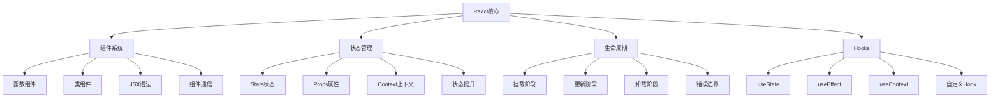
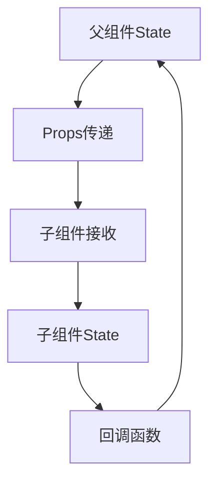
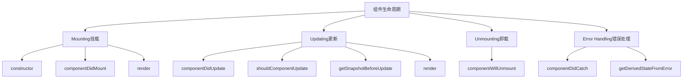
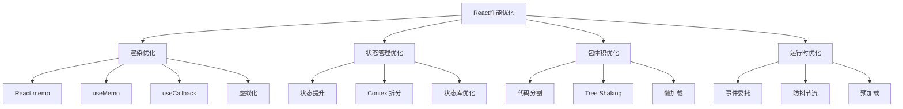

# React基础概念面试题

## 🎯 核心知识点

- JSX语法与虚拟DOM
- 组件化开发思想
- Props与State管理
- 生命周期方法
- 事件处理机制
- Hooks基础应用

## 📊 React核心概念关联图



## 💡 面试题目

### 🟢 初级题目

#### 1. **[初级]** 什么是JSX？它与HTML有什么区别？

**标签**: JSX, 虚拟DOM, 语法

**题目描述**:
请解释JSX的概念，它的工作原理，以及与传统HTML的主要区别。

**核心答案**:

**JSX定义**: JSX是JavaScript的语法扩展，允许在JavaScript中编写类似HTML的代码。

**工作原理**:
```javascript
// JSX代码
const element = <h1 className="greeting">Hello, World!</h1>;

// 编译后的JavaScript (Babel转换)
const element = React.createElement(
    'h1',
    { className: 'greeting' },
    'Hello, World!'
);
```

**与HTML的主要区别**:

1. **属性命名**:
```jsx
// JSX - 使用驼峰命名
<div className="container" onClick={handleClick}>
    <label htmlFor="input">Name:</label>
    <input tabIndex="1" />
</div>

// HTML - 使用短横线命名
<div class="container" onclick="handleClick()">
    <label for="input">Name:</label>
    <input tabindex="1" />
</div>
```

2. **表达式嵌入**:
```jsx
const name = 'Alice';
const element = <h1>Hello, {name}!</h1>; // 可以嵌入JavaScript表达式
```

3. **自闭合标签**:
```jsx
// JSX - 必须自闭合

<input type="text" />

// HTML - 可选自闭合

<input type="text">
```

4. **组件化**:
```jsx
// JSX支持自定义组件
<MyComponent prop1="value1" prop2={value2} />
```

**JSX的优势**:
- 类型安全（配合TypeScript）
- 编译时错误检查
- 更好的开发体验
- 组件化开发支持

**扩展思考**:
- 为什么JSX使用className而不是class？
- JSX如何防止XSS攻击？

---

#### 2. **[初级]** React组件有哪些类型？如何选择使用？

**标签**: 组件类型, 函数组件, 类组件

**题目描述**:
请介绍React中的组件类型，并说明在什么场景下选择使用哪种组件。

**核心答案**:

**React组件类型**:

1. **函数组件（推荐）**:
```jsx
// 基础函数组件
function Welcome(props) {
    return <h1>Hello, {props.name}!</h1>;
}

// 箭头函数组件
const Welcome = (props) => {
    return <h1>Hello, {props.name}!</h1>;
};

// 带Hooks的函数组件
function Counter() {
    const [count, setCount] = useState(0);
    
    return (
        <div>
            <p>Count: {count}</p>
            <button onClick={() => setCount(count + 1)}>
                Increment
            </button>
        </div>
    );
}
```

2. **类组件（传统方式）**:
```jsx
class Welcome extends React.Component {
    constructor(props) {
        super(props);
        this.state = {
            count: 0
        };
    }
    
    handleClick = () => {
        this.setState({ count: this.state.count + 1 });
    }
    
    componentDidMount() {
        console.log('Component mounted');
    }
    
    render() {
        return (
            <div>
                <h1>Hello, {this.props.name}!</h1>
                <p>Count: {this.state.count}</p>
                <button onClick={this.handleClick}>
                    Increment
                </button>
            </div>
        );
    }
}
```

**选择指南**:

| 特性 | 函数组件 | 类组件 |
|------|----------|--------|
| 语法简洁性 | ✅ 更简洁 | ❌ 较复杂 |
| Hooks支持 | ✅ 原生支持 | ❌ 不支持 |
| 性能 | ✅ 更好 | ❌ 稍差 |
| 生命周期 | ✅ useEffect | ✅ 完整方法 |
| this绑定 | ✅ 无需处理 | ❌ 需要绑定 |
| React未来 | ✅ 主推方向 | ❌ 维护模式 |

**推荐使用函数组件的原因**:
- 代码更简洁易读
- Hooks提供更灵活的状态管理
- 更好的性能优化
- React团队的未来发展方向

---

#### 3. **[初级]** Props和State有什么区别？

**标签**: Props, State, 数据流

**题目描述**:
请详细解释Props和State的概念、区别以及使用场景。

**核心答案**:

**Props（属性）**:
- 从父组件传递给子组件的数据
- 只读，不可修改
- 用于组件间通信

**State（状态）**:
- 组件内部的可变数据
- 可以通过setState或useState修改
- 驱动组件重新渲染

**对比表格**:

| 特性 | Props | State |
|------|-------|-------|
| 数据来源 | 父组件传递 | 组件内部 |
| 可变性 | 只读 | 可修改 |
| 作用域 | 组件间 | 组件内 |
| 更新方式 | 父组件更新 | setState/useState |
| 初始化 | 父组件传入 | 组件内定义 |

**实际示例**:

```jsx
// 父组件
function App() {
    const [user, setUser] = useState({ name: 'Alice', age: 25 });
    
    return (
        <div>
            <UserProfile user={user} /> {/* Props传递 */}
            <EditForm onUpdate={setUser} /> {/* 回调函数传递 */}
        </div>
    );
}

// 子组件 - 接收Props
function UserProfile({ user }) {
    // user是Props，只读
    return (
        <div>
            <h2>{user.name}</h2>
            <p>Age: {user.age}</p>
        </div>
    );
}

// 子组件 - 管理内部State
function EditForm({ onUpdate }) {
    const [name, setName] = useState(''); // 内部State
    const [age, setAge] = useState(0);    // 内部State
    
    const handleSubmit = () => {
        onUpdate({ name, age }); // 通过回调修改父组件State
    };
    
    return (
        <form onSubmit={handleSubmit}>
            <input 
                value={name} 
                onChange={(e) => setName(e.target.value)} 
            />
            <input 
                type="number"
                value={age} 
                onChange={(e) => setAge(parseInt(e.target.value))} 
            />
            <button type="submit">Update</button>
        </form>
    );
}
```

**数据流向**:


**最佳实践**:
- 能用Props就不用State（数据向下流动）
- State应该放在需要它的最小组件中
- 多个组件需要共享的数据提升到共同父组件

---

### 🟡 中级题目

#### 4. **[中级]** React生命周期方法及其应用场景

**标签**: 生命周期, 类组件, 优化

**题目描述**:
请详细说明React类组件的生命周期方法，并举例说明各个阶段的应用场景。

**核心答案**:

**生命周期阶段图**:



**1. 挂载阶段（Mounting）**:

```jsx
class MyComponent extends React.Component {
    constructor(props) {
        super(props);
        // 1. 初始化state
        this.state = {
            data: null,
            loading: true
        };
        console.log('1. Constructor');
    }
    
    componentDidMount() {
        // 3. 组件已挂载，适合：
        // - 网络请求
        // - 订阅事件
        // - 定时器设置
        console.log('3. ComponentDidMount');
        
        this.fetchData();
        this.timer = setInterval(() => {
            console.log('Timer tick');
        }, 1000);
    }
    
    render() {
        // 2. 渲染JSX
        console.log('2. Render');
        
        if (this.state.loading) {
            return <div>Loading...</div>;
        }
        
        return (
            <div>
                <h1>Data: {this.state.data}</h1>
            </div>
        );
    }
    
    fetchData = async () => {
        try {
            const response = await fetch('/api/data');
            const data = await response.json();
            this.setState({ data, loading: false });
        } catch (error) {
            console.error('Error fetching data:', error);
        }
    }
}
```

**2. 更新阶段（Updating）**:

```jsx
class OptimizedComponent extends React.Component {
    shouldComponentUpdate(nextProps, nextState) {
        // 性能优化：决定是否重新渲染
        return (
            nextProps.id !== this.props.id ||
            nextState.count !== this.state.count
        );
    }
    
    getSnapshotBeforeUpdate(prevProps, prevState) {
        // 在DOM更新前捕获信息
        if (prevProps.list.length < this.props.list.length) {
            const list = this.listRef.current;
            return list.scrollHeight - list.scrollTop;
        }
        return null;
    }
    
    componentDidUpdate(prevProps, prevState, snapshot) {
        // DOM更新后执行
        if (snapshot !== null) {
            const list = this.listRef.current;
            list.scrollTop = list.scrollHeight - snapshot;
        }
        
        // 比较props变化，执行相应操作
        if (prevProps.userId !== this.props.userId) {
            this.fetchUserData();
        }
    }
    
    render() {
        return (
            <div ref={this.listRef}>
                {this.props.list.map(item => (
                    <div key={item.id}>{item.name}</div>
                ))}
            </div>
        );
    }
}
```

**3. 卸载阶段（Unmounting）**:

```jsx
class CleanupComponent extends React.Component {
    componentDidMount() {
        // 设置定时器和事件监听
        this.timer = setInterval(this.updateTime, 1000);
        window.addEventListener('resize', this.handleResize);
        
        // WebSocket连接
        this.ws = new WebSocket('ws://localhost:8080');
        this.ws.onmessage = this.handleMessage;
    }
    
    componentWillUnmount() {
        // 清理工作：
        // - 清除定时器
        // - 移除事件监听
        // - 取消网络请求
        // - 关闭连接
        
        if (this.timer) {
            clearInterval(this.timer);
        }
        
        window.removeEventListener('resize', this.handleResize);
        
        if (this.ws) {
            this.ws.close();
        }
        
        // 取消pending的请求
        if (this.controller) {
            this.controller.abort();
        }
    }
    
    fetchData = () => {
        this.controller = new AbortController();
        fetch('/api/data', { 
            signal: this.controller.signal 
        })
        .then(response => response.json())
        .then(data => this.setState({ data }))
        .catch(error => {
            if (error.name !== 'AbortError') {
                console.error('Fetch error:', error);
            }
        });
    }
}
```

**4. 错误处理**:

```jsx
class ErrorBoundary extends React.Component {
    constructor(props) {
        super(props);
        this.state = { hasError: false, error: null };
    }
    
    static getDerivedStateFromError(error) {
        // 更新state，下次渲染显示错误UI
        return { hasError: true, error };
    }
    
    componentDidCatch(error, errorInfo) {
        // 记录错误日志
        console.error('Error caught by boundary:', error, errorInfo);
        
        // 发送错误报告到监控服务
        this.logErrorToService(error, errorInfo);
    }
    
    render() {
        if (this.state.hasError) {
            return (
                <div>
                    <h2>Something went wrong.</h2>
                    <details>
                        {this.state.error && this.state.error.toString()}
                    </details>
                </div>
            );
        }
        
        return this.props.children;
    }
}
```

**生命周期最佳实践**:
- `componentDidMount`: 网络请求、DOM操作、订阅
- `componentDidUpdate`: 响应props/state变化
- `componentWillUnmount`: 清理工作，防止内存泄漏
- `shouldComponentUpdate`: 性能优化（现在推荐使用React.memo）

---

#### 5. **[中级]** useState和useEffect的详细用法

**标签**: Hooks, useState, useEffect, 副作用

**题目描述**:
请详细说明useState和useEffect的用法、原理和最佳实践。

**核心答案**:

**useState详解**:

1. **基础用法**:
```jsx
function Counter() {
    const [count, setCount] = useState(0);
    const [name, setName] = useState('');
    const [user, setUser] = useState({ name: '', age: 0 });
    
    // 函数式更新
    const increment = () => {
        setCount(prevCount => prevCount + 1);
    };
    
    // 对象状态更新
    const updateUser = (field, value) => {
        setUser(prevUser => ({
            ...prevUser,
            [field]: value
        }));
    };
    
    return (
        <div>
            <p>Count: {count}</p>
            <button onClick={increment}>+1</button>
            <input 
                value={name}
                onChange={(e) => setName(e.target.value)}
            />
        </div>
    );
}
```

2. **惰性初始化**:
```jsx
function ExpensiveComponent() {
    // 避免每次渲染都执行昂贵的初始化
    const [data, setData] = useState(() => {
        console.log('Expensive calculation');
        return computeExpensiveValue();
    });
    
    return <div>{data}</div>;
}
```

**useEffect详解**:

1. **基础用法 - 副作用处理**:
```jsx
function UserProfile({ userId }) {
    const [user, setUser] = useState(null);
    const [loading, setLoading] = useState(true);
    
    // 每次渲染后执行
    useEffect(() => {
        console.log('Effect runs after every render');
    });
    
    // 仅在挂载时执行
    useEffect(() => {
        console.log('Component mounted');
        
        return () => {
            console.log('Component will unmount');
        };
    }, []); // 空依赖数组
    
    // 依赖特定值变化时执行
    useEffect(() => {
        if (userId) {
            setLoading(true);
            fetchUser(userId).then(userData => {
                setUser(userData);
                setLoading(false);
            });
        }
    }, [userId]); // 依赖userId
    
    return loading ? <div>Loading...</div> : <div>{user?.name}</div>;
}
```

2. **清理副作用**:
```jsx
function TimerComponent() {
    const [time, setTime] = useState(new Date());
    
    useEffect(() => {
        // 设置定时器
        const timer = setInterval(() => {
            setTime(new Date());
        }, 1000);
        
        // 清理函数
        return () => {
            clearInterval(timer);
        };
    }, []);
    
    return <div>Current time: {time.toLocaleString()}</div>;
}

function WebSocketComponent() {
    const [messages, setMessages] = useState([]);
    
    useEffect(() => {
        const ws = new WebSocket('ws://localhost:8080');
        
        ws.onmessage = (event) => {
            setMessages(prev => [...prev, event.data]);
        };
        
        ws.onerror = (error) => {
            console.error('WebSocket error:', error);
        };
        
        // 清理WebSocket连接
        return () => {
            ws.close();
        };
    }, []);
    
    return (
        <div>
            {messages.map((msg, index) => (
                <div key={index}>{msg}</div>
            ))}
        </div>
    );
}
```

3. **条件性执行和优化**:
```jsx
function SearchComponent() {
    const [query, setQuery] = useState('');
    const [results, setResults] = useState([]);
    const [isSearching, setIsSearching] = useState(false);
    
    useEffect(() => {
        // 只有当query不为空时才搜索
        if (!query.trim()) {
            setResults([]);
            return;
        }
        
        setIsSearching(true);
        
        // 防抖处理
        const timeoutId = setTimeout(async () => {
            try {
                const searchResults = await searchAPI(query);
                setResults(searchResults);
            } catch (error) {
                console.error('Search error:', error);
            } finally {
                setIsSearching(false);
            }
        }, 300);
        
        // 清理定时器
        return () => {
            clearTimeout(timeoutId);
        };
    }, [query]);
    
    return (
        <div>
            <input 
                value={query}
                onChange={(e) => setQuery(e.target.value)}
                placeholder="Search..."
            />
            {isSearching && <div>Searching...</div>}
            <ul>
                {results.map(item => (
                    <li key={item.id}>{item.title}</li>
                ))}
            </ul>
        </div>
    );
}
```

**依赖数组规则**:

```jsx
function DependencyExample() {
    const [count, setCount] = useState(0);
    const [name, setName] = useState('');
    
    // ❌ 错误：缺少依赖
    useEffect(() => {
        console.log(`Count is ${count}`);
    }, []); // 应该包含count
    
    // ✅ 正确：包含所有依赖
    useEffect(() => {
        console.log(`Count is ${count}`);
    }, [count]);
    
    // ✅ 使用useCallback避免不必要的依赖
    const logCount = useCallback(() => {
        console.log(`Count is ${count}`);
    }, [count]);
    
    useEffect(() => {
        logCount();
    }, [logCount]);
    
    return (
        <div>
            <p>Count: {count}</p>
            <button onClick={() => setCount(c => c + 1)}>+</button>
        </div>
    );
}
```

**最佳实践**:
- 将相关的副作用分组到同一个useEffect中
- 使用多个useEffect分离不同关注点
- 正确设置依赖数组，使用ESLint插件检查
- 清理副作用防止内存泄漏
- 使用函数式更新避免不必要的依赖

---

### 🔴 高级题目

#### 6. **[高级]** React性能优化技巧与原理

**标签**: 性能优化, React.memo, useMemo, useCallback

**题目描述**:
请详细说明React应用的性能优化方法，包括原理分析和实际应用案例。

**核心答案**:

**React性能优化策略图**:



**1. 组件渲染优化**:

```jsx
// React.memo - 浅比较优化
const ExpensiveComponent = React.memo(function ExpensiveComponent({ data, onUpdate }) {
    console.log('ExpensiveComponent rendered');
    
    return (
        <div>
            {data.map(item => (
                <div key={item.id}>
                    {item.name} - {item.value}
                </div>
            ))}
            <button onClick={() => onUpdate(data[0].id)}>
                Update First Item
            </button>
        </div>
    );
});

// 自定义比较函数
const CustomMemoComponent = React.memo(function CustomMemoComponent({ user, settings }) {
    return (
        <div>
            <h3>{user.name}</h3>
            <p>Theme: {settings.theme}</p>
        </div>
    );
}, (prevProps, nextProps) => {
    // 自定义比较逻辑
    return (
        prevProps.user.name === nextProps.user.name &&
        prevProps.settings.theme === nextProps.settings.theme
    );
});
```

**2. useMemo优化昂贵计算**:

```jsx
function DataAnalytics({ data, filters }) {
    // ❌ 每次渲染都重新计算
    const expensiveValue = processLargeDataset(data, filters);
    
    // ✅ 只在依赖变化时重新计算
    const memoizedValue = useMemo(() => {
        console.log('Computing expensive value...');
        return processLargeDataset(data, filters);
    }, [data, filters]);
    
    // ✅ 复杂对象的创建优化
    const chartConfig = useMemo(() => ({
        type: 'bar',
        data: memoizedValue,
        options: {
            responsive: true,
            plugins: {
                legend: { position: 'top' }
            }
        }
    }), [memoizedValue]);
    
    return (
        <div>
            <Chart config={chartConfig} />
            <Summary data={memoizedValue} />
        </div>
    );
}

function processLargeDataset(data, filters) {
    // 模拟昂贵的数据处理
    return data
        .filter(item => filters.includes(item.category))
        .reduce((acc, item) => {
            acc[item.category] = (acc[item.category] || 0) + item.value;
            return acc;
        }, {});
}
```

**3. useCallback优化函数引用**:

```jsx
function TodoApp() {
    const [todos, setTodos] = useState([]);
    const [filter, setFilter] = useState('all');
    
    // ❌ 每次渲染创建新函数
    const handleToggle = (id) => {
        setTodos(todos.map(todo => 
            todo.id === id ? { ...todo, completed: !todo.completed } : todo
        ));
    };
    
    // ✅ 使用useCallback优化
    const handleToggleOptimized = useCallback((id) => {
        setTodos(prevTodos => 
            prevTodos.map(todo => 
                todo.id === id ? { ...todo, completed: !todo.completed } : todo
            )
        );
    }, []); // 没有外部依赖
    
    const handleDelete = useCallback((id) => {
        setTodos(prevTodos => prevTodos.filter(todo => todo.id !== id));
    }, []);
    
    const filteredTodos = useMemo(() => {
        switch (filter) {
            case 'active':
                return todos.filter(todo => !todo.completed);
            case 'completed':
                return todos.filter(todo => todo.completed);
            default:
                return todos;
        }
    }, [todos, filter]);
    
    return (
        <div>
            <FilterButtons filter={filter} onFilterChange={setFilter} />
            <TodoList 
                todos={filteredTodos}
                onToggle={handleToggleOptimized}
                onDelete={handleDelete}
            />
        </div>
    );
}

// 子组件将受益于父组件的优化
const TodoItem = React.memo(function TodoItem({ todo, onToggle, onDelete }) {
    console.log(`TodoItem ${todo.id} rendered`);
    
    return (
        <div>
            <input 
                type="checkbox"
                checked={todo.completed}
                onChange={() => onToggle(todo.id)}
            />
            <span>{todo.text}</span>
            <button onClick={() => onDelete(todo.id)}>Delete</button>
        </div>
    );
});
```

**4. 虚拟化长列表**:

```jsx
import { FixedSizeList as List } from 'react-window';

function VirtualizedList({ items }) {
    const Row = ({ index, style }) => (
        <div style={style}>
            <div className="row-content">
                <h4>{items[index].title}</h4>
                <p>{items[index].description}</p>
            </div>
        </div>
    );
    
    return (
        <List
            height={600}        // 容器高度
            itemCount={items.length}
            itemSize={100}      // 每项高度
            width="100%"
        >
            {Row}
        </List>
    );
}

// 无限滚动 + 虚拟化
function InfiniteVirtualList() {
    const [items, setItems] = useState([]);
    const [hasNextPage, setHasNextPage] = useState(true);
    const [isLoading, setIsLoading] = useState(false);
    
    const loadMore = useCallback(async () => {
        if (isLoading || !hasNextPage) return;
        
        setIsLoading(true);
        try {
            const newItems = await fetchMoreItems(items.length);
            setItems(prev => [...prev, ...newItems]);
            setHasNextPage(newItems.length > 0);
        } finally {
            setIsLoading(false);
        }
    }, [items.length, isLoading, hasNextPage]);
    
    return (
        <InfiniteLoader
            isItemLoaded={(index) => index < items.length}
            itemCount={hasNextPage ? items.length + 1 : items.length}
            loadMoreItems={loadMore}
        >
            {({ onItemsRendered, ref }) => (
                <List
                    ref={ref}
                    height={600}
                    itemCount={items.length}
                    itemSize={80}
                    onItemsRendered={onItemsRendered}
                >
                    {({ index, style }) => (
                        <div style={style}>
                            {index < items.length ? (
                                <div>{items[index].title}</div>
                            ) : (
                                <div>Loading...</div>
                            )}
                        </div>
                    )}
                </List>
            )}
        </InfiniteLoader>
    );
}
```

**5. 代码分割和懒加载**:

```jsx
import { lazy, Suspense } from 'react';

// 组件懒加载
const LazyDashboard = lazy(() => import('./Dashboard'));
const LazyProfile = lazy(() => import('./Profile'));
const LazySettings = lazy(() => import('./Settings'));

function App() {
    return (
        <Router>
            <nav>
                <Link to="/dashboard">Dashboard</Link>
                <Link to="/profile">Profile</Link>
                <Link to="/settings">Settings</Link>
            </nav>
            
            <Suspense fallback={<div>Loading...</div>}>
                <Routes>
                    <Route path="/dashboard" element={<LazyDashboard />} />
                    <Route path="/profile" element={<LazyProfile />} />
                    <Route path="/settings" element={<LazySettings />} />
                </Routes>
            </Suspense>
        </Router>
    );
}

// 动态导入优化
function FeatureComponent() {
    const [showChart, setShowChart] = useState(false);
    const [ChartComponent, setChartComponent] = useState(null);
    
    const loadChart = useCallback(async () => {
        if (!ChartComponent) {
            const { default: Chart } = await import('./Chart');
            setChartComponent(() => Chart);
        }
        setShowChart(true);
    }, [ChartComponent]);
    
    return (
        <div>
            <button onClick={loadChart}>Show Chart</button>
            {showChart && ChartComponent && <ChartComponent />}
        </div>
    );
}
```

**性能监控和分析**:

```jsx
import { Profiler } from 'react';

function onRenderCallback(id, phase, actualDuration, baseDuration, startTime, commitTime) {
    console.log({
        id,           // 组件标识
        phase,        // "mount" or "update"
        actualDuration, // 本次渲染耗时
        baseDuration,   // 预估渲染耗时
        startTime,      // 开始渲染时间
        commitTime      // 提交时间
    });
    
    // 发送性能数据到监控服务
    if (actualDuration > 100) {
        analytics.track('slow-render', {
            component: id,
            duration: actualDuration
        });
    }
}

function App() {
    return (
        <Profiler id="App" onRender={onRenderCallback}>
            <Header />
            <Main />
            <Footer />
        </Profiler>
    );
}
```

**优化检查清单**:
- ✅ 使用React.memo避免不必要的重渲染
- ✅ 使用useMemo缓存昂贵计算
- ✅ 使用useCallback稳定函数引用
- ✅ 实现虚拟化处理大列表
- ✅ 代码分割减少初始包大小
- ✅ 图片懒加载和预加载
- ✅ 使用React DevTools Profiler分析性能

---

## 📚 扩展阅读

### 高级主题
- Context API的性能陷阱和解决方案
- Concurrent Mode和Suspense
- React 18的新特性和优化

### 生态系统
- React Router的使用和优化
- 状态管理库（Redux, Zustand）
- UI组件库的选择和定制

## 🔗 相关链接

- [← 返回前端题库](./README.md)
- [JavaScript核心概念](./javascript-core.md)
- [React Hooks详解](./react-hooks.md)
- [React状态管理](./react-state-management.md)
- [React性能优化](./react-performance.md)

---

*实际项目中的性能优化需要根据具体场景进行，建议使用性能分析工具确定瓶颈* 