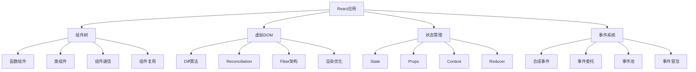

# React基础概念面试题

## 🎯 核心知识点

- React核心概念
- 组件生命周期
- 状态管理基础
- 事件处理机制
- 条件渲染与列表
- 表单处理

## 📊 React核心架构图



## 💡 面试题目

### 🟢 初级题目

#### 1. **[初级]** React基础概念和JSX语法

**标签**: JSX, 组件, 虚拟DOM, 单向数据流

**题目描述**:
请详细说明React的核心概念，以及JSX语法的特点和使用方法。

**核心答案**:

**React核心概念**:

```jsx
// 1. 函数组件基础
function Welcome(props) {
    return <h1>Hello, {props.name}!</h1>;
}

// 2. 箭头函数组件
const Greeting = ({ name, age }) => {
    return (
        <div>
            <h2>Welcome {name}</h2>
            <p>You are {age} years old</p>
        </div>
    );
};

// 3. 类组件基础
class ClassComponent extends React.Component {
    render() {
        return (
            <div>
                <h3>Class Component</h3>
                <p>Props: {this.props.message}</p>
            </div>
        );
    }
}

// 4. JSX语法特点
function JSXDemo() {
    const name = 'React';
    const isLoggedIn = true;
    const items = ['Apple', 'Banana', 'Orange'];
    
    return (
        <div className="container"> {/* className而不是class */}
            {/* JavaScript表达式用花括号包围 */}
            <h1>Hello {name}!</h1>
            
            {/* 条件渲染 */}
            {isLoggedIn ? <p>Welcome back!</p> : <p>Please log in</p>}
            
            {/* 列表渲染 */}
            <ul>
                {items.map((item, index) => (
                    <li key={index}>{item}</li>
                ))}
            </ul>
            
            {/* 内联样式 */}
            <div style={{
                backgroundColor: 'blue',
                color: 'white',
                padding: '10px'
            }}>
                Styled div
            </div>
            
            {/* 事件处理 */}
            <button onClick={() => alert('Clicked!')}>
                Click me
            </button>
        </div>
    );
}

// 5. 组件组合
function App() {
    return (
        <div>
            <Welcome name="Alice" />
            <Greeting name="Bob" age={25} />
            <ClassComponent message="Hello from class" />
            <JSXDemo />
        </div>
    );
}
```

**虚拟DOM和Diff算法**:

```jsx
// 虚拟DOM概念演示
function VirtualDOMDemo() {
    const [count, setCount] = React.useState(0);
    
    // 每次状态更新，React会创建新的虚拟DOM树
    // 然后与之前的虚拟DOM树进行比较（Diff）
    // 只更新实际发生变化的DOM节点
    
    return (
        <div>
            <h2>Count: {count}</h2>
            <button onClick={() => setCount(count + 1)}>
                Increment
            </button>
            <button onClick={() => setCount(count - 1)}>
                Decrement
            </button>
            
            {/* 这个列表演示了key的重要性 */}
            <ul>
                {Array.from({ length: count }, (_, i) => (
                    <li key={i}>Item {i + 1}</li>
                ))}
            </ul>
        </div>
    );
}

// Key的重要性演示
function KeyImportanceDemo() {
    const [items, setItems] = React.useState([
        { id: 1, name: 'Apple' },
        { id: 2, name: 'Banana' },
        { id: 3, name: 'Orange' }
    ]);
    
    const addItem = () => {
        const newItem = {
            id: Date.now(),
            name: `Item ${items.length + 1}`
        };
        setItems([newItem, ...items]); // 在开头添加
    };
    
    return (
        <div>
            <button onClick={addItem}>Add Item</button>
            
            {/* ❌ 错误：使用index作为key */}
            <div>
                <h3>Bad Example (index as key):</h3>
                {items.map((item, index) => (
                    <div key={index}>
                        <input type="text" defaultValue={item.name} />
                    </div>
                ))}
            </div>
            
            {/* ✅ 正确：使用唯一ID作为key */}
            <div>
                <h3>Good Example (unique ID as key):</h3>
                {items.map(item => (
                    <div key={item.id}>
                        <input type="text" defaultValue={item.name} />
                    </div>
                ))}
            </div>
        </div>
    );
}
```

---

#### 2. **[初级]** 组件状态和生命周期

**标签**: State, 生命周期, useEffect, 类组件生命周期

**题目描述**:
请详细说明React组件的状态管理和生命周期方法。

**核心答案**:

**函数组件状态管理**:

```jsx
import React, { useState, useEffect } from 'react';

// 基础状态管理
function Counter() {
    const [count, setCount] = useState(0);
    const [name, setName] = useState('');
    
    // 状态更新是异步的
    const handleIncrement = () => {
        setCount(count + 1);
        console.log(count); // 仍然是旧值
        
        // 如果需要基于当前状态更新
        setCount(prevCount => prevCount + 1);
    };
    
    return (
        <div>
            <h2>Count: {count}</h2>
            <input 
                value={name}
                onChange={(e) => setName(e.target.value)}
                placeholder="Enter name"
            />
            <p>Hello, {name}!</p>
            <button onClick={handleIncrement}>Increment</button>
        </div>
    );
}

// 复杂状态管理
function UserProfile() {
    const [user, setUser] = useState({
        name: '',
        email: '',
        age: 0
    });
    
    const updateUser = (field, value) => {
        setUser(prevUser => ({
            ...prevUser,
            [field]: value
        }));
    };
    
    return (
        <div>
            <input 
                value={user.name}
                onChange={(e) => updateUser('name', e.target.value)}
                placeholder="Name"
            />
            <input 
                value={user.email}
                onChange={(e) => updateUser('email', e.target.value)}
                placeholder="Email"
            />
            <input 
                type="number"
                value={user.age}
                onChange={(e) => updateUser('age', parseInt(e.target.value))}
                placeholder="Age"
            />
            <div>
                <h3>User Info:</h3>
                <p>Name: {user.name}</p>
                <p>Email: {user.email}</p>
                <p>Age: {user.age}</p>
            </div>
        </div>
    );
}

// useEffect生命周期
function LifecycleDemo() {
    const [count, setCount] = useState(0);
    const [data, setData] = useState(null);
    
    // 组件挂载时执行（相当于componentDidMount）
    useEffect(() => {
        console.log('Component mounted');
        
        // 清理函数（相当于componentWillUnmount）
        return () => {
            console.log('Component will unmount');
        };
    }, []); // 空依赖数组
    
    // 监听特定状态变化（相当于componentDidUpdate）
    useEffect(() => {
        console.log('Count changed:', count);
        
        if (count > 0) {
            document.title = `Count: ${count}`;
        }
    }, [count]); // 依赖count
    
    // 数据获取示例
    useEffect(() => {
        const fetchData = async () => {
            try {
                const response = await fetch('/api/data');
                const result = await response.json();
                setData(result);
            } catch (error) {
                console.error('Error fetching data:', error);
            }
        };
        
        fetchData();
    }, []);
    
    // 定时器示例
    useEffect(() => {
        const timer = setInterval(() => {
            setCount(prevCount => prevCount + 1);
        }, 1000);
        
        return () => clearInterval(timer); // 清理定时器
    }, []);
    
    return (
        <div>
            <h2>Count: {count}</h2>
            <button onClick={() => setCount(count + 1)}>
                Manual Increment
            </button>
            {data && <p>Data loaded: {JSON.stringify(data)}</p>}
        </div>
    );
}
```

**类组件生命周期**:

```jsx
class ClassLifecycleDemo extends React.Component {
    constructor(props) {
        super(props);
        this.state = {
            count: 0,
            data: null,
            error: null
        };
        console.log('1. Constructor');
    }
    
    // 挂载阶段
    static getDerivedStateFromProps(props, state) {
        console.log('2. getDerivedStateFromProps');
        // 根据props更新state
        return null; // 不更新state
    }
    
    componentDidMount() {
        console.log('3. componentDidMount');
        // 组件挂载后执行
        // 适合进行API调用、订阅事件等
        this.fetchData();
        this.timer = setInterval(() => {
            this.setState(prevState => ({
                count: prevState.count + 1
            }));
        }, 1000);
    }
    
    // 更新阶段
    shouldComponentUpdate(nextProps, nextState) {
        console.log('4. shouldComponentUpdate');
        // 性能优化：决定是否重新渲染
        return nextState.count !== this.state.count;
    }
    
    getSnapshotBeforeUpdate(prevProps, prevState) {
        console.log('5. getSnapshotBeforeUpdate');
        // 在DOM更新前获取信息
        return null;
    }
    
    componentDidUpdate(prevProps, prevState, snapshot) {
        console.log('6. componentDidUpdate');
        // 组件更新后执行
        if (prevState.count !== this.state.count) {
            document.title = `Count: ${this.state.count}`;
        }
    }
    
    // 卸载阶段
    componentWillUnmount() {
        console.log('7. componentWillUnmount');
        // 清理工作：清除定时器、取消订阅等
        if (this.timer) {
            clearInterval(this.timer);
        }
    }
    
    // 错误处理
    static getDerivedStateFromError(error) {
        console.log('Error caught:', error);
        return { error: error.message };
    }
    
    componentDidCatch(error, errorInfo) {
        console.log('componentDidCatch:', error, errorInfo);
        // 错误上报
    }
    
    fetchData = async () => {
        try {
            const response = await fetch('/api/data');
            const data = await response.json();
            this.setState({ data });
        } catch (error) {
            this.setState({ error: error.message });
        }
    }
    
    handleIncrement = () => {
        this.setState(prevState => ({
            count: prevState.count + 1
        }));
    }
    
    render() {
        console.log('Render');
        const { count, data, error } = this.state;
        
        if (error) {
            return <div>Error: {error}</div>;
        }
        
        return (
            <div>
                <h2>Class Component Count: {count}</h2>
                <button onClick={this.handleIncrement}>
                    Manual Increment
                </button>
                {data && <p>Data: {JSON.stringify(data)}</p>}
            </div>
        );
    }
}

// 错误边界组件
class ErrorBoundary extends React.Component {
    constructor(props) {
        super(props);
        this.state = { hasError: false, error: null };
    }
    
    static getDerivedStateFromError(error) {
        return { hasError: true, error };
    }
    
    componentDidCatch(error, errorInfo) {
        console.error('Error caught by boundary:', error, errorInfo);
        // 可以将错误信息发送到错误报告服务
    }
    
    render() {
        if (this.state.hasError) {
            return (
                <div>
                    <h2>Something went wrong.</h2>
                    <details style={{ whiteSpace: 'pre-wrap' }}>
                        {this.state.error && this.state.error.toString()}
                    </details>
                </div>
            );
        }
        
        return this.props.children;
    }
}

// 使用错误边界
function App() {
    return (
        <ErrorBoundary>
            <ClassLifecycleDemo />
        </ErrorBoundary>
    );
}
```

---

### 🟡 中级题目

#### 3. **[中级]** 组件通信和数据流

**标签**: Props, 状态提升, Context, 组件通信

**题目描述**:
请详细说明React中组件间的通信方式和数据流管理。

**核心答案**:

**组件通信方式**:

```jsx
import React, { useState, useContext, createContext } from 'react';

// 1. 父子组件通信
function ParentChildCommunication() {
    const [message, setMessage] = useState('Hello from parent');
    const [childData, setChildData] = useState('');
    
    const handleChildData = (data) => {
        setChildData(data);
    };
    
    return (
        <div>
            <h2>Parent Component</h2>
            <p>Data from child: {childData}</p>
            
            <ChildComponent 
                message={message}
                onDataChange={handleChildData}
            />
        </div>
    );
}

function ChildComponent({ message, onDataChange }) {
    const [inputValue, setInputValue] = useState('');
    
    const handleSubmit = () => {
        onDataChange(inputValue);
    };
    
    return (
        <div>
            <h3>Child Component</h3>
            <p>Message from parent: {message}</p>
            <input 
                value={inputValue}
                onChange={(e) => setInputValue(e.target.value)}
                placeholder="Send data to parent"
            />
            <button onClick={handleSubmit}>Send to Parent</button>
        </div>
    );
}

// 2. 兄弟组件通信（状态提升）
function SiblingCommunication() {
    const [sharedData, setSharedData] = useState('');
    
    return (
        <div>
            <h2>Sibling Communication</h2>
            <SiblingA onDataChange={setSharedData} />
            <SiblingB data={sharedData} />
        </div>
    );
}

function SiblingA({ onDataChange }) {
    const [input, setInput] = useState('');
    
    const handleSend = () => {
        onDataChange(input);
        setInput('');
    };
    
    return (
        <div>
            <h3>Sibling A</h3>
            <input 
                value={input}
                onChange={(e) => setInput(e.target.value)}
                placeholder="Send to Sibling B"
            />
            <button onClick={handleSend}>Send</button>
        </div>
    );
}

function SiblingB({ data }) {
    return (
        <div>
            <h3>Sibling B</h3>
            <p>Received: {data || 'No data yet'}</p>
        </div>
    );
}

// 3. Context API深层通信
const ThemeContext = createContext();
const UserContext = createContext();

function ContextDemo() {
    const [theme, setTheme] = useState('light');
    const [user, setUser] = useState({ name: 'Alice', role: 'admin' });
    
    return (
        <ThemeContext.Provider value={{ theme, setTheme }}>
            <UserContext.Provider value={{ user, setUser }}>
                <div className={`app ${theme}`}>
                    <Header />
                    <MainContent />
                    <Footer />
                </div>
            </UserContext.Provider>
        </ThemeContext.Provider>
    );
}

function Header() {
    const { theme, setTheme } = useContext(ThemeContext);
    const { user } = useContext(UserContext);
    
    return (
        <header>
            <h1>Welcome, {user.name}!</h1>
            <button onClick={() => setTheme(theme === 'light' ? 'dark' : 'light')}>
                Switch to {theme === 'light' ? 'dark' : 'light'} theme
            </button>
        </header>
    );
}

function MainContent() {
    return (
        <main>
            <UserProfile />
            <Settings />
        </main>
    );
}

function UserProfile() {
    const { user } = useContext(UserContext);
    const { theme } = useContext(ThemeContext);
    
    return (
        <div className={`user-profile ${theme}`}>
            <h2>User Profile</h2>
            <p>Name: {user.name}</p>
            <p>Role: {user.role}</p>
        </div>
    );
}

function Settings() {
    const { user, setUser } = useContext(UserContext);
    const [name, setName] = useState(user.name);
    
    const handleSave = () => {
        setUser({ ...user, name });
    };
    
    return (
        <div>
            <h2>Settings</h2>
            <input 
                value={name}
                onChange={(e) => setName(e.target.value)}
                placeholder="Update name"
            />
            <button onClick={handleSave}>Save</button>
        </div>
    );
}

function Footer() {
    const { theme } = useContext(ThemeContext);
    
    return (
        <footer className={theme}>
            <p>&copy; 2023 My App</p>
        </footer>
    );
}

// 4. 自定义Hook实现状态共享
function useSharedState(initialValue) {
    const [value, setValue] = useState(initialValue);
    
    const updateValue = (newValue) => {
        setValue(newValue);
    };
    
    return [value, updateValue];
}

// 使用自定义Hook的组件
function SharedStateDemo() {
    const [count, setCount] = useSharedState(0);
    
    return (
        <div>
            <h2>Shared State Demo</h2>
            <CounterDisplay count={count} />
            <CounterControls count={count} setCount={setCount} />
        </div>
    );
}

function CounterDisplay({ count }) {
    return <h3>Current Count: {count}</h3>;
}

function CounterControls({ count, setCount }) {
    return (
        <div>
            <button onClick={() => setCount(count + 1)}>+</button>
            <button onClick={() => setCount(count - 1)}>-</button>
            <button onClick={() => setCount(0)}>Reset</button>
        </div>
    );
}

// 5. 高阶组件（HOC）模式
function withLoading(WrappedComponent) {
    return function WithLoadingComponent(props) {
        const [loading, setLoading] = useState(true);
        
        useEffect(() => {
            const timer = setTimeout(() => {
                setLoading(false);
            }, 2000);
            
            return () => clearTimeout(timer);
        }, []);
        
        if (loading) {
            return <div>Loading...</div>;
        }
        
        return <WrappedComponent {...props} />;
    };
}

// 使用HOC
const DataComponent = ({ data }) => (
    <div>
        <h3>Data Component</h3>
        <p>Data: {data}</p>
    </div>
);

const DataComponentWithLoading = withLoading(DataComponent);

// 6. Render Props模式
function DataProvider({ children }) {
    const [data, setData] = useState(null);
    const [loading, setLoading] = useState(true);
    const [error, setError] = useState(null);
    
    useEffect(() => {
        const fetchData = async () => {
            try {
                setLoading(true);
                // 模拟API调用
                await new Promise(resolve => setTimeout(resolve, 1000));
                setData({ message: 'Data loaded successfully!' });
            } catch (err) {
                setError(err.message);
            } finally {
                setLoading(false);
            }
        };
        
        fetchData();
    }, []);
    
    return children({ data, loading, error });
}

// 使用Render Props
function RenderPropsDemo() {
    return (
        <div>
            <h2>Render Props Demo</h2>
            <DataProvider>
                {({ data, loading, error }) => {
                    if (loading) return <div>Loading...</div>;
                    if (error) return <div>Error: {error}</div>;
                    return <div>Data: {data?.message}</div>;
                }}
            </DataProvider>
        </div>
    );
}
```

---

## 🔗 相关链接

- [← 返回前端题库](./README.md)
- [React Hooks详解](./react-hooks.md)
- [React性能优化](./react-performance.md)
- [状态管理](./react-state-management.md)

---

*React基础概念是现代前端开发的核心，掌握这些概念对构建复杂应用至关重要* 