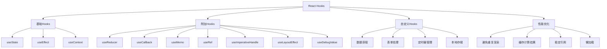

# React Hooks详解面试题

## 🎯 核心知识点

- useState状态管理
- useEffect副作用处理
- useContext上下文传递
- useMemo/useCallback性能优化
- 自定义Hooks设计
- Hooks规则与最佳实践

## 📊 React Hooks生态图



## 💡 面试题目

### 🟢 初级题目

#### 1. **[初级]** useState的用法和注意事项

**标签**: useState, 状态管理, 函数组件

**题目描述**:
请详细说明useState Hook的用法、原理，以及在使用过程中需要注意的问题。

**核心答案**:

**基本用法**:

```jsx
import React, { useState } from 'react';

function Counter() {
    // 基本用法：[状态值, 更新函数] = useState(初始值)
    const [count, setCount] = useState(0);
    
    const increment = () => {
        setCount(count + 1);
    };
    
    const decrement = () => {
        setCount(count - 1);
    };
    
    return (
        <div>
            <p>Count: {count}</p>
            <button onClick={increment}>+</button>
            <button onClick={decrement}>-</button>
        </div>
    );
}
```

**不同数据类型的状态**:

```jsx
function StateExample() {
    // 基本类型
    const [name, setName] = useState('');
    const [age, setAge] = useState(0);
    const [isVisible, setIsVisible] = useState(false);
    
    // 对象状态
    const [user, setUser] = useState({
        name: '',
        email: '',
        preferences: {
            theme: 'light',
            language: 'zh'
        }
    });
    
    // 数组状态
    const [items, setItems] = useState([]);
    
    // 函数初始值（懒初始化）
    const [expensiveValue, setExpensiveValue] = useState(() => {
        console.log('计算昂贵的初始值');
        return someExpensiveComputation();
    });
    
    // 更新对象状态（合并更新）
    const updateUser = (newData) => {
        setUser(prevUser => ({
            ...prevUser,
            ...newData
        }));
    };
    
    // 更新嵌套对象
    const updateUserPreferences = (newPreferences) => {
        setUser(prevUser => ({
            ...prevUser,
            preferences: {
                ...prevUser.preferences,
                ...newPreferences
            }
        }));
    };
    
    // 数组操作
    const addItem = (item) => {
        setItems(prevItems => [...prevItems, item]);
    };
    
    const removeItem = (index) => {
        setItems(prevItems => prevItems.filter((_, i) => i !== index));
    };
    
    const updateItem = (index, newItem) => {
        setItems(prevItems => 
            prevItems.map((item, i) => i === index ? newItem : item)
        );
    };
    
    return (
        <div>
            {/* 组件JSX */}
        </div>
    );
}
```

**函数式更新**:

```jsx
function FunctionalUpdate() {
    const [count, setCount] = useState(0);
    
    // ❌ 错误：直接使用当前值
    const incrementWrong = () => {
        setCount(count + 1);
        setCount(count + 1); // 仍然是原来的count值
        // 最终只增加1，而不是2
    };
    
    // ✅ 正确：使用函数式更新
    const incrementCorrect = () => {
        setCount(prev => prev + 1);
        setCount(prev => prev + 1);
        // 正确增加2
    };
    
    // 异步更新问题
    const handleAsyncUpdate = async () => {
        // ❌ 可能会有问题
        setTimeout(() => {
            setCount(count + 1); // count可能是旧值
        }, 1000);
        
        // ✅ 使用函数式更新
        setTimeout(() => {
            setCount(prev => prev + 1); // 总是获取最新值
        }, 1000);
    };
    
    return (
        <div>
            <p>Count: {count}</p>
            <button onClick={incrementCorrect}>正确增加</button>
            <button onClick={handleAsyncUpdate}>异步更新</button>
        </div>
    );
}
```

**状态批量更新**:

```jsx
function BatchingExample() {
    const [count, setCount] = useState(0);
    const [name, setName] = useState('');
    
    console.log('渲染'); // 观察渲染次数
    
    const handleClick = () => {
        // React 18+：自动批处理
        setCount(c => c + 1);
        setName('Updated');
        // 只会触发一次重新渲染
    };
    
    const handleAsyncClick = async () => {
        // React 18之前：异步中不会批处理
        setTimeout(() => {
            setCount(c => c + 1);    // 第一次渲染
            setName('Async Updated'); // 第二次渲染
        }, 0);
        
        // React 18+：使用flushSync强制同步更新
        import { flushSync } from 'react-dom';
        flushSync(() => {
            setCount(c => c + 1);
        });
        // 立即渲染
        setName('After flushSync');
        // 再次渲染
    };
    
    return (
        <div>
            <p>Count: {count}, Name: {name}</p>
            <button onClick={handleClick}>同步更新</button>
            <button onClick={handleAsyncClick}>异步更新</button>
        </div>
    );
}
```

**常见陷阱和解决方案**:

```jsx
// 1. 闭包陷阱
function ClosureTrap() {
    const [count, setCount] = useState(0);
    
    useEffect(() => {
        // ❌ 问题：count被闭包捕获
        const timer = setInterval(() => {
            console.log(count); // 总是0
            setCount(count + 1); // 总是 0 + 1
        }, 1000);
        
        return () => clearInterval(timer);
    }, []); // 空依赖数组
    
    // ✅ 解决方案1：使用函数式更新
    useEffect(() => {
        const timer = setInterval(() => {
            setCount(prev => {
                console.log(prev); // 获取最新值
                return prev + 1;
            });
        }, 1000);
        
        return () => clearInterval(timer);
    }, []);
    
    // ✅ 解决方案2：使用useRef保存最新值
    const countRef = useRef(count);
    countRef.current = count;
    
    useEffect(() => {
        const timer = setInterval(() => {
            console.log(countRef.current); // 最新值
            setCount(countRef.current + 1);
        }, 1000);
        
        return () => clearInterval(timer);
    }, []);
    
    return <div>Count: {count}</div>;
}

// 2. 对象状态变更不触发更新
function ObjectStateTrap() {
    const [user, setUser] = useState({ name: 'Alice', age: 25 });
    
    // ❌ 直接修改对象不会触发更新
    const updateNameWrong = () => {
        user.name = 'Bob'; // 直接修改
        setUser(user); // 相同的引用，不会更新
    };
    
    // ✅ 创建新对象
    const updateNameCorrect = () => {
        setUser(prev => ({
            ...prev,
            name: 'Bob'
        }));
    };
    
    return (
        <div>
            <p>{user.name}, {user.age}</p>
            <button onClick={updateNameCorrect}>更新姓名</button>
        </div>
    );
}

// 3. 初始化性能问题
function InitializationOptimization() {
    // ❌ 每次渲染都会调用
    const [data, setData] = useState(expensiveCalculation());
    
    // ✅ 懒初始化，只调用一次
    const [dataOptimized, setDataOptimized] = useState(() => {
        console.log('只在初始化时调用');
        return expensiveCalculation();
    });
    
    return <div>{/* 组件内容 */}</div>;
}
```

---

#### 2. **[初级]** useEffect的使用场景和依赖管理

**标签**: useEffect, 副作用, 生命周期, 依赖数组

**题目描述**:
请详细说明useEffect的各种使用场景，以及如何正确管理依赖数组。

**核心答案**:

**基本使用模式**:

```jsx
import React, { useState, useEffect } from 'react';

function EffectExamples() {
    const [count, setCount] = useState(0);
    const [name, setName] = useState('');
    
    // 1. 无依赖数组 - 每次渲染后都执行
    useEffect(() => {
        console.log('每次渲染后执行');
    });
    
    // 2. 空依赖数组 - 只在挂载时执行一次
    useEffect(() => {
        console.log('组件挂载时执行一次');
        
        // 清理函数 - 组件卸载时执行
        return () => {
            console.log('组件卸载时执行');
        };
    }, []);
    
    // 3. 有依赖数组 - 依赖变化时执行
    useEffect(() => {
        console.log('count变化时执行:', count);
    }, [count]);
    
    // 4. 多个依赖
    useEffect(() => {
        console.log('count或name变化时执行:', count, name);
    }, [count, name]);
    
    return (
        <div>
            <p>Count: {count}</p>
            <p>Name: {name}</p>
            <button onClick={() => setCount(c => c + 1)}>增加</button>
            <input 
                value={name} 
                onChange={(e) => setName(e.target.value)} 
                placeholder="输入姓名"
            />
        </div>
    );
}
```

**常见使用场景**:

```jsx
// 1. 数据获取
function DataFetching({ userId }) {
    const [user, setUser] = useState(null);
    const [loading, setLoading] = useState(true);
    const [error, setError] = useState(null);
    
    useEffect(() => {
        let cancelled = false;
        
        const fetchUser = async () => {
            try {
                setLoading(true);
                setError(null);
                
                const response = await fetch(`/api/users/${userId}`);
                if (!response.ok) {
                    throw new Error('Failed to fetch user');
                }
                
                const userData = await response.json();
                
                // 检查请求是否被取消
                if (!cancelled) {
                    setUser(userData);
                }
            } catch (err) {
                if (!cancelled) {
                    setError(err.message);
                }
            } finally {
                if (!cancelled) {
                    setLoading(false);
                }
            }
        };
        
        fetchUser();
        
        // 清理函数 - 取消请求
        return () => {
            cancelled = true;
        };
    }, [userId]); // userId变化时重新获取
    
    if (loading) return <div>Loading...</div>;
    if (error) return <div>Error: {error}</div>;
    if (!user) return <div>No user found</div>;
    
    return <div>User: {user.name}</div>;
}

// 2. 订阅和事件监听
function EventSubscription() {
    const [windowWidth, setWindowWidth] = useState(window.innerWidth);
    
    useEffect(() => {
        const handleResize = () => {
            setWindowWidth(window.innerWidth);
        };
        
        window.addEventListener('resize', handleResize);
        
        // 清理事件监听器
        return () => {
            window.removeEventListener('resize', handleResize);
        };
    }, []); // 只在挂载时设置监听器
    
    return <div>Window width: {windowWidth}px</div>;
}

// 3. 定时器管理
function Timer() {
    const [seconds, setSeconds] = useState(0);
    const [isActive, setIsActive] = useState(false);
    
    useEffect(() => {
        let interval = null;
        
        if (isActive) {
            interval = setInterval(() => {
                setSeconds(seconds => seconds + 1);
            }, 1000);
        } else if (!isActive && seconds !== 0) {
            clearInterval(interval);
        }
        
        return () => clearInterval(interval);
    }, [isActive, seconds]);
    
    const reset = () => {
        setSeconds(0);
        setIsActive(false);
    };
    
    return (
        <div>
            <div>Time: {seconds}s</div>
            <button onClick={() => setIsActive(!isActive)}>
                {isActive ? 'Pause' : 'Start'}
            </button>
            <button onClick={reset}>Reset</button>
        </div>
    );
}

// 4. 本地存储同步
function LocalStorageSync(key, initialValue) {
    const [storedValue, setStoredValue] = useState(() => {
        try {
            const item = window.localStorage.getItem(key);
            return item ? JSON.parse(item) : initialValue;
        } catch (error) {
            console.error('Error reading localStorage:', error);
            return initialValue;
        }
    });
    
    useEffect(() => {
        try {
            window.localStorage.setItem(key, JSON.stringify(storedValue));
        } catch (error) {
            console.error('Error setting localStorage:', error);
        }
    }, [key, storedValue]);
    
    return [storedValue, setStoredValue];
}
```

**依赖数组最佳实践**:

```jsx
function DependencyBestPractices() {
    const [count, setCount] = useState(0);
    const [multiplier, setMultiplier] = useState(2);
    
    // ❌ 错误：遗漏依赖
    useEffect(() => {
        const result = count * multiplier;
        console.log('Result:', result);
        // ESLint会警告：multiplier应该在依赖数组中
    }, [count]); // 缺少multiplier
    
    // ✅ 正确：包含所有依赖
    useEffect(() => {
        const result = count * multiplier;
        console.log('Result:', result);
    }, [count, multiplier]);
    
    // ✅ 减少依赖：将计算移到渲染阶段
    const result = count * multiplier;
    useEffect(() => {
        console.log('Result:', result);
    }, [result]);
    
    // ✅ 或者使用useCallback缓存函数
    const calculateResult = useCallback(() => {
        return count * multiplier;
    }, [count, multiplier]);
    
    useEffect(() => {
        console.log('Result:', calculateResult());
    }, [calculateResult]);
    
    return <div>{/* 组件内容 */}</div>;
}

// 函数依赖处理
function FunctionDependency() {
    const [items, setItems] = useState([]);
    
    // ❌ 问题：每次渲染都创建新函数
    const fetchItems = async () => {
        const response = await fetch('/api/items');
        const data = await response.json();
        setItems(data);
    };
    
    useEffect(() => {
        fetchItems(); // fetchItems每次都不同
    }, [fetchItems]); // 会导致无限循环
    
    // ✅ 解决方案1：将函数移到effect内部
    useEffect(() => {
        const fetchItems = async () => {
            const response = await fetch('/api/items');
            const data = await response.json();
            setItems(data);
        };
        
        fetchItems();
    }, []); // 空依赖数组
    
    // ✅ 解决方案2：使用useCallback
    const fetchItemsCallback = useCallback(async () => {
        const response = await fetch('/api/items');
        const data = await response.json();
        setItems(data);
    }, []); // 函数本身没有依赖
    
    useEffect(() => {
        fetchItemsCallback();
    }, [fetchItemsCallback]);
    
    return <div>{/* 显示items */}</div>;
}
```

**清理函数的使用**:

```jsx
function CleanupExamples() {
    // 1. 网络请求取消
    useEffect(() => {
        const controller = new AbortController();
        
        const fetchData = async () => {
            try {
                const response = await fetch('/api/data', {
                    signal: controller.signal
                });
                const data = await response.json();
                setData(data);
            } catch (error) {
                if (error.name !== 'AbortError') {
                    console.error('Fetch error:', error);
                }
            }
        };
        
        fetchData();
        
        return () => {
            controller.abort(); // 取消请求
        };
    }, []);
    
    // 2. WebSocket连接管理
    useEffect(() => {
        const ws = new WebSocket('ws://localhost:8080');
        
        ws.onopen = () => {
            console.log('WebSocket connected');
        };
        
        ws.onmessage = (event) => {
            console.log('Message received:', event.data);
        };
        
        ws.onerror = (error) => {
            console.error('WebSocket error:', error);
        };
        
        return () => {
            ws.close(); // 关闭连接
        };
    }, []);
    
    // 3. 第三方库清理
    useEffect(() => {
        // 初始化第三方库
        const chart = new SomeChartLibrary('#chart-container');
        chart.render();
        
        return () => {
            chart.destroy(); // 清理资源
        };
    }, []);
    
    return <div id="chart-container"></div>;
}
```

**性能优化技巧**:

```jsx
function EffectOptimization() {
    const [user, setUser] = useState(null);
    const [posts, setPosts] = useState([]);
    
    // ❌ 两个独立的effect可能导致不必要的渲染
    useEffect(() => {
        fetchUser().then(setUser);
    }, []);
    
    useEffect(() => {
        fetchPosts().then(setPosts);
    }, []);
    
    // ✅ 合并相关的effect
    useEffect(() => {
        const loadData = async () => {
            const [userData, postsData] = await Promise.all([
                fetchUser(),
                fetchPosts()
            ]);
            setUser(userData);
            setPosts(postsData);
        };
        
        loadData();
    }, []);
    
    // ✅ 使用useLayoutEffect处理DOM测量
    const [height, setHeight] = useState(0);
    const divRef = useRef();
    
    useLayoutEffect(() => {
        // 在浏览器绘制之前同步执行
        if (divRef.current) {
            setHeight(divRef.current.offsetHeight);
        }
    });
    
    return (
        <div ref={divRef}>
            Height: {height}px
        </div>
    );
}
```

**useEffect vs useLayoutEffect**:

```jsx
function EffectComparison() {
    const [count, setCount] = useState(0);
    
    // useEffect: 异步执行，不阻塞浏览器绘制
    useEffect(() => {
        console.log('useEffect执行');
        // 适用于数据获取、订阅、手动DOM修改等
    }, [count]);
    
    // useLayoutEffect: 同步执行，阻塞浏览器绘制
    useLayoutEffect(() => {
        console.log('useLayoutEffect执行');
        // 适用于DOM测量、避免闪烁的DOM修改等
    }, [count]);
    
    return (
        <div>
            <p>Count: {count}</p>
            <button onClick={() => setCount(c => c + 1)}>增加</button>
        </div>
    );
}
```

**最佳实践总结**:
- ✅ 始终包含所有effect中使用的值到依赖数组
- ✅ 使用ESLint的exhaustive-deps规则
- ✅ 及时清理副作用（事件监听器、定时器、订阅等）
- ✅ 避免在effect中创建对象和函数
- ✅ 合理使用useCallback和useMemo减少不必要的effect执行
- ✅ 将不相关的逻辑分离到不同的effect中

---

### 🟡 中级题目

#### 3. **[中级]** useMemo和useCallback的使用和性能优化

**标签**: useMemo, useCallback, 性能优化, 记忆化

**题目描述**:
请详细说明useMemo和useCallback的使用场景、工作原理，以及如何用它们进行性能优化。

**核心答案**:

**useMemo基础用法**:

```jsx
import React, { useState, useMemo, useCallback } from 'react';

function ExpensiveCalculation() {
    const [count, setCount] = useState(0);
    const [items, setItems] = useState([]);
    
    // ❌ 每次渲染都会重新计算
    const expensiveValue = calculateExpensiveValue(count);
    
    // ✅ 使用useMemo缓存计算结果
    const memoizedValue = useMemo(() => {
        console.log('计算昂贵的值');
        return calculateExpensiveValue(count);
    }, [count]); // 只有count变化时才重新计算
    
    // 即使items变化，memoizedValue也不会重新计算
    const addItem = () => {
        setItems(prev => [...prev, `Item ${prev.length + 1}`]);
    };
    
    return (
        <div>
            <p>Expensive Value: {memoizedValue}</p>
            <p>Items: {items.length}</p>
            <button onClick={() => setCount(c => c + 1)}>
                Increment Count
            </button>
            <button onClick={addItem}>Add Item</button>
        </div>
    );
}

function calculateExpensiveValue(num) {
    // 模拟昂贵的计算
    let result = 0;
    for (let i = 0; i < num * 1000000; i++) {
        result += i;
    }
    return result;
}
```

**useCallback基础用法**:

```jsx
function CallbackExample() {
    const [count, setCount] = useState(0);
    const [items, setItems] = useState([]);
    
    // ❌ 每次渲染都创建新函数
    const handleClick = () => {
        setCount(c => c + 1);
    };
    
    // ✅ 使用useCallback缓存函数
    const memoizedHandleClick = useCallback(() => {
        setCount(c => c + 1);
    }, []); // 无依赖，函数永远不变
    
    // 有依赖的callback
    const handleItemClick = useCallback((itemId) => {
        console.log('Clicked item:', itemId, 'Count:', count);
    }, [count]); // count变化时函数才会重新创建
    
    return (
        <div>
            <p>Count: {count}</p>
            <ExpensiveChild onClick={memoizedHandleClick} />
            <ItemList items={items} onItemClick={handleItemClick} />
        </div>
    );
}

// React.memo包装的组件只有在props改变时才重新渲染
const ExpensiveChild = React.memo(({ onClick }) => {
    console.log('ExpensiveChild渲染');
    return <button onClick={onClick}>Expensive Child</button>;
});

const ItemList = React.memo(({ items, onItemClick }) => {
    console.log('ItemList渲染');
    return (
        <ul>
            {items.map(item => (
                <li key={item.id} onClick={() => onItemClick(item.id)}>
                    {item.name}
                </li>
            ))}
        </ul>
    );
});
```

**复杂的性能优化场景**:

```jsx
function ComplexOptimization() {
    const [users, setUsers] = useState([]);
    const [searchTerm, setSearchTerm] = useState('');
    const [sortBy, setSortBy] = useState('name');
    const [filterType, setFilterType] = useState('all');
    
    // 复杂的过滤和排序逻辑
    const processedUsers = useMemo(() => {
        console.log('处理用户数据'); // 观察何时重新计算
        
        let result = users;
        
        // 过滤
        if (filterType !== 'all') {
            result = result.filter(user => user.type === filterType);
        }
        
        // 搜索
        if (searchTerm) {
            result = result.filter(user => 
                user.name.toLowerCase().includes(searchTerm.toLowerCase()) ||
                user.email.toLowerCase().includes(searchTerm.toLowerCase())
            );
        }
        
        // 排序
        result = result.sort((a, b) => {
            if (sortBy === 'name') {
                return a.name.localeCompare(b.name);
            } else if (sortBy === 'email') {
                return a.email.localeCompare(b.email);
            } else if (sortBy === 'created') {
                return new Date(b.createdAt) - new Date(a.createdAt);
            }
            return 0;
        });
        
        return result;
    }, [users, searchTerm, sortBy, filterType]);
    
    // 缓存事件处理函数
    const handleSearch = useCallback((event) => {
        setSearchTerm(event.target.value);
    }, []);
    
    const handleSortChange = useCallback((newSortBy) => {
        setSortBy(newSortBy);
    }, []);
    
    const handleFilterChange = useCallback((newFilterType) => {
        setFilterType(newFilterType);
    }, []);
    
    // 缓存渲染配置
    const tableConfig = useMemo(() => ({
        columns: [
            { key: 'name', label: '姓名', sortable: true },
            { key: 'email', label: '邮箱', sortable: true },
            { key: 'type', label: '类型', sortable: false },
            { key: 'createdAt', label: '创建时间', sortable: true }
        ],
        rowsPerPage: 10,
        showPagination: processedUsers.length > 10
    }), [processedUsers.length]);
    
    return (
        <div>
            <SearchInput 
                value={searchTerm}
                onChange={handleSearch}
            />
            <FilterButtons 
                activeFilter={filterType}
                onFilterChange={handleFilterChange}
            />
            <UserTable 
                users={processedUsers}
                sortBy={sortBy}
                onSortChange={handleSortChange}
                config={tableConfig}
            />
        </div>
    );
}

// 优化的子组件
const SearchInput = React.memo(({ value, onChange }) => {
    console.log('SearchInput渲染');
    return (
        <input
            type="text"
            value={value}
            onChange={onChange}
            placeholder="搜索用户..."
        />
    );
});

const FilterButtons = React.memo(({ activeFilter, onFilterChange }) => {
    console.log('FilterButtons渲染');
    const filters = ['all', 'admin', 'user', 'guest'];
    
    return (
        <div>
            {filters.map(filter => (
                <button
                    key={filter}
                    className={activeFilter === filter ? 'active' : ''}
                    onClick={() => onFilterChange(filter)}
                >
                    {filter}
                </button>
            ))}
        </div>
    );
});
```

**自定义Hook中的优化**:

```jsx
// 优化的数据获取Hook
function useApiData(url, options = {}) {
    const [data, setData] = useState(null);
    const [loading, setLoading] = useState(true);
    const [error, setError] = useState(null);
    
    // 缓存请求配置
    const requestConfig = useMemo(() => ({
        method: 'GET',
        headers: {
            'Content-Type': 'application/json',
            ...options.headers
        },
        ...options
    }), [options]);
    
    // 缓存fetch函数
    const fetchData = useCallback(async () => {
        try {
            setLoading(true);
            setError(null);
            
            const response = await fetch(url, requestConfig);
            if (!response.ok) {
                throw new Error(`HTTP error! status: ${response.status}`);
            }
            
            const result = await response.json();
            setData(result);
        } catch (err) {
            setError(err.message);
        } finally {
            setLoading(false);
        }
    }, [url, requestConfig]);
    
    useEffect(() => {
        fetchData();
    }, [fetchData]);
    
    // 返回缓存的结果对象
    return useMemo(() => ({
        data,
        loading,
        error,
        refetch: fetchData
    }), [data, loading, error, fetchData]);
}

// 使用优化的Hook
function UserProfile({ userId }) {
    const { data: user, loading, error, refetch } = useApiData(
        `/api/users/${userId}`,
        useMemo(() => ({
            headers: {
                'Authorization': `Bearer ${getAuthToken()}`
            }
        }), [])
    );
    
    if (loading) return <div>Loading...</div>;
    if (error) return <div>Error: {error}</div>;
    
    return (
        <div>
            <h1>{user.name}</h1>
            <button onClick={refetch}>刷新</button>
        </div>
    );
}
```

**避免过度优化**:

```jsx
function OptimizationMistakes() {
    const [count, setCount] = useState(0);
    
    // ❌ 过度优化：简单值不需要useMemo
    const simpleValue = useMemo(() => count * 2, [count]);
    
    // ✅ 直接计算更好
    const simpleValueDirect = count * 2;
    
    // ❌ 过度优化：每次都变化的依赖
    const randomValue = Math.random();
    const memoizedRandom = useMemo(() => {
        return processRandomValue(randomValue);
    }, [randomValue]); // randomValue每次都不同，缓存无意义
    
    // ❌ 过度优化：内联对象作为依赖
    const user = { id: 1, name: 'Alice' };
    const processedUser = useMemo(() => {
        return enhanceUser(user);
    }, [user]); // user每次都是新对象
    
    // ✅ 正确的优化：稳定的依赖
    const userId = 1;
    const userName = 'Alice';
    const processedUserCorrect = useMemo(() => {
        return enhanceUser({ id: userId, name: userName });
    }, [userId, userName]);
    
    return <div>{/* 组件内容 */}</div>;
}
```

**性能监控和调试**:

```jsx
// 性能监控Hook
function usePerformanceMonitor(name) {
    const renderCount = useRef(0);
    const renderTime = useRef(Date.now());
    
    useEffect(() => {
        renderCount.current += 1;
        const now = Date.now();
        const timeSinceLastRender = now - renderTime.current;
        renderTime.current = now;
        
        console.log(`${name} 渲染次数: ${renderCount.current}, 间隔: ${timeSinceLastRender}ms`);
    });
}

// 使用监控
function MonitoredComponent() {
    usePerformanceMonitor('MonitoredComponent');
    
    const [count, setCount] = useState(0);
    
    // 使用React DevTools Profiler API
    const expensiveValue = useMemo(() => {
        performance.mark('expensive-calculation-start');
        const result = expensiveCalculation(count);
        performance.mark('expensive-calculation-end');
        performance.measure(
            'expensive-calculation',
            'expensive-calculation-start',
            'expensive-calculation-end'
        );
        return result;
    }, [count]);
    
    return (
        <div>
            <p>Value: {expensiveValue}</p>
            <button onClick={() => setCount(c => c + 1)}>
                增加
            </button>
        </div>
    );
}
```

**最佳实践指南**:

```jsx
// 何时使用useMemo
function WhenToUseMemo() {
    // ✅ 昂贵的计算
    const expensiveResult = useMemo(() => {
        return items.reduce((acc, item) => {
            return acc + complexCalculation(item);
        }, 0);
    }, [items]);
    
    // ✅ 创建稳定的对象引用
    const config = useMemo(() => ({
        apiUrl: '/api',
        timeout: 5000,
        retries: 3
    }), []); // 配置永远不变
    
    // ✅ 避免昂贵的组件重新渲染
    const renderedItems = useMemo(() => {
        return items.map(item => (
            <ExpensiveItem key={item.id} item={item} />
        ));
    }, [items]);
    
    return <div>{renderedItems}</div>;
}

// 何时使用useCallback
function WhenToUseCallback() {
    // ✅ 传递给被React.memo包装的子组件
    const handleClick = useCallback(() => {
        // 处理点击
    }, []);
    
    // ✅ 作为effect的依赖
    const fetchData = useCallback(async () => {
        const response = await fetch('/api/data');
        return response.json();
    }, []);
    
    useEffect(() => {
        fetchData();
    }, [fetchData]);
    
    // ✅ 避免在渲染过程中创建新函数
    const memoizedComponent = useMemo(() => (
        <ComplexComponent onAction={handleClick} />
    ), [handleClick]);
    
    return memoizedComponent;
}
```

**性能优化检查清单**:
- ✅ 使用React DevTools Profiler分析性能
- ✅ 只在真正昂贵的计算中使用useMemo
- ✅ 子组件使用React.memo时才考虑useCallback
- ✅ 避免在依赖数组中使用不稳定的值
- ✅ 考虑将复杂状态逻辑移到useReducer
- ✅ 使用代码分割减少初始包大小
- ✅ 监控实际的性能指标，而不是理论优化

---

## 🔗 相关链接

- [← 返回前端题库](./README.md)
- [React基础概念](./react-basics.md)
- [React性能优化](./react-performance.md)
- [JavaScript核心概念](./javascript-core.md)

---

*React Hooks是现代React开发的核心，理解其原理和最佳实践对构建高质量应用至关重要* 