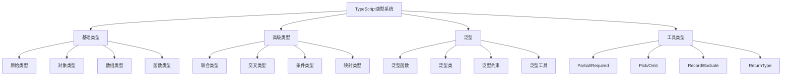

# TypeScript实践面试题

## 🎯 核心知识点

- TypeScript类型系统
- 泛型编程
- 高级类型操作
- 工程化配置
- React + TypeScript
- 性能优化

## 📊 TypeScript类型体系图



## 💡 面试题目

### 🟢 初级题目

#### 1. **[初级]** TypeScript基础类型和类型注解

**标签**: 基础类型, 类型注解, 类型推断

**题目描述**:
请详细说明TypeScript的基础类型系统，以及如何正确使用类型注解。

**核心答案**:

**基础类型系统**:

```typescript
// 原始类型
let isDone: boolean = false;
let count: number = 42;
let name: string = "Alice";
let value: null = null;
let data: undefined = undefined;

// 数组类型
let list1: number[] = [1, 2, 3];
let list2: Array<number> = [1, 2, 3];
let readonlyList: readonly number[] = [1, 2, 3];

// 元组类型
let tuple: [string, number] = ["hello", 10];
let namedTuple: [name: string, age: number] = ["Alice", 25];

// 枚举类型
enum Color {
    Red,
    Green,
    Blue
}

enum Status {
    Pending = "pending",
    Success = "success",
    Error = "error"
}

// 函数类型
function add(a: number, b: number): number {
    return a + b;
}

const multiply = (a: number, b: number): number => a * b;

// 可选参数和默认参数
function greet(name: string, age?: number, prefix: string = "Mr."): string {
    return `${prefix} ${name}${age ? `, age ${age}` : ""}`;
}

// 对象类型
interface User {
    name: string;
    age: number;
    email?: string; // 可选属性
    readonly id: number; // 只读属性
}

type Product = {
    name: string;
    price: number;
    category: string;
};

// 联合类型
type Status = "loading" | "success" | "error";
type ID = string | number;

// 字面量类型
type Theme = "light" | "dark";
type Direction = "up" | "down" | "left" | "right";

// any和unknown
let anything: any = 42;
anything = "hello";
anything.foo.bar; // 不会报错

let unknown: unknown = 42;
// unknown.toFixed(); // 错误，需要类型检查
if (typeof unknown === "number") {
    unknown.toFixed(); // 正确
}
```

**类型断言和类型守卫**:

```typescript
// 类型断言
let someValue: unknown = "this is a string";
let strLength1: number = (someValue as string).length;
let strLength2: number = (<string>someValue).length;

// 非空断言
function processUser(user: User | null) {
    // 确定user不为null时使用
    console.log(user!.name);
}

// 类型守卫函数
function isString(value: unknown): value is string {
    return typeof value === "string";
}

function isUser(obj: any): obj is User {
    return obj && typeof obj.name === "string" && typeof obj.age === "number";
}

// 使用类型守卫
function processValue(value: string | number) {
    if (typeof value === "string") {
        // value的类型被收窄为string
        console.log(value.toUpperCase());
    } else {
        // value的类型被收窄为number
        console.log(value.toFixed(2));
    }
}

// 判别联合类型
interface Loading {
    status: "loading";
}

interface Success {
    status: "success";
    data: any;
}

interface Error {
    status: "error";
    message: string;
}

type ApiResponse = Loading | Success | Error;

function handleResponse(response: ApiResponse) {
    switch (response.status) {
        case "loading":
            console.log("Loading...");
            break;
        case "success":
            console.log("Data:", response.data); // 类型安全
            break;
        case "error":
            console.log("Error:", response.message); // 类型安全
            break;
        default:
            // 详尽性检查
            const exhaustiveCheck: never = response;
            return exhaustiveCheck;
    }
}
```

---

#### 2. **[初级]** 接口和类型别名的使用

**标签**: 接口, 类型别名, 对象类型

**题目描述**:
请详细说明interface和type的区别，以及在实际开发中的使用场景。

**核心答案**:

**接口定义和扩展**:

```typescript
// 基础接口
interface User {
    name: string;
    age: number;
}

// 接口继承
interface Employee extends User {
    department: string;
    salary: number;
}

// 多重继承
interface Developer extends Employee {
    skills: string[];
    level: "junior" | "senior" | "lead";
}

// 接口合并（声明合并）
interface Window {
    title: string;
}

interface Window {
    version: string;
}

// 现在Window有title和version属性

// 可选和只读属性
interface Config {
    readonly apiUrl: string;
    timeout?: number;
    retries?: number;
}

// 索引签名
interface StringDictionary {
    [key: string]: string;
}

interface NumberDictionary {
    [key: string]: number;
    length: number; // 必须符合索引签名
}

// 函数接口
interface SearchFunc {
    (source: string, subString: string): boolean;
}

interface EventHandler {
    (event: Event): void;
}

// 构造函数接口
interface ClockConstructor {
    new (hour: number, minute: number): Clock;
}

interface Clock {
    currentTime: Date;
    setTime(d: Date): void;
}
```

**类型别名的使用**:

```typescript
// 基础类型别名
type UserID = string;
type UserName = string;
type Age = number;

// 联合类型
type Status = "pending" | "approved" | "rejected";
type Theme = "light" | "dark" | "auto";

// 对象类型
type Point = {
    x: number;
    y: number;
};

// 函数类型
type Handler = (event: Event) => void;
type Comparator<T> = (a: T, b: T) => number;

// 泛型类型别名
type Container<T> = {
    value: T;
    timestamp: Date;
};

type Result<T, E = Error> = 
    | { success: true; data: T }
    | { success: false; error: E };

// 条件类型
type NonNullable<T> = T extends null | undefined ? never : T;
type ReturnType<T> = T extends (...args: any[]) => infer R ? R : any;

// 映射类型
type Partial<T> = {
    [P in keyof T]?: T[P];
};

type Readonly<T> = {
    readonly [P in keyof T]: T[P];
};
```

**Interface vs Type对比**:

```typescript
// 1. 扩展方式不同
// Interface使用extends
interface Animal {
    name: string;
}

interface Dog extends Animal {
    breed: string;
}

// Type使用交叉类型
type Animal = {
    name: string;
};

type Dog = Animal & {
    breed: string;
};

// 2. 声明合并
// Interface支持声明合并
interface User {
    name: string;
}

interface User {
    age: number;
}
// 合并后User有name和age

// Type不支持声明合并
type User = {
    name: string;
};

// type User = {  // 错误：重复标识符
//     age: number;
// };

// 3. 计算属性
// Interface不支持计算属性
// interface DynamicKey {
//     [key in "name" | "age"]: string; // 错误
// }

// Type支持计算属性
type DynamicKey = {
    [K in "name" | "age"]: string;
};

// 4. 联合类型
// Type可以定义联合类型
type StringOrNumber = string | number;

// Interface不能定义联合类型
// interface StringOrNumber = string | number; // 错误

// 5. 元组类型
// Type可以定义元组
type Coordinates = [number, number];

// Interface可以模拟元组，但不够直观
interface CoordinatesInterface {
    0: number;
    1: number;
    readonly length: 2;
}
```

**实际应用场景**:

```typescript
// 1. API响应类型定义
interface ApiResponse<T> {
    success: boolean;
    data: T;
    message: string;
    timestamp: number;
}

interface User {
    id: number;
    name: string;
    email: string;
    avatar?: string;
}

type UserResponse = ApiResponse<User>;
type UsersResponse = ApiResponse<User[]>;

// 2. 组件Props定义
interface ButtonProps {
    children: React.ReactNode;
    variant?: "primary" | "secondary" | "danger";
    size?: "small" | "medium" | "large";
    disabled?: boolean;
    onClick?: (event: React.MouseEvent<HTMLButtonElement>) => void;
}

// 3. 表单处理
interface LoginForm {
    email: string;
    password: string;
    rememberMe: boolean;
}

type LoginFormErrors = {
    [K in keyof LoginForm]?: string;
};

// 4. 状态管理
interface AppState {
    user: User | null;
    theme: Theme;
    loading: boolean;
    errors: string[];
}

type AppAction = 
    | { type: "SET_USER"; payload: User }
    | { type: "SET_THEME"; payload: Theme }
    | { type: "SET_LOADING"; payload: boolean }
    | { type: "ADD_ERROR"; payload: string }
    | { type: "CLEAR_ERRORS" };

// 5. 工具函数类型
interface DatabaseEntity {
    id: number;
    createdAt: Date;
    updatedAt: Date;
}

interface CreateInput<T extends DatabaseEntity> {
    [K in keyof Omit<T, "id" | "createdAt" | "updatedAt">]: T[K];
}

interface UpdateInput<T extends DatabaseEntity> {
    [K in keyof Partial<Omit<T, "id" | "createdAt" | "updatedAt">>]: T[K];
}

// 使用示例
interface Post extends DatabaseEntity {
    title: string;
    content: string;
    authorId: number;
}

type CreatePostInput = CreateInput<Post>;
// { title: string; content: string; authorId: number; }

type UpdatePostInput = UpdateInput<Post>;
// { title?: string; content?: string; authorId?: number; }
```

**最佳实践建议**:

```typescript
// 1. 优先使用interface定义对象结构
interface UserPreferences {
    theme: Theme;
    language: string;
    notifications: boolean;
}

// 2. 使用type定义联合类型和计算类型
type EventType = "click" | "hover" | "focus";
type EventHandlers = {
    [K in EventType]: (event: Event) => void;
};

// 3. 库的公共API使用interface（支持声明合并）
interface LibraryConfig {
    apiUrl: string;
    timeout: number;
}

// 4. 复杂的类型操作使用type
type DeepPartial<T> = {
    [P in keyof T]?: T[P] extends object ? DeepPartial<T[P]> : T[P];
};

// 5. 组合使用
interface BaseEntity {
    id: string;
    createdAt: Date;
}

type WithTimestamps<T> = T & {
    updatedAt: Date;
    deletedAt?: Date;
};

type UserEntity = WithTimestamps<BaseEntity & {
    name: string;
    email: string;
}>;
```

---

### 🟡 中级题目

#### 3. **[中级]** 泛型编程和高级类型操作

**标签**: 泛型, 条件类型, 映射类型, 工具类型

**题目描述**:
请详细说明TypeScript中的泛型编程，以及如何使用条件类型和映射类型解决复杂的类型问题。

**核心答案**:

**泛型基础和约束**:

```typescript
// 基础泛型函数
function identity<T>(arg: T): T {
    return arg;
}

// 使用方式
const num = identity<number>(42);
const str = identity("hello"); // 类型推断

// 泛型约束
interface Lengthwise {
    length: number;
}

function logLength<T extends Lengthwise>(arg: T): T {
    console.log(arg.length);
    return arg;
}

logLength("hello"); // ✅
logLength([1, 2, 3]); // ✅
// logLength(42); // ❌ 错误

// 多重泛型约束
interface Serializable {
    serialize(): string;
}

interface Timestamped {
    timestamp: Date;
}

function processData<T extends Serializable & Timestamped>(data: T): string {
    return `${data.timestamp.toISOString()}: ${data.serialize()}`;
}

// 泛型类
class Container<T> {
    private _value: T;
    
    constructor(value: T) {
        this._value = value;
    }
    
    getValue(): T {
        return this._value;
    }
    
    setValue(value: T): void {
        this._value = value;
    }
    
    map<U>(fn: (value: T) => U): Container<U> {
        return new Container(fn(this._value));
    }
}

// 使用泛型类
const numberContainer = new Container(42);
const stringContainer = numberContainer.map(n => n.toString());
```

**条件类型详解**:

```typescript
// 基础条件类型
type IsString<T> = T extends string ? true : false;

type Test1 = IsString<string>; // true
type Test2 = IsString<number>; // false

// 分布式条件类型
type ToArray<T> = T extends any ? T[] : never;
type StringOrNumberArray = ToArray<string | number>; // string[] | number[]

// 排除null和undefined
type NonNullable<T> = T extends null | undefined ? never : T;
type SafeString = NonNullable<string | null | undefined>; // string

// 提取函数返回类型
type ReturnType<T> = T extends (...args: any[]) => infer R ? R : any;
type FuncReturn = ReturnType<() => string>; // string

// 提取Promise内部类型
type Awaited<T> = T extends Promise<infer U> ? U : T;
type PromiseValue = Awaited<Promise<string>>; // string

// 复杂的条件类型
type DeepReadonly<T> = {
    readonly [P in keyof T]: T[P] extends object 
        ? DeepReadonly<T[P]> 
        : T[P];
};

// 扁平化数组类型
type Flatten<T> = T extends Array<infer U> 
    ? U extends Array<any> 
        ? Flatten<U> 
        : U 
    : T;

type FlatArray = Flatten<number[][][]>; // number
```

**映射类型应用**:

```typescript
// 基础映射类型
type Partial<T> = {
    [P in keyof T]?: T[P];
};

type Required<T> = {
    [P in keyof T]-?: T[P]; // 移除可选修饰符
};

type Readonly<T> = {
    readonly [P in keyof T]: T[P];
};

// 键值转换
type Record<K extends keyof any, T> = {
    [P in K]: T;
};

// 选择和排除属性
type Pick<T, K extends keyof T> = {
    [P in K]: T[P];
};

type Omit<T, K extends keyof any> = Pick<T, Exclude<keyof T, K>>;

// 自定义映射类型
type Nullable<T> = {
    [P in keyof T]: T[P] | null;
};

type Stringify<T> = {
    [P in keyof T]: string;
};

// 条件映射
type NonFunctionPropertyNames<T> = {
    [K in keyof T]: T[K] extends Function ? never : K;
}[keyof T];

type NonFunctionProperties<T> = Pick<T, NonFunctionPropertyNames<T>>;

// 示例
interface User {
    id: number;
    name: string;
    getName(): string;
    setName(name: string): void;
}

type UserData = NonFunctionProperties<User>; // { id: number; name: string; }
```

**高级工具类型实现**:

```typescript
// 深度可选
type DeepPartial<T> = {
    [P in keyof T]?: T[P] extends object ? DeepPartial<T[P]> : T[P];
};

// 深度必选
type DeepRequired<T> = {
    [P in keyof T]-?: T[P] extends object ? DeepRequired<T[P]> : T[P];
};

// 路径类型
type PathType<T, Path extends string> = 
    Path extends keyof T 
        ? T[Path]
        : Path extends `${infer K}.${infer Rest}`
            ? K extends keyof T
                ? PathType<T[K], Rest>
                : never
            : never;

// 获取所有路径
type Paths<T> = T extends object 
    ? {
        [K in keyof T]: K extends string 
            ? T[K] extends object 
                ? K | `${K}.${Paths<T[K]>}`
                : K
            : never;
    }[keyof T]
    : never;

// 使用示例
interface NestedObject {
    user: {
        profile: {
            name: string;
            age: number;
        };
        settings: {
            theme: string;
        };
    };
}

type UserName = PathType<NestedObject, "user.profile.name">; // string
type AllPaths = Paths<NestedObject>; // "user" | "user.profile" | "user.profile.name" | ...

// 函数重载类型推断
type OverloadedFunction = {
    (x: string): string;
    (x: number): number;
    (x: boolean): boolean;
};

type GetReturnType<T, U> = T extends (arg: U) => infer R ? R : never;
type StringReturn = GetReturnType<OverloadedFunction, string>; // string
```

**实际应用案例**:

```typescript
// 1. API客户端类型生成
interface ApiEndpoints {
    "/users": {
        GET: { response: User[] };
        POST: { body: CreateUserRequest; response: User };
    };
    "/users/:id": {
        GET: { params: { id: string }; response: User };
        PUT: { params: { id: string }; body: UpdateUserRequest; response: User };
        DELETE: { params: { id: string }; response: void };
    };
}

type ApiClient<T> = {
    [K in keyof T]: {
        [M in keyof T[K]]: T[K][M] extends { response: infer R }
            ? T[K][M] extends { body: infer B }
                ? T[K][M] extends { params: infer P }
                    ? (params: P, body: B) => Promise<R>
                    : (body: B) => Promise<R>
                : T[K][M] extends { params: infer P }
                    ? (params: P) => Promise<R>
                    : () => Promise<R>
            : never;
    };
};

// 2. 表单验证类型
type ValidationRule<T> = {
    required?: boolean;
    validate?: (value: T) => string | null;
};

type FormValidation<T> = {
    [K in keyof T]: ValidationRule<T[K]>;
};

type FormErrors<T> = {
    [K in keyof T]?: string;
};

// 3. 状态管理类型推断
type ActionCreator<T extends string, P = void> = P extends void
    ? () => { type: T }
    : (payload: P) => { type: T; payload: P };

type InferActionType<T> = T extends ActionCreator<infer U, infer P>
    ? P extends void
        ? { type: U }
        : { type: U; payload: P }
    : never;

// 4. 组件Props推断
type ComponentProps<T> = T extends React.ComponentType<infer P> ? P : never;
type ElementProps<T extends keyof JSX.IntrinsicElements> = JSX.IntrinsicElements[T];

// 5. 工具函数类型增强
function createSelector<T, R>(
    selector: (state: T) => R
): (state: T) => R;

function createSelector<T, R1, R>(
    selector1: (state: T) => R1,
    combiner: (res1: R1) => R
): (state: T) => R;

function createSelector<T, R1, R2, R>(
    selector1: (state: T) => R1,
    selector2: (state: T) => R2,
    combiner: (res1: R1, res2: R2) => R
): (state: T) => R;

// 实现省略...
```

**泛型最佳实践**:

```typescript
// 1. 合理的约束
function processItems<T extends { id: string }>(items: T[]): T[] {
    return items.filter(item => item.id.length > 0);
}

// 2. 默认泛型参数
interface Repository<T, K = string> {
    findById(id: K): Promise<T | null>;
    save(entity: Omit<T, 'id'>): Promise<T>;
}

// 3. 条件默认类型
type ApiResponse<T, E = T extends string ? string : Error> = {
    data?: T;
    error?: E;
};

// 4. 泛型工厂函数
function createStore<T>() {
    let state: T;
    
    return {
        getState: (): T => state,
        setState: (newState: T): void => {
            state = newState;
        },
        updateState: (updater: (state: T) => T): void => {
            state = updater(state);
        }
    };
}

// 5. 类型安全的事件系统
type EventMap = Record<string, any>;

class TypedEventEmitter<T extends EventMap> {
    private listeners: { [K in keyof T]?: Array<(payload: T[K]) => void> } = {};
    
    on<K extends keyof T>(event: K, listener: (payload: T[K]) => void): void {
        if (!this.listeners[event]) {
            this.listeners[event] = [];
        }
        this.listeners[event]!.push(listener);
    }
    
    emit<K extends keyof T>(event: K, payload: T[K]): void {
        const eventListeners = this.listeners[event];
        if (eventListeners) {
            eventListeners.forEach(listener => listener(payload));
        }
    }
}

// 使用
interface AppEvents {
    userLogin: { userId: string; timestamp: Date };
    userLogout: { userId: string };
    dataLoaded: { data: any[] };
}

const emitter = new TypedEventEmitter<AppEvents>();
emitter.on('userLogin', (event) => {
    // event的类型被正确推断为 { userId: string; timestamp: Date }
    console.log(`User ${event.userId} logged in at ${event.timestamp}`);
});
```

---

## 🔗 相关链接

- [← 返回前端题库](./README.md)
- [JavaScript核心概念](./javascript-core.md)
- [React基础概念](./react-basics.md)
- [构建工具与模块化](./build-tools.md)

---

*TypeScript为JavaScript增加了强大的类型系统，掌握其高级特性能显著提高代码质量和开发效率* 