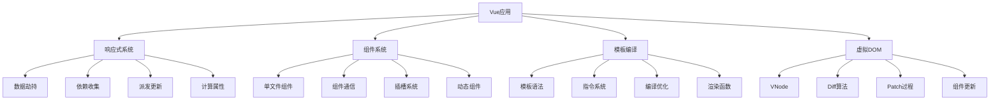

# Vue基础概念面试题

## 🎯 核心知识点

- Vue核心概念
- 模板语法与指令
- 组件系统
- 响应式原理
- 生命周期钩子
- 事件处理与表单

## 📊 Vue核心架构图



## 💡 面试题目

### 🟢 初级题目

#### 1. **[初级]** Vue基础语法和模板指令

**标签**: 模板语法, 指令, 数据绑定, 条件渲染

**题目描述**:
请详细说明Vue的模板语法和常用指令的使用方法。

**核心答案**:

**Vue基础模板语法**:

```vue
<template>
  <div id="app">
    <!-- 1. 文本插值 -->
    <h1>{{ title }}</h1>
    <p>{{ message }}</p>
    
    <!-- 2. HTML插值 -->
    <div v-html="htmlContent"></div>
    
    <!-- 3. 属性绑定 -->
    
    <!-- 简写形式 -->
    
    
    <!-- 4. 动态属性绑定 -->
    <button :[attributeName]="attributeValue">Dynamic Attribute</button>
    
    <!-- 5. 类绑定 -->
    <div :class="{ active: isActive, disabled: isDisabled }">Class Object</div>
    <div :class="[activeClass, disabledClass]">Class Array</div>
    <div :class="computedClasses">Computed Classes</div>
    
    <!-- 6. 样式绑定 -->
    <div :style="{ color: textColor, fontSize: fontSize + 'px' }">Style Object</div>
    <div :style="[baseStyles, overrideStyles]">Style Array</div>
    
    <!-- 7. 条件渲染 -->
    <p v-if="showMessage">This is shown conditionally</p>
    <p v-else-if="showAlternative">Alternative message</p>
    <p v-else>Default message</p>
    
    <!-- v-show vs v-if -->
    <p v-show="isVisible">v-show (CSS display)</p>
    <p v-if="isVisible">v-if (DOM manipulation)</p>
    
    <!-- 8. 列表渲染 -->
    <ul>
      <li v-for="item in items" :key="item.id">
        {{ item.name }} - {{ item.price }}
      </li>
    </ul>
    
    <!-- 带索引的列表渲染 -->
    <ul>
      <li v-for="(item, index) in items" :key="item.id">
        {{ index }} - {{ item.name }}
      </li>
    </ul>
    
    <!-- 对象遍历 -->
    <ul>
      <li v-for="(value, key) in userInfo" :key="key">
        {{ key }}: {{ value }}
      </li>
    </ul>
    
    <!-- 9. 事件处理 -->
    <button @click="handleClick">Click Me</button>
    <button @click="handleClickWithParam('parameter')">Click with Param</button>
    <button @click="handleClickWithEvent($event)">Click with Event</button>
    
    <!-- 事件修饰符 -->
    <form @submit.prevent="handleSubmit">
      <input @keyup.enter="handleEnter" v-model="inputValue">
      <button type="submit">Submit</button>
    </form>
    
    <!-- 10. 表单输入绑定 -->
    <input v-model="inputValue" placeholder="Text input">
    <textarea v-model="textareaValue" placeholder="Textarea"></textarea>
    
    <input type="checkbox" v-model="isChecked" id="checkbox">
    <label for="checkbox">{{ isChecked }}</label>
    
    <input type="radio" v-model="selectedRadio" value="option1" id="radio1">
    <label for="radio1">Option 1</label>
    <input type="radio" v-model="selectedRadio" value="option2" id="radio2">
    <label for="radio2">Option 2</label>
    
    <select v-model="selectedOption">
      <option disabled value="">Please select</option>
      <option value="a">A</option>
      <option value="b">B</option>
      <option value="c">C</option>
    </select>
    
    <!-- 11. 修饰符 -->
    <input v-model.lazy="lazyValue" placeholder="Lazy update">
    <input v-model.number="numberValue" type="number" placeholder="Number">
    <input v-model.trim="trimmedValue" placeholder="Trimmed">
  </div>
</template>

<script>
export default {
  name: 'VueBasicsDemo',
  data() {
    return {
      title: 'Vue.js Basics',
      message: 'Hello Vue!',
      htmlContent: '<strong>Bold text</strong>',
      imageSrc: '/path/to/image.jpg',
      imageAlt: 'Sample image',
      attributeName: 'title',
      attributeValue: 'Dynamic title',
      
      // 类和样式
      isActive: true,
      isDisabled: false,
      activeClass: 'active',
      disabledClass: 'disabled',
      textColor: 'red',
      fontSize: 16,
      baseStyles: { fontWeight: 'bold' },
      overrideStyles: { textDecoration: 'underline' },
      
      // 条件渲染
      showMessage: true,
      showAlternative: false,
      isVisible: true,
      
      // 列表数据
      items: [
        { id: 1, name: 'Apple', price: 1.99 },
        { id: 2, name: 'Banana', price: 0.99 },
        { id: 3, name: 'Orange', price: 2.49 }
      ],
      
      userInfo: {
        name: 'Alice',
        age: 25,
        email: 'alice@example.com'
      },
      
      // 表单数据
      inputValue: '',
      textareaValue: '',
      isChecked: false,
      selectedRadio: '',
      selectedOption: '',
      lazyValue: '',
      numberValue: 0,
      trimmedValue: ''
    };
  },
  
  computed: {
    computedClasses() {
      return {
        active: this.isActive,
        disabled: this.isDisabled,
        'has-content': this.message.length > 0
      };
    }
  },
  
  methods: {
    handleClick() {
      console.log('Button clicked!');
      this.isActive = !this.isActive;
    },
    
    handleClickWithParam(param) {
      console.log('Parameter:', param);
    },
    
    handleClickWithEvent(event) {
      console.log('Event:', event);
      console.log('Target:', event.target);
    },
    
    handleSubmit() {
      console.log('Form submitted');
      console.log('Input value:', this.inputValue);
    },
    
    handleEnter() {
      console.log('Enter key pressed');
    }
  }
};
</script>

<style scoped>
.active {
  color: green;
  font-weight: bold;
}

.disabled {
  color: gray;
  opacity: 0.5;
}

.has-content {
  border: 1px solid #ccc;
  padding: 10px;
}
</style>
```

**Vue指令详解**:

```vue
<template>
  <div class="directives-demo">
    <!-- v-text 指令 -->
    <p v-text="textContent"></p>
    
    <!-- v-html 指令 -->
    <div v-html="htmlContent"></div>
    
    <!-- v-show 指令 -->
    <p v-show="isVisible">v-show content</p>
    
    <!-- v-if/v-else-if/v-else 指令 -->
    <div v-if="status === 'loading'">Loading...</div>
    <div v-else-if="status === 'error'">Error occurred</div>
    <div v-else>Content loaded</div>
    
    <!-- v-for 指令 -->
    <ul>
      <li v-for="(item, index) in list" :key="item.id">
        {{ index + 1 }}. {{ item.name }}
      </li>
    </ul>
    
    <!-- v-on 指令 (事件监听) -->
    <button v-on:click="handleClick">v-on:click</button>
    <button @click="handleClick">@click (简写)</button>
    
    <!-- 事件修饰符 -->
    <div @click="handleDivClick">
      <button @click.stop="handleButtonClick">Stop Propagation</button>
    </div>
    
    <a @click.prevent="handleLinkClick" href="https://example.com">
      Prevent Default
    </a>
    
    <button @click.once="handleOnceClick">Click Once</button>
    
    <!-- 按键修饰符 -->
    <input @keyup.enter="handleEnter" @keyup.esc="handleEscape">
    
    <!-- v-bind 指令 -->
    
     <!-- 简写 -->
    
    <!-- v-model 指令 -->
    <input v-model="inputValue">
    <p>Input value: {{ inputValue }}</p>
    
    <!-- v-slot 指令 (插槽) -->
    <custom-component>
      <template v-slot:header>
        <h2>Header Content</h2>
      </template>
      
      <template v-slot:default>
        <p>Default slot content</p>
      </template>
      
      <template #footer> <!-- v-slot 简写 -->
        <p>Footer Content</p>
      </template>
    </custom-component>
    
    <!-- v-pre 指令 (跳过编译) -->
    <span v-pre>{{ this will not be compiled }}</span>
    
    <!-- v-cloak 指令 (防止闪烁) -->
    <div v-cloak>
      {{ message }}
    </div>
    
    <!-- v-once 指令 (一次性渲染) -->
    <h1 v-once>{{ title }}</h1>
    
    <!-- 自定义指令 -->
    <input v-focus v-color="'red'">
  </div>
</template>

<script>
export default {
  name: 'DirectivesDemo',
  data() {
    return {
      textContent: 'Text content',
      htmlContent: '<em>HTML content</em>',
      isVisible: true,
      status: 'loaded',
      list: [
        { id: 1, name: 'Item 1' },
        { id: 2, name: 'Item 2' },
        { id: 3, name: 'Item 3' }
      ],
      imageSrc: '/path/to/image.jpg',
      imageAlt: 'Sample image',
      inputValue: '',
      title: 'Vue Directives',
      message: 'Hello Vue!'
    };
  },
  
  methods: {
    handleClick() {
      console.log('Button clicked');
    },
    
    handleDivClick() {
      console.log('Div clicked');
    },
    
    handleButtonClick() {
      console.log('Button clicked (propagation stopped)');
    },
    
    handleLinkClick() {
      console.log('Link clicked (default prevented)');
    },
    
    handleOnceClick() {
      console.log('This will only log once');
    },
    
    handleEnter() {
      console.log('Enter key pressed');
    },
    
    handleEscape() {
      console.log('Escape key pressed');
    }
  },
  
  // 自定义指令
  directives: {
    focus: {
      // 当绑定元素插入到 DOM 中时
      inserted(el) {
        el.focus();
      }
    },
    
    color: {
      bind(el, binding) {
        el.style.color = binding.value;
      },
      update(el, binding) {
        el.style.color = binding.value;
      }
    }
  }
};
</script>

<style>
[v-cloak] {
  display: none;
}
</style>
```

---

#### 2. **[初级]** Vue组件系统基础

**标签**: 组件, Props, 事件, 插槽, 组件通信

**题目描述**:
请详细说明Vue组件系统的基本概念和组件间通信方式。

**核心答案**:

**组件定义和使用**:

```vue
<!-- 父组件 -->
<template>
  <div class="parent-component">
    <h1>Parent Component</h1>
    
    <!-- 使用子组件 -->
    <child-component 
      :title="childTitle"
      :items="items"
      :is-visible="showChild"
      @item-selected="handleItemSelected"
      @update-title="handleTitleUpdate"
    >
      <!-- 默认插槽 -->
      <p>This is slot content from parent</p>
      
      <!-- 具名插槽 -->
      <template #header>
        <h2>Header from parent</h2>
      </template>
      
      <!-- 作用域插槽 -->
      <template #item="{ item, index }">
        <strong>{{ index }}: {{ item.name }}</strong>
      </template>
    </child-component>
    
    <!-- 动态组件 -->
    <component :is="currentComponent" :data="componentData"></component>
    
    <button @click="switchComponent">Switch Component</button>
  </div>
</template>

<script>
import ChildComponent from './ChildComponent.vue';
import ComponentA from './ComponentA.vue';
import ComponentB from './ComponentB.vue';

export default {
  name: 'ParentComponent',
  
  components: {
    ChildComponent,
    ComponentA,
    ComponentB
  },
  
  data() {
    return {
      childTitle: 'Child Component Title',
      showChild: true,
      items: [
        { id: 1, name: 'Apple', price: 1.99 },
        { id: 2, name: 'Banana', price: 0.99 },
        { id: 3, name: 'Orange', price: 2.49 }
      ],
      currentComponent: 'ComponentA',
      componentData: { message: 'Hello from parent' }
    };
  },
  
  methods: {
    handleItemSelected(item) {
      console.log('Item selected in parent:', item);
    },
    
    handleTitleUpdate(newTitle) {
      this.childTitle = newTitle;
    },
    
    switchComponent() {
      this.currentComponent = this.currentComponent === 'ComponentA' 
        ? 'ComponentB' 
        : 'ComponentA';
    }
  }
};
</script>
```

**子组件实现**:

```vue
<!-- ChildComponent.vue -->
<template>
  <div class="child-component" v-if="isVisible">
    <!-- 使用props -->
    <h2>{{ title }}</h2>
    
    <!-- 插槽使用 -->
    <header>
      <slot name="header"></slot>
    </header>
    
    <main>
      <!-- 默认插槽 -->
      <slot></slot>
      
      <!-- 列表渲染 -->
      <ul>
        <li v-for="(item, index) in items" :key="item.id">
          <!-- 作用域插槽 -->
          <slot name="item" :item="item" :index="index">
            <!-- 默认内容 -->
            {{ item.name }} - ${{ item.price }}
          </slot>
          
          <button @click="selectItem(item)">Select</button>
        </li>
      </ul>
    </main>
    
    <!-- 事件触发 -->
    <footer>
      <input v-model="localTitle" @input="updateTitle">
      <button @click="emitCustomEvent">Emit Custom Event</button>
    </footer>
  </div>
</template>

<script>
export default {
  name: 'ChildComponent',
  
  // Props定义
  props: {
    title: {
      type: String,
      required: true,
      default: 'Default Title'
    },
    items: {
      type: Array,
      default: () => []
    },
    isVisible: {
      type: Boolean,
      default: true
    },
    config: {
      type: Object,
      default: () => ({}),
      validator(value) {
        // 自定义验证
        return typeof value === 'object';
      }
    }
  },
  
  data() {
    return {
      localTitle: this.title
    };
  },
  
  // 监听props变化
  watch: {
    title(newVal) {
      this.localTitle = newVal;
    }
  },
  
  methods: {
    selectItem(item) {
      // 向父组件发送事件
      this.$emit('item-selected', item);
    },
    
    updateTitle() {
      // 发送更新事件
      this.$emit('update-title', this.localTitle);
    },
    
    emitCustomEvent() {
      // 发送自定义事件
      this.$emit('custom-event', {
        timestamp: new Date(),
        data: 'Custom data'
      });
    }
  },
  
  // 生命周期钩子
  created() {
    console.log('Child component created');
  },
  
  mounted() {
    console.log('Child component mounted');
  },
  
  beforeDestroy() {
    console.log('Child component will be destroyed');
  }
};
</script>

<style scoped>
.child-component {
  border: 1px solid #ccc;
  padding: 20px;
  margin: 10px 0;
}

.child-component h2 {
  color: #333;
  margin-bottom: 15px;
}

.child-component ul {
  list-style: none;
  padding: 0;
}

.child-component li {
  display: flex;
  justify-content: space-between;
  align-items: center;
  padding: 10px;
  border-bottom: 1px solid #eee;
}

.child-component button {
  background: #007bff;
  color: white;
  border: none;
  padding: 5px 10px;
  border-radius: 3px;
  cursor: pointer;
}

.child-component button:hover {
  background: #0056b3;
}
</style>
```

**组件通信模式**:

```javascript
// 1. 父子组件通信
// 父 -> 子: Props
// 子 -> 父: Events ($emit)

// 2. 兄弟组件通信 - 事件总线
// EventBus.js
import Vue from 'vue';
export const EventBus = new Vue();

// 组件A
export default {
  methods: {
    sendMessage() {
      EventBus.$emit('message-sent', 'Hello from Component A');
    }
  }
};

// 组件B
export default {
  created() {
    EventBus.$on('message-sent', (message) => {
      console.log('Received:', message);
    });
  },
  beforeDestroy() {
    EventBus.$off('message-sent');
  }
};

// 3. 祖先后代通信 - provide/inject
// 祖先组件
export default {
  provide() {
    return {
      theme: this.theme,
      updateTheme: this.updateTheme
    };
  },
  data() {
    return {
      theme: 'light'
    };
  },
  methods: {
    updateTheme(newTheme) {
      this.theme = newTheme;
    }
  }
};

// 后代组件
export default {
  inject: ['theme', 'updateTheme'],
  template: `
    <div :class="theme">
      <button @click="updateTheme('dark')">Switch to Dark</button>
    </div>
  `
};

// 4. 状态管理 - Vuex (简化版)
const store = new Vuex.Store({
  state: {
    count: 0,
    user: null
  },
  mutations: {
    increment(state) {
      state.count++;
    },
    setUser(state, user) {
      state.user = user;
    }
  },
  actions: {
    async fetchUser({ commit }, userId) {
      const user = await api.getUser(userId);
      commit('setUser', user);
    }
  },
  getters: {
    isLoggedIn: state => !!state.user,
    userDisplayName: state => state.user ? state.user.name : 'Guest'
  }
});

// 在组件中使用
export default {
  computed: {
    count() {
      return this.$store.state.count;
    },
    isLoggedIn() {
      return this.$store.getters.isLoggedIn;
    }
  },
  methods: {
    increment() {
      this.$store.commit('increment');
    },
    async login(userId) {
      await this.$store.dispatch('fetchUser', userId);
    }
  }
};
```

**高级组件模式**:

```vue
<!-- 高阶组件 (HOC) -->
<script>
// withLoading.js
export function withLoading(WrappedComponent) {
  return {
    name: `WithLoading${WrappedComponent.name}`,
    props: {
      loading: {
        type: Boolean,
        default: false
      }
    },
    render(h) {
      if (this.loading) {
        return h('div', { class: 'loading' }, 'Loading...');
      }
      
      return h(WrappedComponent, {
        props: this.$props,
        attrs: this.$attrs,
        on: this.$listeners
      }, this.$slots.default);
    }
  };
}

// 使用HOC
import MyComponent from './MyComponent.vue';
import { withLoading } from './withLoading.js';

export default {
  components: {
    MyComponentWithLoading: withLoading(MyComponent)
  }
};
</script>

<!-- Render Props模式 -->
<template>
  <data-provider>
    <template v-slot="{ data, loading, error }">
      <div v-if="loading">Loading...</div>
      <div v-else-if="error">Error: {{ error.message }}</div>
      <div v-else>
        <h2>Data loaded:</h2>
        <pre>{{ data }}</pre>
      </div>
    </template>
  </data-provider>
</template>

<script>
// DataProvider.vue
export default {
  name: 'DataProvider',
  data() {
    return {
      data: null,
      loading: true,
      error: null
    };
  },
  
  async created() {
    try {
      this.data = await this.fetchData();
    } catch (error) {
      this.error = error;
    } finally {
      this.loading = false;
    }
  },
  
  methods: {
    async fetchData() {
      // 模拟API调用
      return new Promise((resolve) => {
        setTimeout(() => {
          resolve({ message: 'Data loaded successfully!' });
        }, 2000);
      });
    }
  },
  
  render() {
    return this.$scopedSlots.default({
      data: this.data,
      loading: this.loading,
      error: this.error
    });
  }
};
</script>

<!-- Mixin模式 -->
<script>
// mixins/formMixin.js
export const formMixin = {
  data() {
    return {
      errors: {},
      isSubmitting: false
    };
  },
  
  methods: {
    validateField(field, value, rules) {
      const errors = [];
      
      rules.forEach(rule => {
        if (rule.required && !value) {
          errors.push(`${field} is required`);
        }
        
        if (rule.minLength && value.length < rule.minLength) {
          errors.push(`${field} must be at least ${rule.minLength} characters`);
        }
        
        if (rule.pattern && !rule.pattern.test(value)) {
          errors.push(`${field} format is invalid`);
        }
      });
      
      this.$set(this.errors, field, errors);
      return errors.length === 0;
    },
    
    async submitForm(formData) {
      this.isSubmitting = true;
      
      try {
        await this.onSubmit(formData);
        this.errors = {};
      } catch (error) {
        console.error('Form submission error:', error);
      } finally {
        this.isSubmitting = false;
      }
    }
  }
};

// 在组件中使用mixin
export default {
  mixins: [formMixin],
  
  data() {
    return {
      form: {
        email: '',
        password: ''
      }
    };
  },
  
  methods: {
    async onSubmit(formData) {
      // 实现具体的提交逻辑
      const response = await api.login(formData);
      return response;
    },
    
    handleSubmit() {
      const isValid = this.validateField('email', this.form.email, [
        { required: true },
        { pattern: /^[^\s@]+@[^\s@]+\.[^\s@]+$/ }
      ]);
      
      if (isValid) {
        this.submitForm(this.form);
      }
    }
  }
};
</script>
```

---

## 🔗 相关链接

- [← 返回前端题库](./README.md)
- [Vue组合式API](./vue-composition-api.md)
- [Vue状态管理](./vue-state-management.md)
- [Vue性能优化](./vue-performance.md)

---

*Vue.js以其简洁的语法和强大的功能成为现代前端开发的重要选择，掌握其核心概念对构建高质量应用至关重要* 