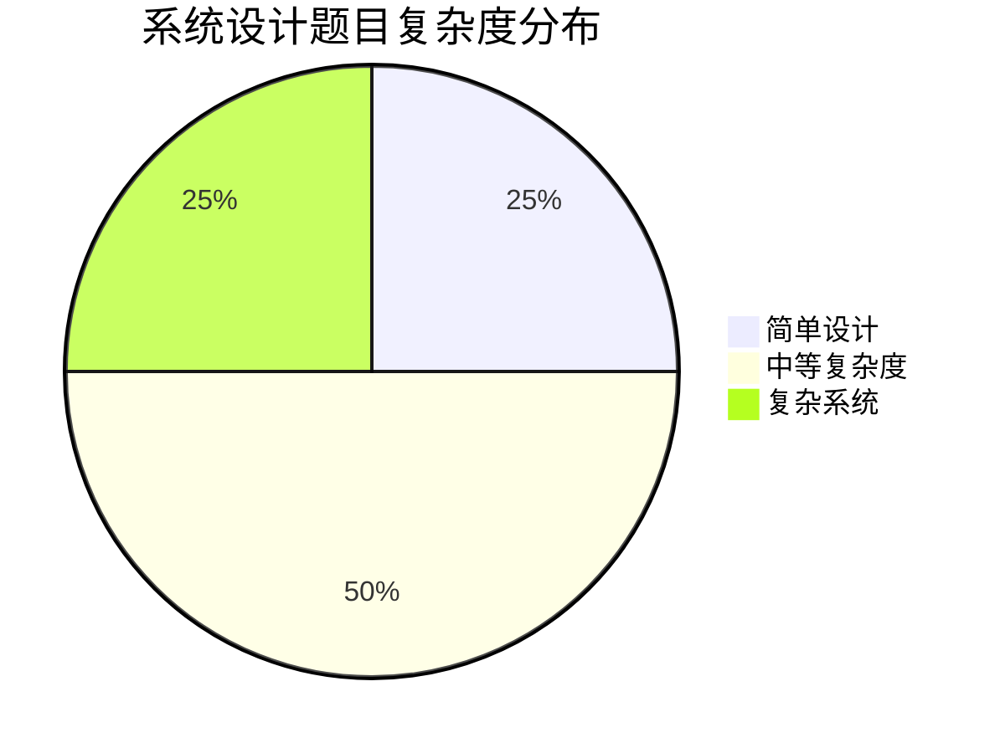
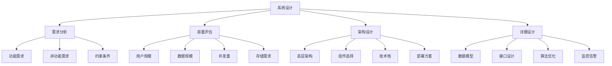
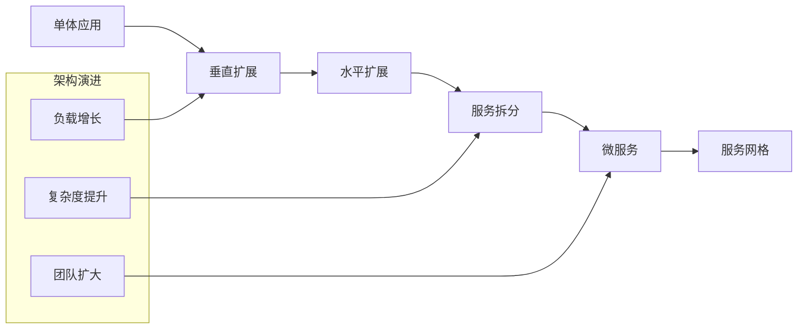

# 系统设计面试题库

## 📋 目录概览

### 📚 基础理论
- [系统设计基础](./system-design-fundamentals.md) - 系统设计核心原则与方法论

### 🏗️ 架构设计
- [负载均衡](./load-balancing.md) - 负载均衡算法与架构设计
- [微服务架构](./microservices-architecture.md) - 微服务拆分与治理
- [分布式系统](./distributed-systems.md) - 分布式系统理论与实践
- [安全架构设计](./security-architecture.md) - 安全架构与威胁防护

### 🔧 核心组件
- [数据库设计](./database-design.md) - 数据库选型与架构设计
- [缓存系统](./caching-systems.md) - 缓存策略与实现方案
- [消息队列](./message-queues.md) - 消息中间件设计与选型
- [API设计](./api-design.md) - RESTful API与接口设计

### 📊 可观测性
- [监控与可观测性](./monitoring-observability.md) - 监控体系与链路追踪
- [容错与恢复](./fault-tolerance.md) - 容错机制与灾难恢复

### 🚀 性能优化
- [高并发处理](./high-concurrency.md) - 高并发架构设计

### 📱 应用场景
- [聊天系统设计](./chat-system.md) - 实时通信系统架构
- [短链接服务](./url-shortener.md) - URL缩短服务设计
- [新闻推送系统](./news-feed.md) - 信息流推荐系统
- [通知系统设计](./notification-system.md) - 多渠道通知与推送

## 🔍 题目分类

### 基础概念
- [系统设计基础](./system-design-fundamentals.md) - 可扩展性、可靠性、一致性
- [分布式系统](./distributed-systems.md) - CAP理论、一致性协议、分布式存储
- [负载均衡](./load-balancing.md) - 负载均衡算法、反向代理、CDN

### 数据存储
- [数据库设计](./database-design.md) - SQL vs NoSQL、数据建模、分片策略
- [缓存系统](./caching-systems.md) - 缓存策略、Redis集群、分布式缓存
- [消息队列](./message-queues.md) - Kafka、RabbitMQ、事件驱动架构

### 高可用架构
- [微服务架构](./microservices-architecture.md) - 服务拆分、API网关、服务发现
- [容错与恢复](./fault-tolerance.md) - 熔断器、重试机制、灾难恢复
- [监控告警](./monitoring-alerting.md) - 指标监控、日志系统、链路追踪

### 性能优化
- [高并发处理](./high-concurrency.md) - 并发模型、连接池、异步处理
- [系统性能](./system-performance.md) - 性能瓶颈、优化策略、压力测试
- [数据处理](./data-processing.md) - 批处理、流处理、实时计算

## 🏗️ 经典系统设计题目
- [设计短链接服务](./url-shortener.md) - 类似bit.ly的短链接系统
- [设计聊天系统](./chat-system.md) - 实时消息传递系统
- [设计新闻推送](./news-feed.md) - 社交媒体动态推送系统
- [设计搜索引擎](./search-engine.md) - 网页搜索和索引系统
- [设计视频流媒体](./video-streaming.md) - 类似YouTube的视频平台
- [设计电商系统](./ecommerce-system.md) - 在线购物平台架构
- [设计支付系统](./payment-system.md) - 金融支付处理系统
- [设计推荐系统](./recommendation-system.md) - 个性化推荐引擎

## 🔧 技术组件
- [API设计](./api-design.md) - RESTful API、GraphQL、RPC协议
- [安全架构](./security-architecture.md) - 认证授权、数据加密、安全通信
- [云原生架构](./cloud-native.md) - 容器化、Kubernetes、云服务

## 📊 复杂度分析

## 🎯 系统设计思维框架

## 🏛️ 系统架构演进

## 📈 技术选型决策矩阵

| 维度 | SQL数据库 | NoSQL数据库 | 消息队列 | 缓存系统 |
|------|----------|------------|----------|----------|
| 一致性 | 强一致性 | 最终一致性 | 至少一次 | 最终一致性 |
| 可扩展性 | 垂直扩展 | 水平扩展 | 水平扩展 | 水平扩展 |
| 查询复杂度 | 复杂查询 | 简单查询 | 顺序处理 | 键值查询 |
| 事务支持 | ACID | BASE | 幂等性 | 过期策略 |

## 🎓 学习路径建议

### 🔰 初级阶段
1. 掌握基础概念：负载均衡、缓存、数据库
2. 理解常见架构模式：三层架构、MVC
3. 学习基础设计：简单的CRUD系统

### 🔥 中级阶段
1. 深入分布式系统：一致性、分区容错
2. 掌握微服务架构：服务拆分、治理
3. 学习经典案例：短链接、聊天系统

### 🚀 高级阶段
1. 复杂系统设计：推荐系统、搜索引擎
2. 大规模系统：高并发、大数据处理
3. 架构演进：重构、优化、扩展

## 💡 面试技巧

### 📝 解题步骤
1. **澄清需求**（5分钟）
   - 明确功能要求
   - 确定规模和约束
   - 识别关键指标

2. **容量估算**（5-10分钟）
   - 用户数量和增长
   - 读写比例
   - 存储和带宽需求

3. **系统设计**（15-20分钟）
   - 高层架构图
   - 核心组件
   - 数据流转

4. **深入讨论**（10-15分钟）
   - 数据库设计
   - 算法选择
   - 扩展性考虑

5. **问题解决**（5-10分钟）
   - 瓶颈识别
   - 优化方案
   - 故障处理

### 🎨 绘图技巧
- 使用简洁的方框和箭头
- 标注重要的数据流向
- 突出关键组件和连接
- 保持图表清晰易读

### 💬 沟通要点
- 大声思考，让面试官了解你的思路
- 主动询问不明确的需求
- 承认不确定的地方，展示学习能力
- 讨论权衡和妥协

## 🛠️ 常用技术栈

### 💾 存储层
- **关系型数据库**: MySQL, PostgreSQL
- **NoSQL数据库**: MongoDB, Cassandra, DynamoDB
- **缓存系统**: Redis, Memcached
- **文件存储**: HDFS, S3, CDN

### 🔄 计算层
- **Web服务器**: Nginx, Apache
- **应用服务器**: Tomcat, Node.js
- **负载均衡器**: HAProxy, F5
- **消息队列**: Kafka, RabbitMQ, SQS

### 📊 监控层
- **监控系统**: Prometheus, Grafana
- **日志系统**: ELK Stack, Fluentd
- **链路追踪**: Jaeger, Zipkin
- **告警系统**: PagerDuty, AlertManager

## 📊 技术选型决策矩阵

| 维度 | MySQL | MongoDB | Redis | Kafka |
|------|-------|---------|-------|-------|
| 一致性 | 强一致 | 最终一致 | 强一致 | 至少一次 |
| 可用性 | 99.9% | 99.95% | 99.9% | 99.95% |
| 分区容错 | 中等 | 高 | 中等 | 高 |
| 性能 | 中等 | 高 | 很高 | 高 |
| 扩展性 | 垂直 | 水平 | 水平 | 水平 |
| 复杂度 | 低 | 中等 | 低 | 高 |

## 🎓 推荐资源

### 📖 经典书籍
- 《设计数据密集型应用》- Martin Kleppmann
- 《大型网站技术架构》- 李智慧
- 《微服务设计》- Sam Newman
- 《分布式系统原理与范型》- Andrew S. Tanenbaum

### 🌐 在线资源
- [High Scalability](http://highscalability.com/) - 大规模系统案例
- [AWS Architecture Center](https://aws.amazon.com/architecture/) - 云架构参考
- [Google Cloud Architecture Framework](https://cloud.google.com/architecture/framework) - 架构框架
- [System Design Primer](https://github.com/donnemartin/system-design-primer) - 系统设计入门

### 🎥 视频课程
- Grokking the System Design Interview
- Educative.io System Design Course
- YouTube系统设计频道

## 🔄 持续学习建议

### 📅 学习计划
- **第1-2周**: 基础理论和概念
- **第3-4周**: 经典系统设计案例
- **第5-6周**: 深入技术细节
- **第7-8周**: 模拟面试练习

### 🤝 实践方法
- 参与开源项目
- 搭建个人项目
- 技术博客分享
- 参加技术meetup

### 📈 进阶方向
- 云原生架构
- 边缘计算
- 人工智能系统
- 区块链系统

---

*系统设计是一个持续学习和实践的过程，理论与实践相结合才能真正掌握* 🚀

## 🔗 相关链接

- [← 返回主目录](../../README.md)
- [后端面试题](../backend/README.md)
- [数据库面试题](../database/README.md)
- [算法面试题](../algorithms/README.md)

---

*系统设计不仅是技术，更是艺术。在约束条件下找到最优解，在复杂性和简洁性之间取得平衡* 🏗️ 