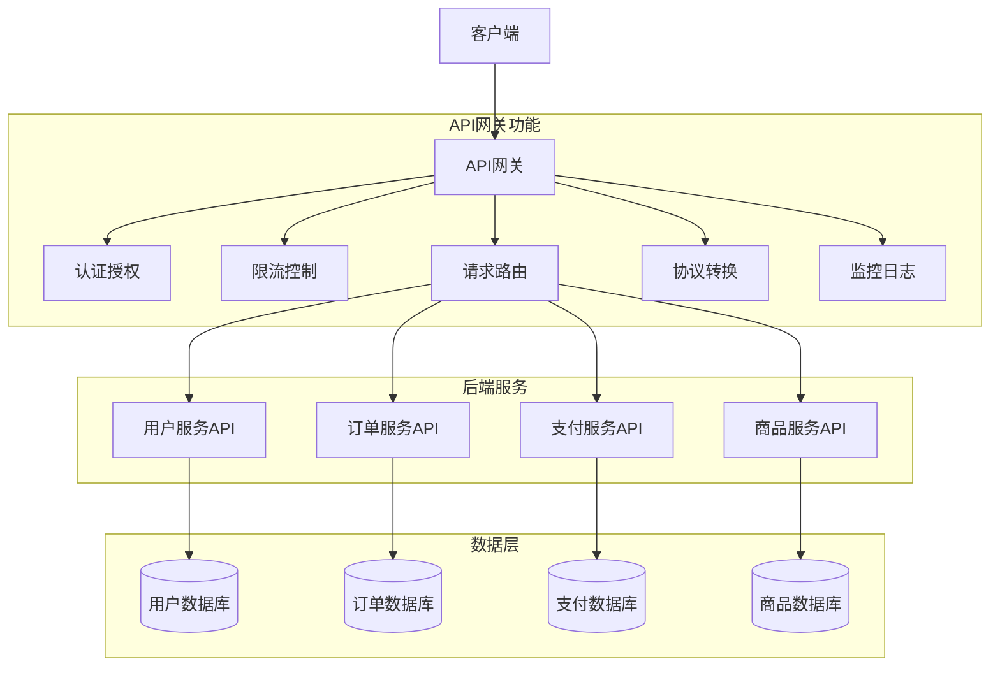
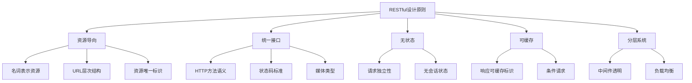
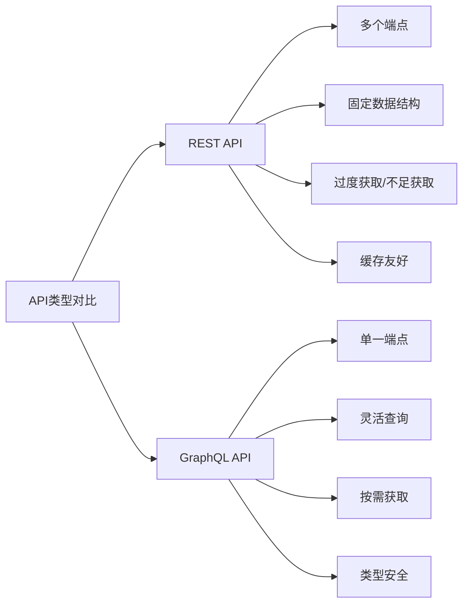
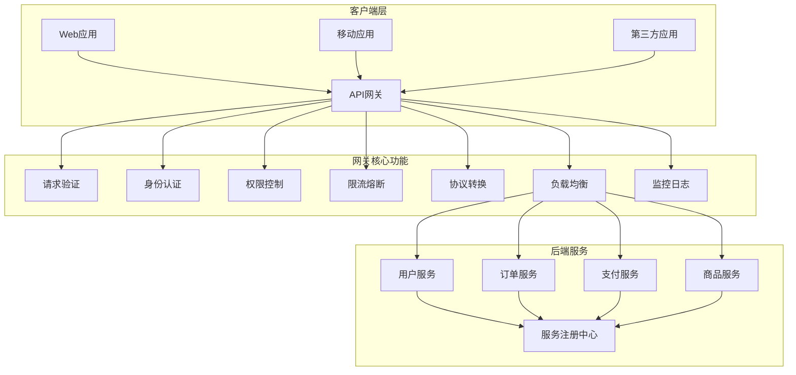
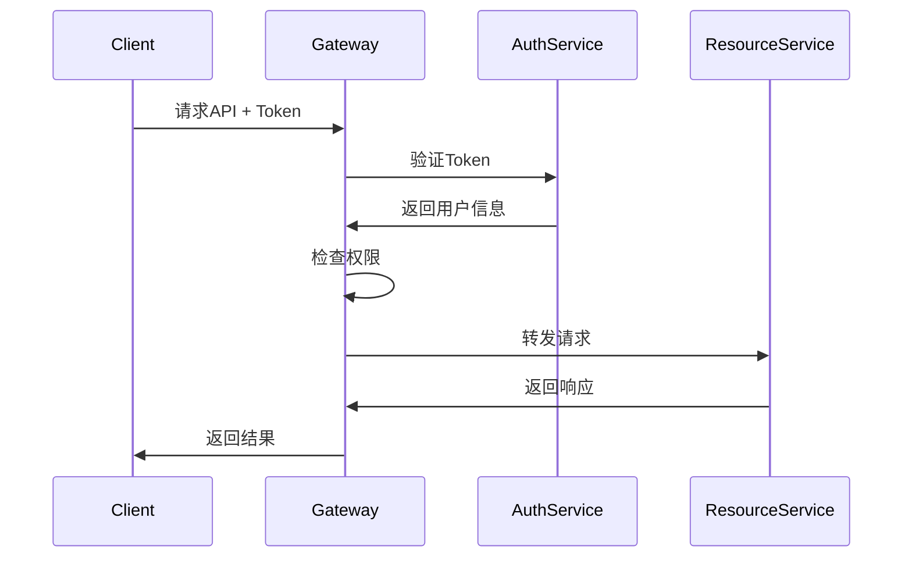
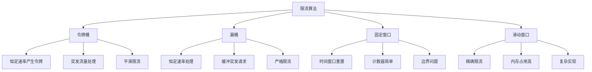
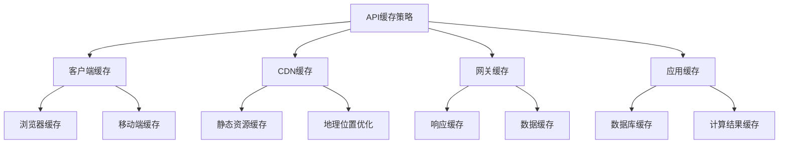
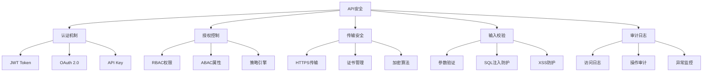
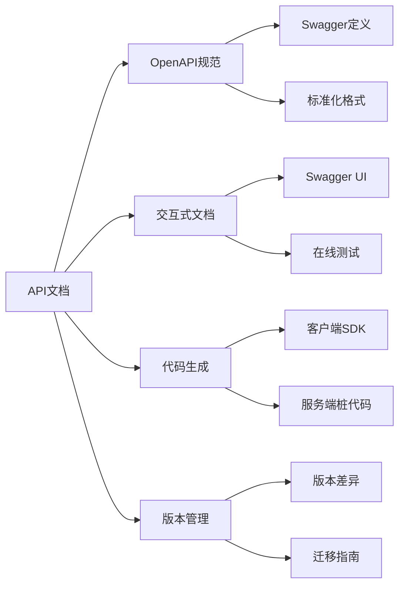
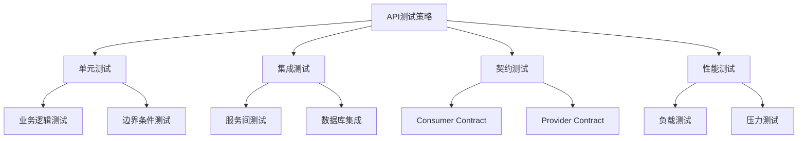

# API设计

## 🎯 核心知识点

- RESTful API设计原则
- GraphQL vs REST对比
- API网关架构
- API版本管理
- 接口文档与测试

## 📊 API设计架构



## 💡 面试题目

### **初级** RESTful API设计原则
**题目：** 设计一个电商系统的RESTful API，包括商品、订单、用户等资源的CRUD操作。

**答案要点：**



**API设计示例：**

| 资源 | HTTP方法 | URL | 描述 |
|------|----------|-----|------|
| 商品 | GET | /api/v1/products | 获取商品列表 |
| 商品 | GET | /api/v1/products/{id} | 获取单个商品 |
| 商品 | POST | /api/v1/products | 创建商品 |
| 商品 | PUT | /api/v1/products/{id} | 更新商品 |
| 商品 | DELETE | /api/v1/products/{id} | 删除商品 |
| 订单 | GET | /api/v1/users/{id}/orders | 获取用户订单 |
| 订单 | POST | /api/v1/users/{id}/orders | 创建订单 |
| 购物车 | GET | /api/v1/users/{id}/cart | 获取购物车 |
| 购物车 | POST | /api/v1/users/{id}/cart/items | 添加商品到购物车 |

### **中级** GraphQL vs REST对比
**题目：** 比较GraphQL和REST的优缺点，什么场景下选择GraphQL？

**答案要点：**



**技术特性对比：**

| 特性 | REST | GraphQL |
|------|------|---------|
| 查询灵活性 | 低 | 高 |
| 网络效率 | 中等 | 高 |
| 缓存策略 | 简单 | 复杂 |
| 学习成本 | 低 | 中等 |
| 工具生态 | 成熟 | 发展中 |
| 类型安全 | 依赖文档 | 内置支持 |
| 错误处理 | HTTP状态码 | 响应体错误信息 |
| 实时订阅 | 需要额外机制 | 内置支持 |

**GraphQL查询示例：**
```graphql
# 查询用户信息和订单
query GetUserWithOrders($userId: ID!) {
  user(id: $userId) {
    name
    email
    orders(limit: 10) {
      id
      total
      status
      items {
        product {
          name
          price
        }
        quantity
      }
    }
  }
}
```

### **高级** API网关设计
**题目：** 设计一个企业级API网关，需要支持认证、限流、监控、版本管理等功能。



## ⚡ 核心功能设计

### 认证授权机制



**认证方式对比：**

| 认证方式 | 优点 | 缺点 | 适用场景 |
|----------|------|------|----------|
| API Key | 简单易用 | 安全性低 | 内部服务 |
| JWT Token | 无状态、可扩展 | 难以撤销 | 分布式系统 |
| OAuth 2.0 | 标准化、安全 | 复杂度高 | 第三方接入 |
| Basic Auth | 实现简单 | 安全性低 | 简单场景 |

### 限流算法实现



**限流算法选择：**
- **令牌桶**：适合需要处理突发流量的场景
- **漏桶**：适合需要平滑处理请求的场景
- **固定窗口**：实现简单，但有边界问题
- **滑动窗口**：精确控制，但实现复杂

## 🔧 技术实现

### API版本管理策略

```mermaid
graph LR
    A[版本管理] --> B[URL路径版本]
    A --> C[请求头版本]
    A --> D[参数版本]
    A --> E[媒体类型版本]
    
    B --> B1[/api/v1/users]
    C --> C1[Accept-Version: v1]
    D --> D1[/api/users?version=v1]
    E --> E1[Accept: application/vnd.api.v1+json]
```

**版本管理最佳实践：**
1. **语义化版本**：使用主版本号.次版本号.修订号
2. **向后兼容**：新版本尽量保持兼容性
3. **弃用策略**：提前通知，逐步淘汰老版本
4. **文档维护**：每个版本保持完整文档

### 错误处理标准

```json
{
  "error": {
    "code": "VALIDATION_ERROR",
    "message": "请求参数验证失败",
    "details": [
      {
        "field": "email",
        "message": "邮箱格式不正确",
        "code": "INVALID_FORMAT"
      }
    ],
    "timestamp": "2024-01-01T12:00:00Z",
    "request_id": "req_123456789",
    "documentation_url": "https://api.example.com/docs/errors"
  }
}
```

**HTTP状态码使用规范：**

| 状态码 | 含义 | 使用场景 |
|--------|------|----------|
| 200 | 成功 | 请求成功处理 |
| 201 | 已创建 | 资源创建成功 |
| 204 | 无内容 | 删除成功 |
| 400 | 请求错误 | 参数验证失败 |
| 401 | 未授权 | 认证失败 |
| 403 | 禁止访问 | 权限不足 |
| 404 | 未找到 | 资源不存在 |
| 429 | 请求过多 | 限流触发 |
| 500 | 服务器错误 | 内部错误 |

## 📈 性能优化

### 缓存策略



**缓存控制头：**
```http
# 客户端缓存1小时
Cache-Control: max-age=3600

# 协商缓存
ETag: "686897696a7c876b7e"
Last-Modified: Wed, 01 Jan 2024 12:00:00 GMT

# 禁止缓存
Cache-Control: no-cache, no-store, must-revalidate
```

### 性能监控指标

| 指标类别 | 具体指标 | 监控目标 |
|----------|----------|----------|
| 响应时间 | 平均响应时间、P95/P99 | < 200ms |
| 吞吐量 | QPS、TPS | 根据业务需求 |
| 错误率 | 4xx/5xx错误率 | < 0.1% |
| 可用性 | 服务可用时间 | 99.9% |
| 资源使用 | CPU、内存、网络 | < 80% |

## 🛡️ 安全设计

### API安全机制



### 常见安全威胁防护

| 威胁类型 | 防护措施 | 实现方式 |
|----------|----------|----------|
| SQL注入 | 参数化查询 | 使用ORM框架 |
| XSS攻击 | 输入输出编码 | 内容安全策略 |
| CSRF攻击 | CSRF Token | 同源策略 |
| 重放攻击 | 时间戳+签名 | 请求唯一性 |
| 暴力破解 | 限流+验证码 | 账户锁定 |

## 📚 文档与测试

### API文档规范



### 测试策略



## 💡 面试要点总结

### 设计原则
1. **一致性**：统一的命名规范、错误处理、响应格式
2. **简洁性**：直观的URL设计、清晰的接口语义
3. **可扩展性**：版本管理、向后兼容
4. **安全性**：认证授权、输入验证、传输加密

### 技术选型
- **协议选择**：HTTP/HTTPS、WebSocket、gRPC
- **数据格式**：JSON、XML、Protocol Buffers
- **认证方式**：JWT、OAuth2、API Key
- **文档工具**：Swagger/OpenAPI、Postman

### 最佳实践
1. **API设计先行**：先设计接口，再实现功能
2. **版本管理**：合理的版本策略，平滑升级
3. **错误处理**：统一的错误码、详细的错误信息
4. **性能优化**：缓存策略、分页查询、字段过滤

### 常见问题处理
- **接口设计问题**：资源命名不一致、HTTP方法使用错误
- **性能问题**：N+1查询、缓存策略不当
- **安全问题**：认证授权缺失、输入验证不足
- **版本兼容**：破坏性变更、文档不同步

## 🔗 相关链接

- [← 返回系统设计主页](./README.md)
- [微服务架构](./microservices-architecture.md)
- [负载均衡](./load-balancing.md)
- [高并发处理](./high-concurrency.md)

---

*良好的API设计是系统可维护性和可扩展性的基础* 🔌 