# 缓存系统

## 🎯 核心知识点

- 缓存策略与算法
- 分布式缓存设计
- 缓存一致性保证
- 缓存穿透、击穿、雪崩
- Redis集群架构
- 缓存预热与更新

## 📊 缓存架构层次

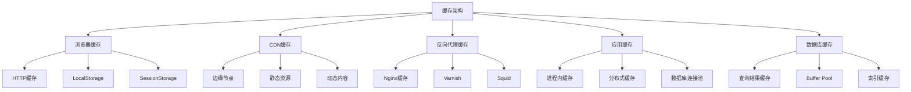

## 💡 面试题目

### **初级** 缓存淘汰算法对比
**题目：** 介绍常见的缓存淘汰算法，并分析各自的优缺点和适用场景。

**答案要点：**

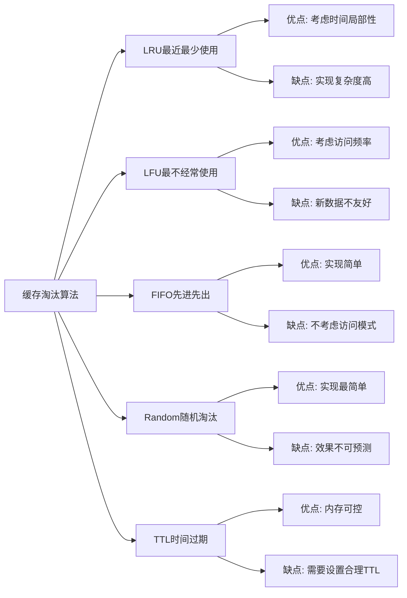

**算法实现复杂度对比：**

| 算法 | 时间复杂度 | 空间复杂度 | 实现难度 | 适用场景 |
|------|----------|----------|----------|----------|
| LRU | O(1) | O(n) | 中等 | 时间局部性强 |
| LFU | O(log n) | O(n) | 复杂 | 访问模式稳定 |
| FIFO | O(1) | O(1) | 简单 | 均匀访问模式 |
| Random | O(1) | O(1) | 最简单 | 随机访问模式 |

### **中级** 缓存一致性解决方案
**题目：** 在分布式系统中，如何解决缓存与数据库的数据一致性问题？请设计一个解决方案。

**答案要点：**

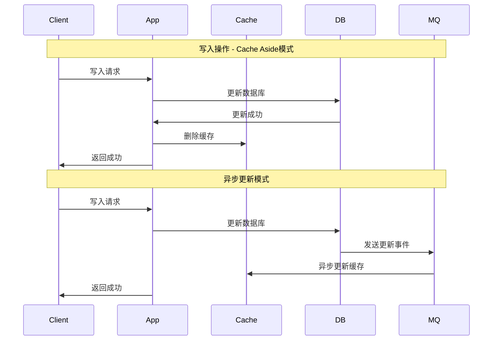

**一致性策略对比：**

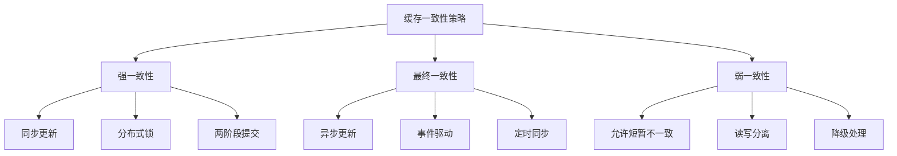

### **高级** Redis集群设计
**题目：** 设计一个支持高可用、高性能的Redis集群架构，支持10万QPS的读写操作。

**答案要点：**

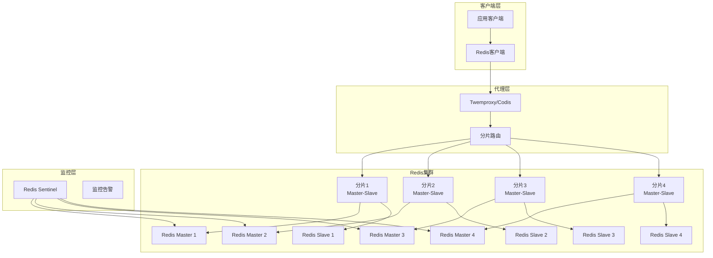

**集群特性对比：**

| 方案 | 优点 | 缺点 | 适用场景 |
|------|------|------|----------|
| Redis Cluster | 原生支持、自动故障转移 | 某些命令限制 | 大规模部署 |
| Twemproxy | 轻量级、协议兼容 | 单点故障 | 中小规模 |
| Codis | 功能丰富、管理界面 | 架构复杂 | 企业级应用 |
| Redis Sentinel | 高可用保证 | 不支持分片 | 主从架构 |

## 🔧 缓存设计模式

### Cache-Aside模式

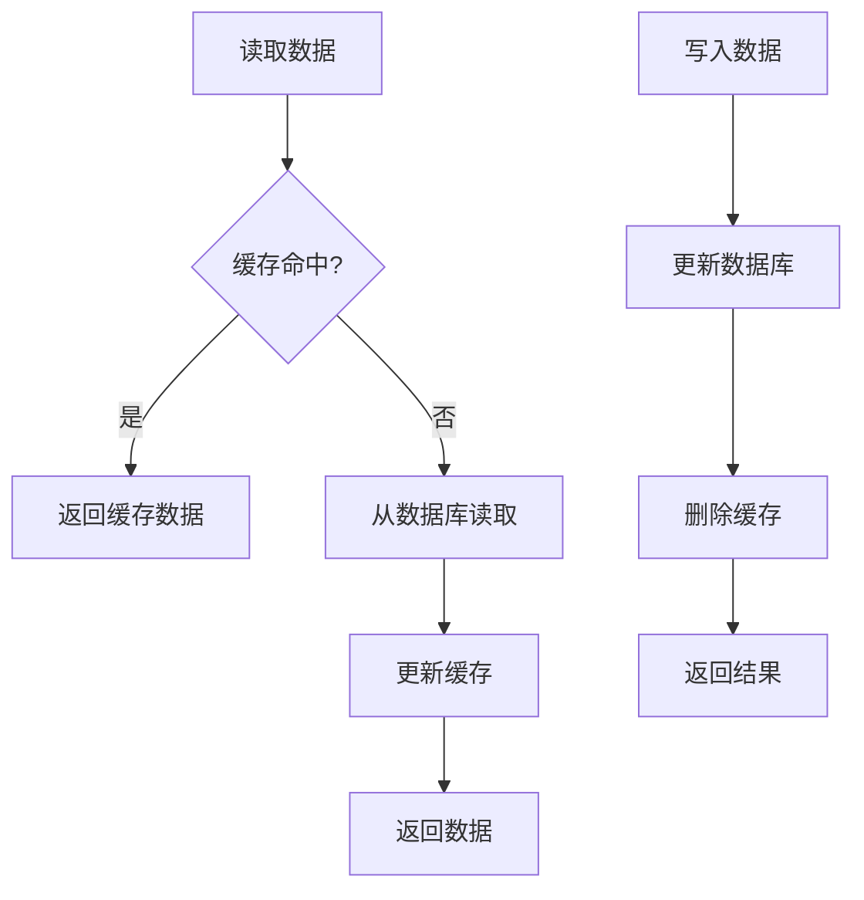

### Write-Through模式

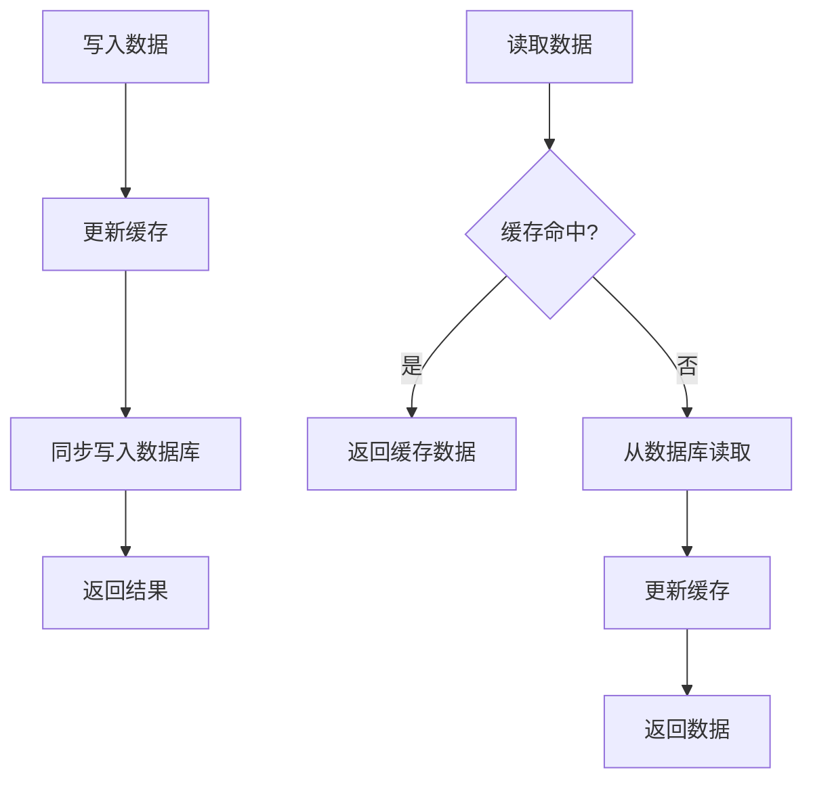

### Write-Behind模式

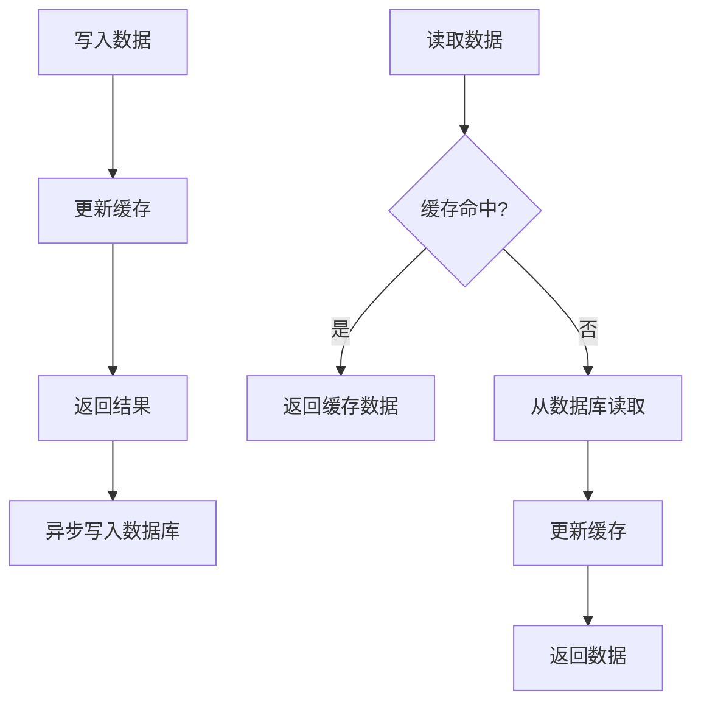

## 🛡️ 缓存问题解决方案

### 缓存穿透

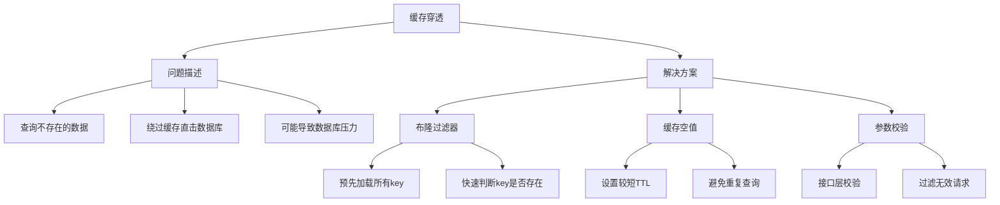

### 缓存击穿

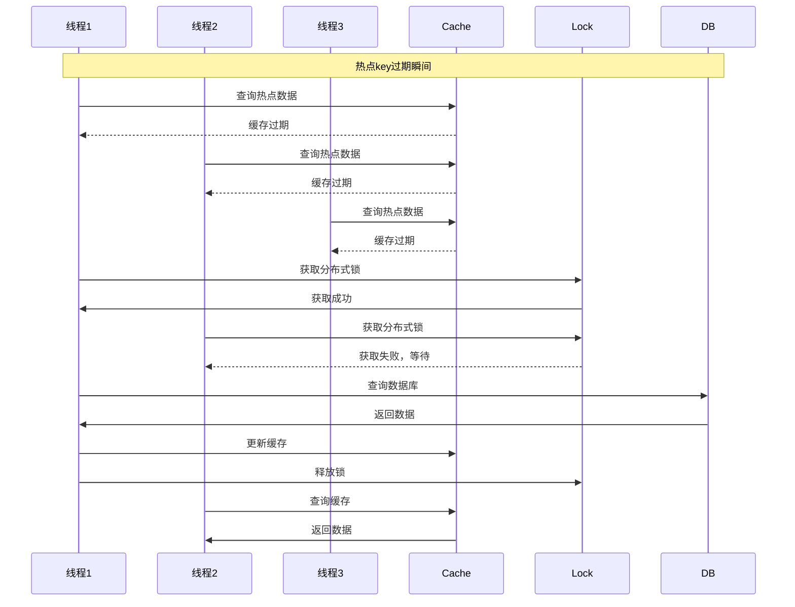

### 缓存雪崩

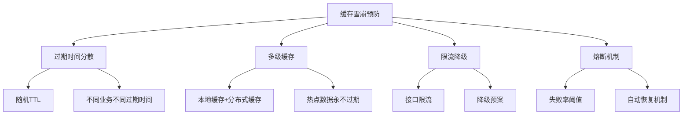

## ⚡ 性能优化策略

### 缓存预热

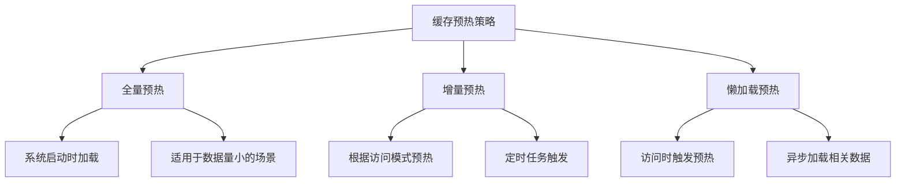

### 缓存分层

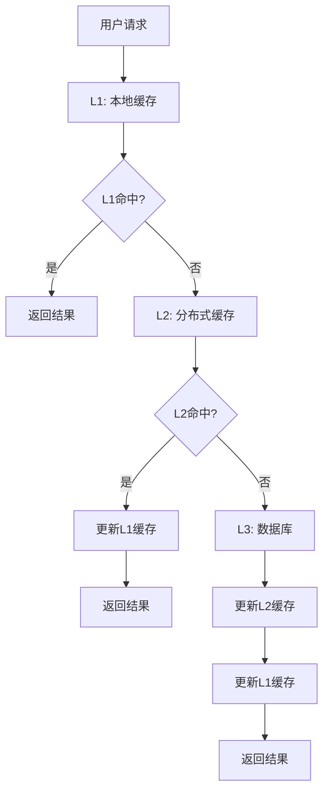

## 📈 监控指标

### 缓存性能指标

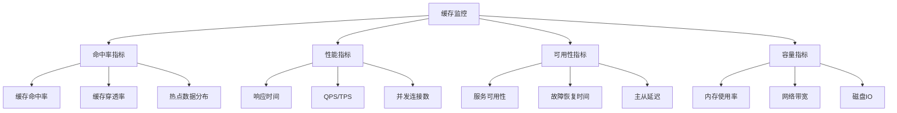

### 告警策略

| 指标 | 告警阈值 | 级别 | 处理措施 |
|------|----------|------|----------|
| 缓存命中率 | <80% | 警告 | 检查缓存策略 |
| 内存使用率 | >85% | 严重 | 扩容或清理 |
| 响应时间 | >100ms | 警告 | 性能调优 |
| 服务可用性 | <99% | 严重 | 故障切换 |

## 🔍 故障排查

### 常见问题诊断

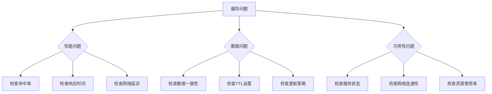

## 💡 面试要点总结

### 设计考虑因素
1. **业务特征**：读写比例、数据热度、一致性要求
2. **性能需求**：延迟要求、吞吐量目标、并发量
3. **可靠性要求**：可用性目标、容错能力、恢复时间
4. **成本控制**：硬件成本、运维成本、开发成本

### 权衡取舍
- **一致性 vs 性能**：强一致性 vs 高性能访问
- **成本 vs 效果**：缓存命中率 vs 存储成本
- **复杂性 vs 可维护性**：功能丰富 vs 系统简单
- **可用性 vs 一致性**：CAP理论在缓存中的应用

### 最佳实践
1. **合理设置TTL**：避免缓存雪崩和数据过期
2. **监控关键指标**：命中率、响应时间、错误率
3. **预案准备**：缓存失效时的降级策略
4. **定期优化**：根据访问模式调整缓存策略

## 🔗 相关链接

- [← 返回系统设计主页](./README.md)
- [数据库设计](./database-design.md)
- [分布式系统](./distributed-systems.md)
- [负载均衡](./load-balancing.md)

---

*缓存是提升系统性能的重要手段，但需要在一致性、性能和复杂性之间找到平衡* ⚡ 