# 设计聊天系统

## 🎯 题目描述

设计一个类似WhatsApp、微信或Slack的实时聊天系统，支持一对一聊天、群聊、文件传输和在线状态显示。

## 📋 需求分析

### 功能需求
1. **实时消息**：支持文本、图片、文件等多种消息类型
2. **一对一聊天**：用户间私人对话
3. **群组聊天**：多人群聊功能
4. **在线状态**：显示用户在线/离线状态
5. **消息历史**：持久化存储聊天记录
6. **消息推送**：离线消息推送通知
7. **已读回执**：消息已读状态显示

### 非功能需求
1. **实时性**：消息延迟<200ms
2. **高可用性**：99.9%系统可用性
3. **大规模**：支持1000万日活用户
4. **数据一致性**：消息顺序和完整性保证

## 📊 容量估算

### 用户规模估算
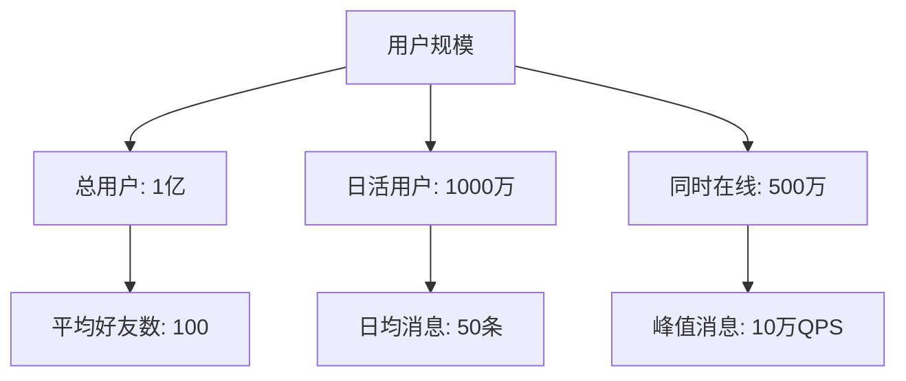

### 存储估算
- **日消息量**：1000万用户 × 50条 = 5亿条消息
- **消息大小**：平均100字节/条
- **日存储增长**：5亿 × 100字节 = 50GB
- **年存储需求**：50GB × 365 = 18TB

## 🏗️ 系统架构设计

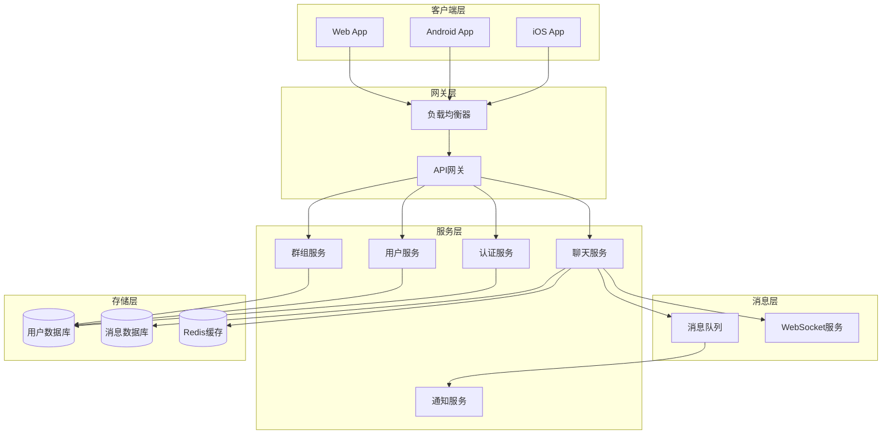

## 🔧 核心组件设计

### 实时通信架构

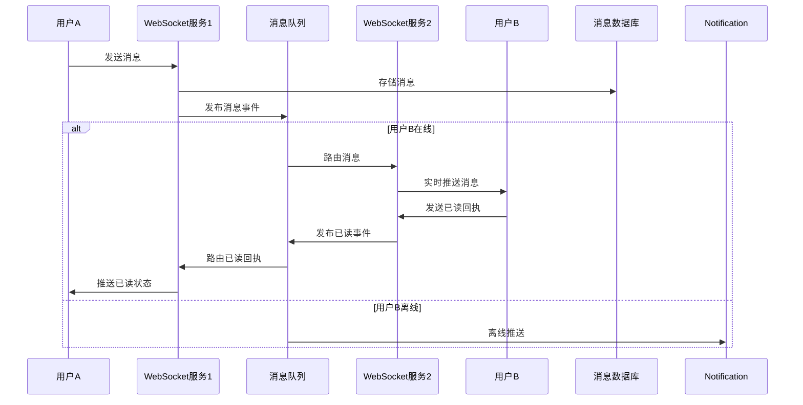

### 消息存储设计

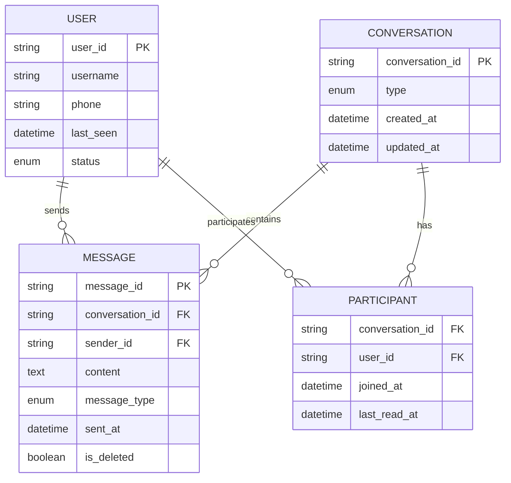

### 在线状态管理

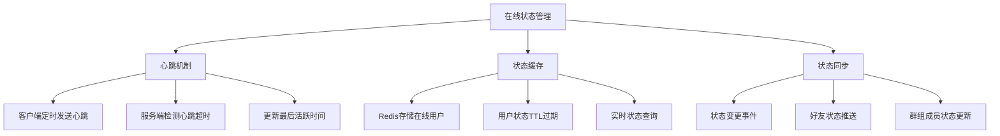

## ⚡ 性能优化

### 消息分片策略

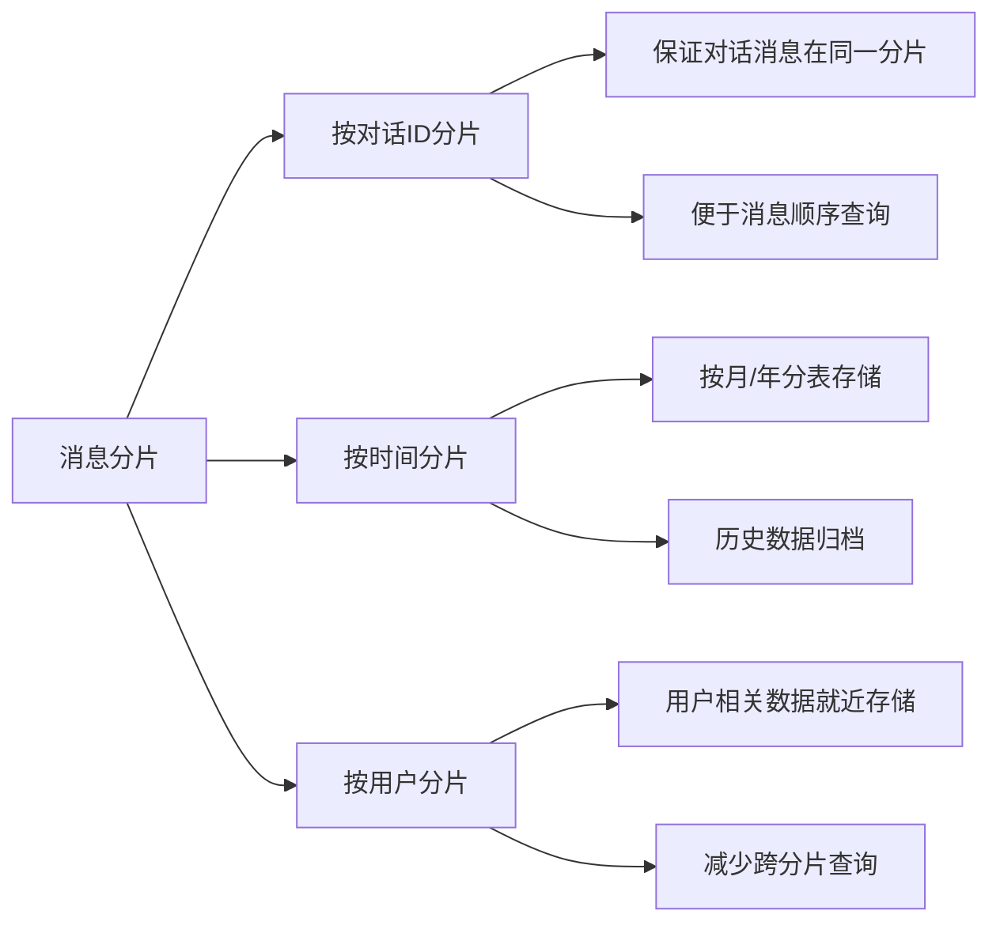

### 缓存策略

| 缓存类型 | 存储内容 | TTL | 更新策略 |
|---------|----------|-----|----------|
| 用户在线状态 | user_id -> status | 5分钟 | 心跳更新 |
| 最近消息 | conversation_id -> messages | 1小时 | 写入时更新 |
| 用户会话列表 | user_id -> conversations | 30分钟 | 懒加载更新 |
| 群组成员信息 | group_id -> members | 1天 | 成员变更时更新 |

## 🔒 数据一致性保证

### 消息顺序保证

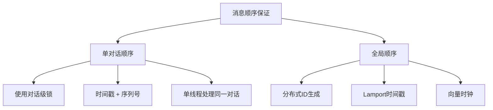

### 消息可靠性传输

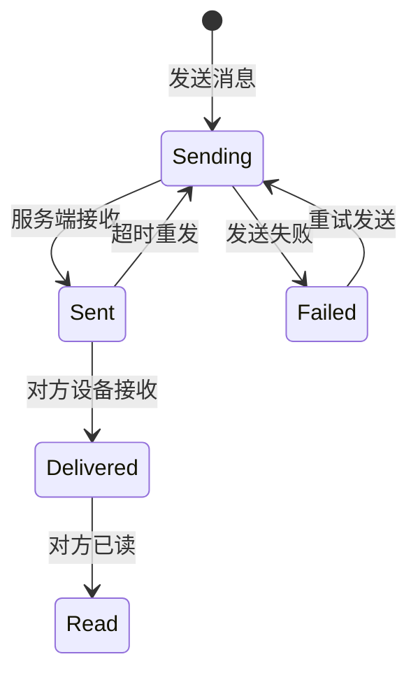

## 📱 移动端优化

### 消息同步策略
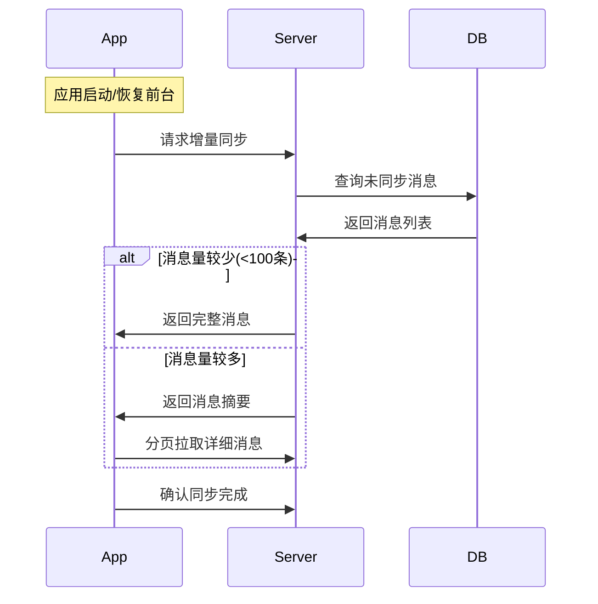

### 离线消息处理
- **消息队列**：为每个用户维护离线消息队列
- **优先级排序**：重要消息优先推送
- **批量推送**：合并多条消息减少推送次数
- **推送策略**：根据用户习惯调整推送时间

## 🌐 多端同步

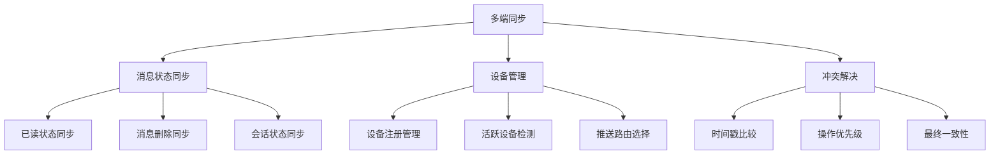

## 🛡️ 安全考虑

### 消息加密
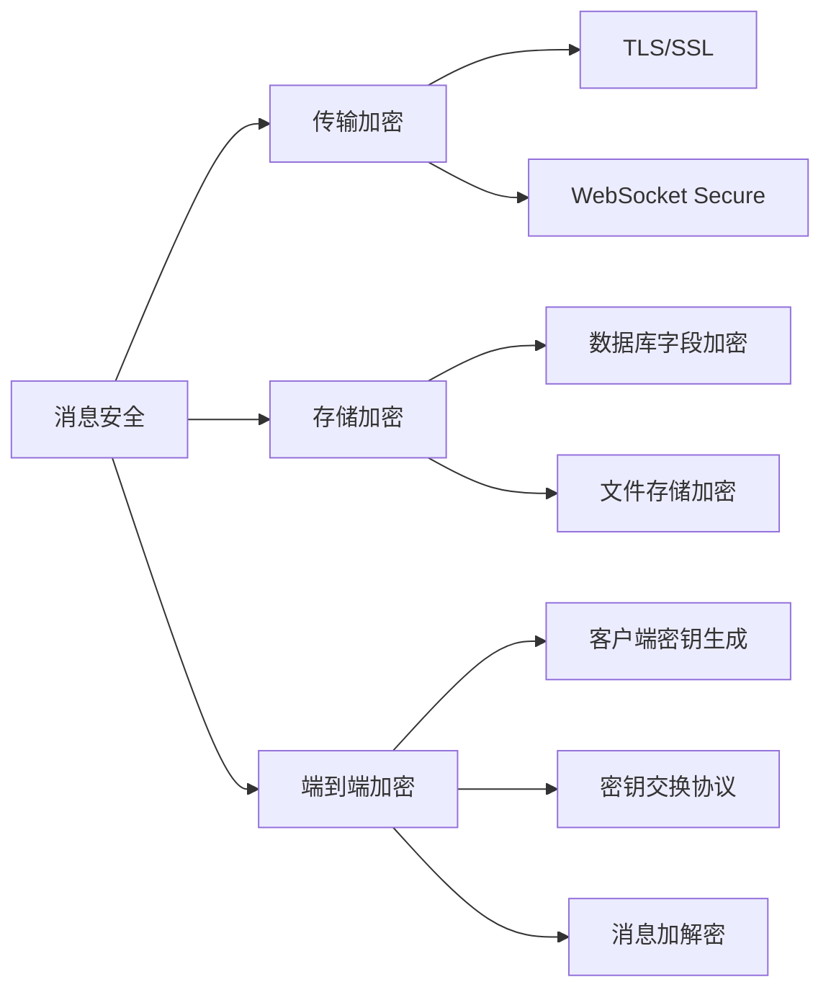

### 防滥用机制
- **频率限制**：每用户每分钟消息数限制
- **内容过滤**：敏感词汇和垃圾信息检测
- **举报机制**：用户举报和管理员审核
- **黑名单**：恶意用户拉黑功能

## 📈 监控告警

### 关键指标
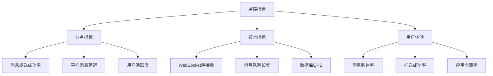

## 💡 面试关键点

### 设计难点讨论
1. **消息顺序性**：
   - 单对话内的消息顺序如何保证？
   - 跨设备消息同步的一致性问题

2. **实时性保证**：
   - 如何选择WebSocket vs HTTP长轮询？
   - 连接断开后的消息如何处理？

3. **扩展性设计**：
   - 如何支持百万级并发连接？
   - 消息存储的分片策略

### 权衡取舍
- **一致性 vs 可用性**：消息顺序 vs 系统可用性
- **存储成本 vs 查询性能**：消息归档 vs 实时查询
- **功能完整性 vs 系统复杂度**：丰富功能 vs 系统维护成本

## 🔗 相关链接

- [← 返回系统设计主页](./README.md)
- [消息队列](./message-queues.md)
- [实时通信技术](./real-time-communication.md)
- [分布式系统](./distributed-systems.md)

---

*聊天系统设计涵盖了实时通信、数据一致性、性能优化等系统设计的核心要素* 💬 