# 数据库设计

## 🎯 核心知识点

- SQL vs NoSQL 选择
- 数据建模与范式设计
- 数据库分片策略
- 主从复制与读写分离
- 数据一致性保证
- 索引设计与优化

## 📊 数据库类型选择框架

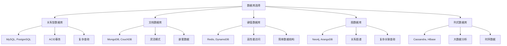

## 💡 面试题目

### **初级** SQL vs NoSQL 选择标准
**题目：** 针对不同的应用场景，如何选择合适的数据库类型？请给出选择标准和理由。

**答案要点：**

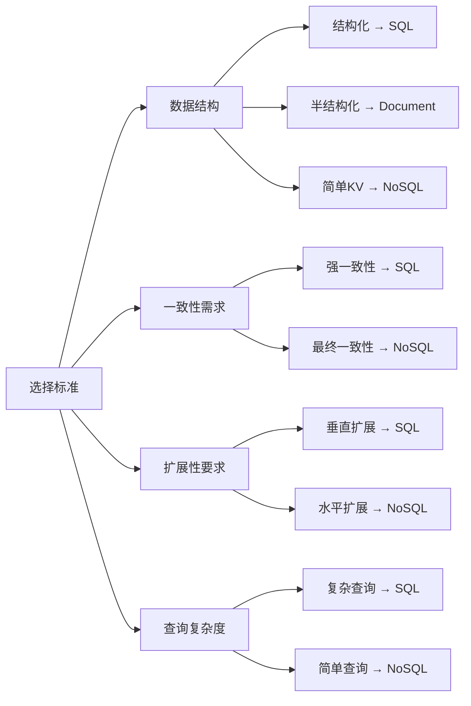

**典型应用场景：**

| 场景 | 推荐方案 | 理由 |
|------|----------|------|
| 电商订单系统 | MySQL + Redis | 事务保证 + 缓存性能 |
| 内容管理系统 | MongoDB | 灵活的文档结构 |
| 实时推荐系统 | Redis + Elasticsearch | 高性能读取 + 搜索 |
| 社交网络关系 | Neo4j + MySQL | 图查询 + 基础数据 |
| 日志分析系统 | ClickHouse + Kafka | 列式存储 + 流处理 |

### **中级** 数据库分片设计
**题目：** 设计一个支持千万级用户的社交平台数据库分片方案，考虑用户数据、关系数据和内容数据的分片策略。

**答案要点：**

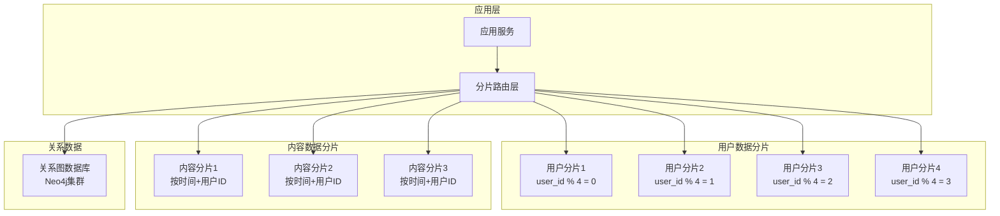

**分片策略选择：**

1. **水平分片（Horizontal）**
   - 按用户ID哈希分片
   - 按时间范围分片
   - 按地理位置分片

2. **垂直分片（Vertical）**
   - 用户基础信息单独存储
   - 用户动态内容单独存储
   - 关系数据单独存储

3. **跨分片查询解决方案**
   ```mermaid
   sequenceDiagram
       participant App as 应用层
       participant Router as 路由层
       participant Shard1 as 分片1
       participant Shard2 as 分片2
       participant Aggregator as 聚合层
       
       App->>Router: 跨分片查询请求
       Router->>Shard1: 子查询1
       Router->>Shard2: 子查询2
       Shard1->>Aggregator: 返回结果1
       Shard2->>Aggregator: 返回结果2
       Aggregator->>App: 合并返回结果
   ```

### **高级** 数据一致性架构设计
**题目：** 在分布式环境下，如何设计一个既保证数据一致性又支持高可用性的数据库架构？

**答案要点：**

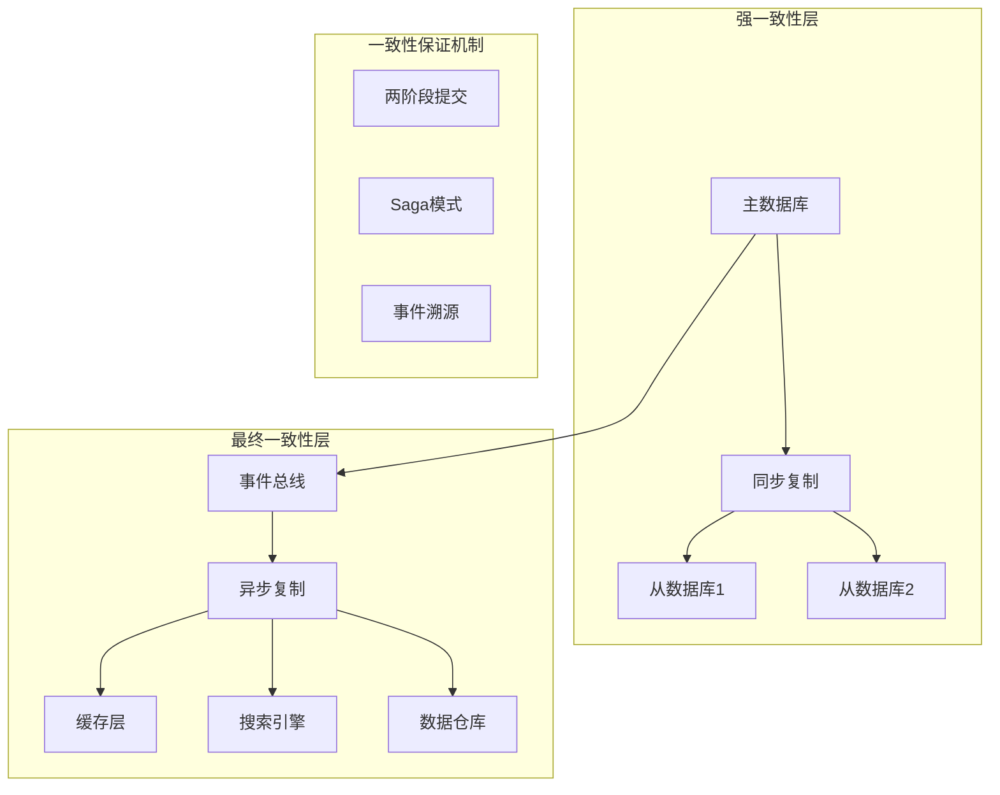

**一致性级别选择：**

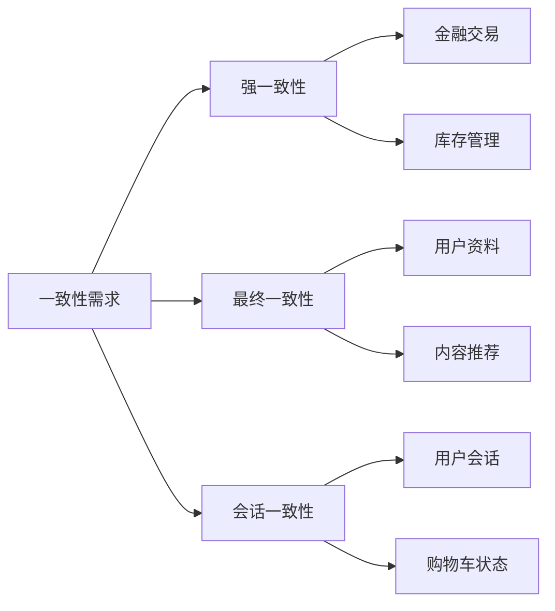

## 🔧 数据建模最佳实践

### 关系型数据库设计

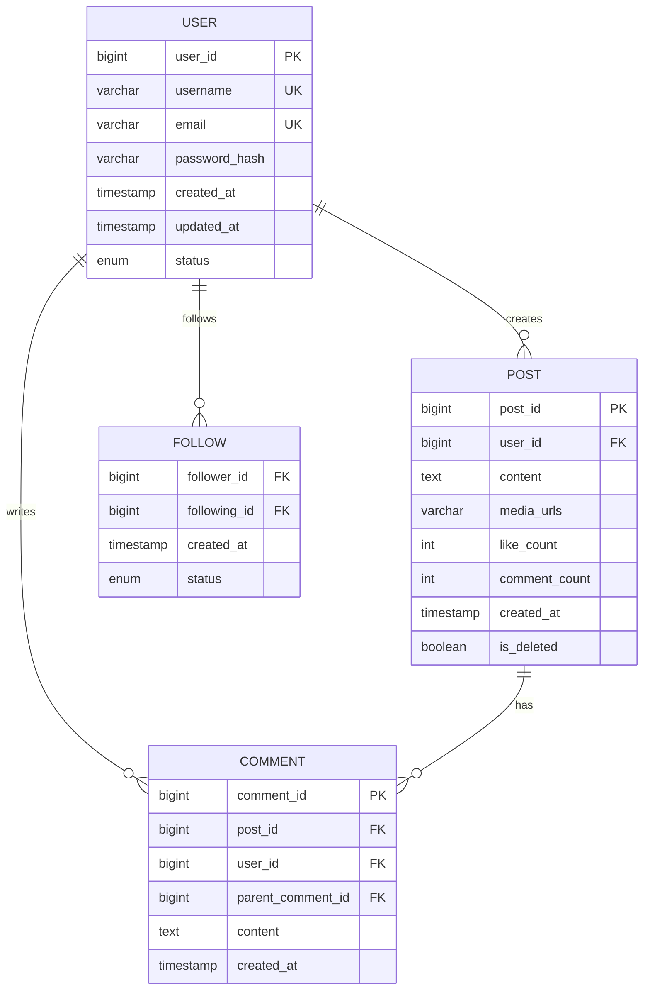

### NoSQL文档设计

```json
// 用户文档 (MongoDB)
{
  "_id": ObjectId("..."),
  "username": "john_doe",
  "email": "john@example.com",
  "profile": {
    "avatar": "https://...",
    "bio": "Software Developer",
    "location": "San Francisco"
  },
  "stats": {
    "followers": 1250,
    "following": 300,
    "posts": 45
  },
  "created_at": ISODate("..."),
  "updated_at": ISODate("...")
}

// 嵌入式评论设计
{
  "_id": ObjectId("..."),
  "content": "Post content...",
  "user_id": ObjectId("..."),
  "comments": [
    {
      "comment_id": ObjectId("..."),
      "user_id": ObjectId("..."),
      "content": "Comment content...",
      "created_at": ISODate("..."),
      "replies": [
        {
          "reply_id": ObjectId("..."),
          "user_id": ObjectId("..."),
          "content": "Reply content...",
          "created_at": ISODate("...")
        }
      ]
    }
  ]
}
```

## ⚡ 性能优化策略

### 索引设计原则

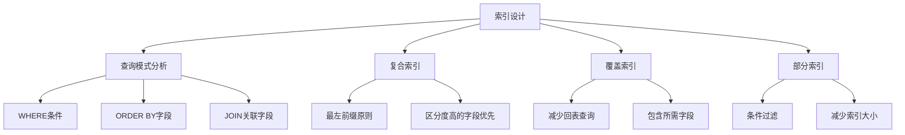

### 读写分离架构

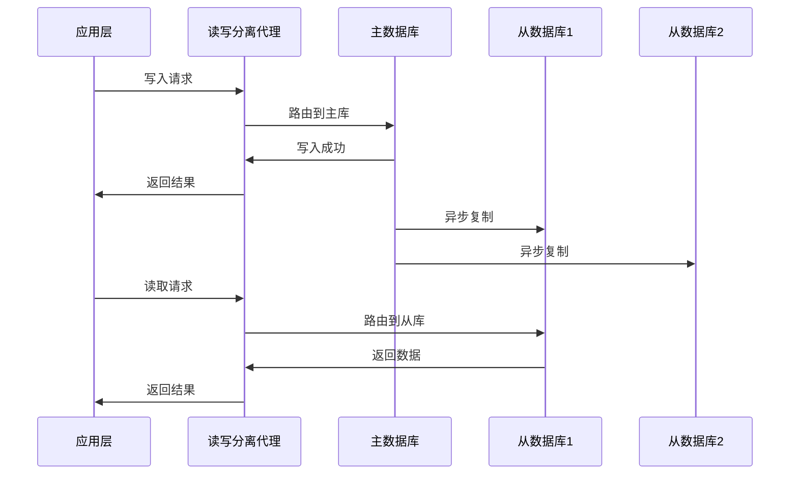

## 🔒 数据安全与备份

### 数据加密策略

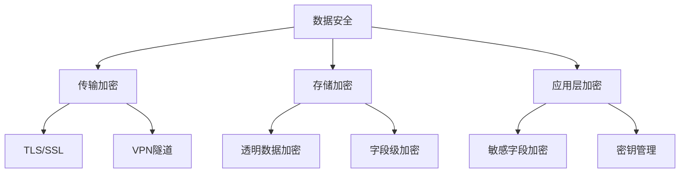

### 备份恢复策略

| 备份类型 | 频率 | 恢复时间 | 存储成本 | 适用场景 |
|----------|------|----------|----------|----------|
| 全量备份 | 每周 | 较长 | 高 | 完整数据恢复 |
| 增量备份 | 每日 | 中等 | 中 | 日常数据保护 |
| 差异备份 | 实时 | 较短 | 中 | 快速恢复 |
| 日志备份 | 实时 | 最短 | 低 | 点时间恢复 |

## 📈 监控与优化

### 数据库性能指标

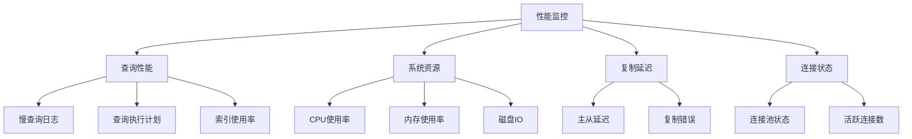

### 容量规划

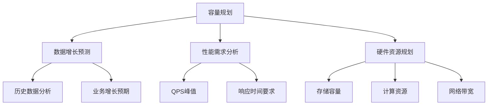

## 💡 面试要点总结

### 设计决策考虑因素
1. **数据特征**：结构化程度、数据量大小、增长速度
2. **访问模式**：读写比例、查询复杂度、一致性要求
3. **性能要求**：延迟要求、吞吐量需求、可用性目标
4. **技术约束**：团队技能、运维能力、成本预算

### 常见权衡取舍
- **一致性 vs 可用性**：CAP理论的权衡选择
- **性能 vs 灵活性**：专用数据库 vs 通用数据库
- **成本 vs 性能**：存储成本 vs 查询性能
- **复杂性 vs 可维护性**：功能丰富 vs 系统简单

## 🔗 相关链接

- [← 返回系统设计主页](./README.md)
- [缓存系统](./caching-systems.md)
- [分布式系统](./distributed-systems.md)
- [数据处理](./data-processing.md)

---

*数据库设计是系统架构的核心，需要在多个维度间找到最佳平衡点* 🗄️ 