# 分布式系统

## 🎯 核心知识点

- 分布式系统基本概念
- CAP理论与PACELC定理
- 一致性模型与协议
- 分布式存储系统
- 服务发现与注册
- 分布式锁与协调

## 📊 分布式系统核心挑战

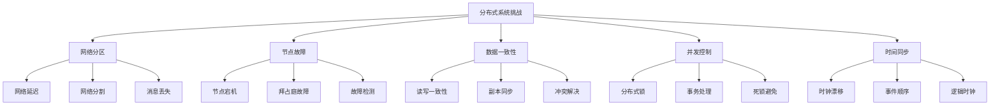

## 💡 面试题目

### **初级** CAP理论深度理解
**题目：** 详细解释CAP理论，并分析为什么不能同时满足一致性、可用性和分区容错性？请举例说明。

**答案要点：**

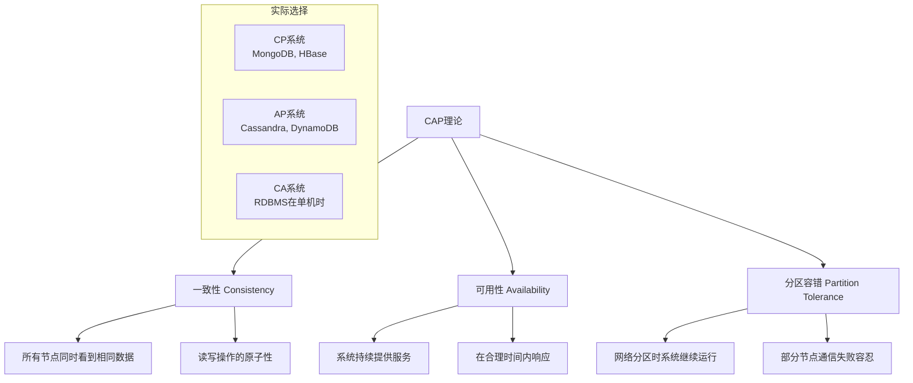

**PACELC扩展理论：**
- **P**artition时：选择**A**vailability还是**C**onsistency
- **E**lse（无分区时）：选择**L**atency还是**C**onsistency

**实际案例分析：**
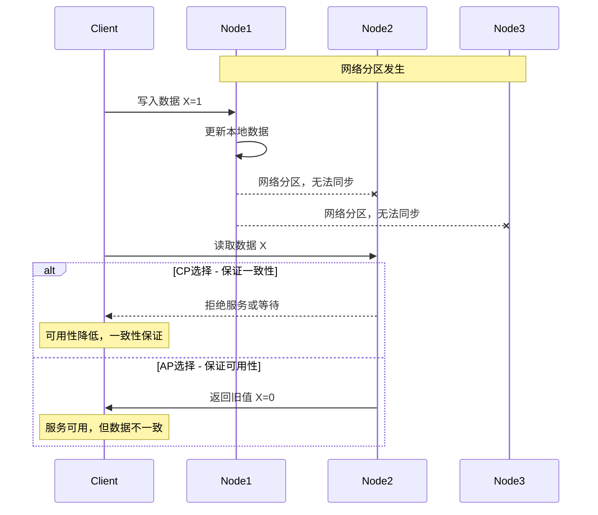

### **中级** 分布式一致性协议设计
**题目：** 比较Raft、Paxos和PBFT等一致性协议，分析它们的适用场景和性能特点。

**答案要点：**

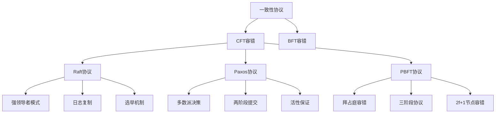

**协议对比分析：**

| 特性 | Raft | Paxos | PBFT |
|------|------|-------|------|
| 理解难度 | 简单 | 复杂 | 中等 |
| 实现复杂度 | 中等 | 高 | 高 |
| 性能开销 | 低 | 中 | 高 |
| 容错类型 | 故障停止 | 故障停止 | 拜占庭故障 |
| 节点要求 | 2f+1 | 2f+1 | 3f+1 |
| 典型应用 | etcd, MongoDB | Chubby, Spanner | 区块链, 金融系统 |

**Raft协议状态机：**
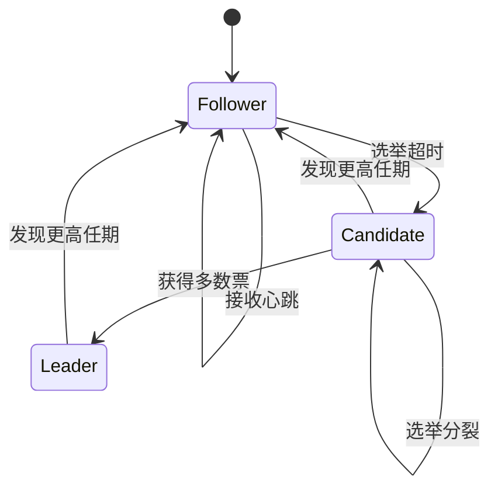

### **高级** 分布式存储系统架构
**题目：** 设计一个支持PB级数据存储的分布式文件系统，需要考虑数据分片、副本管理、故障恢复等问题。

**答案要点：**

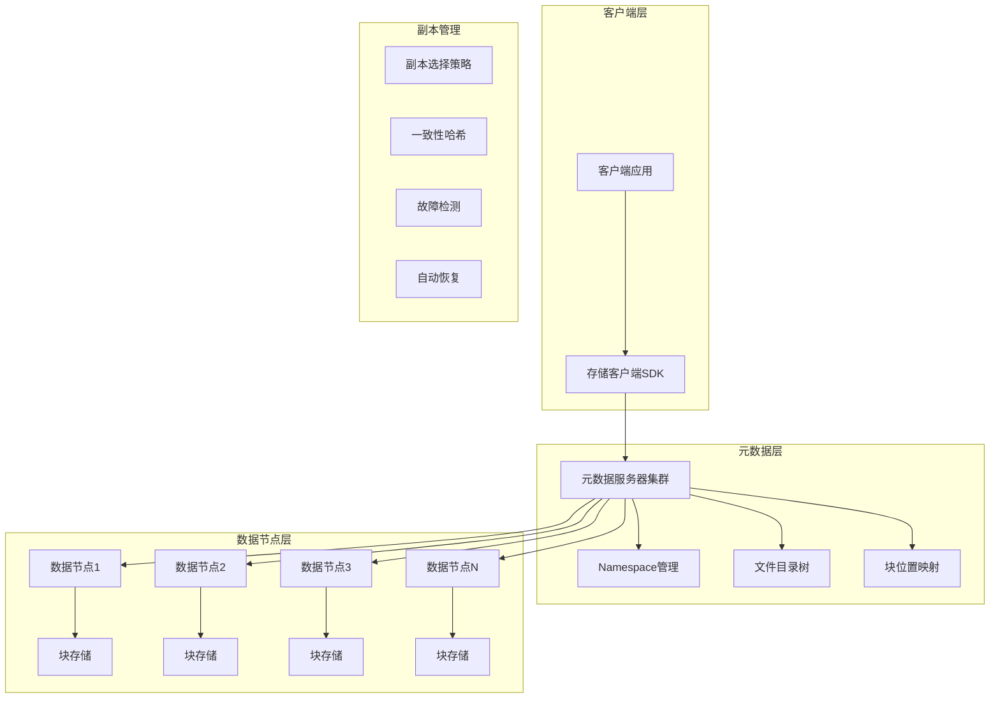

**数据分片策略：**

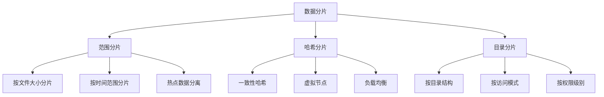

## ⚡ 分布式系统模式

### 数据复制模式

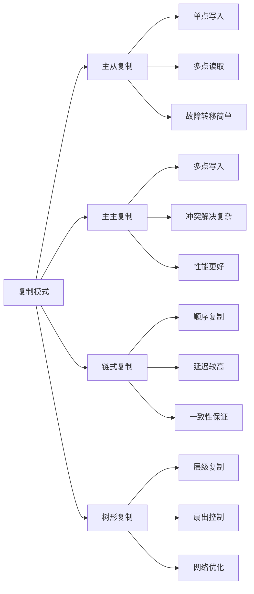

### 服务发现机制

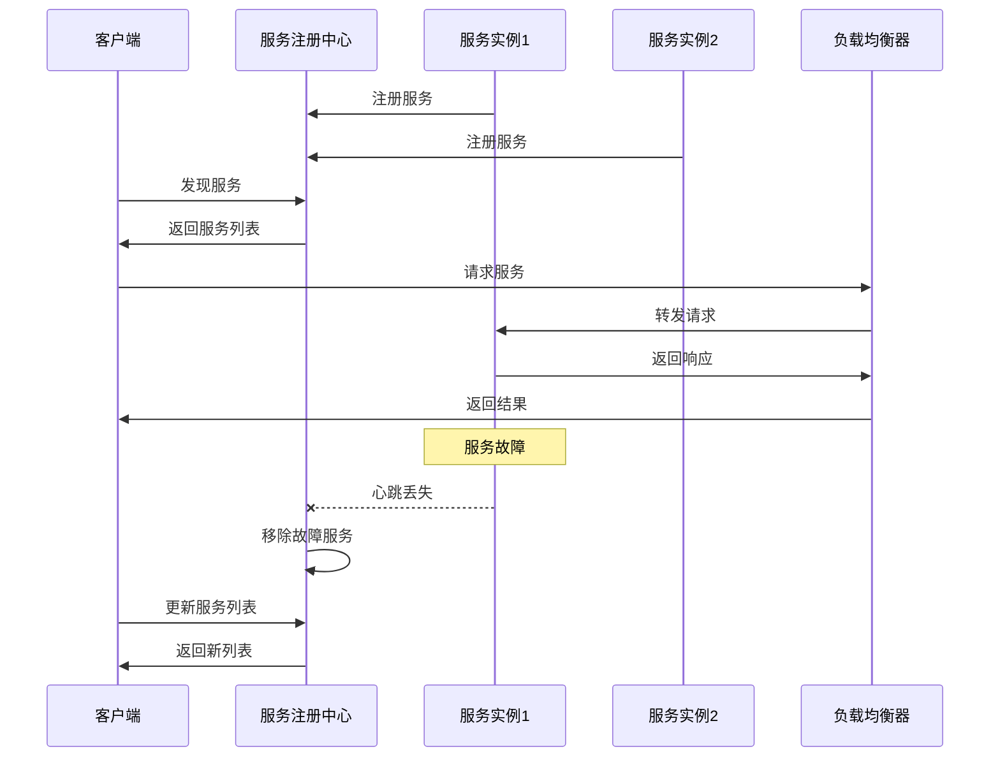

## 🔧 关键技术实现

### 分布式锁实现

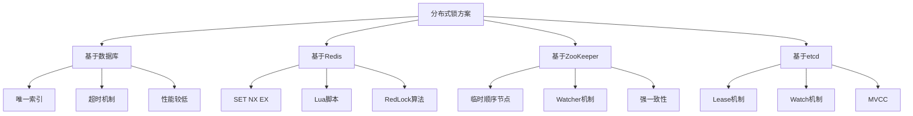

### 时钟同步方案

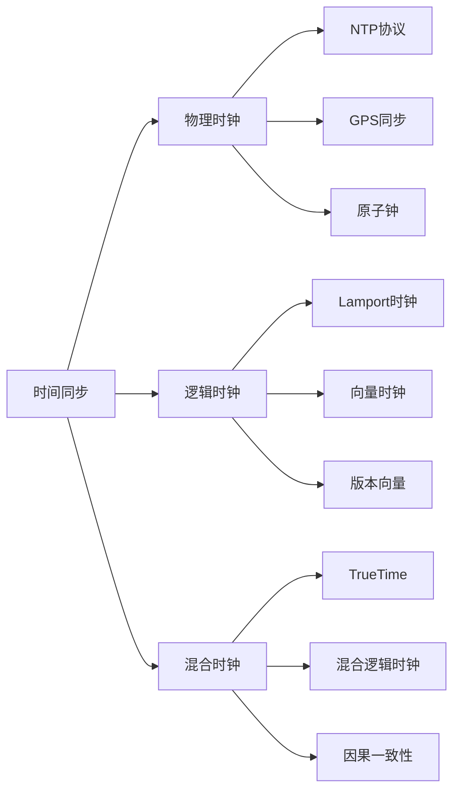

## 🛡️ 故障处理策略

### 故障检测机制

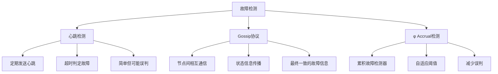

### 故障恢复流程

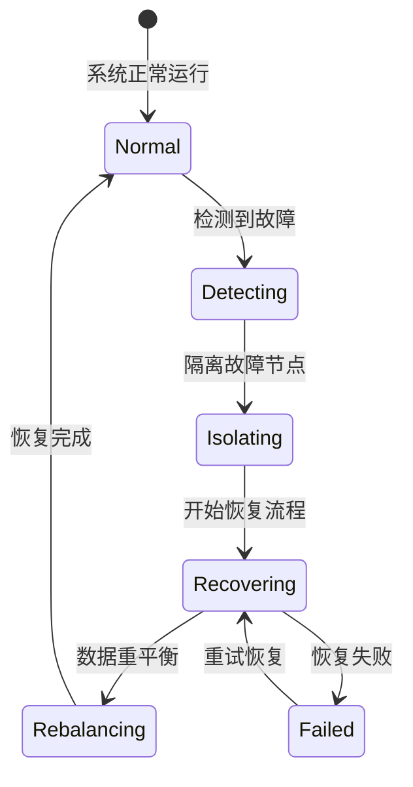

## 📈 性能优化

### 读写性能优化

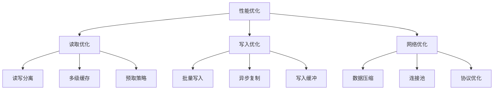

### 扩展性设计

| 扩展方式 | 优势 | 劣势 | 适用场景 |
|----------|------|------|----------|
| 垂直扩展 | 简单、无需修改架构 | 成本高、有上限 | 小规模应用 |
| 水平扩展 | 成本低、理论无限 | 复杂度高、一致性难 | 大规模应用 |
| 功能分片 | 隔离性好、易管理 | 跨片查询困难 | 多租户系统 |
| 地域扩展 | 延迟优化、容灾 | 一致性复杂 | 全球化应用 |

## 💡 面试要点总结

### 设计考虑要素
1. **一致性需求**：强一致性 vs 最终一致性
2. **可用性目标**：系统的SLA要求
3. **性能要求**：延迟、吞吐量、并发量
4. **扩展性规划**：数据增长、用户增长预期

### 技术选型权衡
- **CP vs AP**：根据业务特点选择一致性还是可用性
- **同步 vs 异步**：性能与一致性的权衡
- **集中式 vs 分布式**：简单性与扩展性的权衡
- **强一致 vs 弱一致**：性能与正确性的权衡

### 常见误区
❌ **忽视网络分区**：假设网络永远可靠
❌ **过度设计**：一开始就使用复杂的分布式方案
❌ **忽视运维复杂度**：只考虑功能不考虑维护成本
❌ **盲目追求一致性**：不根据业务需求选择一致性级别

## 🔗 相关链接

- [← 返回系统设计主页](./README.md)
- [系统设计基础](./system-design-fundamentals.md)
- [数据库设计](./database-design.md)
- [缓存系统](./caching-systems.md)

---

*分布式系统是现代大规模应用的基础，理解其核心原理对系统设计至关重要* 🌐 